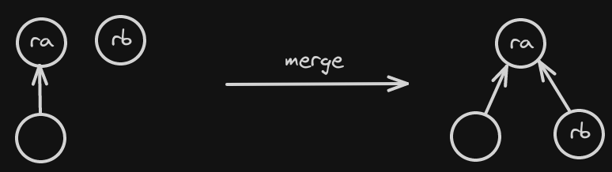
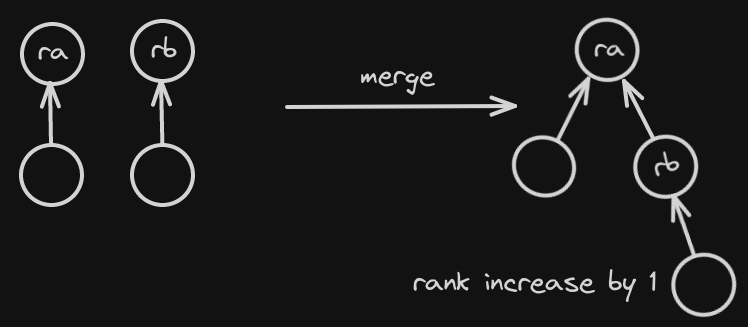
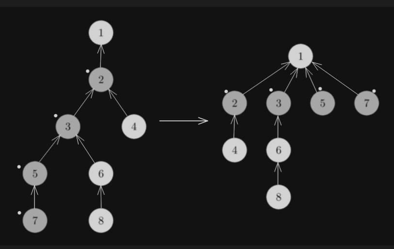

# Disjoint Set Union

Two sets are called disjoint sets if they don’t have any element in common i.e the intersection of sets is a **null** set. A data structure that stores non overlapping or disjoint subset of elements is called **disjoint set data structure**.

Consider a set of nodes known as elements, initially all the elements are set of their own. We want to be able to merge $2$ sets and check if $2$ elements belong to same set or not. Each set is stored in a **tree** like format in which each node has a **parent** except the **root** (root is parent of itself) and the root of the tree is the **representative element of the set**.

The disjoint set data structure supports following operations:

* Adding new sets to the disjoint set.

* Merging disjoint sets to a single set using Union operation.

* Finding representative of a disjoint set using Find operation.

* Check if two sets are disjoint or not.

There are many applications of DSU, a common application is with a number of persons and the following tasks to be performed on them:

* Add a new friendship relation, i.e. a person x becomes the friend of another person y i.e adding new element to a set.

* Find whether individual x is a friend of individual y (direct or indirect friend).

DSU can perform all these operations in constant time i.e $O(1)$ average time.

This is also called **Union Find** Algorithm.

There are 2 primary implementations of union find algorithm, one is union by rank and other is union by size.

## Union By Rank

Rank of a set is the height of the tree that represents the set. Rank of a tree is stored at the representative element of the tree. Rank of non-representative element is the rank of its set's representative element i.e to find its rank we find the representative element and then we find that representative's rank.

**Setup Of DSU**

We start with two arrays `rank` and `parent`, one will store the rank of set and other will store the parent of each element. Initially `rank[i] = 0` for each element `i` and `parent[i] = i`. 

Parent array stores the parent of the current element in the set's tree. Parent of **root** of tree i.e representative element is itself.

**Merge Operation**

If we want to merge two elements `a` and `b` then first we find the representative elements of set in which `a` and `b` are present, let they be `ra` and `rb`. Now we find the the heights of the sets through `rank[ra]` and `rank[rb]` and then we compare them. There are 2 cases that arise,

1. `rank[ra] > rank[rb]`: in this case we simply make `ra` the parent of `rb` and thats it. Since `rank[rb]` is smaller then `rank[ra]` then height of tree doesn't change. This is shown in below diagram. The case of `rank[rb] > rank[ra]` is similar.

   

2. `rank[ra] == rank[rb]`: In this we can make any one the parent of other and increase its rank by $1$. For example we make `ra` the parent of `rb`, then `rank[ra]` increases by $1$. This is shown in example below.

   

**Time Complexity:** In this way the number of operations where the height increases is actually very small and it have been shown that for `n` elements the height increases at most by $\log(n)$​​​.

<details>
	<summary>Proof</summary>
    <br>
    Minimum nodes required to get rank <b>1</b> is <b>2</b>. And minimum number of nodes required to get a rank of 2 is <code>2 * minimum nodes for rank 1 = 2 * 2 = 4</code>. Minimum number of node to get rank 3 is <code>2 * minimum nodes for rank 2 = 2 * 4 = 8</code> and so on.
    <br><br>
    Hence we can say that to get rank of <b>i</b> we need need <b>2<sup>i</sup></b> nodes.
</details>

Code For merge operation is shown below.

```c++
void merge(int u, int v)
{
    int ru = find_set(u);	// representative of set of u
    int rv = find_set(v);	// representative of set of v
    if(rank[ru] > rank[rv])
    {
        parent[rv] = ru;
    }
    else if(rank[rv] > rank[ru])
    {
        parent[ru] = rv;
    }
    else
    {
        parent[rv] = ru;
        rank[ru] += 1;
    }
}
```

**Finding Representative Element**

Finding The representative element is a simple recursion function where we keep going above in the tree as long as parent of current element is not the element itself. This is shown in the code below.

```c++
int find_set(int v)
{
    if(parent[v] == v)
        return v;
   	return find_set(parent[v]);
}
```

**Time Complexity:** From the code above we can see that time complexity of merge operation is same as time complexity of `find_set` as we do constant work otherwise. The time complexity of `find_set` is $O(height)$ and heigth is $O(logn)$. But this is still not $O(1)$ operation, to achieve constant time complexity in all operations, we need to do something known as **path compression optimization**.

**Path Compression Optimization**

This optimization is designed for speeding up `find_set`.

If we call `find_set(v)` for some vertex `v`, we actually find the representative `p` which is also representative for all vertices that we visit on the path between `v` to `p`. Now the next time when we call for `find_set(v)`, we would again have to go on the same path again, and this is not efficient. The trick is to make the paths for all those nodes shorter, by setting the parent of each visited vertex directly to `p`, hence compressing the path's and hence the name of the optimization.

You can see the operation in the following diagram. On the left there is a tree, and on the right side there is the compressed tree after calling `find_set(7)`, which shortens the paths for the visited nodes 7, 5, 3 and 2.



The new implementation of `find_set` is as follows:

```c++
int find_set(int v) {
    if (v == parent[v])
        return v;
    return parent[v] = find_set(parent[v]);
}
```

The simple implementation does what was intended: first find the representative of the set (root vertex), and then in the  process of stack unwinding the visited nodes are attached directly to  the representative.

This simple modification of the operation already achieves the time complexity of $O(\alpha(n))$ where $\alpha(n)$ is known as **Inverse Ackermann Function** which grows slowly ( $\alpha(n) \approx \log(\log(n))$ ), for $n < 10^6$, it does not even cross $4$​.

**Note:** After path compression the meaning of **rank** becomes ambigious as height of tree keeps changing, in a way we can say that **rank** is the maximum height that tree obtained.

## Union By Size

In this method, every thing is same as union by rank, the only difference is that, in place of rank (height) of tree we store the size of the tree. This is particularly usefull as sometimes we need the size of the set to solve some problems.

Initially size of each tree is $1$, then we merge $2$ sets then we merge tree with small size into tree with large size and add the size of small tree into size of large tree. If the size is same we can merge any one to another.

Below is the implementation of merge function by size.

```c++
void merge(int a, int b)
{
    int ra = find_set(a);
    int rb = find_set(b);
    if(size[ra] >= size[rb])
    {
        parent[rb] = ra;
        size[ra] += size[rb];
    }
    else
    {
        parent[ra] = rb;
        size[rb] += size[ra];
    }
}
```

**Lets discuss some common problems related to DSU**

**Problem**: find number of connected components using dsu.

**Solution**: the idea is that we will go over every edge and push the endpoints into the same set using union operation. Then in our dsu structure will have number of subsets which is equal to number of connected components. But how to find the number of subsets. Each subset is represented by the root node or the ultimate parent, so we will go over each node and count nodes who are their own parent.

**Problem:** Given a weighted edge tree with $n$ nodes and a function $d(i, j)$ which is equal to the minimum weight edge in path from node $i$ to $j$. We need to find $\sum_{i=1}^{i=n} \sum_{j=i+1}^{j=n} d(i, j)$ i.e $d(i, j)$ for all pairs $i$ and $j$​.

**Solution:** The idea is that we start with all vertices disconnected and add edged in decreasing order of weight. When adding an edge $i$ connecting vertices $a$ and $b$ we know that for all edges $j$ that came before $i$, $weight_i <= weight_j$, which means $weight_i$ is the answer for all $d(u,v)$ such that $u \in S_a$ and $v \in S_b$ where $S_a$ and $S_b$ are sets containing vertex $a$ and $b$. Number of such pairs $= size[S_a] * size[S_b]$. Hence, contributions of edge $i$ to final answer $= weight[i] * size[S_a] * size[S_b]$. Here the sizes of sets can be obtained using dsu in $O(1)$ time.

**Problem:** Given a graph with $n$ nodes and $q$ queries. Each query contains of two nodes $u$ and $v$, we need to remove edge between these nodes and print the number of connected components in the graph after each query.

**Solution:** We need to process the queries in reverse order and adding an edge is similar to union operation and when we are merging two disjoing sets then number of components decrease by $1$.

**Some More Practice Problems**

[Accounts Merging Problem](https://practice.geeksforgeeks.org/problems/account-merge/1)

[Number Of Islands](https://practice.geeksforgeeks.org/problems/number-of-islands/1)

[Maximum Connected Group](https://practice.geeksforgeeks.org/problems/maximum-connected-group/1)

[Maximum Stone Removal](https://practice.geeksforgeeks.org/problems/maximum-stone-removal-1662179442/1)