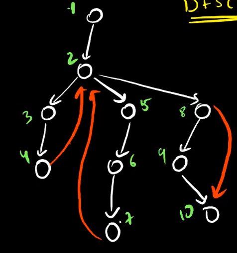

# Cycle Detection Algorithms:

## Cycle Detection In Undirected Graph

Detecting Cycle in undirected graph is simple, we can do a bfs or a dfs and if we reach a node that is not a parent and is visited this means there is a cycle.

```c++
bool CycleDetectionBFS(vector<vector<int>>& graph, int src = 1)
{
	int n = adj.size();
	vector<int> visited(n+1);
    vector<int> parent(n+1);
	queue<int> q;
	q.push(src);
	visited[src] = 1;
	while(!q.empty())
	{
		int node = q.front();
		q.pop();
		for(int adjNode:graph[node])
		{
            if(adjNode == parent[node]) continue;
            if(visited[adjNode]) return true; // visited node which is not parent
            q.push(adjNode);
            visited[adjNode] = true;
            parent[adjNode] = node;
		}
	}
	return false;
}
```

If we also need to print the cycle, then we will store the parent of each node in a vector and when we detect a cycle we can keep going to parent of node until the end of cycle is reached as shown in code below using dfs.

```c++
bool printAnyCycle(vector<vector<int>>& neighbours, vector<int>& parent, vector<int>& visited, int node, int p)
{
	parent[node] = p;
	visited[node] = 1;
	for(int adjNode:neighbours[node])
	{
		if(!visited[adjNode])
		{
			bool cycleFound = printAnyCycle(neighbours, parent, visited, adjNode, node);
			if(cycleFound) return;	// cycle found and printed
		}
		else
		{
			// found a cycle whose end is adjNode
			int currNode = node;
			while(currNode != adjNode)
			{
				cout << currNode << ' ';
				currNode = parent[currNode];
			}
			cout << currNode << '\n';
			return true;
		}
	}
	return false;
}
```

**Note:** above code prints one of the cycles, if we want we can change it to print more than 1 cycle but we cannot print all of the cycles present in the graph in linear time.

**Problem:** Counting Number Of Nodes that are part of atleast 1 cycle.  
**Solution:** This problem is not easy to solve, the idea of solution is that when we detect a cycle then in dfs will will have all elements of that cycle present, if we add 1 to currentNode and add -1 to parent of last node in cycle (like we do in partial sums) then we can later do prefix sum in such an order of nodes that the 1 propagates to all parents of this node and gets cancelled by -1 of node that is parent of last node.

</img>

Look at the above graph, here when we reach `4` and explore the edge `(4,2)` we see that `2` is already visited, then we add +1 to `cnt[4]` and -1 to `cnt[1]` which is parent of `2`, now along with this we will also store the dfs order of nodes i.e order in which there dfs was ended, a possible dfs order of above graph can be

    [4, 3, 7, 6, 5, 10, 9, 8, 2, 1]

Here if we loop over this and in each iteration do `cnt[parent[v]] += cnt[v]`, then `4` will add 1 to `3`, then `3` will add this 1 to `2`, and `2` adds this 1 to `1` which already has -1 so it will cancel. Finally all nodes that have `cnt[node] > 0` we say are part of some cycle.

```c++
vector<int> visited;
vector<int> parent;
vector<int> cnt;
vector<int> dfsOrder;
void dfs(vector<int> graph[], int node, int p)
{
	visited[node] = 1;
	parent[node] = 1;
	for(int adjNode:graph[node])
	{
		if(!visited[node])
		{
			dfs(graph, adjNode, node);
		}
		else
		{
			// cycle detected
			cnt[node]++;
			cnt[parent[adjNode]]--;
		}
	}
	dfsOrder.push_back(node);
}

void nodeThatArePartOfCycle(vector<int> graph[], int n)
{
	visited.assign(n+1, 0);
	parent.assign(n+1, 0);
	cnt.assign(n+1, 0);
	dfsOrder.clear();
	for(int node = 1; node <= n; node++)
	{
		if(visited[node]) continue;
		dfs(graph, visited, parent, cnt, node, 0);	// defaulting 0 as parent
	}

	// prefix sum of parents of elements in dfs order
	for(int node:dfsOrder)
	{
		cnt[parent[node]] += cnt[node];
	}

	// finding nodes that part of some cycle
	for(int node = 1; node <= n; node++)
	{
		if(cnt[node] > 0) cout << node << ' ';
	}
	cout << '\n';
}
```

**Problem:** Given a undirected graph we need to find the length of smallest cycle. Here number of nodes in graph `n <= 2500` and number of edges `m <= 5000`.

**Solution:** The idea for the solution is that we can find the smallest cycle that a node is part of using bfs. When doing bfs if we encounter a node that is visited and is not parent of current node then we say there is cycle, in fact when the first time this happens that is the smallest cycle possible, the length of this cycle will be `distance[currNode] + distance[neighbourNode] + 1`. Hence we can find smallest cycles that a node is part of for every node and minimum of that would be our answer.

```c++
int n, m;
vector<vector<int>> g;

int bfs(int source)
{
    vector<int> distance(n+1, -1);
    vector<int> parent(n+1);
    queue<int> q;
    q.push(source);
    distance[source] = 0;
    while(!q.empty())
    {
        int node = q.front();
        q.pop();
        for(int v : g[node])
        {
            if(v == parent[node]) continue;
            if(distance[v] != -1)
            {
                // cycle detected
                return distance[node] + distance[v] + 1;
            }
            else
            {
                parent[v] = node;
                distance[v] = distance[node] + 1;
                q.push(v);
            }
        }
    }
    return -1;
}

void solve()
{
    cin >> n >> m;
    g.assign(n+1, vector<int>());
    forn(i, 0, m)
    {
        int u, v; cin >> u >> v;
        g[u].pb(v);
        g[v].pb(u);
    }
    int res = -1;
    for(int i = 1; i <= n; i++)
    {
        // get smallest cycle that node i is part of
        int currLen = bfs(i);
        if(currLen == -1) continue;
        if(res == -1 || res > currLen) res = currLen;
    }
    cout << res << nline;
}
```

---

## Cycle Detection In Directed Graph

**General DFS Based Algorithm**

The algorithm used for undirected graphs where we check if there is a node which is visited and is not parent node, then we say there is a cycle, this won't work in case of directed graph, because any node which has two other nodes pointing to it will cause above algorithm to return true, but in reality there might be no cycle. Like in the example below, in dfs we go to node 8 -> 9 -> 10 and mask 10 as visited and then we return back to 8 and when we explore edge (8, 10) we see that 10 is visited but we cannot say that there is a cycle.

</img>

For cycle to exist when we see that a node is visited then if that node also present in current dfs path, then it means there is path from that node to current node and there is edge between current node and that node. Like in above example we see that when dfs reached 4 it has a neighbour 2 which is already visited and it also in current dfs path so we say there a cycle. Hence we keep track of what nodes are currently in dfs using another array as shown in code below.

```c++
class CycleDetectionDirectedGraph
{
	bool dfs(vector<int> adj[], vector<int>& visited, vector<int>& onPath, int u)
	{
		visited[u] = true;
		onPath[u] = true;
		for(int v:adj[u])
		{
			if(!visited[v])
			{
				if(dfs(adj, visited, onPath, v) == true) return true;
			}
			else if(onPath[v]) return true;
		}
		onPath[u] = false;
		return false;
	}
	public:
	// Function to detect cycle in a directed graph.
	bool isCyclic(int v, vector<int> adj[])
	{
		vector<int> visited(v), onPath(v);
		for(int i = 0; i < v; i++)
		{
			if(visited[i]) continue;
			if(dfs(adj, visited, onPath, i) == true) return true;
		}
		return false;
	}
};
```

**Note:** we can do functionality of visited and onPath using just one array only, if nodes are unvisited we say color[node] = 1, then when node is visited and on path we say color[node] = 2, and when we return from its dfs call we say color[node] = 3.

**Cycle Detection Using Kahn's Algorithm**

We know topological sort only exist for DAG, but if the graph has a cycle then there will always be nodes which point to each other in a cycle and when using kahn's algorithm to find the topological sort we will never able to make in degree of nodes in a cycle equal to 0 and hence they will never go into the queue hence we can say that our topological sort array's size will never be equal to n i.e number of nodes in the graph.

```c++
bool isCyclicKahnAlgorithm(int v, vector<int> adj[])
{
	vector<int> inDegree(v);
	for(int i = 0; i < v; i++)
	{
		for(int node:adj[i])
		{
			inDegree[node]++;
		}
	}

    queue<int> q;

    for(int i = 0; i < v; i++)
    {
        if(inDegree[i] == 0) q.push(i);
    }

    vector<int> ans;

    while(!q.empty())
    {
        int node = q.front();
        q.pop();
        ans.push_back(node);
        for(int adjNode:adj[node])
        {
            inDegree[adjNode]--;
            if(inDegree[adjNode] == 0) q.push(adjNode);
        }
    }

    return (ans.size() != v);

}
```

**_Some Practice Problems_**

[Eventual Safe States](https://practice.geeksforgeeks.org/problems/eventual-safe-states/1)  
[Prerequisite Tasks](https://practice.geeksforgeeks.org/problems/prerequisite-tasks/1)  
[Course Schedule](https://practice.geeksforgeeks.org/problems/course-schedule/1)  
[Alien Dictionary](https://practice.geeksforgeeks.org/problems/alien-dictionary/1)

In Problem Eventual Safe States, we can solve it using dfs and cycle detection. But we can also solve it using kahn's algorithm. The idea is that terminal nodes have out degree as 0, now if we remove all terminal nodes then it will create more terminal nodes i.e nodes who were pointing to terminal nodes and if we remove them then we get some other terminal nodes. The idea is that if a all paths from current node points to terminal nodes then all of the elements in the path will eventually be removed making the current node terminal as well. Those nodes who point to a cycle will never become terminal this way and hence never end up in our answer array.
