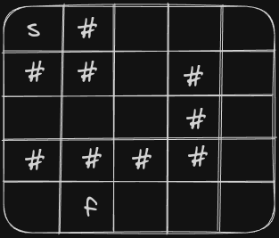
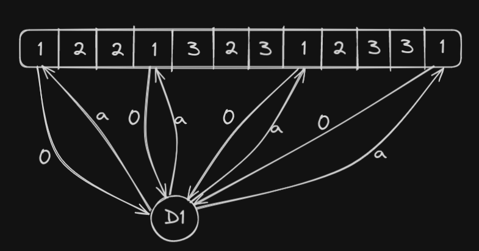
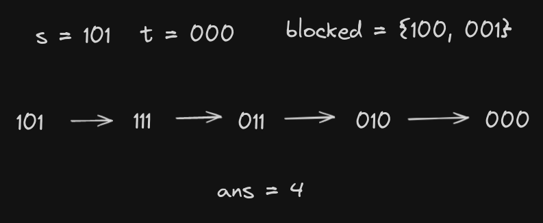

# Graph Formulation Ideas

In this section we will discuss some problems, in which we have to formulate graph from the given problem. Some times the graph that we need to use to solve the problem is not same as the graph that is given in the problem.

**Problem 1: ** Given a map of a country which is in the form of an undirected graph. Bob is currently in city `A` in his car and wants to go to city `B`. There are roads in between some cities of different lengths, Bob's car uses 1 litre of fuel per unit of distance travelled. Currently the fuel tank of the car is empty and it has a capacity of `C`.  Each city has different prices for petrol per litre. Find the minimum cost required for bob to reach destination.

**Solution:** The idea is simple we will formulate a graph where node of graph will be a `{nodeNumber, remainingFuel}`. Clearly the starting node for our problem will then be `{A, 0}`. When we are at some node `u`  and remaining fuel is `rf`, then we can choose to either take a road and move to another city `v` if `distance[u][v] <= rf`, this will take us to node `{v, rf - distance[u][v]}` and not extra cost is required. Of if the tank is not full we can choose to add 1 litre of fuel which will take us to node `{u, rf+1}` and we need to pay cost of petrol for that city.

Now we just need to used dijkstra on the new graph.

Below is the implementation.

```c++
ll n, m;
ll source, destination, capacity;
vector<vector<pair<ll, ll>>> g;
ll p[10010];

void dijkstra()
{
	vector<vector<ll>> cost(n+1, vector<ll>(capacity+1, inf));
	vector<vector<ll>> visited(n+1, vector<ll>(capacity+1, false));
    
    priority_queue<pair<ll, pair<ll, ll>>> pq;
    // pushing the starting node into pq
    pq.push(mp(0, mp(source, 0)));
    cost[source][0] = 0;
    while(!pq.empty())
    {
        auto currState = pq.top();
        pq.pop();
        ll currCost = -currState.F;
        ll currNode = currState.S.F;
        ll remainingFuel = currState.S.S;
        if(visited[currNode][remainingFuel]) continue;
        visited[currNode][remainingFuel] = 1;

        // trying to go other nodes without refueling
        for(auto nn : g[currNode])
        {
            ll v = nn.F;
            ll dist = nn.S;
            // if there is enough fuel to reach node v
            if(dist <= remainingFuel)
            {
                // if previous cost to reach this state was higher
                if(cost[v][remainingFuel - dist] > currCost)
                {
                    cost[v][remainingFuel - dist] = currCost;
                    pq.push(mp(-currCost, mp(v, remainingFuel - dist)));
                }
            }
        }
        // refueling if tank is not full
        if(remainingFuel < capacity && cost[currNode][remainingFuel+1] > currCost + p[currNode])
        {
            cost[currNode][remainingFuel+1] = currCost + p[currNode];
            pq.push(mp(-cost[currNode][remainingFuel+1], mp(currNode, remainingFuel+1)));
        }
    }
    // finding the result
    ll res = inf;
    for(ll i = 0; i <= capacity; i++)
    {
        res = min(res, cost[destination][i]);
    }
    cout << res << nline;
}
 
void solve(ll Case)
{
    cin >> n >> m;
    g.resize(n+1);
    forn(i, 0, m)
    {
        ll u, v, d; cin >> u >> v >> d;
        g[u].pb(mp(v, d));
        g[v].pb(mp(u, d));
    }
    // p[i] is petrol price in city i
    forn(i, 1, n+1) cin >> p[i];
    cin >> source >> destination >> capacity;

    dijkstra();
}
```

---

**Problem 2:** Given a `n x m` grid and two cells `S` and `F`. Some cells in grid are empty and some have walls, we can walk into a cell that is empty freely and to move into a cell that has wall we need to break the wall first. We want to find the minimum number of walls we need to break to reach from `S` to `F`.



**Solution:** here moving into a cell is cost 1 and moving into a cel that is empty is cost 0. This is a simpel 01 bfs problem.

---

**Problem 3:** Given a `n x m` grid and two cells `S` and `F`. Some cells in grid are empty and some have walls, we can walk into a cell that is empty freely and to move into a cell that has wall we need to break the wall first. We need to find the length of shortest path if we can break at most `K` walls.

**Solution:** the solution for this problem is similar to first problem where we we formulate a graph node, here graph node `{row, col, k}` works, which represents that we are currently at cell `{row, col}` and we have broken `k` walls. Then we have to do simple bfs where moving into a cell costs 1, if we move into an empty cell, then `k` remains same and if we move into cell with wall `k` increases by `1`.

---

**Problem 4:** Given an array of size `n` and an index `s` which is the **starting position** of player. In one move player can move to adjacent elements by giving a cost of `b`. The player can also jump to elements with same value by giving a cost of `a`. For every index find minimum cost to reach that index from `s`.

**Solution:** The problem with using dijkstra directly in this problem is that if there are k elements with value x, then there will be $^kC_2$ edges. In worst case `k == n` and number of edges will be $O(n^2)$. Then using dijkstra directly will cost $O(n^2logn)$ time complexity.

There are two ways to solve this, one is observation based and other is using dummy nodes.

Using dummy nodes the idea is that for every group of vertices with same value, in place connecting them with each other we will connect them with a dummy node, the edge from vertices to dummy node will have weight `0`, and edge from dummy node to vertices will have weight `a`.

This is shown below for vertices with value 1.



We can still go to another node with same value with weight `a` throught dummy node, but this reduces the number of edges from $O(k^2)$ to $O(k)$ for a group.

Now we can do a dijkstra this modified graph.

Below is the code for making this modified graph, then doing dijkstra on it is trivial.

```c++
vector<vector<pair<int, int>>> g;

void solve()
{
	int n,a, b; 
    cin >> n >> a >> b;
    
    // map for storing the positions of elements in a group
    map<int, vector<int>> pos;
    for(int i = 1; i <= n; i++)
    {
        int x; cin >> x;
        pos[x].push_back(i);
    }
    
    // size of graph is n + number of groups
    g.resize(n + pos.size() + 1);
    // 1 to n are original vertices
    // n+1 is dummy for first value vertices in pos
    // n+2 is dummy for second vertex vertices in pos and so on
    
    // edges due to adjacent elements
    for(int i = 1; i < n; i++)
    {
        g[i].push_back({i+1, b});
        g[i+1].push_back({i, b});
    }
    
    int dummyNode = n+1;
    // edges to dummy node
    for(auto &v : pos)
    {
        // vertices in same group
        for(int node : v.second)
        {
            // edge of weight 0 to dummy node
            g[node].push_back({dummyNode, 0});
            
            // edge of weight a from dummy node
            g[dummyNode].push_back({node, a});
        }
        
        // dummy node for next group
        dummyNode++;
    }
    
    dijkstra();
}
```

---

**Problem 5:** Given two binary strings `s` and `t` of length 20 each. In one move we can flip the bit at any index in `s`. We need to find the min number of moves to convert `s` to `t`. We are also given an array of strings which are blocked i.e at any point during our operations we must not obtain a string that is present in the array.



**Solution:** the idea is simple we can convert strings to number using there binary representation and then we can do bfs, we never process blocked nodes.

---

**Problem 6:** Given a n x m grid, currently player is standing at cell $(0, 0)$ and want to go to cell $(n-1, m-1)$. Some cells are blocked and some are free to move. Player has special powers and can destroy any 2x2 cell in the grid. Find the minimum number of times the player needs to use its powers to reach its destination.

**Solution:** The idea is same as problem 2, just the change is that if we want to move into a blocked cell we have to pay a cost, but with this cost we can move into all cells around this cell at no extra cost. So in place of just checking for `distance[nx][ny] > distance[x][y] + 1` we need to check for this condition for all `p` and `q` such that $nx-1 <= p <= nx+1$ and $ny-1 <= q <= ny+1$. The code for while loop is shown below.

```c++
// other parts are same as normal 0-1 bfs setup
while(!dq.empty())
{
    int currRow = dq.front().first;
    int currCol = dq.front().second;
    dq.pop_front();
    for(int i = 0; i < 4; i++)
    {
        int nx = currRow + dx[i];
        int ny = currCol + dy[i];
        if(nx < 0 || nx >= n || ny < 0 || ny >= m) 
            continue;
        if(!blocked[nx][ny])
        {
            if(distance[nx][ny] > distance[currRow][currCol])
            {
                distance[nx][ny] = distance[currRow][currCol];
                dq.push_front({nx, ny});
            }
            continue;
        }
        // cell is blocked to we relax all cells around it
        for(int p = nx-1; p <= nx+1; p++)
        {
            for(int q = ny-1; q <= ny+1; q++)
            {
                if(p < 0 || p >= n || q < 0 || q >= m) 
                    continue;
                if(distance[p][q] > distance[currRow][currCol] + 1)
                {
                    distance[p][q] = distance[currRow][currCol] + 1;
                    dq.push_back({p, q});
                }
            }
        }
    }
}
```

