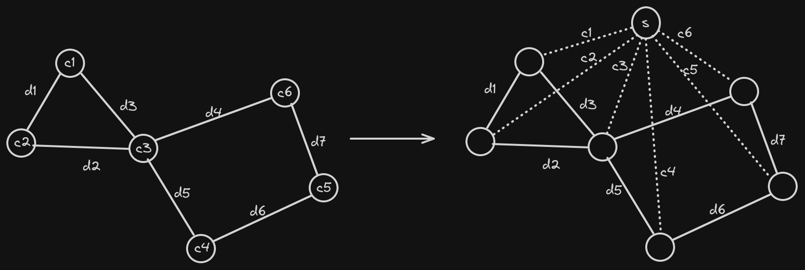

# Minimum Spanning Tree

## Prim's Algorithm

This algorithm is used to find the minimum spanning tree of a undirected weighted graph. This is a greedy algorithm in which we start with a node in our mst this can be any node, then we push it into priority queue with edge length 0. In every iteration we pop out the smallest edge and mark it as visited and push it into the mst, then we go over all of its children and push them into the priority queue. The idea is for every node we only choose the smallest weighted edge that connects it to the mst, and remove all the other edges.

Code to find the sum of edges in mst using priority queue.

```c++
int spanningTreeSum(int v, vector<vector<pair<int, int>>> g)
{
    vector<bool> visited(v + 1, false);
    priority_queue<pair<int, int>, vector<pair<int, int>>, greater<pair<int, int>>> pq;
    pq.push({0, 0});
    int sum = 0;
    while (!pq.empty())
    {
        int node = pq.top().second;
        int d = pq.top().first;
        pq.pop();

        if (visited[node])
            continue;
        visited[node] = true;
        sum += d;
        for (auto x : g[node])
        {
            int adjNode = x.first;
            int w = x.second;
            if (visited[adjNode])
                continue;
            pq.push({w, adjNode});
        }
    }
    return sum;
}
```

The above code finds the sum of edges in mst, lets look at the code to find the mst itself.

```c++
vector<vector<pair<int, int>>> spanningTreeEdges(int v, vector<vector<pair<int, int>>> g)
{
    // declaring the useful containers
    vector<bool> visited(v + 1, false);
    vector<int> parent(v+1, -1), distance(v+1, 1e18);
    set<pair<int, int>> s;
    vector<vector<pair<int, int>>> mst(v+1);
    // inserting node 0 as first element in the mst
    s.insert({0, 1});
    distance[0] = 0;
    while (!s.empty())
    {
        // getting node with shortest edge from current mst
        pair<int, int> top = *(s.begin());
        int node = top.second;
        int d = top.first;
        // deleting node from set and marking as visited
        s.erase(s.begin());
        visited[node] = true;
        // if parent is present then edge from parent to node will be mst
        if(parent[node] != -1)
        {
            mst[node].push_back({parent[node], d});
            mst[parent[node]].push_back({node, d});
        }
        for (auto x : g[node])
        {
            int adjNode = x.first;
            int edgeWeight = x.second;

            if(!visited[adjNode] && distance[adjNode] > edgeWeight)
            {
                // removing old edge from set
                s.erase({distance[adjNode], adjNode});
                // adding new edge into the set
                s.insert({edgeWeight, adjNode});
                // updating distance and parent arrays
                distance[adjNode] = edgeWeight;
                parent[adjNode] = node;
            }
        }
    }
    return mst;
}
```

---

## Kruskal's Algorithm

This algorithm is used to find the mst of a graph. First we sort all the edges in ascending order of their weights. Then one by one we take edges and check if the end points are already in the mst or not, if they are then we ignore this edge otherwise we add this edge to the mst. To do this we use DSU data structure, initially each vertex is disjoint as we keep adding the vertices to mst we push them into a single set using union function. To check if 2 vertices are part of mst or not we use the dsu findUParent function.

```c++
// assuming there is a class DisjointSet in the code
int spanningTreeSumKruskal(int v, vector<vector<pair<int, int>>> g)
{
    // converting graph into edges
    vector<pair<int, pair<int, int>>> edges;
    for(int i = 0; i <= v; i++)
    {
        for(auto x:g[i])
        {
            int node = i;
            int adjNode = x.first;
            int weight = x.second;
            edges.push_back({weight, {node, adjNode}});
        }
    }
    sort(edges.begin(), edges.end());
    DisjointSet ds(v);
    int sum = 0;
    for(int i = 0; i < edges.size(); i++)
    {
        int w = edges[i].first;
        int u = edges[i].second.first;
        int v = edges[i].second.second;
        if(ds.findUParent(u) != ds.findUParent(v))
        {
            ds.unionBySize(u, v);
            // here we can add uv to mst if we need the tree also
            sum += w;
        }
    }
}

```

<details>
	<summary>Proof Of Kruskal's Algorithm</summary>
    <br>
    We process the edges in increasing order of there weight. At any moment lets say we find an edge with weight <code>x</code> which connects two disjoint sets. In kruskal's algorithm we choose this edge as part of <b>MST</b>. 
    <br>
    <br>
    To proove this edge indeed belongs in mst we can proove this by contradiction, lets say there is some other edge connecting these components, but since this edge is not explored yet (since the components are disconnected) it must be having weight <code>>= x</code>, hence choosing <code>x</code> will give same or better answer always.
</details>

**Problems Related To Kruskal's Algorithm**

**Problem 1:** Find the maximum spanning tree.

**Solution:** the answer for this is that we can simply add edges from highest weight to smallest weight order. This ways we will find maximum spannning tree.

Another idea for solution is that we modify the graph by multiplying weight of edges with $-1$. Then we find mst of this new graph and $-1 * mstOfNewGraph$ is the maximum spanning tree.

**Problem:** Given a map a country which is in the form of a graph where nodes represent cities and edges are roads. Initially all roads in the city are damaged and there are not hospitals. Mayor of the city wants that every city must have a hospital or must be connected to some other city with hospital through repaired road. Cost of making a hospital in a city is $C_i$ and cost of repairing $i^{\text{th}}$ edge is $D_i$. Find the minimum cost to achieve this requirement.

**Solution:** the idea is that we will make a new super node and connect this node with each city with edge weight $C_i$​. Then mst of this new graph will be the minimum cost. This is explained in the image below.


