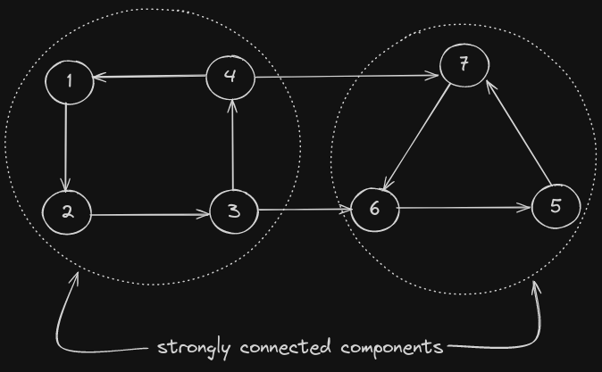
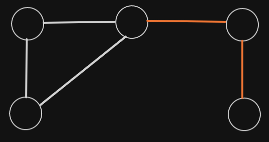
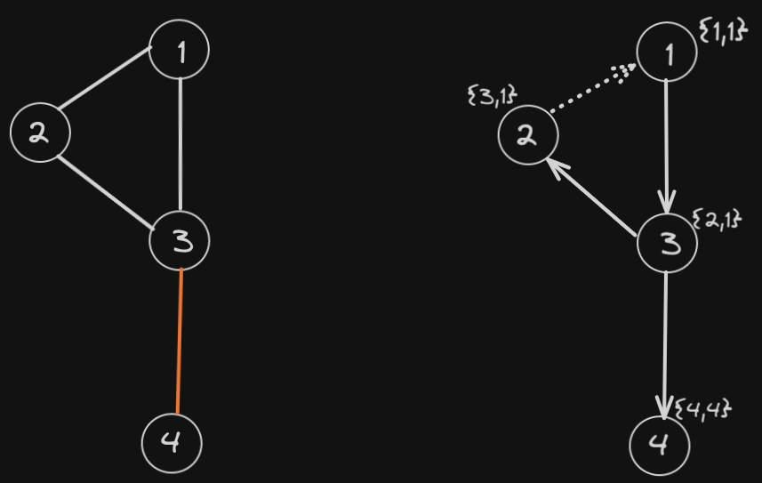
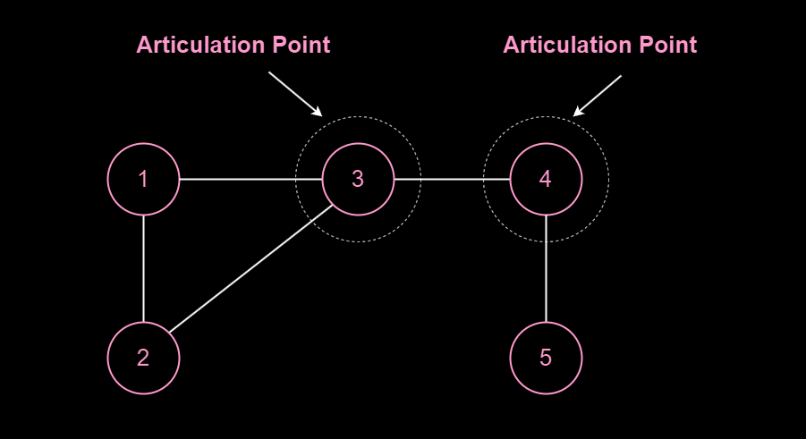

## Strongly Connected Components (Kosaraju's Algorithm):

A strongly connected component is one in which each node is reachable from every other node. 

For example consider graph shown below this is a strongly connected component. 



A **single node** is also a strongly connected component. 

To find number of strongly component and also print them we use **kosaraju's algorithm**. 

The first observation is that each node has to be present in atleast one strongly connected component. The idea is that when we do dfs from a node, then we definitely visit all of the elements in its strongly connected component (scc) in which current node is. But we may also go into other scc's. 

Suppose we start dfs from node `0` which is in `scc1` and then we go into `scc1 -> scc2 -> scc3`. We will store the **dfs order** (order in which dfs of nodes end). Now if we reverse the edges of the graph and again do dfs in reverse **dfs order** then in every dfs we will only visit nodes in the connected component.

For example consider above graph, if we do a dfs from node `1`, then one of the possible dfs order will be `[5, 6, 7, 4, 3, 2, 1]`. Now we reverse the edges of the graph, and do dfs in reverse dfs order. First we do dfs from `1` and visite nodes ` 4 3 2` and dfs ends. Then we go ahead in dfs order and see `2` which is visited so we move ahead again. Later we move to node `7` which is not visited so we start a dfs from `7` and visited nodes `5  6`.

**Note:** we can use stack in place of array to store dfs order.

```c++
class KosarajuSolution
{
    // dfs to sort elements according to end time
    void dfs(vector<vector<int>>& g, vector<bool>& visited, stack<int>& s, int u)
    {
        visited[u] = true;
        for(int v:g[u])
        {
            if(visited[v]) continue;
            dfs(g, visited, s, v);
        }
        s.push(u);
    }

    // normal dfs
    void dfs2(vector<vector<int>>& g, vector<bool>& visited, int u)
    {
        visited[u] = true;
        for(int v:g[u])
        {
            if(visited[v]) continue;
            dfs2(g, visited, v);
        }
    }
public:
    //Function to find number of strongly connected components in the graph.
    int kosaraju(int n, vector<vector<int>>& adj)
    {
        vector<bool> visited(n+1, false);
        stack<int> s;
        for(int i = 0; i < n; i++)
        {
            // in case of disconnected components we need multiple dfs
            if(visited[i]) continue;
            dfs(adj, visited, s, i);
        }

        // making a graph with reversed edges
        vector<vector<int>> rg(n+1);
        for(int i = 0; i < n; i++)
        {
            visited[i] = false;
            for(int v:adj[i])
            {
                rg[v].push_back(i);
            }
        }

        int count = 0;
        while(!s.empty())
        {
            int node = s.top();
            s.pop();
            if(visited[node]) continue;
            count++;
            dfs2(rg, visited, node);
        }
        return count;
    }

};

```

---

## Bridges In Graph (Tarjan's Algorithm):

In an **undirected** graph, **Bridges** are those edges removal of which leads to increase in number of connected components in the graph. For example in the graph given below, the red edges are bridges.



To find bridges in graph, we use **Tarjan's Algorithm**. The idea of this algorithm is similar to cycle detection algorithm in which we check for back edge. We will maintain two arrays one for **in-time** i.e first time when a node was reached, the other array we maintain is low array which stores the lowest in-time node reachable by this node through its children i.e `low[node] = min(in[node], min(low[adjacentNodes]))`, here adjacentNodes is excluding parent.

For example consider the graph given below, the dfs graph is shown beside this graph. From it we can see that `low[3]` is $1$ because we can reach node with in-time $1$ via node $2$. But for node $4$ the `low[4] = 4` which is $> inTime[3]$ hence we can say that edge between $3$ and $4$ is a bridge.



Algorithm for Tarjan's algorithm is shown below.

```c++
class Bridges {
    int time = 0;
    void dfs(vector<int> g[], vector<vector<int>>& res, vector<bool>& visited,
    int low[], int in[], int u, int parent)
    {
        visited[u] = true;
        in[u] = time++;
        low[u] = in[u];
        for(int v:g[u])
        {
            if(v == parent) continue;
            if(!visited[v])
            {
                dfs(g, res, visited, low, in, v, u);
                low[u] = min(low[u], low[v]);
                if(low[v] > in[u])
                {
                    res.push_back({u, v});
                }
            }
            else
            {
                low[u] = min(low[u], low[v]);
            }
        }
    }
    public:
    vector<vector<int>> criticalConnections(int n, vector<vector<int>>& connections) {
        time = 0;
        vector<int> graph[n];
        for(auto it:connections)
        {
            int u = it[0], v = it[1];
            graph[u].push_back(v);
            graph[v].push_back(u);
        }
        vector<bool> visited(n, false);
        vector<vector<int>> res;
        int low[n], in[n];
        dfs(graph, res, visited, low, in, 0, -1);
        return res;
    }
};

```

---

## Articulation Point (or) Cut Vertex

These are vertices removal of which leads to formation of 2 or more connected components. 



The main idea is that we root the graph (this can be any node) then for all non root nodes $u$ if there is a child $v$ with $low[v] >= in[u]$, then it means that $u$ is an articulation point. For root node, it is articulation point if it has $>= 2$ child nodes in dfs i.e it calls for dfs for $>= 2$ number of nodes.

The algorithm to find articulation points is similar to finding bridges. The only difference is how we are calculating `low` array. For nodes that are not visited we update `low[u] = min(low[u], low[v])`, where $v$ was not visited. For nodes that are visited i.e **back edges** we update `low[u] = min(low[u], in[v])`.

The reason for this is the condition `low[v] >= in[u]` that makes node $u$ an articulation point. This means if we reach a node via back edge, then it is still possible for that node to be an articulation point, unlike in case of bridges.

Consider the graph below, in the right diagram we have shown dfs on the graph starting from node $1$ and dfs direction, and back edges. Also for every node its {in-time, low} is shown, if we follow bridges algorithm. We can clearly due to back edge from node $5$ to $3$, $low[5]$ is not $1$. Which makes low of $4$ also $1$, and hence $3$ is not an articulation point.


But we know that $3$ is an articulation point, the reason for this failure is because $low[5]$ is calculated via $3$. Hence while updating low for back edges we only consider in-time.

Implementation of this Tarjan's algorithm is shown below.

```c++
class ArticulationPoints
{
    int time = 0;
    void dfs(vector<int> g[], set<int>& res, vector<int>& low,
    vector<int>& in, vector<bool>& visited, int u, int parent)
    {
        visited[u] = true;
        in[u] = low[u] = time++;
        int count = 0;
        for(int v:g[u])
        {
            if(v == parent) continue;
            if(!visited[v])
            {
                count++;
                dfs(g, res, low, in, visited, v, u);
                low[u] = min(low[u], low[v]);
                if(low[v] >= in[u] && parent != -1)
                {
                    res.insert(u);
                }
            }
            else
            {
                low[u] = min(low[u], in[v]);
            }
        }
        if(parent == -1 && count > 1) res.insert(u);
    }
    public:
    vector<int> articulationPoints(int v, vector<int>adj[])
    {
        if(v == 1) return {-1};
        time = 0;
        vector<int> low(v+1), in(v+1);
        set<int> res;
        vector<bool> visited(v+1, false);
        dfs(adj, res, low, in, visited, 0, -1);
        vector<int> ans(res.size());
        int indx = 0;
        for(int x:res) ans[indx++] = x;
        if(res.size() == 0) return {-1};
        return ans;
    }
};

```
