# Shortest Path Algorithms

---

## Shortest Path in an Unweighted Graph

Finding shortest in an unweighted graph is one of the core powers of bfs algorithm since it reaches nodes in level order. So we can start from a node (usually called `source` node) and then do a bfs to find the distance of every node from current node.

**Algorithm:** We need to do simple dfs algorithm but instead of having a visited array we will have a distance array which will serve purpose of visited array as well as storing distance of every node from source. Initially all nodes will have distance of `∞` and source node will have distance of 0. Then we push source node into the queue and perform the bfs. We pop out a node from queue and then go to its neighbours and then check if `distance[neighbourNode] > distance[currNode] + 1`, if this is true then it means that reaching `neighbourNode` from `currNode` is shorter, infact since the graph is unweighted this is the shortest path. This is known as **Relax Operation**.

Initially all nodes are at infinite distance and when they are reached by an adjacent node the first time then their distance is updated and we push them into the queue, in unweighted graph this will only happen once since bfs reaches nodes in earliest possible path hence no other will reach this node later with smaller path. This Process is shown in the image below.

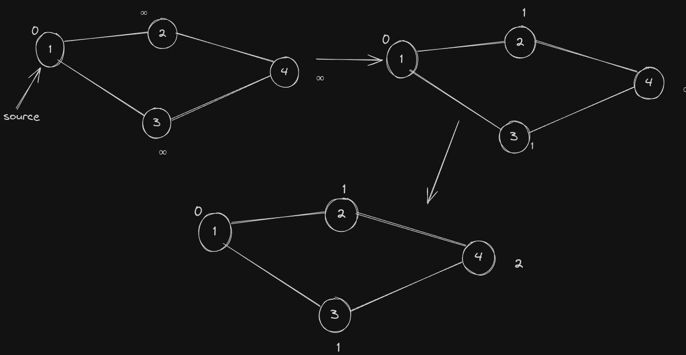

This is also called **Single Source Shortest Path (SSSP)** algorithm.

Here is the implementation of this algorithm.

```c++
vector<int> SSSP(vector<vector<int>>& graph, int source, int n)
{
    // works for 0-based and 1-based node indexing.
    int inf = 1e9;
    vector<int> distance(n+1, inf);
    queue<int> q;
    q.push(source);
    distance[source] = 0;
    while(!q.empty())
    {
        int node = q.front();
        q.pop();
        for(int adjNode:graph[node])
        {
            // relax operation
            if(distance[adjNode] > distance[node] + 1)
            {
                distance[adjNode] = distance[node] + 1;
                q.push(adjNode);
            }
        }
    }
}
```

**Note:** in a weighted graph the relax happen might happen more than once since bfs reaches nodes in level order. This algorithm will still work but is inefficient and will give tle in most questions.

**Problem:** Given a grid of size n x m in which some cells are blocked. We are also given position of a knight and an ending position. We need to find minimum number of moves required for knight to reach that cell. If it is not possible for knight to reach that cell we need to return -1.

**Solution:** straight forward sssp algorithm problem. Below is the implementation.

```c++
#define F first
#define S second

vector<vector<bool>> blocked;
int n, m;
int inf = 1e9;
using state = pair<int, int>;
// knight moves
int dx[] = {-1, -2, -2, -1, 1, 2, 2, 1};
int dy[] = {-2, -1, 1, 2, 2, 1, -1, -2};

bool withinBoundary(state& node)
{
    if(node.F < 0 || node.S < 0 || node.F >= n || node.S >= m)
        return false;
    else
        return true;
}

int minNumberOfMoves(state source, state end)
{
    vector<vector<int>> distance(n, vector<int>(m, inf));
    queue<state> q;
    q.push(source);
    distance[source.F][source.S] = 0;
    while(!q.empty())
    {
        state curr = q.front();
        q.pop();
        // going to neighbours of curr
        for(int i = 0; i < 4; i++)
        {
            state adjNode = {curr.F + dx[i], curr.S + dy[i]};
            // if out of boundary continue
            if(!withinBoundary(adjNode)) continue;
            // if blocked cell we cannot go
            if(blocked[adjNode.F][adjNode.S]) continue;
            // relax operation
            if(distance[adjNode.F][adjNode.S] > distance[curr.F][curr.S] + 1)
            {
                distance[adjNode.F][adjNode.S] = distance[curr.F][curr.S] + 1;
                q.push(adjNode);
            }
            // optimization
            if(adjNode == end)
            {
                return distance[adjNode.F][adjNode.S];
            }
        }
    }
    // never reached end
    return -1;
}
```

Practice Problem: [Word Ladder I](https://practice.geeksforgeeks.org/problems/word-ladder/1)

**Multi-Source Shortest Path (MSSP)**

This is just an extension of SSSP. The only change in the algorithm is that now we will have an array of source nodes and we will initiallize all of them with 0 distance and push all of them into the queue. Then we will be able to find the shortest path length for every node from one of the source nodes.

**Problem:** Given a grid of size n x m and positions of monsters on the grid. Also given is the position of bob on the grid. Some cells in the grid are blocked. In one second all monsters and bob can move to any adjacent cell. Bob wants to escape the grid which can be done via boundary nodes. Tell if bob can escape and if it can then return minimum time among all possible paths that bob can take to escape. Assume monsters know position of bob at all time and they move optimally.

**Solution:** here we will use MSSP to find distance of monsters and boundary nodes, then we will go over every boundary node and check if distance between bob and that node is shorter than distance of that node with monsters. We need to find such a node with smallest distance.

```c++
vector<vector<bool>> blocked;
int n, m;
int inf = 1e9;
using state = pair<int, int>;

int dx[] = {1, 0, -1, 0};
int dy[] = {0, 1, 0, -1};

bool withinBoundary(state& node)
{
    if(node.F < 0 || node.S < 0 || node.F >= n || node.S >= m)
        return false;
    else
        return true;
}

bool willBobEscape(vector<state>& monsterPos, state bobPos)
{
    vector<vector<int>> distance(n, vector<int>(m, inf));
    queue<state> q;
    for(auto Pos : monstorPos)
    {
        distance[Pos.F][Pos.S] = 0;
        q.push(Pos);
    }
    while(!q.empty())
    {
        state curr = q.front();
        q.pop();
        // going to neighbours of curr
        for(int i = 0; i < 4; i++)
        {
            state adjNode = {curr.F + dx[i], curr.S + dy[i]};
            // if out of boundary continue
            if(!withinBoundary(adjNode)) continue;
            // if blocked cell we cannot go
            if(blocked[adjNode.F][adjNode.S]) continue;
            // relax operation
            if(distance[adjNode.F][adjNode.S] > distance[curr.F][curr.S] + 1)
            {
                distance[adjNode.F][adjNode.S] = distance[curr.F][curr.S] + 1;
                q.push(adjNode);
            }
        }
    }

    int res = -1;
    // iterating over all boundary nodes
    for(int i = 0; i < n; i++)
    {
        for(int j = 0; j < m; j++)
        {
            if(blocked[i][j]) continue;
            if(i == 0 || j == 0 || i == n-1 || j == m-1)
            {
                // if is boundary cell
                int distanceFromBob = abs(i - bobPos.F) + abs(j - bobPos.S);
                if(distance[i][0] > distanceFromBob)
                {
                    if(res == -1 || res > distanceFromBob) res = distanceFromBob;
                }
            }
        }
    }
    return res;
}

```

---

## 0-1 BFS Algorithm

This algorithm is used to find **SSSP** when there is a weighted graph where weight of an edge is either `0` or `1`. For example look at graph below.

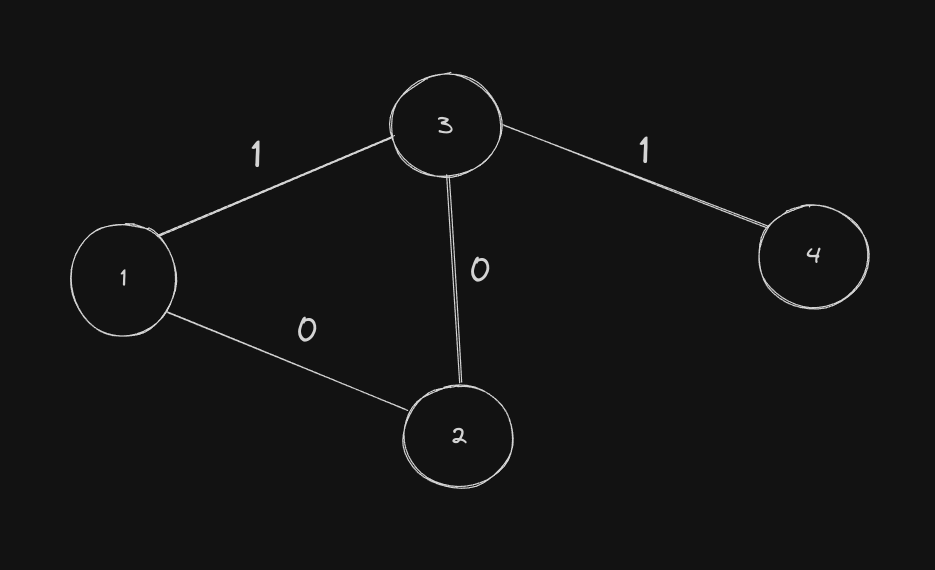

**Algorithm:** The algorithm is simple we will use a deque and perform normal bfs like in SSSP, but when the weight of edge from `currNode` to `adjNode` is 1 we push `adjNode` at the back in deque and if weight is 0 then we push it in front of deque.

**Why Does it Work?**

It is not like this is the only algorithm that works, as discussed earlier normal SSSP algorithm also works in case of graphs with weighted edges, just that relax operation happens multiple times for a node and which will cause multiple for nodes adjacent to it and so one causing tle. This algorithm is most efficient in such graphs.

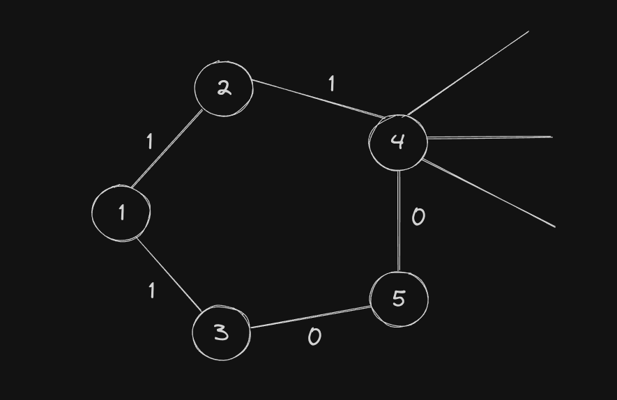

Consider the graph above, let `1` be the `source` node, lets run the standard SSSP algorithm on it and see what problems are there. First we start with our bfs with `1` in queue. In first iteration we pop `1` and then go to its neighbours which are `2` and `3`. Then we move to `2` and push node `4` in the queue, at this point the discovered distance for node `4` is 2.

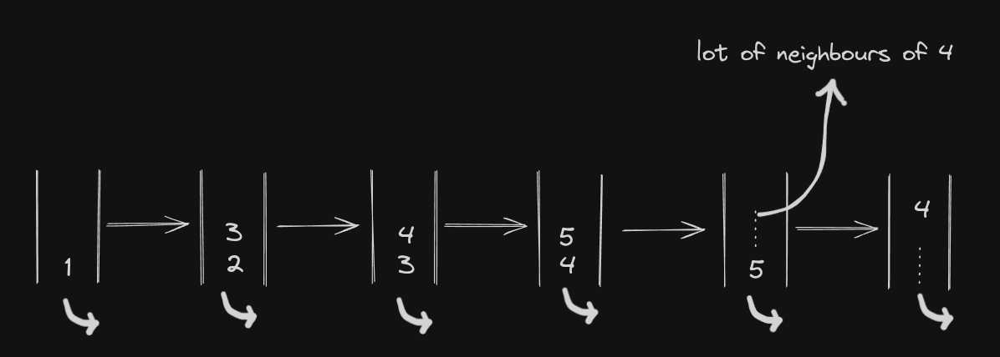

Then we move to node `3` which then pushed node `5` into the queue with distance 1. Then we pop out 4 and go over its neighbours, node `5` will not be relaxed since its distance is already less than 2. Other neighbours of `4` will be relaxed based on current distance of `4` which is 2. Then we pop out `5` and see that we can reach node `4` with distance 1 so we relax distance of `4` and push it into the queue again.

Clearly when later 4 will come out of queue it will again relax all of its neighbour nodes and push them into queue. Instead had we put node 5 infront when we pushing it to queue we would have found the correct distance of 4 before it popped out of queue.

The reason for this is that we want to process nodes in increasing order of their distance from source node. In standard bfs at any point during the bfs, in the queue we can have nodes of distance d and d+1, then if a node with distance d sees a 0 weight edge from it then it must be processed along with the nodes with distance d (because it is essentially at the same level distance wise). This can only be done by pushing such nodes in front using deque.

Below is the implementation of this algorithm.

```c++
vector<vector<pair<int, int>>> graph;
int n;

vector<int> BFS01(int source)
{
    int inf = 1e9;
    vector<int> distance(n+1, inf);
    deque<int> dq;
    dq.push_back(source);
    distance[source] = 0;
    while(!dq.empty())
    {
        int node = dq.front();
        dq.pop_front();
        for(auto adjNode : graph[node])
        {
            int nodeNumber = adjNode.first;
            int weight = adjNode.second;
            if(distance[nodeNumber] > distance[node] + weight)
            {
                distance[nodeNumber] = distance[node] + weight;
                if(weight == 0) dq.push_front(nodeNumber);
                else dq.push_back(nodeNumber);
            }
        }
    }

    return distance;
}
```

**Problem:** Given a grid of size n x m, each cell in grid is an arrow. You are starting at cell `(0, 0)` and you need to reach cell `(n-1, m-1)`. You can move from a cell to all of its adjacent cell, if you move in the direction of the arrow then you move to next cell with 0 cost and if you want to move to any other adjacent cell then cost 1 is added. You need to tell the minimum cost required to reach cell `(n-1, m-1)`. Obviously at any point you can't move out of the grid.

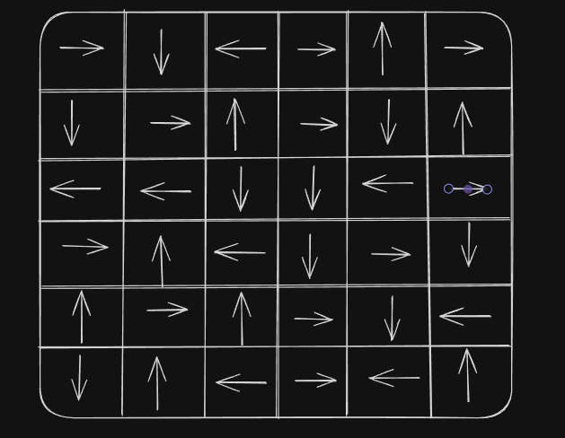

**Solution:** The problem is simply application of the 0-1 BFS algorithm.

```c++
#define F first
#define S second

string moves = "LRUD";
int dx[] = {0, 0, -1, 1};
int dy[] = {-1, 1, 0, 0};
using state = pair<int, int>;

bool withinBoundary(state node, int n, int m)
{
    if(node.F < 0 || node.S < 0 || node.F >= n || node.S >= m)
        return false;
    else
        return true;
}

int minCostBFS01(vector<vector<char>>& grid, int n, int m)
{
    int inf = 1e9;
    vector<vector<int>> distance(n, vector<int>(m, inf));
    deque<state> dq;
    dq.push({0, 0});
    distance[0][0] = 0;
    while(!dq.empty())
    {
        state curr = dq.front();
        dq.pop_front();
        for(int i = 0; i < 4; i++)
        {
            state next = {curr.F + dx[i], curr.S + dy[i]};
            if(!withinBoundary(next, n, m)) continue;
            int weight = 1;
            // if arrow same as current move then weight is 0
            if(grid[curr.F][curr.S] == moves[i])
                weight = 0;

            // relax operation
            if(distance[next.F][next.S] > distance[curr.F][curr.S] + weight)
            {
                distance[next.F][next.S] = distance[curr.F][curr.S] + weight;
                if(weight == 0)
                    dq.push_front(next);
                else
                    dq.push_back(next);
            }
        }
    }

    return distance[n-1][m-1];
}
```

**Quick Puzzle:** find an algorithm for if start from cell `(0, 0)` and we always move in the direction of the arrow, will we end up in a cycle or not. Algorithm must use any extra space and must be O(n\*m) complexity.

**Solution:** The idea is that if we perform O(n\*m) moves of moving to cell along with the arrow and we are not able to move out of the grid then it means there must be a cycle. Another way is to think of this as a linked list and then use linked list cycle detection algorithm.

**Problem 2:** Given a grid of size n x m. There are 3 islands on the grid namely island of 1's, island of 2's and island of 3's as shown in the example figure. Some of the cells are blocked (cells with # in the example). A player can move freely withing its island or to another connected island, for example player on island 2 can move to any cell in island 2 and to any cell in island 3 as they are directly connected. Now we want to build bridges in cells such that all the three islands are connected. Find minimum number of cells we need to make bridges on to connect all three islands.

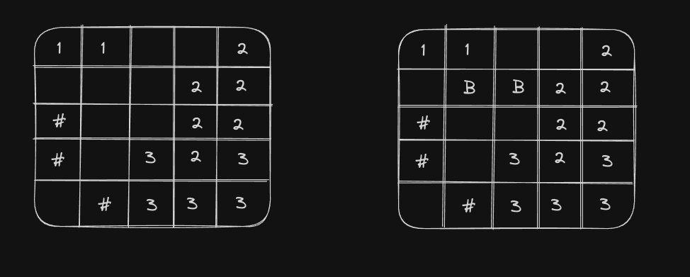

**Solution:** The idea is that it is always optimal to build bridge through a point whose sum of distance from the 3 components is minimal. We can do a bfs algorithm to find distance of each cell from component 1, 2 and 3. Then we loop over the cells and find the minimum value of `distanceFrom1 + distanceFrom2 + distanceFrom3`. If the cell is empty then cost will sum - 2 (since we have added 1 for each component i.e 3 times but need only one time) and if the cell is on an island then cost is sum - 1.

**Note:** This is a 0-1 BFS as when we move to an empty cell we need to build a bridge and cost is 1, and if we move to a cell on island then we don't need any cost.

Below is the implementation of this approach.

```c++
#define F first
#define S second

int n, m;
vector<vector<int>> grid;
// 0 -> empty cell
// -1 -> blocked cell

using state = pair<int, int>;
int dx[] = {1, 0, -1, 0};
int dy[] = {0, 1, 0, -1};

bool withinBoundary(state node)
{
    if(node.F < 0 || node.S < 0 || node.F >= n || node.S >= m)
        return false;
    else
        return true;
}

int BFS01(state source)
{
    int inf = 1e9;
    vector<vector<int>> distance(n, vector<int>(m, inf));
    deque<state> dq;
    distance[source.F][source.S] = 0;
    dq.push_back(source);
    while(!dq.empty())
    {
        state curr = dq.front();
        dq.pop_front();
        for(int i = 0; i < 4; i++)
        {
            state next = {curr.F + dx[i], curr.S + dy[i]};
            if(!withinBoundary(next)) continue;
            if(grid[next.F][next.S] == -1) continue;
            int w = 1;
            if(grid[next.F][next.S] != 0) w = 0;
            if(distance[next.F][next.S] > distance[curr.F][curr.S] + w)
            {
                distance[next.F][next.S] = distance[curr.F][curr.S] + w;
                if(w == 0)
                    dq.push_front(next);
                else
                    dq.push_back(next);
            }
        }
    }
    return distance;
}

int minCostToConnect()
{
    // finding 1 node of each of island 1 2 and 3
    state island1, island2, island3;
    for(int i = 0; i < n; i++)
    {
        for(int j = 0; j < m; j++)
        {
            if(grid[i][j] == 1)
                island1 = {i, j};
            else if(grid[i][j] == 2)
                island2 = {i, j};
            else
                island3 = {i, j};
        }
    }
    
    vector<vector<int>> d1 = BFS01(island1);
    vector<vector<int>> d2 = BFS01(island2);
    vector<vector<int>> d3 = BFS01(island3);
    int minCost = inf;
    for(int i = 0; i < n; i++)
    {
        for(int j = 0; j < m; j++)
        {
            if(grid[i][j] == -1) continue; 	// blocked cell
            int currCost = d1[i][j] + d2[i][j] + d3[i][j];
            if(grid[i][j] == 0) 
                currCost -= 2; // empty cell
            else
                currCost -= 1;
            minCost = min(currCost, minCost);
        }
    }
    return minCost;
}
```

---

## Dijkstra's Algorithm

Given a weighted graph and a source node. The weights are non-negative, we need to find the shortest path from source to every other node.

**Algorithm:** The idea of this algorithm is similar to what we have seen in unweighted graphs (weight = 1) and 0-1 weight graphs. To find shortest path we want to process nodes in increasing order of their distance from source nodes, this makes sure when we process a node we have already processed all shortest paths possible for that node and current `distance[currNode]` is shortest possible. The problem here is we start with  `distance[source] = 0` and then push it into the queue and then we explore its edges and relax them by checking `distance[neighbourNode] > distance[currNode] + weight`. But simply putting them in queue will not make sure that we process nodes in shortest distance order, so we push them in priority_queue or set along with there current shortest discovered distance. 

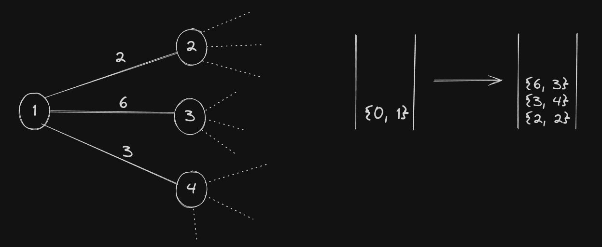

Then when we pop out a node, it will have shortest distance among all nodes in the pq or set. Since all weights are non-negative it means we can surely say that must be shortest path to reach this node. Since all other paths are `>= distanc[currNode]`.

**Note:** We can use set and priority_queue both to store nodes with distances so that we can get shortest distance node in `log(n)` time. Using `priority_queue` we push `{distance[node], node}` in it whenever we do relax operation. 

It might happen that this node is already present in `priority_queue` with previous found distance, this leads to presence of duplicates. When we have processed a node (i.e popping it out from pq for the first time) we have explored all possible paths to its neighbour nodes and relaxed edges the best we can for this node. 

Now we need to prevent the duplicates from coming and going over all the edges again. So we will need to maintain a visited array for each node that tells that we have process a node already. In the worst case each edge will push a node into the pq giving rise to time complexity O((V + E) * LogE).

Without the visited array, we will push O(E) vertices into the `pq` and each push will take O(logE) time, hence time complexity of pushing and popping from `pq` is O(ELogE). When we pop out these E vertices, we loop over all of its edges which in worst case can be O(V), hence looping over the neighbours have time complexity O(VE), hence overall time complexity is O(VE + ElogE) = O(VE).

**Dijkstra using priority queue.**

```c++
vector<int> dijkstra(int n, vector<vector<pair<int, int>>> &adj, int s)
{
    vector<int> distance(n + 1, 1e9);
    vector<bool> visited(n + 1, false); // to handle multiple insertions
    distance[s] = 0;
    priority_queue<pair<int, int>, vector<pair<int, int>>, greater<pair<int, int>>> pq;
    pq.push({0, s});
    while (!pq.empty())
    {
        int node = pq.top().second;
        pq.pop();
        // if node already processed then continue
        if (visited[node])
            continue; 
        visited[node] = true;
		
        // NN => neighbour node
        for (auto NN : adj[node])
        {
            int adjNode = NN.first;
            int weight = NN.second;
            if (distance[adjNode] > distance[node] + weight)
            {
                distance[adjNode] = distance[node] + weight;
                pq.push({distance[adjNode], adjNode});
            }
        }
    }
    return distance;
}
```

Benifit of using set is that when we push a node into the set we already know that a state with previous distance is already present in the set so we can erase it before inserting new one. Hence set has time complexity of O((V+E) logV). When we compare it with priority_queue we see that pq has time complexity of O((V+E)*LogE) and in worst case E is O(V<sup>2</sup>)  and we know that O(LogV<sup>2</sup>) = O(LogV).

**Dijkstra using set**

```c++
vector<int> dijkstra(int v, vector<vector<pair<int, int>>> graph, int s)
{
    int inf = 1e9;
    vector<int> distance(v + 1, inf);
    distance[s] = 0;
    set<pair<int, int>> st;
    st.insert({0, s});
    while (!st.empty())
    {
        int node = st.begin()->second;
        // removing current node from set
        st.erase(st.begin());
        // NN => neighbour node
        for (auto NN : graph[node])
        {
            int adjNode = NN.first;
            int w = NN.second;
            if (distance[adjNode] > distance[node] + w)
            {
                // deleting {oldDistance, adjNode}
				st.erase({distance[adjNode], adjNode});
                distance[adjNode] = distance[node] + w;
                st.insert({distance[adjNode], adjNode});
            }
        }
    }
    return distance;
}
```

Notes About Dijkstra's Algorithm:

1. It only works when the weights of edges is positive, if the weights are negative then we are never sure that smallest distance is the shortest distance for a node in every iteration.
2. If there are negative weight cycles in the graph i.e cycles in which sum of edges is -ve, then dijkstra runs into a infinite loop since if we keep moving around in the cycle we keep getting smaller distances.

**Printing The Smallest Path**

If we want to print the shortest path from source node to target node then we can simply modify dijkstra a little bit, we can maintain a parent array which stores the node which is the parent of current node in the path from source to the node. When ever we get in the condition of the relax operation i.e distance[adjNode] > distance[node] + w we update parent[adjNode] = node. Then to get the path we will start with target node and keep going to parent of current node until we get the source node.

```c++
vector<int> shortestPath(vector<vector<pair<int, int>>> &adj, int n, int source, int target)
{
    int inf = 1e9;
    vector<int> distance(n + 1, inf);
    vector<int> parent(n + 1, -1);
    set<pair<int, int>> s;
    // inserting source node with distance 0
    distance[source] = 0;
    s.insert({0, source});
    while (!s.empty())
    {
        int node = s.begin()->second;
        int dist = s.begin()->first;
        s.erase(s.begin());
        for (auto x : adj[node])
        {
            int adjNode = x.first;
            int w = x.second;
            if (distance[adjNode] > dist + w)
            {
                if (distance[adjNode] == inf)
                	s.erase({distance[adjNode], adjNode});
                // updating distance of adjNode, and its parent node
                distance[adjNode] = dist + w;
                s.insert({dist + w, adjNode});
                parent[adjNode] = node;
            }
        }
    }
    vector<int> res;
    // if target is not reachable return empty array
    if (distance[target] == inf)
    {
        res.push_back(-1);
        return res;
    }
    int node = target;
    while (node != source)
    {
        res.push_back(node);
        node = parent[node];
    }
    res.push_back(node);
    reverse(res.begin(), res.end());
    return res;
}
```

---

## Shortest Path In DAG

To find shortest path from a node to every other node in a DAG the best algorithm is using topological sort. The idea that we will relax the edges in topological sort manner this way when we arrive at a node all of the edges that lead to that node must have been discovered and we can say distance for this node is shortest, then we go to its adjacent nodes and try to update their distance. First we find topological sort of the given graph, then we make a distance array in which we mark distance[src] = 0 and rest are inf initially. Then start traveling the topological sort array and do relax operation.

```c++
vector<int> shortestPathDAG(int n, int src, vector<pair<int, int>> adj[])
{
int inf = 1e9;
vector<int> inDegree(n), topoSort, distance(n, inf);

    // finding in degree
    for(int i = 0; i < n; i++)
    {
        for(auto x:adj[i])
        {
            int adjNode = x.first;
            inDegree[adjNode]++;
        }
    }

    queue<int> q;
    for(int i = 0; i < n; i++) if(inDegree[i] == 0) q.push(i);

    while(!q.empty())
    {
        int node = q.front();
        q.pop();
        topoSort.push_back(node);
        for(auto x:adj[node])
        {
            int adjNode = x.first;
            inDegree[adjNode]--;
            if(inDegree[adjNode] == 0) q.push(adjNode);
        }
    }

    distance[src] = 0;

    for(int i = 0; i < n; i++)
    {
        int node = topoSort[i];
        for(auto x:adj[node])
        {
            int adjNode = x.first;
            int w = x.second;
            distance[adjNode] = min(distance[adjNode], distance[node] + w);
        }
    }

    for(int i = 0; i < n; i++) if(distance[i] >= inf) distance[i] = -1;

    return distance;

}
```

---

## Bellman Ford Algorithm

This algorithm is also single source shortest path algorithm. This works in case of directed graph even if there are -ve weight edges. This is a dynamic programming algorithm which computes result in bottom up manner. 

**Algorithm:** First we compute shortest distance with at most 1 edges, then we calculate shortest distance with at most 2 edges and so on. Since there can be no more than v - 1 edges in any path in a graph with v vertices we run the loop v - 1 times. The set is as follows we have the graph and a distance array in which all distance are inf, then we set `distance[source] = 0`. The we start our loop which runs v - 1 times, in each iteration we go over every edge i.e every adjacent node of a vertex node and check if `distance[adjNode] > distance[node] + weight`, and update `distance[adjNode]` accordingly. If there is a path from source node to another node with only 1 edge between them then we are sure that we find that in the first iteration, similarly in second iteration we find all paths with 2 edges between them and so on. 

Below is a dry run for the algorithm, here we can see that initially `distance[source] = 0`, and for other nodes distance of other nodes is infinity. After iteration 2 we have distances for all nodes, but for the -ve weight cycle, in further iterations they still will get relaxed and give smaller and smaller results.

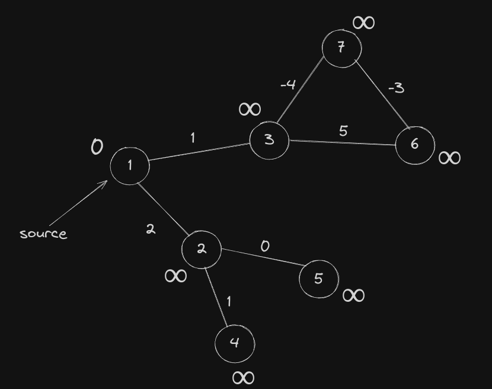

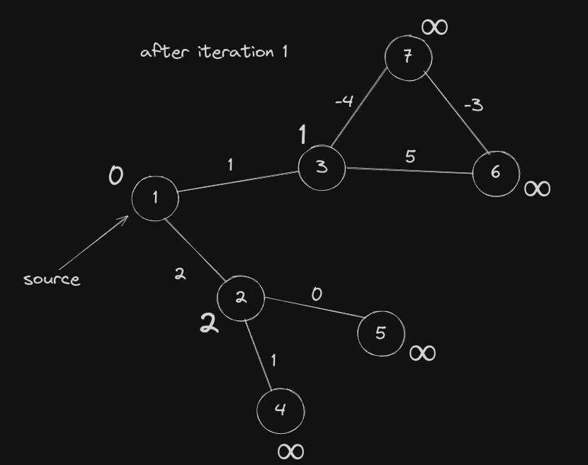

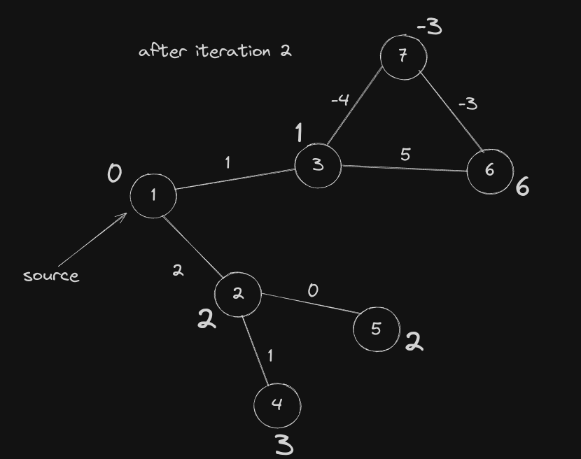

Time complexity of this algorithm is O(v \* e) which in very dense graph will be O(v^3).

```c++
vector<int> bellman_ford(int v, vector<vector<pair<int, int>>> &g, int s)
{
    int inf = 1e9;
    vector<int> distance(v, inf);
    distance[s] = 0;
    for (int i = 0; i < v - 1; i++)
    {
        for (int node = 0; node < v; node++)
        {
            for (auto x : g[node])
            {
                int adjNode = x.first;
                int w = x.second;
                // relax operation
                if (distance[adjNode] > distance[node] + w)
                {
                    distance[adjNode] = distance[node] + w;
                }
            }
        }
    }
	// checking if -ve weight cycle exist
    for (int node = 0; node < v; node++)
    {
        for (auto x : g[node])
        {
            int adjNode = x.first;
            int w = x.second;
            if (distance[adjNode] > distance[node] + w)
            {
                // if we reach here, that means -ve weight cycle exist
                vector<int> res = {-1};
                return res;
            }
        }
    }
    return distance;
}
```

This algorithm will not work if there is -ve weight cycle in the graph, to check if there is a -ve weight cycle or not after doing v-1 iterations we go over the edges once again and if we are still able to find shorter distance to some edge then it means the graph has a -ve weight cycle because we can get smaller and smaller cost as we cycle through the -ve weight cycle. If there are no -ve weight cycle then we sure find shortest distance in v-1 iterations.

**Lets Discuss A Quick Problem On This Algorithm**

**Problem:** Given a directed graph with weighted edges. We need to find the maximum weight path from node `1` to node `n`. If There exist a cycle with weight > 0, then we can get infinite sum, in that case return -1. (Look at the picture below for reference).

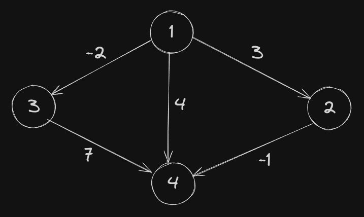

**Solution:** The idea is simple we will multiply all edges with -1 and then run simple bellman ford algorithm on it to find minimum cost path from 1 to n, if there is a -ve weight cycle then we print -1, else we print -1 * minimum distance between `1` and `n` in the new graph.

---

## Floyd-Warshall Algorithm

Given a directed or an undirected weighted graph `G` with `n`  vertices. The task is to find the length of the shortest path   d<sub>ij</sub> between each pair of vertices i and j.

The graph may have negative weight edges, but no negative weight cycles.

If there is such a negative cycle, you can just traverse this cycle over and over, in each iteration making the cost of the path smaller. So you can make certain paths arbitrarily small, or in other words that shortest path is undefined. That automatically means that an undirected graph cannot have any negative weight edges, as such an edge forms already a negative cycle as you can move back and forth along that edge as long as you like.

This algorithm can also be used to detect the presence of negative cycles. The graph has a negative cycle if at the end of the algorithm, the distance from a vertex `v` to itself is negative.

This algorithm has been simultaneously published in articles by Robert Floyd and Stephen Warshall in 1962. However, in 1959, Bernard Roy published essentially the same algorithm, but its publication went unnoticed.

**Description of the algorithm**

The key idea of the algorithm is to partition the process of finding the shortest path between any two vertices to several incremental phases.

Let us number the vertices starting from 1 to n. The matrix of distances is `d[][]`.

Before `k-th`phase `(k = 1 ... n)`, `d[i][j]` is equal to the length of the shortest path from vertex `i` to vertex `j`, which contains only the vertices `{1, 2, ...., k-1}` as internal vertices in the path.

In other words, before k-th phase the value of `d[i][j]` is equal to the length of the shortest path from vertex `i` to the vertex `j`, if this path is allowed to enter only the vertex with numbers smaller than k (the beginning and end of the path are not restricted by this property).

It is easy to make sure that this property holds for the first phase. For k = 0, we can fill matrix with $d[i][j] = w_{ij}$ if there exists an edge between `i` and `j` with $w_{ij}$ and $d[i][j] =  \infin$ if there doesn't exist an edge. In practice $\infin$ will be some high value. As we shall see later, this is a requirement for the algorithm.

Suppose now that we are in the k-th phase, and we want to compute the matrix `d[][]` so that it meets the requirements for the `(k+1)-th` phase. We have to fix the distances for some vertice `(i, j)`. There are two fundamentally different cases:

1. The shortest way from the vertex `i` to the vertex `j` with internal vertices from the set `{1, 2, ..., k}` coincides with the shortest path with internal vertices from the set `{1, 2, ..., k-1}`.

​	In this case, `d[i][j]` will not change during the transition.

2. The shortest path with internal vertices from `{1, 2, ..., k}` is shorter.

   This means that the new, shorter path passes through the vertex `k`. This means that we can split the shortest path between `i` and `j` into two paths: the path between `i` and `k`, and the path between `k` and `j`. It is clear that both of these paths only use internal vertices from set `{1, 2, ..., k-1}` and are the shortest such paths in that respect. Therefore we already have computed the lengths of those paths before, and we can compute the length of the shortest path between `i` and `j` as `d[i][k] + d[k][j]`.

Combining these two cases we find that we can recalculate the length of all pairs `(i, j)` in the k-th phase in the following way:

​	`d[i][j] = min(d[i][j], d[i][k] + d[k][j])`

Thus, all the work that is required in the k-th phase is to iterate over all pairs of vertices and recalculate the length of the shortest path between them. As a result, after the n-th phase, the value `d[i][j]` in the distance matrix is the length of the shortest path between i and j, or is ∞ if the path between the vertices `i` and `j` does not exist.

Below is the implementation of this algorithm.

```c++
void shortest_distance(vector<vector<int>> &cost)
{
    int inf = 1e9;
    int n = cost.size();
    for (int i = 0; i < n; i++)
    {
        for (int j = 0; j < n; j++)
        {
            if (cost[i][j] == -1)
                cost[i][j] = inf;
        }
    }
    for (int x = 0; x < n; x++)
    {
        for (int i = 0; i < n; i++)
        {
            for (int j = 0; j < n; j++)
            {
                cost[i][j] = min(cost[i][j], cost[i][x] + cost[x][j]);
            }
        }
    }
}
```

**Some Problems Related To Floyd Warshall's Algorithm**

**Problem 1:** Given a graph, and queries `x y`, we need to print the shortest path from from node `x` to `y` and also print the path.

**Solution:** finding the shortest path is straight forward, but how do we print the path. One way is to start from node `x` and then loop over all of its neighbour nodes and find such a node `z` such that `distance[x][y] = distance[x][z] + distance[z][y]`, then we print x and move to z and print path from `z` to `y`. This is approach is slow, another approach is to preproces the paths using an auxiliary matrix. The idea is to store `parent[i][j]` as the parent of node `j` in path from `i` to `j`, as shown in the figure below.

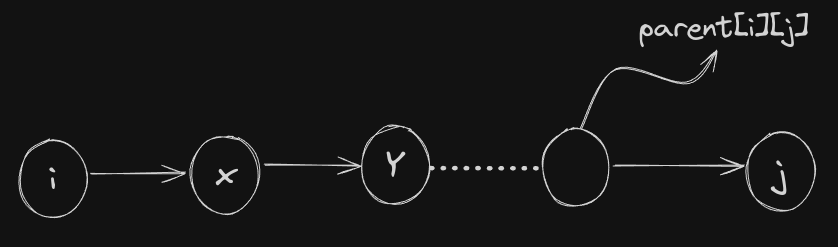

This can be done when calculating the `distance[i][j]` itself. Lets say we calculate `distance[i][j]` via some node `k`, and this is better than already stored value of `distance[i][j]` i.e `distance[i][j] > distance[i][k] + distance[k][j]`. At this point we update `distance[i][j]` and also update `parent[i][j] = parent[k][j]` as we are going from node `i` to `j` via `k` hence `parent[k][j]` will be same as `parent[k][j]`.

**Note:** This will only happen when both values `distance[i][k]` and `distance[k][j]` are discovered. The base case is when there is direct edge from node `i` to `j`, these cases we handle when we initialize the distance matrix i.e while setting value of `distance[i][j]` we can put `parent[i][j] = i`, assuming there is infinite weight edge from `i` to `j`.

Below is implementation of this idea.

```c++
// assuming nodes are from 1 to n
void printShortestPath(vector<vector<pair<int, int>>>& graph, vector<pair<int, int>> queries, int n)
{
    int inf = 1e9;
    int distance[n+1][n+1];
    int parent[n+1][n+1];
    // initializing parent and distance
    for(int i = 1; i <= n; i++)
    {
        for(int j = 1; j <= n; j++)
        {
            distance[i][j] = inf;
            parent[i][j] = i;
        }
    }
    // setting direct edges in distance
    for(int node = 1; node <= n; node++)
    {
        // distance of a node from itself is 0
        distance[node][node] = 0;
        // NN -> neighbour node
        for(auto NN : graph[node])
        {
            int v = NN.first, w = NN.second;
            distance[node][v] = w;
        }
    }
    
    // floyd warshall algorithm
    for(int k = 1; k <= n; i++)
    {
        for(int i = 1; i <= n; i++)
        {
            for(int j = 1; j <= n; j++)
            {
				if(distance[i][j] > distance[i][k] + distance[k][j])
                {
                    distance[i][j] = distance[i][k] + distance[k][j];
                    parent[i][j] = parent[k][j];
                }
            }
        }
    }
    
    // processing the queries
    for(int i = 0; i < (int)queries.size(); i++)
    {
        int u = queries[i].first, v = queries[i].second;
        if(distance[u][v] == inf)
        {
            cout << "No path from " << u << ' ' << v << nline;
        }
        else
        {
            vector<int> path;
            int curr = v;	// ending node of path
            while(curr != u)
            {
                path.push_back(curr);
                // changing curr to parent of curr in path from u to curr
                curr = parent[u][curr];
            }
            path.push_back(curr);
            reverse(path.begin(), path.end());
            // we can print path here
        }
    }
}
```

**Problem 2:** Given a graph and we just want to know if there is path from node `i` to `j` for all pairs of `(i, j)`.

**Solution:** instead of having a distance matrix we can have a path matrix which will be a boolean matrix which will tell if there is path from node `i` to `j` or not. Updating the path matrix is simple, `path[i][j] = path[i][j] | (path[i][k] & path[k][j])`, which means if there is `path[i][j]` already then continue, else check if there is path from node `i` to `k` and from node `k` to `j`.

**Problem 3:** Finding the shortest weight cycle in the given graph.

**Solution:** a cycle is simply a path that starts from a node and ends on that node itself. If we don't initialize `distance[i][i]` with `0`, then the algorithm will discover path that starts from node i and ends at node i with minimum cost. Then we go over `distance[i][i]` for all nodes and find the minimim cost among them.

**Note:** We must not used floyd warshall's algorithm on undirected graph with -ve weights as treats edges in undirected graph as 2 different directed edges. Hence if we have an undirected graph, then if there is an edge with -ve weight edge from node `i` to `j`. Then we initialize `distance[i][j]` and `distance[j][i]` with `w` (w < 0). Then in the algorithm some time will come when we explore path from node `i` to `i` via `j`, at this point we will compare `distance[i][i]` with `distance[i][j] + distance[j][i] = 2 * w` which will be less than `distance[i][i]`. Hence we update `distance[i][i]`. Next if at some point we try to reach from `i` to `j` via `i`, then we compare `distance[i][j]` with `distance[i][i] + distance[i][j] = 3 * w` and we again update `distance[i][j]`. Hence we will get wrong answers in case of undirected graph with -ve weights.

**Note:** even if we have undirected graph with non-negative edges, trying to find smallest weight cycle will simply return smallest weight edge as this algorithm treats undirected edge as 2 directed edges forming a cycle.

**Problem 4:** Given a directed graph with `n` vertices from `1` to `n`. The vertices are removed from graph one by one in some order given by array `p`. We need to sum of all shortest paths after deleting every node.

**Solution:** we will process nodes in reverse order in which they are deleted in floyd-warshall algorithm. This way we will have not paths in which a node that is deleted is present as internal vertex. For paths that have deleted nodes as its ends we will calculate them but not add them to the answer. When we add a node into the graph, we first add all the paths that starts and ends with that node into the answer, then process all pairs of `(i, j)` with `currNode` as intermediate. If using `currNode` gives better distance, then we update the `distance[i][j]`, if both `i` and `j` are present in the graph, we remove old value of `distance[i][j]` and add new one to the sum.

Below is the implementation of this algorithm.

```c++
void solve(int Case)
{
    // taking input
    ll n; cin >> n;
    ll d[n+1][n+1];
    forn(i, 1, n+1)
    {
        forn(j, 1, n+1) 
        {
            cin >> d[i][j];
        }
    }
    
    vl order(n);
    vb present(n+1, false);
    vl res;
    forn(i, 0, n) cin >> order[i];
    // reversing order
    reverse(all(order));
    ll sum = 0;
    // floyd-warshall on reverse order
    for(ll node : order)
    {
        // marking node as present in graph
        present[node] = 1;
        // adding all paths that starts and ends with this node to sum
        for(int i = 1; i <= n; i++)
        {
            if(!present[i]) continue;
            sum += d[i][node];
            sum += d[node][i];
        }
        
        for(int i = 1; i <= n; i++)
        {
            for(int j = 1; j <= n; j++)
            {
                if(d[i][j] > d[i][node] + d[node][j])
                {
					ll prevDistance = d[i][j];
                    d[i][j] = d[i][node] + d[node][j];
                    // if both i and j are present, we remove old distance and new one
                    if(present[i] && present[j])
                    {
                        sum -= prevDistance;
                        sum += d[i][j];
                    }
                }
            }
        }
        res.pb(sum);
    }
    reverse(all(res));
    for(auto x : res) cout << x << ' ';
    cout << nline;
}
```


---

**Problems Related To Shortest Path Algorithms:**

- [Shortest Distance in a Binary Maze](https://practice.geeksforgeeks.org/problems/shortest-path-in-a-binary-maze-1655453161/1)

- [Path With Minimum Effort](https://practice.geeksforgeeks.org/problems/path-with-minimum-effort/1)

- [Cheapest Flights With K Stops](https://practice.geeksforgeeks.org/problems/cheapest-flights-within-k-stops/1)

- [Minimum Multiplications to Reach End](https://practice.geeksforgeeks.org/problems/minimum-multiplications-to-reach-end/1)

- [Number of Ways to Arrive at Destination](https://practice.geeksforgeeks.org/problems/number-of-ways-to-arrive-at-destination/1)

- [City With the Smallest Number of Neighbors at a Threshold Distance](https://practice.geeksforgeeks.org/problems/city-with-the-smallest-number-of-neighbors-at-a-threshold-distance/1)
