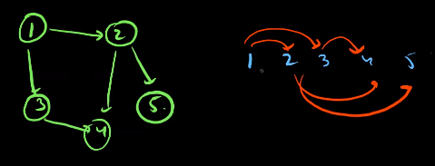
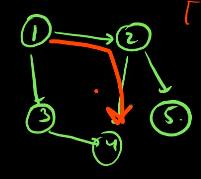
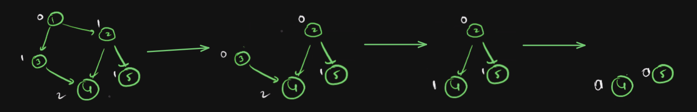
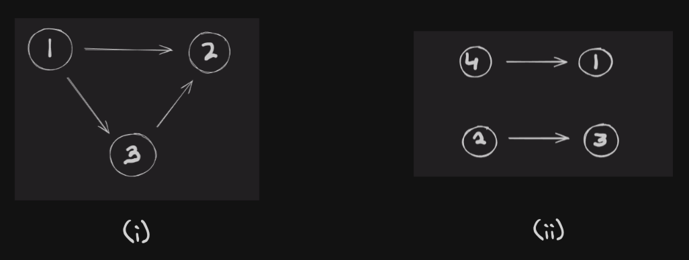

# Topological Sort

**Topological Sort** is a sequence of nodes so written that if there is an edge between u to v then u must occur before v in the sequence. Look at the graph below, the topological of the graph is also given, and we can see that each edge is only going forward.



A given graph can have many different valid topological orders, for example for above graph some of other valid topo sorts are `{1 3 2 4 5}`, `{1 3 2 5 4}` etc.

**Note:** From the definition it is clear that topological sort of undirected graph and directed graphs with cycle is not possible. Hence topological sort exist for DAG (directed acyclic graph) only.

---

## DFS Algorithm To Find Topological Sort

The idea to find topological sort of a dag is to simply do a dfs and when dfs for a node ends we push it into our toposort order. Hence for a given node we go over all of its neighbour nodes, either they will be already visited which means they are already in array and if they are not visited yet then we call dfs on them so when this dfs call returns they would have been pushed into the array and then we push current node. After The dfs ends we reverse the array to obtain topological sort.

```c++
vector<vector<int>> graph;
vector<int> visited;
int n, m;

void dfs(int node, vector<int>& topo)
{
	visited[node] = 1;
	for(int v:adj[node])
	{
		if(!visited[v]) dfs(v, topo);
	}
	topo.push_back(node);
}

vector<int> topoSort()
{
	cin >> n >> m;
	graph.assign(n+1, vector<int>());
	visited.assign(n+1, false);
	for(int i = 0; i < m; i++)
	{
		int u, v; cin >> u >> v;
		graph[u].push_back(v);
		graph[v].push_back(u);
	}

	vector<int> topoSort;

	for(int i = 1; i <= n; i++)
	{
		if(!visited[i]) dfs(i, topoSort);
	}

	reverse(topoSort.begin(), topoSort.end());

	return topoSort;
}
```

Lets Look at a problem that uses topological sort.

**Problem:** Given a DAG find the longest length path in it. For example for the given graph below we have the path from node `1` to `4` or from `1` to `5` as the longest paths.



**Solution:** This problem can be solved with dp and dfs. Solving it with topological sort is also a similar idea. The dp idea is that `dp[node] = 1 + max(dp[neighbourNodes])` i.e maximum path from current node is simply the maximum path among the neigbour nodes + 1.

```c++
int dp[100100];
vector<vector<int>> graph;
int n, m;

void dfs(int node)
{
	if(dp[node] != -1) return dp[node];
	int ans = 0;
	for(int v:graph[node])
	{
		if(dp[v] == -1) dfs(v);
		ans = max(ans, dp[v]);
	}

	dp[node] = ans+1;
}

int maximumPathLenght()
{
	cin >> n >> m;
	graph.assign(n+1, vector<int>());
	memset(dp, -1, sizeof(dp));

	for(int i = 0; i < m; i++)
	{
		int u, v; cin >> u >> v;
		graph[u].push_back(v);
		graph[v].push_back(u);
	}

	for(int i = 1; i <= n; i++)
	{
		if(dp[i] == -1) dfs(i);
	}

	int ans = 0;
	for(int i = 1; i <= n; i++)
	{
		ans = max(ans, dp[i]);
	}

	return ans;
}
```

The solution that uses topological sort is also a dp solution just instead of using to calculate dp, we use dfs to generate toposort and then we loop over toposort in reverse order so that for a node when we calculate its dp all neighbour nodes dp is already calculated.

```c++
int dp[100100];
vector<vector<int>> graph;
int n, m;

void maximumPathLength()
{
	cin >> n >> m;
	graph.assign(n+1, vector<int>());

	for(int i = 0; i < m; i++)
	{
		int u, v; cin >> u >> v;
		graph[u].push_back(v);
		graph[v].push_back(u);
	}

	vector<int> topoSort = getTopoSort(graph);	// assuming we have topoSort

	int ans = 0;
	for(int i = n-1; i >= 0; i--)
	{
		int node = topoSort[i];
		int currAns = 0;
		for(int v:graph[node])
		{
			// maximum path length from v
			currAns = max(currAns, dp[v]);
		}
		dp[node] = currAns + 1;
		ans = max(ans, dp[node]);
	}

	return ans;
}
```

---

## BFS Based Algorithm (Kahn's Algorithm)

The idea of this algorithm is that a node that has in-degree of $0$ comes first in the topological sort, so we push all nodes with in-degree $0$​ and push them in our toposort and remove them from the graph, then we repeat the process on the remaining graph. Look at the example below which is a dry run of this algorithm.



Below is the implementation of this algorithm.

```c++
vector<int> topoSort(int v, vector<int> adj[])
{
	vector<int> inDegree(v);
	for(int i = 1; i <= v; i++)
	{
		for(int node:adj[i])
		{
			inDegree[node]++;
		}
	}

	queue<int> q;
	for(int i = 1; i <= v; i++)
	{
		if(inDegree[i] == 0) q.push(i);
	}

	vector<int> ans;
	while(!q.empty())
	{
		int node = q.front();
		q.pop();
		ans.push_back(node);
		for(int adjNode:adj[node])
		{
			inDegree[adjNode]--;
			if(inDegree[adjNode] == 0) q.push(adjNode);
		}
	}
	return ans;
}
```

Lets Look a problem that uses bfs topological sort algorithm.

**Problem:** Given a DAG we need to find the lexicographically smallest topological sort of the graph.

**Solution:** the idea is to use the kahn's algorithm and instead of pushing nodes with in-degree $0$ in queue we push them in min heap, then we will always get the smallest node possible for current position.

```c++
vector<int> smalestTopoSort(int v, vector<int> adj[])
{
	vector<int> inDegree(v);
	for(int i = 1; i <= v; i++)
	{
		for(int node:adj[i])
		{
			inDegree[node]++;
		}
	}

	priority_queue<int, vector<int>, greater<int>()> pq;
	for(int i = 1; i <= v; i++)
	{
		if(inDegree[i] == 0) pq.push(i);
	}

	vector<int> ans;
	while(!q.empty())
	{
		int node = q.top();
		q.pop();
		ans.push_back(node);
		for(int adjNode:adj[node])
		{
			inDegree[adjNode]--;
			if(inDegree[adjNode] == 0) q.push(adjNode);
		}
	}
	return ans;
}
```

Lets Discuss Another Problem that uses similar idea as in Kahn's algorithm.

**Problem:** Given a DAG with $n$ nodes and we need to assign labels to each node which will be a number from $1$ to $n$ (unique label for each node) such that if there is an edge from node $u$ to $v$ then $label[u] < label[v]$ and the sequence $label[1]$ $label[2]$ $label[3]$ ... $label[n]$ is lexicographically smallest possible.

For Example consider the graphs below



For the first graph the answer is `{1 3 2}` and for the second the answer is `{2 3 4 1}`.

**Solution:** the idea of generating lexicographically smallest topological ordering and then assigning labels from `1` to `n` in same ordering seems like a solution but it doesn't work, for example in second graph it will `{4 1 2 3}` as answer but it will be wrong.

The problem with the approach is that if there is a big number behind a smaller number then the smaller will come very late in toposort and hence get greater value. This means that this algorithm gives important to assigning larger vertex with largest possible label. But in order to achieve lexicographically smallest labelling, we want the smallest vertex to have the smallest possible label and so on. 

The second graph above is a good example where `4` blocks `1` from getting smallest possible value. 

To fix this we can go in reverse order where we take out nodes with out degree 0 and then choose maximum among them and remove from graph and continue the same process on remaining graph.

The above approach can be coded simply by making a new graph with reversed edges and using kahn's algorithm on that to get lexicographically greatest toposort. The solution to this approach is given below.

```c++
void solve(int Case)
{
    int n, m; cin >> n >> m;
    vector<int> g[n+1];
    int inDegree[n+1] = {};
    // taking input and storing it as reverse graph
    forn(i, 0, m)
    {
        int u, v; cin >> u >> v;
        g[v].pb(u);
        inDegree[u]++;
    }
    // performing kahn's algo on reversed graph
    priority_queue<int> pq;
    forn(i, 1, n+1)
    {
        if(inDegree[i] == 0) pq.push(i);
    }
    vector<int> label(n+1);
    int currLabel = n;
    while(!pq.empty())
    {
        int node = pq.top();
        pq.pop();
        label[node] = currLabel--;
        for(int v:g[node])
        {
            inDegree[v]--;
            if(inDegree[v] == 0) pq.push(v);
        }
    }

    forn(i, 1, n+1) cout << label[i] << ' ';
    cout << nline;
}
```
