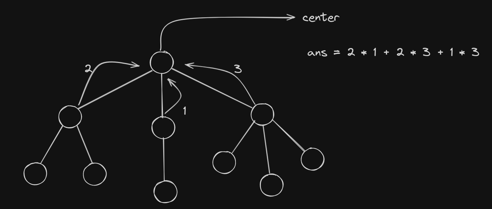
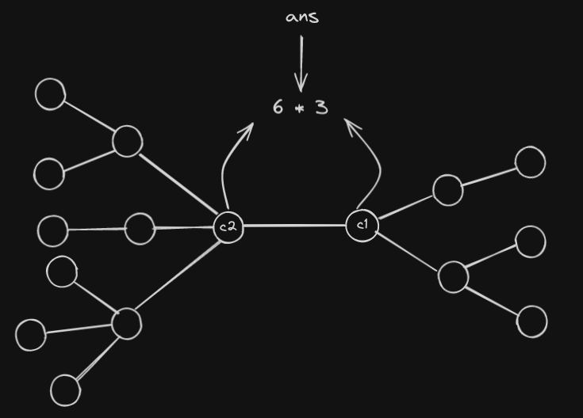
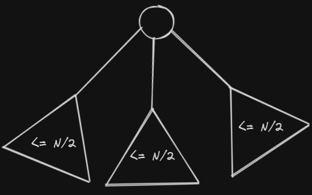
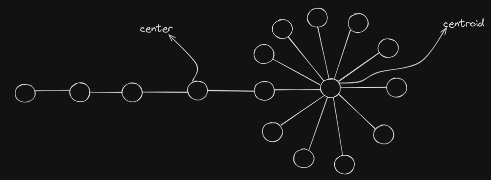
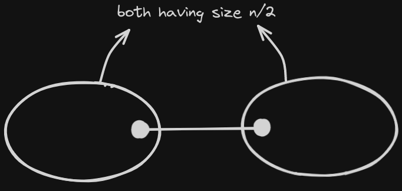
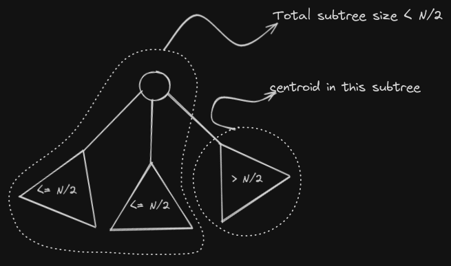

# Trees

Lets start with some basic definition of trees. The most common definitions are given below,

1. A graph with $N$ nodes having $N-1$ edges such that all pair of nodes are connected is a **Tree**.
2. A graph with $N$ nodes such that there is exactly $1$ path between any two nodes is a **Tree**.
3. A graph with $N$ nodes and $N-1$ edges such that there is only $1$ connected component.

**Calculating Fundamental Values in Trees**

Some of the fundamental values calculate for every node in a **rooted tree** are, parent, number of children, subtree size, depth of each node.

```c++
vector<vector<int>> tree;
int depth[100100];
int parent[100100];
int subtreeSize[100100];
int numOfChild[100100];

void dfs(int node, int p, int d)
{
    depth[node] = d;
    parent[node] = p;
    numOfChild[node] = 0;
    subTreeSize[node] = 0;
    for(int v : tree[node])
    {
        if(v == p) continue;
        dfs(v, node, d + 1);
        numOfChild[node]++;
        subTreeSize[node] += subTreeSize[v];
    }
}
```

---

## Diameter of Tree

Diameter is the largest distance between two nodes in a tree. Since there is only path between $2$ nodes in a tree we just say largest distance since there is not concept of shortest distance. But in case of graph the diameter is the largest shortest distance between any two nodes.

To find the diameter of two nodes, there mainly $2$ ways, one way is to do a dfs and for every node find the $2$ largest distance from the node to leaf nodes in its subtree, then sum of this is maximum path through this node in its subtree. We find this for all nodes and then the largest on will be diameter.

Another way to find diameter which is also a very elegant way is to start a dfs from a random node and find the $farthest$ node from this node. Then again do dfs from $farthest$ node and find $farthest'$ node. Then distance between $farthest$ and $farthest'$ is the diameter.

Below is the implementation of this algorithm.

```c++
vector<vector<int>> tree;
int depth[100100];

void dfs(int node, int p, int d)
{
    depth[node] = d;
    for(int v : tree[node])
    {
        if(v == p) continue;
        dfs(v, node, d + 1);
    }
}

void solve()
{
    // after taking input of tree
    // dfs to find distance of every node from vertex 1.
    dfs(1, 0, 0);
    
    // finding maximum distance node
    int farthest = 1;
    for(int i = 1; i <= n; i++)
    {
        if(depth[i] > depth[farthest])
        	farthest = i;
    }
    
    // find distance of each node from node farthest 
    dfs(farthest, 0, 0);
    
    // finding the farthest node
    for(int i = 1; i <= n; i++)
    {
        if(depth[i] > depth[farthest])
            farthest = i;
    }
}
```

---

## Center Of Tree

Before knowing about the **Center** we need to know some terms about tree.

1. **Eccentricity E(v):** of a vertex $v$ is the maximum distance from vertex $v$ to any other vertex $w$.
2. **Radius of Tree:** it the minimum eccentricity among all vertices in the tree.
3. **Diameter of Tree:** it is the maximum eccentricity among all vertices in the tree.
4. **Center of Tree:** vertex with minimum eccentricity in a tree $T$ is called center of tree.

**Theorem:** Every tree $T$ has only one or two centers.

**Proof:** The idea is that from any vertex $v$ the maximum distance from $v$ to any other vertex $w$ only occurs when $w$​ is a leaf vertex. Hence eccentricity of a vertex $v$ is always with a vertex $w$ which is a leaf node.

Now if we remove all leaf nodes from tree $T$ and make new tree $T'$. The eccentricity of all remaining vertices in $T'$ decreases by $1$, this means the centers of tree $T$ will still be center in tree $T'$. Hence we can say removing all leaf vertices from a tree doesn't change its center.

If we keep repeating the process then finally we will be left with either $1$ or $2$ vertices. Hence a tree has either $1$ or $2$​ centers.

**Properties of Center**

1. Center lies at the center of diameter, since the center of diameter will always be the last vertex to be removed in the above process.
2. Since Center lies on Diameter, it also means all diameters pass through center of the tree, this can be used in solving the problem number of diameters in tree.

Lets look at program to find the center of tree.

```c++
vector<vector<int>> g;
int depth[200100];
int parent[200100];

void dfs(int node, int p, int d)
{
    depth[node] = d;
    parent[node] = p;
    for(int v : g[node])
    {
        if(v == p) continue;
        dfs(v, node, d + 1);
    }
}
 
void solve(int Case)
{
    // take input here
	// assuming input is taken
    // finding first end or diameter
    dfs(1, 0, 0);
    int farthest = 1;
    for(int i = 2; i <= n; i++)
        if(depth[i] > depth[farthest]) 
            farthest = i;
    
    // finding second end of diameter
    dfs(farthest, 0, 0);
    farthest = 1;
    for(int i = 2; i <= n; i++)
        if(depth[i] > depth[farthest]) 
            farthest = i;
    
    if(depth[farthest] % 2)
    {
        cout << -1 << nline;
    }
    else
    {
        int d = depth[farthest] / 2;
        int currNode = farthest;
        while(d--)
        {
            currNode = parent[currNode];
        }
        cout << currNode << nline;
    }
}
```

---

## Number of Diameters

Here we have to first find center of the tree as shown above, then we have 2 cases

1. If there is only one center then the diameter is even. So we will go to every child of center and then find number of vertices at distance $(\frac d2) - 1$​ where $d$ is diameter. In dfs we can pass center as parent so that child dfs doesn't reach other child nodes.

   

2. The second case is when the diameter is odd, there there are $2$ centres lets call them $c1$ and $c2$. Then the number of diameters will be number of vertices at distance $\lfloor \frac d2 \rfloor$ from $c1$ multiplied with nodes at distance $\lfloor \frac d2 \rfloor$ from $c2$. For center $c1$ we can pass parent as $c2$ so that dfs doesn't go into $c2's$​ subtree and vice versa.

   

Below is the implementation of this solution.

```c++
vector<vector<int>> tree;
int depth[100100];
int parent[100100];

void dfs(int node, int p, int d)
{
    depth[node] = d;
    parent[node] = p;
    for(int v : tree[node])
    {
        if(v == p) continue;
        dfs(v, node, d + 1);
    }
}

int nodesAtDepth(int node, int p, int currDepth, int requiredDepth)
{
    if(currDepth == requiredDepth) return 1;
    int currAns = 0;
    for(int v : tree[node])
    {
        if(v == p) continue;
        currAns += nodesAtDepth(v, node, currDepth+1, requiredDepth);
    }
    return currAns;
}

void solve()
{
    // assuming input is taken
    // assuming center is found out using the code above and store in array centres
    if(centres.size() == 2)
    {
        int cnt1 = nodesAtDepth(centres[0], centres[1], 0, diameter / 2);
        int cnt2 = nodesAtDepth(centres[1], centres[0], 0, diameter / 2);
        
        cout << cnt1 * cnt2 << '\n';
    }
    else
    {
        int sum = 0;
        int res = 0;
        for(int v : tree[centers[0]])
        {
            int curr = nodesAtDepth(v, centres[0], 0, (diameter / 2) - 1);
            res += (sum * curr);
            sum += curr;
        }
        cout << res << '\n';
    }
}
```

---

## Centroid Of Tree

**Centroid** of a tree is a vertex such that if we hang tree from this vertex then all of the child vertices of this vertex will have subtree size $<= \frac N2$ where $N$ is the number of vertices.



The center of a tree and centroid are not necessarily the same node, in most they are but we can make cases when they are not the same vertex. For example a tree in which there is a long path and one end of the path has lot of nodes will have centroid near to the crowded end while center will still be center of diameter.



At max a tree can have two centroids, this only happens when subtree of $2$ nodes if of size $\frac N2$ each as shown below.



**Finding The Centroid**

Finding the centroid is a simple dfs. First we will do a dfs from any random node and then calculate the subtree size for each vertex. Then we do another dfs in this for every vertex we go over its children and check if $2 * size[childVertex] > N$ i.e subtree of $childVertex$ has size more than $\frac N2$.

If none of the vertex have this property then we can say that current vertex is the centroid and we return it. Otherwise we are sure that centroid lies in the subtree of the $childVertex$ whose size is $>= \frac N2$ and we continue dfs there.

**Note:** for current $vertex$ we only check for $childVertex$ because we are sure that the remaining subtree of its parent is surely of size $<= \frac N2$ this is becaues the reason we are at current node is because its subtree size if more than half, then remaining subtree must be less than half.



Below is the code implementation of this approach.

```c++
int find_centroid(int node, int p)
{
    for(int v : tree[node])
    {
        if(v == p) continue;
        if(2 * size[v] > N)
            return find_centroid(v, node);
    }
    // if we reach here, then no child with subtree > n/2
    // this means current node is a centroid
    return node;
}
```

**Why Is Centroid Useful?**

The most power that we get from centroid is that we can divide tree in subtrees each having size $<= \frac N2$. We can recursively find centroid of subtrees till subtree of size 1 remains, this process is called **Centroid Decomposition**. This helps us solve problems in $O(nlogn)$ complexity. This is similar to divide and conquer.

Lets understand this by a problem.

**Problem:** Given a tree of size n and we need to label each vertex with a capital english alphavet (A-Z). The is done so that on the path between any two vertices with same label there must be atleast $1$ higher labelled vertex. For if two vertices both have label $D$ then in there path there must be atleast one vertex with label $A$, $B$ or $C$. Consider size of tree $<= 10^5$.

**Solution:** We will find centroid of tree and label it with $A$, then we will find centroid of subtrees and label them with $B$​ and so on. For a vertex to go to another vertex with same label it must go through a centroid which was labelled before them and hence will have label higher than them.

In worst case a vertex will become centroid after $log(n)$ steps which for $n = 10^5$ is equal to $\approx 17$.

Below is the implementation of this approach.

```c++
vector<vector<int>> tree;
int sz[100100];
char label[100100];
bool marked[100100];	// used to tell if a node is marked as centroid or not
int n;

void dfsForSize(int node, int p)
{
    sz[node] = 1;
    for(int v : tree[node])
    {
        if(v == p || marked[v]) continue;
        dfsForSize(v, node);
        sz[node] += sz[v];
    }
}

int findCentroid(int node, int p)
{
    for(int v : tree[node])
    {
        if(v == p || marked[v]) continue;
        if(2 * sz[v] > n)
            return findCentroid(v, node);
    }
    return node;
}

void find_centroid_recursively(int node, char curr = 'A')
{
    dfsForSize(node, 0);
    int cent = findCentroid(node, 0);
    marked[cent] = 1;
    label[cent] = curr;
    // going over subtrees to find their centroid
    for(int v : tree[node])
    {
        if(!marked[v])
        {
            find_centroid_recursively(node, curr + 1);
        }
    }
}
```

