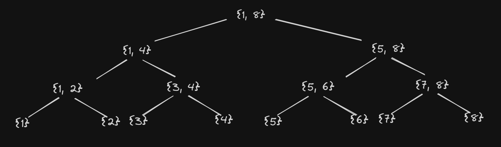
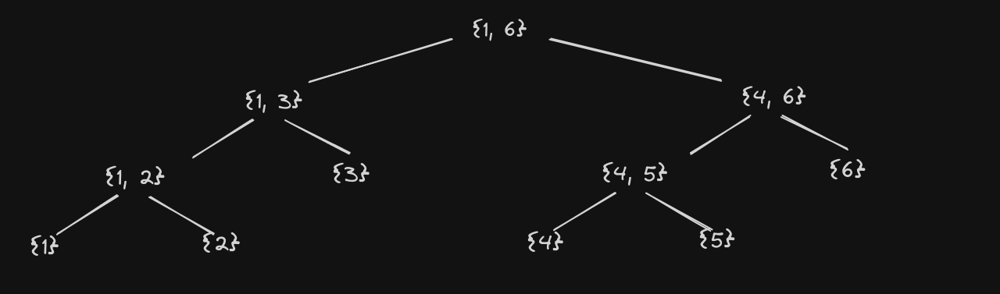
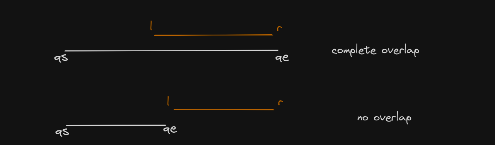
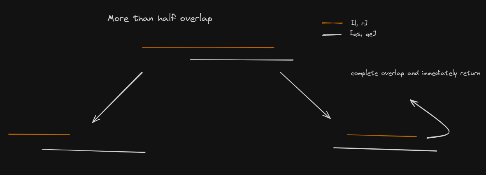
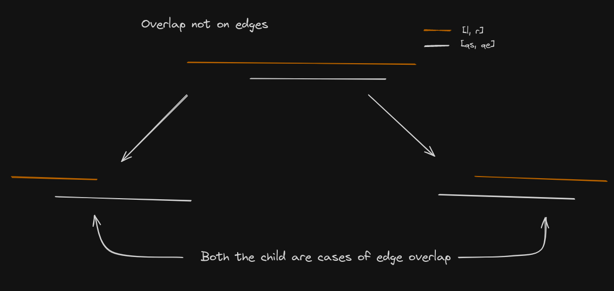

# Range Queries

## Difference Array

Suppose we have a problem in which we are given an array which is initially empty, now we are given `q` queries of type `l r x`, and we have to add `x` to all the elements of the array from `l` to `r` (l and r included). After all the queries we are required to return the final state of the array. 

To solve this problem we use something known as difference array. In this we add `x` to position `l` for every query and add `-x` to position `r + 1` (if it exist) for every query. Then after all the queries we do prefix sum of the array, this way `x` from `l` will propagate to `r` and after `r` since we add `-x` this propagation is stopped.

```c++
void diffArray()
{
    ll n;
    cin >> n;
    vector<ll> array(n + 1, 0);
    ll q;
    cin >> q;
    for (ll i = 0; i < q; i++)
    {
        ll l, r, x;
        cin >> l >> r >> x;
        array[l] += x;
        array[r + 1] -= x;
    }

    for (ll i = 1; i < n; i++)
        array[i] += array[i - 1];

    for (ll i = 0; i < n; i++)
        cout << array[i] << ' ';
}
```

--------------------------------------------------------------------------------------------------------------------------

## Segment Tree

Now lets look at another type of range query problem, in this we have two types of operations on the array array one is `1 i x`, here we have to update value at index `i` to `x`. The second type of query is `2 l r`, in this we need to print the sum of all the elements of the array from `l` to `r` (l and r included).

**Naive Methods:** the first method is to simply assign value `x` to `arr[i]` for query `1` and for query `2` we run a loop and calculate sum in `O(n)` time, hence average time complexity is `n + 1 / 2` which is `O(n)`. Another method is to use prefix sum, here to get sum we can simply do `prefix[r] - prefix[l-1]`, and to update we need to run a loop from `l` to `n` to update the prefix sum array. Hence time complexity is `O(n)` on average.

**Segment Tree:** here the idea is to preprocess the array to make a binary tree of the array, then both the queries can be done in `O(logn)` time. The root of the tree represents the whole array and then left child represents left half and right child represents right half. If the array size is odd then one half contains the extra 1 element. 

Hence each node represents some range of the array and its child represents the left half of that range and right half of that range. 

We will store this tree just like heap structure i.e in the form of an array, and the relation for left child will be `2*i+1` and for right child will be `2*i+2` and index `0` is the root node.

Now suppose we have 8 elements in our array, then we will have tree as follows



As we can see that if array size if power of 2 then we have a complete binary tree. 

But lets say that array size if not power of 2 then we have an incomplete binary tree i.e last level will not be filled completely. But since we are maintaining the relation `2*i+1` and `2*i+2` for left and right child we will have some empty nodes in the tree but these will be never accessed since they have no parent to call for them. 

For example consider the example of array of size 6, the tree will look like



If we index the nodes then we will have `[[1,6], [1,3], [4,6], [1,2], [3,3], [4,5], [6,6], [1,1], [2,2], empty, empty, [4,4], [5,5], empty, empty]`. As we can see that nodes with index 9, 10, 13, 14 are empty since they have no parent.

**Building Of Segment Tree:**

1. **Size of Tree:** Since we are building a binary tree we need to find maximum number of elements in the last level. Lets say there are n elements in the last level, then if n is a power of 2 i.e n = 2<sup>k</sup>. Then the size required is 2 * n - 1. If the size is not a power of 2 then we find the next power of 2 >= n, lets say it is m. Then size will be 2 * m - 1.

   If we have to boil this down into one formula, then we size is 2<sup>ceil(log2(n)) + 1</sup> - 1. Here ceil(log2(n)) is equal to power of 2 >= n. To calculate it in O(1) time we can use `<<` operator i.e `(1 << (int(ceil(log2(n))) + 1))`.

2. **Preprocessing:** having found out the size of the tree not its time to fill it. We will make a buildSegTree function which will have following template `buildSetTree(int node, int l, int r)`, here `node` is the index of current node in the tree, `l` and `r` is the segment of array it represents, `tree` and `arr` will be declared as global variable.

   Base case is when if `l == r` then simply we are at a leaf so we assign the value of `tree[node] = arr[l]`. 

   If `l != r` in that we find `mid = (l + r) / 2`, then we recursively call for left half and right half as `buildSegTree(2*node+1, l, mid)` and for right half as `buildSegTree(2*node+2, mid+1, r)`. 

   When both the calls end then value of current node is calculated which will be equal to sum of value of left child and right child i.e `tree[node] = tree[2*node+1] + tree[2*node+2]`. 

   Time complexity for making segment tree is O(size of tree), and since size can be at most `4n` hence time complexity is `O(4n) = O(n)`.

```c++
void buildSegTree(ll node, ll l, ll r)
{
    // base case
    if (l == r)
    {
        tree[node] = arr[l];
        return;
    }

    ll mid = (l + r) / 2;

    ll left = 2 * node + 1, right = 2 * node + 2;

    // calling for left child
    buildSegTree(left, l, mid);

    // calling for right child
    buildSegTree(right, mid + 1, r);

    // calculating value for current node
    tree[node] = tree[left] + tree[right];
}
```

3. **Update Query:** now for update query we just need to update all the nodes on the path from root node to the index that needs to be updated, for this we will have to make a function `updateSegTree` with template `updateSegTree(int node, int l, int r, int updateIndx, int newValue)`, here all the things mean the same as they did in `buildSegTree`, just we have added `updateIndx` and `newValue` that we receive in the query. 

   Now if `l == r`, then it means that we are at the end of path from root to node that needs to be updated, here we put `tree[node] = newValue` and `arr[node] = newValue` and return. 

   For when `l != r` in that case we find `mid` and then find which half does `updateIndx` lie and then call update for that half, after update of that half is finished we update current node the same way as we did in `buildSegTree` and return. Time complexity of this is equal to heigh the tree which is equal to `log(n)`.

```c++
void updateSegTree(ll node, ll l, ll r, ll updateIndx, ll newValue)
{
    // base case
    if (l == r)
    {
        tree[node] = arr[updateIndx] = newValue;
        return;
    }

    ll mid = (l + r) / 2;

    ll left = 2 * node + 1, right = 2 * node + 2;

    // calling for left child if it is on the path
    if (updateIndx <= mid)
        updateSegTree(left, l, mid, updateIndx, newValue);

    // calling for right child if it is on the path
    if (updateIndx > mid)
        updateSegTree(right, mid + 1, r, updateIndx, newValue);

    // updating value for current node
    tree[node] = tree[left] + tree[right];
}
```

4. **Range Sum:** the final thing that we need to handle is finding the range sum for this also we will need to write a function which will have the following template `rangeQuery(int node, int l, int r, int qs, int qe)`, here everything is same as previous functions except `qs` and `qe` which stand for query start and query end indices. 

   Here base case changes, first we need to check if current range lies completely inside the query range i.e `qs <= l && r <= qe`, then we need to return the value of this whole range in our answer.

   Second base case is if query range is completely outside current range i.e `qe < l || r < qs`, in this case we return a value that does not make any change to the answer hence we return 0 (for range sum). 

   Now if we have current range is partially inside the query range then we call for left and right half recursively and return the sum of values returned by those functions.

```c++
ll rangeQuery(ll node, ll l, ll r, ll qs, ll qe, vector<ll> &tree)
{
    if (qs <= l && r <= qe)
        return tree[node]; // full overlap

    if (r < qs || qe < l)
        return 0; // not overlap

    // case of partial overlap
    ll mid = (l + r) / 2;
    ll left = 2 * node + 1, right = 2 * node + 2;
    return rangeQuery(left, l, mid, qs, qe, tree) + rangeQuery(right, mid + 1, r, qs, qe, tree);
}
```

**Time complexity of range query** is also `O(logn)` but it is not apparent by just looking at the function which gives hint toward O(n) time complexity, but this is not the case.

First of all, if there is full overlap or complete disjoint then we immediately return.



If there is partial overlap, then there are two cases, one is overlap happens at the edges and other overlap not at edges. For overlap at edges we can prove that time complexity is `O(logn)`. Consider edge overlap case where there is more than half overlap. In this case we will call for left and right halfs and one of them will completely overlap with query range and immediately return (as shown in the diagram below).



Similarly in case of edge overlap where there is less than half length overlap, we will call for left and right half and one of them will fall in no overlap case and return immediately.

Hence in case of edge overlap only one of the calls actually propagate giving complexity `O(logn)`.

But what if there is overlap not on edges, well then in that case we call for left and right and both of the call will be edge overlaps and each will have complexity `O(logn)` and hence overall complexity is `O(2 * logn) = O(logn)`.



**Memory Optimized Implementation**

In the worst case we will have `n` as 1 more than power of 2. In that case next power of 2 `>= n` will be almost **2 times** `n` and space required will be almost `4n`.

For making a segment tree of an array of size `n` we actually only need `2n - 1` nodes. Proof of this is given below.

<details open>
    <summary>Proof</summary>
    <br>
    The statement is true for <code>n = 1</code> i.e we only need <code>2 * 1 - 1 = 1</code> nodes. For any other <code>n > 1</code> we can prove this by induction. For a given <code>n</code>, the root node represents all <code>n</code> elements, if the statement is true for its left and right child then it will be true for it as well. 
    <br>
    <br>
    For example if <code>n</code> is <code>10</code>, then left child represents <code>5</code> elements and right child also represents <code>5</code> elements. If statement is true for child nodes then left side will have <code>2 * 5 - 1</code> nodes, and right will also have <code>2 * 5 - 1</code> nodes. In total entire tree will have <code>2 * 5 - 1) + (2 * 5 - 1) + 1 = 2 * 10 - 1</code>.
    <br>
    <br>
    If we keep going down in tree then leaf nodes represent 1 element and we know statement is true for <code>n = 1</code>. Hence statement will be true for their parent node, and then statement becomes true for this parents parent and so on till we reach root node.
</details>
To store efficiently in place of binary tree we can store the tree in **Euler Tour** order or we can also say **Preorder Treversal**. Then for a node at index `v` its left child will be at index `v+1`. The index of right can also be calculated, the left child represents elements from `l` to `mid` then number of elements in will be `k = mid - l + 1`. Hence total nodes in subtree of left node will be `2 * k - 1`. Hence index of right node will be `2 * k + v`.

----------------------------------------------------------------------------------------------------------------------------

## Lazy Segment Tree

This is a special of segment tree, suppose we have queries of type add `x` to all from `l` to `r`, and get sum of all from `l` to `r`. How do we do this, we can get sum using segment tree, but to do range updates in `logn` time we use **lazy trees**.

Here we exploit the idea that we don't actually need the node be updated to latest value until asked for it. The update function becomes to range update function, the idea is when we see a complete overlapping range then we update that node and keep the updates for child nodes pending in the lazy tree (if curr node has child nodes) and return from here. If current node's range is completely disjoint from update range then we don't make any change and return. In case of partial updates we we call for update for left and right child and then update current node in normal way. This way we achieve range updates in logn time.

1. **Build Function:** the build function remains the same.

2. **Update Function:** first we start by checking for current node if there is pending updates from previous queries, then after that we check for complete overlap if yes then we update current node and push update for child nodes in the lazy tree. If complete disjoint then we simply return, and if partial overlap then we call for update child nodes and then update current node. Now lazy tree must have some default that we check for to know if pending updates are there or not, for our current case where we have to add x to a range, we can put default as 0.

```c++
void updateSegTree(ll node, ll l, ll r, ll qs, ll qe, ll value, vector<ll> &tree, vector<ll> &lazy)
{
    // checking for pending updates
    if (lazy[node] != 0)
    {
        // updating current node and pushing for pending of child nodes
        // adding x to all elements from l to r will increase current nodes value by (r - l + 1) * x
        tree[node] += (r - l + 1) * lazy[node];

        // pushing down
        if (l != r)
        {
            lazy[2 * node + 1] += lazy[node];
            lazy[2 * node + 2] += lazy[node];
        }

        // resetting lazy for current node, meaning no pending updates
        lazy[node] = 0;
    }

    // proceeding with current update
    // complete overlap, we update current node, push updates for child nodes in lazy tree
    if (qs <= l && r <= qe)
    {
        tree[node] += (r - l + 1) * value;

        // pushing for pending updates for child nodes
        if (l != r)
        {
            lazy[2 * node + 1] += value;
            lazy[2 * node + 2] += value;
        }

        return;
    }
	// disjoint so we don't need to update
    if (qe < l || r < qs)
    {
        return;
    }

    // case of partial overlap
    ll mid = (l + r) / 2, left = 2 * node + 1, right = 2 * node + 2;

    updateSegTree(left, l, mid, qs, qe, value, tree, lazy);
    updateSegTree(right, mid + 1, r, qs, qe, value, tree, lazy);

    // updating current node
    tree[node] = tree[left] + tree[right];
}

```


3. **Query Function:** this remains the same just it might happen that we reach some which is not updated, hence at the start of the function we check if the node is fully updated or not just like we did in update function

```c++
ll query(ll node, ll l, ll r, ll qs, ll qe, vector<ll> &tree, vector<ll> &lazy)
{
    // checking for pending updates
    if (lazy[node] != 0)
    {
        // updating current node and pushing for pending of child nodes
        // adding x to all elements from l to r will increase current nodes value by (r - l + 1) * x
        tree[node] += (r - l + 1) * lazy[node];

        // pushing down
        if (l != r)
        {
            lazy[2 * node + 1] += lazy[node];
            lazy[2 * node + 2] += lazy[node];
        }

        // resetting lazy for current node
        lazy[node] = 0;
    }

    // processing query as usual

    if (qs <= l && r <= qe)
        return tree[node]; // complete overlap

    if (qe < l || r < qs)
        return 0; // disjoint

    // case of partial overlap
    ll mid = (l + r) / 2, left = 2 * node + 1, right = 2 * node + 2;

    return query(left, l, mid, qs, qe, tree, lazy) + query(right, mid + 1, r, qs, qe, tree, lazy);
}
```

**Note:** in this case what will be default value and how node updates with update to all the child nodes and the default value of lazy tree, and how lazy tree stores pending updates are very crucial.

-----------------------------------------------------------------------------------------------------------------------

## Saving the entire subarrays in each vertex

This is a separate subsection that stands apart from the others, because at each vertex of the Segment Tree we don't store information about the corresponding segment in compressed form (sum, minimum, maximum, ...),  but store all elements of the segment. Thus the root of the Segment Tree will store all elements of the array,  the left child vertex will store the first half of the array, the right  vertex the second half, and so on.

In its simplest application of this technique we store the elements in  sorted order. In more complex versions the elements are not stored in lists, but more  advanced data structures (sets, maps, ...).  But all these methods have the common factor, that each vertex requires  linear memory (i.e. proportional to the length of the corresponding  segment).

The first natural question, when considering these Segment Trees, is about memory consumption. Intuitively this might look like  $O(n^2)$  memory, but it turns out that the complete tree will only need  $O(n \log n)$  memory. Why is this so? Quite simply, because each element of the array falls into  $O(\log n)$  segments (remember the height of the tree is  $O(\log n)$ ).

So in spite of the apparent extravagance of such a Segment Tree, it  consumes only slightly more memory than the usual Segment Tree. 

Several typical applications of this data structure are described below.

**Problem:** Given an array of size n and q queries. Each query is `l r x` we need to find the smallest number `>= x` in the given range.

**Solution:** If we have store at each vertex the elements in that segment in sorted order, then answer this query will be easy. We query how we have been doing it. For cases of disjoint range we return **INF**. For case of complete overlap we need to find the smallest number `>= x` in that range which can be done using `upper_bound`. For partial overlap case we return the minimum of the answers returned by left and right side.

The time complexity of build function is $O(nlogn)$ and time complexity of each query is $O(log^2(n))$.

**Note:** here at each vertex we will store a `vector<int>` which will store all elements in that range in sorted order. It easy to build this for current vertex given that we have built it for left and right segments, this is similar to **Merge Sort**. Building of the tree will be $O(nlogn)$​​ operation.

In the below implementation we use memory efficient segment tree.

```c++
int n;
vector<vector<int>> tree;
vector<int> arr;

void buildSegTree(int node, int l, int r)
{
    if(l == r)
    {
        tree[node] = vector<int>(1);
        tree[node][0] = arr[l];
        return;
    }
    
    int mid = (l + r) / 2;
    int leftSize = mid - l + 1;
    int rightSize = r - mid;
    int leftNode = node + 1;
    int rightNode = node + 2 * leftSize;
    
    buildSegTree(leftNode, l, mid);
    buildSegTree(rightNode, mid+1, r);
    
    tree[node] = vector<int>();
    int i = 0, j = 0;
    while(i < leftSize && right < rightSize)
    {
        if(tree[leftNode][i] < tree[rightNode][j])
            tree[node].push_back(tree[leftNode][i++]);
       	else
            tree[node].push_back(tree[rightNode][j++]);
    }
    while(i < leftSize) 
        tree[node].push_back(tree[leftNode][i++]);
    while(j < rightSize) 
        tree[node].push_back(tree[rightNode][j++]);
}

int query(int node, int l, int r, int qs, int qe, int x)
{
    if(r < qs || qe < l)
        return INF;
    else if(qs <= l && r <= qe)
    {
        // we find upper_bound(x)
        int indx = upper_bound(tree[node].begin(), tree[node].end(), x) - tree[node].begin();
        if(indx < (int)tree[node].size())
            return tree[node][indx];
        else
            return INF;
    }
    
    int mid = (l + r) / 2;
    int leftSize = mid - l + 1;
    int leftNode = node + 1;
    int rightNode = 2 * leftSize;
    
    return min(query(leftNode, l, mid, qs, qe, x), query(rightNode, mid+1, r, qs, qe, x));
}

void solve()
{
    cin >> n;
    arr.resize(n);
    tree.resize(2 * n);
    for(int i = 0; i < n; i++) cin >> arr[i];
    buildSegTree();
}
```

**Note:** if along with range query we are also given modification queries then in that case we can store `set<int>` in place of `vector<int>` at each vertex. In this case the time complexity of building the tree will be $O(nlog^2(n))$.

---

## Sparse Table

Sparse Table is a data structure, that allows answering range queries. It can answer most range queries in  $O(\log n)$ , but its true power is answering range minimum queries (or equivalent range maximum queries). For those queries it can compute the answer in  $O(1)$  time.

The only drawback of this data structure is, that it can only be used on *immutable* arrays. This means, that the array cannot be changed between two queries. If any element in the array changes, the complete data structure has to be recomputed.

**Intuition**

Any non-negative number can be uniquely represented as a sum of decreasing powers of two. This is just a variant of the binary representation of a number. E.g.  $13 = (1101)_2 = 8 + 4 + 1$ . For a number  $x$  there can be at most  $\lceil \log_2 x \rceil$  summands.

By the same reasoning any interval can be uniquely represented as a  union of intervals with lengths that are decreasing powers of two. E.g.  $[2, 14] = [2, 9] \cup [10, 13] \cup [14, 14]$ , where the complete interval has length 13, and the individual intervals have the lengths 8, 4 and 1 respectively. And also here the union consists of at most  $\lceil \log_2(\text{length of interval}) \rceil$  many intervals.

The main idea behind Sparse Tables is to precompute all answers for range queries with power of two length for every index. Afterwards a different range query can be answered by splitting the  range into ranges with power of two lengths, looking up the precomputed answers, and combining them to receive a complete answer.

**Precomputation**

We will use a 2-dimensional array for storing the answers to the precomputed queries. $\text{st}[i][j]$  will store the answer for the range  $[j, j + 2^i - 1]$  of length  $2^i$ . The size of the 2-dimensional array will be  $(K + 1) \times \text{MAXN}$ , where  $\text{MAXN}$  is the biggest possible array length. $\text{K}$  has to satisfy  $\text{K} \ge \lfloor \log_2 \text{MAXN} \rfloor$ , because  $2^{\lfloor \log_2 \text{MAXN} \rfloor}$  is the biggest power of two range, that we have to support. For arrays with reasonable length ( $\le 10^7$  elements),  

$K = 25$  is a good value.

The  $\text{MAXN}$  dimension is second to allow (cache friendly) consecutive memory accesses.

```c++
int st[K + 1][MAXN];
```

Because the range  $[j, j + 2^i - 1]$  of length  $2^i$  splits nicely into the ranges  $[j, j + 2^{i - 1} - 1]$  and  $[j + 2^{i - 1}, j + 2^i - 1]$ , both of length $2^{i - 1}$ , we can generate the table efficiently using dynamic programming:

```c++
// for k = 0, the table simple equal to the array
std::copy(array.begin(), array.end(), st[0]);

for (int i = 1; i <= K; i++)
    for (int j = 0; j + (1 << i) <= N; j++)
        st[i][j] = f(st[i - 1][j], st[i - 1][j + (1 << (i - 1))]);
```

The function  $f$  will depend on the type of query. For range sum queries it will compute the sum, for range minimum queries it will compute the minimum.

The time complexity of the precomputation is  $O(\text{N} \log \text{N})$ .

**Range Sum Queries**

For this type of queries, we want to find the sum of all values in a range. Therefore the natural definition of the function  $f$  is  $f(x, y) = x + y$ . We can construct the data structure with:

```c++
long long st[K + 1][MAXN];

std::copy(array.begin(), array.end(), st[0]);

for (int i = 1; i <= K; i++)
    for (int j = 0; j + (1 << i) <= N; j++)
        st[i][j] = st[i - 1][j] + st[i - 1][j + (1 << (i - 1))];
```

To answer the sum query for the range  $[L, R]$ , we iterate over all powers of two, starting from the biggest one. As soon as a power of two  $2^i$  is smaller or equal to the length of the range ( $= R - L + 1$ ), we process the first part of range  $[L, L + 2^i - 1]$ , and continue with the remaining range  $[L + 2^i, R]$ .

```c++
long long sum = 0;
for (int i = K; i >= 0; i--) {
    if ((1 << i) <= R - L + 1) {
        sum += st[i][L];
        L += 1 << i;
    }
}
```

Time complexity for a Range Sum Query is  $O(K) = O(\log \text{MAXN})$ .

**Range Minimum Queries (RMQ)**

These are the queries where the Sparse Table shines. When computing the minimum of a range, it doesn't matter if we process a value in the range once or twice. Therefore instead of splitting a range into multiple ranges, we can also split the range into only two overlapping ranges with power of two  length. E.g. we can split the range  $[1, 6]$  into the ranges  $[1, 4]$  and  $[3, 6]$ . The range minimum of  $[1, 6]$  is clearly the same as the minimum of the range minimum of  $[1, 4]$  and the range minimum of  $[3, 6]$ . So we can compute the minimum of the range  $[L, R]$  with:

 $$\min(\text{st}[i][L], \text{st}[i][R - 2^i + 1]) \quad \text{ where } i = \log_2(R - L + 1)$$ 

This requires that we are able to compute  $\log_2(R - L + 1)$  fast. You can accomplish that by precomputing all logarithms:

```
int lg[MAXN+1];
lg[1] = 0;
for (int i = 2; i <= MAXN; i++)
    lg[i] = lg[i/2] + 1;
```

Another way to find $\log_2(R - L + 1)$ in O(1) time is to use the `__builtin_clz()` function which given count of leading zeroes of argument integer. If we are storing values in `int` then there are 31 bits in the number and if we remove the leading zeroes then we get the position of highest set bit i.e `31 - __builtin_clz(r - l + 1)`.

**Note:** Sparse tables shines when function f is self inverting i.e f(x, x) = x. Examples of such functions are min/max/gcd.

```c++
template <typename Node>
struct SparseTable
{
    vector<vector<Node>> table;
    vector<ll> logValues;
    int n;
    int maxLog;
    vector<ll> a;
    SparseTable(int n1, vector<ll> &arr)
    {
        n = n1;
        a = arr;
        table.resize(n);
        logValues.resize(n + 1);
        maxLog = log2(n);
        logValues[1] = 0;
        for (int i = 2; i <= n; i++)
        {
            logValues[i] = logValues[i / 2] + 1;
        }
        for (int i = 0; i < n; i++)
        {
            table[i].resize(maxLog + 1);
            fill(all(table[i]), Node());
        }
        build();
    }
    void build()
    {
        for (int i = 0; i < n; i++)
        {
            table[i][0] = Node(a[i]);
        }
        for (int i = 1; i <= maxLog; i++)
        {
            for (int j = 0; (j + (1 << i)) <= n; j++)
            {
                table[j][i].merge(table[j][i - 1], table[j + (1 << (i - 1))][i - 1]);
            }
        }
    }
    // for range sum, xor etc type of queries
    Node queryNormal(int left, int right)
    {
        Node ans = Node();
        for (int j = logValues[right - left + 1]; j >= 0; j--)
        {
            if ((1 << j) <= right - left + 1)
            {
                ans.merge(ans, table[left][j]);
                left += (1 << j);
            }
        }
        return ans;
    }
    // for min/max/gcd type of queries
    Node queryIdempotent(int left, int right)
    {
        int j = logValues[right - left + 1];
        Node ans = Node();
        ans.merge(table[left][j], table[right - (1 << j) + 1][j]);
        return ans;
    }
};
struct Node1
{
    ll val; // store more info if required
    Node1()
    { // Identity Element
        val = 0;
    }
    Node1(ll v)
    {
        val = v;
    }
    // define merge function to merge two ranges
    void merge(Node1 &l, Node1 &r)
    {
        val = l.val ^ r.val;
    }
};
```

---

## Fenwick Tree Or Binary Indexed Tree

This is used to process queries like range sum, and point update in logn time. Segment tree also does in logn time but **BIT** (binary indexed tree) is faster, this because segment tree takes logn time for update and $O(4*logn)$ time to query, and might take $O(4n)$ space, but **BIT** take exactly $logn$ time for update and query and also takes $O(n)$​ space.

**Definition of g(i)**

The idea is we will create an array `T` in which all index `i` will store sum of sub array of len `g(i)` ending at `i`, here `g(i)` is a function. If we define `g(i) = i` then our `T` will simply be prefix sum array and if we define `g(i) = 1`, then our array `T` is same as input array. 

In case of **BIT** we put $g(i) = 2^k$ where **k** is minimum set bit in `i`, for example if $i = 12 = (1100)_2$, then `g(i) = 4`. Doing this will help us to get prefix sum in $logn$​ time, and using this we can get sum from any range. 

**Note:** from the definition it is clear that atleast `1` bit must be set in `i`, hence we have to use 1-based indexing in this implementation.

**Processing Range Sum Queries**

But how to get prefix sum using this, well it can be achieved through a simple for loop as shown below.

```c++
int g(int indx)
{
    return (indx & (-indx));
}

int getPrefixSum(int indx)
{
    int sum = 0;
    while(indx > 0)
    {
        // adding range indx - g(indx) + 1 to indx
        sum += T[indx];
        // updating indx
        indx = indx - g(indx);
    }
    return sum;
}
```

The time complexity of this loop is actually $O(log(indx))$ since in each iteration we are simply unsetting a bit from $indx $. Hence number of times the loop runs is equal to number of set bits in indx which is $O(log(indx))$ and in general we can say time complexity is $O(logn)$. 

**Updating in BIT**

Now lets look at how do we update **BIT** in case we have to add `x` at index `i`. For we update $T[i]$.

Now we need to update all ranges in which index i lies i.e we need to update all $j$ such that $j > i$ and $j - g(j) + 1 <= i$ or $j - g(j) < i$. 

If we look at the condition that $j > i$, this means that the first bit which is different in $j$ and $i$, $j$ must have a $1$ there and $i$ must have a $0$ there. Now we claim that j will have all the bits 0 after this bit where they first differ, this is because if that is not the case then $j - g(i)$ will still be greater than i as the bit where $j$ and $i$ differ is still present in $j$.

But how do we find all the $j$ that satisfy this, we need to find first unset bit in $i$ after smallest set bit, and we set it while keeping all smaller bits as $0$ and later bits same as $i$. For example, if $i = (110010)_2$, then next $j$ will be $(110100)_2$, and next one will be $(1110000)_2$. We can see that these can be produced by adding smallest bit to $i$, i.e updating $i = i + g(i)$​.

Below is the implementation of this.

```c++
void updateBIT(int indx, int value)
{
    // updating indx
    T[indx] += value;
    indx = indx + (indx & (-indx));
    while(indx <= n)
    {
        T[indx] += value;
        indx = indx + g(i);
    }
}
```

**Building Fenwick Tree or BIT**

Building the tree takes $O(n)$ time using prefix arrays as $T[i] = prefix[i] - prefix[i - g(i)]$.

```c++
void buildBIT(vector<int>& arr, int n)
{
    T.resize(n+1);
    vector<int> prefix(n+1);
    // assuming arr is 1 index based
    for(int i = 1; i <= n; i++)
    {
    	prefix[i] = pref[i-1] + arr[i];
        T[i] = prefix[i] - prefix[i - g(i)];
    }
}
```


