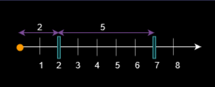

# Range Query Ideas

Here we will discuss different range query idea through problems.

**Problem:** There exists an infinite number line, with its origin at 0 and extending towards the **positive** x-axis.

You are given a 2D array `queries`, which contains two types of queries:

1. For a query of type 1, `queries[i] = [1, x]`. Build an obstacle at distance `x` from the origin. It is guaranteed that there is **no** obstacle at distance `x` when the query is asked.
2. For a query of type 2, `queries[i] = [2, x, sz]`. Check if it is possible to place a block of size `sz` *anywhere* in the range `[0, x]` on the line, such that the block **entirely** lies in the range `[0, x]`. A block **cannot** be placed if it intersects with any obstacle, but it may touch it. Note that you do **not** actually place the block. Queries are separate.

Return a boolean array `results`, where `results[i]` is `true` if you can place the block specified in the `ith` query of type 2, and `false` otherwise.

**Note:** Here number of `queries` <= 1e5 and `x` <= 5e4.



**Solution:** We will maintain an array `arr` of size `maxX`. For each index if there is an obstacle at that point we will store the length of empty space starting from that point. We will also maintain a `set<int> positions`, which will store positions of all obstacles so far. Now for each new obstacle we will simply find positions of closest obstacles to its left and right, let they be `l` and `r`. In the array we need to update `arr[l] = x - l` and `arr[x] = r - x`.

Now to find maximum empty space between `[0, x]` we first find closest osbtacle to left of `x`, let it be `pos`, then we do a range maximum on `arr` for range `[0, pos-1]` and get maximum empty space in that range, we also have another empty space between `pos` to `x`, we can compare maximum empty space with `sz` to get our answer.

---

**Problem:** You are given an array `nums` consisting of integers. You are also given a 2D array `queries`, where `queries[i] = [posi, xi]`. For query `i`, we first set `nums[posi]` equal to `xi`, then we calculate the answer to query `i` which is the **maximum** sum of a subsequence of `nums` where **no two adjacent elements are selected**.

Return the *sum* of the answers to all queries. Since the final answer may be very large, return it **modulo** `109 + 7`.

A **subsequence** is an array that can be derived from  another array by deleting some or no elements without changing the order of the remaining elements.

**Solution:** the idea is to used segment tree to find maximum subsequence sum after every update. The only tricky part is the node of segment tree and how do we merge the nodes. This is clearly implemented in the code below.

```c++
struct Node {
    // maxSum = max sum
    // sumExcludingR = max sum excluding right most cell
    // sumExcludingL = max sum excluding left most cell
    // sumExcludingB = max sum excluding right and left most cells
    int maxSum, sumExcludingR, sumExcludingL, sumExcludingB;
    Node()
    {
        maxSum = sumExcludingR = sumExcludingL = sumExcludingB = 0;
    }
};

const int mod = 1e9 + 7;

class Solution {
    vector<Node> tree;
    int n, sz;
    void calculateCurrentNode(int node)
    {
        int left = 2 * node + 1, right = 2 * node + 2;
        // case when max sum entirely lies in one side
        tree[node].maxSum = max(tree[left].maxSum, tree[right].maxSum);
        // case when sum lies on both sides
        tree[node].maxSum = max(tree[node].maxSum, tree[left].sumExcludingR + tree[right].maxSum);
        tree[node].maxSum = max(tree[node].maxSum, tree[left].maxSum + tree[right].sumExcludingL);
        tree[node].maxSum %= mod;
        
        tree[node].sumExcludingR = tree[left].maxSum + tree[right].sumExcludingB;
        tree[node].sumExcludingR = max(tree[node].sumExcludingR, tree[left].sumExcludingR + tree[right].sumExcludingR);
        tree[node].sumExcludingR %= mod;

        tree[node].sumExcludingL = tree[left].sumExcludingB + tree[right].maxSum;
        tree[node].sumExcludingL = max(tree[node].sumExcludingL, tree[left].sumExcludingL + tree[right].sumExcludingL);
        tree[node].sumExcludingL %= mod;

        tree[node].sumExcludingB = tree[left].sumExcludingB + tree[right].sumExcludingR;
        tree[node].sumExcludingB = max(tree[node].sumExcludingB, tree[left].sumExcludingL + tree[right].sumExcludingB);
        tree[node].sumExcludingB %= mod;
    }
    void initSegTree(int node, int l, int r, vector<int>& arr)
    {
        if(l == r)
        {
            tree[node].maxSum = max(0, arr[l]);
            return;
        }
        int mid = (l + r) / 2;
        int left = 2 * node + 1;
        int right = 2 * node + 2;
        initSegTree(left, l, mid, arr);
        initSegTree(right, mid+1, r, arr);

        calculateCurrentNode(node);
    }

    void updateSegTree(int node, int l, int r, int indx, int value)
    {
        if(l == r)
        {
            tree[node].maxSum = max(0, value);
            return;
        }
        int mid = (l + r) / 2;
        int left = 2 * node + 1;
        int right = 2 * node + 2;
        if(indx <= mid)
            updateSegTree(left, l, mid, indx, value);
        else
            updateSegTree(right, mid+1, r, indx, value);

        calculateCurrentNode(node);
    }

public:
    int maximumSumSubsequence(vector<int>& nums, vector<vector<int>>& queries) {
        n = nums.size();
        sz = (1 << ((int)(ceil(log2(n)) + 1)));
        tree.resize(sz, Node());
        initSegTree(0, 0, n-1, nums);
        int res = 0;
        for(auto& q : queries)
        {
            int pos = q[0];
            int val = q[1];
            updateSegTree(0, 0, n-1, pos, val);
            res += tree[0].maxSum;
            res %= mod;
        }
        return res;
    }
};
```

