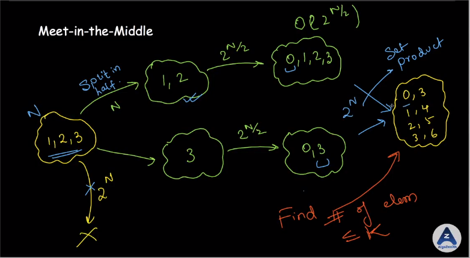
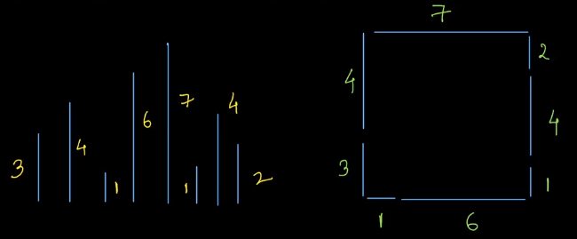

# Meet In The Middle

In this topic we learn how to optimize brute force approach for some problem by dividing data in 2 parts and solving for these parts and then merging to get final answer. Lets learn this by a problem,

**Problem:** Given an array `arr` of size `n` and a number `x`. We need to find number of subsets of `arr` such that sum of elements of these subsets is `<= x`. Here `n <= 20`.

**Solution:** since `n <= 20` we can use bitmasking and iterate over all subsets and then check if they have sum smaller than `x` and return answer. The time complexity of below code is O(n2<sup>n</sup>).

```c++
int generateValidSubsets(vector<int>& arr, int x)
{
	int n = arr.size();
	int maskEnd = (1<<n);
	int res = 0;
	for(int mask = 0; mask < maskEnd; mask++)
	{
		int currSum = 0;
		for(int i = 0; i < n; i++)
		{
			if((mask>>i)&1)
				currSum += arr[i];
		}
		if(currSum <= x) res++;
	}
	return res;
}
```

The above problem didn't need any optimization, but not lets consider the same problem but this time the constraints are that `n <= 40`

**Solution:** the above function will give tle for this value of `n`. Here we use meet in the middle optimization, we will divide the array in two parts and then generate subsets sums of both the parts. Now we will loop over first part sum values, let it be sum, then we can merge all subsets of second part with subset whose sum are `<= x - sum` which can found out using binary search.



```c++
vector<int> generateValidSubsets(vector<int>& arr, int x)
{
	int n = arr.size();
	int maskEnd = (1<<n);
	vector<int> res;
	for(int mask = 0; mask < maskEnd; mask++)
	{
		int currSum = 0;
		for(int i = 0; i < n; i++)
		{
			if((mask>>i)&1)
				currSum += arr[i];
		}
		if(currSum <= x) res.push_back(currSum);
	}
	sort(res.begin(), res.end()); // sorting for binary search
	return res;
}

int countValidSubsets(vector<int>& arr, int x)
{
    int n = arr.size();

    vector<int> partition[2];

    for(int i = 0; i < n; i++)
    {
        // dividing array in 2 parts using parity of index
    	partition[i&1].push_back(arr[i]);
    }

    vector<int> subsetSums1 = generateValidSubsets(partition[0], x);
    vector<int> subsetSums2 = generateValidSubsets(partition[1], x);

    int res = 0;

    // Looping over first partition and finding matches in second using binary search
    for(int val:subsetSums1)
    {
    	res += upper_bound(subsetSums2.begin(), subsetSums2.end(), x - val) - subsetSums2.begin();
    }

    return res;

}
```

The Time complexity of this code is O(n2<sup>n/2</sup>) for generating subset sums of both parts and then O(2<sup>n/2</sup> log2<sup>n/2</sup>) = O(n2<sup>n/2</sup>) for second loop calculating the res, hence overall we have O(n2<sup>n/2</sup>).

---

Lets Discuss More problems where we can use the meet in the middle idea.

**Problem (4 Sum):** given an array `arr` of size `n` and a number `X` we need to tell if it is possible to find indices `a b c d` such that `arr[a] + arr[b] + arr[c] + arr[d] = X`. Here `n <= 1000` and `0 <= a,b,c,d < n` (i.e indices might be repeated).

**Solution:** the naive approach with 4 nested loops will be O(n<sup>4</sup>) which will be too slow. Here we can use the meed in the middle idea and consider `arr[a] + arr[b] = x` and calculate all possible values of `arr[a] + arr[b]` using n<sup>2</sup> loop then we can again do a n<sup>2</sup> loop for values of `arr[c] + arr[d]` and check in our set whether `X - arr[c] - arr[d]` is present or not. Time complexity will be O(n<sup>2</sup> log(n<sup>2</sup>)) = O(n<sup>2</sup> logn).

```c++
bool numberOf4Sum(vector<int> arr, int x)
{
    int n = arr.size();
    set<int> sums;  // possible values of arr[a]+arr[b]
    for(int a = 0; a < n; a++)
    {
        for(int b = a + 1; b < n; b++)
        {
            sums.insert(arr[a]+arr[b]);
        }
    }

    int res = 0;
    for(int c = 0; c < n; c++)
    {
        for(int d = c + 1; d < n; d++)
        {
            if(sums.find(x - arr[c]-arr[d]) != sums.end())
                return true;
        }
    }
    return false;
}
```

**4 Sum Variant 2:** given an array `arr` of size `n` and a number `X` we need to find 4 distinct indices `a b c d` such that `arr[a] + arr[b] + arr[c] + arr[d] = X`. Here `n <= 1000` and `0 <= a < b < c < d < n` (indices are distince).

**Solution:** Here we will loop over values of b. For a given b we will have stored all possible values of `arr[c] + arr[d]` such that `b < c < d` in a set, then we will go over all possible values of `a` and check if `X - arr[a] - arr[b]` is present in the set or not. Then we will make `b` as a possible `c` and include all pairs of b with indices `> b` in the set. The code for this is given below.

```c++
bool isPossible4Sum(vector<int>& arr, int x)
{
    int n = arr.size();
    set<int> st;
    st.insert(arr[n-2] + arr[n-1]); // last possible values of c and d

    for(int b = n-3; b > 0; b--)
    {
        for(int a = 0; a < b; a++)
        {
            if(st.find(x - arr[a] - arr[b]) != st.end())
            {
                return true;
            }
        }

        int c = b;
        for(int d = c + 1; d < n; d++)
        {
            st.insert(arr[c] + arr[d]);
        }
    }
    return false;
}
```

Above solution can be tweaked to even get the values of indices, for example we can maintain a `map<int, pair<int, int>>` and for each value we will store value of {c, d}, then when a match is found we already have a and b, and the values of c and d we will get from map.

We can also generate number of solution by storing `map<int, int>` where we keep count of every value.

---

**Problem:** Given an array `arr` of size `n` that contains positive integers representing the lengths of sticks. We need to tell whether it is possible to make square by using all sticks in one of the side. For example if `arr = {1, 3, 4, 4, 1, 6, 7, 2}`, then we can make square of side 7 with sides `{7} {6, 1} {4, 3} {4, 2, 1}`.



**Solution:** the total sum of values must be a multiple of `4` for an answer to be possible. Then we brute force, the idea is to simply try for each stick to put it in one of the 4 sides and when we have exhausted all sticks we can check if all the sides have same length. The code for this is given below, the time complexity of this approach is 4<sup>n</sup>.

```c++
bool isPossibleToMakeSquare(vector<int>& arr, int indx, int a, int b, int c, int d)
{
    if(indx == int(arr.size()))
    {
        if(a == b && a == c && a == d)
            return true;
        else
            return;
    }

    // if any of 4 ways is good we return true
    if(
        generateAllWays(arr, indx+1, a + arr[indx], b, c, d) ||
        generateAllWays(arr, indx+1, a, b + arr[indx], c, d) ||
        generateAllWays(arr, indx+1, a, b, c + arr[indx], d) ||
        generateAllWays(arr, indx+1, a, b, c, d + arr[indx])
    )
        return true;
    else
        return false;
}
```

**Optimization:** The optimization here is to divide the array in two parts and then generate all ways of dividing the array sticks in 4 sides for each array store them in the set. Then for a given way a, b, c, d in first part, we need to check if x-a, x-b, x-c, x-d is possible in second part where x is the side of square.

```c++
// will be used to store different ways to divide
set<pair<pair<int, int>, pair<int, int>>> st;
bool isPossible = false;

void generateAllWays(vector<int>& arr, int indx, int a, int b, int c, int d)
{
    if(indx == int(arr.size()))
    {
        // a possible ways to divide sticks
        st.insert({{a, b}, {c, d}});
        return;
    }

    // trying all 4 ways to divide stick
    generateAllWays(indx+1, a + arr[indx], b, c, d);
    generateAllWays(indx+1, a, b + arr[indx], c, d);
    generateAllWays(indx+1, a, b, c + arr[indx], d);
    generateAllWays(indx+1, a, b, c, d + arr[indx]);
}

bool isPossibleSquare(vector<int>& lengths)
{
    int n = lengths.size();
    int total = 0;
    vector<int> part[2];
    for(int i = 0; i < n; i++)
    {
        total += lengths[i];
        part[i&1].push_back(lengths[i]);
    }
    // total sum if not multiple of 4
    if(total % 4) return false;

    int sideLen = total / 4;

    // clearing set for array part[0]
    st.clear();
    generateAllWays(part[0], 0, 0, 0, 0, 0);
    set<pair<pair<int, int>, pair<int, int>>> waysInPart1 = st;

    // clearing set for array part[1]
    st.clear();
    generateAllWays(part[1], 0, 0, 0, 0, 0);
    set<pair<pair<int, int>, pair<int, int>>> waysInPart2 = st;

    // looping over ways in part[0]
    for(auto way:waysInPart1)
    {
    	int a = way.first.first, b = way.first.second, c = way.second.first, d = way.second.second;
        // if square is possible
    	if(waysInPart2.find({{sideLen - a, sideLen - b}, {sideLen - c, sideLen - d}}) != waysInPart2.end()) return true;
    }

    return false;
}
```

---

**Problem 4:** given two strings `s` and `t`, we have to whether tell it is possible to convert `s` to `t` by reversing substring of `s` exactly `4` times, for example `s = "abacde"` and `t = "beacda"`, then in 1 move we reverse substring `s[2:5]` and `s` will become `"abedca"`, then in next step we reverse `s[0:1]` and get `"baedca"`, then reversing `s[1:2]` and we get `"beadca"`, and then reversing `s[3:4]` and get `"beacda"` which is same as `t`.

**Solution:** here the brute force is to generate all possible strings that are possible after 4 moves and when we can't make a move then we check if string is same as t or not. In each step there are O(n^2) substrings we can choose to reverse, and hence in 4 steps total possibilities are O(n<sup>2</sup> n<sup>2</sup> n<sup>2</sup> n<sup>2</sup> ) and for each possibility we need O(n) operation to reverse, hence total time complexity is O(n<sup>9</sup>).

**Optimal Solution:** the optimal solution is based on the idea that if we can reach from `s` to `t` in `4` moves then we can also reach from `t` to `s` in `4` moves. So we will make `2` moves from `s` and generate all strings possible, time complexity will be O(n<sup>5</sup>) for generating strings and O(n<sup>4</sup>) number of strings. Then we also generate all possible strings from `t` after `2` moves and then we can check if both sets have a common string in O(n<sup>4</sup> log(n<sup>4</sup>)) time.

```c++
void generateAllStrings(int remainingMoves, string& s, set<string>& st)
{
    if(remainingMoves == 0)
    {
        st.insert(s);
        return;
    }
    int n = s.length();
    for(int i = 0; i < n; i++)
    {
    	for(int j = i + 1; j < n; j++)
    	{
            // reversing substring from i to j (inclusive)
    		reverse(s.begin()+i, s.begin()+j+1);
    		generateAllStrings(remainingMoves-1, s, st);
            // reversing again to get original back
    		reverse(s.begin()+i, s.begin()+j+1);
    	}
    }
}

bool isPossibleToConvertByReversing(string s, string t)
{
    if(s == t) return true;
    set<string> allPossibleString1;
    set<string> allPossibleString2;
    generateAllStrings(2, s, allPossibleString1);
    generateAllStrings(2, t, allPossibleString2);
    for(auto& str:allPossibleString1)
    {
        if(allPossibleString2.find(str) != allPossibleString2.end()) return true;
    }
    return false;
}
```
