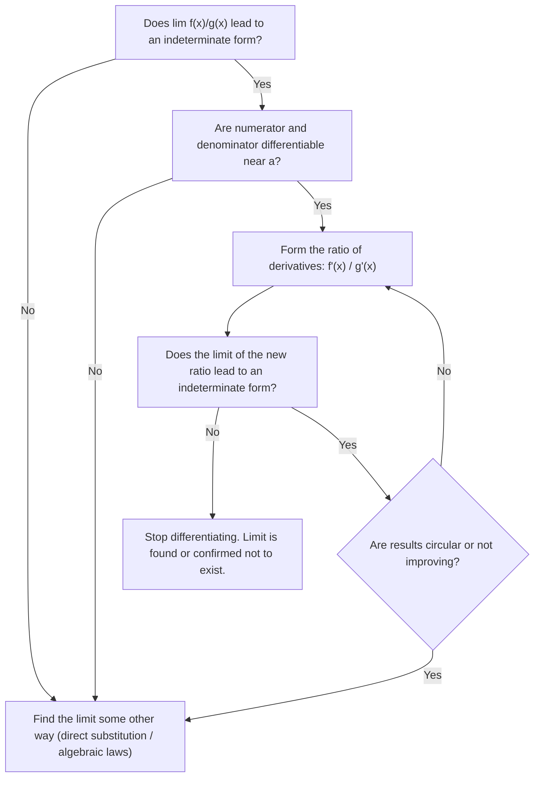

# Overview

Many of the functions critical to mathematics, physics, and engineering occur naturally as function–inverse pairs. Among the most fundamental are the natural logarithm $\ln x$ and the exponential function $e^x$. Other important pairs include trigonometric functions (when restricted to appropriate intervals) and their inverses, as well as hyperbolic functions and their inverses. 

These transcendental functions provide essential models for physical phenomena such as the mechanics of hanging cables (catenaries), the diffusion of heat flow, and the atmospheric drag/friction experienced by objects falling through fluids. In standard mathematical development, the natural logarithm is defined first via integration, and the remaining transcendental functions are systematically developed from it.

---

# 6.1 Inverse Functions and Their Derivatives

### One-to-One Functions

A function $f$ assigns an element from its range to each element in its domain. A function is said to be **one-to-one** if distinct inputs always yield distinct outputs.

> [!abstract] Definition: One-to-One Function
> A function $f(x)$ is **one-to-one** on a domain $D$ if
> $$
> f(x_1) \neq f(x_2) \quad \text{whenever } x_1 \neq x_2
> $$
> Equivalently, in contrapositive form:
> $$
> f(x_1) = f(x_2) \implies x_1 = x_2
> $$

#### The Horizontal Line Test

A geometric criterion determines whether a function is one-to-one directly from its Cartesian graph:

> [!theorem] The Horizontal Line Test
> A function $y = f(x)$ is one-to-one if and only if its graph intersects each horizontal line at most once.

If a horizontal line $y = c$ intersects the graph at two or more distinct points $(x_1, c)$ and $(x_2, c)$, then $f(x_1) = f(x_2) = c$ with $x_1 \neq x_2$, violating the definition of a one-to-one function.

### Inverses

Because each output of a one-to-one function originates from exactly one input, the assignment rule can be reversed: sending each output back to the input that produced it.

#### Formal Definition and Domain–Range Relations

> [!abstract] Definition: Inverse Function
> Let $f$ be a one-to-one function with domain $\operatorname{Dom}(f)$ and range $\operatorname{Ran}(f)$. The **inverse function** $f^{-1}$ is defined by:
> $$
> f^{-1}(b) = a \iff f(a) = b
> $$
> for any $b \in \operatorname{Ran}(f)$.
> 
> *Domain and Range properties:*
> - $\operatorname{Dom}(f^{-1}) = \operatorname{Ran}(f)$
> - $\operatorname{Ran}(f^{-1}) = \operatorname{Dom}(f)$

> [!warning] Notational Caution
> The superscript "$-1$" in $f^{-1}(x)$ denotes functional inversion, **not** an exponent:
> $$
> f^{-1}(x) \neq \frac{1}{f(x)} = (f(x))^{-1}
> $$

#### Composition and Identity Characterization

Composing a function with its inverse in either order yields the **identity function** (the function that returns its input unchanged):

> [!theorem] Inverse Composition Rule
> Functions $f$ and $g$ form an inverse pair ($g = f^{-1}$ and $f = g^{-1}$) if and only if:
> $$
> f(g(x)) = x \quad \text{for all } x \in \operatorname{Dom}(g)
> $$
> and
> $$
> g(f(x)) = x \quad \text{for all } x \in \operatorname{Dom}(f)
> $$

#### Existence Criteria (Connection to Monotonicity and the MVT)

A function possesses an inverse if and only if it is one-to-one. A crucial sufficient condition is provided by calculus:
- A function that is **strictly increasing** on an interval satisfies $x_1 < x_2 \implies f(x_1) < f(x_2)$, and is therefore one-to-one.
- A function that is **strictly decreasing** on an interval satisfies $x_1 < x_2 \implies f(x_1) > f(x_2)$, and is therefore one-to-one.

By **Corollary 3 of the Mean Value Theorem**:
1. If $f'(x) > 0$ for all $x$ in an interval $I$, then $f$ is strictly increasing on $I$, and $f^{-1}$ exists.
2. If $f'(x) < 0$ for all $x$ in an interval $I$, then $f$ is strictly decreasing on $I$, and $f^{-1}$ exists.

### Finding and Graphing Inverses

#### Geometric Symmetry Across the Line $y = x$

If a point $(a, b)$ satisfies $b = f(a)$, then by definition $a = f^{-1}(b)$, which means the point $(b, a)$ lies on the graph of $y = f^{-1}(x)$. 

The geometric transformation mapping $(a, b)$ to $(b, a)$ is a reflection across the $45^\circ$ line $y = x$. Consequently:
- The graph of $f^{-1}$ is the reflection of the graph of $f$ across the line $y = x$.
- The line $y = x$ acts as an axis of mirror symmetry between the graphs of $f$ and $f^{-1}$.

#### Algebraic Procedure to Express $f^{-1}$ as a Function of $x$

To determine an explicit formula for $f^{-1}(x)$:
1. **Solve for $x$:** Write $y = f(x)$ and solve algebraically for $x$ in terms of $y$, obtaining $x = f^{-1}(y)$.
2. **Interchange variables:** Interchange $x$ and $y$ to write the inverse with independent variable $x$: $y = f^{-1}(x)$.

#### Domain Restrictions

When a function is not one-to-one across its entire domain, its domain can be restricted to a sub-interval where it is strictly monotonic. On this restricted domain, an inverse exists (e.g., restricting $f(x) = x^2$ to $x \ge 0$ yields $f^{-1}(x) = \sqrt{x}$).

### Derivatives of Inverses of Differentiable Functions

#### Reciprocal Slopes of Reflected Tangents

Consider a nonvertical, nonhorizontal straight line with equation $y = mx + b$ ($m \neq 0$). Solving for $x$ gives:
$$
x = \frac{1}{m}y - \frac{b}{m}
$$
Interchanging $x$ and $y$ yields the reflected line:
$$
y = \frac{1}{m}x - \frac{b}{m}
$$
The slope of the reflected line is precisely the **reciprocal** $\frac{1}{m}$.

Because the tangent line to the graph of $f^{-1}$ at $(f(a), a)$ is the reflection of the tangent line to $f$ at $(a, f(a))$ across the line $y = x$, their slopes must be reciprocals:
$$
\left. \frac{df^{-1}}{dx} \right|_{x = f(a)} = \frac{1}{\left. \frac{df}{dx} \right|_{x = a}}
$$

#### The Derivative Rule for Inverses

> [!theorem] Theorem 1: The Derivative Rule for Inverses
> If $f$ is differentiable at every point of an interval $I$ and $\frac{df}{dx}$ is never zero on $I$, then $f^{-1}$ is differentiable at every point of the interval $f(I)$. The value of $\frac{df^{-1}}{dx}$ at any particular point $f(a)$ is the reciprocal of the value of $\frac{df}{dx}$ at $a$:
> $$
> \left( \frac{df^{-1}}{dx} \right)_{x = f(a)} = \frac{1}{\left( \frac{df}{dx} \right)_{x = a}}
> $$
> In prime notation:
> $$
> (f^{-1})'(f(a)) = \frac{1}{f'(a)}
> $$
> In concise operator notation:
> $$
> (f^{-1})' = \frac{1}{f'}
> $$

##### Proof
The proof consists of two parts: first establishing that the inverse function $f^{-1}$ exists and is continuous, and second, proving differentiability using the limit definition of the derivative.

**Step 1: Existence and Continuity of $f^{-1}$**

1. **Strict Monotonicity:** Since $f$ is differentiable on the interval $I$, $f'(x)$ has the intermediate value property (Darboux's Theorem). Because $f'(x) \neq 0$ anywhere on $I$, $f'(x)$ must remain strictly positive ($f'(x) > 0$) or strictly negative ($f'(x) < 0$) across the entire interval. By the Mean Value Theorem, $f$ is strictly increasing or strictly decreasing on $I$.
    
2. **Invertibility:** Strict monotonicity guarantees that $f$ is one-to-one (injective), which ensures that the inverse function $f^{-1}$ exists with domain $f(I)$.
    
3. **Continuity of the Inverse:** Because $f$ is continuous and strictly monotonic on an interval, its inverse $f^{-1}$ is also continuous on the interval $f(I)$.

**Step 2: Differentiability via the Limit Definition**

Let $b = f(a)$, which means $a = f^{-1}(b)$. Consider any point $y \in f(I)$ such that $y \neq b$. Because $f$ is bijective, there is a unique $x \in I$ such that $y = f(x)$, where $x \neq a$, and $x = f^{-1}(y)$.

The difference quotient for the derivative of $f^{-1}$ at $b$ is:
$$
\frac{f^{-1}(y) - f^{-1}(b)}{y - b} = \frac{x - a}{f(x) - f(a)}
$$
Since $x \neq a$, we can rewrite this as the reciprocal:
$$
\frac{f^{-1}(y) - f^{-1}(b)}{y - b} = \frac{1}{\frac{f(x) - f(a)}{x - a}}
$$
Now take the limit as $y \to b$:

- Because $f^{-1}$ is continuous, as $y \to b$, $x = f^{-1}(y) \to f^{-1}(b) = a$.
    
- As $x \to a$, the denominator approaches the derivative $f'(a)$:
$$
\lim_{y \to b} \frac{f^{-1}(y) - f^{-1}(b)}{y - b} = \lim_{x \to a} \frac{1}{\frac{f(x) - f(a)}{x - a}} = \frac{1}{\lim_{x \to a} \frac{f(x) - f(a)}{x - a}} = \frac{1}{f'(a)}
$$
Because $f'(a)$ exists and $f'(a) \neq 0$, the limit on the right exists and is finite. Therefore:

1. $f^{-1}$ is differentiable at $b = f(a)$.
    
2. The derivative is:
$$
\left(\frac{df^{-1}}{dx}\right)_{x=f(a)} = \frac{1}{\left(\frac{df}{dx}\right)_{x=a}} \quad \text{or} \quad (f^{-1})'(f(a)) = \frac{1}{f'(a)}
$$

#### Differential and Rate-of-Change Interpretation

If $y = f(x)$ is differentiable at $x = a$, a small increment $dx$ produces a corresponding change in $y$ approximated by differentials:
$$
dy \approx f'(a) \, dx
$$
This indicates that near $x = a$, $y$ changes approximately $f'(a)$ times as fast as $x$. 

Conversely, viewing $x$ as a function of $y$ ($x = f^{-1}(y)$), the change in $x$ is:
$$
dx \approx \frac{1}{f'(a)} \, dy
$$
This states that $x$ changes approximately $\frac{1}{f'(a)}$ times as fast as $y$, providing an intuitive basis for the reciprocal relationship of the derivatives.

#### Chain Rule Connection

The formula $(f^{-1})'(f(x)) = \frac{1}{f'(x)}$ can also be understood via the Chain Rule. Since $f^{-1}(f(x)) = x$ identically, differentiating both sides with respect to $x$ gives:
$$
\frac{d}{dx} \left[ f^{-1}(f(x)) \right] = \frac{d}{dx}[x]
$$
$$
(f^{-1})'(f(x)) \cdot f'(x) = 1
$$
Dividing by $f'(x)$ (provided $f'(x) \neq 0$) yields:
$$
(f^{-1})'(f(x)) = \frac{1}{f'(x)}
$$

### Theory and Applications (Selected Problems 45–52)

##### Problem 45: Invertibility of Negated Functions
**Problem Statement:** If $f(x)$ is one-to-one, can anything be said about $g(x) = -f(x)$? Give reasons for your answer.

**Solution:**
Yes, $g(x) = -f(x)$ is guaranteed to be one-to-one.

*Proof:*
Suppose $g(x_1) = g(x_2)$ for $x_1, x_2 \in \operatorname{Dom}(g) = \operatorname{Dom}(f)$. Then:
$$
-f(x_1) = -f(x_2)
$$
Multiplying both sides by $-1$:
$$
f(x_1) = f(x_2)
$$
Since $f$ is one-to-one, $f(x_1) = f(x_2)$ implies $x_1 = x_2$. Therefore, $g(x_1) = g(x_2) \implies x_1 = x_2$, proving that $g$ is one-to-one.

*Geometric Insight:* The graph of $g(x) = -f(x)$ is the reflection of the graph of $f(x)$ across the $x$-axis. A horizontal line $y = c$ intersects $y = g(x)$ at $x$ if and only if the horizontal line $y = -c$ intersects $y = f(x)$ at $x$. Because the graph of $f$ passes the horizontal line test, the graph of $g$ must also pass it.

##### Problem 46: Invertibility of Reciprocal Functions
**Problem Statement:** If $f(x)$ is one-to-one and $f(x)$ is never $0$, can anything be said about $h(x) = 1/f(x)$? Give reasons for your answer.

**Solution:**
Yes, $h(x) = 1/f(x)$ is guaranteed to be one-to-one.

*Proof:*
Suppose $h(x_1) = h(x_2)$ for $x_1, x_2 \in \operatorname{Dom}(h) = \operatorname{Dom}(f)$. Then:
$$
\frac{1}{f(x_1)} = \frac{1}{f(x_2)}
$$
Since $f(x) \neq 0$ for all $x$, we can take reciprocals on both sides:
$$
f(x_1) = f(x_2)
$$
Since $f$ is one-to-one, this implies $x_1 = x_2$. Hence, $h$ is one-to-one.

##### Problem 47: Composition of One-to-One Functions
**Problem Statement:** Suppose that the range of $g$ lies in the domain of $f$ so that the composite $f \circ g$ is defined. If $f$ and $g$ are one-to-one, can anything be said about $f \circ g$? Give reasons for your answer.

**Solution:**
Yes, the composite function $f \circ g$ is one-to-one.

*Proof:*
Let $x_1, x_2 \in \operatorname{Dom}(g)$ and assume that $(f \circ g)(x_1) = (f \circ g)(x_2)$, which means:
$$
f(g(x_1)) = f(g(x_2))
$$
Since $f$ is one-to-one, inputs producing identical outputs under $f$ must be equal:
$$
g(x_1) = g(x_2)
$$
Next, since $g$ is also one-to-one, $g(x_1) = g(x_2)$ implies:
$$
x_1 = x_2
$$
Consequently, $(f \circ g)(x_1) = (f \circ g)(x_2) \implies x_1 = x_2$, so $f \circ g$ is one-to-one.

##### Problem 48: One-to-One Property of Inner Functions in a Composite
**Problem Statement:** If a composite $f \circ g$ is one-to-one, must $g$ be one-to-one? Give reasons for your answer.

**Solution:**
Yes, the inner function $g$ must be one-to-one. (Note: The outer function $f$ is not required to be one-to-one on its entire domain, but only on $\operatorname{Ran}(g)$.)

*Proof:*
Suppose $g(x_1) = g(x_2)$ for some $x_1, x_2 \in \operatorname{Dom}(g)$.
Applying $f$ to both sides gives:
$$
f(g(x_1)) = f(g(x_2))
$$
which by definition is:
$$
(f \circ g)(x_1) = (f \circ g)(x_2)
$$
Since $f \circ g$ is given to be one-to-one, this implies:
$$
x_1 = x_2
$$
Hence, $g(x_1) = g(x_2) \implies x_1 = x_2$, proving that $g$ must be one-to-one.

##### Problem 49: Geometric Area Integral Identity for Inverses
**Problem Statement:** Suppose $f(x)$ is positive, continuous, and increasing over the interval $[a, b]$. By interpreting the graph of $f$ show that:
$$
\int_a^b f(x) \, dx + \int_{f(a)}^{f(b)} f^{-1}(y) \, dy = b f(b) - a f(a)
$$

**Solution:**
*Geometric Interpretation (Decomposition of Bounding Rectangles):*
Consider the Cartesian plane in the first quadrant where $x \ge 0$ and $y \ge 0$:
1. Construct the large bounding rectangle defined by vertices $(0,0)$, $(b,0)$, $(b, f(b))$, and $(0, f(b))$. The area of this rectangle is:
$$
\text{Area}_{\text{large}} = b \cdot f(b)
$$
2. Construct the smaller corner rectangle defined by vertices $(0,0)$, $(a,0)$, $(a, f(a))$, and $(0, f(a))$. The area of this rectangle is:
$$
\text{Area}_{\text{corner}} = a \cdot f(a)
$$
3. Subtracting the corner rectangle from the large rectangle leaves an $L$-shaped planar region with total area:
$$
\text{Area}_L = b f(b) - a f(a)
$$
4. Because $f(x)$ is continuous and strictly increasing on $[a, b]$, the graph $y = f(x)$ is a monotonic curve connecting $(a, f(a))$ to $(b, f(b))$ that partitions the $L$-shaped region into two non-overlapping regions:
   - **Region 1 (Area under $f(x)$ along the $x$-axis):** The vertical strip bounded below by the $x$-axis, above by $y = f(x)$, and horizontally between $x = a$ and $x = b$:
     $$
     \text{Area}_1 = \int_a^b f(x) \, dx
     $$
   - **Region 2 (Area beside $f^{-1}(y)$ along the $y$-axis):** The horizontal strip bounded to the left by the $y$-axis, to the right by the curve $x = f^{-1}(y)$, and vertically between $y = f(a)$ and $y = f(b)$:
     $$
     \text{Area}_2 = \int_{f(a)}^{f(b)} f^{-1}(y) \, dy
     $$
Because $\text{Area}_1 + \text{Area}_2 = \text{Area}_L$, summing both integrals yields:
$$
\int_a^b f(x) \, dx + \int_{f(a)}^{f(b)} f^{-1}(y) \, dy = b f(b) - a f(a)
$$

*Analytic Verification (via Integration by Parts):*
Substituting $y = f(x)$ and $dy = f'(x) \, dx$ into the second integral, where $y = f(a) \implies x = a$ and $y = f(b) \implies x = b$:
$$
\int_{f(a)}^{f(b)} f^{-1}(y) \, dy = \int_a^b f^{-1}(f(x)) f'(x) \, dx = \int_a^b x f'(x) \, dx
$$
Using integration by parts on $\int_a^b x f'(x) \, dx$ with $u = x$ and $dv = f'(x) \, dx$:
$$
\int_a^b x f'(x) \, dx = \left[ x f(x) \right]_a^b - \int_a^b f(x) \, dx = b f(b) - a f(a) - \int_a^b f(x) \, dx
$$
Rearranging confirms:
$$
\int_a^b f(x) \, dx + \int_{f(a)}^{f(b)} f^{-1}(y) \, dy = b f(b) - a f(a)
$$

##### Problem 50: Invertibility of Linear Fractional (Möbius) Transformations
**Problem Statement:** Determine conditions on the constants $a, b, c,$ and $d$ so that the rational function
$$
f(x) = \frac{ax + b}{cx + d}
$$
has an inverse.

**Solution:**
A function possesses an inverse if and only if it is one-to-one on its domain $\{x \in \mathbb{R} \mid cx + d \neq 0\}$ and non-trivial (not degenerate or constant).

*Algebraic Derivation:*
Assume $f(x_1) = f(x_2)$ for $x_1, x_2 \in \operatorname{Dom}(f)$:
$$
\frac{ax_1 + b}{cx_1 + d} = \frac{ax_2 + b}{cx_2 + d}
$$
Cross-multiplying:
$$
(ax_1 + b)(cx_2 + d) = (ax_2 + b)(cx_1 + d)
$$
Expanding both products:
$$
ac x_1 x_2 + ad x_1 + bc x_2 + bd = ac x_1 x_2 + ad x_2 + bc x_1 + bd
$$
Canceling the common terms $ac x_1 x_2$ and $bd$:
$$
ad x_1 + bc x_2 = ad x_2 + bc x_1
$$
Collecting terms with $x_1$ and $x_2$:
$$
ad x_1 - bc x_1 = ad x_2 - bc x_2
$$
$$
(ad - bc) x_1 = (ad - bc) x_2
$$
$$
(ad - bc)(x_1 - x_2) = 0
$$

*Analysis of Cases:*
1. **Case 1: $ad - bc \neq 0$**
   We can divide both sides by $ad - bc \neq 0$, which immediately gives:
	$$
	x_1 - x_2 = 0 \implies x_1 = x_2
	$$
	Thus, $f$ is strictly one-to-one and has a valid inverse function:
	$$
	f^{-1}(y) = \frac{-dy + b}{cy - a}
	$$
2. **Case 2: $ad - bc = 0$**
	In this case, the derivative is always $0$, making $f(x)$ a constant function, which we know is not one-to-one and doesn't have an inverse.

*Conclusion:*
The rational function $f(x) = \frac{ax+b}{cx+d}$ has an inverse if and only if:
$$
ad - bc \neq 0
$$

##### Problem 51: Chain Rule Connection and Differentiability of Inverses
**Problem Statement:**
If we write $g(x)$ for $f^{-1}(x)$, the derivative formula can be written as:
$$
g'(f(a)) = \frac{1}{f'(a)}, \quad \text{or} \quad g'(f(a)) \cdot f'(a) = 1
$$
Replacing $a$ with $x$ yields:
$$
g'(f(x)) \cdot f'(x) = 1
$$
Assume that $f$ and $g$ are differentiable functions that are inverses of one another, so that $(g \circ f)(x) = x$. Differentiate both sides of this equation with respect to $x$, using the Chain Rule to express $(g \circ f)'(x)$ as a product of derivatives of $g$ and $f$. What do you find? Explain why this is not a proof of Theorem 1.

**Solution:**
*Chain Rule Derivation:*
Given that $g = f^{-1}$ and $(g \circ f)(x) = g(f(x)) = x$, differentiating both sides with respect to $x$:
$$
\frac{d}{dx}\left[ g(f(x)) \right] = \frac{d}{dx}[x]
$$
By applying the Chain Rule to the composite function $g(f(x))$:
$$
g'(f(x)) \cdot f'(x) = 1
$$
Solving for $g'(f(x))$ (provided $f'(x) \neq 0$):
$$
g'(f(x)) = \frac{1}{f'(x)}
$$
Substituting $y = f(x)$, so that $x = g(y) = f^{-1}(y)$:
$$
(f^{-1})'(y) = \frac{1}{f'(f^{-1}(y))}
$$

*Why this does NOT constitute a proof of Theorem 1:*
Applying the Chain Rule $\frac{d}{dx}[g(f(x))] = g'(f(x)) \cdot f'(x)$ requires as an initial hypothesis that the outer function $g$ is already known to be differentiable at $f(x)$. 
However, the central assertion of Theorem 1 is proving that $f^{-1}$ **is differentiable** in the first place whenever $f$ is differentiable with $f' \neq 0$. Assuming that $g$ is differentiable at the outset assumes the very conclusion to be proved (begging the question / circular reasoning). Thus, this calculation serves as an intuitive heuristic for the derivative value, but Theorem 1 requires the rigorous difference-quotient proof.

##### Problem 52: Equivalence of the Washer and Shell Methods for Inverses
**Problem Statement:**
Let $f$ be differentiable on the interval $a \le x \le b$, with $a > 0$, and suppose that $f$ has a differentiable inverse, $f^{-1}$. Revolve about the $y$-axis the region bounded by the graph of $f$ and the lines $x = a$ and $y = f(b)$ to generate a solid. Then the values of the integrals given by the washer and shell methods for the volume have identical values:
$$
\int_{f(a)}^{f(b)} \pi \left( (f^{-1}(y))^2 - a^2 \right) dy = \int_a^b 2\pi x (f(b) - f(x)) \, dx
$$
To prove this equality, define:
$$
W(t) = \int_{f(a)}^{f(t)} \pi \left( (f^{-1}(y))^2 - a^2 \right) dy
$$
$$
S(t) = \int_a^t 2\pi x (f(t) - f(x)) \, dx
$$
Show that the functions $W$ and $S$ agree at a point of $[a, b]$ and have identical derivatives on $[a, b]$, thereby establishing $W(t) = S(t)$ for all $t \in [a, b]$, and in particular $W(b) = S(b)$.

**Solution:**

*Step 1: Verify agreement at $t = a$.*
Evaluating $W(t)$ and $S(t)$ at the lower bound $t = a$:
$$
W(a) = \int_{f(a)}^{f(a)} \pi \left( (f^{-1}(y))^2 - a^2 \right) dy = 0
$$
$$
S(a) = \int_a^a 2\pi x (f(a) - f(x)) \, dx = 0
$$
Both integrals have equal upper and lower limits of integration, hence:
$$
W(a) = S(a) = 0
$$

*Step 2: Differentiate $W(t)$ using the Fundamental Theorem of Calculus and Chain Rule.*
The upper limit of integration of $W(t)$ is $u(t) = f(t)$. By the Leibniz Rule / Chain Rule:
$$
W'(t) = \frac{d}{dt} \left[ \int_{f(a)}^{f(t)} \pi \left( (f^{-1}(y))^2 - a^2 \right) dy \right] = \pi \left( (f^{-1}(f(t)))^2 - a^2 \right) \cdot f'(t)
$$
Since $f^{-1}(f(t)) = t$:
$$
W'(t) = \pi (t^2 - a^2) f'(t)
$$

*Step 3: Differentiate $S(t)$.*
Notice that in $S(t)$, the variable $t$ appears both in the upper limit of integration and inside the integrand via $f(t)$. We separate $f(t)$ from the integrand:
$$
\begin{align}
S(t) &= \int_a^t 2\pi x (f(t) - f(x)) \, dx \\
&= \int_a^t 2\pi x f(t) \, dx - \int_a^t 2\pi x f(x) \, dx \\
&= f(t) \int_a^t 2\pi x \, dx - \int_a^t 2\pi x f(x) \, dx
\end{align}
$$
Evaluate the first elementary integral:
$$
\int_a^t 2\pi x \, dx = \left[ \pi x^2 \right]_a^t = \pi(t^2 - a^2)
$$
Substituting this back into $S(t)$:
$$
S(t) = \pi(t^2 - a^2) f(t) - \int_a^t 2\pi x f(x) \, dx
$$
Now differentiate $S(t)$ with respect to $t$. Using the Product Rule on the first term and the Fundamental Theorem of Calculus on the second term:
$$
\begin{align}
S'(t) &= \frac{d}{dt}\left[ \pi(t^2 - a^2) f(t) \right] - \frac{d}{dt}\left[ \int_a^t 2\pi x f(x) \, dx \right] \\
&= \left( \frac{d}{dt}[\pi(t^2 - a^2)] \cdot f(t) + \pi(t^2 - a^2) \cdot f'(t) \right) - 2\pi t f(t) \\
&= 2\pi t f(t) + \pi(t^2 - a^2) f'(t) - 2\pi t f(t) \\
&= \pi(t^2 - a^2) f'(t)
\end{align}
$$

*Step 4: Conclusion.*
Comparing the derivatives from Step 2 and Step 3:
$$
W'(t) = S'(t) = \pi(t^2 - a^2) f'(t) \quad \text{for all } t \in [a, b]
$$
Since $W'(t) - S'(t) = 0$ on the connected interval $[a, b]$, the Mean Value Theorem implies that their difference is a constant:
$$
W(t) - S(t) = C \quad \text{for all } t \in [a, b]
$$
Using the initial condition at $t = a$:
$$
C = W(a) - S(a) = 0 - 0 = 0
$$
Therefore, $W(t) = S(t)$ for all $t \in [a, b]$. Evaluating at $t = b$ completes the proof:
$$
W(b) = S(b) \iff \int_{f(a)}^{f(b)} \pi \left( (f^{-1}(y))^2 - a^2 \right) dy = \int_a^b 2\pi x (f(b) - f(x)) \, dx \quad \blacksquare
$$

---

# 6.2 Natural Logarithms

### Historical Context and Development

In the late 1500s, Scottish baron **John Napier** (1550–1617) invented a computational method called the **logarithm** to simplify arithmetic by transforming multiplication into addition via the identity:
$$\ln(ax) = \ln a + \ln x$$
To multiply two large numbers, one looked up their logarithms in tables, summed them, and looked up the corresponding anti-logarithm.

Napier devoted the final 20 years of his life calculating these extensive logarithmic tables (while Danish astronomer Tycho Brahe waited anxiously for them to accelerate his celestial mechanics calculations). The tables were completed posthumously by Napier's friend **Henry Briggs** in London. Base 10 logarithms consequently became known as *Briggsian logarithms*.

*(Historical note: Napier also invented a devastatingly accurate artillery piece capable of hitting a cow a mile away; appalled by the destructive capability of the weapon, he stopped manufacturing it and suppressed the blueprints.)*

In modern calculus, rather than developing logarithms purely from computational bases, the natural logarithm is defined rigorously as an integral.

### Definition of the Natural Logarithm Function

> [!abstract] Definition: The Natural Logarithm Function
> The **natural logarithm function**, denoted $\ln x$, is defined for all positive real numbers $x > 0$ by:
> $$
> \ln x = \int_1^x \frac{1}{t} \, dt, \quad x > 0
> $$

#### Geometric Interpretation as an Accumulation Function

The value of $\ln x$ is geometric area under the hyperbola $y = \frac{1}{t}$:
1. **For $x > 1$:** $\ln x$ is the area under $y = \frac{1}{t}$ from $t = 1$ to $t = x$:
	$$
	\ln x = \int_1^x \frac{1}{t} \, dt > 0
	$$
2. **For $x = 1$:** The upper and lower integration limits coincide:
	$$
	\ln 1 = \int_1^1 \frac{1}{t} \, dt = 0
	$$
3. **For $0 < x < 1$:** Reversing the integration limits reveals that $\ln x$ is the negative of the area under $y = \frac{1}{t}$ from $t = x$ to $t = 1$:
	$$
	\ln x = \int_1^x \frac{1}{t} \, dt = -\int_x^1 \frac{1}{t} \, dt < 0
	$$
4. **For $x \le 0$:** $\ln x$ is **undefined** because $\frac{1}{t}$ has a non-integrable singularity at $t = 0$.

#### The Dummy Variable of Integration

In the integral definition $\ln x = \int_1^x \frac{1}{t} \, dt$, the symbol $t$ is a dummy variable of integration. It avoids confounding the varying upper integration limit $x$ with the variable along the horizontal axis of the integrand curve.

### The Derivative of $y = \ln x$

#### Direct Derivative from the Fundamental Theorem of Calculus

Applying Part 1 of the Fundamental Theorem of Calculus ($\frac{d}{dx} \int_a^x f(t)\,dt = f(x)$):
$$\frac{d}{dx} \ln x = \frac{d}{dx} \int_1^x \frac{1}{t} \, dt = \frac{1}{x}$$

> [!theorem] Derivative of the Natural Logarithm
> For every $x > 0$:
> $$
> \frac{d}{dx} \ln x = \frac{1}{x}
> $$

#### Chain Rule Extension

If $u = u(x)$ is a positive, differentiable function of $x$:
$$
\frac{d}{dx} \ln u = \frac{d}{du}[\ln u] \cdot \frac{du}{dx} = \frac{1}{u} \frac{du}{dx}
$$

> [!theorem] Chain Rule for Natural Logarithms
> If $u > 0$ is a differentiable function of $x$:
> $$
> \frac{d}{dx} \ln u = \frac{1}{u} \frac{du}{dx}
> $$

#### Scaling Invariance of the Derivative

For any positive constant $a > 0$, differentiating $\ln(ax)$ directly yields:
$$
\frac{d}{dx} \ln(ax) = \frac{1}{ax} \cdot \frac{d}{dx}(ax) = \frac{1}{ax} \cdot a = \frac{1}{x}
$$
The function $\ln(ax)$ has the exact same derivative as $\ln x$.

### Algebraic Properties of Logarithms and Their Rigorous Proofs

> [!summary] Table 6.1: Properties of Natural Logarithms
> For any positive numbers $a > 0$ and $x > 0$:
> 1. **Product Rule:** $\ln(ax) = \ln a + \ln x$
> 2. **Quotient Rule:** $\ln \left(\frac{a}{x}\right) = \ln a - \ln x$
> 3. **Reciprocal Rule:** $\ln \left(\frac{1}{x}\right) = -\ln x$ (special case of Quotient Rule with $a = 1$)
> 4. **Power Rule:** $\ln(x^n) = n \ln x$ (for rational $n$, and all real $n$)

#### Rigorous Proofs

##### Proof of the Product Rule: $\ln(ax) = \ln a + \ln x$
1. Differentiating both $\ln(ax)$ and $\ln x$ with respect to $x$:
	$$
	\frac{d}{dx} \ln(ax) = \frac{1}{ax} \cdot a = \frac{1}{x} \quad \text{and} \quad \frac{d}{dx} \ln x = \frac{1}{x}
	$$
2. Since both functions share the identical derivative on the open interval $(0, \infty)$, by **Corollary 1 of the Mean Value Theorem**, they must differ by a constant $C$:
	$$
	\ln(ax) = \ln x + C
	$$
3. This equality must hold for all $x > 0$. Evaluating at $x = 1$:
	$$
	\begin{align}
	\ln(a \cdot 1) & = \ln(1) + C \\
	\ln a & = 0 + C \\
	\implies C & = \ln a
	\end{align}
	$$
4. Substituting $C = \ln a$ back into the equation:
	$$
	\ln(ax) = \ln a + \ln x \quad \blacksquare
	$$

##### Proof of the Reciprocal Rule: $\ln\left(\frac{1}{x}\right) = -\ln x$
Substitute $a = \frac{1}{x}$ into the Product Rule:
$$
\begin{align}
\ln\left(\frac{1}{x} \cdot x\right) & = \ln\left(\frac{1}{x}\right) + \ln x \\
\ln(1) & = \ln\left(\frac{1}{x}\right) + \ln x \\
0 & = \ln\left(\frac{1}{x}\right) + \ln x \\
\implies \ln\left(\frac{1}{x}\right) & = -\ln x \quad \blacksquare
\end{align}
$$

##### Proof of the Quotient Rule: $\ln\left(\frac{a}{x}\right) = \ln a - \ln x$
Express $\frac{a}{x}$ as a product $a \cdot \frac{1}{x}$ and apply the Product Rule followed by the Reciprocal Rule:
$$
\ln\left(\frac{a}{x}\right) = \ln\left(a \cdot \frac{1}{x}\right) = \ln a + \ln\left(\frac{1}{x}\right) = \ln a - \ln x \quad \blacksquare
$$

##### Proof of the Power Rule: $\ln(x^n) = n \ln x$ (for Rational $n$)
1. Let $n$ be any rational number. Differentiate $\ln(x^n)$ with respect to $x$ using the Chain Rule and the Power Rule for differentiation:
	$$
	\frac{d}{dx} \ln(x^n) = \frac{1}{x^n} \cdot \frac{d}{dx}(x^n) = \frac{1}{x^n} \cdot (n x^{n-1}) = \frac{n}{x}
	$$
2. Now differentiate $n \ln x$ with respect to $x$:
	$$
	\frac{d}{dx}(n \ln x) = n \cdot \frac{1}{x} = \frac{n}{x}
	$$
3. Because $\ln(x^n)$ and $n \ln x$ have identical derivatives on $(0, \infty)$, they differ by a constant $C$:
	$$
	\ln(x^n) = n \ln x + C
	$$
4. Setting $x = 1$:
	$$
	\ln(1^n) = n \ln(1) + C \implies \ln(1) = 0 + C \implies 0 = 0 + C \implies C = 0
	$$
5. Thus:
	$$
	\ln(x^n) = n \ln x \quad \blacksquare
	$$

> [!note] Theoretical Remark on Irrational Exponents
> The above proof depends on $\frac{d}{dx}(x^n) = n x^{n-1}$, which is established only for rational exponents $n \in \mathbb{Q}$ at this stage of calculus. While the identity $\ln(x^n) = n \ln x$ holds for all real exponents, its complete proof for irrational powers requires first defining general exponential expressions of the form $x^r = e^{r \ln x}$.

### Analysis of the Graph and Range of $\ln x$

#### Monotonicity and Concavity
- **First Derivative:**
	$$
	\frac{d}{dx} \ln x = \frac{1}{x} > 0 \quad \text{for all } x \in (0, \infty)
	$$
	Therefore, $\ln x$ is **strictly increasing** on its entire domain.
- **Second Derivative:**
	$$
	\frac{d^2}{dx^2} \ln x = \frac{d}{dx}\left(\frac{1}{x}\right) = -\frac{1}{x^2} < 0 \quad \text{for all } x \in (0, \infty)
	$$
	Therefore, the graph of $\ln x$ is **strictly concave down** everywhere on its domain.

#### Asymptotic Behavior at Boundaries
By numerical approximation, $\ln 2 \approx 0.693 > \frac{1}{2}$.
- **Behavior as $x \to \infty$:**
  For any integer $n$:
	$$
	\ln(2^n) = n \ln 2 > n \left(\frac{1}{2}\right) = \frac{n}{2}
	$$
	As $n \to \infty$, $\frac{n}{2} \to \infty \implies \ln 2^{n} \to \infty$. Since $\ln x$ is strictly increasing, this means that:
	$$
	\lim_{x \to \infty} \ln x = \infty
	$$
- **Behavior as $x \to 0^+$:**
	For any integer $n$:
	$$
	\ln(2^{-n}) = -n \ln 2 < -n \left(\frac{1}{2}\right) = -\frac{n}{2}
	$$
	As $n \to \infty$, $-\frac{n}{2} \to -\infty$. Therefore:
	$$
	\lim_{x \to 0^+} \ln x = -\infty
	$$

#### Summary of Function Characteristics
- **Domain:** $(0, \infty)$
- **Range:** $(-\infty, \infty)$
- **Intercept:** $(1, 0)$
- **Asymptote:** Vertical asymptote at the line $x = 0$ ($y$-axis).

### Technique of Logarithmic Differentiation

The derivatives of positive functions expressed as complicated products, quotients, or powers can be obtained efficiently by taking natural logarithms before differentiating.

#### Procedural Algorithm (for $y = f(x) > 0$)

1. **Take logarithms:** Take the natural logarithm of both sides:
	$$
	\ln y = \ln f(x)
	$$
2. **Expand:** Apply properties of logarithms (Product, Quotient, Power rules) to transform products into sums, quotients into differences, and exponents into scalar multipliers.
3. **Differentiate implicitly:** Differentiate both sides with respect to $x$:
	$$
	\begin{align}
	\frac{d}{dx}[\ln y] = \frac{d}{dx}[\ln f(x)]
	\frac{1}{y} \frac{dy}{dx} = \frac{d}{dx}[\ln f(x)]
	\end{align}
	$$
4. **Isolate $\frac{dy}{dx}$:** Multiply through by $y$:
	$$
	\frac{dy}{dx} = y \cdot \frac{d}{dx}[\ln f(x)]
	$$
5. **Substitute original formula:** Replace $y$ with $f(x)$ to express the derivative entirely in terms of $x$:
	$$
	\frac{dy}{dx} = f(x) \cdot \frac{d}{dx}[\ln f(x)]
	$$

> [!note] Theoretical Nuance: Domain Restrictions and Validity of Logarithmic Differentiation
> A natural theoretical question arises: *does taking the logarithm artificially restrict the domain only to points where $f(x) > 0$?* 
> 
> The resulting derivative formula remains valid everywhere the original function $f$ is differentiable, including where $f(x) < 0$ and where $f(x) = 0$. This holds because of three theoretical principles:
> 
> 1. **Negative Values ($f(x) < 0$):** We can apply logarithms to the absolute value: $\ln |y| = \ln |f(x)|$. Since $\frac{d}{dx}\ln |u| = \frac{1}{u}\frac{du}{dx}$ for any nonzero differentiable $u$, the signs cancel identically:
>    - For $u > 0$: $\frac{d}{dx}\ln(u) = \frac{1}{u}\frac{du}{dx}$
>    - For $u < 0$: $\frac{d}{dx}\ln(-u) = \frac{1}{-u}\left(-\frac{du}{dx}\right) = \frac{1}{u}\frac{du}{dx}$
>    
>    Thus, sign information does not alter the resulting derivative; the intermediate step strictly requires only $f(x) \neq 0$.
> 
> 2. **Zeroes ($f(x) = 0$):** At roots where $f(x) = 0$, $\ln |f(x)|$ is undefined. However, in the final step:
>    $$
>    \frac{dy}{dx} = f(x) \cdot \frac{d}{dx}[\ln |f(x)|]
>    $$
>    multiplying back through by $f(x)$ algebraically cancels the vanishing factors in the denominators (removable singularities). By the continuity of $f'(x)$, the derivative evaluated at the root matches the limit:
>    $$
>    f'(a) = \lim_{x \to a} f'(x)
>    $$
> 
> 3. **Equivalence to the Product and Quotient Rules:** Logarithmic differentiation is an algebraic shortcut for repeated applications of the Leibniz Product Rule and Quotient Rule. For any product $y = uv$, the product rule $y' = u'v + uv'$ is algebraically equivalent to:
>    $$
>    \frac{y'}{y} = \frac{u'}{u} + \frac{v'}{v}
>    $$
>    The logarithm serves solely as a bookkeeping device to decompose products into sums. Because the underlying product and quotient rules hold globally across the entire domain of $f$, the final derived formula is valid everywhere $f$ is differentiable.

### Integration Involving Logarithms

#### The Integral $\int \frac{1}{u} \, du$

The derivative $\frac{d}{du}\ln u = \frac{1}{u}$ establishes that $\int \frac{1}{u} \, du = \ln u + C$ when $u > 0$. 

To address the case where $u < 0$:
- If $u < 0$, then $-u > 0$, so $\ln(-u)$ is well-defined.
- Applying the Chain Rule with $w = -u$:
	$$
	\frac{d}{du} \ln(-u) = \frac{1}{-u} \cdot \frac{d}{du}(-u) = \frac{1}{-u} (-1) = \frac{1}{u}
	$$
- Therefore, for $u < 0$:
	$$
	\int \frac{1}{u} \, du = \ln(-u) + C
	$$

Unifying both cases using the absolute value notation $|u|$:
- When $u > 0$, $|u| = u \implies \ln |u| = \ln u$.
- When $u < 0$, $|u| = -u \implies \ln |u| = \ln(-u)$.

> [!theorem] Integral of $1/u$
> If $u$ is a nonzero differentiable function:
> $$
> \int \frac{1}{u} \, du = \ln |u| + C
> $$

#### Resolution of the Power Rule Exception

The standard power rule for integration states:
$$
\int u^n \, du = \frac{u^{n+1}}{n+1} + C, \quad n \neq -1
$$
The singularity at $n = -1$ is resolved by the natural logarithm:
$$
\int u^{-1} \, du = \int \frac{1}{u} \, du = \ln |u| + C
$$

#### The Form $\int \frac{f'(x)}{f(x)} \, dx$

Whenever an integrand consists of a quotient where the numerator is the derivative of the denominator, substituting $u = f(x)$ and $du = f'(x) \, dx$ yields:
$$
\int \frac{f'(x)}{f(x)} \, dx = \int \frac{du}{u} = \ln |u| + C = \ln |f(x)| + C
$$
(provided $f(x)$ maintains a constant sign on the domain of integration).

### Theoretical Derivations of the Integrals of $\tan x$ and $\cot x$

Prior to the introduction of the logarithmic integral rule, the trigonometric integrals of $\tan x$ and $\cot x$ could not be evaluated in closed form.

#### Integral of the Tangent Function
Express $\tan x$ as $\frac{\sin x}{\cos x}$:
$$
\int \tan x \, dx = \int \frac{\sin x}{\cos x} \, dx
$$
Let $u = \cos x$, so $du = -\sin x \, dx$, which gives $\sin x \, dx = -du$:
$$
\int \tan x \, dx = \int \frac{-du}{u} = -\int \frac{du}{u} = -\ln |u| + C = -\ln |\cos x| + C
$$
Applying the reciprocal rule $-\ln |\cos x| = \ln |\cos x|^{-1} = \ln \left|\frac{1}{\cos x}\right| = \ln |\sec x|$:
$$
\int \tan u \, du = -\ln |\cos u| + C = \ln |\sec u| + C
$$

#### Integral of the Cotangent Function
Express $\cot x$ as $\frac{\cos x}{\sin x}$:
$$
\int \cot x \, dx = \int \frac{\cos x}{\sin x} \, dx
$$
Let $u = \sin x$, so $du = \cos x \, dx$:
$$
\int \cot x \, dx = \int \frac{du}{u} = \ln |u| + C = \ln |\sin x| + C
$$
Applying the reciprocal rule $\ln |\sin x| = -\ln \left|\frac{1}{\sin x}\right| = -\ln |\csc x|$:
$$
\int \cot u \, du = \ln |\sin u| + C = -\ln |\csc u| + C
$$

> [!summary] Summary of Boxed Integrals
> $$
> \int \tan u \, du = -\ln |\cos u| + C = \ln |\sec u| + C
> $$
> $$
> \int \cot u \, du = \ln |\sin u| + C = -\ln |\csc u| + C
> $$

---

# 6.3 The Exponential Function

## The Inverse of the Natural Logarithm and the Number $e$

### Invertibility of the Natural Logarithm

In Section 6.2, the natural logarithm was defined for all $x > 0$ by the integral:
$$
\ln x = \int_1^x \frac{1}{t} \, dt
$$
By the Fundamental Theorem of Calculus, its derivative is:
$$
\frac{d}{dx} \ln x = \frac{1}{x}
$$
For all $x \in (0, \infty)$, $\frac{1}{x} > 0$. Because its derivative is strictly positive on its entire domain, $\ln x$ is strictly increasing. By Theorem 1 of Section 6.1, every strictly increasing function is one-to-one and therefore possesses a unique inverse function, denoted $\ln^{-1}$.

#### Domain, Range, and Asymptotic Behavior

The domain and range of the inverse function $\ln^{-1}$ swap the domain and range of $\ln$:
- $\operatorname{Dom}(\ln^{-1}) = \operatorname{Ran}(\ln) = (-\infty, \infty)$
- $\operatorname{Ran}(\ln^{-1}) = \operatorname{Dom}(\ln) = (0, \infty)$

The asymptotic limits of $\ln x$ determine the asymptotic limits of $\ln^{-1} x$:
- Since $\lim_{x \to \infty} \ln x = \infty$, the inverse satisfies:
  $$
  \lim_{x \to \infty} \ln^{-1} x = \infty
  $$
- Since $\lim_{x \to 0^+} \ln x = -\infty$, the inverse satisfies:
  $$
  \lim_{x \to -\infty} \ln^{-1} x = 0
  $$

Consequently, the line $y = 0$ (the negative $x$-axis) is a horizontal asymptote for the graph of $y = \ln^{-1} x$.

### Definition of the Number $e$

The number $e$ is defined intrinsically through the inverse natural logarithm:

> [!abstract] Definition: The Number $e$
> The number $e$ is the unique real number whose natural logarithm equals $1$:
> $$
> e = \ln^{-1}(1)
> $$
> Equivalently, $e$ satisfies:
> $$
> \ln e = 1 \iff \int_1^e \frac{1}{t} \, dt = 1
> $$

#### Geometric Meaning of $e$
Geometrically, the number $e$ is the unique $x$-coordinate along the positive horizontal axis such that the area under the hyperbola $y = 1/t$ between $t = 1$ and $t = e$ is exactly $1$ square unit.

#### Series Representation and Numerical Value
The number $e$ is an irrational, transcendental number. Its numerical value can be expressed through the limit of Taylor polynomials:
$$
e = \lim_{n \to \infty} \left( 1 + 1 + \frac{1}{2!} + \frac{1}{3!} + \dots + \frac{1}{n!} \right) = \sum_{k=0}^\infty \frac{1}{k!}
$$
To fifteen decimal places:
$$
e \approx 2.718281828459045
$$

### The Function $y = e^x$

For rational values of $x$, elementary algebra defines raising the positive base $e$ to powers in the conventional manner:
$$
e^2 = e \cdot e, \quad e^{-2} = \frac{1}{e^2}, \quad e^{1/2} = \sqrt{e}, \quad e^{p/q} = \sqrt[q]{e^p}
$$
Because $e > 0$, every rational power $e^x$ is strictly positive. Taking the natural logarithm of $e^x$ for any rational exponent $x$:
$$
\ln(e^x) = x \ln e = x \cdot 1 = x
$$
Because $\ln x$ is one-to-one and $\ln(\ln^{-1} x) = x$, applying the inverse function to both sides gives:
$$
e^x = \ln^{-1} x \quad \text{for all rational } x
$$

#### Extending the Definition to All Real Exponents
Elementary algebra provides no direct definition for raising a number to an irrational exponent such as $e^{\sqrt{2}}$ or $e^\pi$. The identity $e^x = \ln^{-1} x$, which holds for all rational $x$, provides the natural and rigorous method to extend exponentiation to all real numbers.

Because the function $\ln^{-1} x$ is defined and continuous for every real number $x \in (-\infty, \infty)$, it serves as the definition of $e^x$ everywhere:

> [!abstract] Definition: The Natural Exponential Function
> For every real number $x$:
> $$
> e^x = \ln^{-1} x
> $$
> 
> *Domain and Range:*
> - $\operatorname{Dom}(e^x) = (-\infty, \infty)$
> - $\operatorname{Ran}(e^x) = (0, \infty)$

### Inverse Equations Involving $\ln x$ and $e^x$

Because $f(x) = e^x$ and $g(x) = \ln x$ are mutually inverse functions ($e^x = \ln^{-1} x$ and $\ln x = (e^x)^{-1}$), their compositions cancel each other out:

> [!theorem] Fundamental Inverse Identities
> For all $x > 0$:
> $$
> e^{\ln x} = x
> $$
> and for all $x \in (-\infty, \infty)$:
> $$
> \ln(e^x) = x
> $$

#### Useful Operating Rules for Equations
The inverse identities establish two standard techniques for solving equations:
1. **Removing logarithms:** To eliminate logarithms from an equation, exponentiate both sides:
   $$
   \ln y = u(x) \implies e^{\ln y} = e^{u(x)} \implies y = e^{u(x)}
   $$
2. **Removing exponentials:** To eliminate exponentials from an equation, take the natural logarithm of both sides:
   $$
   e^y = v(x) \implies \ln(e^y) = \ln(v(x)) \implies y = \ln(v(x)) \quad (v(x) > 0)
   $$

## Laws of Exponents

Even though $e^x$ is formally defined via the inverse logarithm $\ln^{-1} x$, it satisfies all the familiar algebraic laws of exponents:

> [!summary] Summary: Laws of Exponents for $e^x$
> For all real numbers $x, x_1, x_2$:
> 1. **Product Rule:**
>    $$
>    e^{x_1} \cdot e^{x_2} = e^{x_1 + x_2}
>    $$
> 2. **Reciprocal Rule:**
>    $$
>    e^{-x} = \frac{1}{e^x}
>    $$
> 3. **Quotient Rule:**
>    $$
>    \frac{e^{x_1}}{e^{x_2}} = e^{x_1 - x_2}
>    $$
> 4. **Power of a Power Rule:**
>    $$
>    (e^{x_1})^{x_2} = e^{x_1 x_2} = (e^{x_2})^{x_1}
>    $$

### Theoretical Proofs of the Laws of Exponents

Each algebraic law is established directly from the logarithmic properties proven in Section 6.2:

##### Proof of Law 1: Product Rule
Let:
$$
y_1 = e^{x_1} \quad \text{and} \quad y_2 = e^{x_2}
$$
Taking the natural logarithm of both sides:
$$
x_1 = \ln y_1 \quad \text{and} \quad x_2 = \ln y_2
$$
Adding the two equations:
$$
x_1 + x_2 = \ln y_1 + \ln y_2
$$
By the Product Rule for logarithms ($\ln y_1 + \ln y_2 = \ln(y_1 y_2)$):
$$
x_1 + x_2 = \ln(y_1 y_2)
$$
Exponentiating both sides:
$$
e^{x_1 + x_2} = e^{\ln(y_1 y_2)} = y_1 y_2
$$
Substituting back $y_1 = e^{x_1}$ and $y_2 = e^{x_2}$:
$$
e^{x_1 + x_2} = e^{x_1} \cdot e^{x_2}
$$
This establishes Law 1. $\blacksquare$

##### Proof of Law 2: Reciprocal Rule
Setting $x_1 = x$ and $x_2 = -x$ in Law 1 yields:
$$
e^x \cdot e^{-x} = e^{x + (-x)} = e^0
$$
Since $e^0 = \ln^{-1}(0) = 1$:
$$
e^x \cdot e^{-x} = 1
$$
Because $e^x > 0$ for all real $x$, we divide both sides by $e^x$:
$$
e^{-x} = \frac{1}{e^x}
$$
This establishes Law 2. $\blacksquare$

##### Proof of Law 3: Quotient Rule
Using Law 1 together with Law 2:
$$
\begin{align}
\frac{e^{x_1}}{e^{x_2}} &= e^{x_1} \cdot \frac{1}{e^{x_2}} \\
&= e^{x_1} \cdot e^{-x_2} \\
&= e^{x_1 + (-x_2)} \\
&= e^{x_1 - x_2}
\end{align}
$$
This establishes Law 3. $\blacksquare$

##### Proof of Law 4: Power of a Power Rule
Let:
$$
y = (e^{x_1})^{x_2}
$$
Taking the natural logarithm of both sides:
$$
\ln y = \ln\left( (e^{x_1})^{x_2} \right)
$$
Applying the Power Rule for logarithms ($\ln(a^r) = r \ln a$):
$$
\ln y = x_2 \ln(e^{x_1})
$$
Since $\ln(e^{x_1}) = x_1$:
$$
\ln y = x_2 \cdot x_1 = x_1 x_2
$$
Exponentiating both sides:
$$
e^{\ln y} = e^{x_1 x_2} \implies y = e^{x_1 x_2}
$$
Therefore:
$$
(e^{x_1})^{x_2} = e^{x_1 x_2}
$$
By commutativity of multiplication in $\mathbb{R}$, $x_1 x_2 = x_2 x_1$, which gives:
$$
e^{x_1 x_2} = (e^{x_2})^{x_1}
$$
This establishes Law 4. $\blacksquare$

>[!note]
> To prove above property, we used the property of logarithm $\ln(a^{r}) = r\ln a$, but we have not yet proved this. In the next section we prove this (in two ways).

## Differentiation of the Exponential Function

### Differentiability of $e^x$

Because $f(x) = \ln x$ is differentiable on $(0, \infty)$ and its derivative:
$$
f'(x) = \frac{1}{x} \neq 0
$$
is never zero for any $x \in (0, \infty)$, the Inverse Function Derivative Theorem (Theorem 1, Section 6.1) guarantees that the inverse function $y = e^x$ is differentiable everywhere on $(-\infty, \infty)$.

### Derivation of the Derivative Formula

Let $y = e^x$. Since $e^x > 0$, $y > 0$. Taking the natural logarithm of both sides:
$$
\ln y = x
$$
Differentiating both sides implicitly with respect to $x$:
$$
\frac{d}{dx}[\ln y] = \frac{d}{dx}[x]
$$
Applying the Chain Rule to the left side:
$$
\frac{1}{y} \frac{dy}{dx} = 1
$$
Multiplying both sides by $y$:
$$
\frac{dy}{dx} = y
$$
Replacing $y$ with $e^x$:
$$
\frac{d}{dx} e^x = e^x
$$

> [!theorem] Derivative of $e^x$
> The exponential function $e^x$ is its own derivative:
> $$
> \frac{d}{dx} e^x = e^x
> $$

> [!note] Theoretical Characterization of $e^x$
> The exponential function $y = e^x$ is the only nonzero function (up to scalar multiplication) that is identical to its own derivative. That is, the general solution to the differential equation:
> $$
> \frac{dy}{dx} = y
> $$
> is $y = C e^x$ for an arbitrary constant $C$.

### Chain Rule Generalization

When the exponent is a differentiable function $u = u(x)$, the Chain Rule gives:
$$
\frac{d}{dx} e^u = \frac{d}{du}[e^u] \cdot \frac{du}{dx} = e^u \frac{du}{dx}
$$

> [!theorem] General Derivative Formula for $e^u$
> If $u$ is a differentiable function of $x$, then:
> $$
> \frac{d}{dx} e^u = e^u \frac{du}{dx}
> $$

### Differential and Rate-of-Change Interpretation

In differential form, the derivative relation becomes:
$$
d(e^u) = e^u \, du
$$
For a small change $dx$ in $x$:
$$
\Delta y \approx dy = e^x \, dx
$$
This reveals that:
- Near any point $x$, the absolute rate of change of $e^x$ equals the function value itself.
- The relative (percentage) rate of change of $y = e^x$ is constant:
  $$
  \frac{1}{y} \frac{dy}{dx} = \frac{e^x}{e^x} = 1
  $$
  representing a constant continuous growth rate of $100\%$ per unit of $x$.

### Linearization of $e^x$ at $x = 0$

The tangent line approximation of $f(x) = e^x$ at the center $a = 0$ is constructed using $f(0) = e^0 = 1$ and $f'(0) = e^0 = 1$:
$$
L(x) = f(0) + f'(0)(x - 0) = 1 + 1 \cdot x = 1 + x
$$

> [!theorem] Linear Approximation of $e^x$
> Near $x = 0$, the exponential function is locally approximated by:
> $$
> e^x \approx 1 + x
> $$

Because $f''(x) = e^x > 0$ for all $x$, the curve $y = e^x$ is strictly concave up everywhere, meaning the tangent line lies strictly below the curve for all $x \neq 0$:
$$
e^x \ge 1 + x \quad \text{for all } x \in \mathbb{R}
$$
with equality holding if and only if $x = 0$.

## Theoretical Foundations: Algebraic vs. Transcendental Classifications

### Numbers: Algebraic vs. Transcendental

In mathematical analysis, real and complex numbers are partitioned based on whether they can arise as roots of polynomial equations with rational coefficients:

> [!abstract] Definition: Algebraic and Transcendental Numbers
> - A number $\alpha$ is **algebraic** if it satisfies a polynomial equation:
>   $$
>   a_n \alpha^n + a_{n-1} \alpha^{n-1} + \dots + a_1 \alpha + a_0 = 0
>   $$
>   where $a_n, a_{n-1}, \dots, a_0 \in \mathbb{Q}$ and $a_n \neq 0$.
> - A number is **transcendental** if it is not algebraic.

#### Examples and Historical Milestones
- **Rational numbers:** Any rational number $p/q$ is algebraic since it satisfies $q x - p = 0$. E.g., $-2$ satisfies $x + 2 = 0$.
- **Radicals:** The number $\sqrt{3}$ is algebraic because it satisfies $x^2 - 3 = 0$.
- **Transcendental origin:** Leonhard Euler coined the term *transcendental* to designate quantities that "transcend the power of algebraic methods."
- **Transcendence of $e$:** Proved by Charles Hermite in 1873.
- **Transcendence of $\pi$:** Proved by Ferdinand von Lindemann in 1882 (which conclusively proved the impossibility of squaring the circle using compass and straightedge).

### Functions: Algebraic vs. Transcendental

The distinction extends directly to functions:

> [!abstract] Definition: Algebraic and Transcendental Functions
> - A function $y = f(x)$ is **algebraic** if it satisfies an equation of the form:
>   $$
>   P_n(x) y^n + P_{n-1}(x) y^{n-1} + \dots + P_1(x) y + P_0(x) = 0
>   $$
>   where each $P_i(x)$ is a polynomial in $x$ with rational coefficients.
> - A function is **transcendental** if it is not algebraic.

#### Characterization of Algebraic Functions
- Polynomials and rational functions are algebraic.
- Functions formed by finite compositions of sums, differences, products, quotients, rational powers, and rational roots of algebraic functions are algebraic.
- Example: $y = \frac{1}{\sqrt{x+1}}$ is algebraic because squaring both sides and rearranging yields:
  $$
  (x + 1) y^2 - 1 = 0
  $$
  where $P_2(x) = x + 1$, $P_1(x) = 0$, and $P_0(x) = -1$.

#### Transcendental Functions
Functions that cannot satisfy any polynomial relation with polynomial coefficients are transcendental:
- The six elementary trigonometric functions ($\sin x$, $\cos x$, $\tan x$, $\cot x$, $\sec x$, $\csc x$).
- The inverse trigonometric functions ($\arcsin x$, $\arccos x$, $\arctan x$, etc.).
- The natural logarithmic function ($\ln x$).
- The natural exponential function ($e^x$).

## Integration Involving the Exponential Function

### The Indefinite Integral of $e^u$

Because differentiation and integration are inverse operations, reversing the differentiation formula $\frac{d}{du}[e^u] = e^u$ yields the indefinite integral:

> [!theorem] Integral of $e^u$
> If $u$ is a differentiable function of $x$:
> $$
> \int e^u \, du = e^u + C
> $$

For definite integrals with limits of integration, if $u = g(x)$:
$$
\int_a^b e^{g(x)} g'(x) \, dx = \int_{g(a)}^{g(b)} e^u \, du = \left[ e^u \right]_{g(a)}^{g(b)} = e^{g(b)} - e^{g(a)}
$$

### Differential Equations and Initial Value Problems

The exponential function plays a central role in solving separable first-order differential equations of the form:
$$
e^y \frac{dy}{dx} = g(x)
$$
subject to an initial condition $y(x_0) = y_0$.

>[!note] Separable DE
> A **separable differential equation** is a first-order ordinary differential equation that can be rewritten so that all terms involving the dependent variable appear on one side and all terms involving the independent variable appear on the other.
> 
> **General Form:** A first-order equation is separable if it can be written as:
> $$
> \frac{dy}{dx} = g(x) h(y)
> $$
> or, expressed in differential form:
> $$
> M(x)\,dx + N(y)\,dy = 0
> $$
> where $g(x)$ depends solely on $x$, and $h(y)$ depends solely on $y$.

#### Theoretical Solution Method
1. **Integration:** Integrate both sides with respect to $x$:
   $$
   \int e^y \frac{dy}{dx} \, dx = \int g(x) \, dx \implies \int e^y \, dy = \int g(x) \, dx
   $$
   Evaluating the integrals:
   $$
   e^y = G(x) + C
   $$
   where $G'(x) = g(x)$ and $C$ is the constant of integration.
2. **Applying the Initial Condition:** Use the condition $(x_0, y_0)$ to fix $C$:
   $$
   e^{y_0} = G(x_0) + C \implies C = e^{y_0} - G(x_0)
   $$
   yielding the particular relation:
   $$
   e^y = G(x) + C
   $$
3. **Explicit Isolation of $y$:** Take the natural logarithm of both sides:
   $$
   \ln(e^y) = \ln(G(x) + C) \implies y = \ln(G(x) + C)
   $$
4. **Domain of the Solution:** The explicit solution $y = \ln(G(x) + C)$ is defined only on the open connected interval containing $x_0$ where the argument of the logarithm remains strictly positive:
   $$
   \operatorname{Dom}(y) = \{ x \in \mathbb{R} \mid G(x) + C > 0 \}
   $$
5. **Verification:** Differentiating the solution verifies consistency:
   $$
   e^y \frac{dy}{dx} = e^{\ln(G(x) + C)} \cdot \frac{d}{dx}[\ln(G(x) + C)] = (G(x) + C) \cdot \frac{G'(x)}{G(x) + C} = G'(x) = g(x)
   $$

## Advanced Theoretical Results and Geometric Dualities

### Complementary Area Duality for Inverse Functions

The inverse relationship between $\ln x$ and $e^y$ generates an exact geometric duality between the areas under their respective curves:

> [!theorem] Integral Area Duality
> For any real number $a > 1$:
> $$
> \int_1^a \ln x \, dx + \int_0^{\ln a} e^y \, dy = a \ln a
> $$

#### Geometric and Analytical Derivation
- Let $y = \ln x$. As $x$ ranges from $1$ to $a$, $y$ ranges from $\ln 1 = 0$ to $\ln a$.
- The integral $\int_1^a \ln x \, dx$ represents the planar area bounded by $y = \ln x$, the $x$-axis, and the vertical line $x = a$.
- Inverting the relation gives $x = e^y$. The integral $\int_0^{\ln a} e^y \, dy$ represents the planar area bounded by $x = e^y$, the $y$-axis, the horizontal line $y = 0$, and the horizontal line $y = \ln a$.
- Together, these two regions fill the bounding rectangle $[0, a] \times [0, \ln a]$ in the first quadrant, except for the sub-rectangle $[0, 1] \times [0, 0]$ on the horizontal axis (which has area $0$).
- Therefore, the sum of the two integrals equals the area of the circumscribed rectangle:
  $$
  \text{Area} = \text{base} \times \text{height} = a \cdot \ln a = a \ln a
  $$

### The Geometric, Logarithmic, and Arithmetic Mean Inequality

The strict concavity of $e^x$ provides a calculus derivation of the classical inequality between the geometric mean, logarithmic mean, and arithmetic mean.

#### Strict Concavity of $e^x$
For $f(x) = e^x$:
$$
f'(x) = e^x, \quad f''(x) = e^x > 0 \quad \text{for all } x \in \mathbb{R}
$$
Because its second derivative is strictly positive everywhere, $y = e^x$ is **strictly concave up** across its entire domain.

#### Midpoint and Trapezoidal Bounds on $[\ln a, \ln b]$
Let $0 < a < b$. Consider the interval on the $x$-axis:
$$
[\ln a, \ln b]
$$
with interval width:
$$
\Delta x = \ln b - \ln a = \ln\left(\frac{b}{a}\right) > 0
$$
and midpoint:
$$
m = \frac{\ln a + \ln b}{2}
$$

Because $e^x$ is strictly concave up:
1. **Midpoint Rule (Tangent Underestimate):** The tangent line drawn to $y = e^x$ at the midpoint $m$ lies strictly below the curve everywhere except at $m$. Therefore, the area under the tangent line (which equals the midpoint rectangle) strictly underestimates the integral:
   $$
   f(m) \cdot (\ln b - \ln a) < \int_{\ln a}^{\ln b} e^x \, dx
   $$
   Substituting $f(m) = e^{\frac{\ln a + \ln b}{2}}$:
   $$
   e^{\frac{\ln a + \ln b}{2}} (\ln b - \ln a) < \int_{\ln a}^{\ln b} e^x \, dx
   $$
2. **Trapezoidal Rule (Secant Overestimate):** The secant line connecting the endpoints $(\ln a, e^{\ln a})$ and $(\ln b, e^{\ln b})$ lies strictly above the curve. Therefore, the area of the trapezoid strictly overestimates the integral:
   $$
   \int_{\ln a}^{\ln b} e^x \, dx < \frac{e^{\ln a} + e^{\ln b}}{2} (\ln b - \ln a)
   $$

Combining both bounds yields the strict double inequality:
$$
e^{\frac{\ln a + \ln b}{2}} (\ln b - \ln a) < \int_{\ln a}^{\ln b} e^x \, dx < \frac{e^{\ln a} + e^{\ln b}}{2} (\ln b - \ln a)
$$

#### Algebraic Derivation of the Mean Inequality
We evaluate the central integral directly:
$$
\int_{\ln a}^{\ln b} e^x \, dx = \left[ e^x \right]_{\ln a}^{\ln b} = e^{\ln b} - e^{\ln a} = b - a
$$
Next, simplify the bounding terms:
- **Left term (Geometric Mean):**
  $$
  e^{\frac{\ln a + \ln b}{2}} = e^{\frac{1}{2}\ln(ab)} = \left( e^{\ln(ab)} \right)^{1/2} = \sqrt{ab}
  $$
- **Right term (Arithmetic Mean):**
  $$
  \frac{e^{\ln a} + e^{\ln b}}{2} = \frac{a + b}{2}
  $$

Substituting these expressions back into the double inequality:
$$
\sqrt{ab} \, (\ln b - \ln a) < b - a < \frac{a + b}{2} \, (\ln b - \ln a)
$$
Because $0 < a < b$, $\ln b - \ln a > 0$. Dividing the entire inequality by $\ln b - \ln a$:
$$
\sqrt{ab} < \frac{b - a}{\ln b - \ln a} < \frac{a + b}{2}
$$

> [!theorem] The Geometric, Logarithmic, and Arithmetic Mean Inequality
> For any two distinct positive numbers $0 < a < b$:
> $$
> \sqrt{ab} < \frac{b - a}{\ln b - \ln a} < \frac{a + b}{2}
> $$
> That is:
> $$
> \text{Geometric Mean} < \text{Logarithmic Mean} < \text{Arithmetic Mean}
> $$

> [!note] Theoretical Significance of the Logarithmic Mean
> The quantity:
> $$
> L(a, b) = \frac{b - a}{\ln b - \ln a}
> $$
> is known as the **Logarithmic Mean** of $a$ and $b$. It arises naturally in engineering and physical transport phenomena, such as heat exchanger design (the Logarithmic Mean Temperature Difference, LMTD) and mass transfer across diffusion membranes, where driving forces vary exponentially between two boundaries.

>[!note] Area Of Trapezium
>From this I also realized that the area of trapezium what we right as $\frac{l_{1}+l_{2}}{2} \cdot h$ where $l_{1},l_{2}$ are the lengths of parallel sides is equal to $\frac{\text{mid point length}}{2} \cdot h$ and this can be easily proved using geometry.

---

# 6.4 $a^x$ and $\log_a x$

## The General Exponential Function $a^x$

### Definition of Arbitrary Real Powers

Elementary algebra defines $a^n$ for integer and rational exponents through repeated multiplication, reciprocals, and roots:
$$
a^n = \underbrace{a \cdot a \dots a}_{n \text{ factors}}, \quad a^{-n} = \frac{1}{a^n}, \quad a^{p/q} = \sqrt[q]{a^p}
$$
However, elementary algebra cannot define an irrational power such as $2^{\sqrt{3}}$ or $5^\pi$ because an irrational number cannot be expressed as a ratio of integers. 

Because $e^x$ is defined for all real numbers $x \in (-\infty, \infty)$, and any positive number $a > 0$ satisfies $a = e^{\ln a}$, we can treat $a^x$ as $(e^{\ln a})^x = e^{x \ln a}$. This identity provides the formal definition of exponentiation for any arbitrary base $a > 0$ and any real exponent $x$:

> [!abstract] Definition: General Exponential Function $a^x$
> For any base $a > 0$ and any real exponent $x$:
> $$
> a^x = e^{x \ln a}
> $$
> 
> *Domain and Range:*
> - $\operatorname{Dom}(a^x) = (-\infty, \infty)$
> - For $a \neq 1$: $\operatorname{Ran}(a^x) = (0, \infty)$
> - For $a = 1$: $1^x = e^{x \ln 1} = e^{x \cdot 0} = e^0 = 1$ for all $x \in \mathbb{R}$, so $\operatorname{Ran}(1^x) = \{1\}$

>[!note] Justification
> The above definition, is a theorem when $x$ is rational, which we have proved already, but when $x$ is irrational, this serves as a definition of what the value $a^{x}$ is.
> 
> If this feels, confusing, refer the end of this section, where we define $a^{x}$ for irrational $x$ using limits.

### Laws of Exponents for General Bases

Because $a^x$ is defined directly through the natural exponential function, it inherits the algebraic laws of exponents:

> [!summary] Summary: Laws of Exponents for $a > 0$
> For any positive base $a > 0$ and any real numbers $x$ and $y$:
> 1. **Product Rule:**
>    $$
>    a^x \cdot a^y = a^{x+y}
>    $$
> 2. **Reciprocal Rule:**
>    $$
>    a^{-x} = \frac{1}{a^x}
>    $$
> 3. **Quotient Rule:**
>    $$
>    \frac{a^x}{a^y} = a^{x-y}
>    $$
> 4. **Power of a Power Rule:**
>    $$
>    (a^x)^y = a^{xy} = (a^y)^x
>    $$

##### Proof of Law 1: Product Rule
Using the definition of $a^x$ and the additive exponential law for $e^u$:
$$
\begin{align}
a^x \cdot a^y &= e^{x \ln a} \cdot e^{y \ln a} \\
&= e^{x \ln a + y \ln a} \\
&= e^{(x+y) \ln a} \\
&= a^{x+y}
\end{align}
$$
This establishes Law 1. $\blacksquare$

##### Proof of Law 2: Reciprocal Rule
Setting $y = -x$ in Law 1:
$$
a^x \cdot a^{-x} = a^{x + (-x)} = a^0 = e^{0 \ln a} = e^0 = 1
$$
Dividing both sides by $a^x$ (which is strictly positive):
$$
a^{-x} = \frac{1}{a^x}
$$
This establishes Law 2. $\blacksquare$

##### Proof of Law 3: Quotient Rule
Using Law 1 together with Law 2:
$$
\begin{align}
\frac{a^x}{a^y} &= a^x \cdot \frac{1}{a^y} \\
&= a^x \cdot a^{-y} \\
&= a^{x + (-y)} \\
&= a^{x-y}
\end{align}
$$
This establishes Law 3. $\blacksquare$

##### Proof of Law 4: Power of a Power Rule
Using the definition of general exponentiation applied to base $a^x$:
$$
(a^x)^y = e^{y \ln(a^x)}
$$
Because $a^x = e^{x \ln a}$, taking the natural logarithm gives:
$$
\ln(a^x) = \ln(e^{x \ln a}) = x \ln a
$$
Substituting this into the exponent:
$$
(a^x)^y = e^{y(x \ln a)} = e^{(xy) \ln a} = a^{xy}
$$
By commutativity of multiplication in $\mathbb{R}$, $xy = yx$, hence:
$$
a^{xy} = a^{yx} = (a^y)^x
$$
This establishes Law 4. $\blacksquare$

## The Power Rule in Final Form

### Generalizing the Power Identity for Logarithms

In Section 6.2, the power rule for the natural logarithm $\ln(x^r) = r \ln x$ was established under the assumption that $r$ was a rational number. With general real powers now defined, this identity holds for every real number $n$:

> [!theorem] Logarithmic Power Identity for Arbitrary Real Exponents
> For any $x > 0$ and any real number $n \in \mathbb{R}$:
> $$
> \ln(x^n) = n \ln x
> $$

##### Proof of the Logarithmic Power Identity
By the definition of $x^n$ with base $x > 0$:
$$
x^n = e^{n \ln x}
$$
Taking the natural logarithm of both sides and using the inverse identity $\ln(e^u) = u$:
$$
\ln(x^n) = \ln(e^{n \ln x}) = n \ln x \cdot \ln e = n \ln x
$$
This completes the proof. $\blacksquare$

### Derivation of the Derivative of $x^n$

Using the definition $x^n = e^{n \ln x}$, we can differentiate $x^n$ with respect to $x$ for any arbitrary real exponent $n$:

$$
\begin{align}
\frac{d}{dx} x^n &= \frac{d}{dx} \left( e^{n \ln x} \right) \\
&= e^{n \ln x} \cdot \frac{d}{dx}(n \ln x) \\
&= x^n \cdot \left( n \cdot \frac{1}{x} \right) \\
&= n \cdot \frac{x^n}{x} \\
&= n \cdot x^n \cdot x^{-1} \\
&= n x^{n-1}
\end{align}
$$

### The Power Rule (Final Form)

Applying the Chain Rule extends this result to composite power functions:

> [!theorem] Power Rule for Arbitrary Real Exponents (Final Form)
> If $u$ is a positive differentiable function of $x$ and $n$ is any real number, then $u^n$ is a differentiable function of $x$ and:
> $$
> \frac{d}{dx} u^n = n u^{n-1} \frac{du}{dx}
> $$
> In differential form:
> $$
> d(u^n) = n u^{n-1} \, du
> $$

> [!note] Completeness of the Power Rule
> The development of the Power Rule in calculus traces four progressive stages of generality:
> 1. Positive integers $n \in \mathbb{Z}^+$ (via the Binomial Theorem or product rule).
> 2. All integers $n \in \mathbb{Z}$ (via the Quotient Rule).
> 3. Rational numbers $n \in \mathbb{Q}$ (via implicit differentiation of $y^q = x^p$).
> 4. Arbitrary real numbers $n \in \mathbb{R}$ (via natural logarithms and the exponential function).
> 
> The fourth stage completes the theory, confirming that formulas such as $\frac{d}{dx}(x^{\sqrt{2}}) = \sqrt{2} x^{\sqrt{2}-1}$ and $\frac{d}{dx}(x^\pi) = \pi x^{\pi-1}$ are mathematically rigorous.

## Differentiation and Analysis of $a^x$

### Derivation of the Derivative Formula for $a^x$

Let $a > 0$ be any positive constant. Applying the Chain Rule to the definition $a^x = e^{x \ln a}$:

$$
\begin{align}
\frac{d}{dx} a^x &= \frac{d}{dx} \left( e^{x \ln a} \right) \\
&= e^{x \ln a} \cdot \frac{d}{dx}(x \ln a) \\
&= a^x \cdot (\ln a) \\
&= a^x \ln a
\end{align}
$$

> [!theorem] Derivative of $a^x$
> For any constant $a > 0$:
> $$
> \frac{d}{dx} a^x = a^x \ln a
> $$

### General Chain Rule Formula for $a^u$

When the exponent is a differentiable function $u = u(x)$:

> [!theorem] Chain Rule for General Exponentials
> If $a > 0$ and $u$ is a differentiable function of $x$, then $a^u$ is a differentiable function of $x$ and:
> $$
> \frac{d}{dx} a^u = a^u \ln a \frac{du}{dx}
> $$
> In differential form:
> $$
> d(a^u) = a^u \ln a \, du
> $$

> [!note] Why Base $e$ is Natural in Calculus
> When $a = e$, the factor $\ln a$ becomes $\ln e = 1$. The derivative formula then simplifies to:
> $$
> \frac{d}{dx} e^u = e^u \frac{du}{dx}
> $$
> For any base $a \neq e$, differentiation introduces an extraneous proportionality constant $\ln a \neq 1$. The number $e$ is the unique base for which the exponential function is identical to its own derivative.

### Monotonicity, Concavity, and Asymptotic Behavior of $y = a^x$

The derivative and second derivative govern the geometric shape of the curve $y = a^x$ for different values of $a$:

#### 1. First Derivative and Monotonicity
Because $a^x = e^{x \ln a} > 0$ for all $x \in \mathbb{R}$, the sign of the derivative $\frac{d}{dx} a^x = a^x \ln a$ is entirely determined by $\ln a$:
- **Case $a > 1$:** Since $a > 1$, $\ln a > 0$. Therefore:
  $$
  \frac{d}{dx} a^x > 0 \quad \text{for all } x \in \mathbb{R}
  $$
  The function $y = a^x$ is strictly increasing on $(-\infty, \infty)$.
- **Case $0 < a < 1$:** Since $0 < a < 1$, $\ln a < 0$. Therefore:
  $$
  \frac{d}{dx} a^x < 0 \quad \text{for all } x \in \mathbb{R}
  $$
  The function $y = a^x$ is strictly decreasing on $(-\infty, \infty)$.
- **Case $a = 1$:** $\ln 1 = 0$, so $\frac{d}{dx}(1^x) = 0$; $y = 1$ is a horizontal constant line.

Because $a^x$ is strictly monotonic for every $a > 0$ with $a \neq 1$, it is one-to-one on $(-\infty, \infty)$ and therefore possesses a unique inverse function.

#### 2. Second Derivative and Concavity
Differentiating $\frac{d}{dx} a^x = a^x \ln a$ a second time:
$$
\frac{d^2}{dx^2} a^x = \frac{d}{dx}(a^x \ln a) = (\ln a) \frac{d}{dx}(a^x) = (\ln a)(a^x \ln a) = (\ln a)^2 a^x
$$
For all $a > 0$ with $a \neq 1$:
$$
(\ln a)^2 > 0 \quad \text{and} \quad a^x > 0 \implies \frac{d^2}{dx^2} a^x > 0 \quad \text{for all } x \in \mathbb{R}
$$
Because its second derivative is strictly positive everywhere, the graph of $y = a^x$ is **strictly concave up** across its entire domain $(-\infty, \infty)$ for all $a \neq 1$.

#### 3. Asymptotic Limits
The end behavior of $y = a^x$ depends on whether $a > 1$ or $0 < a < 1$:
- For $a > 1$:
  $$
  \lim_{x \to \infty} a^x = \infty \quad \text{and} \quad \lim_{x \to -\infty} a^x = 0
  $$
  The line $y = 0$ (the negative $x$-axis) is a horizontal asymptote as $x \to -\infty$.
- For $0 < a < 1$:
  $$
  \lim_{x \to \infty} a^x = 0 \quad \text{and} \quad \lim_{x \to -\infty} a^x = \infty
  $$
  The line $y = 0$ (the positive $x$-axis) is a horizontal asymptote as $x \to \infty$.

## Differentiation of Variable-Base, Variable-Exponent Functions

When a function involves a variable in both the base and the exponent, such as:
$$
y = f(x)^{g(x)} \quad (f(x) > 0)
$$
neither the Power Rule ($\frac{d}{dx} u^n = n u^{n-1} u'$) nor the Exponential Rule ($\frac{d}{dx} a^u = a^u \ln a \, u'$) applies directly. Two equivalent theoretical techniques solve this problem:

### Method 1: Converting to Base $e$

Using the identity $A = e^{\ln A}$, rewrite the function as:
$$
y = f(x)^{g(x)} = e^{\ln\left( [f(x)]^{g(x)} \right)} = e^{g(x) \ln f(x)}
$$
Differentiating with respect to $x$ using the Chain Rule and the Product Rule:
$$
\begin{align}
\frac{dy}{dx} &= \frac{d}{dx} \left[ e^{g(x) \ln f(x)} \right] \\
&= e^{g(x) \ln f(x)} \cdot \frac{d}{dx} [g(x) \ln f(x)] \\
&= f(x)^{g(x)} \cdot \left( g'(x) \ln f(x) + g(x) \cdot \frac{f'(x)}{f(x)} \right)
\end{align}
$$

### Method 2: Logarithmic Differentiation

Alternatively, take the natural logarithm of both sides:
$$
\ln y = \ln\left( [f(x)]^{g(x)} \right) = g(x) \ln f(x)
$$
Differentiating both sides implicitly with respect to $x$:
$$
\frac{1}{y} \frac{dy}{dx} = g'(x) \ln f(x) + g(x) \cdot \frac{f'(x)}{f(x)}
$$
Multiplying both sides by $y = f(x)^{g(x)}$ produces the exact same derivative:
$$
\frac{dy}{dx} = f(x)^{g(x)} \left( g'(x) \ln f(x) + g(x) \frac{f'(x)}{f(x)} \right)
$$

> [!note] Analytical Decomposition of the Derivative
> Expanding the general derivative formula reveals two distinct additive components:
> $$
> \frac{d}{dx} \left[ f(x)^{g(x)} \right] = \underbrace{g(x) [f(x)]^{g(x)-1} f'(x)}_{\text{Derivative treating exponent as constant (Power Rule)}} + \underbrace{[f(x)]^{g(x)} \ln(f(x)) g'(x)}_{\text{Derivative treating base as constant (Exponential Rule)}}
> $$
> The total rate of change is the sum of the partial rate of change with respect to the base and the partial rate of change with respect to the exponent.

## Integration Involving $a^u$

### The Indefinite Integral of $a^u$

Because differentiation and integration are inverse operations, reversing the differentiation formula $\frac{d}{du}(a^u) = a^u \ln a$ establishes the integration formula:

Dividing both sides of the derivative relation by $\ln a$ (valid whenever $a > 0$ and $a \neq 1$):
$$
a^u \frac{du}{dx} = \frac{1}{\ln a} \frac{d}{dx}(a^u)
$$
Integrating both sides with respect to $x$:
$$
\int a^u \frac{du}{dx} \, dx = \frac{1}{\ln a} \int \frac{d}{dx}(a^u) \, dx = \frac{1}{\ln a} a^u + C
$$

> [!theorem] Integral of $a^u$
> For any positive constant $a > 0$ with $a \neq 1$:
> $$
> \int a^u \, du = \frac{a^u}{\ln a} + C
> $$

For definite integrals with limits of integration where $u = g(x)$:
$$
\int_{x_1}^{x_2} a^{g(x)} g'(x) \, dx = \int_{g(x_1)}^{g(x_2)} a^u \, du = \left[ \frac{a^u}{\ln a} \right]_{g(x_1)}^{g(x_2)} = \frac{a^{g(x_2)} - a^{g(x_1)}}{\ln a}
$$

## Logarithmic Functions with Base $a$

### Invertibility and Definition of $\log_a x$

For any base $a > 0$ with $a \neq 1$:
1. The function $f(x) = a^x$ is continuous and strictly monotonic on $(-\infty, \infty)$.
2. Its derivative $f'(x) = a^x \ln a$ is nonzero everywhere.

Therefore, by the Inverse Function Theorem, $a^x$ possesses a unique, differentiable inverse function:

> [!abstract] Definition: Base $a$ Logarithm Function
> For any positive constant $a \neq 1$, the function $\log_a x$ (read "logarithm of $x$ to the base $a$") is the inverse of the exponential function $a^x$:
> $$
> y = \log_a x \iff a^y = x
> $$
> 
> *Domain and Range:*
> - $\operatorname{Dom}(\log_a x) = \operatorname{Ran}(a^x) = (0, \infty)$
> - $\operatorname{Ran}(\log_a x) = \operatorname{Dom}(a^x) = (-\infty, \infty)$

### Fundamental Inverse Identities

Because $f(x) = a^x$ and $g(x) = \log_a x$ are mutual inverses, their compositions cancel:

> [!theorem] Fundamental Inverse Identities for $\log_a x$ and $a^x$
> 1. For all $x > 0$:
>    $$
>    a^{\log_a x} = x
>    $$
> 2. For all $x \in (-\infty, \infty)$:
>    $$
>    \log_a(a^x) = x
>    $$

#### Graphical Relationship
The graph of $y = \log_a x$ is obtained by reflecting the graph of $y = a^x$ across the line $y = x$.
- The $y$-intercept $(0, 1)$ of $y = a^x$ maps to the $x$-intercept $(1, 0)$ of $y = \log_a x$.
- The horizontal asymptote $y = 0$ of $y = a^x$ maps to the vertical asymptote $x = 0$ (the $y$-axis) of $y = \log_a x$.

### Evaluation of $\log_a x$ and the Change of Base Formula

The evaluation and analytical study of $\log_a x$ are simplified by the fact that every base-$a$ logarithm is proportional to the natural logarithm:

> [!theorem] Change of Base Formula (to Natural Logarithms)
> For any base $a > 0$ with $a \neq 1$, and any $x > 0$:
> $$
> \log_a x = \frac{\ln x}{\ln a} = \frac{1}{\ln a} \cdot \ln x
> $$

##### Proof of the Change of Base Formula
Starting with the fundamental inverse identity:
$$
a^{\log_a x} = x
$$
Taking the natural logarithm of both sides:
$$
\ln\left( a^{\log_a x} \right) = \ln x
$$
Applying the power rule for the natural logarithm:
$$
\log_a x \cdot \ln a = \ln x
$$
Because $a \neq 1$, $\ln a \neq 0$. Dividing both sides by $\ln a$:
$$
\log_a x = \frac{\ln x}{\ln a}
$$
This completes the proof. $\blacksquare$

> [!note] General Change of Base Between Arbitrary Bases
> For any two valid logarithmic bases $a$ and $b$ ($a, b > 0; a, b \neq 1$):
> $$
> \log_a x = \frac{\log_b x}{\log_b a}
> $$
> Putting $x = b$ in the above formula gives,
> $$
> \log_{a}b = \frac{\log_{b}b}{\log_{b}a} = \frac{1}{\log_{b}a}
> $$

### Arithmetic Properties of Base $a$ Logarithms

Because $\log_a x = \frac{\ln x}{\ln a}$, all algebraic properties of natural logarithms transfer directly to base-$a$ logarithms:

> [!summary] Summary: Properties of Base $a$ Logarithms
> For any positive numbers $x > 0, y > 0$, base $a > 0$ ($a \neq 1$), and any real number $r$:
> 1. **Product Rule:**
>    $$
>    \log_a(xy) = \log_a x + \log_a y
>    $$
> 2. **Quotient Rule:**
>    $$
>    \log_a\left( \frac{x}{y} \right) = \log_a x - \log_a y
>    $$
> 3. **Reciprocal Rule:**
>    $$
>    \log_a\left( \frac{1}{y} \right) = -\log_a y
>    $$
> 4. **Power Rule:**
>    $$
>    \log_a(x^r) = r \log_a x
>    $$

##### Proof of the Properties of Base $a$ Logarithms
Using the Change of Base identity $\log_a u = \frac{\ln u}{\ln a}$:
1. **Product Rule:**
   $$
   \log_a(xy) = \frac{\ln(xy)}{\ln a} = \frac{\ln x + \ln y}{\ln a} = \frac{\ln x}{\ln a} + \frac{\ln y}{\ln a} = \log_a x + \log_a y
   $$
2. **Quotient Rule:**
   $$
   \log_a\left( \frac{x}{y} \right) = \frac{\ln(x/y)}{\ln a} = \frac{\ln x - \ln y}{\ln a} = \frac{\ln x}{\ln a} - \frac{\ln y}{\ln a} = \log_a x - \log_a y
   $$
3. **Reciprocal Rule:**
   $$
   \log_a\left( \frac{1}{y} \right) = \frac{\ln(1/y)}{\ln a} = \frac{-\ln y}{\ln a} = -\frac{\ln y}{\ln a} = -\log_a y
   $$
4. **Power Rule:**
   $$
   \log_a(x^r) = \frac{\ln(x^r)}{\ln a} = \frac{r \ln x}{\ln a} = r \cdot \frac{\ln x}{\ln a} = r \log_a x
   $$
This establishes all four properties. $\blacksquare$

## Calculus of Base $a$ Logarithms

### Differentiation of $\log_a u$

Because $\log_a u = \frac{1}{\ln a} \ln u$, differentiating a base-$a$ logarithm reduces to differentiating the natural logarithm multiplied by the constant scalar $\frac{1}{\ln a}$:

$$
\frac{d}{dx}[\log_a u] = \frac{d}{dx}\left( \frac{1}{\ln a} \ln u \right) = \frac{1}{\ln a} \frac{d}{dx}(\ln u) = \frac{1}{\ln a} \cdot \frac{1}{u} \frac{du}{dx}
$$

> [!theorem] Derivative of $\log_a u$
> If $u$ is a positive differentiable function of $x$, and $a > 0$ with $a \neq 1$, then:
> $$
> \frac{d}{dx} \log_a u = \frac{1}{\ln a} \cdot \frac{1}{u} \frac{du}{dx}
> $$
> For the elementary case $u = x$:
> $$
> \frac{d}{dx} \log_a x = \frac{1}{x \ln a}
> $$
> In differential form:
> $$
> d(\log_a u) = \frac{1}{\ln a} \frac{du}{u}
> $$

> [!warning] Notational Caution: Base Specification
> In calculus and theoretical analysis, an unspecified logarithm notation $\log x$ without an explicit base often refers to the natural logarithm $\ln x$. In engineering and applied sciences, $\log x$ frequently denotes the common logarithm $\log_{10} x$. To prevent ambiguity in calculus, base $e$ is explicitly designated as $\ln x$, and common logarithms are designated as $\log_{10} x$.

### Integration Involving $\log_a x$

Integrals containing base-$a$ logarithms are evaluated by converting the logarithm to natural logarithms via the Change of Base formula:
$$
\log_a x = \frac{\ln x}{\ln a}
$$

#### General Antiderivative of $\log_a x$
Using the known antiderivative $\int \ln x \, dx = x \ln x - x + C$:
$$
\begin{align}
\int \log_a x \, dx &= \int \frac{\ln x}{\ln a} \, dx \\
&= \frac{1}{\ln a} \int \ln x \, dx \\
&= \frac{1}{\ln a} (x \ln x - x) + C \\
&= x \frac{\ln x}{\ln a} - \frac{x}{\ln a} + C \\
&= x \log_a x - \frac{x}{\ln a} + C
\end{align}
$$

> [!theorem] Antiderivative of $\log_a x$
> For any base $a > 0$ with $a \neq 1$:
> $$
> \int \log_a x \, dx = x \log_a x - \frac{x}{\ln a} + C
> $$

## Base 10 (Common) Logarithms in Scientific Measurement

Base 10 logarithms, traditionally called **common logarithms**, are particularly suited to numerical calculations and scientific measurements because our number system is base 10. In science and engineering, physical quantities often span enormous ranges covering many powers of 10. Logarithmic scales compress these vast ranges into linear, manageable numerical scales.

### Earthquake Magnitude: The Richter Scale

The Richter scale measures earthquake magnitude by comparing seismic ground motion to an empirical baseline.

> [!abstract] Definition: Richter Magnitude Scale
> The magnitude $R$ of an earthquake is defined by:
> $$
> R = \log_{10}\left( \frac{a}{T} \right) + B
> $$
> where:
> - $a$ is the recorded vertical ground motion amplitude in microns ($1 \text{ micron} = 10^{-6} \text{ m}$),
> - $T$ is the period of the seismic wave in seconds,
> - $B$ is an empirical distance correction factor accounting for the weakening of seismic waves as distance from the epicenter increases.

#### Analytical Scaling Property
Because the magnitude $R$ is proportional to $\log_{10}(a/T)$:
$$
\Delta R = R_2 - R_1 = \log_{10}\left( \frac{a_2}{T} \right) - \log_{10}\left( \frac{a_1}{T} \right) = \log_{10}\left( \frac{a_2}{a_1} \right)
$$
Exponentiating with base 10:
$$
\frac{a_2}{a_1} = 10^{\Delta R}
$$
Every unit increase in Richter magnitude ($\Delta R = 1$) corresponds to a **tenfold ($10\times$) increase** in ground motion amplitude. An increase of $2$ units represents a **hundredfold ($100\times$) increase**.

### Acidity and the pH Scale

In chemistry, the acidity of an aqueous solution is governed by its concentration of hydronium ions $[\text{H}_3\text{O}^+]$, measured in moles per liter ($\text{mol/L}$). Because $[\text{H}_3\text{O}^+]$ ranges from over $1 \text{ mol/L}$ in concentrated strong acids to less than $10^{-14} \text{ mol/L}$ in concentrated strong bases, acidity is indexed logarithmically via the pH scale.

> [!abstract] Definition: The pH Scale
> The $\text{pH}$ (potential of hydrogen) of a solution is defined as the common logarithm of the reciprocal of the hydronium ion concentration:
> $$
> \text{pH} = \log_{10}\left( \frac{1}{[\text{H}_3\text{O}^+]} \right) = -\log_{10}[\text{H}_3\text{O}^+]
> $$

#### Analytical Scaling Property
Inverting the definition:
$$
[\text{H}_3\text{O}^+] = 10^{-\text{pH}}
$$
- Solutions with $\text{pH} < 7$ are acidic ($[\text{H}_3\text{O}^+] > 10^{-7} \text{ mol/L}$).
- Solutions with $\text{pH} = 7$ are neutral ($[\text{H}_3\text{O}^+] = 10^{-7} \text{ mol/L}$, as in pure water at $25^\circ\text{C}$).
- Solutions with $\text{pH} > 7$ are basic ($[\text{H}_3\text{O}^+] < 10^{-7} \text{ mol/L}$).

Because of the negative sign and base 10:
$$
\text{pH}_1 - \text{pH}_2 = \log_{10}\left( \frac{[\text{H}_3\text{O}^+]_2}{[\text{H}_3\text{O}^+]_1} \right) \implies \frac{[\text{H}_3\text{O}^+]_2}{[\text{H}_3\text{O}^+]_1} = 10^{\text{pH}_1 - \text{pH}_2}
$$
A decrease of $1$ unit in $\text{pH}$ corresponds to a **tenfold ($10\times$) increase** in hydronium ion concentration.

### Acoustic Power: The Decibel (dB) Scale

Human perception of sound loudness is logarithmic rather than linear: a sound must be increased in physical power by a factor of 10 to sound approximately twice as loud. Sound levels are measured on the **decibel (dB)** scale.

> [!abstract] Definition: Decibel Sound Level Scale
> If $I$ is the acoustic intensity of a sound in watts per square meter ($\text{W/m}^2$), the sound level $\beta$ in decibels ($\text{dB}$) is defined by:
> $$
> \text{Sound level} = 10 \log_{10}\left( I \times 10^{12} \right) = 10 \log_{10}\left( \frac{I}{I_0} \right) \text{ dB}
> $$
> where $I_0 = 10^{-12} \text{ W/m}^2$ is the standard reference threshold of human hearing at $1000 \text{ Hz}$ ($0 \text{ dB}$).

#### Analytical Derivation of the Sound Doubling Rule
Suppose the acoustic intensity of a sound source is doubled from $I$ to $2I$. The resulting sound level is:
$$
\begin{align}
\text{Sound level}(2I) &= 10 \log_{10}\left( 2I \times 10^{12} \right) \\
&= 10 \log_{10}\left( 2 \cdot (I \times 10^{12}) \right) \\
&= 10 \left[ \log_{10} 2 + \log_{10}\left( I \times 10^{12} \right) \right] \\
&= 10 \log_{10}\left( I \times 10^{12} \right) + 10 \log_{10} 2 \\
&= \text{Original Sound level} + 10 \log_{10} 2
\end{align}
$$
Because $\log_{10} 2 \approx 0.30103$:
$$
10 \log_{10} 2 \approx 10(0.30103) \approx 3.01 \approx 3 \text{ dB}
$$

> [!theorem] Acoustic Doubling Invariance
> Doubling the physical intensity of any sound source increases the perceived sound level by approximately $3 \text{ dB}$, regardless of the initial sound intensity:
> $$
> \Delta \beta = 10 \log_{10} 2 \approx 3 \text{ dB}
> $$

## Another Path

We defined $a^{x} = e^{x\ln a}$, for all $x \in \mathbb{R}$, the definition is a theorem when $x$ is rational which we can easily prove, and it is extended to all $\mathbb{R}$ to define $a^{x}$ when $x$ is not rational. This approach felt like cheating, although the definition is mathematically sound and gives all the properties which we expect, here is another way to look $a^x$ as a limit of rational sequence.

> [!abstract] Definition: $x^n$ for Arbitrary Real $n$
> Let $x > 0$. For rational $n$, $x^n$ has its usual algebraic meaning. For irrational $n$, choose any sequence of rationals $r_k \to n$ (possible since $\mathbb{Q}$ is dense in $\mathbb{R}$) and define:
> $$
> x^n := \lim_{k \to \infty} x^{r_k}
> $$
> For rational $n$, this agrees with the usual meaning (take the constant sequence $r_k = n$).
>
> This definition is legitimate only if:
> 1. **Existence:** the limit exists for every such sequence $r_k \to n$.
> 2. **Independence:** the limit is the same for every such sequence, so $x^n$ names a single number.

> [!theorem] Well-Definedness of $x^n$ and the Power Rule for Logarithms
> For $x > 0$ and any real $n$, the limit defining $x^n$ exists and does not depend on the sequence $r_k \to n$. Moreover:
> $$
> \ln(x^n) = n \ln x \quad \text{for all real } n
> $$
>
> ##### Proof
> 1. **Rational exponents in terms of $\ln^{-1}$.** For rational $r$, the rational power rule gives $\ln(x^r) = r \ln x$. Since $\ln$ is one-to-one, applying $\ln^{-1}$ to both sides gives:
> $$
> x^r = \ln^{-1}(r \ln x) \quad \text{for rational } r
> $$
> 2. **Continuity of $\ln^{-1}$.** $\ln$ is continuous and strictly increasing on $(0, \infty)$ with range $(-\infty, \infty)$. By Step 1 of the proof of Theorem 1 (Section 6.1), $\ln^{-1}$ exists on all of $(-\infty, \infty)$ and is continuous.
> 3. **Passing to the limit.** Let $r_k \to n$ with each $r_k$ rational. Since $\ln x$ is a fixed constant, $r_k \ln x \to n \ln x$. By continuity of $\ln^{-1}$:
> $$
> x^{r_k} = \ln^{-1}(r_k \ln x) \longrightarrow \ln^{-1}(n \ln x)
> $$
> 4. **Conclusion.** The limit exists, and its value $\ln^{-1}(n \ln x)$ depends only on $x$ and $n$, not on the chosen sequence. This proves existence and independence, so $x^n$ is well-defined and:
> $$
> x^n = \ln^{-1}(n \ln x)
> $$
> Applying $\ln$ to both sides gives $\ln(x^n) = n \ln x$. $\blacksquare$

---

# 6.6 L'Hôpital's Rule

## Historical Background and Origins

In the late seventeenth century, Johann (John) Bernoulli (1667–1748) discovered a revolutionary method for calculating the limits of fractions whose numerators and denominators simultaneously approach zero. At the time, such limits posed severe analytical hurdles because direct substitution led to the meaningless expression $\frac{0}{0}$.

The rule bears the name of Guillaume François Antoine de l'Hôpital (1661–1704), Marquis de Sainte-Mesme, a French nobleman and accomplished mathematician. In 1694, l'Hôpital entered into a financial agreement with Bernoulli, offering him an annual retainer of 300 pounds to solve mathematical problems for him, keep him apprised of the latest developments in the newly invented calculus, and grant l'Hôpital permission to use Bernoulli's discoveries.

Among the problems Bernoulli solved was the evaluation of $\frac{0}{0}$ indeterminate forms. In 1696, l'Hôpital published *Analyse des Infiniment Petits pour l'Intelligence des Lignes Courbes* ("Analysis of the Infinitely Small for the Understanding of Curved Lines"), which stands as the first textbook on differential calculus ever printed. L'Hôpital published the work anonymously, acknowledging in the preface his general debt to both Gottfried Wilhelm Leibniz and Johann Bernoulli without specifying individual theorems. 

Following l'Hôpital's death in 1704, the publisher reissued the book explicitly under l'Hôpital's name. In 1721, Bernoulli publicly claimed full authorship of the $\frac{0}{0}$ theorem and accused l'Hôpital of plagiarism. Although historical scholarship and correspondence later verified Bernoulli's discovery, mathematical tradition permanently affixed the name **l'Hôpital's Rule** to this fundamental tool of analysis.

## Indeterminate Quotients

### The Nature of Indeterminate Forms

When investigating the limit of a quotient of two functions:
$$
\lim_{x \to a} \frac{f(x)}{g(x)}
$$
the Limit Quotient Rule states that if $\lim_{x \to a} f(x) = L$ and $\lim_{x \to a} g(x) = M \neq 0$, then:
$$
\lim_{x \to a} \frac{f(x)}{g(x)} = \frac{L}{M}
$$
However, if both the numerator and the denominator approach zero as $x \to a$:
$$
\lim_{x \to a} f(x) = 0 \quad \text{and} \quad \lim_{x \to a} g(x) = 0
$$
direct substitution yields the expression $\frac{0}{0}$.

> [!abstract] Definition: Indeterminate Form of Type $\frac{0}{0}$
> An expression $\lim_{x \to a} \frac{f(x)}{g(x)}$ is said to be an **indeterminate form of type $\frac{0}{0}$** at $x = a$ if:
> $$
> \lim_{x \to a} f(x) = 0 \quad \text{and} \quad \lim_{x \to a} g(x) = 0
> $$

The term *indeterminate* indicates that the limiting value of the quotient cannot be determined solely from the individual limits of the numerator and denominator. The symbol $\frac{0}{0}$ does not denote a number or a valid arithmetic operation; rather, it describes a specific limiting behavior wherein two functions simultaneously vanish.

### The Foundation of Differential Calculus as an Indeterminate Form

Indeterminate forms are not anomalous edge cases in calculus; they are the very foundation upon which the derivative itself is constructed. The definition of the derivative:
$$
f'(a) = \lim_{x \to a} \frac{f(x) - f(a)}{x - a}
$$
is universally an indeterminate form of type $\frac{0}{0}$, because as $x \to a$, the numerator $f(x) - f(a) \to 0$ and the denominator $x - a \to 0$. The core purpose of differential calculus is to extract well-defined finite numbers from this indeterminate ratio of vanishing increments.

### Geometric and Linearization Interpretation

The underlying mechanism of l'Hôpital's Rule can be understood through local linear approximations. If $f$ and $g$ are differentiable at $x = a$ and $f(a) = g(a) = 0$, their tangent line approximations near $x = a$ are:
$$
f(x) \approx f(a) + f'(a)(x - a) = f'(a)(x - a)
$$
$$
g(x) \approx g(a) + g'(a)(x - a) = g'(a)(x - a)
$$
Forming their quotient for $x \neq a$:
$$
\frac{f(x)}{g(x)} \approx \frac{f'(a)(x - a)}{g'(a)(x - a)} = \frac{f'(a)}{g'(a)}
$$
As $x \to a$, the error terms in the linear approximations vanish faster than $(x - a)$, which suggests that the limit of $\frac{f(x)}{g(x)}$ is governed entirely by the ratio of their instantaneous rates of change $\frac{f'(a)}{g'(a)}$.

## L'Hôpital's Rule (First Form)

### Pointwise Derivative Formulation

The simplest formulation of l'Hôpital's Rule applies when the derivatives of $f$ and $g$ exist at the point $x = a$ and the derivative of the denominator is nonzero.

> [!theorem] Theorem 2: L'Hôpital's Rule (First Form)
> Suppose that $f(a) = g(a) = 0$, that $f'(a)$ and $g'(a)$ exist, and that $g'(a) \neq 0$. Then:
> $$
> \lim_{x \to a} \frac{f(x)}{g(x)} = \frac{f'(a)}{g'(a)}
> $$

##### Proof of Theorem 2
By hypothesis, $f(a) = 0$ and $g(a) = 0$. The derivatives $f'(a)$ and $g'(a)$ exist as two-sided limits:
$$
f'(a) = \lim_{x \to a} \frac{f(x) - f(a)}{x - a}
$$
$$
g'(a) = \lim_{x \to a} \frac{g(x) - g(a)}{x - a}
$$
Because $g'(a) \neq 0$, the Limit Quotient Rule permits dividing these two limits:
$$
\frac{f'(a)}{g'(a)} = \frac{\lim_{x \to a} \frac{f(x) - f(a)}{x - a}}{\lim_{x \to a} \frac{g(x) - g(a)}{x - a}} = \lim_{x \to a} \left( \frac{\frac{f(x) - f(a)}{x - a}}{\frac{g(x) - g(a)}{x - a}} \right)
$$
For any $x \neq a$, the common factor $(x - a)$ in the numerator and denominator cancels algebraically:
$$
\frac{\frac{f(x) - f(a)}{x - a}}{\frac{g(x) - g(a)}{x - a}} = \frac{f(x) - f(a)}{g(x) - g(a)}
$$
Substituting $f(a) = 0$ and $g(a) = 0$:
$$
\frac{f(x) - f(a)}{g(x) - g(a)} = \frac{f(x) - 0}{g(x) - 0} = \frac{f(x)}{g(x)}
$$
Therefore:
$$
\lim_{x \to a} \frac{f(x)}{g(x)} = \frac{f'(a)}{g'(a)}
$$
This establishes the theorem. $\blacksquare$

> [!warning] Notational Caution: Quotient of Derivatives vs. Derivative of a Quotient
> When applying l'Hôpital's Rule to evaluate $\lim \frac{f(x)}{g(x)}$, divide the derivative of the numerator by the derivative of the denominator:
> $$
> \frac{f'(x)}{g'(x)}
> $$
> Do not compute the derivative of the entire quotient via the Quotient Rule:
> $$
> \frac{d}{dx} \left[ \frac{f(x)}{g(x)} \right] = \frac{f'(x)g(x) - f(x)g'(x)}{[g(x)]^2} \neq \frac{f'(x)}{g'(x)}
> $$
> The expression to evaluate is $\frac{f'}{g'}$, never $\left(\frac{f}{g}\right)'$.

### Theoretical Limitations of the First Form

While Theorem 2 is straightforward to prove, it possesses significant limitations:
1. It requires evaluating $f'(a)$ and $g'(a)$ at the point $x = a$ itself, which fails if $f$ or $g$ are differentiable on a punctured neighborhood of $a$ but not at $a$.
2. It requires $g'(a) \neq 0$. If $f'(a) = 0$ and $g'(a) = 0$, Theorem 2 yields $\frac{0}{0}$ once again and provides no mechanism for iterating the rule.
3. It cannot be applied to limits at infinity ($x \to \pm\infty$).

To resolve these limitations, a more powerful formulation is required.

## Cauchy's Mean Value Theorem

To establish the stronger form of l'Hôpital's Rule with full analytical rigor, we require a generalization of the classical Mean Value Theorem due to Augustin-Louis Cauchy (1789–1857).

> [!theorem] Cauchy's Extended Mean Value Theorem
> Suppose functions $f$ and $g$ are continuous on a closed interval $[a, b]$ and differentiable on the open interval $(a, b)$. Then there exists at least one point $c \in (a, b)$ such that:
> $$
> [f(b) - f(a)] g'(c) = [g(b) - g(a)] f'(c)
> $$
> If $g'(x) \neq 0$ for all $x \in (a, b)$, then $g(b) \neq g(a)$, and the equation can be written as:
> $$
> \frac{f(b) - f(a)}{g(b) - g(a)} = \frac{f'(c)}{g'(c)}
> $$

##### Proof of Cauchy's Extended Mean Value Theorem
We construct an auxiliary function $h(x)$ on $[a, b]$ defined by:
$$
h(x) = [f(b) - f(a)] g(x) - [g(b) - g(a)] f(x)
$$
We verify the three conditions of Rolle's Theorem for $h(x)$:
1. Because $f$ and $g$ are continuous on $[a, b]$, their linear combination $h(x)$ is continuous on $[a, b]$.
2. Because $f$ and $g$ are differentiable on $(a, b)$, $h(x)$ is differentiable on $(a, b)$, with derivative:
	$$
	h'(x) = [f(b) - f(a)] g'(x) - [g(b) - g(a)] f'(x)
	$$
3. Evaluating $h(x)$ at the endpoints $x = a$ and $x = b$:
   $$
   \begin{align}
   h(a) &= [f(b) - f(a)] g(a) - [g(b) - g(a)] f(a) \\
   &= f(b)g(a) - f(a)g(a) - g(b)f(a) + g(a)f(a) \\
   &= f(b)g(a) - g(b)f(a)
   \end{align}
   $$
   $$
   \begin{align}
   h(b) &= [f(b) - f(a)] g(b) - [g(b) - g(a)] f(b) \\
   &= f(b)g(b) - f(a)g(b) - g(b)f(b) + g(a)f(b) \\
   &= g(a)f(b) - f(a)g(b)
   \end{align}
   $$
   Thus $h(a) = h(b)$.

By Rolle's Theorem, there exists at least one number $c \in (a, b)$ such that $h'(c) = 0$. Setting $h'(c) = 0$:
$$
[f(b) - f(a)] g'(c) - [g(b) - g(a)] f'(c) = 0 \implies [f(b) - f(a)] g'(c) = [g(b) - g(a)] f'(c)
$$
Furthermore, if $g'(x) \neq 0$ for all $x \in (a, b)$, then by Rolle's Theorem applied to $g(x)$, $g(b) \neq g(a)$ (for if $g(b) = g(a)$, there would exist some point where $g'=0$). Dividing both sides by $[g(b) - g(a)] g'(c)$ yields:
$$
\frac{f(b) - f(a)}{g(b) - g(a)} = \frac{f'(c)}{g'(c)}
$$
This establishes the theorem. $\blacksquare$

> [!note] Geometric Interpretation of Cauchy's Mean Value Theorem
> Consider the parametric curve defined by $x = g(t)$ and $y = f(t)$ for $t \in [a, b]$. The chord connecting the endpoints $(g(a), f(a))$ and $(g(b), f(b))$ has slope:
> $$
> m_{\text{chord}} = \frac{f(b) - f(a)}{g(b) - g(a)}
> $$
> The parametric derivative representing the instantaneous slope of the tangent line to the curve at parameter value $t = c$ is:
> $$
> \frac{dy}{dx} = \frac{f'(c)}{g'(c)}
> $$
> Cauchy's Mean Value Theorem asserts that for a parametric curve satisfying the continuity and differentiability hypotheses, there exists an interior point $t = c$ where the tangent line is parallel to the chord joining the curve's endpoints.

## L'Hôpital's Rule (Stronger Form)

### Formulation for the Indeterminate Form $\frac{0}{0}$

> [!theorem] Theorem 3: L'Hôpital's Rule (Stronger Form)
> Let $I$ be an open interval containing $a$. Suppose that:
> 1. $f$ and $g$ are **continuous on $I$**, with $f(a) = g(a) = 0$,
> 2. $f$ and $g$ are **differentiable on $I \setminus \{a\}$**, and
> 3. $g'(x) \neq 0$ for all $x \in I \setminus \{a\}$.
> 
> Then:
> $$
> \lim_{x \to a} \frac{f(x)}{g(x)} = \lim_{x \to a} \frac{f'(x)}{g'(x)}
> $$
> provided the limit on the right-hand side exists as a finite real number $L$, or equals $\infty$ or $-\infty$.

> [!note] Theoretical Remark: Continuity at $x = a$ and Continuous Extensions
> Why must continuity on all of $I$ (including at $x = a$) be explicitly stated when relaxing differentiability at $a$?
> 
> 1. **Cauchy's MVT Requirement:** Applying Cauchy's Extended Mean Value Theorem on the closed interval $[a, x]$ strictly requires the functions to be **continuous on $[a, x]$** and **differentiable on $(a, x)$**. While differentiability on $I \setminus \{a\}$ provides continuity on $(a, x]$, it does not guarantee continuity at the boundary point $a$. If a function had $f(a) = 0$ but $\lim_{x \to a} f(x) \neq 0$ (a removable discontinuity), Cauchy's MVT would fail.
> 2. **Textbook Simplification:** Introductory textbooks (such as Thomas & Finney) often write *"differentiable on an open interval $I$ containing $a$"*. By assuming differentiability everywhere on $I$ (including at $a$), continuity on $I$ is automatically guaranteed for free (since differentiability implies continuity).
> 3. **The Punctured / Limit Perspective:** In real analysis, if $f$ and $g$ are initially defined only on $I \setminus \{a\}$ with $\lim_{x \to a} f(x) = 0$ and $\lim_{x \to a} g(x) = 0$, we can define the values at $a$ by setting $f(a) = 0$ and $g(a) = 0$. This continuous extension establishes continuity on $I$, thereby satisfying the exact hypotheses of Theorem 3.

##### Proof of Theorem 3
We establish the proof for the two-sided limit by demonstrating that the right-hand limit and left-hand limit both equal $L$.

**Case 1: Right-hand limit ($x \to a^+$)**
Let $x \in I$ with $x > a$. The closed interval $[a, x]$ is contained in $I$. By hypothesis:
- $f$ and $g$ are continuous on $I$, hence continuous on the closed interval $[a, x]$.
- $f$ and $g$ are differentiable on $I \setminus \{a\}$, hence differentiable on the open interval $(a, x)$.
- $g'(t) \neq 0$ for all $t \in (a, x)$.

By Cauchy's Extended Mean Value Theorem applied to $[a, x]$, there exists a point $c_x$ strictly between $a$ and $x$ ($a < c_x < x$) such that:
$$
\frac{f(x) - f(a)}{g(x) - g(a)} = \frac{f'(c_x)}{g'(c_x)}
$$
Because $f(a) = 0$ and $g(a) = 0$, this simplifies directly to:
$$
\frac{f(x)}{g(x)} = \frac{f'(c_x)}{g'(c_x)}
$$
Now consider the limit as $x \to a^+$. Since $a < c_x < x$, the Squeeze Theorem forces $c_x \to a^+$ as $x \to a^+$. 

Suppose first that $\lim_{x \to a^+} \frac{f'(x)}{g'(x)} = L \in \mathbb{R}$. By the formal definition of a limit, for every $\epsilon > 0$, there exists $\delta > 0$ such that for all $t \in I$:
$$
0 < t - a < \delta \implies \left| \frac{f'(t)}{g'(t)} - L \right| < \epsilon
$$
Whenever $0 < x - a < \delta$, the intermediate point $c_x$ also satisfies $0 < c_x - a < x - a < \delta$. Consequently:
$$
\left| \frac{f'(c_x)}{g'(c_x)} - L \right| < \epsilon \implies \left| \frac{f(x)}{g(x)} - L \right| < \epsilon
$$
Therefore:
$$
\lim_{x \to a^+} \frac{f(x)}{g(x)} = L
$$

If instead $\lim_{x \to a^+} \frac{f'(x)}{g'(x)} = \infty$, then for every $M > 0$, there exists $\delta > 0$ such that for all $t$ with $0 < t - a < \delta$, $\frac{f'(t)}{g'(t)} > M$. For any $x$ with $0 < x - a < \delta$, the point $c_x$ satisfies $0 < c_x - a < \delta$, implying:
$$
\frac{f(x)}{g(x)} = \frac{f'(c_x)}{g'(c_x)} > M \implies \lim_{x \to a^+} \frac{f(x)}{g(x)} = \infty
$$
An identical argument holds if the limit is $-\infty$.

**Case 2: Left-hand limit ($x \to a^-$)**
Let $x \in I$ with $x < a$. Applying Cauchy's Extended Mean Value Theorem to the closed interval $[x, a]$ yields an intermediate point $c_x \in (x, a)$ such that:
$$
\frac{f(a) - f(x)}{g(a) - g(x)} = \frac{f'(c_x)}{g'(c_x)} \implies \frac{-f(x)}{-g(x)} = \frac{f(x)}{g(x)} = \frac{f'(c_x)}{g'(c_x)}
$$
As $x \to a^-$, $c_x \to a^-$. By the identical $\epsilon$-$\delta$ argument:
$$
\lim_{x \to a^-} \frac{f(x)}{g(x)} = \lim_{c_x \to a^-} \frac{f'(c_x)}{g'(c_x)} = L
$$

**Conclusion:**
Because both one-sided limits exist and equal $L$:
$$
\lim_{x \to a} \frac{f(x)}{g(x)} = L = \lim_{x \to a} \frac{f'(x)}{g'(x)}
$$
This completes the proof. $\blacksquare$

### Repeated Application (Iteration) of the Rule

A major advantage of Theorem 3 over Theorem 2 is that it can be applied iteratively. If differentiating the numerator and denominator yields another indeterminate form of type $\frac{0}{0}$:
$$
\lim_{x \to a} f'(x) = 0 \quad \text{and} \quad \lim_{x \to a} g'(x) = 0
$$
and if $f'$ and $g'$ satisfy the differentiability hypotheses on $I$, Theorem 3 can be applied a second time:
$$
\lim_{x \to a} \frac{f(x)}{g(x)} = \lim_{x \to a} \frac{f'(x)}{g'(x)} = \lim_{x \to a} \frac{f''(x)}{g''(x)}
$$
This differentiation process continues successively until the ratio of derivatives reaches a determinate form (a finite number, a nonzero constant divided by zero indicating an infinite limit, or a confirmed non-existent limit).

## The Indeterminate Form $\frac{\infty}{\infty}$

### Theoretical Extension to Infinite Quotients

L'Hôpital's Rule extends directly to quotients where both numerator and denominator grow without bound.

> [!abstract] Definition: Indeterminate Form of Type $\frac{\infty}{\infty}$
> An expression $\lim_{x \to a} \frac{f(x)}{g(x)}$ is said to be an **indeterminate form of type $\frac{\infty}{\infty}$** if:
> $$
> \lim_{x \to a} |f(x)| = \infty \quad \text{and} \quad \lim_{x \to a} |g(x)| = \infty
> $$
> where $x \to a$ may represent a two-sided limit, a one-sided limit ($x \to a^+$, $x \to a^-$), or a limit at infinity ($x \to \infty$, $x \to -\infty$).

> [!theorem] L'Hôpital's Rule for $\frac{\infty}{\infty}$
> Suppose that $\lim_{x \to a} f(x) = \pm\infty$ and $\lim_{x \to a} g(x) = \pm\infty$, and that $f$ and $g$ are differentiable on an open interval $I$ containing $a$ (except possibly at $a$) with $g'(x) \neq 0$ for $x \neq a$. Then:
> $$
> \lim_{x \to a} \frac{f(x)}{g(x)} = \lim_{x \to a} \frac{f'(x)}{g'(x)}
> $$
> provided the limit on the right exists (finite or $\pm\infty$).

##### Rigorous Proof of L'Hôpital's Rule for $\frac{\infty}{\infty}$
We prove the finite right-hand limit case $\lim_{x \to a^+} \frac{f'(x)}{g'(x)} = L$.

Let $\epsilon > 0$ be given. The total allowable error $\epsilon$ is allocated in two halves: $\frac{\epsilon}{2}$ to bound the derivative ratio near $a$, and $\frac{\epsilon}{2}$ to absorb the fixed endpoint terms as $g(x) \to \infty$.

**Step 1: Establishing the $\frac{\epsilon}{2}$ derivative bound**
Because $\lim_{t \to a^+} \frac{f'(t)}{g'(t)} = L$, there exists a fixed point $x_0 > a$ such that:
$$
a < t \le x_0 \implies L - \frac{\epsilon}{2} < \frac{f'(t)}{g'(t)} < L + \frac{\epsilon}{2}
$$

**Step 2: Applying Cauchy's Mean Value Theorem**
Now choose any $x$ strictly between $a$ and $x_0$ ($a < x < x_0$). Applying Cauchy's Extended Mean Value Theorem to the closed interval $[x, x_0]$ guarantees the existence of an intermediate point $c \in (x, x_0)$ such that:
$$
\frac{f(x) - f(x_0)}{g(x) - g(x_0)} = \frac{f'(c)}{g'(c)}
$$
Because $a < x < c < x_0$, the point $c$ lies in $(a, x_0]$, which means its derivative ratio is trapped within the $\frac{\epsilon}{2}$-band:
$$
L - \frac{\epsilon}{2} < \frac{f(x) - f(x_0)}{g(x) - g(x_0)} < L + \frac{\epsilon}{2}
$$

**Step 3: Isolating $\frac{f(x)}{g(x)}$ algebraically**
Because $\lim_{x \to a^+} g(x) = \infty$, we can choose $x$ sufficiently close to $a$ so that $g(x) > g(x_0)$ and $g(x) > 0$. Multiplying the inequality across by the strictly positive factor $\frac{g(x) - g(x_0)}{g(x)} = 1 - \frac{g(x_0)}{g(x)} > 0$:
$$
\left( L - \frac{\epsilon}{2} \right) \left( 1 - \frac{g(x_0)}{g(x)} \right) < \frac{f(x) - f(x_0)}{g(x)} < \left( L + \frac{\epsilon}{2} \right) \left( 1 - \frac{g(x_0)}{g(x)} \right)
$$
Decomposing the center difference quotient:
$$
\frac{f(x) - f(x_0)}{g(x)} = \frac{f(x)}{g(x)} - \frac{f(x_0)}{g(x)}
$$
Adding $\frac{f(x_0)}{g(x)}$ to all three parts of the inequality isolates $\frac{f(x)}{g(x)}$:
$$
\left( L - \frac{\epsilon}{2} \right) \left( 1 - \frac{g(x_0)}{g(x)} \right) + \frac{f(x_0)}{g(x)} < \frac{f(x)}{g(x)} < \left( L + \frac{\epsilon}{2} \right) \left( 1 - \frac{g(x_0)}{g(x)} \right) + \frac{f(x_0)}{g(x)}
$$

**Step 4: Absorbing endpoint terms as $x \to a^+$**
Now keep the point $x_0$ **strictly fixed**, so that $f(x_0)$ and $g(x_0)$ are fixed constants, and let $x \to a^+$. 

Because $\lim_{x \to a^+} g(x) = \infty$:
$$
\lim_{x \to a^+} \frac{g(x_0)}{g(x)} = 0 \quad \text{and} \quad \lim_{x \to a^+} \frac{f(x_0)}{g(x)} = 0
$$
Consequently, the bounding expressions on both sides approach well-defined limits as $x \to a^+$:
$$
\lim_{x \to a^+} \left[ \left( L - \frac{\epsilon}{2} \right) \left( 1 - \frac{g(x_0)}{g(x)} \right) + \frac{f(x_0)}{g(x)} \right] = \left( L - \frac{\epsilon}{2} \right)(1 - 0) + 0 = L - \frac{\epsilon}{2}
$$
$$
\lim_{x \to a^+} \left[ \left( L + \frac{\epsilon}{2} \right) \left( 1 - \frac{g(x_0)}{g(x)} \right) + \frac{f(x_0)}{g(x)} \right] = \left( L + \frac{\epsilon}{2} \right)(1 - 0) + 0 = L + \frac{\epsilon}{2}
$$

By the definition of a limit with tolerance $\frac{\epsilon}{2}$:
1. There exists $\delta_1 > 0$ such that for all $x \in (a, a+\delta_1)$, the lower bound satisfies:
	$$
	|\left( L - \frac{\epsilon}{2} \right) \left( 1 - \frac{g(x_0)}{g(x)} \right) + \frac{f(x_0)}{g(x)} - \left( L-\frac{\epsilon}{2} \right)| < \frac{\epsilon}{2}
	$$
	$$
	\left( L-\frac{\epsilon}{2} \right) - \frac{\epsilon}{2} < \left( L - \frac{\epsilon}{2} \right) \left( 1 - \frac{g(x_0)}{g(x)} \right) + \frac{f(x_0)}{g(x)} < \left(L-\frac{\epsilon}{2}\right) + \frac{\epsilon}{2}
	$$
	$$
	L-\epsilon < \left( L - \frac{\epsilon}{2} \right) \left( 1 - \frac{g(x_0)}{g(x)} \right) + \frac{f(x_0)}{g(x)} < L
	$$

2. Similarly, there exists $\delta_2 > 0$ such that for all $x \in (a, a+\delta_2)$, the upper bound satisfies:
   $$
   \left( L + \frac{\epsilon}{2} \right) \left( 1 - \frac{g(x_0)}{g(x)} \right) + \frac{f(x_0)}{g(x)} < \left( L + \frac{\epsilon}{2} \right) + \frac{\epsilon}{2} = L + \epsilon
   $$

**Conclusion:**
Setting $\delta = \min(\delta_1, \delta_2, x_0 - a) > 0$, whenever $0 < x - a < \delta$, we have:
$$
L - \epsilon < \frac{f(x)}{g(x)} < L + \epsilon \iff \left| \frac{f(x)}{g(x)} - L \right| < \epsilon
$$
Therefore:
$$
\lim_{x \to a^+} \frac{f(x)}{g(x)} = L = \lim_{x \to a^+} \frac{f'(x)}{g'(x)}
$$
An identical argument holds for the left-hand limit $x \to a^-$ and for limits where $L = \pm\infty$. $\blacksquare$

## Limits at Infinity ($x \to \pm\infty$)

L'Hôpital's Rule remains valid when the independent variable approaches positive or negative infinity.

> [!theorem] L'Hôpital's Rule at Infinity
> Let $f$ and $g$ be differentiable on an open interval $(b, \infty)$, with $g'(x) \neq 0$. If $\lim_{x \to \infty} \frac{f(x)}{g(x)}$ produces an indeterminate form of type $\frac{0}{0}$ or $\frac{\infty}{\infty}$, then:
> $$
> \lim_{x \to \infty} \frac{f(x)}{g(x)} = \lim_{x \to \infty} \frac{f'(x)}{g'(x)}
> $$
> provided the right-hand limit exists (finite or $\pm\infty$). An identical statement holds for $x \to -\infty$ on $(-\infty, b)$.

##### Proof of L'Hôpital's Rule at Infinity
Let $t = \frac{1}{x}$. As $x \to \infty$, $t \to 0^+$. Define auxiliary functions:
$$
F(t) = f\left( \frac{1}{t} \right) \quad \text{and} \quad G(t) = g\left( \frac{1}{t} \right)
$$
As $t \to 0^+$, $F(t) \to 0$ and $G(t) \to 0$ (for the $\frac{0}{0}$ case), or $F(t) \to \infty$ and $G(t) \to \infty$ (for the $\frac{\infty}{\infty}$ case).

By the Chain Rule, $F(t)$ and $G(t)$ are differentiable with respect to $t$ for $t > 0$:
$$
F'(t) = f'\left( \frac{1}{t} \right) \cdot \frac{d}{dt}\left( \frac{1}{t} \right) = f'\left( \frac{1}{t} \right) \cdot \left( -\frac{1}{t^2} \right)
$$
$$
G'(t) = g'\left( \frac{1}{t} \right) \cdot \frac{d}{dt}\left( \frac{1}{t} \right) = g'\left( \frac{1}{t} \right) \cdot \left( -\frac{1}{t^2} \right)
$$
Applying l'Hôpital's Rule for the finite one-sided limit as $t \to 0^+$:
$$
\begin{align}
\lim_{x \to \infty} \frac{f(x)}{g(x)} &= \lim_{t \to 0^+} \frac{F(t)}{G(t)} \\
&= \lim_{t \to 0^+} \frac{F'(t)}{G'(t)} \\
&= \lim_{t \to 0^+} \frac{f'\left( \frac{1}{t} \right) \left( -\frac{1}{t^2} \right)}{g'\left( \frac{1}{t} \right) \left( -\frac{1}{t^2} \right)} \\
&= \lim_{t \to 0^+} \frac{f'\left( \frac{1}{t} \right)}{g'\left( \frac{1}{t} \right)} \\
&= \lim_{x \to \infty} \frac{f'(x)}{g'(x)}
\end{align}
$$
This establishes the theorem. $\blacksquare$

## Other Indeterminate Forms

L'Hôpital's Rule applies directly only to quotients of the form $\frac{0}{0}$ and $\frac{\infty}{\infty}$. However, several other indeterminate behaviors arise in calculus. These forms must be converted into an equivalent quotient before l'Hôpital's Rule can be deployed.

### Indeterminate Products ($0 \cdot \infty$)

> [!abstract] Definition: Indeterminate Form of Type $0 \cdot \infty$
> An expression $\lim_{x \to a} [f(x) \cdot g(x)]$ is an **indeterminate form of type $0 \cdot \infty$** if:
> $$
> \lim_{x \to a} f(x) = 0 \quad \text{and} \quad \lim_{x \to a} |g(x)| = \infty
> $$

In this form, $f(x)$ attempts to pull the product toward $0$, while $g(x)$ attempts to pull the product toward infinity. The outcome depends on which factor dominates.

#### Conversion to Quotient Form
An indeterminate product $f(x) \cdot g(x)$ is converted into an indeterminate quotient by rewriting one factor as the reciprocal of its reciprocal:
1. **Conversion to $\frac{0}{0}$:**
   $$
   f(x) \cdot g(x) = \frac{f(x)}{\frac{1}{g(x)}}
   $$
   Because $\lim_{x \to a} g(x) = \infty$, $\lim_{x \to a} \frac{1}{g(x)} = 0$, producing a $\frac{0}{0}$ form.
2. **Conversion to $\frac{\infty}{\infty}$:**
   $$
   f(x) \cdot g(x) = \frac{g(x)}{\frac{1}{f(x)}}
   $$
   Because $\lim_{x \to a} f(x) = 0$, $\lim_{x \to a} \frac{1}{f(x)} = \infty$, producing an $\frac{\infty}{\infty}$ form.

The choice of which factor to invert into the denominator depends on mathematical tractability: invert whichever factor yields the simpler derivative upon applying the reciprocal rule.

### Indeterminate Differences ($\infty - \infty$)

> [!abstract] Definition: Indeterminate Form of Type $\infty - \infty$
> An expression $\lim_{x \to a} [f(x) - g(x)]$ is an **indeterminate form of type $\infty - \infty$** if:
> $$
> \lim_{x \to a} f(x) = \infty \quad \text{and} \quad \lim_{x \to a} g(x) = \infty
> $$

This represents a competition between two quantities both growing infinitely large. If both grow at the same rate, their difference may approach a finite number; if one outpaces the other, the difference may approach $\infty$ or $-\infty$.

> [!warning] Distinguishing Indeterminate and Determinate Differences
> The form $\infty - \infty$ is indeterminate. In contrast:
> $$
> \infty + \infty \to \infty, \quad -\infty - \infty \to -\infty
> $$
> are determinate forms, not indeterminate forms.

#### Conversion Techniques
To apply l'Hôpital's Rule to an $\infty - \infty$ expression, the difference must be combined into a single algebraic quotient using one of three standard strategies:
1. **Common Denominators:** If the functions involve fractions, such as $\frac{1}{u(x)} - \frac{1}{v(x)}$, combine them over a common denominator:
   $$
   \frac{1}{u(x)} - \frac{1}{v(x)} = \frac{v(x) - u(x)}{u(x)v(x)}
   $$
   This routinely transforms the difference into a $\frac{0}{0}$ quotient.
2. **Rationalization:** When square roots or radicals are present, multiplying and dividing by the algebraic conjugate eliminates the canceling infinities:
   $$
   \sqrt{u(x)} - \sqrt{v(x)} = \frac{u(x) - v(x)}{\sqrt{u(x)} + \sqrt{v(x)}}
   $$
3. **Factoring a Dominant Term:** Factoring out one of the infinite functions transforms the expression into a product:
   $$
   f(x) - g(x) = f(x) \left( 1 - \frac{g(x)}{f(x)} \right)
   $$
   which can then be treated as a $0 \cdot \infty$ form if $\frac{g(x)}{f(x)} \to 1$.

### Indeterminate Powers ($1^\infty$, $0^0$, $\infty^0$)

Indeterminate powers arise from expressions of the form $[f(x)]^{g(x)}$:
$$
\lim_{x \to a} [f(x)]^{g(x)}
$$

> [!abstract] Definition: Indeterminate Power Forms
> The limit $\lim_{x \to a} [f(x)]^{g(x)}$ represents an indeterminate form of type:
> 1. **$1^\infty$** if $\lim_{x \to a} f(x) = 1$ and $\lim_{x \to a} |g(x)| = \infty$.
>    *(The base pulls the expression toward $1$, while the exponent pulls it toward $0$ or $\infty$.)*
> 2. **$0^0$** if $\lim_{x \to a} f(x) = 0^+$ and $\lim_{x \to a} g(x) = 0$.
>    *(The base pulls the expression toward $0$, while the exponent $0$ pulls any positive base toward $1$.)*
> 3. **$\infty^0$** if $\lim_{x \to a} f(x) = \infty$ and $\lim_{x \to a} g(x) = 0$.
>    *(The base pulls the expression toward $\infty$, while the exponent $0$ pulls the value toward $1$.)*

> [!note] Determinate Power Forms
> Not all limits with infinite or zero exponents are indeterminate:
> - $0^\infty \to 0$ (a quantity approaching zero raised to an infinitely large positive power vanishes).
> - $\infty^\infty \to \infty$ (an infinitely large quantity raised to an infinitely large power diverges).
> - $0^{-\infty} = \frac{1}{0^\infty} \to \infty$.

#### The Method of Logarithmic Transformation

To evaluate an indeterminate power, we take the natural logarithm of the function, which brings the exponent down as a multiplier via the power law of logarithms:

Let $y = [f(x)]^{g(x)}$. Assuming $f(x) > 0$ on a neighborhood of $a$:
$$
\ln y = \ln\left( [f(x)]^{g(x)} \right) = g(x) \ln f(x)
$$
Evaluating the limit of $\ln y$ as $x \to a$:
- For $1^\infty$: $g(x) \to \infty$ and $\ln f(x) \to \ln 1 = 0$, yielding form $\infty \cdot 0$.
- For $0^0$: $g(x) \to 0$ and $\ln f(x) \to -\infty$, yielding form $0 \cdot (-\infty)$.
- For $\infty^0$: $g(x) \to 0$ and $\ln f(x) \to \infty$, yielding form $0 \cdot \infty$.

In all three cases, the logarithmic transformation maps the indeterminate power into an indeterminate product $0 \cdot \infty$, which is then converted into a $\frac{0}{0}$ or $\frac{\infty}{\infty}$ quotient and evaluated using l'Hôpital's Rule.

Once the limit of the logarithm is found:
$$
\lim_{x \to a} \ln y = L
$$
the original limit is recovered by exponentiation.

> [!theorem] Logarithmic Limit Inversion Theorem
> If $f(x) > 0$ on a punctured neighborhood of $a$, and:
> $$
> \lim_{x \to a} \ln f(x) = L
> $$
> where $L$ is a finite real number, then:
> $$
> \lim_{x \to a} f(x) = \lim_{x \to a} e^{\ln f(x)} = e^L
> $$
> If $L = \infty$, then $\lim_{x \to a} f(x) = \infty$. If $L = -\infty$, then $\lim_{x \to a} f(x) = 0$. Here $a$ may be finite or infinite ($\pm\infty$).

##### Proof of the Logarithmic Limit Inversion Theorem
Because $f(x) > 0$, we have the exact identity:
$$
f(x) = e^{\ln f(x)}
$$
Define the outer function $h(u) = e^u$ and the inner function $u(x) = \ln f(x)$. The natural exponential function $h(u) = e^u$ is continuous on all of $\mathbb{R}$.

By the Limit of a Composite Function Theorem, if $\lim_{x \to a} u(x) = L$ and $h$ is continuous at $L$, then:
$$
\lim_{x \to a} h(u(x)) = h\left( \lim_{x \to a} u(x) \right)
$$
Substituting $u(x) = \ln f(x)$ and $h(u) = e^u$:
$$
\lim_{x \to a} f(x) = \lim_{x \to a} e^{\ln f(x)} = \exp\left( \lim_{x \to a} \ln f(x) \right) = e^L
$$
If $L = \infty$, the asymptotic property $\lim_{u \to \infty} e^u = \infty$ implies $\lim_{x \to a} f(x) = \infty$. If $L = -\infty$, $\lim_{u \to -\infty} e^u = 0$ implies $\lim_{x \to a} f(x) = 0$. $\blacksquare$

## Flowchart and Decision Strategy for L'Hôpital's Rule

Evaluating limits of quotients requires a systematic decision process to ensure that l'Hôpital's Rule is applied validly and terminated at the appropriate stage.
       

## Analytical Cautions, Pitfalls, and Failure Modes

### Over-Differentiation Beyond the Indeterminate Form

The most frequent error in applying l'Hôpital's Rule is failing to verify that the quotient remains indeterminate before differentiating again. If l'Hôpital's Rule is applied to a determinate quotient, the resulting value is almost always incorrect.

Consider a quotient where $\lim_{x \to 0} f(x) = 0$ and $\lim_{x \to 0} g(x) = 1$. The true limit is:
$$
\lim_{x \to 0} \frac{f(x)}{g(x)} = \frac{0}{1} = 0
$$
If one mistakenly differentiates numerator and denominator, the ratio becomes $\frac{f'(0)}{g'(0)}$, which may take any arbitrary value unrelated to the true limit.

> [!warning] When to Stop Differentiating
> At each successive iteration of l'Hôpital's Rule, re-evaluate the limits of the new numerator and denominator independently. The moment the expression ceases to be $\frac{0}{0}$ or $\frac{\infty}{\infty}$, stop differentiating immediately and evaluate the limit directly.

### Circularity and Non-Improving Repetition

L'Hôpital's Rule is guaranteed to be mathematically sound under its hypotheses, but it is not guaranteed to be algebraically helpful. In certain cases, differentiating reproduces the original difficulty or generates an infinite loop:

1. **Trigonometric Loops:** Expressions involving ratios of trigonometric functions such as $\frac{\sec x}{\tan x}$ as $x \to \left(\frac{\pi}{2}\right)^-$ produce derivatives with identical or higher complexity:
   $$
   \frac{d}{dx}(\sec x) = \sec x \tan x, \quad \frac{d}{dx}(\tan x) = \sec^2 x \implies \frac{\sec x \tan x}{\sec^2 x} = \frac{\tan x}{\sec x}
   $$
   Iterating l'Hôpital's Rule merely alternates between $\frac{\sec x}{\tan x}$ and $\frac{\tan x}{\sec x}$. The correct resolution is elementary trigonometric simplification:
   $$
   \frac{\sec x}{\tan x} = \frac{\frac{1}{\cos x}}{\frac{\sin x}{\cos x}} = \frac{1}{\sin x} \to 1
   $$
2. **Algebraic Radical Invariance:** Quotients containing algebraic square roots such as $\frac{x}{\sqrt{x^2 + 1}}$ as $x \to \infty$ yield:
   $$
   \frac{f'(x)}{g'(x)} = \frac{1}{\frac{x}{\sqrt{x^2 + 1}}} = \frac{\sqrt{x^2 + 1}}{x}
   $$
   Applying the rule again returns to $\frac{x}{\sqrt{x^2 + 1}}$, cycling indefinitely. In such instances, algebraic factoring of $x$ resolves the limit immediately.

### Failure of $\lim \frac{f'(x)}{g'(x)}$ to Exist (Converse Falsity)

L'Hôpital's Rule is a strictly **one-way conditional implication** ($P \implies Q$):
- **Hypothesis ($P$):** $\lim_{x \to a} \frac{f'(x)}{g'(x)}$ exists and equals $L$ (or is $\pm\infty$).
- **Conclusion ($Q$):** $\lim_{x \to a} \frac{f(x)}{g(x)}$ exists and equals $L$.

**The converse is mathematically false:** the existence of $\lim_{x \to a} \frac{f(x)}{g(x)}$ does not imply the existence of $\lim_{x \to a} \frac{f'(x)}{g'(x)}$.

> [!warning] Inconclusiveness vs. Non-Existence (Falsity of the Converse)
> If $\lim_{x \to a} \frac{f'(x)}{g'(x)}$ fails to exist (due to finite oscillation rather than divergence to $\pm\infty$), **l'Hôpital's Rule is completely inconclusive**.
> 
> - It does **not** prove that the original limit $\lim_{x \to a} \frac{f(x)}{g(x)}$ does not exist.
> - The original limit may very well exist and be finite.
> - When this occurs, l'Hôpital's Rule simply cannot be used; you must evaluate the limit using alternative methods (such as the Squeeze Theorem, algebraic factoring, or trigonometric identities).

#### Why the Cauchy MVT Proof Does Not Work in Reverse
In the proof of Theorem 3, Cauchy's Extended Mean Value Theorem establishes that for every $x$, there exists an intermediate point $c_x$ strictly between $a$ and $x$ such that:
$$
\frac{f(x)}{g(x)} = \frac{f'(c_x)}{g'(c_x)}
$$
At first glance, one might assume that because the two ratios are identical, their limiting behavior must be identical. However, there is a fundamental logical distinction between the two directions:
1. **Forward Direction:** The hypothesis $\lim_{t \to a} \frac{f'(t)}{g'(t)} = L$ requires that as $t$ approaches $a$ along **any and all** points in the domain, the ratio approaches $L$. Because $c_x$ is squeezed between $a$ and $x$, it is merely one specific point in this domain, so $\frac{f'(c_x)}{g'(c_x)}$ is forced to approach $L$.
2. **Reverse Direction:** If $\lim_{t \to a} \frac{f'(t)}{g'(t)}$ does not exist due to oscillation, it means the ratio fluctuates when evaluated across the entire continuum of points near $a$. However, Cauchy's theorem does not sample all points; it selects **only one special point $c_x$** for each $x$. It is entirely possible for the sampled sequence of points $\frac{f'(c_x)}{g'(c_x)}$ to converge smoothly to a finite number $L$ even while the ambient function $\frac{f'(t)}{g'(t)}$ oscillates wildly away from those special points.

#### Canonical Counterexamples

##### 1. Oscillatory $0/0$ Form at a Finite Point ($x \to 0$)
Consider the functions:
$$
f(x) = x^2 \sin\left(\frac{1}{x}\right) \quad \text{and} \quad g(x) = x
$$
As $x \to 0$, both $f(x) \to 0$ and $g(x) \to 0$, forming a $\frac{0}{0}$ indeterminate form.

- **Direct Limit Evaluation:**
  $$
  \lim_{x \to 0} \frac{f(x)}{g(x)} = \lim_{x \to 0} \frac{x^2 \sin\left(\frac{1}{x}\right)}{x} = \lim_{x \to 0} x \sin\left(\frac{1}{x}\right)
  $$
  Because $-|x| \le x \sin\left(\frac{1}{x}\right) \le |x|$ for all $x \neq 0$, the Squeeze Theorem guarantees:
  $$
  \lim_{x \to 0} \frac{f(x)}{g(x)} = 0
  $$
  The original limit exists and equals $0$.

- **Attempting L'Hôpital's Rule:**
  Differentiating numerator and denominator:
  $$
  g'(x) = 1
  $$
  $$
  f'(x) = 2x \sin\left(\frac{1}{x}\right) + x^2 \cos\left(\frac{1}{x}\right)\left(-\frac{1}{x^2}\right) = 2x \sin\left(\frac{1}{x}\right) - \cos\left(\frac{1}{x}\right)
  $$
  Forming the ratio of derivatives:
  $$
  \lim_{x \to 0} \frac{f'(x)}{g'(x)} = \lim_{x \to 0} \left[ 2x \sin\left(\frac{1}{x}\right) - \cos\left(\frac{1}{x}\right) \right]
  $$
  While $2x \sin\left(\frac{1}{x}\right) \to 0$, the term $\cos\left(\frac{1}{x}\right)$ oscillates between $-1$ and $1$ with infinite frequency as $x \to 0$. Therefore:
  $$
  \lim_{x \to 0} \frac{f'(x)}{g'(x)} \quad \text{does not exist}
  $$
  Concluding that the original limit does not exist based on this failure would be false.

##### 2. Oscillatory $\infty/\infty$ Form at Infinity ($x \to \infty$)
Consider the functions:
$$
f(x) = x + \sin x \quad \text{and} \quad g(x) = x
$$
As $x \to \infty$, both $f(x) \to \infty$ and $g(x) \to \infty$.

- **Direct Limit Evaluation:**
  $$
  \lim_{x \to \infty} \frac{f(x)}{g(x)} = \lim_{x \to \infty} \frac{x + \sin x}{x} = \lim_{x \to \infty} \left( 1 + \frac{\sin x}{x} \right) = 1 + 0 = 1
  $$
  The limit exists and equals $1$.

- **Attempting L'Hôpital's Rule:**
  $$
  \lim_{x \to \infty} \frac{f'(x)}{g'(x)} = \lim_{x \to \infty} \frac{1 + \cos x}{1} = \lim_{x \to \infty} (1 + \cos x)
  $$
  Because $\cos x$ oscillates perpetually between $-1$ and $1$, the derivative limit **does not exist**.

## Parametric Curves and the Geometry of Cauchy's Mean Value Theorem

### Definition of a Parametric Curve in the Plane

In elementary calculus, graphs in the coordinate plane are typically expressed as Cartesian functions $y = F(x)$, where a single output $y$ is determined by an input $x$. 

A **parametric curve** generalizes this concept by viewing the coordinates of a point in the plane as functions of an independent parameter $t \in [a, b]$ (often physically interpreted as time):
$$
x = g(t) \quad \text{and} \quad y = f(t)
$$
As $t$ increases continuously from $a$ to $b$, the point $(x, y) = (g(t), f(t))$ traces out a directed trajectory in $\mathbb{R}^2$. This path is formally described as a **vector-valued position function**:
$$
\mathbf{r}(t) = (g(t), f(t))
$$

### Continuity of a Parametric Curve

In the Euclidean plane $\mathbb{R}^2$, the distance between two points $\mathbf{r}_1 = (x_1, y_1)$ and $\mathbf{r}_2 = (x_2, y_2)$ is given by the standard Euclidean metric:
$$
\|\mathbf{r}_1 - \mathbf{r}_2\| = \sqrt{(x_1 - x_2)^2 + (y_1 - y_2)^2}
$$

> [!abstract] Definition: Continuity of a Plane Curve
> A parametric curve $\mathbf{r}(t) = (g(t), f(t))$ is **continuous at $t_0 \in [a, b]$** if:
> $$
> \lim_{t \to t_0} \|\mathbf{r}(t) - \mathbf{r}(t_0)\| = \lim_{t \to t_0} \sqrt{[g(t) - g(t_0)]^2 + [f(t) - f(t_0)]^2} = 0
> $$
> In formal $(\epsilon, \delta)$-terms: for every $\epsilon > 0$, there exists $\delta > 0$ such that for all $t \in [a, b]$:
> $$
> |t - t_0| < \delta \implies \|\mathbf{r}(t) - \mathbf{r}(t_0)\| < \epsilon
> $$

> [!theorem] Componentwise Continuity Theorem
> A parametric curve $\mathbf{r}(t) = (g(t), f(t))$ is continuous on $[a, b]$ if and only if its coordinate functions $g(t)$ and $f(t)$ are individually continuous on $[a, b]$.

##### Proof of Componentwise Continuity Theorem
Let $t_0 \in [a, b]$ be arbitrary, and let $\epsilon > 0$ be given.

Suppose $g$ and $f$ are continuous at $t_0$. Setting $\epsilon_0 = \frac{\epsilon}{\sqrt{2}} > 0$:
1. By continuity of $g$, there exists $\delta_1 > 0$ such that for all $t \in [a, b]$:
   $$
   |t - t_0| < \delta_1 \implies |g(t) - g(t_0)| < \frac{\epsilon}{\sqrt{2}}
   $$
2. By continuity of $f$, there exists $\delta_2 > 0$ such that for all $t \in [a, b]$:
   $$
   |t - t_0| < \delta_2 \implies |f(t) - f(t_0)| < \frac{\epsilon}{\sqrt{2}}
   $$

Choose $\delta = \min(\delta_1, \delta_2) > 0$. Whenever $t \in [a, b]$ satisfies $|t - t_0| < \delta$, both inequalities hold simultaneously. Squaring both sides:
$$
[g(t) - g(t_0)]^2 < \frac{\epsilon^2}{2} \quad \text{and} \quad [f(t) - f(t_0)]^2 < \frac{\epsilon^2}{2}
$$
Summing the inequalities:
$$
\|\mathbf{r}(t) - \mathbf{r}(t_0)\|^2 = [g(t) - g(t_0)]^2 + [f(t) - f(t_0)]^2 < \frac{\epsilon^2}{2} + \frac{\epsilon^2}{2} = \epsilon^2
$$
Taking the principal square root:
$$
\|\mathbf{r}(t) - \mathbf{r}(t_0)\| < \epsilon
$$
Therefore, $\lim_{t \to t_0} \mathbf{r}(t) = \mathbf{r}(t_0)$. Since $t_0 \in [a, b]$ was arbitrary, $\mathbf{r}(t)$ is continuous on $[a, b]$.

Conversely, the bounding inequalities:
$$
|g(t) - g(t_0)| \le \|\mathbf{r}(t) - \mathbf{r}(t_0)\| \quad \text{and} \quad |f(t) - f(t_0)| \le \|\mathbf{r}(t) - \mathbf{r}(t_0)\|
$$
guarantee via the Squeeze Theorem that if $\|\mathbf{r}(t) - \mathbf{r}(t_0)\| \to 0$, then $|g(t) - g(t_0)| \to 0$ and $|f(t) - f(t_0)| \to 0$. $\blacksquare$

>[!note]
> This is one of the most fundamental theorems in multivariable analysis, the same approach can be used to prove the theorem for any vector valued function with any finite dimension. 

### Differentiability of a Parametric Curve

The derivative of a parametric curve measures the instantaneous rate of change of position with respect to the parameter $t$.

> [!abstract] Definition: Differentiability and the Tangent Vector
> A parametric curve $\mathbf{r}(t) = (g(t), f(t))$ is **differentiable at $t_0 \in (a, b)$** if the limit of the vector difference quotient exists:
> $$
> \mathbf{r}'(t_0) = \lim_{t \to t_0} \frac{\mathbf{r}(t) - \mathbf{r}(t_0)}{t - t_0} = \lim_{t \to t_0} \left( \frac{g(t) - g(t_0)}{t - t_0}, \, \frac{f(t) - f(t_0)}{t - t_0} \right)
> $$
> The vector $\mathbf{r}'(t_0)$ is the **velocity vector** (or **tangent vector**) to the curve at $t_0$.

> [!theorem] Componentwise Differentiability Theorem
> A parametric curve $\mathbf{r}(t) = (g(t), f(t))$ is differentiable on $(a, b)$ if and only if its coordinate functions $g(t)$ and $f(t)$ are individually differentiable on $(a, b)$. In this case:
> $$
> \mathbf{r}'(t) = (g'(t), f'(t))
> $$

##### Proof of Componentwise Differentiability Theorem
Let $t_0 \in (a, b)$. 

**Direction 1: Component differentiability implies vector differentiability**
Suppose $g$ and $f$ are differentiable at $t_0$, with derivatives $g'(t_0)$ and $f'(t_0)$. By definition of vector limits in $\mathbb{R}^2$, $\lim_{t \to t_0} \frac{\mathbf{r}(t) - \mathbf{r}(t_0)}{t - t_0} = (g'(t_0), f'(t_0))$ if and only if:
$$
\lim_{t \to t_0} \left\| \frac{\mathbf{r}(t) - \mathbf{r}(t_0)}{t - t_0} - (g'(t_0), f'(t_0)) \right\| = 0
$$
Expressing the Euclidean norm in terms of coordinate components:
$$
\left\| \frac{\mathbf{r}(t) - \mathbf{r}(t_0)}{t - t_0} - (g'(t_0), f'(t_0)) \right\| = \sqrt{\left( \frac{g(t) - g(t_0)}{t - t_0} - g'(t_0) \right)^2 + \left( \frac{f(t) - f(t_0)}{t - t_0} - f'(t_0) \right)^2}
$$
Because $g$ and $f$ are differentiable at $t_0$:
$$
\lim_{t \to t_0} \left( \frac{g(t) - g(t_0)}{t - t_0} - g'(t_0) \right) = 0 \quad \text{and} \quad \lim_{t \to t_0} \left( \frac{f(t) - f(t_0)}{t - t_0} - f'(t_0) \right) = 0
$$
Applying the limit laws for sums and continuous square root functions:
$$
\lim_{t \to t_0} \sqrt{\left( \frac{g(t) - g(t_0)}{t - t_0} - g'(t_0) \right)^2 + \left( \frac{f(t) - f(t_0)}{t - t_0} - f'(t_0) \right)^2} = \sqrt{0^2 + 0^2} = 0
$$
Therefore, $\mathbf{r}'(t_0)$ exists and equals $(g'(t_0), f'(t_0))$.

**Direction 2: Vector differentiability implies component differentiability $(\impliedby)$**
Conversely, suppose $\mathbf{r}(t)$ is differentiable at $t_0$, meaning there exists a vector $\mathbf{L} = (L_1, L_2) \in \mathbb{R}^2$ such that:
$$
\lim_{t \to t_0} \left\| \frac{\mathbf{r}(t) - \mathbf{r}(t_0)}{t - t_0} - \mathbf{L} \right\| = 0
$$
Because the absolute value of each coordinate difference is bounded by the Euclidean norm:
$$
\left| \frac{g(t) - g(t_0)}{t - t_0} - L_1 \right| \le \left\| \frac{\mathbf{r}(t) - \mathbf{r}(t_0)}{t - t_0} - \mathbf{L} \right\|
$$
$$
\left| \frac{f(t) - f(t_0)}{t - t_0} - L_2 \right| \le \left\| \frac{\mathbf{r}(t) - \mathbf{r}(t_0)}{t - t_0} - \mathbf{L} \right\|
$$
As $t \to t_0$, the bounding norm approaches $0$. By the Squeeze Theorem:
$$
\lim_{t \to t_0} \left( \frac{g(t) - g(t_0)}{t - t_0} - L_1 \right) = 0 \implies \lim_{t \to t_0} \frac{g(t) - g(t_0)}{t - t_0} = L_1
$$
$$
\lim_{t \to t_0} \left( \frac{f(t) - f(t_0)}{t - t_0} - L_2 \right) = 0 \implies \lim_{t \to t_0} \frac{f(t) - f(t_0)}{t - t_0} = L_2
$$
Thus, both $g'(t_0)$ and $f'(t_0)$ exist, with $g'(t_0) = L_1$ and $f'(t_0) = L_2$.

Since $t_0 \in (a, b)$ was arbitrary, this establishes the biconditional equivalence on $(a, b)$. $\blacksquare$

### Geometric Synthesis with Cauchy's Mean Value Theorem

With the geometric concepts of curve continuity and differentiability established, Cauchy's Mean Value Theorem reveals itself as the natural geometric generalization of the classical Mean Value Theorem:

1. **Secant Chord Slope:**
   At parameter $t = a$, the curve is at point $A = (g(a), f(a))$. At parameter $t = b$, the curve is at point $B = (g(b), f(b))$. The slope of the secant line (chord) connecting endpoints $A$ and $B$ in the $xy$-plane is:
   $$
   m_{\text{chord}} = \frac{\Delta y}{\Delta x} = \frac{f(b) - f(a)}{g(b) - g(a)}
   $$

2. **Instantaneous Tangent Slope:**
   At any intermediate point $t = c$, the tangent vector to the curve is $\mathbf{r}'(c) = (g'(c), f'(c))$. Because $g'(c)$ represents the horizontal velocity $\frac{dx}{dt}$ and $f'(c)$ represents the vertical velocity $\frac{dy}{dt}$, the slope of the tangent line in the $xy$-plane is given by the parametric chain rule:
	$$
	m_{\text{tangent}} = \frac{dy}{dx} = \frac{\frac{dy}{dt}}{\frac{dx}{dt}} = \frac{f'(c)}{g'(c)} \quad (\text{for } g'(c) \neq 0)
	$$
	Another way to imagine the slope is using differentials,
	$$
	m_{\text{tangent}} = \frac{df}{dg} = \frac{f'(x)dx}{g'(x)dx} = \frac{f'(x)}{g'(x)}
	$$

4. **Geometric Equivalence:**
   Cauchy's Extended Mean Value Theorem asserts that:
   $$
   \frac{f(b) - f(a)}{g(b) - g(a)} = \frac{f'(c)}{g'(c)} \iff m_{\text{chord}} = m_{\text{tangent}}
   $$
![[06. Transcendental Functions-1790751893878.webp|550x584]]

> [!note] Relationship to the Ordinary Mean Value Theorem
> The classical Mean Value Theorem for a single function $y = f(x)$ on $[a, b]$ is simply the special case of Cauchy's Mean Value Theorem where the horizontal coordinate progresses uniformly:
> $$
> g(t) = t \implies g'(t) = 1
> $$
> Substituting $g(t) = t$ into Cauchy's formula reproduces the ordinary Mean Value Theorem:
> $$
> \frac{f(b) - f(a)}{b - a} = \frac{f'(c)}{1} = f'(c)
> $$
> Thus, while the ordinary Mean Value Theorem guarantees a tangent line parallel to the secant line for curves of the form $y = f(x)$, Cauchy's Mean Value Theorem guarantees the exact same geometric property for arbitrary parametric curves $(g(t), f(t))$ in the plane.

---

# 6.7 Relative Rates of Growth

## Intuition and Asymptotic Hierarchies

### Asymptotic Domination at Infinity

In differential calculus and mathematical modeling, comparing the long-term behavior of functions as $x \to \infty$ is central to understanding system dynamics, limiting efficiencies, and convergence rates. We restrict our theoretical consideration to functions $f(x)$ and $g(x)$ whose values eventually become and remain strictly positive for sufficiently large $x$.

When observing functions diverging to infinity, dramatic qualitative disparities emerge between different functional families. Exponential functions such as $2^x$ and $e^x$ accelerate with such rapidity that they completely outgrow polynomials, power functions, and rational functions. 

> [!figure] Figure Placeholder: Figure 6.14
> *Graphs of $e^x$, $2^x$, and $x^2$ as $x \to \infty$:*
> - The horizontal $x$-axis and vertical $y$-axis with equal or designated scales.
> - The quadratic parabola $y = x^2$ rising moderately.
> - The curve $y = 2^x$ ascending steeply above $y = x^2$.
> - The natural exponential $y = e^x$ ascending even more steeply than $y = 2^x$.
> - Demonstrates that exponential curves pull away from polynomial curves as $x$ increases.

### Geometric Scale and Astronomical Growth Rates

To grasp the staggering magnitude of exponential growth compared to logarithmic and polynomial growth, consider a thought experiment wherein the Cartesian coordinate plane is drawn on a physical blackboard with both axes calibrated in centimeters ($1\text{ unit} = 1\text{ cm}$):

1. **The Exponential Function $y = e^x$:**
   - At $x = 1\text{ cm}$, the graph is at height $y = e^1 \approx 2.72\text{ cm}$ above the $x$-axis.
   - At $x = 6\text{ cm}$, the height reaches $e^6 \approx 403\text{ cm} \approx 4.03\text{ m}$, easily piercing a standard room ceiling.
   - At $x = 10\text{ cm}$, the height is $e^{10} \approx 22,026\text{ cm} \approx 220\text{ m}$, exceeding the height of most skyscrapers.
   - At $x = 24\text{ cm}$ (less than $10\text{ inches}$ from the origin), the curve is over $260,000\text{ km}$ high, more than halfway to the Moon.
   - At $x = 43\text{ cm}$ (under $1.5\text{ feet}$ along the $x$-axis), the vertical coordinate reaches:
     $$
     e^{43} \approx 4.73 \times 10^{18}\text{ cm} = 4.73 \times 10^{13}\text{ km} \approx 5.0\text{ light-years}
     $$
     This exceeds the distance to Proxima Centauri (approximately $4.22\text{ light-years}$), the nearest star to our solar system.

2. **The Natural Logarithm $y = \ln x$:**
   - Conversely, logarithmic functions grow with extreme sluggishness. For the natural logarithm $y = \ln x$ drawn on the same centimeter scale to attain a modest height of $y = 43\text{ cm}$, one must advance along the horizontal $x$-axis by:
     $$
     x = e^{43} \approx 5.0\text{ light-years}
     $$
   - The graph of $\ln x$ is the reflection of $e^x$ across the line $y = x$. Consequently, the extreme vertical acceleration of the exponential corresponds directly to the extreme horizontal elongation and vertical stagnation of the logarithm.

> [!figure] Figure Placeholder: Figure 6.15
> *Scale Drawings of the Graphs of $e^x$ and $\ln x$:*
> - Cartesian coordinate axes calibrated uniformly in identical physical units.
> - The curve $y = e^x$ ascending almost vertically, demonstrating explosive divergence away from the $x$-axis.
> - The curve $y = \ln x$ hugging the $x$-axis, exhibiting extreme flattening and slow divergence as $x \to \infty$.
> - Reflection symmetry across the diagonal line $y = x$.

## Mathematical Definition of Growth Rates

To transform qualitative observations into an exact theoretical framework, we compare the asymptotic rates of growth of positive functions by analyzing the limit of their quotient as $x \to \infty$.

> [!abstract] Definition: Rates of Growth as $x \to \infty$
> Let $f(x)$ and $g(x)$ be functions that are strictly positive for all $x$ sufficiently large ($x > c$ for some real constant $c$).
> 
> 1. **Faster Growth:** $f$ **grows faster than** $g$ as $x \to \infty$ if:
>    $$
>    \lim_{x \to \infty} \frac{f(x)}{g(x)} = \infty
>    $$
>    or, equivalently:
>    $$
>    \lim_{x \to \infty} \frac{g(x)}{f(x)} = 0
>    $$
>    In this situation, we also say that $g$ **grows slower than** $f$ as $x \to \infty$.
> 
> 2. **Same Rate of Growth:** $f$ and $g$ **grow at the same rate** as $x \to \infty$ if:
>    $$
>    \lim_{x \to \infty} \frac{f(x)}{g(x)} = L
>    $$
>    where $L$ is a finite, strictly positive real number ($0 < L < \infty$).

> [!note] Theoretical Remark on Scale Invariance
> Under this definition, scaling a function by a positive constant does not alter its growth rate. For example, $f(x) = 2x$ does not grow faster than $g(x) = x$, because:
> $$
> \lim_{x \to \infty} \frac{2x}{x} = 2
> $$
> which is finite and nonzero. Hence, $2x$ and $x$ grow at the same rate. The mathematical concept of "growing faster" requires $g(x)$ to become entirely negligible in comparison to $f(x)$ in the asymptotic limit, meaning the ratio $\frac{g(x)}{f(x)}$ must strictly vanish.

### The Fundamental Growth Hierarchy

Using l'Hôpital's Rule, we can theoretically classify the major function families into a strict, universal growth hierarchy:

#### 1. Exponentials Outgrow Polynomial Powers
For any base $a > 1$ and any positive integer $n \ge 1$:
$$
\lim_{x \to \infty} \frac{a^x}{x^n} = \infty
$$

##### Proof of Exponential Domination over Polynomials
Let $f(x) = e^x$ and $g(x) = x^n$ where $n \in \mathbb{N}$. As $x \to \infty$, both $f(x) \to \infty$ and $g(x) \to \infty$, producing an indeterminate form of type $\frac{\infty}{\infty}$. Applying l'Hôpital's Rule repeatedly $n$ times:
$$
\begin{align}
\lim_{x \to \infty} \frac{e^x}{x^n} &= \lim_{x \to \infty} \frac{\frac{d}{dx}[e^x]}{\frac{d}{dx}[x^n]} = \lim_{x \to \infty} \frac{e^x}{n x^{n-1}} \\
&= \lim_{x \to \infty} \frac{e^x}{n(n-1) x^{n-2}} \\
&\;\;\vdots \\
&= \lim_{x \to \infty} \frac{e^x}{n!} = \infty
\end{align}
$$
Because the numerator maintains the factor $e^x$ under arbitrary differentiation while the polynomial denominator reduces to the finite constant factorial $n!$, the limit is unconditionally $\infty$. Thus, $e^x$ grows faster than any power of $x$. $\blacksquare$

#### 2. Exponentials with Distinct Bases
For exponential functions with unequal bases $a > b > 0$, the functions never grow at the same rate.

##### Proof of Base Separation for Exponentials
Consider the ratio $\frac{a^x}{b^x}$ as $x \to \infty$:
$$
\lim_{x \to \infty} \frac{a^x}{b^x} = \lim_{x \to \infty} \left( \frac{a}{b} \right)^x
$$
Since $a > b > 0$, the ratio satisfies $\frac{a}{b} > 1$. Let $\frac{a}{b} = 1 + \delta$ where $\delta > 0$. Then:
$$
\lim_{x \to \infty} \left( \frac{a}{b} \right)^x = \lim_{x \to \infty} (1 + \delta)^x = \infty
$$
Therefore, $a^x$ grows faster than $b^x$ whenever $a > b$. Exponentials with different bases occupy distinct, non-equivalent levels within the growth hierarchy. $\blacksquare$

#### 3. Polynomial Powers Outgrow Logarithms
For any positive power $p > 0$ and the natural logarithm $\ln x$:
$$
\lim_{x \to \infty} \frac{\ln x}{x^p} = 0
$$

##### Proof of Polynomial Domination over Logarithms
As $x \to \infty$, $\ln x \to \infty$ and $x^p \to \infty$. Applying l'Hôpital's Rule to this $\frac{\infty}{\infty}$ form:
$$
\begin{align}
\lim_{x \to \infty} \frac{\ln x}{x^p} &= \lim_{x \to \infty} \frac{\frac{1}{x}}{p x^{p-1}} \\
&= \lim_{x \to \infty} \frac{1}{p x^p} = 0
\end{align}
$$
Because $p > 0$, $x^p \to \infty$, driving the fraction to zero. Thus, $\ln x$ grows slower than every positive power of $x$, including arbitrarily small fractional powers such as $x^{1/1000}$ or $x^{0.000001}$. $\blacksquare$

#### 4. Equivalence of All Logarithmic Bases

> [!theorem] Logarithmic Base Invariance Theorem
> In sharp contrast to exponential functions, all logarithmic functions $\log_a x$ and $\log_b x$ with bases $a, b > 1$ **grow at the exact same rate** as $x \to \infty$.

##### Proof of Logarithmic Base Invariance
Using the logarithmic change-of-base formula, rewrite $\log_a x$ and $\log_b x$ in terms of the natural logarithm:
$$
\log_a x = \frac{\ln x}{\ln a} \quad \text{and} \quad \log_b x = \frac{\ln x}{\ln b}
$$
Forming their quotient and taking the limit as $x \to \infty$:
$$
\begin{align}
\lim_{x \to \infty} \frac{\log_a x}{\log_b x} &= \lim_{x \to \infty} \frac{\frac{\ln x}{\ln a}}{\frac{\ln x}{\ln b}} \\
&= \lim_{x \to \infty} \left( \frac{\ln x}{\ln a} \cdot \frac{\ln b}{\ln x} \right) \\
&= \frac{\ln b}{\ln a}
\end{align}
$$
Because $a, b > 1$, the values $\ln a$ and $\ln b$ are strictly positive finite constants, rendering the limiting ratio:
$$
L = \frac{\ln b}{\ln a} \in (0, \infty)
$$
Because $L$ is finite and nonzero, $\log_a x$ and $\log_b x$ grow at the same rate for all valid bases $a, b > 1$. $\blacksquare$

### Transitivity of Growth Rates

> [!theorem] Transitivity of Growth Rate Equivalence
> If $f(x)$ grows at the same rate as $g(x)$ as $x \to \infty$, and $g(x)$ grows at the same rate as $h(x)$ as $x \to \infty$, then $f(x)$ grows at the same rate as $h(x)$ as $x \to \infty$.

##### Proof of Transitivity
By the definition of equivalent growth rates, there exist finite, nonzero real numbers $L_1$ and $L_2$ such that:
$$
\lim_{x \to \infty} \frac{f(x)}{g(x)} = L_1 \neq 0 \quad \text{and} \quad \lim_{x \to \infty} \frac{g(x)}{h(x)} = L_2 \neq 0
$$
To evaluate the relative growth rate of $f$ and $h$, express their quotient as the algebraic product of the individual ratios:
$$
\frac{f(x)}{h(x)} = \frac{f(x)}{g(x)} \cdot \frac{g(x)}{h(x)}
$$
Applying the Limit Product Law:
$$
\begin{align}
\lim_{x \to \infty} \frac{f(x)}{h(x)} &= \lim_{x \to \infty} \left( \frac{f(x)}{g(x)} \cdot \frac{g(x)}{h(x)} \right) \\
&= \left( \lim_{x \to \infty} \frac{f(x)}{g(x)} \right) \cdot \left( \lim_{x \to \infty} \frac{g(x)}{h(x)} \right) \\
&= L_1 L_2
\end{align}
$$
Because $L_1$ and $L_2$ are both finite and nonzero, their product $L = L_1 L_2$ is likewise finite and strictly nonzero. Therefore, $f$ and $h$ grow at the same rate as $x \to \infty$. $\blacksquare$

> [!note] Theoretical Utility of Transitivity
> Transitivity allows one to determine the relative growth rate of two complicated functions by comparing each independently to a simple benchmark function (such as $x^k$). If both functions grow at the same rate as the benchmark, they grow at the same rate as each other without requiring direct quotient evaluation.

## Asymptotic Notation: Little-oh and Big-oh

### Origins and Mathematical Significance

The systematic notations known as "little-oh" and "big-oh" were introduced in the late nineteenth and early twentieth centuries by German number theorists Paul Bachmann (1894) and Edmund Landau (1909), and are often termed **Landau symbols**. Originally created to bound error terms in analytic number theory and prime number distributions, these notations have become the universal language for asymptotic analysis in mathematics and computational complexity theory.

### Little-oh Notation ($o$)

> [!abstract] Definition: Little-oh ($o$)
> A function $f(x)$ is said to be of **smaller order than** $g(x)$ as $x \to \infty$ if:
> $$
> \lim_{x \to \infty} \frac{f(x)}{g(x)} = 0
> $$
> We denote this asymptotic relation by writing:
> $$
> f = o(g) \quad \text{or} \quad f(x) = o(g(x)) \quad \text{as } x \to \infty
> $$
> which is read aloud as "$f$ is little-oh of $g$".

Notice that asserting $f = o(g)$ as $x \to \infty$ is mathematically equivalent to stating that $f$ grows strictly slower than $g$ as $x \to \infty$.

### Big-oh Notation ($O$)

> [!abstract] Definition: Big-oh ($O$)
> Let $f(x)$ and $g(x)$ be functions that are positive for $x$ sufficiently large. We say that $f$ is **of at most the order of** $g$ as $x \to \infty$ if there exist a positive constant $M > 0$ and a real threshold $x_0$ such that:
> $$
> \frac{f(x)}{g(x)} \le M \quad \text{for all } x \ge x_0
> $$
> We denote this relation by writing:
> $$
> f = O(g) \quad \text{or} \quad f(x) = O(g(x)) \quad \text{as } x \to \infty
> $$
> which is read aloud as "$f$ is big-oh of $g$".

### Theoretical Relationships Between Orders of Growth

The definitions of growth rates, little-oh, and big-oh exhibit fundamental logical implications:

1. **Little-oh Implies Big-oh:**
   If $f = o(g)$ as $x \to \infty$, then $\lim_{x \to \infty} \frac{f(x)}{g(x)} = 0$. By the definition of a limit with $\varepsilon = 1$, there exists an $x_0$ such that for all $x \ge x_0$:
   $$
   \frac{f(x)}{g(x)} < 1
   $$
   Setting $M = 1$, the condition for big-oh is satisfied. Thus:
   $$
   f = o(g) \implies f = O(g)
   $$
   The converse is false: $f = O(g)$ does not require the ratio to approach zero.

2. **Same Rate of Growth Implies Mutual Big-oh:**
   If $f$ and $g$ grow at the same rate, then $\lim_{x \to \infty} \frac{f(x)}{g(x)} = L \in (0, \infty)$. Bounding the limit from above and below implies:
   $$
   f = O(g) \quad \text{and} \quad g = O(f)
   $$
   Equivalence of growth rates guarantees mutual asymptotic dominance.

## Algorithmic Complexity: Sequential vs. Binary Search

### Computational Step Counting as Asymptotic Growth

Computer science quantifies algorithm efficiency by expressing the number of elementary operations (steps) required to solve a problem as a function of the input size $n$. As $n$ increases without bound ($n \to \infty$), the asymptotic growth rate of this step function dictates the feasibility of the algorithm.

Consider the fundamental problem of locating a target item within an ordered, alphabetical list containing $n$ distinct entries (such as a dictionary of $n$ words).

### Sequential Search ($O(n)$)

A **sequential search** (linear search) begins at the first entry of the list and inspects every item consecutively until either the target entry is found or the end of the list is reached:

- **Step Analysis:** In the worst-case scenario (the target is the final item or absent entirely), the algorithm inspects all $n$ items.
- **Complexity:** The number of operations is directly proportional to $n$:
  $$
  T_{\text{sequential}}(n) = O(n)
  $$
- **Empirical Scale:** For an unabridged dictionary containing $n = 26,000$ entries, sequential search may require up to $26,000$ comparisons.

### Binary Search ($O(\log_2 n)$)

A **binary search** exploits the ordered structure of the list by implementing repeated bisection:

1. The algorithm accesses the midpoint entry of the current list.
2. Because the list is sorted alphabetically, a single comparison determines whether the target word precedes, succeeds, or matches the midpoint entry.
3. If it does not match, the entire half of the list that cannot contain the word is eliminated in that single step (e.g., eliminating $13,000$ entries on the very first comparison).
4. The procedure repeats on the remaining sublist until the target is isolated or demonstrated to be absent.

### Mathematical Derivation of Binary Search Complexity

Let $n$ be the length of the list, and let $m$ be the maximum number of bisections required to reduce the search space to a single entry. 

Each bisection halves the remaining candidate entries. After $m$ bisections, the number of candidate items remaining is bounded by $\frac{n}{2^m}$. The algorithm terminates when this candidate pool is at most $1$:
$$
\frac{n}{2^m} \le 1 \iff n \le 2^m
$$
If $n$ lies strictly between two consecutive powers of $2$:
$$
2^{m-1} < n \le 2^m
$$
Taking the base-$2$ logarithm across all terms:
$$
m - 1 < \log_2 n \le m
$$
Solving for the integer $m$:
$$
m = \lceil \log_2 n \rceil
$$
where $\lceil \cdot \rceil$ denotes the ceiling function (the smallest integer greater than or equal to the argument).

> [!summary] Summary of Search Algorithm Complexities
> To find an item in an ordered list of length $n$:
> - A **sequential search** takes on the order of $n$ steps:
>   $$
>   T_{\text{sequential}}(n) = O(n)
>   $$
> - A **binary search** takes on the order of $\log_2 n$ steps:
>   $$
>   T_{\text{binary}}(n) = O(\log_2 n)
>   $$

### Asymptotic Comparison of Efficiencies

For $n = 26,000$:
$$
\frac{26,000}{2^{15}} = \frac{26,000}{32,768} < 1 \implies m = 15
$$
While sequential search may require $26,000$ comparisons, binary search resolves the inquiry in at most $15$ comparisons. Because:
$$
\lim_{n \to \infty} \frac{\log_2 n}{n} = 0 \implies \log_2 n = o(n)
$$
the performance gap between binary search and sequential search expands toward infinity as the dataset size grows.

---

# 6.8 Inverse Trigonometric Functions

## The Fundamental Invertibility Problem and Domain Restriction

### Non-Invertibility of Periodic Functions

By the Inverse Function Theorem, a function $f$ possesses an inverse function $f^{-1}$ on a domain $D$ if and only if $f$ is **one-to-one** (injective) on $D$:
$$
f(x_1) = f(x_2) \implies x_1 = x_2
$$
Geometrically, this corresponds to satisfying the **Horizontal Line Test**: every horizontal line $y = c$ must intersect the graph of $y = f(x)$ at most once.

All six basic trigonometric functions ($\sin x, \cos x, \tan x, \cot x, \sec x, \csc x$) are **periodic**:
$$
\sin(x + 2\pi) = \sin x, \quad \tan(x + \pi) = \tan x
$$
Their values repeat cyclically across their natural domains, meaning infinite distinct input values produce identical output values. Consequently, none of the circular functions are one-to-one on their unrestricted natural domains, and none possess a global inverse.

### The Domain Restriction Principle

To construct inverse functions, we select a restricted interval of the domain such that:
1. The restricted function is **strictly monotonic** (either strictly increasing or strictly decreasing), thereby ensuring that it is strictly one-to-one.
2. The restricted domain maps onto the **entire original range** (codomain) of the function, ensuring no output values are lost.

> [!summary] Domain Restrictions That Make the Trigonometric Functions One-to-One
> | Function | Restricted Domain | Resulting Range | Monotonic Behavior |
> | :--- | :--- | :--- | :--- |
> | $\sin x$ | $\left[ -\frac{\pi}{2}, \frac{\pi}{2} \right]$ | $[-1, 1]$ | Strictly increasing |
> | $\cos x$ | $[0, \pi]$ | $[-1, 1]$ | Strictly decreasing |
> | $\tan x$ | $\left( -\frac{\pi}{2}, \frac{\pi}{2} \right)$ | $(-\infty, \infty)$ | Strictly increasing |
> | $\cot x$ | $(0, \pi)$ | $(-\infty, \infty)$ | Strictly decreasing |
> | $\sec x$ | $\left[ 0, \frac{\pi}{2} \right) \cup \left( \frac{\pi}{2}, \pi \right]$ | $(-\infty, -1] \cup [1, \infty)$ | Piecewise strictly increasing |
> | $\csc x$ | $\left[ -\frac{\pi}{2}, 0 \right) \cup \left( 0, \frac{\pi}{2} \right]$ | $(-\infty, -1] \cup [1, \infty)$ | Piecewise strictly decreasing |

On these restricted domains, the functions possess unique inverses denoted either by the superscript $-1$ or by the prefix $\operatorname{arc}$:
$$
y = \sin^{-1} x \iff y = \arcsin x
$$
$$
y = \cos^{-1} x \iff y = \arccos x
$$
$$
y = \tan^{-1} x \iff y = \arctan x
$$
$$
y = \cot^{-1} x \iff y = \operatorname{arccot} x
$$
$$
y = \sec^{-1} x \iff y = \operatorname{arcsec} x
$$
$$
y = \csc^{-1} x \iff y = \operatorname{arccsc} x
$$

> [!warning] Notational Caution: Functional Inverse vs. Reciprocal
> The superscript $-1$ in $\sin^{-1} x$ denotes the **functional inverse**, NOT an algebraic exponent or multiplicative reciprocal:
> $$
> \sin^{-1} x \neq (\sin x)^{-1}
> $$
> The multiplicative inverse (reciprocal) of $\sin x$ is the cosecant function:
> $$
> (\sin x)^{-1} = \frac{1}{\sin x} = \csc x
> $$
> To avoid ambiguity, the notation $\arcsin x$ is universally equivalent to $\sin^{-1} x$.

## The Arc Sine and Arc Cosine Functions

### Formal Analytical Definitions

> [!abstract] Definition: Arc Sine and Arc Cosine
> 1. **Arc Sine:** For any $x \in [-1, 1]$, the value $y = \sin^{-1} x$ is the unique real number in $\left[ -\frac{\pi}{2}, \frac{\pi}{2} \right]$ satisfying:
>    $$
>    \sin y = x
>    $$
>    $$
>    \operatorname{Dom}(\sin^{-1}) = [-1, 1], \quad \operatorname{Ran}(\sin^{-1}) = \left[ -\frac{\pi}{2}, \frac{\pi}{2} \right]
>    $$
> 
> 2. **Arc Cosine:** For any $x \in [-1, 1]$, the value $y = \cos^{-1} x$ is the unique real number in $[0, \pi]$ satisfying:
>    $$
>    \cos y = x
>    $$
>    $$
>    \operatorname{Dom}(\cos^{-1}) = [-1, 1], \quad \operatorname{Ran}(\cos^{-1}) = [0, \pi]
>    $$

### Geometric Construction via Reflection

The graph of an inverse function is geometrically produced by reflecting the graph of the restricted function across the identity line $y = x$.
![[06. Transcendental Functions-1790854262170.webp|900x303]]![[06. Transcendental Functions-1790854296852.webp|900x444]]

### Symmetry and Parity Properties

The graph of $y = \sin^{-1} x$ is symmetric with respect to the origin $(0, 0)$. Analytically, the arc sine is an **odd function**:
$$
\sin^{-1}(-x) = -\sin^{-1} x
$$

##### Proof of the Odd Symmetry of Arc Sine
Let $y = \sin^{-1}(-x)$ for $x \in [-1, 1]$. By the definition of the inverse sine:
$$
\sin y = -x \quad \text{where } y \in \left[ -\frac{\pi}{2}, \frac{\pi}{2} \right]
$$
Multiplying both sides by $-1$:
$$
-\sin y = x
$$
Using the established odd parity of the sine function ($\sin(-\theta) = -\sin \theta$):
$$
\sin(-y) = x
$$
Since $y \in \left[ -\frac{\pi}{2}, \frac{\pi}{2} \right]$, multiplying by $-1$ shows $-y \in \left[ -\frac{\pi}{2}, \frac{\pi}{2} \right]$. Thus, $-y$ satisfies the precise definition of $\sin^{-1} x$:
$$
-y = \sin^{-1} x \implies y = -\sin^{-1} x
$$
Equating expressions for $y$:
$$
\sin^{-1}(-x) = -\sin^{-1} x \quad \blacksquare
$$

In contrast, the graph of $y = \cos^{-1} x$ is symmetric neither about the $y$-axis nor about the origin. Hence, the arc cosine is **neither even nor odd**. Instead, it satisfies a reflection identity through its midpoint $\left( 0, \frac{\pi}{2} \right)$.

## Fundamental Inversion Identities

### Identity 1: Reflection and Supplementary Angle Identity for Arc Cosine

> [!theorem] Reflection Identity for Arc Cosine
> For all $x \in [-1, 1]$:
> $$
> \cos^{-1}(-x) = \pi - \cos^{-1} x
> $$
> or, equivalently:
> $$
> \cos^{-1} x + \cos^{-1}(-x) = \pi
> $$

> [!figure] Figure Placeholder: Figure 6.18
> ![[06. Transcendental Functions-1790854858250.webp]]
> *Geometric Derivation of $\cos^{-1} x + \cos^{-1}(-x) = \pi$ on the Unit Circle:*
> - The unit circle $x^2 + y^2 = 1$ in the Cartesian plane.
> - A point on the upper semicircle in Quadrant I with $x$-coordinate $x > 0$ and angle $\theta_1 = \cos^{-1} x$.
> - A point on the upper semicircle in Quadrant II with $x$-coordinate $-x$ and angle $\theta_2 = \cos^{-1}(-x)$.
> - Symmetry across the vertical $y$-axis shows the two reference angles with the $x$-axis are identical ($\alpha$).
> - Because $\theta_1 = \alpha$ and $\theta_2 = \pi - \alpha$, their sum is $\theta_1 + \theta_2 = \pi$.

##### Proof of the Reflection Identity for Arc Cosine
Let $\theta = \cos^{-1} x$. By definition:
$$
\cos \theta = x \quad \text{with } \theta \in [0, \pi]
$$
Multiply both sides by $-1$:
$$
-\cos \theta = -x
$$
Using the trigonometric identity $-\cos \theta = \cos(\pi - \theta)$:
$$
\cos(\pi - \theta) = -x
$$
Since $\theta \in [0, \pi]$, multiplying by $-1$ gives $-\pi \le -\theta \le 0$, and adding $\pi$ gives:
$$
0 \le \pi - \theta \le \pi
$$
Therefore, the angle $\pi - \theta$ lies strictly within the principal range $[0, \pi]$ of the arc cosine function. By definition of $\cos^{-1}(-x)$:
$$
\cos^{-1}(-x) = \pi - \theta
$$
Substituting $\theta = \cos^{-1} x$:
$$
\cos^{-1}(-x) = \pi - \cos^{-1} x \quad \blacksquare
$$

### Identity 2: Complementary Angle (Cofunction) Identity

> [!theorem] Cofunction Identity for Arc Sine and Arc Cosine
> For every $x \in [-1, 1]$:
> $$
> \sin^{-1} x + \cos^{-1} x = \frac{\pi}{2}
> $$

> [!figure] Figure Placeholder: Figure 6.19
> ![[06. Transcendental Functions-1790854920272.webp]]
> *Right Triangle Derivation of $\sin^{-1} x + \cos^{-1} x = \frac{\pi}{2}$:*
> - A right triangle with hypotenuse of length $1$.
> - Vertical side opposite to acute angle $\alpha$ has length $x$.
> - Horizontal side adjacent to acute angle $\alpha$ has length $\sqrt{1 - x^2}$.
> - Angle $\alpha$ satisfies $\sin \alpha = \frac{x}{1} = x \implies \alpha = \sin^{-1} x$.
> - The other acute angle $\beta$ satisfies $\cos \beta = \frac{x}{1} = x \implies \beta = \cos^{-1} x$.
> - Because the acute angles of a right triangle are complementary: $\alpha + \beta = \frac{\pi}{2}$.

##### Proof of the Cofunction Identity Across the Full Domain $[-1, 1]$
We divide the proof into two cases:

**Case 1: $0 \le x \le 1$**
Consider a right triangle with hypotenuse $1$ and side opposite angle $\alpha$ equal to $x$ ($0 \le x \le 1$). Then:
$$
\sin \alpha = x \implies \alpha = \sin^{-1} x
$$
The complementary acute angle $\beta = \frac{\pi}{2} - \alpha$ has adjacent side $x$, meaning:
$$
\cos \beta = \cos\left( \frac{\pi}{2} - \alpha \right) = \sin \alpha = x
$$
Since $\alpha \in \left[ 0, \frac{\pi}{2} \right]$, the angle $\beta$ lies in $\left[ 0, \frac{\pi}{2} \right] \subset [0, \pi]$. Hence, by definition:
$$
\beta = \cos^{-1} x
$$
Substituting $\beta = \frac{\pi}{2} - \alpha$:
$$
\cos^{-1} x = \frac{\pi}{2} - \sin^{-1} x \implies \sin^{-1} x + \cos^{-1} x = \frac{\pi}{2}
$$

**Case 2: $-1 \le x < 0$**
Let $x = -u$ where $u > 0$. Using the established Case 1 result for $u$, the odd symmetry of $\sin^{-1}$, and the reflection identity for $\cos^{-1}$:
$$
\begin{align}
\sin^{-1} x + \cos^{-1} x &= \sin^{-1}(-u) + \cos^{-1}(-u) \\
&= -\sin^{-1} u + (\pi - \cos^{-1} u) \\
&= \pi - (\sin^{-1} u + \cos^{-1} u)
\end{align}
$$
Since $u \in (0, 1]$, Case 1 guarantees that $\sin^{-1} u + \cos^{-1} u = \frac{\pi}{2}$. Substituting this value:
$$
\sin^{-1} x + \cos^{-1} x = \pi - \frac{\pi}{2} = \frac{\pi}{2}
$$
Combining both cases proves the identity universally for all $x \in [-1, 1]$. $\blacksquare$

## Inverses of Tangent, Cotangent, Secant, and Cosecant

### The Arc Tangent and Arc Cotangent Functions

> [!abstract] Definition: Arc Tangent and Arc Cotangent
> 1. **Arc Tangent:** For any real number $x \in (-\infty, \infty)$, $y = \tan^{-1} x$ is the unique number in $\left( -\frac{\pi}{2}, \frac{\pi}{2} \right)$ satisfying:
>    $$
>    \tan y = x
>    $$
>    $$
>    \operatorname{Dom}(\tan^{-1}) = (-\infty, \infty), \quad \operatorname{Ran}(\tan^{-1}) = \left( -\frac{\pi}{2}, \frac{\pi}{2} \right)
>    $$
> 
> 2. **Arc Cotangent:** For any real number $x \in (-\infty, \infty)$, $y = \cot^{-1} x$ is the unique number in $(0, \pi)$ satisfying:
>    $$
>    \cot y = x
>    $$
>    $$
>    \operatorname{Dom}(\cot^{-1}) = (-\infty, \infty), \quad \operatorname{Ran}(\cot^{-1}) = (0, \pi)
>    $$

> [!note] Why Open Intervals are Required
> Open intervals are strictly required for the ranges of $\tan^{-1} x$ and $\cot^{-1} x$ because the tangent function is undefined at odd multiples of $\frac{\pi}{2}$ (where its cosine denominator vanishes), and the cotangent function is undefined at integer multiples of $\pi$ (where its sine denominator vanishes).

> [!figure] Figure Placeholder: Figure 6.20
> ![[06. Transcendental Functions-1790854962069.webp]]
> *The Graph of $y = \tan^{-1} x$:*
> - Defined over all real numbers $-\infty < x < \infty$.
> - Smooth, strictly increasing S-shaped curve passing through the origin $(0, 0)$.
> - Possesses horizontal asymptotes:
>   $$
>   \lim_{x \to \infty} \tan^{-1} x = \frac{\pi}{2} \quad \text{and} \quad \lim_{x \to -\infty} \tan^{-1} x = -\frac{\pi}{2}
>   $$
> - Exhibits point symmetry about $(0, 0)$.

> [!figure] Figure Placeholder: Figure 6.21
> ![[06. Transcendental Functions-1790854983358.webp]]
> *The Graph of $y = \cot^{-1} x$:*
> - Defined over all real numbers $-\infty < x < \infty$.
> - Smooth, strictly decreasing curve passing through $\left( 0, \frac{\pi}{2} \right)$.
> - Possesses horizontal asymptotes:
>   $$
>   \lim_{x \to \infty} \cot^{-1} x = 0 \quad \text{and} \quad \lim_{x \to -\infty} \cot^{-1} x = \pi
>   $$

### Symmetry and Parity of Arc Tangent

Because the graph of $y = \tan^{-1} x$ is symmetric about the origin, the arc tangent is an **odd function**:
$$
\tan^{-1}(-x) = -\tan^{-1} x
$$

##### Proof of the Odd Symmetry of Arc Tangent
Let $y = \tan^{-1}(-x)$. By definition:
$$
\tan y = -x \quad \text{where } y \in \left( -\frac{\pi}{2}, \frac{\pi}{2} \right)
$$
Multiplying by $-1$ and using the odd parity of tangent ($\tan(-\theta) = -\tan \theta$):
$$
-\tan y = x \implies \tan(-y) = x
$$
Since $y \in \left( -\frac{\pi}{2}, \frac{\pi}{2} \right)$, its negative satisfies $-y \in \left( -\frac{\pi}{2}, \frac{\pi}{2} \right)$. By definition of the arc tangent:
$$
-y = \tan^{-1} x \implies y = -\tan^{-1} x
$$
Thus, $\tan^{-1}(-x) = -\tan^{-1} x$. $\blacksquare$

### Inverses of Secant and Cosecant

The natural domain of both $\sec x$ and $\csc x$ excludes points where their denominators vanish, and their shared range is $(-\infty, -1] \cup [1, \infty)$ (or equivalently $|x| \ge 1$).

> [!abstract] Definition: Arc Secant and Arc Cosecant
> 1. **Arc Secant:** For any $x$ such that $|x| \ge 1$, $y = \sec^{-1} x$ is the unique number in $\left[ 0, \frac{\pi}{2} \right) \cup \left( \frac{\pi}{2}, \pi \right]$ satisfying:
>    $$
>    \sec y = x
>    $$
>    $$
>    \operatorname{Dom}(\sec^{-1}) = (-\infty, -1] \cup [1, \infty), \quad \operatorname{Ran}(\sec^{-1}) = \left[ 0, \frac{\pi}{2} \right) \cup \left( \frac{\pi}{2}, \pi \right]
>    $$
> 
> 2. **Arc Cosecant:** For any $x$ such that $|x| \ge 1$, $y = \csc^{-1} x$ is the unique number in $\left[ -\frac{\pi}{2}, 0 \right) \cup \left( 0, \frac{\pi}{2} \right]$ satisfying:
>    $$
>    \csc y = x
>    $$
>    $$
>    \operatorname{Dom}(\csc^{-1}) = (-\infty, -1] \cup [1, \infty), \quad \operatorname{Ran}(\csc^{-1}) = \left[ -\frac{\pi}{2}, 0 \right) \cup \left( 0, \frac{\pi}{2} \right]
>    $$

> [!figure] Figure Placeholder: Figure 6.22
> ![[06. Transcendental Functions-1790855018781.webp]]
> *The Graph of $y = \sec^{-1} x$:*
> - Domain: $x \le -1$ and $x \ge 1$.
> - For $x \ge 1$: the curve rises from $(1, 0)$ asymptotically toward the horizontal asymptote $y = \frac{\pi}{2}$ from below.
> - For $x \le -1$: the curve rises from $\left( -1, \pi \right)$ toward the horizontal asymptote $y = \frac{\pi}{2}$ from above as $x \to -\infty$.
> - The function is strictly increasing on each separate interval of its domain.

> [!figure] Figure Placeholder: Figure 6.23
> ![[06. Transcendental Functions-1790855036906.webp]]
> *The Graph of $y = \csc^{-1} x$:*
> - Domain: $x \le -1$ and $x \ge 1$.
> - For $x \ge 1$: the curve falls from $\left( 1, \frac{\pi}{2} \right)$ asymptotically toward the horizontal asymptote $y = 0$ from above.
> - For $x \le -1$: the curve falls toward $y = 0$ from below, terminating at $\left( -1, -\frac{\pi}{2} \right)$.
> - Odd symmetry about the origin: $\csc^{-1}(-x) = -\csc^{-1} x$.

### The Branch Choice Dilemma for Arc Secant

There is no universal consensus across historical mathematical literature regarding the range restriction for $\sec^{-1} x$ when $x < 0$ ($x \le -1$). Three logical choices exist:

1. **Choice A (Standard Textbook and Modern Calculator Choice):**
   $$
   \operatorname{Ran}(\sec^{-1}) = \left[ 0, \frac{\pi}{2} \right) \cup \left( \frac{\pi}{2}, \pi \right]
   $$
   - Angles for $x \le -1$ are chosen in Quadrant II $\left( \frac{\pi}{2}, \pi \right]$.
   - **Theoretical Advantage:** Satisfies the fundamental computational reciprocal identity:
     $$
     \sec^{-1} x = \cos^{-1}\left( \frac{1}{x} \right) \quad \text{for all } |x| \ge 1
     $$
   - **Theoretical Advantage:** Makes $\sec^{-1} x$ a strictly increasing function on both intervals $(-\infty, -1]$ and $[1, \infty)$.
   - **Analytical Consequence:** The derivative requires an absolute value sign:
     $$
     \frac{d}{dx} \sec^{-1} x = \frac{1}{|x|\sqrt{x^2 - 1}}
     $$

2. **Choice B:**
   $$
   \operatorname{Ran}(\sec^{-1}) = \left[ 0, \frac{\pi}{2} \right) \cup \left[ \pi, \frac{3\pi}{2} \right)
   $$
   - Angles for $x \le -1$ are chosen in Quadrant III $\left[ \pi, \frac{3\pi}{2} \right)$.
   - **Analytical Advantage:** Simplifies the derivative formula by removing the absolute value bars: $\frac{d}{dx}\sec^{-1} x = \frac{1}{x\sqrt{x^2 - 1}}$.
   - **Theoretical Disadvantage:** Violates the reciprocal identity $\sec^{-1} x = \cos^{-1}(1/x)$ for $x < 0$, making calculator evaluation non-standard.

3. **Choice C:**
   $$
   \operatorname{Ran}(\sec^{-1}) = \left[ 0, \frac{\pi}{2} \right) \cup \left[ -\pi, -\frac{\pi}{2} \right)
   $$
   - Angles for $x \le -1$ are chosen as negative Quadrant III angles. Shares similar analytical trade-offs with Choice B.

> [!figure] Figure Placeholder: Figure 6.24
> ![[06. Transcendental Functions-1790855084418.webp]]
> *Logical Choices for the Left-Hand Branch of $y = \sec^{-1} x$:*
> - The common right-hand branch for $x \ge 1$ situated in Quadrant I $\left[ 0, \frac{\pi}{2} \right)$.
> - Branch A located in Quadrant II $\left( \frac{\pi}{2}, \pi \right]$, where $\sec^{-1} x = \cos^{-1}(1/x)$ holds universally.
> - Branch B located in Quadrant III $\left[ \pi, \frac{3\pi}{2} \right)$.
> - Branch C located in negative Quadrant III $\left[ -\pi, -\frac{\pi}{2} \right)$.

Because all scientific calculators and computer algebra systems implement Choice A, it is adopted as the rigorous mathematical standard.

## Reciprocal and Complementary Conversion Formulas

> [!theorem] Inversion Reduction Identities
> The restricted domains of the six inverse trigonometric functions are chosen to satisfy the following universal conversion relationships:
> 
> 1. **Secant Reciprocal Identity:**
>    $$
>    \sec^{-1} x = \cos^{-1}\left( \frac{1}{x} \right) \quad \text{for } |x| \ge 1
>    $$
> 
> 2. **Cosecant Reciprocal Identity:**
>    $$
>    \csc^{-1} x = \sin^{-1}\left( \frac{1}{x} \right) \quad \text{for } |x| \ge 1
>    $$
> 
> 3. **Cotangent Complementary Identity:**
>    $$
>    \cot^{-1} x = \frac{\pi}{2} - \tan^{-1} x \quad \text{for all } x \in (-\infty, \infty)
>    $$

##### Proof of the Secant Reciprocal Identity
Let $y = \sec^{-1} x$ for $|x| \ge 1$. Under Choice A:
$$
\sec y = x \quad \text{with } y \in \left[ 0, \frac{\pi}{2} \right) \cup \left( \frac{\pi}{2}, \pi \right]
$$
Taking the reciprocal of both sides:
$$
\frac{1}{\sec y} = \frac{1}{x} \implies \cos y = \frac{1}{x}
$$
Because $|x| \ge 1$, the reciprocal satisfies:
$$
\left| \frac{1}{x} \right| \le 1 \implies \frac{1}{x} \in [-1, 1] \setminus \{0\}
$$
Furthermore, the range of $y$ is a subset of the principal domain of the cosine function ($[0, \pi]$) with the single point $y = \frac{\pi}{2}$ omitted (where $\cos y = 0$, corresponding to no finite $x$). Therefore, by the definition of the arc cosine:
$$
y = \cos^{-1}\left( \frac{1}{x} \right)
$$
Equating expressions for $y$ yields:
$$
\sec^{-1} x = \cos^{-1}\left( \frac{1}{x} \right) \quad \blacksquare
$$

##### Proof of the Cosecant Reciprocal Identity
Let $y = \csc^{-1} x$ for $|x| \ge 1$. By definition:
$$
\csc y = x \quad \text{with } y \in \left[ -\frac{\pi}{2}, 0 \right) \cup \left( 0, \frac{\pi}{2} \right]
$$
Taking reciprocals:
$$
\frac{1}{\csc y} = \frac{1}{x} \implies \sin y = \frac{1}{x}
$$
The value $\frac{1}{x}$ lies in $[-1, 1] \setminus \{0\}$, and the angle $y$ lies in the principal arc sine range $\left[ -\frac{\pi}{2}, \frac{\pi}{2} \right]$ excluding $0$. Applying the definition of $\sin^{-1}$:
$$
y = \sin^{-1}\left( \frac{1}{x} \right)
$$
Hence:
$$
\csc^{-1} x = \sin^{-1}\left( \frac{1}{x} \right) \quad \blacksquare
$$

##### Proof of the Cotangent Complementary Identity
Let $y = \cot^{-1} x$ for $x \in (-\infty, \infty)$. By definition:
$$
\cot y = x \quad \text{with } y \in (0, \pi)
$$
Using the cofunction identity relating tangent and cotangent:
$$
\tan\left( \frac{\pi}{2} - y \right) = \cot y = x
$$
Since $0 < y < \pi$, multiplying by $-1$ gives $-\pi < -y < 0$. Adding $\frac{\pi}{2}$ across the inequality:
$$
\frac{\pi}{2} - \pi < \frac{\pi}{2} - y < \frac{\pi}{2} - 0 \implies -\frac{\pi}{2} < \frac{\pi}{2} - y < \frac{\pi}{2}
$$
The angle $\frac{\pi}{2} - y$ lies strictly inside the principal range $\left( -\frac{\pi}{2}, \frac{\pi}{2} \right)$ of the arc tangent function. Applying the definition of $\tan^{-1}$:
$$
\tan^{-1} x = \frac{\pi}{2} - y
$$
Solving for $y$:
$$
y = \frac{\pi}{2} - \tan^{-1} x
$$
Thus:
$$
\cot^{-1} x = \frac{\pi}{2} - \tan^{-1} x \quad \blacksquare
$$

> [!note] Evaluation on Standard Computing Devices
> Scientific calculators and programming libraries almost universally omit dedicated keys for $\sec^{-1}$, $\csc^{-1}$, and $\cot^{-1}$. The three identities above allow exact numerical and algebraic evaluation of all six inverse trigonometric functions using solely $\cos^{-1}$, $\sin^{-1}$, and $\tan^{-1}$.

## Geometric Origins: The "Arc" Interpretation

### Circular Radians and Arc Length Equivalence

The etymological and historical origin of the prefix **arc** in $\arcsin$, $\arccos$, and $\arctan$ stems directly from circular geometry. 

In a circle of radius $r$, the arc length $s$ subtended by a central angle $\theta$ measured in **radians** is given by the foundational formula:
$$
s = r\theta
$$
When considering the standard **unit circle**:
$$
x^2 + y^2 = 1 \implies r = 1
$$
the arc length equation reduces to an exact numerical identity:
$$
s = 1 \cdot \theta = \theta
$$
On the unit circle, the radian measure of a central angle is identically equal to the directed length of the circular arc it intercepts.

> [!figure] Figure Placeholder: Unit Circle Geometric "Arc" Interpretation
> ![[06. Transcendental Functions-1790855143478.webp]]
> *Geometric Interpretation of the "Arc" on the Unit Circle $x^2 + y^2 = 1$:*
> - The unit circle centered at the origin $(0, 0)$ with radius $r = 1$.
> - A point $P(x, y)$ on the circle in the first quadrant, with radius vector making an angle $\theta$ with the positive horizontal axis.
> - The vertical projection of $P$ has height $y = \sin \theta$. The horizontal projection has length $x = \cos \theta$.
> - Because $r = 1$, the length of the circular arc along the perimeter from $(1, 0)$ to $P$ is precisely $s = \theta$.
> - Thus, $\theta = \arcsin y$ represents literally "the circular arc whose sine is $y$", and $\theta = \arccos x$ represents "the circular arc whose cosine is $x$".

Historically, mathematicians did not view trigonometric functions merely as dimensionless ratios, but as lengths of segments associated with circular arcs of fixed radii. The inverse functions thus recovered the physical circular **arc** from a given trigonometric coordinate.

## Right-Triangle Trigonometry and Algebraic Inversion

### Constructing Reference Right Triangles

When evaluating composite expressions of the form $f(g^{-1}(x))$ where $f$ is a trigonometric function and $g^{-1}$ is an inverse trigonometric function, the transcendental character of the expression can be eliminated entirely, yielding purely algebraic functions of $x$.

The general theoretical method proceeds as follows:
1. Define an auxiliary angle $\theta = g^{-1}(u)$.
2. Restate this in forward trigonometric form: $g(\theta) = u = \frac{u}{1}$.
3. Construct a geometric reference right triangle containing acute angle $\theta$, designating the sides corresponding to the definition of $g(\theta)$.
4. Determine the remaining third side via the **Pythagorean Theorem**.
5. Read off the required ratio $f(\theta)$ directly from the completed right triangle.

> [!figure] Figure Placeholder: Figure 6.25
> ![[06. Transcendental Functions-1790855170774.webp]]
> *Reference Right Triangle for $\alpha = \sin^{-1}\left( \frac{2}{3} \right)$:*
> - A right triangle with acute angle $\alpha$.
> - Side opposite to $\alpha$ has length $2$.
> - Hypotenuse has length $3$.
> - Adjacent side calculated via the Pythagorean Theorem:
>   $$
>   \text{Adjacent} = \sqrt{3^2 - 2^2} = \sqrt{9 - 4} = \sqrt{5}
>   $$
> - Allows reading all other trigonometric ratios: $\cos \alpha = \frac{\sqrt{5}}{3}$, $\tan \alpha = \frac{2}{\sqrt{5}}$, $\sec \alpha = \frac{3}{\sqrt{5}}$, $\csc \alpha = \frac{3}{2}$, $\cot \alpha = \frac{\sqrt{5}}{2}$.

### Fundamental Algebraic Conversion Identities

Applying the reference triangle technique symbolically establishes universal algebraic identities for arbitrary variable arguments:

#### 1. Composition $\cos(\sin^{-1} u)$
Let $\theta = \sin^{-1} u$ for $u \in [-1, 1]$. In a right triangle with angle $\theta$, opposite side $= u$ and hypotenuse $= 1$. The adjacent side is:
$$
\text{Adjacent} = \sqrt{1^2 - u^2} = \sqrt{1 - u^2}
$$
Reading the cosine ratio:
$$
\cos(\sin^{-1} u) = \frac{\text{Adjacent}}{\text{Hypotenuse}} = \sqrt{1 - u^2}
$$
Because $\theta \in \left[ -\frac{\pi}{2}, \frac{\pi}{2} \right]$, $\cos \theta \ge 0$ unconditionally, guaranteeing that the positive square root is universally valid for all $u \in [-1, 1]$.

#### 2. Composition $\sin(\cos^{-1} u)$
Let $\theta = \cos^{-1} u$ for $u \in [-1, 1]$. Then adjacent side $= u$, hypotenuse $= 1$, and opposite side $= \sqrt{1 - u^2}$. Because $\theta \in [0, \pi]$, $\sin \theta \ge 0$. Hence:
$$
\sin(\cos^{-1} u) = \sqrt{1 - u^2}
$$

#### 3. Composition $\sec(\tan^{-1} u)$
Let $\theta = \tan^{-1} u$ for $u \in \mathbb{R}$. In a right triangle with angle $\theta$, opposite side $= u$ and adjacent side $= 1$. By the Pythagorean Theorem, the hypotenuse is:
$$
\text{Hypotenuse} = \sqrt{1^2 + u^2} = \sqrt{1 + u^2}
$$
Reading the secant ratio:
$$
\sec(\tan^{-1} u) = \frac{\text{Hypotenuse}}{\text{Adjacent}} = \sqrt{1 + u^2}
$$
Because $\theta \in \left( -\frac{\pi}{2}, \frac{\pi}{2} \right)$, $\sec \theta > 0$ always, validating the positive square root for all $u \in \mathbb{R}$.

#### 4. Composition $\sin(\tan^{-1} u)$ and $\cos(\tan^{-1} u)$
Using the same reference triangle with opposite side $u$, adjacent side $1$, and hypotenuse $\sqrt{1 + u^2}$:
$$
\sin(\tan^{-1} u) = \frac{u}{\sqrt{1 + u^2}}
$$
$$
\cos(\tan^{-1} u) = \frac{1}{\sqrt{1 + u^2}}
$$

> [!summary] Summary of Algebraic Forms for Inverse Trigonometric Compositions
> | Composition | Resulting Algebraic Expression | Valid Domain |
> | :--- | :--- | :--- |
> | $\cos(\sin^{-1} u)$ | $\sqrt{1 - u^2}$ | $|u| \le 1$ |
> | $\sin(\cos^{-1} u)$ | $\sqrt{1 - u^2}$ | $|u| \le 1$ |
> | $\tan(\sin^{-1} u)$ | $\frac{u}{\sqrt{1 - u^2}}$ | $|u| < 1$ |
> | $\sec(\tan^{-1} u)$ | $\sqrt{1 + u^2}$ | $u \in \mathbb{R}$ |
> | $\sin(\tan^{-1} u)$ | $\frac{u}{\sqrt{1 + u^2}}$ | $u \in \mathbb{R}$ |
> | $\cos(\tan^{-1} u)$ | $\frac{1}{\sqrt{1 + u^2}}$ | $u \in \mathbb{R}$ |
> | $\tan(\cos^{-1} u)$ | $\frac{\sqrt{1 - u^2}}{u}$ | $|u| \le 1, u \neq 0$ |
> | $\csc(\cot^{-1} u)$ | $\sqrt{1 + u^2}$ | $u \in \mathbb{R}$ |

### Theoretical Significance in Calculus

These algebraic reductions play an indispensable role throughout calculus:
1. **Derivatives:** In Section 6.9, implicit differentiation of equations like $\sin y = x$ yields $\frac{dy}{dx} = \frac{1}{\cos y} = \frac{1}{\cos(\sin^{-1} x)}$. The algebraic identity $\cos(\sin^{-1} x) = \sqrt{1 - x^2}$ converts the transcendental derivative directly into the standard algebraic form $\frac{1}{\sqrt{1 - x^2}}$.
2. **Integration by Trigonometric Substitution:** In integral calculus, algebraic integrands containing quadratic forms such as $\sqrt{a^2 - x^2}$, $a^2 + x^2$, or $\sqrt{x^2 - a^2}$ are evaluated by substituting inverse trigonometric angles, and the final antiderivative is transformed back to algebraic variable terms using these reference right triangles.
3. **Geometric Tracking Models:** Inverse trigonometric relations govern physical angles in navigation, robotics, and viewing-angle optimization problems, where sensor measurements or planar coordinates determine directional angles.

---

# 6.9 Derivatives of Inverse Trigonometric Functions; Integrals

## 1. Differential Calculus of Inverse Trigonometric Functions

The inverse trigonometric functions are defined by restricting the domains of the periodic trigonometric functions to canonical intervals on which they are strictly monotonic and differentiable. Differentiability of the inverse functions is guaranteed by the general derivative rule for inverse functions (Theorem 1, Section 6.1) on the interiors of their respective domains.

#### Master Derivative Table

> [!summary] Table 6.5: Derivatives of the Inverse Trigonometric Functions
> Let $u = u(x)$ be a differentiable function of $x$. The derivatives of the six inverse trigonometric functions are:
> 
> 1. Arcsine:
>    $$
>    \frac{d}{dx}(\sin^{-1} u) = \frac{1}{\sqrt{1 - u^2}} \frac{du}{dx}, \quad |u| < 1
>    $$
> 2. Arccosine:
>    $$
>    \frac{d}{dx}(\cos^{-1} u) = -\frac{1}{\sqrt{1 - u^2}} \frac{du}{dx}, \quad |u| < 1
>    $$
> 3. Arctangent:
>    $$
>    \frac{d}{dx}(\tan^{-1} u) = \frac{1}{1 + u^2} \frac{du}{dx}
>    $$
> 4. Arccotangent:
>    $$
>    \frac{d}{dx}(\cot^{-1} u) = -\frac{1}{1 + u^2} \frac{du}{dx}
>    $$
> 5. Arcsecant:
>    $$
>    \frac{d}{dx}(\sec^{-1} u) = \frac{1}{|u|\sqrt{u^2 - 1}} \frac{du}{dx}, \quad |u| > 1
>    $$
> 6. Arccosecant:
>    $$
>    \frac{d}{dx}(\csc^{-1} u) = -\frac{1}{|u|\sqrt{u^2 - 1}} \frac{du}{dx}, \quad |u| > 1
>    $$

> [!note] Theoretical Remark on Co-Function Duality
> Notice the exact anti-symmetry between each trigonometric function and its corresponding "co-" function:
> $$
> \frac{d}{dx}(\cos^{-1} u) = -\frac{d}{dx}(\sin^{-1} u)
> $$
> $$
> \frac{d}{dx}(\cot^{-1} u) = -\frac{d}{dx}(\tan^{-1} u)
> $$
> $$
> \frac{d}{dx}(\csc^{-1} u) = -\frac{d}{dx}(\sec^{-1} u)
> $$
> This duality is a direct consequence of the complementary angle identities established in Section 6.8:
> $$
> f^{-1}(u) + \operatorname{cof}^{-1}(u) = \frac{\pi}{2}
> $$
> Differentiating both sides with respect to $x$ yields:
> $$
> \frac{d}{dx}(f^{-1}(u)) + \frac{d}{dx}(\operatorname{cof}^{-1}(u)) = 0 \implies \frac{d}{dx}(\operatorname{cof}^{-1}(u)) = -\frac{d}{dx}(f^{-1}(u))
> $$

#### Theoretical Foundations: Inversion Theorem vs. Implicit Differentiation

Two analytical methods establish these derivative formulas:
1. **The Inverse Function Derivative Rule (Section 6.1):** If $f$ is differentiable on an interval $I$ with $f'(x) \neq 0$, and $f$ has an inverse $f^{-1}$, then $f^{-1}$ is differentiable at every point $x$ in the interior of the range of $f$, satisfying:
   $$
   (f^{-1})'(x) = \frac{1}{f'(f^{-1}(x))}
   $$
2. **Implicit Differentiation via the Chain Rule:** Letting $y = f^{-1}(x)$ is equivalent to $f(y) = x$. Differentiating implicitly with respect to $x$:
   $$
   \frac{d}{dx}[f(y)] = \frac{d}{dx}[x] \implies f'(y) \frac{dy}{dx} = 1 \implies \frac{dy}{dx} = \frac{1}{f'(y)} = \frac{1}{f'(f^{-1}(x))}
   $$
Both formulations require expressing the trigonometric expression $f'(y)$ in terms of the algebraic variable $x = f(y)$.

#### The Derivative of Arcsine: $y = \sin^{-1} u$

The function $x = \sin y$ is differentiable on the open interval $(-\pi/2, \pi/2)$, where its derivative $\frac{dx}{dy} = \cos y$ is strictly positive:
$$
\cos y > 0 \quad \text{for all } y \in \left(-\frac{\pi}{2}, \frac{\pi}{2}\right)
$$
Because the derivative never vanishes on this interval, Theorem 1 guarantees that $y = \sin^{-1} x$ is differentiable throughout the open interval $-1 < x < 1$.

##### Proof of the Derivative of Arcsine
Let $y = \sin^{-1} x$ for $x \in (-1, 1)$. Then by definition:
$$
\sin y = x \quad \text{and} \quad y \in \left(-\frac{\pi}{2}, \frac{\pi}{2}\right)
$$
Differentiating both sides with respect to $x$ using the Chain Rule:
$$
\begin{align}
\frac{d}{dx}(\sin y) &= \frac{d}{dx}(x) \\
\cos y \frac{dy}{dx} &= 1
\end{align}
$$
Because $y \in (-\pi/2, \pi/2)$, $\cos y > 0$, so dividing by $\cos y$ is valid:
$$
\frac{dy}{dx} = \frac{1}{\cos y}
$$
From the fundamental Pythagorean identity $\cos^2 y + \sin^2 y = 1$, we have:
$$
\cos y = \pm \sqrt{1 - \sin^2 y}
$$
Since $\cos y > 0$ on $(-\pi/2, \pi/2)$, we must select the positive root:
$$
\cos y = +\sqrt{1 - \sin^2 y} = \sqrt{1 - x^2}
$$
Substituting this into the derivative expression yields:
$$
\frac{d}{dx}(\sin^{-1} x) = \frac{1}{\sqrt{1 - x^2}}
$$
Applying the Chain Rule for a differentiable function $u = u(x)$ with $|u| < 1$:
$$
\frac{d}{dx}(\sin^{-1} u) = \frac{d(\sin^{-1} u)}{du} \frac{du}{dx} = \frac{1}{\sqrt{1 - u^2}} \frac{du}{dx} \quad \blacksquare
$$

> [!figure] Figure Placeholder: Figure 6.27
> *The graph of $y = \sin^{-1} x$ and its vertical tangents:*
> - **Axes & Scales:** Horizontal $x$-axis marked on $[-1, 1]$; vertical $y$-axis marked from $-\pi/2$ to $\pi/2$.
> - **Curves:** The solid curve represents $y = \sin^{-1} x$, passing through $(-1, -\pi/2)$, $(0, 0)$, and $(1, \pi/2)$. The dashed sinusoidal curve continues above and below as $x = \sin y$.
> - **Tangent Lines:** At the endpoints $x = -1$ and $x = 1$, the tangent lines are strictly vertical ($x = -1$ and $x = 1$), illustrating that $\lim_{x \to 1^-} \frac{d}{dx}(\sin^{-1} x) = \infty$ and $\lim_{x \to -1^+} \frac{d}{dx}(\sin^{-1} x) = \infty$.

> [!figure] Figure Placeholder: Figure 6.28
> *Reference right triangle for $y = \sin^{-1} x$:*
> - **Geometry:** A right-angled triangle with acute angle $y$.
> - **Side Lengths:** Opposite side $= x$, Hypotenuse $= 1$.
> - **Pythagorean Computation:** Adjacent side $= \sqrt{1^2 - x^2} = \sqrt{1 - x^2}$.
> - **Trigonometric Ratio:** $\cos y = \frac{\text{Adjacent}}{\text{Hypotenuse}} = \frac{\sqrt{1 - x^2}}{1} = \sqrt{1 - x^2}$.

> [!note] Singularity and Vertical Tangents at $x = \pm 1$
> Although the domain of $\sin^{-1} x$ is the closed interval $[-1, 1]$, its derivative exists only on the open interval $(-1, 1)$. At the boundaries $x \to 1^-$ and $x \to -1^+$, the denominator approaches zero:
> $$
> \lim_{x \to 1^-} \frac{1}{\sqrt{1 - x^2}} = \infty, \quad \lim_{x \to -1^+} \frac{1}{\sqrt{1 - x^2}} = \infty
> $$
> Geometrically, the secant lines through $(1, \pi/2)$ and $(-1, -\pi/2)$ steepen into vertical tangents. Hence, $\sin^{-1} x$ is continuous on $[-1, 1]$ but not differentiable at $x = \pm 1$.

#### The Derivative of Arccosine: $y = \cos^{-1} u$

The arccosine function $y = \cos^{-1} x$ maps $[-1, 1]$ monotonically downward onto $[0, \pi]$. Its derivative is negative throughout $(-1, 1)$, reflecting this strictly decreasing behavior.

##### Proof of the Derivative of Arccosine (Method 1: Identity Differentiation)
From Section 6.8, the complementary angle identity states:
$$
\sin^{-1} x + \cos^{-1} x = \frac{\pi}{2}, \quad x \in [-1, 1]
$$
Solving for $\cos^{-1} x$:
$$
\cos^{-1} x = \frac{\pi}{2} - \sin^{-1} x
$$
Differentiating both sides with respect to $x$ for $|x| < 1$:
$$
\begin{align}
\frac{d}{dx}(\cos^{-1} x) &= \frac{d}{dx}\left(\frac{\pi}{2} - \sin^{-1} x\right) \\
&= 0 - \frac{d}{dx}(\sin^{-1} x) \\
&= -\frac{1}{\sqrt{1 - x^2}}
\end{align}
$$
By the Chain Rule, for a differentiable function $u = u(x)$ with $|u| < 1$:
$$
\frac{d}{dx}(\cos^{-1} u) = -\frac{1}{\sqrt{1 - u^2}} \frac{du}{dx} \quad \blacksquare
$$

##### Proof of the Derivative of Arccosine (Method 2: Implicit Differentiation)
Let $y = \cos^{-1} x$ for $x \in (-1, 1)$. Then:
$$
\cos y = x \quad \text{and} \quad y \in (0, \pi)
$$
Differentiating implicitly with respect to $x$:
$$
-\sin y \frac{dy}{dx} = 1 \implies \frac{dy}{dx} = -\frac{1}{\sin y}
$$
On the open interval $y \in (0, \pi)$, the sine function is strictly positive ($\sin y > 0$). Hence:
$$
\sin y = +\sqrt{1 - \cos^2 y} = \sqrt{1 - x^2}
$$
Substituting $\sin y = \sqrt{1 - x^2}$:
$$
\frac{dy}{dx} = -\frac{1}{\sqrt{1 - x^2}} \quad \blacksquare
$$

#### The Derivative of Arctangent: $y = \tan^{-1} u$

The tangent function $x = \tan y$ is differentiable and strictly increasing on $(-\pi/2, \pi/2)$, with derivative $\sec^2 y \ge 1 > 0$. Because its derivative never vanishes and its range is the entire real line $\mathbb{R} = (-\infty, \infty)$, the inverse function $y = \tan^{-1} x$ is differentiable for all real numbers $x \in \mathbb{R}$.

##### Proof of the Derivative of Arctangent
Let $y = \tan^{-1} x$ for $x \in (-\infty, \infty)$. Then:
$$
\tan y = x \quad \text{and} \quad y \in \left(-\frac{\pi}{2}, \frac{\pi}{2}\right)
$$
Differentiating both sides with respect to $x$:
$$
\begin{align}
\frac{d}{dx}(\tan y) &= \frac{d}{dx}(x) \\
\sec^2 y \frac{dy}{dx} &= 1
\end{align}
$$
Since $\sec^2 y = 1 + \tan^2 y \ge 1$ for all real $y \neq \pm \pi/2$, we can divide by $\sec^2 y$:
$$
\frac{dy}{dx} = \frac{1}{\sec^2 y}
$$
Using the trigonometric identity $\sec^2 y = 1 + \tan^2 y$ and the relation $\tan y = x$:
$$
\sec^2 y = 1 + x^2
$$
Substituting this algebraic form yields:
$$
\frac{d}{dx}(\tan^{-1} x) = \frac{1}{1 + x^2}
$$
Applying the Chain Rule for a differentiable function $u = u(x)$:
$$
\frac{d}{dx}(\tan^{-1} u) = \frac{1}{1 + u^2} \frac{du}{dx} \quad \blacksquare
$$

> [!note] Analytical Insights for Arctangent
> 1. **Global Regularity:** The denominator $1 + x^2 \ge 1$ never vanishes on $\mathbb{R}$. Therefore, $\tan^{-1} x$ has no singularities or vertical tangents anywhere on the real line.
> 2. **Monotonicity:** Because $\frac{d}{dx}(\tan^{-1} x) = \frac{1}{1 + x^2} > 0$ for all $x$, $\tan^{-1} x$ is strictly increasing throughout its domain.
> 3. **Asymptotic Flattening:** As $x \to \pm \infty$:
>    $$
>    \lim_{x \to \pm \infty} \frac{1}{1 + x^2} = 0
>    $$
>    The derivative vanishes asymptotically, reflecting that the graph flattens horizontally toward its asymptotes $y = \pm \pi/2$.

#### The Derivative of Arccotangent: $y = \cot^{-1} u$

The function $y = \cot^{-1} x$ maps $\mathbb{R}$ onto $(0, \pi)$ and is strictly decreasing.

##### Proof of the Derivative of Arccotangent
From Section 6.8, the complementary angle identity is:
$$
\cot^{-1} x = \frac{\pi}{2} - \tan^{-1} x, \quad x \in (-\infty, \infty)
$$
Differentiating both sides with respect to $x$:
$$
\frac{d}{dx}(\cot^{-1} x) = \frac{d}{dx}\left(\frac{\pi}{2} - \tan^{-1} x\right) = 0 - \frac{1}{1 + x^2} = -\frac{1}{1 + x^2}
$$
Alternatively, via implicit differentiation of $\cot y = x$ for $y \in (0, \pi)$:
$$
-\csc^2 y \frac{dy}{dx} = 1 \implies \frac{dy}{dx} = -\frac{1}{\csc^2 y} = -\frac{1}{1 + \cot^2 y} = -\frac{1}{1 + x^2}
$$
By the Chain Rule, for a differentiable function $u = u(x)$:
$$
\frac{d}{dx}(\cot^{-1} u) = -\frac{1}{1 + u^2} \frac{du}{dx} \quad \blacksquare
$$

#### The Derivative of Arcsecant: $y = \sec^{-1} u$ and the Absolute Value

The derivative of arcsecant requires careful quadrant analysis because its principal range consists of two disjoint intervals:
$$
y \in \left[0, \frac{\pi}{2}\right) \cup \left(\frac{\pi}{2}, \pi\right] \quad \text{for } |x| \ge 1
$$
Differentiability holds on the open domain $(-\infty, -1) \cup (1, \infty)$, where $y \in (0, \pi/2) \cup (\pi/2, \pi)$.

##### Proof of the Derivative of Arcsecant
Let $y = \sec^{-1} x$ for $|x| > 1$. By definition:
$$
\sec y = x \quad \text{where } y \in \left(0, \frac{\pi}{2}\right) \cup \left(\frac{\pi}{2}, \pi\right)
$$
Differentiating both sides implicitly with respect to $x$:
$$
\begin{align}
\frac{d}{dx}(\sec y) &= \frac{d}{dx}(x) \\
\sec y \tan y \frac{dy}{dx} &= 1
\end{align}
$$
On $(0, \pi/2) \cup (\pi/2, \pi)$, $\sec y \neq 0$ and $\tan y \neq 0$, so we can solve for $\frac{dy}{dx}$:
$$
\frac{dy}{dx} = \frac{1}{\sec y \tan y}
$$
To express the product $\sec y \tan y$ in terms of $x = \sec y$, we examine the two quadrants separately:

1. **Quadrant I ($x > 1$):**
   Here $y \in (0, \pi/2)$. In this quadrant, both secant and tangent are positive:
   $$
   \sec y = x > 0 \quad \text{and} \quad \tan y = +\sqrt{\sec^2 y - 1} = \sqrt{x^2 - 1} > 0
   $$
   Therefore:
   $$
   \sec y \tan y = x\sqrt{x^2 - 1}
   $$
   The derivative becomes:
   $$
   \frac{dy}{dx} = \frac{1}{x\sqrt{x^2 - 1}} \quad \text{for } x > 1
   $$

2. **Quadrant II ($x < -1$):**
   Here $y \in (\pi/2, \pi)$. In this quadrant, secant is negative and tangent is negative:
   $$
   \sec y = x < 0 \quad \text{and} \quad \tan y = -\sqrt{\sec^2 y - 1} = -\sqrt{x^2 - 1} < 0
   $$
   Multiplying these two negative quantities yields a positive product:
   $$
   \sec y \tan y = (x)\left(-\sqrt{x^2 - 1}\right) = -x\sqrt{x^2 - 1}
   $$
   Because $x < 0$, the quantity $-x$ is equal to $|x|$:
   $$
   -x = |x| > 0 \implies \sec y \tan y = |x|\sqrt{x^2 - 1}
   $$
   The derivative becomes:
   $$
   \frac{dy}{dx} = \frac{1}{-x\sqrt{x^2 - 1}} = \frac{1}{|x|\sqrt{x^2 - 1}} \quad \text{for } x < -1
   $$

3. **Unification via Absolute Values:**
   For $x > 1$, we have $x = |x|$, so $\frac{1}{x\sqrt{x^2 - 1}} = \frac{1}{|x|\sqrt{x^2 - 1}}$.
   For $x < -1$, we have $-x = |x|$, so $\frac{1}{-x\sqrt{x^2 - 1}} = \frac{1}{|x|\sqrt{x^2 - 1}}$.
   Both branches unite into a single formula valid for all $|x| > 1$:
   $$
   \frac{d}{dx}(\sec^{-1} x) = \frac{1}{|x|\sqrt{x^2 - 1}}
   $$
   By the Chain Rule, for a differentiable function $u = u(x)$ with $|u| > 1$:
   $$
   \frac{d}{dx}(\sec^{-1} u) = \frac{1}{|u|\sqrt{u^2 - 1}} \frac{du}{dx} \quad \blacksquare
   $$

> [!figure] Figure Placeholder: Figure 6.29
> *Reference right triangles for $y = \sec^{-1} x$ in Quadrants I and II:*
> - **Quadrant I Diagram ($x > 1$):**
>   - Right triangle located in the first quadrant with angle $y \in (0, \pi/2)$.
>   - Base (adjacent) $= 1$, Hypotenuse $= x$, Altitude (opposite) $= \sqrt{x^2 - 1}$.
>   - Signs: $\sec y = x > 0$ and $\tan y = \frac{\sqrt{x^2 - 1}}{1} = \sqrt{x^2 - 1} > 0$.
> - **Quadrant II Diagram ($x < -1$):**
>   - Right triangle located in the second quadrant with angle $y \in (\pi/2, \pi)$.
>   - Base along negative $x$-axis marked with length $-1$.
>   - Hypotenuse (always positive length) $= -x = |x|$ where $x < 0$.
>   - Altitude $= \sqrt{x^2 - 1} > 0$.
>   - Signs: $\sec y = x < 0$ and $\tan y = \frac{\sqrt{x^2 - 1}}{-1} = -\sqrt{x^2 - 1} < 0$.

> [!figure] Figure Placeholder: Figure 6.30
> *The slope of the curve $y = \sec^{-1} x$ is positive on both branches:*
> - **Axes:** Horizontal $x$-axis with exclusion zone $(-1, 1)$; vertical $y$-axis with dashed horizontal lines at $y = \pi/2$ (asymptote) and $y = \pi$.
> - **Right Branch ($x \ge 1$):** Curve starts at $(1, 0)$ with a vertical tangent and ascends asymptotically toward $y = \pi/2$ as $x \to \infty$. The tangent slope is everywhere positive ($\frac{dy}{dx} > 0$).
> - **Left Branch ($x \le -1$):** Curve starts at $(-1, \pi)$ with a vertical tangent and ascends from $y = \pi/2$ toward $(-1, \pi)$ as $x$ increases from $-\infty$ to $-1$. The tangent slope is everywhere positive ($\frac{dy}{dx} > 0$).
> - **Theoretical Takeaway:** Because both branches rise from left to right, $\frac{d}{dx}(\sec^{-1} x)$ must be strictly positive for all $|x| > 1$, necessitating the absolute value factor $|x|$ in the denominator.

> [!warning] Critical Typographical Discrepancy on Page 515 (Eq. 1)
> In the textbook (page 515, Equation 1), the piecewise definition for $\frac{d}{dx}(\sec^{-1} x)$ is printed as:
> $$
> \frac{d}{dx}(\sec^{-1} x) = \begin{cases} \frac{1}{x\sqrt{x^2 - 1}} & \text{if } x > 1 \\ \frac{1}{x\sqrt{x^2 - 1}} & \text{if } x < -1 \end{cases}
> $$
> This is a known printing typo in the textbook for the bottom line. If $x < -1$, then $x$ is negative, which would make $\frac{1}{x\sqrt{x^2 - 1}}$ negative, contradicting the strictly positive slope shown in Figure 6.30!
> The correct piecewise expression is:
> $$
> \frac{d}{dx}(\sec^{-1} x) = \begin{cases} \frac{1}{x\sqrt{x^2 - 1}} & \text{if } x > 1 \\ \frac{1}{-x\sqrt{x^2 - 1}} & \text{if } x < -1 \end{cases}
> $$
> The textbook resolves this immediately on the next line by stating: *"With absolute values, we can write Eq. (1) as a single formula: $\frac{d}{dx}(\sec^{-1} x) = \frac{1}{|x|\sqrt{x^2 - 1}}, |x| > 1$."*

#### The Derivative of Arccosecant: $y = \csc^{-1} u$

The function $y = \csc^{-1} x$ maps $(-\infty, -1] \cup [1, \infty)$ onto $[-\pi/2, 0) \cup (0, \pi/2]$.

##### Proof of the Derivative of Arccosecant
Using the complementary angle identity from Section 6.8:
$$
\csc^{-1} x = \frac{\pi}{2} - \sec^{-1} x, \quad |x| \ge 1
$$
Differentiating both sides with respect to $x$ for $|x| > 1$:
$$
\frac{d}{dx}(\csc^{-1} x) = 0 - \frac{d}{dx}(\sec^{-1} x) = -\frac{1}{|x|\sqrt{x^2 - 1}}
$$
Alternatively, via implicit differentiation of $\csc y = x$:
$$
-\csc y \cot y \frac{dy}{dx} = 1 \implies \frac{dy}{dx} = -\frac{1}{\csc y \cot y} = -\frac{1}{|x|\sqrt{x^2 - 1}}
$$
Applying the Chain Rule for a differentiable function $u = u(x)$ with $|u| > 1$:
$$
\frac{d}{dx}(\csc^{-1} u) = -\frac{1}{|u|\sqrt{u^2 - 1}} \frac{du}{dx} \quad \blacksquare
$$

## 2. Integral Calculus: Inverse Trigonometric Antiderivatives

Because differentiation of inverse trigonometric functions produces algebraic forms, reversing these derivatives produces powerful integration formulas for quadratic expressions.

#### Standard Integration Formulas (Table 6.6)

> [!theorem] Table 6.6: Integrals Evaluated with Inverse Trigonometric Functions
> For any non-zero real constant $a \neq 0$:
> 
> 1. Arcsine Form:
>    $$
>    \int \frac{du}{\sqrt{a^2 - u^2}} = \sin^{-1}\left(\frac{u}{a}\right) + C \quad (\text{valid for } u^2 < a^2)
>    $$
> 2. Arctangent Form:
>    $$
>    \int \frac{du}{a^2 + u^2} = \frac{1}{a} \tan^{-1}\left(\frac{u}{a}\right) + C \quad (\text{valid for all } u)
>    $$
> 3. Arcsecant Form:
>    $$
>    \int \frac{du}{u\sqrt{u^2 - a^2}} = \frac{1}{a} \sec^{-1}\left|\frac{u}{a}\right| + C \quad (\text{valid for } u^2 > a^2)
>    $$

#### Rigorous Verification Proofs by Differentiation

##### Proof of the Arcsine Integral Formula
We verify that the derivative of the right-hand side with respect to $u$ equals the integrand:
$$
\frac{d}{du}\left[\sin^{-1}\left(\frac{u}{a}\right) + C\right] = \frac{d}{du}\left[\sin^{-1}\left(\frac{u}{a}\right)\right]
$$
Using the Chain Rule where the argument is $w = \frac{u}{a}$ and $\frac{dw}{du} = \frac{1}{a}$:
$$
\begin{align}
\frac{d}{du}\left[\sin^{-1}\left(\frac{u}{a}\right)\right] &= \frac{1}{\sqrt{1 - \left(\frac{u}{a}\right)^2}} \cdot \frac{d}{du}\left(\frac{u}{a}\right) \\
&= \frac{1}{\sqrt{1 - \frac{u^2}{a^2}}} \cdot \frac{1}{a} \\
&= \frac{1}{\sqrt{\frac{a^2 - u^2}{a^2}}} \cdot \frac{1}{a} \\
&= \frac{1}{\frac{\sqrt{a^2 - u^2}}{\sqrt{a^2}}} \cdot \frac{1}{a}
\end{align}
$$
Assuming without loss of generality that $a > 0$, we have $\sqrt{a^2} = a$:
$$
\frac{1}{\frac{\sqrt{a^2 - u^2}}{a}} \cdot \frac{1}{a} = \frac{a}{\sqrt{a^2 - u^2}} \cdot \frac{1}{a} = \frac{1}{\sqrt{a^2 - u^2}} \quad \blacksquare
$$

##### Proof of the Arctangent Integral Formula
Differentiating the right-hand side with respect to $u$:
$$
\begin{align}
\frac{d}{du}\left[\frac{1}{a} \tan^{-1}\left(\frac{u}{a}\right) + C\right] &= \frac{1}{a} \cdot \frac{1}{1 + \left(\frac{u}{a}\right)^2} \cdot \frac{d}{du}\left(\frac{u}{a}\right) \\
&= \frac{1}{a} \cdot \frac{1}{1 + \frac{u^2}{a^2}} \cdot \frac{1}{a} \\
&= \frac{1}{a^2} \cdot \frac{1}{\frac{a^2 + u^2}{a^2}} \\
&= \frac{1}{a^2 + u^2} \quad \blacksquare
\end{align}
$$

##### Proof of the Arcsecant Integral Formula
Differentiating the right-hand side with respect to $u$:
$$
\frac{d}{du}\left[\frac{1}{a} \sec^{-1}\left|\frac{u}{a}\right| + C\right] = \frac{1}{a} \frac{d}{du}\left[\sec^{-1}\left|\frac{u}{a}\right|\right]
$$
Let $w = \frac{u}{a}$. Then $|w| = \left|\frac{u}{a}\right|$. Applying the derivative formula $\frac{d}{dw}(\sec^{-1}|w|) = \frac{1}{|w|\sqrt{w^2 - 1}} \frac{d|w|}{dw}$:
$$
\begin{align}
\frac{d}{du}\left[\sec^{-1}\left|\frac{u}{a}\right|\right] &= \frac{1}{\left|\frac{u}{a}\right|\sqrt{\left(\frac{u}{a}\right)^2 - 1}} \cdot \frac{d}{du}\left|\frac{u}{a}\right|
\end{align}
$$
Recall that for any real quantity $v \neq 0$, $\frac{d}{dv}|v| = \frac{v}{|v|} = \operatorname{sgn}(v)$. Hence:
$$
\frac{d}{du}\left|\frac{u}{a}\right| = \frac{u/a}{|u/a|} \cdot \frac{1}{a} = \frac{u}{|u|} \cdot \frac{1}{a}
$$
Substituting this back:
$$
\begin{align}
\frac{1}{a} \frac{d}{du}\left[\sec^{-1}\left|\frac{u}{a}\right|\right] &= \frac{1}{a} \cdot \frac{1}{\frac{|u|}{|a|} \frac{\sqrt{u^2 - a^2}}{|a|}} \cdot \left(\frac{u}{|u|} \frac{1}{a}\right) \\
&= \frac{1}{a} \cdot \frac{a^2}{|u|\sqrt{u^2 - a^2}} \cdot \frac{u}{|u| \cdot a}
\end{align}
$$
Since $|u|^2 = u^2$, the product of the sign factors simplifies directly:
$$
\frac{1}{a} \cdot \frac{a}{|u|\sqrt{u^2 - a^2}} \cdot \frac{|u|}{u} \cdot \operatorname{sgn}(u) = \frac{1}{u\sqrt{u^2 - a^2}} \quad \blacksquare
$$

> [!note] Dimensional Analysis and the Origin of the $\frac{1}{a}$ Factor
> Students often wonder why the arctangent and arcsecant formulas have an external factor of $\frac{1}{a}$, whereas the arcsine formula does not:
> - In $\int \frac{du}{\sqrt{a^2 - u^2}}$, the numerator $du$ has dimension $[\text{length}]$ and the denominator $\sqrt{a^2 - u^2}$ has dimension $\sqrt{[\text{length}]^2} = [\text{length}]$. The integrand is dimensionless:
>   $$
>   \left[\frac{du}{\sqrt{a^2 - u^2}}\right] = \frac{L}{L} = 1
>   $$
>   Because the result must be dimensionless, $\sin^{-1}(u/a)$ needs no prefactor.
> - In $\int \frac{du}{a^2 + u^2}$, the denominator has dimension $[\text{length}]^2$:
>   $$
>   \left[\frac{du}{a^2 + u^2}\right] = \frac{L}{L^2} = L^{-1}
>   $$
>   Because $\tan^{-1}(u/a)$ is dimensionless, it must be multiplied by $\frac{1}{a}$ (dimension $L^{-1}$) to balance physical dimensions.
> - In $\int \frac{du}{u\sqrt{u^2 - a^2}}$, the denominator has dimension $[\text{length}] \cdot [\text{length}] = [\text{length}]^2$:
>   $$
>   \left[\frac{du}{u\sqrt{u^2 - a^2}}\right] = \frac{L}{L^2} = L^{-1}
>   $$
>   Hence, it also requires the dimensional prefactor $\frac{1}{a}$.

## 3. Systematic Integration Strategies and Algebraic Reductions

The three standard formulas in Table 6.6 serve as templates for integrating more complex algebraic expressions through three fundamental techniques: linear substitution, completing the square, and nonlinear transcendental substitutions.

#### Strategy 1: Linear Scaling and Substitution ($u = kx$)

When the quadratic term possesses a non-unitary coefficient, say $A^2 - B^2 x^2$ or $A^2 + B^2 x^2$, the integrand is converted into canonical form via linear substitution:
$$
u = Bx \implies du = B \, dx \implies dx = \frac{du}{B}
$$

1. **Arcsine Scaling:**
   $$
   \int \frac{dx}{\sqrt{a^2 - b^2 x^2}} = \frac{1}{b} \int \frac{du}{\sqrt{a^2 - u^2}} = \frac{1}{b} \sin^{-1}\left(\frac{u}{a}\right) + C = \frac{1}{b} \sin^{-1}\left(\frac{bx}{a}\right) + C
   $$
2. **Arctangent Scaling:**
   $$
   \int \frac{dx}{a^2 + b^2 x^2} = \frac{1}{b} \int \frac{du}{a^2 + u^2} = \frac{1}{ab} \tan^{-1}\left(\frac{u}{a}\right) + C = \frac{1}{ab} \tan^{-1}\left(\frac{bx}{a}\right) + C
   $$
3. **Arcsecant Scaling:**
   $$
   \int \frac{dx}{x\sqrt{b^2 x^2 - a^2}} = \int \frac{b \, dx}{(bx)\sqrt{(bx)^2 - a^2}} = \int \frac{du}{u\sqrt{u^2 - a^2}} = \frac{1}{a} \sec^{-1}\left|\frac{bx}{a}\right| + C
   $$

#### Strategy 2: The Method of Completing the Square

Integrals involving general quadratic polynomials $Ax^2 + Bx + C$ in the denominator or under a square root radical can be evaluated using inverse trigonometric functions if the quadratic is irreducible (i.e., its discriminant $\Delta = B^2 - 4AC < 0$).

#### General Reduction Formula for Quadratic Polynomials
Every quadratic expression $A x^2 + B x + C$ can be rewritten in completed-square form:
$$
\begin{align}
Ax^2 + Bx + C &= A\left(x^2 + \frac{B}{A}x\right) + C \\
&= A\left(x^2 + \frac{B}{A}x + \frac{B^2}{4A^2}\right) + C - \frac{B^2}{4A} \\
&= A\left(x + \frac{B}{2A}\right)^2 + \left(\frac{4AC - B^2}{4A}\right)
\end{align}
$$

#### Classification of Canonical Forms

1. **Form I: Denominators with Radicals and Negative Leading Coefficients ($\sqrt{Bx - x^2}$ or $\sqrt{C + Bx - Ax^2}$):**
   - The negative quadratic term allows completing the square into the difference of squares $a^2 - (x - h)^2$.
   - **Canonical Identity:**
     $$
     Bx - x^2 = -\left(x^2 - Bx\right) = -\left(x^2 - Bx + \frac{B^2}{4}\right) + \frac{B^2}{4} = \left(\frac{B}{2}\right)^2 - \left(x - \frac{B}{2}\right)^2
     $$
   - Setting $a = \frac{B}{2}$ and $u = x - \frac{B}{2}$ transforms the integral directly into the Arcsine formula:
     $$
     \int \frac{dx}{\sqrt{Bx - x^2}} = \int \frac{du}{\sqrt{a^2 - u^2}} = \sin^{-1}\left(\frac{u}{a}\right) + C = \sin^{-1}\left(\frac{x - B/2}{B/2}\right) + C
     $$

2. **Form II: Rational Quadratic Denominators ($Ax^2 + Bx + C$ with $B^2 - 4AC < 0$):**
   - Because the discriminant is negative and $A > 0$, the quadratic is strictly positive and irreducible over $\mathbb{R}$.
   - Completing the square produces the sum of squares $(u)^2 + a^2$.
   - Setting $u = \sqrt{A}\left(x + \frac{B}{2A}\right)$ and $a^2 = \frac{4AC - B^2}{4A} > 0$ reduces the integral directly to the Arctangent formula:
     $$
     \int \frac{dx}{Ax^2 + Bx + C} = \frac{1}{\sqrt{A}} \int \frac{du}{u^2 + a^2} = \frac{1}{a\sqrt{A}} \tan^{-1}\left(\frac{u}{a}\right) + C
     $$

3. **Form III: Radicals with External Linear Factors ($(x - h)\sqrt{(x - h)^2 - a^2}$):**
   - Setting $u = x - h$ and $du = dx$ transforms the integral directly into the Arcsecant formula:
     $$
     \int \frac{dx}{(x - h)\sqrt{(x - h)^2 - a^2}} = \frac{1}{a} \sec^{-1}\left|\frac{x - h}{a}\right| + C
     $$

#### Strategy 3: Nonlinear and Transcendental Substitutions

Many integrands that appear non-algebraic contain hidden inverse trigonometric forms that emerge after an appropriate nonlinear substitution $u = g(x)$:

1. **Exponential Substitutions:**
   Integrals of the form $\int \frac{dx}{\sqrt{e^{2x} - a^2}}$:
   - Substitute $u = e^x$, so $du = e^x \, dx \implies dx = \frac{du}{e^x} = \frac{du}{u}$.
   - The integral transforms into the canonical Arcsecant integral:
     $$
     \int \frac{dx}{\sqrt{e^{2x} - a^2}} = \int \frac{du}{u\sqrt{u^2 - a^2}} = \frac{1}{a} \sec^{-1}\left|\frac{e^x}{a}\right| + C = \frac{1}{a} \sec^{-1}\left(\frac{e^x}{a}\right) + C
     $$
     (The absolute value is dropped because $e^x > 0$ for all $x \in \mathbb{R}$).

2. **Power Substitutions:**
   Integrals of the form $\int \frac{x^{k-1}}{a^2 + x^{2k}} \, dx$:
   - Substitute $u = x^k$, so $du = k x^{k-1} \, dx \implies x^{k-1} \, dx = \frac{1}{k} du$.
   - The integral transforms into the Arctangent formula:
     $$
     \int \frac{x^{k-1}}{a^2 + x^{2k}} \, dx = \frac{1}{k} \int \frac{du}{a^2 + u^2} = \frac{1}{ka} \tan^{-1}\left(\frac{x^k}{a}\right) + C
     $$

3. **Trigonometric Integrands in Inverse Trigonometric Antiderivatives:**
   Integrals of the form $\int \frac{e^{\tan^{-1} x}}{1 + x^2} \, dx$ or $\int \frac{\cos x}{a^2 + \sin^2 x} \, dx$:
   - Here the derivative of the inverse trigonometric function or the trigonometric function itself provides the exact differential:
     $$
     u = \tan^{-1} x \implies du = \frac{dx}{1 + x^2} \implies \int \frac{e^{\tan^{-1} x}}{1 + x^2} \, dx = \int e^u \, du = e^{\tan^{-1} x} + C
     $$

#### Definite Integrals and the Fundamental Theorem of Calculus

For a continuous integrand $f(x)$ with antiderivative $F(x)$ expressed via inverse trigonometric functions:
$$
\int_p^q f(x) \, dx = [F(x)]_p^q = F(q) - F(p)
$$
When evaluating definite integrals using substitutions $u = g(x)$:
$$
\int_p^q f(g(x)) g'(x) \, dx = \int_{g(p)}^{g(q)} f(u) \, du
$$
The substitution automatically transforms the limits of integration into inverse trigonometric evaluation points, allowing direct evaluation via special angles ($0, \pi/6, \pi/4, \pi/3, \pi/2$) without back-substituting to the original variable.

---

# 6.10 Hyperbolic Functions

## 1. Genesis, Motivation, and the Geometric Analogy

#### Historical Origin and Mathematical Discovery

In classical mechanics and differential geometry, several distinct mathematical problems converged in the seventeenth and eighteenth centuries, requiring functions beyond elementary polynomials, rational expressions, and circular trigonometry:

1. **The Hanging Chain (Catenary):**
   In 1638, Galileo Galilei conjectured in his *Two New Sciences* that a heavy, flexible chain suspended freely from two points hangs in the shape of a parabola. In 1690, Jakob Bernoulli posed the determination of the true physical curve as an open challenge. In 1691, Gottfried Wilhelm Leibniz, Christiaan Huygens, and Johann Bernoulli independently proved that Galileo's conjecture was false: the true equilibrium curve is a non-algebraic transcendental curve governed by the differential equation:
   $$
   \frac{dy}{dx} = \frac{s}{a}
   $$
   where $s$ is the arc length along the curve and $a$ is the ratio of horizontal tension to unit weight. The exact solution to this differential equation is the catenary curve:
   $$
   y = a \left(\frac{e^{x/a} + e^{-x/a}}{2}\right)
   $$
   which led directly to the definition of the hyperbolic cosine.

2. **The Discovery of Hyperbolic Trigonometry:**
   While Johann Heinrich Lambert (1728–1777) and Vincenzo Riccati (1707–1775) studied the geometry of conic sections, Riccati introduced the standard abbreviations and studied formulas relating exponential combinations to hyperbolas. Lambert published an extensive treatise in 1768 developing the systematic theory, introducing the modern terminology ($\sinh$, $\cosh$, $\tanh$), and demonstrating that these functions satisfy identities mirroring circular trigonometry.

#### Why Are Hyperbolic Functions Named After Trigonometric Functions?

The names *hyperbolic sine*, *hyperbolic cosine*, and *hyperbolic tangent* are not arbitrary analogies; they stem from two profound structural correspondences: **geometric area parametrization** and **complex analytic rotation**.

##### 1. Geometric Parametrization: Circle vs. Equilateral Hyperbola
In Euclidean plane geometry, consider the Cartesian equation of the unit circle:
$$
x^2 + y^2 = 1
$$
Let a ray emanate from the origin $(0,0)$ to a point $P(x, y)$ on the circle, forming a circular sector bounded by the positive $x$-axis, the ray, and the circular arc. If the area of this circular sector is $A$, then by elementary circular geometry, the central radian angle is $t = 2A$. The coordinates of $P$ are parametrized by:
$$
x(t) = \cos t, \quad y(t) = \sin t
$$
where $t = 2A$.

Now consider the right branch ($x > 0$) of the equilateral (rectangular) unit hyperbola:
$$
x^2 - y^2 = 1
$$
Let a ray emanate from the origin to a point $P(x, y)$ on the hyperbola. Consider the hyperbolic sector bounded by the positive $x$-axis, the ray to $P(x, y)$, and the hyperbolic arc from $(1, 0)$ to $P(x, y)$.

##### Proof of the Hyperbolic Sector Area Parametrization
Let $P = (\cosh t, \sinh t)$ be a point on the hyperbola $x^2 - y^2 = 1$ with $t > 0$. The area $A$ of the hyperbolic sector is equal to the area of the right triangle with vertices $(0,0)$, $(x, 0)$, and $(x, y)$ minus the area under the hyperbolic curve $y = \sqrt{x^2 - 1}$ from $x = 1$ to $x = \cosh t$:
$$
\begin{align}
A &= \text{Area}(\text{Triangle}) - \int_{1}^{\cosh t} \sqrt{x^2 - 1} \, dx \\
&= \frac{1}{2} x y - \int_{1}^{\cosh t} \sqrt{x^2 - 1} \, dx \\
&= \frac{1}{2} \cosh t \sinh t - \int_{1}^{\cosh t} \sqrt{x^2 - 1} \, dx
\end{align}
$$
To evaluate the integral, substitute $x = \cosh u$, so that $dx = \sinh u \, du$. The lower limit $x = 1$ corresponds to $u = 0$, and the upper limit $x = \cosh t$ corresponds to $u = t$. Since $u \ge 0$, $\sqrt{\cosh^2 u - 1} = \sqrt{\sinh^2 u} = \sinh u$. Thus:
$$
\begin{align}
\int_{1}^{\cosh t} \sqrt{x^2 - 1} \, dx &= \int_{0}^{t} \sinh^2 u \, du \\
&= \int_{0}^{t} \left(\frac{\cosh 2u - 1}{2}\right) du \\
&= \left[ \frac{\sinh 2u}{4} - \frac{u}{2} \right]_{0}^{t} \\
&= \frac{\sinh 2t}{4} - \frac{t}{2} \\
&= \frac{2 \sinh t \cosh t}{4} - \frac{t}{2} \\
&= \frac{1}{2} \sinh t \cosh t - \frac{t}{2}
\end{align}
$$
Substituting this back into the sector area expression:
$$
\begin{align}
A &= \frac{1}{2} \cosh t \sinh t - \left( \frac{1}{2} \cosh t \sinh t - \frac{t}{2} \right) \\
&= \frac{t}{2}
\end{align}
$$
Solving for $t$:
$$
t = 2A
$$
Therefore, exactly as in the unit circle where $(\cos t, \sin t)$ parametrizes the circle with $t$ equal to twice the sector area, the coordinates:
$$
x = \cosh t, \quad y = \sinh t
$$
parametrize the unit hyperbola $x^2 - y^2 = 1$, where the parameter $t$ is precisely **twice the area of the hyperbolic sector**. This geometric equivalence is the origin of the name **hyperbolic** functions.

##### 2. The Complex Analytic Connection (Euler's Formula)
By Euler's formula in complex analysis, the circular trigonometric functions are related to complex exponentials by:
$$
\cos z = \frac{e^{iz} + e^{-iz}}{2}, \quad \sin z = \frac{e^{iz} - e^{-iz}}{2i}
$$
Evaluating these formulas at an imaginary argument $z = ix$ (where $x \in \mathbb{R}$):
$$
\begin{align}
\cos(ix) &= \frac{e^{i(ix)} + e^{-i(ix)}}{2} = \frac{e^{-x} + e^{x}}{2} = \cosh x \\
\sin(ix) &= \frac{e^{i(ix)} - e^{-i(ix)}}{2i} = \frac{e^{-x} - e^{x}}{2i} = i \left(\frac{e^{x} - e^{-x}}{2}\right) = i \sinh x
\end{align}
$$
These fundamental relations:
$$
\cosh x = \cos(ix), \quad \sinh x = -i \sin(ix)
$$
show that hyperbolic functions are the analytic continuation of trigonometric functions rotated by $90^\circ$ into the imaginary axis. 

> [!note] Theoretical Remark on Osborn's Rule
> Any circular trigonometric identity involving sums, differences, or products of sines and cosines converts into an identity for hyperbolic functions by replacing:
> $$
> \cos \theta \mapsto \cosh u, \quad \sin \theta \mapsto \sinh u
> $$
> Whenever two sine terms multiply to form a product (such as $\sin^2 \theta$ or $\sin A \sin B$), the identity acquires a sign change ($+ \mapsto -$) because $(i \sinh u)^2 = -\sinh^2 u$.

#### The Even-Odd Algebraic Decomposition of $e^x$

Every function $f(x)$ whose domain is symmetric about the origin can be decomposed uniquely into the sum of an even function $f_{\text{even}}(x)$ and an odd function $f_{\text{odd}}(x)$:
$$
f(x) = f_{\text{even}}(x) + f_{\text{odd}}(x) = \frac{f(x) + f(-x)}{2} + \frac{f(x) - f(-x)}{2}
$$

##### Proof of Existence and Uniqueness of the Even-Odd Decomposition
1. **Existence:** Define $E(x) = \frac{f(x) + f(-x)}{2}$ and $O(x) = \frac{f(x) - f(-x)}{2}$.
   - Evaluating $E(-x)$:
     $$
     E(-x) = \frac{f(-x) + f(-(-x))}{2} = \frac{f(-x) + f(x)}{2} = E(x)
     $$
     Hence, $E(x)$ is even.
   - Evaluating $O(-x)$:
     $$
     O(-x) = \frac{f(-x) - f(-(-x))}{2} = \frac{f(-x) - f(x)}{2} = - \frac{f(x) - f(-x)}{2} = -O(x)
     $$
     Hence, $O(x)$ is odd.
   - Summing the two functions:
     $$
     E(x) + O(x) = \frac{f(x) + f(-x) + f(x) - f(-x)}{2} = \frac{2f(x)}{2} = f(x)
     $$
2. **Uniqueness:** Suppose $f(x) = E_1(x) + O_1(x) = E_2(x) + O_2(x)$, where $E_1, E_2$ are even and $O_1, O_2$ are odd. Rearranging terms gives:
   $$
   E_1(x) - E_2(x) = O_2(x) - O_1(x)
   $$
   The left-hand side is the difference of two even functions, hence even:
   $$
   g(x) = E_1(x) - E_2(x) \implies g(-x) = g(x)
   $$
   The right-hand side is the difference of two odd functions, hence odd:
   $$
   g(x) = O_2(x) - O_1(x) \implies g(-x) = -g(x)
   $$
   A function that is simultaneously even and odd must satisfy:
   $$
   g(x) = -g(x) \implies 2g(x) = 0 \implies g(x) = 0 \quad \text{for all } x
   $$
   Consequently, $E_1(x) - E_2(x) = 0 \implies E_1(x) = E_2(x)$ and $O_2(x) - O_1(x) = 0 \implies O_1(x) = O_2(x)$, proving uniqueness. $\blacksquare$

Applying this canonical decomposition to the natural exponential function $f(x) = e^x$:
$$
e^x = \underbrace{\frac{e^x + e^{-x}}{2}}_{\text{even part: } \cosh x} + \underbrace{\frac{e^x - e^{-x}}{2}}_{\text{odd part: } \sinh x}
$$
The even part is defined as the **hyperbolic cosine** of $x$, and the odd part is defined as the **hyperbolic sine** of $x$.

## 2. Definitions and Fundamental Algebraic Identities

> [!abstract] Definition: The Six Basic Hyperbolic Functions
> For any real number $x$, the six hyperbolic functions are defined in terms of the exponential functions $e^x$ and $e^{-x}$ as follows:
> 
> 1. Hyperbolic Cosine:
>    $$
>    \cosh x = \frac{e^x + e^{-x}}{2}
>    $$
> 2. Hyperbolic Sine:
>    $$
>    \sinh x = \frac{e^x - e^{-x}}{2}
>    $$
> 3. Hyperbolic Tangent:
>    $$
>    \tanh x = \frac{\sinh x}{\cosh x} = \frac{e^x - e^{-x}}{e^x + e^{-x}}
>    $$
> 4. Hyperbolic Cotangent:
>    $$
>    \coth x = \frac{\cosh x}{\sinh x} = \frac{e^x + e^{-x}}{e^x - e^{-x}}, \quad x \neq 0
>    $$
> 5. Hyperbolic Secant:
>    $$
>    \operatorname{sech} x = \frac{1}{\cosh x} = \frac{2}{e^x + e^{-x}}
>    $$
> 6. Hyperbolic Cosecant:
>    $$
>    \operatorname{csch} x = \frac{1}{\sinh x} = \frac{2}{e^x - e^{-x}}, \quad x \neq 0
>    $$

> [!note] Theoretical Remark on Pronunciation Conventions
> In mathematical practice:
> - $\cosh x$ is pronounced "kosh $x$" (rhyming with "gosh" or "gauche").
> - $\sinh x$ is pronounced "cinch $x$" (rhyming with "pinch") or "shine $x$".
> - $\tanh x$ is pronounced "tanch $x$" or "than $x$".
> - $\operatorname{sech} x$ is pronounced "sheck $x$" or "setch $x$".
> - $\operatorname{csch} x$ is pronounced "co-sheck $x$" or "co-setch $x$".

#### Rigorous Proofs of the Hyperbolic Algebraic Identities

> [!theorem] Master Theorem: Hyperbolic Identities
> The hyperbolic functions satisfy the following algebraic and trigonometric identities for all real numbers where the functions are defined:
> 
> 1. **Fundamental Hyperbolic Identity:**
>    $$
>    \cosh^2 x - \sinh^2 x = 1
>    $$
> 2. **Derived Pythagorean Identities:**
>    $$
>    1 - \tanh^2 x = \operatorname{sech}^2 x
>    $$
>    $$
>    \coth^2 x - 1 = \operatorname{csch}^2 x, \quad x \neq 0
>    $$
> 3. **Addition and Subtraction Formulas:**
>    $$
>    \sinh(x \pm y) = \sinh x \cosh y \pm \cosh x \sinh y
>    $$
>    $$
>    \cosh(x \pm y) = \cosh x \cosh y \pm \sinh x \sinh y
>    $$
>    $$
>    \tanh(x \pm y) = \frac{\tanh x \pm \tanh y}{1 \pm \tanh x \tanh y}
>    $$
> 4. **Double-Argument Formulas:**
>    $$
>    \sinh(2x) = 2 \sinh x \cosh x
>    $$
>    $$
>    \cosh(2x) = \cosh^2 x + \sinh^2 x = 2\cosh^2 x - 1 = 1 + 2\sinh^2 x
>    $$
>    $$
>    \tanh(2x) = \frac{2 \tanh x}{1 + \tanh^2 x}
>    $$
> 5. **Power-Reduction (Half-Argument) Formulas:**
>    $$
>    \cosh^2 x = \frac{\cosh 2x + 1}{2}
>    $$
>    $$
>    \sinh^2 x = \frac{\cosh 2x - 1}{2}
>    $$

##### Proof of Identity 1: $\cosh^2 x - \sinh^2 x = 1$
Substituting the exponential definitions of $\cosh x$ and $\sinh x$:
$$
\begin{align}
\cosh^2 x - \sinh^2 x &= \left(\frac{e^x + e^{-x}}{2}\right)^2 - \left(\frac{e^x - e^{-x}}{2}\right)^2 \\
&= \frac{e^{2x} + 2e^x e^{-x} + e^{-2x}}{4} - \frac{e^{2x} - 2e^x e^{-x} + e^{-2x}}{4} \\
&= \frac{(e^{2x} + 2 + e^{-2x}) - (e^{2x} - 2 + e^{-2x})}{4} \\
&= \frac{e^{2x} + 2 + e^{-2x} - e^{2x} + 2 - e^{-2x}}{4} \\
&= \frac{4}{4} = 1 \quad \blacksquare
\end{align}
$$

##### Proof of Identity 2: Derived Pythagorean Identities
1. Dividing both sides of $\cosh^2 x - \sinh^2 x = 1$ by $\cosh^2 x$ (valid because $\cosh x \ge 1 > 0$ for all $x \in \mathbb{R}$):
   $$
   \begin{align}
   \frac{\cosh^2 x}{\cosh^2 x} - \frac{\sinh^2 x}{\cosh^2 x} &= \frac{1}{\cosh^2 x} \\
   1 - \left(\frac{\sinh x}{\cosh x}\right)^2 &= \left(\frac{1}{\cosh x}\right)^2 \\
   1 - \tanh^2 x &= \operatorname{sech}^2 x \quad \blacksquare
   \end{align}
   $$
2. For $x \neq 0$, $\sinh x \neq 0$. Dividing both sides of $\cosh^2 x - \sinh^2 x = 1$ by $\sinh^2 x$:
   $$
   \begin{align}
   \frac{\cosh^2 x}{\sinh^2 x} - \frac{\sinh^2 x}{\sinh^2 x} &= \frac{1}{\sinh^2 x} \\
   \left(\frac{\cosh x}{\sinh x}\right)^2 - 1 &= \left(\frac{1}{\sinh x}\right)^2 \\
   \coth^2 x - 1 &= \operatorname{csch}^2 x \quad \blacksquare
   \end{align}
   $$

##### Proof of Identity 3: Addition Formulas for $\sinh$ and $\cosh$
1. Expanding the right-hand side of $\sinh x \cosh y + \cosh x \sinh y$:
   $$
   \begin{align}
   \sinh x \cosh y + \cosh x \sinh y &= \left(\frac{e^x - e^{-x}}{2}\right)\left(\frac{e^y + e^{-y}}{2}\right) + \left(\frac{e^x + e^{-x}}{2}\right)\left(\frac{e^y - e^{-y}}{2}\right) \\
   &= \frac{e^{x+y} + e^{x-y} - e^{-x+y} - e^{-x-y}}{4} + \frac{e^{x+y} - e^{x-y} + e^{-x+y} - e^{-x-y}}{4} \\
   &= \frac{2e^{x+y} - 2e^{-(x+y)}}{4} \\
   &= \frac{e^{x+y} - e^{-(x+y)}}{2} = \sinh(x + y)
   \end{align}
   $$
   Replacing $y$ with $-y$ and using $\sinh(-y) = -\sinh y$ and $\cosh(-y) = \cosh y$ yields:
   $$
   \sinh(x - y) = \sinh x \cosh y - \cosh x \sinh y \quad \blacksquare
   $$
2. Expanding the right-hand side of $\cosh x \cosh y + \sinh x \sinh y$:
   $$
   \begin{align}
   \cosh x \cosh y + \sinh x \sinh y &= \left(\frac{e^x + e^{-x}}{2}\right)\left(\frac{e^y + e^{-y}}{2}\right) + \left(\frac{e^x - e^{-x}}{2}\right)\left(\frac{e^y - e^{-y}}{2}\right) \\
   &= \frac{e^{x+y} + e^{x-y} + e^{-x+y} + e^{-x-y}}{4} + \frac{e^{x+y} - e^{x-y} - e^{-x+y} + e^{-x-y}}{4} \\
   &= \frac{2e^{x+y} + 2e^{-(x+y)}}{4} \\
   &= \frac{e^{x+y} + e^{-(x+y)}}{2} = \cosh(x + y)
   \end{align}
   $$
   Replacing $y$ with $-y$:
   $$
   \cosh(x - y) = \cosh x \cosh y - \sinh x \sinh y \quad \blacksquare
   $$
   *(Note that in hyperbolic cosine, the sign between products matches the sign inside the argument: $\cosh(x \pm y) = \cosh x \cosh y \pm \sinh x \sinh y$, in contrast to circular cosine where the sign flips.)*
3. For hyperbolic tangent:
   $$
   \begin{align}
   \tanh(x \pm y) &= \frac{\sinh(x \pm y)}{\cosh(x \pm y)} \\
   &= \frac{\sinh x \cosh y \pm \cosh x \sinh y}{\cosh x \cosh y \pm \sinh x \sinh y}
   \end{align}
   $$
   Dividing numerator and denominator by $\cosh x \cosh y$:
   $$
   \tanh(x \pm y) = \frac{\frac{\sinh x}{\cosh x} \pm \frac{\sinh y}{\cosh y}}{1 \pm \left(\frac{\sinh x}{\cosh x}\right)\left(\frac{\sinh y}{\cosh y}\right)} = \frac{\tanh x \pm \tanh y}{1 \pm \tanh x \tanh y} \quad \blacksquare
   $$

##### Proof of Identity 4: Double-Argument Formulas
Setting $y = x$ in the addition formulas:
1. $\sinh(2x) = \sinh(x + x) = \sinh x \cosh x + \cosh x \sinh x = 2 \sinh x \cosh x$.
2. $\cosh(2x) = \cosh(x + x) = \cosh^2 x + \sinh^2 x$.
   - Substituting $\sinh^2 x = \cosh^2 x - 1$:
     $$
     \cosh 2x = \cosh^2 x + (\cosh^2 x - 1) = 2\cosh^2 x - 1
     $$
   - Substituting $\cosh^2 x = 1 + \sinh^2 x$:
     $$
     \cosh 2x = (1 + \sinh^2 x) + \sinh^2 x = 1 + 2\sinh^2 x
     $$
3. Setting $y = x$ in the tangent addition formula:
   $$
   \tanh(2x) = \frac{\tanh x + \tanh x}{1 + \tanh x \tanh x} = \frac{2\tanh x}{1 + \tanh^2 x} \quad \blacksquare
   $$

##### Proof of Identity 5: Power-Reduction Formulas
Directly solving the double-argument cosine formulas:
1. From $\cosh 2x = 2\cosh^2 x - 1$:
   $$
   2\cosh^2 x = \cosh 2x + 1 \implies \cosh^2 x = \frac{\cosh 2x + 1}{2} \quad \blacksquare
   $$
2. From $\cosh 2x = 1 + 2\sinh^2 x$:
   $$
   2\sinh^2 x = \cosh 2x - 1 \implies \sinh^2 x = \frac{\cosh 2x - 1}{2} \quad \blacksquare
   $$

## 3. Geometric Profiles, Parity, and Asymptotic Behaviors

Each of the six hyperbolic functions exhibits distinct symmetry and asymptotic structure governed by its constituent exponential terms.

> [!summary] Summary of Domain, Range, and Parity
> | Function | Domain | Range | Parity | Zeroes | Asymptotes |
> | :--- | :--- | :--- | :--- | :--- | :--- |
> | $y = \sinh x$ | $(-\infty, \infty)$ | $(-\infty, \infty)$ | Odd | $x = 0$ | None |
> | $y = \cosh x$ | $(-\infty, \infty)$ | $[1, \infty)$ | Even | None | Asymptotic to $\frac{1}{2}e^{|x|}$ as $|x| \to \infty$ |
> | $y = \tanh x$ | $(-\infty, \infty)$ | $(-1, 1)$ | Odd | $x = 0$ | Horizontal: $y = 1$ ($x \to \infty$), $y = -1$ ($x \to -\infty$) |
> | $y = \coth x$ | $\mathbb{R} \setminus \{0\}$ | $(-\infty, -1) \cup (1, \infty)$ | Odd | None | Horizontal: $y = \pm 1$; Vertical: $x = 0$ |
> | $y = \operatorname{sech} x$ | $(-\infty, \infty)$ | $(0, 1]$ | Even | None | Horizontal: $y = 0$ ($x \to \pm \infty$) |
> | $y = \operatorname{csch} x$ | $\mathbb{R} \setminus \{0\}$ | $\mathbb{R} \setminus \{0\}$ | Odd | None | Horizontal: $y = 0$; Vertical: $x = 0$ |

#### Analytical Properties and Limiting Behavior

1. **Hyperbolic Sine ($y = \sinh x$):**
   - Odd function: $\sinh(-x) = -\sinh x$, reflecting rotational symmetry of $180^\circ$ through the origin.
   - For $x > 0$, $\sinh x > 0$; for $x < 0$, $\sinh x < 0$.
   - Strictly increasing across $\mathbb{R}$ because its derivative $\frac{d}{dx}\sinh x = \cosh x \ge 1 > 0$.
   - Concavity: $\frac{d^2}{dx^2}\sinh x = \sinh x$, meaning concave down on $(-\infty, 0)$, concave up on $(0, \infty)$, with an inflection point at $(0,0)$.
   - Limits:
     $$
     \lim_{x \to \infty} \sinh x = \infty, \quad \lim_{x \to -\infty} \sinh x = -\infty
     $$

2. **Hyperbolic Cosine ($y = \cosh x$):**
   - Even function: $\cosh(-x) = \cosh x$, symmetric with respect to the $y$-axis.
   - Global minimum: At $x = 0$, $\cosh(0) = \frac{1+1}{2} = 1$. Since $\cosh^2 x = 1 + \sinh^2 x \ge 1$, $\cosh x \ge 1$ for all $x \in \mathbb{R}$.
   - Strictly decreasing on $(-\infty, 0]$ and strictly increasing on $[0, \infty)$.
   - Concavity: $\frac{d^2}{dx^2}\cosh x = \cosh x \ge 1 > 0$, meaning the curve is strictly concave upward everywhere.
   - Exponential Dominance: As $x \to \infty$, $e^{-x} \to 0$, so $\cosh x \approx \frac{1}{2}e^x$. As $x \to -\infty$, $e^x \to 0$, so $\cosh x \approx \frac{1}{2}e^{-x}$.

3. **Hyperbolic Tangent ($y = \tanh x$):**
   - Odd function: $\tanh(-x) = -\tanh x$.
   - Strictly increasing across $\mathbb{R}$ because $\frac{d}{dx}\tanh x = \operatorname{sech}^2 x > 0$.
   - Asymptotic limits:
     $$
     \lim_{x \to \infty} \tanh x = \lim_{x \to \infty} \frac{1 - e^{-2x}}{1 + e^{-2x}} = \frac{1 - 0}{1 + 0} = 1
     $$
     $$
     \lim_{x \to -\infty} \tanh x = \lim_{x \to -\infty} \frac{e^{2x} - 1}{e^{2x} + 1} = \frac{0 - 1}{0 + 1} = -1
     $$
   - Since it is strictly increasing, its values are strictly bounded: $-1 < \tanh x < 1$.

4. **Hyperbolic Cotangent ($y = \coth x$):**
   - Reciprocal of $\tanh x$, undefined at $x = 0$.
   - One-sided infinite limits at the vertical asymptote $x = 0$:
     $$
     \lim_{x \to 0^+} \coth x = +\infty, \quad \lim_{x \to 0^-} \coth x = -\infty
     $$
   - Horizontal asymptotes: $\lim_{x \to \infty} \coth x = 1$ and $\lim_{x \to -\infty} \coth x = -1$.
   - Range is $(-\infty, -1) \cup (1, \infty)$; values in $[-1, 1]$ are never attained.

5. **Hyperbolic Secant ($y = \operatorname{sech} x$):**
   - Reciprocal of $\cosh x$; strictly positive everywhere: $0 < \operatorname{sech} x \le 1$.
   - Even function achieving its absolute maximum of $1$ at $x = 0$.
   - Asymptotic to the $x$-axis: $\lim_{x \to \pm \infty} \operatorname{sech} x = 0$.

6. **Hyperbolic Cosecant ($y = \operatorname{csch} x$):**
   - Reciprocal of $\sinh x$, undefined at $x = 0$.
   - Odd function with vertical asymptote $x = 0$:
     $$
     \lim_{x \to 0^+} \operatorname{csch} x = +\infty, \quad \lim_{x \to 0^-} \operatorname{csch} x = -\infty
     $$
   - Horizontal asymptote: $\lim_{x \to \pm \infty} \operatorname{csch} x = 0$.

> [!figure] Figure Placeholder: Figure 6.31
> *Textbook Figure 6.31: The Graphs of the Six Hyperbolic Functions*
> - **(a) Hyperbolic Sine:** Graph of $y = \sinh x$ showing superposition of $y = \frac{1}{2}e^x$ and $y = -\frac{1}{2}e^{-x}$, passing through $(0,0)$ with slope $1$.
> - **(b) Hyperbolic Cosine:** Graph of $y = \cosh x$ showing the catenary shape between $y = \frac{1}{2}e^x$ and $y = \frac{1}{2}e^{-x}$, with global minimum at $(0,1)$.
> - **(c) Hyperbolic Tangent and Cotangent:** S-shaped curve of $y = \tanh x$ bounded between horizontal asymptotes $y = \pm 1$; discontinuous hyperbola branches of $y = \coth x$ outside the strip $[-1, 1]$ with vertical asymptote at $x = 0$.
> - **(d) Hyperbolic Secant:** Bell-shaped curve of $y = \operatorname{sech} x$ bounded in $(0, 1]$, symmetric about the $y$-axis, asymptotic to $y = 0$.
> - **(e) Hyperbolic Cosecant:** Graph of $y = \operatorname{csch} x$ with two hyperbolic branches in quadrants I and III, asymptotic to both axes.

## 4. Differential and Integral Calculus of Hyperbolic Functions

Because $e^x$ and $e^{-x}$ are infinitely differentiable everywhere, all six hyperbolic functions are infinitely differentiable on their domains.

#### Derivatives of Hyperbolic Functions

> [!summary] Table 6.9: Derivatives of Hyperbolic Functions
> Let $u = u(x)$ be a differentiable function of $x$. The derivatives of the six hyperbolic functions are:
> 
> 1. Hyperbolic Sine:
>    $$
>    \frac{d}{dx}(\sinh u) = \cosh u \frac{du}{dx}
>    $$
> 2. Hyperbolic Cosine:
>    $$
>    \frac{d}{dx}(\cosh u) = \sinh u \frac{du}{dx}
>    $$
> 3. Hyperbolic Tangent:
>    $$
>    \frac{d}{dx}(\tanh u) = \operatorname{sech}^2 u \frac{du}{dx}
>    $$
> 4. Hyperbolic Cotangent:
>    $$
>    \frac{d}{dx}(\coth u) = -\operatorname{csch}^2 u \frac{du}{dx}, \quad u \neq 0
>    $$
> 5. Hyperbolic Secant:
>    $$
>    \frac{d}{dx}(\operatorname{sech} u) = -\operatorname{sech} u \tanh u \frac{du}{dx}
>    $$
> 6. Hyperbolic Cosecant:
>    $$
>    \frac{d}{dx}(\operatorname{csch} u) = -\operatorname{csch} u \coth u \frac{du}{dx}, \quad u \neq 0
>    $$

> [!warning] Notational and Sign Caution
> Pay particular attention to the derivative of $\cosh u$:
> $$
> \frac{d}{dx}(\cos u) = -\sin u \frac{du}{dx}, \quad \text{BUT} \quad \frac{d}{dx}(\cosh u) = +\sinh u \frac{du}{dx}
> $$
> Unlike circular trigonometry, differentiating $\cosh u$ produces a **positive** $\sinh u$. The only hyperbolic derivatives with negative signs are the co-functions: $\coth u$, $\operatorname{sech} u$, and $\operatorname{csch} u$.

##### Proof of Table 6.9 Derivatives
Let $u = x$. By the Chain Rule, multiplying by $\frac{du}{dx}$ yields the general result.

1. **Derivative of $\sinh x$:**
   $$
   \begin{align}
   \frac{d}{dx}(\sinh x) &= \frac{d}{dx}\left(\frac{e^x - e^{-x}}{2}\right) \\
   &= \frac{1}{2}\left[\frac{d}{dx}(e^x) - \frac{d}{dx}(e^{-x})\right] \\
   &= \frac{1}{2}\left[e^x - (-e^{-x})\right] \\
   &= \frac{e^x + e^{-x}}{2} = \cosh x \quad \blacksquare
   \end{align}
   $$

2. **Derivative of $\cosh x$:**
   $$
   \begin{align}
   \frac{d}{dx}(\cosh x) &= \frac{d}{dx}\left(\frac{e^x + e^{-x}}{2}\right) \\
   &= \frac{1}{2}\left[\frac{d}{dx}(e^x) + \frac{d}{dx}(e^{-x})\right] \\
   &= \frac{1}{2}\left[e^x + (-e^{-x})\right] \\
   &= \frac{e^x - e^{-x}}{2} = \sinh x \quad \blacksquare
   \end{align}
   $$

3. **Derivative of $\tanh x$:**
   Using the Quotient Rule on $\tanh x = \frac{\sinh x}{\cosh x}$:
   $$
   \begin{align}
   \frac{d}{dx}(\tanh x) &= \frac{d}{dx}\left(\frac{\sinh x}{\cosh x}\right) \\
   &= \frac{\cosh x \frac{d}{dx}(\sinh x) - \sinh x \frac{d}{dx}(\cosh x)}{\cosh^2 x} \\
   &= \frac{\cosh x (\cosh x) - \sinh x (\sinh x)}{\cosh^2 x} \\
   &= \frac{\cosh^2 x - \sinh^2 x}{\cosh^2 x}
   \end{align}
   $$
   Applying the fundamental identity $\cosh^2 x - \sinh^2 x = 1$:
   $$
   \frac{d}{dx}(\tanh x) = \frac{1}{\cosh^2 x} = \operatorname{sech}^2 x \quad \blacksquare
   $$

4. **Derivative of $\coth x$:**
   Using the Quotient Rule on $\coth x = \frac{\cosh x}{\sinh x}$ for $x \neq 0$:
   $$
   \begin{align}
   \frac{d}{dx}(\coth x) &= \frac{\sinh x \frac{d}{dx}(\cosh x) - \cosh x \frac{d}{dx}(\sinh x)}{\sinh^2 x} \\
   &= \frac{\sinh x (\sinh x) - \cosh x (\cosh x)}{\sinh^2 x} \\
   &= \frac{\sinh^2 x - \cosh^2 x}{\sinh^2 x} \\
   &= \frac{-(\cosh^2 x - \sinh^2 x)}{\sinh^2 x} \\
   &= -\frac{1}{\sinh^2 x} = -\operatorname{csch}^2 x \quad \blacksquare
   \end{align}
   $$

5. **Derivative of $\operatorname{sech} x$:**
   Using the Reciprocal Rule on $\operatorname{sech} x = (\cosh x)^{-1}$:
   $$
   \begin{align}
   \frac{d}{dx}(\operatorname{sech} x) &= -(\cosh x)^{-2} \frac{d}{dx}(\cosh x) \\
   &= -\frac{\sinh x}{\cosh^2 x} \\
   &= -\left(\frac{1}{\cosh x}\right)\left(\frac{\sinh x}{\cosh x}\right) \\
   &= -\operatorname{sech} x \tanh x \quad \blacksquare
   \end{align}
   $$

6. **Derivative of $\operatorname{csch} x$:**
   Using the Reciprocal Rule on $\operatorname{csch} x = (\sinh x)^{-1}$ for $x \neq 0$:
   $$
   \begin{align}
   \frac{d}{dx}(\operatorname{csch} x) &= -(\sinh x)^{-2} \frac{d}{dx}(\sinh x) \\
   &= -\frac{\cosh x}{\sinh^2 x} \\
   &= -\left(\frac{1}{\sinh x}\right)\left(\frac{\cosh x}{\sinh x}\right) \\
   &= -\operatorname{csch} x \coth x \quad \blacksquare
   \end{align}
   $$

#### Integral Formulas for Hyperbolic Functions

By the Fundamental Theorem of Calculus, reversing each differentiation rule yields a fundamental antiderivative formula.

> [!summary] Table 6.10: Integral Formulas for Hyperbolic Functions
> 1. $$
>    \int \sinh u \, du = \cosh u + C
>    $$
> 2. $$
>    \int \cosh u \, du = \sinh u + C
>    $$
> 3. $$
>    \int \operatorname{sech}^2 u \, du = \tanh u + C
>    $$
> 4. $$
>    \int \operatorname{csch}^2 u \, du = -\coth u + C
>    $$
> 5. $$
>    \int \operatorname{sech} u \tanh u \, du = -\operatorname{sech} u + C
>    $$
> 6. $$
>    \int \operatorname{csch} u \coth u \, du = -\operatorname{csch} u + C
>    $$

##### Integrals of $\tanh u$ and $\coth u$ via Logarithmic Substitution
1. **Antiderivative of $\tanh u$:**
   $$
   \int \tanh u \, du = \int \frac{\sinh u}{\cosh u} \, du
   $$
   Let $w = \cosh u$. Then $dw = \sinh u \, du$. Since $\cosh u \ge 1 > 0$ for all $u$, $|w| = w$:
   $$
   \int \frac{dw}{w} = \ln|w| + C = \ln(\cosh u) + C
   $$
2. **Antiderivative of $\coth u$:**
   $$
   \int \coth u \, du = \int \frac{\cosh u}{\sinh u} \, du
   $$
   Let $w = \sinh u$, so $dw = \cosh u \, du$:
   $$
   \int \frac{dw}{w} = \ln|w| + C = \ln|\sinh u| + C
   $$

## 5. Inverse Hyperbolic Functions

Because hyperbolic functions appear in physical systems and integration problems, their inverses are essential mathematical tools.

#### Invertibility, Monotonicity, and Domain Restrictions

A function possesses a well-defined single-valued inverse if and only if it is one-to-one (injective) on its domain:

1. **Hyperbolic Sine ($\sinh x$):**
   $$
   \frac{d}{dx}(\sinh x) = \cosh x \ge 1 > 0 \quad \text{for all } x \in \mathbb{R}
   $$
   Since the derivative is strictly positive everywhere, $\sinh x$ is strictly increasing on $(-\infty, \infty)$. Therefore, it is globally one-to-one and has an unrestricted inverse:
   $$
   y = \sinh^{-1} x \iff x = \sinh y, \quad \operatorname{Dom}(\sinh^{-1}) = (-\infty, \infty), \quad \operatorname{Ran}(\sinh^{-1}) = (-\infty, \infty)
   $$

2. **Hyperbolic Cosine ($\cosh x$):**
   The function $\cosh x$ is even ($\cosh(-x) = \cosh x$), failing the horizontal line test across $\mathbb{R}$. However, its derivative satisfies:
   $$
   \frac{d}{dx}(\cosh x) = \sinh x > 0 \quad \text{for all } x > 0
   $$
   Restricting the domain to the non-negative real numbers $[0, \infty)$ makes $\cosh x$ strictly increasing from $1$ to $\infty$. This restricted principal branch defines the inverse hyperbolic cosine:
   $$
   y = \cosh^{-1} x \iff x = \cosh y \quad (y \ge 0), \quad \operatorname{Dom}(\cosh^{-1}) = [1, \infty), \quad \operatorname{Ran}(\cosh^{-1}) = [0, \infty)
   $$

3. **Hyperbolic Tangent ($\tanh x$):**
   $$
   \frac{d}{dx}(\tanh x) = \operatorname{sech}^2 x > 0 \quad \text{for all } x \in \mathbb{R}
   $$
   The function is strictly increasing throughout $(-\infty, \infty)$ with range $(-1, 1)$. Its inverse is:
   $$
   y = \tanh^{-1} x \iff x = \tanh y, \quad \operatorname{Dom}(\tanh^{-1}) = (-1, 1), \quad \operatorname{Ran}(\tanh^{-1}) = (-\infty, \infty)
   $$

4. **Hyperbolic Cotangent ($\coth x$):**
   For $x \neq 0$, $\frac{d}{dx}(\coth x) = -\operatorname{csch}^2 x < 0$. It is strictly decreasing on $(-\infty, 0)$ and on $(0, \infty)$, with range $(-\infty, -1) \cup (1, \infty)$. Its inverse is:
   $$
   y = \coth^{-1} x \iff x = \coth y, \quad \operatorname{Dom}(\coth^{-1}) = |x| > 1, \quad \operatorname{Ran}(\coth^{-1}) = \mathbb{R} \setminus \{0\}
   $$

5. **Hyperbolic Secant ($\operatorname{sech} x$):**
   Being even, $\operatorname{sech} x$ requires restriction to the non-negative domain $[0, \infty)$, where it is strictly decreasing from $1$ down toward $0$. Its inverse is:
   $$
   y = \operatorname{sech}^{-1} x \iff x = \operatorname{sech} y \quad (y \ge 0), \quad \operatorname{Dom}(\operatorname{sech}^{-1}) = (0, 1], \quad \operatorname{Ran}(\operatorname{sech}^{-1}) = [0, \infty)
   $$

6. **Hyperbolic Cosecant ($\operatorname{csch} x$):**
   One-to-one on each separate component of its domain $\mathbb{R} \setminus \{0\}$:
   $$
   y = \operatorname{csch}^{-1} x \iff x = \operatorname{csch} y, \quad \operatorname{Dom}(\operatorname{csch}^{-1}) = \mathbb{R} \setminus \{0\}, \quad \operatorname{Ran}(\operatorname{csch}^{-1}) = \mathbb{R} \setminus \{0\}
   $$

> [!figure] Figure Placeholder: Figure 6.32
> *Textbook Figure 6.32: The Graphs of the Inverse Hyperbolic Sine, Cosine, and Secant*
> - **(a) $\sinh^{-1} x$:** Graph of $y = \sinh^{-1} x$ as the reflection of $y = \sinh x$ across the diagonal line $y = x$. Domain $(-\infty, \infty)$, range $(-\infty, \infty)$.
> - **(b) $\cosh^{-1} x$:** Graph of $y = \cosh^{-1} x$ as the reflection of the right half ($x \ge 0$) of $y = \cosh x$ across $y = x$. Starts at $(1, 0)$ and increases monotonically with range $[0, \infty)$.
> - **(c) $\operatorname{sech}^{-1} x$:** Graph of $y = \operatorname{sech}^{-1} x$ as the reflection of $y = \operatorname{sech} x$ ($x \ge 0$) across $y = x$. Defined on $(0, 1]$, vertical asymptote along the positive $y$-axis as $x \to 0^+$, with $\operatorname{sech}^{-1}(1) = 0$.

> [!figure] Figure Placeholder: Figure 6.33
> *Textbook Figure 6.33: The Graphs of the Inverse Hyperbolic Tangent, Cotangent, and Cosecant*
> - **(a) $\tanh^{-1} x$:** Curve defined on $(-1, 1)$ with vertical asymptotes at $x = \pm 1$, passing through $(0,0)$.
> - **(b) $\coth^{-1} x$:** Two disjoint branches defined on $(-\infty, -1) \cup (1, \infty)$ with vertical asymptotes at $x = \pm 1$ and horizontal asymptote $y = 0$.
> - **(c) $\operatorname{csch}^{-1} x$:** Two hyperbola-like branches in quadrants I and III, asymptotic to both axes, undefined at $x = 0$.

#### Reciprocal Identities for Inverse Hyperbolic Functions

> [!summary] Table 6.11: Identities for Inverse Hyperbolic Functions
> 1. $$
>    \operatorname{sech}^{-1} x = \cosh^{-1}\left(\frac{1}{x}\right), \quad 0 < x \le 1
>    $$
> 2. $$
>    \operatorname{csch}^{-1} x = \sinh^{-1}\left(\frac{1}{x}\right), \quad x \neq 0
>    $$
> 3. $$
>    \coth^{-1} x = \tanh^{-1}\left(\frac{1}{x}\right), \quad |x| > 1
>    $$

##### Proof of Table 6.11 Identities
1. **Proof of $\operatorname{sech}^{-1} x = \cosh^{-1}(1/x)$:**
   Let $y = \operatorname{sech}^{-1} x$ for $0 < x \le 1$. By definition, this is equivalent to:
   $$
   x = \operatorname{sech} y \quad \text{with } y \ge 0
   $$
   Taking the reciprocal of both sides:
   $$
   \frac{1}{x} = \frac{1}{\operatorname{sech} y} = \cosh y \quad \text{with } y \ge 0
   $$
   Since $0 < x \le 1$, $\frac{1}{x} \ge 1$. Applying the definition of $\cosh^{-1}$ to $\cosh y = \frac{1}{x}$ with $y \ge 0$:
   $$
   y = \cosh^{-1}\left(\frac{1}{x}\right)
   $$
   Therefore, $\operatorname{sech}^{-1} x = \cosh^{-1}\left(\frac{1}{x}\right)$. $\blacksquare$

2. **Proof of $\operatorname{csch}^{-1} x = \sinh^{-1}(1/x)$:**
   Let $y = \operatorname{csch}^{-1} x$ for $x \neq 0$:
   $$
   x = \operatorname{csch} y \iff \frac{1}{x} = \sinh y \iff y = \sinh^{-1}\left(\frac{1}{x}\right) \quad \blacksquare
   $$

3. **Proof of $\coth^{-1} x = \tanh^{-1}(1/x)$:**
   Let $y = \coth^{-1} x$ for $|x| > 1$:
   $$
   x = \coth y \iff \frac{1}{x} = \tanh y \iff y = \tanh^{-1}\left(\frac{1}{x}\right) \quad \blacksquare
   $$

#### Explicit Logarithmic Representations of Inverse Hyperbolic Functions

Because the hyperbolic functions are defined entirely in terms of $e^y$ and $e^{-y}$, the inverse equation $x = f(y)$ always reduces to an algebraic equation quadratic in $e^y$. Consequently, **every inverse hyperbolic function can be expressed in closed form using natural logarithms and algebraic radicals**.

> [!theorem] Master Theorem: Logarithmic Expressions of Inverse Hyperbolic Functions
> The inverse hyperbolic functions have the following exact logarithmic representations:
> 
> 1. **Inverse Hyperbolic Sine:**
>    $$
>    \sinh^{-1} x = \ln\left(x + \sqrt{x^2 + 1}\right), \quad -\infty < x < \infty
>    $$
> 2. **Inverse Hyperbolic Cosine:**
>    $$
>    \cosh^{-1} x = \ln\left(x + \sqrt{x^2 - 1}\right), \quad x \ge 1
>    $$
> 3. **Inverse Hyperbolic Tangent:**
>    $$
>    \tanh^{-1} x = \frac{1}{2} \ln\left(\frac{1 + x}{1 - x}\right), \quad |x| < 1
>    $$
> 4. **Inverse Hyperbolic Cotangent:**
>    $$
>    \coth^{-1} x = \frac{1}{2} \ln\left(\frac{x + 1}{x - 1}\right), \quad |x| > 1
>    $$
> 5. **Inverse Hyperbolic Secant:**
>    $$
>    \operatorname{sech}^{-1} x = \ln\left(\frac{1 + \sqrt{1 - x^2}}{x}\right), \quad 0 < x \le 1
>    $$
> 6. **Inverse Hyperbolic Cosecant:**
>    $$
>    \operatorname{csch}^{-1} x = \ln\left(\frac{1}{x} + \frac{\sqrt{1 + x^2}}{|x|}\right), \quad x \neq 0
>    $$

##### Proof of the Logarithmic Formula for $\sinh^{-1} x$
Let $y = \sinh^{-1} x$. Then:
$$
x = \sinh y = \frac{e^y - e^{-y}}{2}
$$
Multiplying both sides by $2$:
$$
2x = e^y - e^{-y}
$$
Multiplying both sides by $e^y$ (valid since $e^y > 0$ for all real $y$):
$$
2x e^y = (e^y)^2 - 1 \iff (e^y)^2 - 2x(e^y) - 1 = 0
$$
This is a quadratic equation in the variable $w = e^y$:
$$
w^2 - 2xw - 1 = 0
$$
Applying the quadratic formula:
$$
w = \frac{-(-2x) \pm \sqrt{(-2x)^2 - 4(1)(-1)}}{2(1)} = \frac{2x \pm \sqrt{4x^2 + 4}}{2} = x \pm \sqrt{x^2 + 1}
$$
Since $x^2 + 1 > x^2$, we have $\sqrt{x^2 + 1} > \sqrt{x^2} = |x| \ge x$. Therefore:
$$
x - \sqrt{x^2 + 1} < 0
$$
However, $w = e^y$ must be strictly positive for all real $y$. Thus, the negative root is extraneous and must be rejected:
$$
e^y = x + \sqrt{x^2 + 1}
$$
Taking the natural logarithm of both sides:
$$
y = \ln\left(x + \sqrt{x^2 + 1}\right)
$$
Hence:
$$
\sinh^{-1} x = \ln\left(x + \sqrt{x^2 + 1}\right) \quad \blacksquare
$$

##### Proof of the Logarithmic Formula for $\cosh^{-1} x$
Let $y = \cosh^{-1} x$ for $x \ge 1$, which means $x = \cosh y$ with the restriction $y \ge 0$.
$$
x = \frac{e^y + e^{-y}}{2} \implies 2x = e^y + e^{-y}
$$
Multiplying by $e^y$:
$$
(e^y)^2 - 2x(e^y) + 1 = 0
$$
Solving this quadratic equation for $w = e^y$:
$$
e^y = \frac{2x \pm \sqrt{4x^2 - 4}}{2} = x \pm \sqrt{x^2 - 1}
$$
Notice that:
$$
(x - \sqrt{x^2 - 1})(x + \sqrt{x^2 - 1}) = x^2 - (x^2 - 1) = 1
$$
so $x - \sqrt{x^2 - 1} = \frac{1}{x + \sqrt{x^2 - 1}}$. For $x > 1$, $x + \sqrt{x^2 - 1} > 1$, which implies:
$$
x - \sqrt{x^2 - 1} < 1
$$
Because the principal branch requires $y \ge 0$, we must have $e^y \ge e^0 = 1$. The root $x - \sqrt{x^2 - 1}$ yields $e^y \le 1$ (which corresponds to the rejected negative branch $y \le 0$). Thus, to ensure $y \ge 0$, we must select the plus sign:
$$
e^y = x + \sqrt{x^2 - 1}
$$
Taking the natural logarithm:
$$
\cosh^{-1} x = \ln\left(x + \sqrt{x^2 - 1}\right), \quad x \ge 1 \quad \blacksquare
$$

##### Proof of the Logarithmic Formula for $\tanh^{-1} x$
Let $y = \tanh^{-1} x$ for $|x| < 1$. Then:
$$
x = \tanh y = \frac{e^y - e^{-y}}{e^y + e^{-y}}
$$
Multiply numerator and denominator by $e^y$:
$$
x = \frac{e^{2y} - 1}{e^{2y} + 1}
$$
Clearing the denominator:
$$
\begin{align}
x(e^{2y} + 1) &= e^{2y} - 1 \\
x e^{2y} + x &= e^{2y} - 1 \\
x + 1 &= e^{2y} - x e^{2y} \\
1 + x &= e^{2y}(1 - x)
\end{align}
$$
Since $|x| < 1$, $1 - x > 0$. Dividing by $1 - x$:
$$
e^{2y} = \frac{1 + x}{1 - x}
$$
Taking the natural logarithm of both sides:
$$
2y = \ln\left(\frac{1 + x}{1 - x}\right) \implies y = \frac{1}{2} \ln\left(\frac{1 + x}{1 - x}\right) \quad \blacksquare
$$

##### Proof of the Logarithmic Formula for $\coth^{-1} x$
Using Table 6.11 and the logarithmic formula for $\tanh^{-1}$:
For $|x| > 1$, we have $|1/x| < 1$. Thus:
$$
\begin{align}
\coth^{-1} x &= \tanh^{-1}\left(\frac{1}{x}\right) \\
&= \frac{1}{2} \ln\left(\frac{1 + 1/x}{1 - 1/x}\right) \\
&= \frac{1}{2} \ln\left(\frac{\frac{x+1}{x}}{\frac{x-1}{x}}\right) \\
&= \frac{1}{2} \ln\left(\frac{x + 1}{x - 1}\right) \quad \blacksquare
\end{align}
$$

##### Proof of the Logarithmic Formula for $\operatorname{sech}^{-1} x$
Using Table 6.11 and the formula for $\cosh^{-1}$:
For $0 < x \le 1$, $\frac{1}{x} \ge 1$. Thus:
$$
\begin{align}
\operatorname{sech}^{-1} x &= \cosh^{-1}\left(\frac{1}{x}\right) \\
&= \ln\left(\frac{1}{x} + \sqrt{\left(\frac{1}{x}\right)^2 - 1}\right) \\
&= \ln\left(\frac{1}{x} + \sqrt{\frac{1 - x^2}{x^2}}\right) \\
&= \ln\left(\frac{1}{x} + \frac{\sqrt{1 - x^2}}{x}\right) \quad (\text{since } x > 0) \\
&= \ln\left(\frac{1 + \sqrt{1 - x^2}}{x}\right) \quad \blacksquare
\end{align}
$$

##### Proof of the Logarithmic Formula for $\operatorname{csch}^{-1} x$
Using Table 6.11 and the formula for $\sinh^{-1}$:
For $x \neq 0$:
$$
\begin{align}
\operatorname{csch}^{-1} x &= \sinh^{-1}\left(\frac{1}{x}\right) \\
&= \ln\left(\frac{1}{x} + \sqrt{\left(\frac{1}{x}\right)^2 + 1}\right) \\
&= \ln\left(\frac{1}{x} + \sqrt{\frac{1 + x^2}{x^2}}\right) \\
&= \ln\left(\frac{1}{x} + \frac{\sqrt{1 + x^2}}{|x|}\right) \quad \blacksquare
\end{align}
$$

## 6. Differential Calculus of Inverse Hyperbolic Functions

The derivative of an inverse hyperbolic function can be established either by **implicit differentiation** of the defining equation $x = f(y)$ combined with hyperbolic identities, or by **differentiating the explicit logarithmic representation**.

> [!summary] Table 6.12: Derivatives of Inverse Hyperbolic Functions
> Let $u = u(x)$ be a differentiable function of $x$. The derivatives of the six inverse hyperbolic functions are:
> 
> 1. Inverse Hyperbolic Sine:
>    $$
>    \frac{d}{dx}(\sinh^{-1} u) = \frac{1}{\sqrt{1 + u^2}} \frac{du}{dx}
>    $$
> 2. Inverse Hyperbolic Cosine:
>    $$
>    \frac{d}{dx}(\cosh^{-1} u) = \frac{1}{\sqrt{u^2 - 1}} \frac{du}{dx}, \quad u > 1
>    $$
> 3. Inverse Hyperbolic Tangent:
>    $$
>    \frac{d}{dx}(\tanh^{-1} u) = \frac{1}{1 - u^2} \frac{du}{dx}, \quad |u| < 1
>    $$
> 4. Inverse Hyperbolic Cotangent:
>    $$
>    \frac{d}{dx}(\coth^{-1} u) = \frac{1}{1 - u^2} \frac{du}{dx}, \quad |u| > 1
>    $$
> 5. Inverse Hyperbolic Secant:
>    $$
>    \frac{d}{dx}(\operatorname{sech}^{-1} u) = -\frac{1}{u\sqrt{1 - u^2}} \frac{du}{dx}, \quad 0 < u < 1
>    $$
> 6. Inverse Hyperbolic Cosecant:
>    $$
>    \frac{d}{dx}(\operatorname{csch}^{-1} u) = -\frac{1}{|u|\sqrt{1 + u^2}} \frac{du}{dx}, \quad u \neq 0
>    $$

#### Step-by-Step Proofs via Implicit Differentiation

##### Proof 1: Derivative of $y = \sinh^{-1} x$
By definition, $y = \sinh^{-1} x \iff \sinh y = x$.
Differentiating both sides with respect to $x$ using the Chain Rule:
$$
\begin{align}
\frac{d}{dx}(\sinh y) &= \frac{d}{dx}(x) \\
\cosh y \frac{dy}{dx} &= 1 \implies \frac{dy}{dx} = \frac{1}{\cosh y}
\end{align}
$$
From the fundamental identity $\cosh^2 y - \sinh^2 y = 1$, we have $\cosh y = \pm \sqrt{1 + \sinh^2 y}$. Since $\cosh y > 0$ for all real $y$, we take the positive root:
$$
\cosh y = \sqrt{1 + \sinh^2 y} = \sqrt{1 + x^2}
$$
Substituting this into the derivative:
$$
\frac{dy}{dx} = \frac{1}{\sqrt{1 + x^2}} \quad \blacksquare
$$

##### Proof 2: Derivative of $y = \cosh^{-1} x$ for $x > 1$
By definition, $y = \cosh^{-1} x \iff \cosh y = x$ with $y > 0$.
Differentiating both sides with respect to $x$:
$$
\begin{align}
\frac{d}{dx}(\cosh y) &= \frac{d}{dx}(x) \\
\sinh y \frac{dy}{dx} &= 1 \implies \frac{dy}{dx} = \frac{1}{\sinh y}
\end{align}
$$
From $\cosh^2 y - \sinh^2 y = 1$, we have $\sinh^2 y = \cosh^2 y - 1 = x^2 - 1$. Since $y > 0$, $\sinh y > 0$, which requires the positive root:
$$
\sinh y = \sqrt{x^2 - 1}
$$
Therefore:
$$
\frac{dy}{dx} = \frac{1}{\sqrt{x^2 - 1}} \quad \blacksquare
$$

##### Proof 3: Derivative of $y = \tanh^{-1} x$ for $|x| < 1$
By definition, $y = \tanh^{-1} x \iff \tanh y = x$.
Differentiating both sides:
$$
\begin{align}
\frac{d}{dx}(\tanh y) &= \frac{d}{dx}(x) \\
\operatorname{sech}^2 y \frac{dy}{dx} &= 1 \implies \frac{dy}{dx} = \frac{1}{\operatorname{sech}^2 y}
\end{align}
$$
Using the derived Pythagorean identity $\operatorname{sech}^2 y = 1 - \tanh^2 y = 1 - x^2$:
$$
\frac{dy}{dx} = \frac{1}{1 - x^2} \quad \blacksquare
$$

##### Proof 4: Derivative of $y = \coth^{-1} x$ for $|x| > 1$
By definition, $y = \coth^{-1} x \iff \coth y = x$.
Differentiating implicitly:
$$
\begin{align}
\frac{d}{dx}(\coth y) &= \frac{d}{dx}(x) \\
-\operatorname{csch}^2 y \frac{dy}{dx} &= 1 \implies \frac{dy}{dx} = -\frac{1}{\operatorname{csch}^2 y}
\end{align}
$$
Using the identity $\operatorname{csch}^2 y = \coth^2 y - 1 = x^2 - 1$:
$$
\frac{dy}{dx} = -\frac{1}{x^2 - 1} = \frac{1}{1 - x^2} \quad \blacksquare
$$

> [!note] Theoretical Remark on $\tanh^{-1}$ vs. $\coth^{-1}$ Derivatives
> Notice that $\frac{d}{dx}(\tanh^{-1} x)$ and $\frac{d}{dx}(\coth^{-1} x)$ produce the **identical algebraic expression** $\frac{1}{1 - x^2}$.
> The functions are distinguished entirely by their mutually exclusive domains:
> - $\frac{1}{1 - x^2}$ integrates to $\tanh^{-1} x$ when $|x| < 1$.
> - $\frac{1}{1 - x^2}$ integrates to $\coth^{-1} x$ when $|x| > 1$.

##### Proof 5: Derivative of $y = \operatorname{sech}^{-1} x$ for $0 < x < 1$
By definition, $y = \operatorname{sech}^{-1} x \iff \operatorname{sech} y = x$ with $y > 0$.
Differentiating implicitly:
$$
\begin{align}
\frac{d}{dx}(\operatorname{sech} y) &= \frac{d}{dx}(x) \\
-\operatorname{sech} y \tanh y \frac{dy}{dx} &= 1 \implies \frac{dy}{dx} = -\frac{1}{\operatorname{sech} y \tanh y}
\end{align}
$$
We know $\operatorname{sech} y = x$. For $y > 0$, $\tanh y > 0$, so:
$$
\tanh y = \sqrt{1 - \operatorname{sech}^2 y} = \sqrt{1 - x^2}
$$
Substituting these back into the derivative formula:
$$
\frac{dy}{dx} = -\frac{1}{x \sqrt{1 - x^2}} \quad \blacksquare
$$

##### Proof 6: Derivative of $y = \operatorname{csch}^{-1} x$ for $x \neq 0$
By definition, $y = \operatorname{csch}^{-1} x \iff \operatorname{csch} y = x$.
Differentiating implicitly:
$$
\begin{align}
\frac{d}{dx}(\operatorname{csch} y) &= \frac{d}{dx}(x) \\
-\operatorname{csch} y \coth y \frac{dy}{dx} &= 1 \implies \frac{dy}{dx} = -\frac{1}{\operatorname{csch} y \coth y}
\end{align}
$$
Here $\operatorname{csch} y = x$. Since $\coth^2 y = 1 + \operatorname{csch}^2 y = 1 + x^2$, we have $|\coth y| = \sqrt{1 + x^2}$. 
Notice the sign relationship: $\coth y = \frac{\cosh y}{\sinh y}$. Because $\cosh y > 0$ for all real $y$, the sign of $\coth y$ is identical to the sign of $\sinh y$, which is identical to the sign of $\operatorname{csch} y = x$. Therefore:
$$
\operatorname{csch} y \coth y = x \cdot \operatorname{sgn}(x)\sqrt{1 + x^2} = |x|\sqrt{1 + x^2}
$$
Substituting this into the derivative:
$$
\frac{dy}{dx} = -\frac{1}{|x|\sqrt{1 + x^2}} \quad \blacksquare
$$

#### Alternative Proofs by Differentiating the Logarithmic Forms

Differentiating the explicit logarithmic representations directly verifies the formulas:

1. **Verification of $\frac{d}{dx}(\sinh^{-1} x)$:**
   $$
   \begin{align}
   \frac{d}{dx}\left[\ln\left(x + \sqrt{x^2 + 1}\right)\right] &= \frac{1}{x + \sqrt{x^2 + 1}} \frac{d}{dx}\left(x + \sqrt{x^2 + 1}\right) \\
   &= \frac{1}{x + \sqrt{x^2 + 1}}\left(1 + \frac{2x}{2\sqrt{x^2 + 1}}\right) \\
   &= \frac{1}{x + \sqrt{x^2 + 1}}\left(\frac{\sqrt{x^2 + 1} + x}{\sqrt{x^2 + 1}}\right) \\
   &= \frac{1}{\sqrt{x^2 + 1}} \quad \blacksquare
   \end{align}
   $$

2. **Verification of $\frac{d}{dx}(\tanh^{-1} x)$:**
   $$
   \begin{align}
   \frac{d}{dx}\left[\frac{1}{2}\ln\left(\frac{1 + x}{1 - x}\right)\right] &= \frac{1}{2} \frac{d}{dx}\left[\ln(1 + x) - \ln(1 - x)\right] \\
   &= \frac{1}{2}\left[\frac{1}{1 + x} - \frac{-1}{1 - x}\right] \\
   &= \frac{1}{2}\left[\frac{(1 - x) + (1 + x)}{(1 + x)(1 - x)}\right] \\
   &= \frac{1}{2}\left[\frac{2}{1 - x^2}\right] = \frac{1}{1 - x^2} \quad \blacksquare
   \end{align}
   $$

## 7. Integrals Leading to Inverse Hyperbolic Functions

The chief analytical importance of inverse hyperbolic functions in calculus lies in their ability to integrate algebraic expressions containing quadratic radicals and rational quadratic denominators.

> [!summary] Table 6.13: Integrals Leading to Inverse Hyperbolic Functions
> Let $a > 0$. The following indefinite integrals evaluate to inverse hyperbolic functions:
> 
> 1. $$
>    \int \frac{du}{\sqrt{a^2 + u^2}} = \sinh^{-1}\left(\frac{u}{a}\right) + C
>    $$
> 2. $$
>    \int \frac{du}{\sqrt{u^2 - a^2}} = \cosh^{-1}\left(\frac{u}{a}\right) + C, \quad u > a > 0
>    $$
> 3. $$
>    \int \frac{du}{a^2 - u^2} = \begin{cases} \frac{1}{a} \tanh^{-1}\left(\frac{u}{a}\right) + C & \text{if } u^2 < a^2 \\ \frac{1}{a} \coth^{-1}\left(\frac{u}{a}\right) + C & \text{if } u^2 > a^2 \end{cases}
>    $$
> 4. $$
>    \int \frac{du}{u\sqrt{a^2 - u^2}} = -\frac{1}{a} \operatorname{sech}^{-1}\left(\frac{u}{a}\right) + C, \quad 0 < u < a
>    $$
> 5. $$
>    \int \frac{du}{u\sqrt{a^2 + u^2}} = -\frac{1}{a} \operatorname{csch}^{-1}\left|\frac{u}{a}\right| + C, \quad u \neq 0
>    $$

#### Step-by-Step Derivations of the Integral Formulas

##### Derivation 1: $\int \frac{du}{\sqrt{a^2 + u^2}}$
Factoring $a > 0$ out of the radical:
$$
\int \frac{du}{\sqrt{a^2\left(1 + (u/a)^2\right)}} = \int \frac{du}{a\sqrt{1 + (u/a)^2}}
$$
Let $w = \frac{u}{a}$. Then $dw = \frac{1}{a} \, du$, so $du = a \, dw$:
$$
\int \frac{a \, dw}{a\sqrt{1 + w^2}} = \int \frac{dw}{\sqrt{1 + w^2}} = \sinh^{-1}(w) + C = \sinh^{-1}\left(\frac{u}{a}\right) + C
$$
Using the logarithmic formula for $\sinh^{-1}$:
$$
\begin{align}
\sinh^{-1}\left(\frac{u}{a}\right) &= \ln\left(\frac{u}{a} + \sqrt{\left(\frac{u}{a}\right)^2 + 1}\right) \\
&= \ln\left(\frac{u + \sqrt{u^2 + a^2}}{a}\right) \\
&= \ln\left(u + \sqrt{u^2 + a^2}\right) - \ln a
\end{align}
$$
Absorbing the constant $-\ln a$ into an updated constant $C'$:
$$
\int \frac{du}{\sqrt{a^2 + u^2}} = \ln\left(u + \sqrt{u^2 + a^2}\right) + C' \quad \blacksquare
$$

##### Derivation 2: $\int \frac{du}{\sqrt{u^2 - a^2}}$ for $u > a > 0$
Factoring $a > 0$:
$$
\int \frac{du}{\sqrt{a^2\left((u/a)^2 - 1\right)}} = \int \frac{du}{a\sqrt{(u/a)^2 - 1}}
$$
Substituting $w = \frac{u}{a}$, $dw = \frac{1}{a} \, du$:
$$
\int \frac{dw}{\sqrt{w^2 - 1}} = \cosh^{-1}(w) + C = \cosh^{-1}\left(\frac{u}{a}\right) + C
$$
Expressed in logarithmic form:
$$
\begin{align}
\cosh^{-1}\left(\frac{u}{a}\right) &= \ln\left(\frac{u}{a} + \sqrt{\left(\frac{u}{a}\right)^2 - 1}\right) \\
&= \ln\left(\frac{u + \sqrt{u^2 - a^2}}{a}\right) \\
&= \ln\left(u + \sqrt{u^2 - a^2}\right) + C' \quad \blacksquare
\end{align}
$$

##### Derivation 3: $\int \frac{du}{a^2 - u^2}$
Factoring $a^2$:
$$
\int \frac{du}{a^2\left(1 - (u/a)^2\right)}
$$
Substitute $w = \frac{u}{a}$, so $du = a \, dw$:
$$
\frac{1}{a^2} \int \frac{a \, dw}{1 - w^2} = \frac{1}{a} \int \frac{dw}{1 - w^2}
$$
1. **Case 1: $|u| < a \implies |w| < 1$:**
   $$
   \frac{1}{a} \int \frac{dw}{1 - w^2} = \frac{1}{a} \tanh^{-1}(w) + C = \frac{1}{a} \tanh^{-1}\left(\frac{u}{a}\right) + C
   $$
2. **Case 2: $|u| > a \implies |w| > 1$:**
   $$
   \frac{1}{a} \int \frac{dw}{1 - w^2} = \frac{1}{a} \coth^{-1}(w) + C = \frac{1}{a} \coth^{-1}\left(\frac{u}{a}\right) + C
   $$

##### Unification via Partial Fractions and Logarithms
Both cases can be expressed simultaneously in logarithmic form using partial fractions:
$$
\frac{1}{a^2 - u^2} = \frac{1}{(a - u)(a + u)} = \frac{1}{2a}\left[\frac{1}{a + u} + \frac{1}{a - u}\right]
$$
Integrating directly:
$$
\begin{align}
\int \frac{du}{a^2 - u^2} &= \frac{1}{2a} \int \frac{du}{a + u} + \frac{1}{2a} \int \frac{du}{a - u} \\
&= \frac{1}{2a}\ln|a + u| - \frac{1}{2a}\ln|a - u| + C \\
&= \frac{1}{2a}\ln\left|\frac{a + u}{a - u}\right| + C \quad \blacksquare
\end{align}
$$
Notice that:
- When $|u| < a$, $\frac{1}{a}\tanh^{-1}\left(\frac{u}{a}\right) = \frac{1}{2a}\ln\left(\frac{1 + u/a}{1 - u/a}\right) = \frac{1}{2a}\ln\left(\frac{a + u}{a - u}\right)$.
- When $|u| > a$, $\frac{1}{a}\coth^{-1}\left(\frac{u}{a}\right) = \frac{1}{2a}\ln\left(\frac{u/a + 1}{u/a - 1}\right) = \frac{1}{2a}\ln\left(\frac{u + a}{u - a}\right)$.
Thus, the single logarithmic expression $\frac{1}{2a}\ln\left|\frac{a+u}{a-u}\right| + C$ unifies both $\tanh^{-1}$ and $\coth^{-1}$ antiderivatives.

##### Derivation 4: $\int \frac{du}{u\sqrt{a^2 - u^2}}$ for $0 < u < a$
Factoring $a$ from the radical:
$$
\int \frac{du}{u \cdot a\sqrt{1 - (u/a)^2}}
$$
Let $w = \frac{u}{a}$, so $u = aw$ and $du = a \, dw$:
$$
\int \frac{a \, dw}{aw \cdot a \sqrt{1 - w^2}} = \frac{1}{a} \int \frac{dw}{w\sqrt{1 - w^2}}
$$
From Table 6.12, $\frac{d}{dw}[\operatorname{sech}^{-1} w] = -\frac{1}{w\sqrt{1 - w^2}}$. Therefore:
$$
\frac{1}{a} \int \frac{dw}{w\sqrt{1 - w^2}} = -\frac{1}{a}\operatorname{sech}^{-1}(w) + C = -\frac{1}{a}\operatorname{sech}^{-1}\left(\frac{u}{a}\right) + C \quad \blacksquare
$$

##### Derivation 5: $\int \frac{du}{u\sqrt{a^2 + u^2}}$ for $u \neq 0$
Factoring $a > 0$:
$$
\int \frac{du}{u \cdot a\sqrt{1 + (u/a)^2}}
$$
Let $w = \frac{u}{a}$, $u = aw$, $du = a \, dw$:
$$
\int \frac{a \, dw}{aw \cdot a \sqrt{1 + w^2}} = \frac{1}{a} \int \frac{dw}{w\sqrt{1 + w^2}}
$$
Since $\frac{d}{dw}[\operatorname{csch}^{-1} w] = -\frac{1}{|w|\sqrt{1 + w^2}}$, we evaluate:
$$
\frac{1}{a} \int \frac{dw}{w\sqrt{1 + w^2}} = -\frac{1}{a}\operatorname{csch}^{-1}|w| + C = -\frac{1}{a}\operatorname{csch}^{-1}\left|\frac{u}{a}\right| + C \quad \blacksquare
$$
