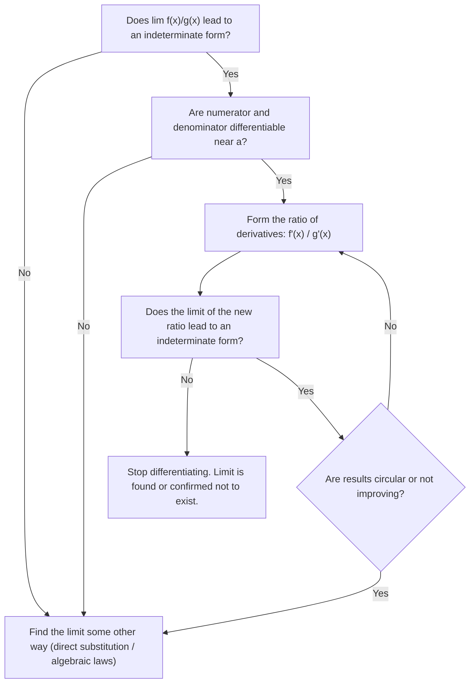

# Overview

Many of the functions critical to mathematics, physics, and engineering occur naturally as function–inverse pairs. Among the most fundamental are the natural logarithm $\ln x$ and the exponential function $e^x$. Other important pairs include trigonometric functions (when restricted to appropriate intervals) and their inverses, as well as hyperbolic functions and their inverses. 

These transcendental functions provide essential models for physical phenomena such as the mechanics of hanging cables (catenaries), the diffusion of heat flow, and the atmospheric drag/friction experienced by objects falling through fluids. In standard mathematical development, the natural logarithm is defined first via integration, and the remaining transcendental functions are systematically developed from it.

---

# 6.1 Inverse Functions and Their Derivatives

### One-to-One Functions

A function $f$ assigns an element from its range to each element in its domain. A function is said to be **one-to-one** if distinct inputs always yield distinct outputs.

> [!abstract] Definition: One-to-One Function
> A function $f(x)$ is **one-to-one** on a domain $D$ if
> $$
> f(x_1) \neq f(x_2) \quad \text{whenever } x_1 \neq x_2
> $$
> Equivalently, in contrapositive form:
> $$
> f(x_1) = f(x_2) \implies x_1 = x_2
> $$

#### The Horizontal Line Test

A geometric criterion determines whether a function is one-to-one directly from its Cartesian graph:

> [!theorem] The Horizontal Line Test
> A function $y = f(x)$ is one-to-one if and only if its graph intersects each horizontal line at most once.

If a horizontal line $y = c$ intersects the graph at two or more distinct points $(x_1, c)$ and $(x_2, c)$, then $f(x_1) = f(x_2) = c$ with $x_1 \neq x_2$, violating the definition of a one-to-one function.

### Inverses

Because each output of a one-to-one function originates from exactly one input, the assignment rule can be reversed: sending each output back to the input that produced it.

#### Formal Definition and Domain–Range Relations

> [!abstract] Definition: Inverse Function
> Let $f$ be a one-to-one function with domain $\operatorname{Dom}(f)$ and range $\operatorname{Ran}(f)$. The **inverse function** $f^{-1}$ is defined by:
> $$
> f^{-1}(b) = a \iff f(a) = b
> $$
> for any $b \in \operatorname{Ran}(f)$.
> 
> *Domain and Range properties:*
> - $\operatorname{Dom}(f^{-1}) = \operatorname{Ran}(f)$
> - $\operatorname{Ran}(f^{-1}) = \operatorname{Dom}(f)$

> [!warning] Notational Caution
> The superscript "$-1$" in $f^{-1}(x)$ denotes functional inversion, **not** an exponent:
> $$
> f^{-1}(x) \neq \frac{1}{f(x)} = (f(x))^{-1}
> $$

#### Composition and Identity Characterization

Composing a function with its inverse in either order yields the **identity function** (the function that returns its input unchanged):

> [!theorem] Inverse Composition Rule
> Functions $f$ and $g$ form an inverse pair ($g = f^{-1}$ and $f = g^{-1}$) if and only if:
> $$
> f(g(x)) = x \quad \text{for all } x \in \operatorname{Dom}(g)
> $$
> and
> $$
> g(f(x)) = x \quad \text{for all } x \in \operatorname{Dom}(f)
> $$

#### Existence Criteria (Connection to Monotonicity and the MVT)

A function possesses an inverse if and only if it is one-to-one. A crucial sufficient condition is provided by calculus:
- A function that is **strictly increasing** on an interval satisfies $x_1 < x_2 \implies f(x_1) < f(x_2)$, and is therefore one-to-one.
- A function that is **strictly decreasing** on an interval satisfies $x_1 < x_2 \implies f(x_1) > f(x_2)$, and is therefore one-to-one.

By **Corollary 3 of the Mean Value Theorem**:
1. If $f'(x) > 0$ for all $x$ in an interval $I$, then $f$ is strictly increasing on $I$, and $f^{-1}$ exists.
2. If $f'(x) < 0$ for all $x$ in an interval $I$, then $f$ is strictly decreasing on $I$, and $f^{-1}$ exists.

### Finding and Graphing Inverses

#### Geometric Symmetry Across the Line $y = x$

If a point $(a, b)$ satisfies $b = f(a)$, then by definition $a = f^{-1}(b)$, which means the point $(b, a)$ lies on the graph of $y = f^{-1}(x)$. 

The geometric transformation mapping $(a, b)$ to $(b, a)$ is a reflection across the $45^\circ$ line $y = x$. Consequently:
- The graph of $f^{-1}$ is the reflection of the graph of $f$ across the line $y = x$.
- The line $y = x$ acts as an axis of mirror symmetry between the graphs of $f$ and $f^{-1}$.

#### Algebraic Procedure to Express $f^{-1}$ as a Function of $x$

To determine an explicit formula for $f^{-1}(x)$:
1. **Solve for $x$:** Write $y = f(x)$ and solve algebraically for $x$ in terms of $y$, obtaining $x = f^{-1}(y)$.
2. **Interchange variables:** Interchange $x$ and $y$ to write the inverse with independent variable $x$: $y = f^{-1}(x)$.

#### Domain Restrictions

When a function is not one-to-one across its entire domain, its domain can be restricted to a sub-interval where it is strictly monotonic. On this restricted domain, an inverse exists (e.g., restricting $f(x) = x^2$ to $x \ge 0$ yields $f^{-1}(x) = \sqrt{x}$).

### Derivatives of Inverses of Differentiable Functions

#### Reciprocal Slopes of Reflected Tangents

Consider a nonvertical, nonhorizontal straight line with equation $y = mx + b$ ($m \neq 0$). Solving for $x$ gives:
$$
x = \frac{1}{m}y - \frac{b}{m}
$$
Interchanging $x$ and $y$ yields the reflected line:
$$
y = \frac{1}{m}x - \frac{b}{m}
$$
The slope of the reflected line is precisely the **reciprocal** $\frac{1}{m}$.

Because the tangent line to the graph of $f^{-1}$ at $(f(a), a)$ is the reflection of the tangent line to $f$ at $(a, f(a))$ across the line $y = x$, their slopes must be reciprocals:
$$
\left. \frac{df^{-1}}{dx} \right|_{x = f(a)} = \frac{1}{\left. \frac{df}{dx} \right|_{x = a}}
$$

#### The Derivative Rule for Inverses

> [!theorem] Theorem 1: The Derivative Rule for Inverses
> If $f$ is differentiable at every point of an interval $I$ and $\frac{df}{dx}$ is never zero on $I$, then $f^{-1}$ is differentiable at every point of the interval $f(I)$. The value of $\frac{df^{-1}}{dx}$ at any particular point $f(a)$ is the reciprocal of the value of $\frac{df}{dx}$ at $a$:
> $$
> \left( \frac{df^{-1}}{dx} \right)_{x = f(a)} = \frac{1}{\left( \frac{df}{dx} \right)_{x = a}}
> $$
> In prime notation:
> $$
> (f^{-1})'(f(a)) = \frac{1}{f'(a)}
> $$
> In concise operator notation:
> $$
> (f^{-1})' = \frac{1}{f'}
> $$

##### Proof
The proof consists of two parts: first establishing that the inverse function $f^{-1}$ exists and is continuous, and second, proving differentiability using the limit definition of the derivative.

**Step 1: Existence and Continuity of $f^{-1}$**

1. **Strict Monotonicity:** Since $f$ is differentiable on the interval $I$, $f'(x)$ has the intermediate value property (Darboux's Theorem). Because $f'(x) \neq 0$ anywhere on $I$, $f'(x)$ must remain strictly positive ($f'(x) > 0$) or strictly negative ($f'(x) < 0$) across the entire interval. By the Mean Value Theorem, $f$ is strictly increasing or strictly decreasing on $I$.
    
2. **Invertibility:** Strict monotonicity guarantees that $f$ is one-to-one (injective), which ensures that the inverse function $f^{-1}$ exists with domain $f(I)$.
    
3. **Continuity of the Inverse:** Because $f$ is continuous and strictly monotonic on an interval, its inverse $f^{-1}$ is also continuous on the interval $f(I)$.

**Step 2: Differentiability via the Limit Definition**

Let $b = f(a)$, which means $a = f^{-1}(b)$. Consider any point $y \in f(I)$ such that $y \neq b$. Because $f$ is bijective, there is a unique $x \in I$ such that $y = f(x)$, where $x \neq a$, and $x = f^{-1}(y)$.

The difference quotient for the derivative of $f^{-1}$ at $b$ is:
$$
\frac{f^{-1}(y) - f^{-1}(b)}{y - b} = \frac{x - a}{f(x) - f(a)}
$$
Since $x \neq a$, we can rewrite this as the reciprocal:
$$
\frac{f^{-1}(y) - f^{-1}(b)}{y - b} = \frac{1}{\frac{f(x) - f(a)}{x - a}}
$$
Now take the limit as $y \to b$:

- Because $f^{-1}$ is continuous, as $y \to b$, $x = f^{-1}(y) \to f^{-1}(b) = a$.
    
- As $x \to a$, the denominator approaches the derivative $f'(a)$:
$$
\lim_{y \to b} \frac{f^{-1}(y) - f^{-1}(b)}{y - b} = \lim_{x \to a} \frac{1}{\frac{f(x) - f(a)}{x - a}} = \frac{1}{\lim_{x \to a} \frac{f(x) - f(a)}{x - a}} = \frac{1}{f'(a)}
$$
Because $f'(a)$ exists and $f'(a) \neq 0$, the limit on the right exists and is finite. Therefore:

1. $f^{-1}$ is differentiable at $b = f(a)$.
    
2. The derivative is:
$$
\left(\frac{df^{-1}}{dx}\right)_{x=f(a)} = \frac{1}{\left(\frac{df}{dx}\right)_{x=a}} \quad \text{or} \quad (f^{-1})'(f(a)) = \frac{1}{f'(a)}
$$

#### Differential and Rate-of-Change Interpretation

If $y = f(x)$ is differentiable at $x = a$, a small increment $dx$ produces a corresponding change in $y$ approximated by differentials:
$$
dy \approx f'(a) \, dx
$$
This indicates that near $x = a$, $y$ changes approximately $f'(a)$ times as fast as $x$. 

Conversely, viewing $x$ as a function of $y$ ($x = f^{-1}(y)$), the change in $x$ is:
$$
dx \approx \frac{1}{f'(a)} \, dy
$$
This states that $x$ changes approximately $\frac{1}{f'(a)}$ times as fast as $y$, providing an intuitive basis for the reciprocal relationship of the derivatives.

#### Chain Rule Connection

The formula $(f^{-1})'(f(x)) = \frac{1}{f'(x)}$ can also be understood via the Chain Rule. Since $f^{-1}(f(x)) = x$ identically, differentiating both sides with respect to $x$ gives:
$$
\frac{d}{dx} \left[ f^{-1}(f(x)) \right] = \frac{d}{dx}[x]
$$
$$
(f^{-1})'(f(x)) \cdot f'(x) = 1
$$
Dividing by $f'(x)$ (provided $f'(x) \neq 0$) yields:
$$
(f^{-1})'(f(x)) = \frac{1}{f'(x)}
$$

### Theory and Applications (Selected Problems 45–52)

##### Problem 45: Invertibility of Negated Functions
**Problem Statement:** If $f(x)$ is one-to-one, can anything be said about $g(x) = -f(x)$? Give reasons for your answer.

**Solution:**
Yes, $g(x) = -f(x)$ is guaranteed to be one-to-one.

*Proof:*
Suppose $g(x_1) = g(x_2)$ for $x_1, x_2 \in \operatorname{Dom}(g) = \operatorname{Dom}(f)$. Then:
$$
-f(x_1) = -f(x_2)
$$
Multiplying both sides by $-1$:
$$
f(x_1) = f(x_2)
$$
Since $f$ is one-to-one, $f(x_1) = f(x_2)$ implies $x_1 = x_2$. Therefore, $g(x_1) = g(x_2) \implies x_1 = x_2$, proving that $g$ is one-to-one.

*Geometric Insight:* The graph of $g(x) = -f(x)$ is the reflection of the graph of $f(x)$ across the $x$-axis. A horizontal line $y = c$ intersects $y = g(x)$ at $x$ if and only if the horizontal line $y = -c$ intersects $y = f(x)$ at $x$. Because the graph of $f$ passes the horizontal line test, the graph of $g$ must also pass it.

##### Problem 46: Invertibility of Reciprocal Functions
**Problem Statement:** If $f(x)$ is one-to-one and $f(x)$ is never $0$, can anything be said about $h(x) = 1/f(x)$? Give reasons for your answer.

**Solution:**
Yes, $h(x) = 1/f(x)$ is guaranteed to be one-to-one.

*Proof:*
Suppose $h(x_1) = h(x_2)$ for $x_1, x_2 \in \operatorname{Dom}(h) = \operatorname{Dom}(f)$. Then:
$$
\frac{1}{f(x_1)} = \frac{1}{f(x_2)}
$$
Since $f(x) \neq 0$ for all $x$, we can take reciprocals on both sides:
$$
f(x_1) = f(x_2)
$$
Since $f$ is one-to-one, this implies $x_1 = x_2$. Hence, $h$ is one-to-one.

##### Problem 47: Composition of One-to-One Functions
**Problem Statement:** Suppose that the range of $g$ lies in the domain of $f$ so that the composite $f \circ g$ is defined. If $f$ and $g$ are one-to-one, can anything be said about $f \circ g$? Give reasons for your answer.

**Solution:**
Yes, the composite function $f \circ g$ is one-to-one.

*Proof:*
Let $x_1, x_2 \in \operatorname{Dom}(g)$ and assume that $(f \circ g)(x_1) = (f \circ g)(x_2)$, which means:
$$
f(g(x_1)) = f(g(x_2))
$$
Since $f$ is one-to-one, inputs producing identical outputs under $f$ must be equal:
$$
g(x_1) = g(x_2)
$$
Next, since $g$ is also one-to-one, $g(x_1) = g(x_2)$ implies:
$$
x_1 = x_2
$$
Consequently, $(f \circ g)(x_1) = (f \circ g)(x_2) \implies x_1 = x_2$, so $f \circ g$ is one-to-one.

##### Problem 48: One-to-One Property of Inner Functions in a Composite
**Problem Statement:** If a composite $f \circ g$ is one-to-one, must $g$ be one-to-one? Give reasons for your answer.

**Solution:**
Yes, the inner function $g$ must be one-to-one. (Note: The outer function $f$ is not required to be one-to-one on its entire domain, but only on $\operatorname{Ran}(g)$.)

*Proof:*
Suppose $g(x_1) = g(x_2)$ for some $x_1, x_2 \in \operatorname{Dom}(g)$.
Applying $f$ to both sides gives:
$$
f(g(x_1)) = f(g(x_2))
$$
which by definition is:
$$
(f \circ g)(x_1) = (f \circ g)(x_2)
$$
Since $f \circ g$ is given to be one-to-one, this implies:
$$
x_1 = x_2
$$
Hence, $g(x_1) = g(x_2) \implies x_1 = x_2$, proving that $g$ must be one-to-one.

##### Problem 49: Geometric Area Integral Identity for Inverses
**Problem Statement:** Suppose $f(x)$ is positive, continuous, and increasing over the interval $[a, b]$. By interpreting the graph of $f$ show that:
$$
\int_a^b f(x) \, dx + \int_{f(a)}^{f(b)} f^{-1}(y) \, dy = b f(b) - a f(a)
$$

**Solution:**
*Geometric Interpretation (Decomposition of Bounding Rectangles):*
Consider the Cartesian plane in the first quadrant where $x \ge 0$ and $y \ge 0$:
1. Construct the large bounding rectangle defined by vertices $(0,0)$, $(b,0)$, $(b, f(b))$, and $(0, f(b))$. The area of this rectangle is:
$$
\text{Area}_{\text{large}} = b \cdot f(b)
$$
2. Construct the smaller corner rectangle defined by vertices $(0,0)$, $(a,0)$, $(a, f(a))$, and $(0, f(a))$. The area of this rectangle is:
$$
\text{Area}_{\text{corner}} = a \cdot f(a)
$$
3. Subtracting the corner rectangle from the large rectangle leaves an $L$-shaped planar region with total area:
$$
\text{Area}_L = b f(b) - a f(a)
$$
4. Because $f(x)$ is continuous and strictly increasing on $[a, b]$, the graph $y = f(x)$ is a monotonic curve connecting $(a, f(a))$ to $(b, f(b))$ that partitions the $L$-shaped region into two non-overlapping regions:
   - **Region 1 (Area under $f(x)$ along the $x$-axis):** The vertical strip bounded below by the $x$-axis, above by $y = f(x)$, and horizontally between $x = a$ and $x = b$:
     $$
     \text{Area}_1 = \int_a^b f(x) \, dx
     $$
   - **Region 2 (Area beside $f^{-1}(y)$ along the $y$-axis):** The horizontal strip bounded to the left by the $y$-axis, to the right by the curve $x = f^{-1}(y)$, and vertically between $y = f(a)$ and $y = f(b)$:
     $$
     \text{Area}_2 = \int_{f(a)}^{f(b)} f^{-1}(y) \, dy
     $$
Because $\text{Area}_1 + \text{Area}_2 = \text{Area}_L$, summing both integrals yields:
$$
\int_a^b f(x) \, dx + \int_{f(a)}^{f(b)} f^{-1}(y) \, dy = b f(b) - a f(a)
$$

*Analytic Verification (via Integration by Parts):*
Substituting $y = f(x)$ and $dy = f'(x) \, dx$ into the second integral, where $y = f(a) \implies x = a$ and $y = f(b) \implies x = b$:
$$
\int_{f(a)}^{f(b)} f^{-1}(y) \, dy = \int_a^b f^{-1}(f(x)) f'(x) \, dx = \int_a^b x f'(x) \, dx
$$
Using integration by parts on $\int_a^b x f'(x) \, dx$ with $u = x$ and $dv = f'(x) \, dx$:
$$
\int_a^b x f'(x) \, dx = \left[ x f(x) \right]_a^b - \int_a^b f(x) \, dx = b f(b) - a f(a) - \int_a^b f(x) \, dx
$$
Rearranging confirms:
$$
\int_a^b f(x) \, dx + \int_{f(a)}^{f(b)} f^{-1}(y) \, dy = b f(b) - a f(a)
$$

##### Problem 50: Invertibility of Linear Fractional (Möbius) Transformations
**Problem Statement:** Determine conditions on the constants $a, b, c,$ and $d$ so that the rational function
$$
f(x) = \frac{ax + b}{cx + d}
$$
has an inverse.

**Solution:**
A function possesses an inverse if and only if it is one-to-one on its domain $\{x \in \mathbb{R} \mid cx + d \neq 0\}$ and non-trivial (not degenerate or constant).

*Algebraic Derivation:*
Assume $f(x_1) = f(x_2)$ for $x_1, x_2 \in \operatorname{Dom}(f)$:
$$
\frac{ax_1 + b}{cx_1 + d} = \frac{ax_2 + b}{cx_2 + d}
$$
Cross-multiplying:
$$
(ax_1 + b)(cx_2 + d) = (ax_2 + b)(cx_1 + d)
$$
Expanding both products:
$$
ac x_1 x_2 + ad x_1 + bc x_2 + bd = ac x_1 x_2 + ad x_2 + bc x_1 + bd
$$
Canceling the common terms $ac x_1 x_2$ and $bd$:
$$
ad x_1 + bc x_2 = ad x_2 + bc x_1
$$
Collecting terms with $x_1$ and $x_2$:
$$
ad x_1 - bc x_1 = ad x_2 - bc x_2
$$
$$
(ad - bc) x_1 = (ad - bc) x_2
$$
$$
(ad - bc)(x_1 - x_2) = 0
$$

*Analysis of Cases:*
1. **Case 1: $ad - bc \neq 0$**
   We can divide both sides by $ad - bc \neq 0$, which immediately gives:
	$$
	x_1 - x_2 = 0 \implies x_1 = x_2
	$$
	Thus, $f$ is strictly one-to-one and has a valid inverse function:
	$$
	f^{-1}(y) = \frac{-dy + b}{cy - a}
	$$
2. **Case 2: $ad - bc = 0$**
	In this case, the derivative is always $0$, making $f(x)$ a constant function, which we know is not one-to-one and doesn't have an inverse.

*Conclusion:*
The rational function $f(x) = \frac{ax+b}{cx+d}$ has an inverse if and only if:
$$
ad - bc \neq 0
$$

##### Problem 51: Chain Rule Connection and Differentiability of Inverses
**Problem Statement:**
If we write $g(x)$ for $f^{-1}(x)$, the derivative formula can be written as:
$$
g'(f(a)) = \frac{1}{f'(a)}, \quad \text{or} \quad g'(f(a)) \cdot f'(a) = 1
$$
Replacing $a$ with $x$ yields:
$$
g'(f(x)) \cdot f'(x) = 1
$$
Assume that $f$ and $g$ are differentiable functions that are inverses of one another, so that $(g \circ f)(x) = x$. Differentiate both sides of this equation with respect to $x$, using the Chain Rule to express $(g \circ f)'(x)$ as a product of derivatives of $g$ and $f$. What do you find? Explain why this is not a proof of Theorem 1.

**Solution:**
*Chain Rule Derivation:*
Given that $g = f^{-1}$ and $(g \circ f)(x) = g(f(x)) = x$, differentiating both sides with respect to $x$:
$$
\frac{d}{dx}\left[ g(f(x)) \right] = \frac{d}{dx}[x]
$$
By applying the Chain Rule to the composite function $g(f(x))$:
$$
g'(f(x)) \cdot f'(x) = 1
$$
Solving for $g'(f(x))$ (provided $f'(x) \neq 0$):
$$
g'(f(x)) = \frac{1}{f'(x)}
$$
Substituting $y = f(x)$, so that $x = g(y) = f^{-1}(y)$:
$$
(f^{-1})'(y) = \frac{1}{f'(f^{-1}(y))}
$$

*Why this does NOT constitute a proof of Theorem 1:*
Applying the Chain Rule $\frac{d}{dx}[g(f(x))] = g'(f(x)) \cdot f'(x)$ requires as an initial hypothesis that the outer function $g$ is already known to be differentiable at $f(x)$. 
However, the central assertion of Theorem 1 is proving that $f^{-1}$ **is differentiable** in the first place whenever $f$ is differentiable with $f' \neq 0$. Assuming that $g$ is differentiable at the outset assumes the very conclusion to be proved (begging the question / circular reasoning). Thus, this calculation serves as an intuitive heuristic for the derivative value, but Theorem 1 requires the rigorous difference-quotient proof.

##### Problem 52: Equivalence of the Washer and Shell Methods for Inverses
**Problem Statement:**
Let $f$ be differentiable on the interval $a \le x \le b$, with $a > 0$, and suppose that $f$ has a differentiable inverse, $f^{-1}$. Revolve about the $y$-axis the region bounded by the graph of $f$ and the lines $x = a$ and $y = f(b)$ to generate a solid. Then the values of the integrals given by the washer and shell methods for the volume have identical values:
$$
\int_{f(a)}^{f(b)} \pi \left( (f^{-1}(y))^2 - a^2 \right) dy = \int_a^b 2\pi x (f(b) - f(x)) \, dx
$$
To prove this equality, define:
$$
W(t) = \int_{f(a)}^{f(t)} \pi \left( (f^{-1}(y))^2 - a^2 \right) dy
$$
$$
S(t) = \int_a^t 2\pi x (f(t) - f(x)) \, dx
$$
Show that the functions $W$ and $S$ agree at a point of $[a, b]$ and have identical derivatives on $[a, b]$, thereby establishing $W(t) = S(t)$ for all $t \in [a, b]$, and in particular $W(b) = S(b)$.

**Solution:**

*Step 1: Verify agreement at $t = a$.*
Evaluating $W(t)$ and $S(t)$ at the lower bound $t = a$:
$$
W(a) = \int_{f(a)}^{f(a)} \pi \left( (f^{-1}(y))^2 - a^2 \right) dy = 0
$$
$$
S(a) = \int_a^a 2\pi x (f(a) - f(x)) \, dx = 0
$$
Both integrals have equal upper and lower limits of integration, hence:
$$
W(a) = S(a) = 0
$$

*Step 2: Differentiate $W(t)$ using the Fundamental Theorem of Calculus and Chain Rule.*
The upper limit of integration of $W(t)$ is $u(t) = f(t)$. By the Leibniz Rule / Chain Rule:
$$
W'(t) = \frac{d}{dt} \left[ \int_{f(a)}^{f(t)} \pi \left( (f^{-1}(y))^2 - a^2 \right) dy \right] = \pi \left( (f^{-1}(f(t)))^2 - a^2 \right) \cdot f'(t)
$$
Since $f^{-1}(f(t)) = t$:
$$
W'(t) = \pi (t^2 - a^2) f'(t)
$$

*Step 3: Differentiate $S(t)$.*
Notice that in $S(t)$, the variable $t$ appears both in the upper limit of integration and inside the integrand via $f(t)$. We separate $f(t)$ from the integrand:
$$
\begin{align}
S(t) &= \int_a^t 2\pi x (f(t) - f(x)) \, dx \\
&= \int_a^t 2\pi x f(t) \, dx - \int_a^t 2\pi x f(x) \, dx \\
&= f(t) \int_a^t 2\pi x \, dx - \int_a^t 2\pi x f(x) \, dx
\end{align}
$$
Evaluate the first elementary integral:
$$
\int_a^t 2\pi x \, dx = \left[ \pi x^2 \right]_a^t = \pi(t^2 - a^2)
$$
Substituting this back into $S(t)$:
$$
S(t) = \pi(t^2 - a^2) f(t) - \int_a^t 2\pi x f(x) \, dx
$$
Now differentiate $S(t)$ with respect to $t$. Using the Product Rule on the first term and the Fundamental Theorem of Calculus on the second term:
$$
\begin{align}
S'(t) &= \frac{d}{dt}\left[ \pi(t^2 - a^2) f(t) \right] - \frac{d}{dt}\left[ \int_a^t 2\pi x f(x) \, dx \right] \\
&= \left( \frac{d}{dt}[\pi(t^2 - a^2)] \cdot f(t) + \pi(t^2 - a^2) \cdot f'(t) \right) - 2\pi t f(t) \\
&= 2\pi t f(t) + \pi(t^2 - a^2) f'(t) - 2\pi t f(t) \\
&= \pi(t^2 - a^2) f'(t)
\end{align}
$$

*Step 4: Conclusion.*
Comparing the derivatives from Step 2 and Step 3:
$$
W'(t) = S'(t) = \pi(t^2 - a^2) f'(t) \quad \text{for all } t \in [a, b]
$$
Since $W'(t) - S'(t) = 0$ on the connected interval $[a, b]$, the Mean Value Theorem implies that their difference is a constant:
$$
W(t) - S(t) = C \quad \text{for all } t \in [a, b]
$$
Using the initial condition at $t = a$:
$$
C = W(a) - S(a) = 0 - 0 = 0
$$
Therefore, $W(t) = S(t)$ for all $t \in [a, b]$. Evaluating at $t = b$ completes the proof:
$$
W(b) = S(b) \iff \int_{f(a)}^{f(b)} \pi \left( (f^{-1}(y))^2 - a^2 \right) dy = \int_a^b 2\pi x (f(b) - f(x)) \, dx \quad \blacksquare
$$

---

# 6.2 Natural Logarithms

### Historical Context and Development

In the late 1500s, Scottish baron **John Napier** (1550–1617) invented a computational method called the **logarithm** to simplify arithmetic by transforming multiplication into addition via the identity:
$$\ln(ax) = \ln a + \ln x$$
To multiply two large numbers, one looked up their logarithms in tables, summed them, and looked up the corresponding anti-logarithm.

Napier devoted the final 20 years of his life calculating these extensive logarithmic tables (while Danish astronomer Tycho Brahe waited anxiously for them to accelerate his celestial mechanics calculations). The tables were completed posthumously by Napier's friend **Henry Briggs** in London. Base 10 logarithms consequently became known as *Briggsian logarithms*.

*(Historical note: Napier also invented a devastatingly accurate artillery piece capable of hitting a cow a mile away; appalled by the destructive capability of the weapon, he stopped manufacturing it and suppressed the blueprints.)*

In modern calculus, rather than developing logarithms purely from computational bases, the natural logarithm is defined rigorously as an integral.

### Definition of the Natural Logarithm Function

> [!abstract] Definition: The Natural Logarithm Function
> The **natural logarithm function**, denoted $\ln x$, is defined for all positive real numbers $x > 0$ by:
> $$
> \ln x = \int_1^x \frac{1}{t} \, dt, \quad x > 0
> $$

#### Geometric Interpretation as an Accumulation Function

The value of $\ln x$ is geometric area under the hyperbola $y = \frac{1}{t}$:
1. **For $x > 1$:** $\ln x$ is the area under $y = \frac{1}{t}$ from $t = 1$ to $t = x$:
	$$
	\ln x = \int_1^x \frac{1}{t} \, dt > 0
	$$
2. **For $x = 1$:** The upper and lower integration limits coincide:
	$$
	\ln 1 = \int_1^1 \frac{1}{t} \, dt = 0
	$$
3. **For $0 < x < 1$:** Reversing the integration limits reveals that $\ln x$ is the negative of the area under $y = \frac{1}{t}$ from $t = x$ to $t = 1$:
	$$
	\ln x = \int_1^x \frac{1}{t} \, dt = -\int_x^1 \frac{1}{t} \, dt < 0
	$$
4. **For $x \le 0$:** $\ln x$ is **undefined** because $\frac{1}{t}$ has a non-integrable singularity at $t = 0$.

#### The Dummy Variable of Integration

In the integral definition $\ln x = \int_1^x \frac{1}{t} \, dt$, the symbol $t$ is a dummy variable of integration. It avoids confounding the varying upper integration limit $x$ with the variable along the horizontal axis of the integrand curve.

### The Derivative of $y = \ln x$

#### Direct Derivative from the Fundamental Theorem of Calculus

Applying Part 1 of the Fundamental Theorem of Calculus ($\frac{d}{dx} \int_a^x f(t)\,dt = f(x)$):
$$\frac{d}{dx} \ln x = \frac{d}{dx} \int_1^x \frac{1}{t} \, dt = \frac{1}{x}$$

> [!theorem] Derivative of the Natural Logarithm
> For every $x > 0$:
> $$
> \frac{d}{dx} \ln x = \frac{1}{x}
> $$

#### Chain Rule Extension

If $u = u(x)$ is a positive, differentiable function of $x$:
$$
\frac{d}{dx} \ln u = \frac{d}{du}[\ln u] \cdot \frac{du}{dx} = \frac{1}{u} \frac{du}{dx}
$$

> [!theorem] Chain Rule for Natural Logarithms
> If $u > 0$ is a differentiable function of $x$:
> $$
> \frac{d}{dx} \ln u = \frac{1}{u} \frac{du}{dx}
> $$

#### Scaling Invariance of the Derivative

For any positive constant $a > 0$, differentiating $\ln(ax)$ directly yields:
$$
\frac{d}{dx} \ln(ax) = \frac{1}{ax} \cdot \frac{d}{dx}(ax) = \frac{1}{ax} \cdot a = \frac{1}{x}
$$
The function $\ln(ax)$ has the exact same derivative as $\ln x$.

### Algebraic Properties of Logarithms and Their Rigorous Proofs

> [!summary] Table 6.1: Properties of Natural Logarithms
> For any positive numbers $a > 0$ and $x > 0$:
> 1. **Product Rule:** $\ln(ax) = \ln a + \ln x$
> 2. **Quotient Rule:** $\ln \left(\frac{a}{x}\right) = \ln a - \ln x$
> 3. **Reciprocal Rule:** $\ln \left(\frac{1}{x}\right) = -\ln x$ (special case of Quotient Rule with $a = 1$)
> 4. **Power Rule:** $\ln(x^n) = n \ln x$ (for rational $n$, and all real $n$)

#### Rigorous Proofs

##### Proof of the Product Rule: $\ln(ax) = \ln a + \ln x$
1. Differentiating both $\ln(ax)$ and $\ln x$ with respect to $x$:
	$$
	\frac{d}{dx} \ln(ax) = \frac{1}{ax} \cdot a = \frac{1}{x} \quad \text{and} \quad \frac{d}{dx} \ln x = \frac{1}{x}
	$$
2. Since both functions share the identical derivative on the open interval $(0, \infty)$, by **Corollary 1 of the Mean Value Theorem**, they must differ by a constant $C$:
	$$
	\ln(ax) = \ln x + C
	$$
3. This equality must hold for all $x > 0$. Evaluating at $x = 1$:
	$$
	\begin{align}
	\ln(a \cdot 1) & = \ln(1) + C \\
	\ln a & = 0 + C \\
	\implies C & = \ln a
	\end{align}
	$$
4. Substituting $C = \ln a$ back into the equation:
	$$
	\ln(ax) = \ln a + \ln x \quad \blacksquare
	$$

##### Proof of the Reciprocal Rule: $\ln\left(\frac{1}{x}\right) = -\ln x$
Substitute $a = \frac{1}{x}$ into the Product Rule:
$$
\begin{align}
\ln\left(\frac{1}{x} \cdot x\right) & = \ln\left(\frac{1}{x}\right) + \ln x \\
\ln(1) & = \ln\left(\frac{1}{x}\right) + \ln x \\
0 & = \ln\left(\frac{1}{x}\right) + \ln x \\
\implies \ln\left(\frac{1}{x}\right) & = -\ln x \quad \blacksquare
\end{align}
$$

##### Proof of the Quotient Rule: $\ln\left(\frac{a}{x}\right) = \ln a - \ln x$
Express $\frac{a}{x}$ as a product $a \cdot \frac{1}{x}$ and apply the Product Rule followed by the Reciprocal Rule:
$$
\ln\left(\frac{a}{x}\right) = \ln\left(a \cdot \frac{1}{x}\right) = \ln a + \ln\left(\frac{1}{x}\right) = \ln a - \ln x \quad \blacksquare
$$

##### Proof of the Power Rule: $\ln(x^n) = n \ln x$ (for Rational $n$)
1. Let $n$ be any rational number. Differentiate $\ln(x^n)$ with respect to $x$ using the Chain Rule and the Power Rule for differentiation:
	$$
	\frac{d}{dx} \ln(x^n) = \frac{1}{x^n} \cdot \frac{d}{dx}(x^n) = \frac{1}{x^n} \cdot (n x^{n-1}) = \frac{n}{x}
	$$
2. Now differentiate $n \ln x$ with respect to $x$:
	$$
	\frac{d}{dx}(n \ln x) = n \cdot \frac{1}{x} = \frac{n}{x}
	$$
3. Because $\ln(x^n)$ and $n \ln x$ have identical derivatives on $(0, \infty)$, they differ by a constant $C$:
	$$
	\ln(x^n) = n \ln x + C
	$$
4. Setting $x = 1$:
	$$
	\ln(1^n) = n \ln(1) + C \implies \ln(1) = 0 + C \implies 0 = 0 + C \implies C = 0
	$$
5. Thus:
	$$
	\ln(x^n) = n \ln x \quad \blacksquare
	$$

> [!note] Theoretical Remark on Irrational Exponents
> The above proof depends on $\frac{d}{dx}(x^n) = n x^{n-1}$, which is established only for rational exponents $n \in \mathbb{Q}$ at this stage of calculus. While the identity $\ln(x^n) = n \ln x$ holds for all real exponents, its complete proof for irrational powers requires first defining general exponential expressions of the form $x^r = e^{r \ln x}$.

### Analysis of the Graph and Range of $\ln x$

#### Monotonicity and Concavity
- **First Derivative:**
	$$
	\frac{d}{dx} \ln x = \frac{1}{x} > 0 \quad \text{for all } x \in (0, \infty)
	$$
	Therefore, $\ln x$ is **strictly increasing** on its entire domain.
- **Second Derivative:**
	$$
	\frac{d^2}{dx^2} \ln x = \frac{d}{dx}\left(\frac{1}{x}\right) = -\frac{1}{x^2} < 0 \quad \text{for all } x \in (0, \infty)
	$$
	Therefore, the graph of $\ln x$ is **strictly concave down** everywhere on its domain.

#### Asymptotic Behavior at Boundaries
By numerical approximation, $\ln 2 \approx 0.693 > \frac{1}{2}$.
- **Behavior as $x \to \infty$:**
  For any integer $n$:
	$$
	\ln(2^n) = n \ln 2 > n \left(\frac{1}{2}\right) = \frac{n}{2}
	$$
	As $n \to \infty$, $\frac{n}{2} \to \infty \implies \ln 2^{n} \to \infty$. Since $\ln x$ is strictly increasing, this means that:
	$$
	\lim_{x \to \infty} \ln x = \infty
	$$
- **Behavior as $x \to 0^+$:**
	For any integer $n$:
	$$
	\ln(2^{-n}) = -n \ln 2 < -n \left(\frac{1}{2}\right) = -\frac{n}{2}
	$$
	As $n \to \infty$, $-\frac{n}{2} \to -\infty$. Therefore:
	$$
	\lim_{x \to 0^+} \ln x = -\infty
	$$

#### Summary of Function Characteristics
- **Domain:** $(0, \infty)$
- **Range:** $(-\infty, \infty)$
- **Intercept:** $(1, 0)$
- **Asymptote:** Vertical asymptote at the line $x = 0$ ($y$-axis).

### Technique of Logarithmic Differentiation

The derivatives of positive functions expressed as complicated products, quotients, or powers can be obtained efficiently by taking natural logarithms before differentiating.

#### Procedural Algorithm (for $y = f(x) > 0$)

1. **Take logarithms:** Take the natural logarithm of both sides:
	$$
	\ln y = \ln f(x)
	$$
2. **Expand:** Apply properties of logarithms (Product, Quotient, Power rules) to transform products into sums, quotients into differences, and exponents into scalar multipliers.
3. **Differentiate implicitly:** Differentiate both sides with respect to $x$:
	$$
	\begin{align}
	\frac{d}{dx}[\ln y] = \frac{d}{dx}[\ln f(x)]
	\frac{1}{y} \frac{dy}{dx} = \frac{d}{dx}[\ln f(x)]
	\end{align}
	$$
4. **Isolate $\frac{dy}{dx}$:** Multiply through by $y$:
	$$
	\frac{dy}{dx} = y \cdot \frac{d}{dx}[\ln f(x)]
	$$
5. **Substitute original formula:** Replace $y$ with $f(x)$ to express the derivative entirely in terms of $x$:
	$$
	\frac{dy}{dx} = f(x) \cdot \frac{d}{dx}[\ln f(x)]
	$$

> [!note] Theoretical Nuance: Domain Restrictions and Validity of Logarithmic Differentiation
> A natural theoretical question arises: *does taking the logarithm artificially restrict the domain only to points where $f(x) > 0$?* 
> 
> The resulting derivative formula remains valid everywhere the original function $f$ is differentiable, including where $f(x) < 0$ and where $f(x) = 0$. This holds because of three theoretical principles:
> 
> 1. **Negative Values ($f(x) < 0$):** We can apply logarithms to the absolute value: $\ln |y| = \ln |f(x)|$. Since $\frac{d}{dx}\ln |u| = \frac{1}{u}\frac{du}{dx}$ for any nonzero differentiable $u$, the signs cancel identically:
>    - For $u > 0$: $\frac{d}{dx}\ln(u) = \frac{1}{u}\frac{du}{dx}$
>    - For $u < 0$: $\frac{d}{dx}\ln(-u) = \frac{1}{-u}\left(-\frac{du}{dx}\right) = \frac{1}{u}\frac{du}{dx}$
>    
>    Thus, sign information does not alter the resulting derivative; the intermediate step strictly requires only $f(x) \neq 0$.
> 
> 2. **Zeroes ($f(x) = 0$):** At roots where $f(x) = 0$, $\ln |f(x)|$ is undefined. However, in the final step:
>    $$
>    \frac{dy}{dx} = f(x) \cdot \frac{d}{dx}[\ln |f(x)|]
>    $$
>    multiplying back through by $f(x)$ algebraically cancels the vanishing factors in the denominators (removable singularities). By the continuity of $f'(x)$, the derivative evaluated at the root matches the limit:
>    $$
>    f'(a) = \lim_{x \to a} f'(x)
>    $$
> 
> 3. **Equivalence to the Product and Quotient Rules:** Logarithmic differentiation is an algebraic shortcut for repeated applications of the Leibniz Product Rule and Quotient Rule. For any product $y = uv$, the product rule $y' = u'v + uv'$ is algebraically equivalent to:
>    $$
>    \frac{y'}{y} = \frac{u'}{u} + \frac{v'}{v}
>    $$
>    The logarithm serves solely as a bookkeeping device to decompose products into sums. Because the underlying product and quotient rules hold globally across the entire domain of $f$, the final derived formula is valid everywhere $f$ is differentiable.

### Integration Involving Logarithms

#### The Integral $\int \frac{1}{u} \, du$

The derivative $\frac{d}{du}\ln u = \frac{1}{u}$ establishes that $\int \frac{1}{u} \, du = \ln u + C$ when $u > 0$. 

To address the case where $u < 0$:
- If $u < 0$, then $-u > 0$, so $\ln(-u)$ is well-defined.
- Applying the Chain Rule with $w = -u$:
	$$
	\frac{d}{du} \ln(-u) = \frac{1}{-u} \cdot \frac{d}{du}(-u) = \frac{1}{-u} (-1) = \frac{1}{u}
	$$
- Therefore, for $u < 0$:
	$$
	\int \frac{1}{u} \, du = \ln(-u) + C
	$$

Unifying both cases using the absolute value notation $|u|$:
- When $u > 0$, $|u| = u \implies \ln |u| = \ln u$.
- When $u < 0$, $|u| = -u \implies \ln |u| = \ln(-u)$.

> [!theorem] Integral of $1/u$
> If $u$ is a nonzero differentiable function:
> $$
> \int \frac{1}{u} \, du = \ln |u| + C
> $$

#### Resolution of the Power Rule Exception

The standard power rule for integration states:
$$
\int u^n \, du = \frac{u^{n+1}}{n+1} + C, \quad n \neq -1
$$
The singularity at $n = -1$ is resolved by the natural logarithm:
$$
\int u^{-1} \, du = \int \frac{1}{u} \, du = \ln |u| + C
$$

#### The Form $\int \frac{f'(x)}{f(x)} \, dx$

Whenever an integrand consists of a quotient where the numerator is the derivative of the denominator, substituting $u = f(x)$ and $du = f'(x) \, dx$ yields:
$$
\int \frac{f'(x)}{f(x)} \, dx = \int \frac{du}{u} = \ln |u| + C = \ln |f(x)| + C
$$
(provided $f(x)$ maintains a constant sign on the domain of integration).

### Theoretical Derivations of the Integrals of $\tan x$ and $\cot x$

Prior to the introduction of the logarithmic integral rule, the trigonometric integrals of $\tan x$ and $\cot x$ could not be evaluated in closed form.

#### Integral of the Tangent Function
Express $\tan x$ as $\frac{\sin x}{\cos x}$:
$$
\int \tan x \, dx = \int \frac{\sin x}{\cos x} \, dx
$$
Let $u = \cos x$, so $du = -\sin x \, dx$, which gives $\sin x \, dx = -du$:
$$
\int \tan x \, dx = \int \frac{-du}{u} = -\int \frac{du}{u} = -\ln |u| + C = -\ln |\cos x| + C
$$
Applying the reciprocal rule $-\ln |\cos x| = \ln |\cos x|^{-1} = \ln \left|\frac{1}{\cos x}\right| = \ln |\sec x|$:
$$
\int \tan u \, du = -\ln |\cos u| + C = \ln |\sec u| + C
$$

#### Integral of the Cotangent Function
Express $\cot x$ as $\frac{\cos x}{\sin x}$:
$$
\int \cot x \, dx = \int \frac{\cos x}{\sin x} \, dx
$$
Let $u = \sin x$, so $du = \cos x \, dx$:
$$
\int \cot x \, dx = \int \frac{du}{u} = \ln |u| + C = \ln |\sin x| + C
$$
Applying the reciprocal rule $\ln |\sin x| = -\ln \left|\frac{1}{\sin x}\right| = -\ln |\csc x|$:
$$
\int \cot u \, du = \ln |\sin u| + C = -\ln |\csc u| + C
$$

> [!summary] Summary of Boxed Integrals
> $$
> \int \tan u \, du = -\ln |\cos u| + C = \ln |\sec u| + C
> $$
> $$
> \int \cot u \, du = \ln |\sin u| + C = -\ln |\csc u| + C
> $$

---

# 6.3 The Exponential Function

## The Inverse of the Natural Logarithm and the Number $e$

### Invertibility of the Natural Logarithm

In Section 6.2, the natural logarithm was defined for all $x > 0$ by the integral:
$$
\ln x = \int_1^x \frac{1}{t} \, dt
$$
By the Fundamental Theorem of Calculus, its derivative is:
$$
\frac{d}{dx} \ln x = \frac{1}{x}
$$
For all $x \in (0, \infty)$, $\frac{1}{x} > 0$. Because its derivative is strictly positive on its entire domain, $\ln x$ is strictly increasing. By Theorem 1 of Section 6.1, every strictly increasing function is one-to-one and therefore possesses a unique inverse function, denoted $\ln^{-1}$.

#### Domain, Range, and Asymptotic Behavior

The domain and range of the inverse function $\ln^{-1}$ swap the domain and range of $\ln$:
- $\operatorname{Dom}(\ln^{-1}) = \operatorname{Ran}(\ln) = (-\infty, \infty)$
- $\operatorname{Ran}(\ln^{-1}) = \operatorname{Dom}(\ln) = (0, \infty)$

The asymptotic limits of $\ln x$ determine the asymptotic limits of $\ln^{-1} x$:
- Since $\lim_{x \to \infty} \ln x = \infty$, the inverse satisfies:
  $$
  \lim_{x \to \infty} \ln^{-1} x = \infty
  $$
- Since $\lim_{x \to 0^+} \ln x = -\infty$, the inverse satisfies:
  $$
  \lim_{x \to -\infty} \ln^{-1} x = 0
  $$

Consequently, the line $y = 0$ (the negative $x$-axis) is a horizontal asymptote for the graph of $y = \ln^{-1} x$.

### Definition of the Number $e$

The number $e$ is defined intrinsically through the inverse natural logarithm:

> [!abstract] Definition: The Number $e$
> The number $e$ is the unique real number whose natural logarithm equals $1$:
> $$
> e = \ln^{-1}(1)
> $$
> Equivalently, $e$ satisfies:
> $$
> \ln e = 1 \iff \int_1^e \frac{1}{t} \, dt = 1
> $$

#### Geometric Meaning of $e$
Geometrically, the number $e$ is the unique $x$-coordinate along the positive horizontal axis such that the area under the hyperbola $y = 1/t$ between $t = 1$ and $t = e$ is exactly $1$ square unit.

#### Series Representation and Numerical Value
The number $e$ is an irrational, transcendental number. Its numerical value can be expressed through the limit of Taylor polynomials:
$$
e = \lim_{n \to \infty} \left( 1 + 1 + \frac{1}{2!} + \frac{1}{3!} + \dots + \frac{1}{n!} \right) = \sum_{k=0}^\infty \frac{1}{k!}
$$
To fifteen decimal places:
$$
e \approx 2.718281828459045
$$

### The Function $y = e^x$

For rational values of $x$, elementary algebra defines raising the positive base $e$ to powers in the conventional manner:
$$
e^2 = e \cdot e, \quad e^{-2} = \frac{1}{e^2}, \quad e^{1/2} = \sqrt{e}, \quad e^{p/q} = \sqrt[q]{e^p}
$$
Because $e > 0$, every rational power $e^x$ is strictly positive. Taking the natural logarithm of $e^x$ for any rational exponent $x$:
$$
\ln(e^x) = x \ln e = x \cdot 1 = x
$$
Because $\ln x$ is one-to-one and $\ln(\ln^{-1} x) = x$, applying the inverse function to both sides gives:
$$
e^x = \ln^{-1} x \quad \text{for all rational } x
$$

#### Extending the Definition to All Real Exponents
Elementary algebra provides no direct definition for raising a number to an irrational exponent such as $e^{\sqrt{2}}$ or $e^\pi$. The identity $e^x = \ln^{-1} x$, which holds for all rational $x$, provides the natural and rigorous method to extend exponentiation to all real numbers.

Because the function $\ln^{-1} x$ is defined and continuous for every real number $x \in (-\infty, \infty)$, it serves as the definition of $e^x$ everywhere:

> [!abstract] Definition: The Natural Exponential Function
> For every real number $x$:
> $$
> e^x = \ln^{-1} x
> $$
> 
> *Domain and Range:*
> - $\operatorname{Dom}(e^x) = (-\infty, \infty)$
> - $\operatorname{Ran}(e^x) = (0, \infty)$

### Inverse Equations Involving $\ln x$ and $e^x$

Because $f(x) = e^x$ and $g(x) = \ln x$ are mutually inverse functions ($e^x = \ln^{-1} x$ and $\ln x = (e^x)^{-1}$), their compositions cancel each other out:

> [!theorem] Fundamental Inverse Identities
> For all $x > 0$:
> $$
> e^{\ln x} = x
> $$
> and for all $x \in (-\infty, \infty)$:
> $$
> \ln(e^x) = x
> $$

#### Useful Operating Rules for Equations
The inverse identities establish two standard techniques for solving equations:
1. **Removing logarithms:** To eliminate logarithms from an equation, exponentiate both sides:
   $$
   \ln y = u(x) \implies e^{\ln y} = e^{u(x)} \implies y = e^{u(x)}
   $$
2. **Removing exponentials:** To eliminate exponentials from an equation, take the natural logarithm of both sides:
   $$
   e^y = v(x) \implies \ln(e^y) = \ln(v(x)) \implies y = \ln(v(x)) \quad (v(x) > 0)
   $$

## Laws of Exponents

Even though $e^x$ is formally defined via the inverse logarithm $\ln^{-1} x$, it satisfies all the familiar algebraic laws of exponents:

> [!summary] Summary: Laws of Exponents for $e^x$
> For all real numbers $x, x_1, x_2$:
> 1. **Product Rule:**
>    $$
>    e^{x_1} \cdot e^{x_2} = e^{x_1 + x_2}
>    $$
> 2. **Reciprocal Rule:**
>    $$
>    e^{-x} = \frac{1}{e^x}
>    $$
> 3. **Quotient Rule:**
>    $$
>    \frac{e^{x_1}}{e^{x_2}} = e^{x_1 - x_2}
>    $$
> 4. **Power of a Power Rule:**
>    $$
>    (e^{x_1})^{x_2} = e^{x_1 x_2} = (e^{x_2})^{x_1}
>    $$

### Theoretical Proofs of the Laws of Exponents

Each algebraic law is established directly from the logarithmic properties proven in Section 6.2:

##### Proof of Law 1: Product Rule
Let:
$$
y_1 = e^{x_1} \quad \text{and} \quad y_2 = e^{x_2}
$$
Taking the natural logarithm of both sides:
$$
x_1 = \ln y_1 \quad \text{and} \quad x_2 = \ln y_2
$$
Adding the two equations:
$$
x_1 + x_2 = \ln y_1 + \ln y_2
$$
By the Product Rule for logarithms ($\ln y_1 + \ln y_2 = \ln(y_1 y_2)$):
$$
x_1 + x_2 = \ln(y_1 y_2)
$$
Exponentiating both sides:
$$
e^{x_1 + x_2} = e^{\ln(y_1 y_2)} = y_1 y_2
$$
Substituting back $y_1 = e^{x_1}$ and $y_2 = e^{x_2}$:
$$
e^{x_1 + x_2} = e^{x_1} \cdot e^{x_2}
$$
This establishes Law 1. $\blacksquare$

##### Proof of Law 2: Reciprocal Rule
Setting $x_1 = x$ and $x_2 = -x$ in Law 1 yields:
$$
e^x \cdot e^{-x} = e^{x + (-x)} = e^0
$$
Since $e^0 = \ln^{-1}(0) = 1$:
$$
e^x \cdot e^{-x} = 1
$$
Because $e^x > 0$ for all real $x$, we divide both sides by $e^x$:
$$
e^{-x} = \frac{1}{e^x}
$$
This establishes Law 2. $\blacksquare$

##### Proof of Law 3: Quotient Rule
Using Law 1 together with Law 2:
$$
\begin{align}
\frac{e^{x_1}}{e^{x_2}} &= e^{x_1} \cdot \frac{1}{e^{x_2}} \\
&= e^{x_1} \cdot e^{-x_2} \\
&= e^{x_1 + (-x_2)} \\
&= e^{x_1 - x_2}
\end{align}
$$
This establishes Law 3. $\blacksquare$

##### Proof of Law 4: Power of a Power Rule
Let:
$$
y = (e^{x_1})^{x_2}
$$
Taking the natural logarithm of both sides:
$$
\ln y = \ln\left( (e^{x_1})^{x_2} \right)
$$
Applying the Power Rule for logarithms ($\ln(a^r) = r \ln a$):
$$
\ln y = x_2 \ln(e^{x_1})
$$
Since $\ln(e^{x_1}) = x_1$:
$$
\ln y = x_2 \cdot x_1 = x_1 x_2
$$
Exponentiating both sides:
$$
e^{\ln y} = e^{x_1 x_2} \implies y = e^{x_1 x_2}
$$
Therefore:
$$
(e^{x_1})^{x_2} = e^{x_1 x_2}
$$
By commutativity of multiplication in $\mathbb{R}$, $x_1 x_2 = x_2 x_1$, which gives:
$$
e^{x_1 x_2} = (e^{x_2})^{x_1}
$$
This establishes Law 4. $\blacksquare$

>[!note]
> To prove above property, we used the property of logarithm $\ln(a^{r}) = r\ln a$, but we have not yet proved this. In the next section we prove this (in two ways).

## Differentiation of the Exponential Function

### Differentiability of $e^x$

Because $f(x) = \ln x$ is differentiable on $(0, \infty)$ and its derivative:
$$
f'(x) = \frac{1}{x} \neq 0
$$
is never zero for any $x \in (0, \infty)$, the Inverse Function Derivative Theorem (Theorem 1, Section 6.1) guarantees that the inverse function $y = e^x$ is differentiable everywhere on $(-\infty, \infty)$.

### Derivation of the Derivative Formula

Let $y = e^x$. Since $e^x > 0$, $y > 0$. Taking the natural logarithm of both sides:
$$
\ln y = x
$$
Differentiating both sides implicitly with respect to $x$:
$$
\frac{d}{dx}[\ln y] = \frac{d}{dx}[x]
$$
Applying the Chain Rule to the left side:
$$
\frac{1}{y} \frac{dy}{dx} = 1
$$
Multiplying both sides by $y$:
$$
\frac{dy}{dx} = y
$$
Replacing $y$ with $e^x$:
$$
\frac{d}{dx} e^x = e^x
$$

> [!theorem] Derivative of $e^x$
> The exponential function $e^x$ is its own derivative:
> $$
> \frac{d}{dx} e^x = e^x
> $$

> [!note] Theoretical Characterization of $e^x$
> The exponential function $y = e^x$ is the only nonzero function (up to scalar multiplication) that is identical to its own derivative. That is, the general solution to the differential equation:
> $$
> \frac{dy}{dx} = y
> $$
> is $y = C e^x$ for an arbitrary constant $C$.

### Chain Rule Generalization

When the exponent is a differentiable function $u = u(x)$, the Chain Rule gives:
$$
\frac{d}{dx} e^u = \frac{d}{du}[e^u] \cdot \frac{du}{dx} = e^u \frac{du}{dx}
$$

> [!theorem] General Derivative Formula for $e^u$
> If $u$ is a differentiable function of $x$, then:
> $$
> \frac{d}{dx} e^u = e^u \frac{du}{dx}
> $$

### Differential and Rate-of-Change Interpretation

In differential form, the derivative relation becomes:
$$
d(e^u) = e^u \, du
$$
For a small change $dx$ in $x$:
$$
\Delta y \approx dy = e^x \, dx
$$
This reveals that:
- Near any point $x$, the absolute rate of change of $e^x$ equals the function value itself.
- The relative (percentage) rate of change of $y = e^x$ is constant:
  $$
  \frac{1}{y} \frac{dy}{dx} = \frac{e^x}{e^x} = 1
  $$
  representing a constant continuous growth rate of $100\%$ per unit of $x$.

### Linearization of $e^x$ at $x = 0$

The tangent line approximation of $f(x) = e^x$ at the center $a = 0$ is constructed using $f(0) = e^0 = 1$ and $f'(0) = e^0 = 1$:
$$
L(x) = f(0) + f'(0)(x - 0) = 1 + 1 \cdot x = 1 + x
$$

> [!theorem] Linear Approximation of $e^x$
> Near $x = 0$, the exponential function is locally approximated by:
> $$
> e^x \approx 1 + x
> $$

Because $f''(x) = e^x > 0$ for all $x$, the curve $y = e^x$ is strictly concave up everywhere, meaning the tangent line lies strictly below the curve for all $x \neq 0$:
$$
e^x \ge 1 + x \quad \text{for all } x \in \mathbb{R}
$$
with equality holding if and only if $x = 0$.

## Theoretical Foundations: Algebraic vs. Transcendental Classifications

### Numbers: Algebraic vs. Transcendental

In mathematical analysis, real and complex numbers are partitioned based on whether they can arise as roots of polynomial equations with rational coefficients:

> [!abstract] Definition: Algebraic and Transcendental Numbers
> - A number $\alpha$ is **algebraic** if it satisfies a polynomial equation:
>   $$
>   a_n \alpha^n + a_{n-1} \alpha^{n-1} + \dots + a_1 \alpha + a_0 = 0
>   $$
>   where $a_n, a_{n-1}, \dots, a_0 \in \mathbb{Q}$ and $a_n \neq 0$.
> - A number is **transcendental** if it is not algebraic.

#### Examples and Historical Milestones
- **Rational numbers:** Any rational number $p/q$ is algebraic since it satisfies $q x - p = 0$. E.g., $-2$ satisfies $x + 2 = 0$.
- **Radicals:** The number $\sqrt{3}$ is algebraic because it satisfies $x^2 - 3 = 0$.
- **Transcendental origin:** Leonhard Euler coined the term *transcendental* to designate quantities that "transcend the power of algebraic methods."
- **Transcendence of $e$:** Proved by Charles Hermite in 1873.
- **Transcendence of $\pi$:** Proved by Ferdinand von Lindemann in 1882 (which conclusively proved the impossibility of squaring the circle using compass and straightedge).

### Functions: Algebraic vs. Transcendental

The distinction extends directly to functions:

> [!abstract] Definition: Algebraic and Transcendental Functions
> - A function $y = f(x)$ is **algebraic** if it satisfies an equation of the form:
>   $$
>   P_n(x) y^n + P_{n-1}(x) y^{n-1} + \dots + P_1(x) y + P_0(x) = 0
>   $$
>   where each $P_i(x)$ is a polynomial in $x$ with rational coefficients.
> - A function is **transcendental** if it is not algebraic.

#### Characterization of Algebraic Functions
- Polynomials and rational functions are algebraic.
- Functions formed by finite compositions of sums, differences, products, quotients, rational powers, and rational roots of algebraic functions are algebraic.
- Example: $y = \frac{1}{\sqrt{x+1}}$ is algebraic because squaring both sides and rearranging yields:
  $$
  (x + 1) y^2 - 1 = 0
  $$
  where $P_2(x) = x + 1$, $P_1(x) = 0$, and $P_0(x) = -1$.

#### Transcendental Functions
Functions that cannot satisfy any polynomial relation with polynomial coefficients are transcendental:
- The six elementary trigonometric functions ($\sin x$, $\cos x$, $\tan x$, $\cot x$, $\sec x$, $\csc x$).
- The inverse trigonometric functions ($\arcsin x$, $\arccos x$, $\arctan x$, etc.).
- The natural logarithmic function ($\ln x$).
- The natural exponential function ($e^x$).

## Integration Involving the Exponential Function

### The Indefinite Integral of $e^u$

Because differentiation and integration are inverse operations, reversing the differentiation formula $\frac{d}{du}[e^u] = e^u$ yields the indefinite integral:

> [!theorem] Integral of $e^u$
> If $u$ is a differentiable function of $x$:
> $$
> \int e^u \, du = e^u + C
> $$

For definite integrals with limits of integration, if $u = g(x)$:
$$
\int_a^b e^{g(x)} g'(x) \, dx = \int_{g(a)}^{g(b)} e^u \, du = \left[ e^u \right]_{g(a)}^{g(b)} = e^{g(b)} - e^{g(a)}
$$

### Differential Equations and Initial Value Problems

The exponential function plays a central role in solving separable first-order differential equations of the form:
$$
e^y \frac{dy}{dx} = g(x)
$$
subject to an initial condition $y(x_0) = y_0$.

>[!note] Separable DE
> A **separable differential equation** is a first-order ordinary differential equation that can be rewritten so that all terms involving the dependent variable appear on one side and all terms involving the independent variable appear on the other.
> 
> **General Form:** A first-order equation is separable if it can be written as:
> $$
> \frac{dy}{dx} = g(x) h(y)
> $$
> or, expressed in differential form:
> $$
> M(x)\,dx + N(y)\,dy = 0
> $$
> where $g(x)$ depends solely on $x$, and $h(y)$ depends solely on $y$.

#### Theoretical Solution Method
1. **Integration:** Integrate both sides with respect to $x$:
   $$
   \int e^y \frac{dy}{dx} \, dx = \int g(x) \, dx \implies \int e^y \, dy = \int g(x) \, dx
   $$
   Evaluating the integrals:
   $$
   e^y = G(x) + C
   $$
   where $G'(x) = g(x)$ and $C$ is the constant of integration.
2. **Applying the Initial Condition:** Use the condition $(x_0, y_0)$ to fix $C$:
   $$
   e^{y_0} = G(x_0) + C \implies C = e^{y_0} - G(x_0)
   $$
   yielding the particular relation:
   $$
   e^y = G(x) + C
   $$
3. **Explicit Isolation of $y$:** Take the natural logarithm of both sides:
   $$
   \ln(e^y) = \ln(G(x) + C) \implies y = \ln(G(x) + C)
   $$
4. **Domain of the Solution:** The explicit solution $y = \ln(G(x) + C)$ is defined only on the open connected interval containing $x_0$ where the argument of the logarithm remains strictly positive:
   $$
   \operatorname{Dom}(y) = \{ x \in \mathbb{R} \mid G(x) + C > 0 \}
   $$
5. **Verification:** Differentiating the solution verifies consistency:
   $$
   e^y \frac{dy}{dx} = e^{\ln(G(x) + C)} \cdot \frac{d}{dx}[\ln(G(x) + C)] = (G(x) + C) \cdot \frac{G'(x)}{G(x) + C} = G'(x) = g(x)
   $$

## Advanced Theoretical Results and Geometric Dualities

### Complementary Area Duality for Inverse Functions

The inverse relationship between $\ln x$ and $e^y$ generates an exact geometric duality between the areas under their respective curves:

> [!theorem] Integral Area Duality
> For any real number $a > 1$:
> $$
> \int_1^a \ln x \, dx + \int_0^{\ln a} e^y \, dy = a \ln a
> $$

#### Geometric and Analytical Derivation
- Let $y = \ln x$. As $x$ ranges from $1$ to $a$, $y$ ranges from $\ln 1 = 0$ to $\ln a$.
- The integral $\int_1^a \ln x \, dx$ represents the planar area bounded by $y = \ln x$, the $x$-axis, and the vertical line $x = a$.
- Inverting the relation gives $x = e^y$. The integral $\int_0^{\ln a} e^y \, dy$ represents the planar area bounded by $x = e^y$, the $y$-axis, the horizontal line $y = 0$, and the horizontal line $y = \ln a$.
- Together, these two regions fill the bounding rectangle $[0, a] \times [0, \ln a]$ in the first quadrant, except for the sub-rectangle $[0, 1] \times [0, 0]$ on the horizontal axis (which has area $0$).
- Therefore, the sum of the two integrals equals the area of the circumscribed rectangle:
  $$
  \text{Area} = \text{base} \times \text{height} = a \cdot \ln a = a \ln a
  $$

### The Geometric, Logarithmic, and Arithmetic Mean Inequality

The strict concavity of $e^x$ provides a calculus derivation of the classical inequality between the geometric mean, logarithmic mean, and arithmetic mean.

#### Strict Concavity of $e^x$
For $f(x) = e^x$:
$$
f'(x) = e^x, \quad f''(x) = e^x > 0 \quad \text{for all } x \in \mathbb{R}
$$
Because its second derivative is strictly positive everywhere, $y = e^x$ is **strictly concave up** across its entire domain.

#### Midpoint and Trapezoidal Bounds on $[\ln a, \ln b]$
Let $0 < a < b$. Consider the interval on the $x$-axis:
$$
[\ln a, \ln b]
$$
with interval width:
$$
\Delta x = \ln b - \ln a = \ln\left(\frac{b}{a}\right) > 0
$$
and midpoint:
$$
m = \frac{\ln a + \ln b}{2}
$$

Because $e^x$ is strictly concave up:
1. **Midpoint Rule (Tangent Underestimate):** The tangent line drawn to $y = e^x$ at the midpoint $m$ lies strictly below the curve everywhere except at $m$. Therefore, the area under the tangent line (which equals the midpoint rectangle) strictly underestimates the integral:
   $$
   f(m) \cdot (\ln b - \ln a) < \int_{\ln a}^{\ln b} e^x \, dx
   $$
   Substituting $f(m) = e^{\frac{\ln a + \ln b}{2}}$:
   $$
   e^{\frac{\ln a + \ln b}{2}} (\ln b - \ln a) < \int_{\ln a}^{\ln b} e^x \, dx
   $$
2. **Trapezoidal Rule (Secant Overestimate):** The secant line connecting the endpoints $(\ln a, e^{\ln a})$ and $(\ln b, e^{\ln b})$ lies strictly above the curve. Therefore, the area of the trapezoid strictly overestimates the integral:
   $$
   \int_{\ln a}^{\ln b} e^x \, dx < \frac{e^{\ln a} + e^{\ln b}}{2} (\ln b - \ln a)
   $$

Combining both bounds yields the strict double inequality:
$$
e^{\frac{\ln a + \ln b}{2}} (\ln b - \ln a) < \int_{\ln a}^{\ln b} e^x \, dx < \frac{e^{\ln a} + e^{\ln b}}{2} (\ln b - \ln a)
$$

#### Algebraic Derivation of the Mean Inequality
We evaluate the central integral directly:
$$
\int_{\ln a}^{\ln b} e^x \, dx = \left[ e^x \right]_{\ln a}^{\ln b} = e^{\ln b} - e^{\ln a} = b - a
$$
Next, simplify the bounding terms:
- **Left term (Geometric Mean):**
  $$
  e^{\frac{\ln a + \ln b}{2}} = e^{\frac{1}{2}\ln(ab)} = \left( e^{\ln(ab)} \right)^{1/2} = \sqrt{ab}
  $$
- **Right term (Arithmetic Mean):**
  $$
  \frac{e^{\ln a} + e^{\ln b}}{2} = \frac{a + b}{2}
  $$

Substituting these expressions back into the double inequality:
$$
\sqrt{ab} \, (\ln b - \ln a) < b - a < \frac{a + b}{2} \, (\ln b - \ln a)
$$
Because $0 < a < b$, $\ln b - \ln a > 0$. Dividing the entire inequality by $\ln b - \ln a$:
$$
\sqrt{ab} < \frac{b - a}{\ln b - \ln a} < \frac{a + b}{2}
$$

> [!theorem] The Geometric, Logarithmic, and Arithmetic Mean Inequality
> For any two distinct positive numbers $0 < a < b$:
> $$
> \sqrt{ab} < \frac{b - a}{\ln b - \ln a} < \frac{a + b}{2}
> $$
> That is:
> $$
> \text{Geometric Mean} < \text{Logarithmic Mean} < \text{Arithmetic Mean}
> $$

> [!note] Theoretical Significance of the Logarithmic Mean
> The quantity:
> $$
> L(a, b) = \frac{b - a}{\ln b - \ln a}
> $$
> is known as the **Logarithmic Mean** of $a$ and $b$. It arises naturally in engineering and physical transport phenomena, such as heat exchanger design (the Logarithmic Mean Temperature Difference, LMTD) and mass transfer across diffusion membranes, where driving forces vary exponentially between two boundaries.

>[!note] Area Of Trapezium
>From this I also realized that the area of trapezium what we right as $\frac{l_{1}+l_{2}}{2} \cdot h$ where $l_{1},l_{2}$ are the lengths of parallel sides is equal to $\frac{\text{mid point length}}{2} \cdot h$ and this can be easily proved using geometry.

---

# 6.4 $a^x$ and $\log_a x$

## The General Exponential Function $a^x$

### Definition of Arbitrary Real Powers

Elementary algebra defines $a^n$ for integer and rational exponents through repeated multiplication, reciprocals, and roots:
$$
a^n = \underbrace{a \cdot a \dots a}_{n \text{ factors}}, \quad a^{-n} = \frac{1}{a^n}, \quad a^{p/q} = \sqrt[q]{a^p}
$$
However, elementary algebra cannot define an irrational power such as $2^{\sqrt{3}}$ or $5^\pi$ because an irrational number cannot be expressed as a ratio of integers. 

Because $e^x$ is defined for all real numbers $x \in (-\infty, \infty)$, and any positive number $a > 0$ satisfies $a = e^{\ln a}$, we can treat $a^x$ as $(e^{\ln a})^x = e^{x \ln a}$. This identity provides the formal definition of exponentiation for any arbitrary base $a > 0$ and any real exponent $x$:

> [!abstract] Definition: General Exponential Function $a^x$
> For any base $a > 0$ and any real exponent $x$:
> $$
> a^x = e^{x \ln a}
> $$
> 
> *Domain and Range:*
> - $\operatorname{Dom}(a^x) = (-\infty, \infty)$
> - For $a \neq 1$: $\operatorname{Ran}(a^x) = (0, \infty)$
> - For $a = 1$: $1^x = e^{x \ln 1} = e^{x \cdot 0} = e^0 = 1$ for all $x \in \mathbb{R}$, so $\operatorname{Ran}(1^x) = \{1\}$

>[!note] Justification
> The above definition, is a theorem when $x$ is rational, which we have proved already, but when $x$ is irrational, this serves as a definition of what the value $a^{x}$ is.
> 
> If this feels, confusing, refer the end of this section, where we define $a^{x}$ for irrational $x$ using limits.

### Laws of Exponents for General Bases

Because $a^x$ is defined directly through the natural exponential function, it inherits the algebraic laws of exponents:

> [!summary] Summary: Laws of Exponents for $a > 0$
> For any positive base $a > 0$ and any real numbers $x$ and $y$:
> 1. **Product Rule:**
>    $$
>    a^x \cdot a^y = a^{x+y}
>    $$
> 2. **Reciprocal Rule:**
>    $$
>    a^{-x} = \frac{1}{a^x}
>    $$
> 3. **Quotient Rule:**
>    $$
>    \frac{a^x}{a^y} = a^{x-y}
>    $$
> 4. **Power of a Power Rule:**
>    $$
>    (a^x)^y = a^{xy} = (a^y)^x
>    $$

##### Proof of Law 1: Product Rule
Using the definition of $a^x$ and the additive exponential law for $e^u$:
$$
\begin{align}
a^x \cdot a^y &= e^{x \ln a} \cdot e^{y \ln a} \\
&= e^{x \ln a + y \ln a} \\
&= e^{(x+y) \ln a} \\
&= a^{x+y}
\end{align}
$$
This establishes Law 1. $\blacksquare$

##### Proof of Law 2: Reciprocal Rule
Setting $y = -x$ in Law 1:
$$
a^x \cdot a^{-x} = a^{x + (-x)} = a^0 = e^{0 \ln a} = e^0 = 1
$$
Dividing both sides by $a^x$ (which is strictly positive):
$$
a^{-x} = \frac{1}{a^x}
$$
This establishes Law 2. $\blacksquare$

##### Proof of Law 3: Quotient Rule
Using Law 1 together with Law 2:
$$
\begin{align}
\frac{a^x}{a^y} &= a^x \cdot \frac{1}{a^y} \\
&= a^x \cdot a^{-y} \\
&= a^{x + (-y)} \\
&= a^{x-y}
\end{align}
$$
This establishes Law 3. $\blacksquare$

##### Proof of Law 4: Power of a Power Rule
Using the definition of general exponentiation applied to base $a^x$:
$$
(a^x)^y = e^{y \ln(a^x)}
$$
Because $a^x = e^{x \ln a}$, taking the natural logarithm gives:
$$
\ln(a^x) = \ln(e^{x \ln a}) = x \ln a
$$
Substituting this into the exponent:
$$
(a^x)^y = e^{y(x \ln a)} = e^{(xy) \ln a} = a^{xy}
$$
By commutativity of multiplication in $\mathbb{R}$, $xy = yx$, hence:
$$
a^{xy} = a^{yx} = (a^y)^x
$$
This establishes Law 4. $\blacksquare$

## The Power Rule in Final Form

### Generalizing the Power Identity for Logarithms

In Section 6.2, the power rule for the natural logarithm $\ln(x^r) = r \ln x$ was established under the assumption that $r$ was a rational number. With general real powers now defined, this identity holds for every real number $n$:

> [!theorem] Logarithmic Power Identity for Arbitrary Real Exponents
> For any $x > 0$ and any real number $n \in \mathbb{R}$:
> $$
> \ln(x^n) = n \ln x
> $$

##### Proof of the Logarithmic Power Identity
By the definition of $x^n$ with base $x > 0$:
$$
x^n = e^{n \ln x}
$$
Taking the natural logarithm of both sides and using the inverse identity $\ln(e^u) = u$:
$$
\ln(x^n) = \ln(e^{n \ln x}) = n \ln x \cdot \ln e = n \ln x
$$
This completes the proof. $\blacksquare$

### Derivation of the Derivative of $x^n$

Using the definition $x^n = e^{n \ln x}$, we can differentiate $x^n$ with respect to $x$ for any arbitrary real exponent $n$:

$$
\begin{align}
\frac{d}{dx} x^n &= \frac{d}{dx} \left( e^{n \ln x} \right) \\
&= e^{n \ln x} \cdot \frac{d}{dx}(n \ln x) \\
&= x^n \cdot \left( n \cdot \frac{1}{x} \right) \\
&= n \cdot \frac{x^n}{x} \\
&= n \cdot x^n \cdot x^{-1} \\
&= n x^{n-1}
\end{align}
$$

### The Power Rule (Final Form)

Applying the Chain Rule extends this result to composite power functions:

> [!theorem] Power Rule for Arbitrary Real Exponents (Final Form)
> If $u$ is a positive differentiable function of $x$ and $n$ is any real number, then $u^n$ is a differentiable function of $x$ and:
> $$
> \frac{d}{dx} u^n = n u^{n-1} \frac{du}{dx}
> $$
> In differential form:
> $$
> d(u^n) = n u^{n-1} \, du
> $$

> [!note] Completeness of the Power Rule
> The development of the Power Rule in calculus traces four progressive stages of generality:
> 1. Positive integers $n \in \mathbb{Z}^+$ (via the Binomial Theorem or product rule).
> 2. All integers $n \in \mathbb{Z}$ (via the Quotient Rule).
> 3. Rational numbers $n \in \mathbb{Q}$ (via implicit differentiation of $y^q = x^p$).
> 4. Arbitrary real numbers $n \in \mathbb{R}$ (via natural logarithms and the exponential function).
> 
> The fourth stage completes the theory, confirming that formulas such as $\frac{d}{dx}(x^{\sqrt{2}}) = \sqrt{2} x^{\sqrt{2}-1}$ and $\frac{d}{dx}(x^\pi) = \pi x^{\pi-1}$ are mathematically rigorous.

## Differentiation and Analysis of $a^x$

### Derivation of the Derivative Formula for $a^x$

Let $a > 0$ be any positive constant. Applying the Chain Rule to the definition $a^x = e^{x \ln a}$:

$$
\begin{align}
\frac{d}{dx} a^x &= \frac{d}{dx} \left( e^{x \ln a} \right) \\
&= e^{x \ln a} \cdot \frac{d}{dx}(x \ln a) \\
&= a^x \cdot (\ln a) \\
&= a^x \ln a
\end{align}
$$

> [!theorem] Derivative of $a^x$
> For any constant $a > 0$:
> $$
> \frac{d}{dx} a^x = a^x \ln a
> $$

### General Chain Rule Formula for $a^u$

When the exponent is a differentiable function $u = u(x)$:

> [!theorem] Chain Rule for General Exponentials
> If $a > 0$ and $u$ is a differentiable function of $x$, then $a^u$ is a differentiable function of $x$ and:
> $$
> \frac{d}{dx} a^u = a^u \ln a \frac{du}{dx}
> $$
> In differential form:
> $$
> d(a^u) = a^u \ln a \, du
> $$

> [!note] Why Base $e$ is Natural in Calculus
> When $a = e$, the factor $\ln a$ becomes $\ln e = 1$. The derivative formula then simplifies to:
> $$
> \frac{d}{dx} e^u = e^u \frac{du}{dx}
> $$
> For any base $a \neq e$, differentiation introduces an extraneous proportionality constant $\ln a \neq 1$. The number $e$ is the unique base for which the exponential function is identical to its own derivative.

### Monotonicity, Concavity, and Asymptotic Behavior of $y = a^x$

The derivative and second derivative govern the geometric shape of the curve $y = a^x$ for different values of $a$:

#### 1. First Derivative and Monotonicity
Because $a^x = e^{x \ln a} > 0$ for all $x \in \mathbb{R}$, the sign of the derivative $\frac{d}{dx} a^x = a^x \ln a$ is entirely determined by $\ln a$:
- **Case $a > 1$:** Since $a > 1$, $\ln a > 0$. Therefore:
  $$
  \frac{d}{dx} a^x > 0 \quad \text{for all } x \in \mathbb{R}
  $$
  The function $y = a^x$ is strictly increasing on $(-\infty, \infty)$.
- **Case $0 < a < 1$:** Since $0 < a < 1$, $\ln a < 0$. Therefore:
  $$
  \frac{d}{dx} a^x < 0 \quad \text{for all } x \in \mathbb{R}
  $$
  The function $y = a^x$ is strictly decreasing on $(-\infty, \infty)$.
- **Case $a = 1$:** $\ln 1 = 0$, so $\frac{d}{dx}(1^x) = 0$; $y = 1$ is a horizontal constant line.

Because $a^x$ is strictly monotonic for every $a > 0$ with $a \neq 1$, it is one-to-one on $(-\infty, \infty)$ and therefore possesses a unique inverse function.

#### 2. Second Derivative and Concavity
Differentiating $\frac{d}{dx} a^x = a^x \ln a$ a second time:
$$
\frac{d^2}{dx^2} a^x = \frac{d}{dx}(a^x \ln a) = (\ln a) \frac{d}{dx}(a^x) = (\ln a)(a^x \ln a) = (\ln a)^2 a^x
$$
For all $a > 0$ with $a \neq 1$:
$$
(\ln a)^2 > 0 \quad \text{and} \quad a^x > 0 \implies \frac{d^2}{dx^2} a^x > 0 \quad \text{for all } x \in \mathbb{R}
$$
Because its second derivative is strictly positive everywhere, the graph of $y = a^x$ is **strictly concave up** across its entire domain $(-\infty, \infty)$ for all $a \neq 1$.

#### 3. Asymptotic Limits
The end behavior of $y = a^x$ depends on whether $a > 1$ or $0 < a < 1$:
- For $a > 1$:
  $$
  \lim_{x \to \infty} a^x = \infty \quad \text{and} \quad \lim_{x \to -\infty} a^x = 0
  $$
  The line $y = 0$ (the negative $x$-axis) is a horizontal asymptote as $x \to -\infty$.
- For $0 < a < 1$:
  $$
  \lim_{x \to \infty} a^x = 0 \quad \text{and} \quad \lim_{x \to -\infty} a^x = \infty
  $$
  The line $y = 0$ (the positive $x$-axis) is a horizontal asymptote as $x \to \infty$.

## Differentiation of Variable-Base, Variable-Exponent Functions

When a function involves a variable in both the base and the exponent, such as:
$$
y = f(x)^{g(x)} \quad (f(x) > 0)
$$
neither the Power Rule ($\frac{d}{dx} u^n = n u^{n-1} u'$) nor the Exponential Rule ($\frac{d}{dx} a^u = a^u \ln a \, u'$) applies directly. Two equivalent theoretical techniques solve this problem:

### Method 1: Converting to Base $e$

Using the identity $A = e^{\ln A}$, rewrite the function as:
$$
y = f(x)^{g(x)} = e^{\ln\left( [f(x)]^{g(x)} \right)} = e^{g(x) \ln f(x)}
$$
Differentiating with respect to $x$ using the Chain Rule and the Product Rule:
$$
\begin{align}
\frac{dy}{dx} &= \frac{d}{dx} \left[ e^{g(x) \ln f(x)} \right] \\
&= e^{g(x) \ln f(x)} \cdot \frac{d}{dx} [g(x) \ln f(x)] \\
&= f(x)^{g(x)} \cdot \left( g'(x) \ln f(x) + g(x) \cdot \frac{f'(x)}{f(x)} \right)
\end{align}
$$

### Method 2: Logarithmic Differentiation

Alternatively, take the natural logarithm of both sides:
$$
\ln y = \ln\left( [f(x)]^{g(x)} \right) = g(x) \ln f(x)
$$
Differentiating both sides implicitly with respect to $x$:
$$
\frac{1}{y} \frac{dy}{dx} = g'(x) \ln f(x) + g(x) \cdot \frac{f'(x)}{f(x)}
$$
Multiplying both sides by $y = f(x)^{g(x)}$ produces the exact same derivative:
$$
\frac{dy}{dx} = f(x)^{g(x)} \left( g'(x) \ln f(x) + g(x) \frac{f'(x)}{f(x)} \right)
$$

> [!note] Analytical Decomposition of the Derivative
> Expanding the general derivative formula reveals two distinct additive components:
> $$
> \frac{d}{dx} \left[ f(x)^{g(x)} \right] = \underbrace{g(x) [f(x)]^{g(x)-1} f'(x)}_{\text{Derivative treating exponent as constant (Power Rule)}} + \underbrace{[f(x)]^{g(x)} \ln(f(x)) g'(x)}_{\text{Derivative treating base as constant (Exponential Rule)}}
> $$
> The total rate of change is the sum of the partial rate of change with respect to the base and the partial rate of change with respect to the exponent.

## Integration Involving $a^u$

### The Indefinite Integral of $a^u$

Because differentiation and integration are inverse operations, reversing the differentiation formula $\frac{d}{du}(a^u) = a^u \ln a$ establishes the integration formula:

Dividing both sides of the derivative relation by $\ln a$ (valid whenever $a > 0$ and $a \neq 1$):
$$
a^u \frac{du}{dx} = \frac{1}{\ln a} \frac{d}{dx}(a^u)
$$
Integrating both sides with respect to $x$:
$$
\int a^u \frac{du}{dx} \, dx = \frac{1}{\ln a} \int \frac{d}{dx}(a^u) \, dx = \frac{1}{\ln a} a^u + C
$$

> [!theorem] Integral of $a^u$
> For any positive constant $a > 0$ with $a \neq 1$:
> $$
> \int a^u \, du = \frac{a^u}{\ln a} + C
> $$

For definite integrals with limits of integration where $u = g(x)$:
$$
\int_{x_1}^{x_2} a^{g(x)} g'(x) \, dx = \int_{g(x_1)}^{g(x_2)} a^u \, du = \left[ \frac{a^u}{\ln a} \right]_{g(x_1)}^{g(x_2)} = \frac{a^{g(x_2)} - a^{g(x_1)}}{\ln a}
$$

## Logarithmic Functions with Base $a$

### Invertibility and Definition of $\log_a x$

For any base $a > 0$ with $a \neq 1$:
1. The function $f(x) = a^x$ is continuous and strictly monotonic on $(-\infty, \infty)$.
2. Its derivative $f'(x) = a^x \ln a$ is nonzero everywhere.

Therefore, by the Inverse Function Theorem, $a^x$ possesses a unique, differentiable inverse function:

> [!abstract] Definition: Base $a$ Logarithm Function
> For any positive constant $a \neq 1$, the function $\log_a x$ (read "logarithm of $x$ to the base $a$") is the inverse of the exponential function $a^x$:
> $$
> y = \log_a x \iff a^y = x
> $$
> 
> *Domain and Range:*
> - $\operatorname{Dom}(\log_a x) = \operatorname{Ran}(a^x) = (0, \infty)$
> - $\operatorname{Ran}(\log_a x) = \operatorname{Dom}(a^x) = (-\infty, \infty)$

### Fundamental Inverse Identities

Because $f(x) = a^x$ and $g(x) = \log_a x$ are mutual inverses, their compositions cancel:

> [!theorem] Fundamental Inverse Identities for $\log_a x$ and $a^x$
> 1. For all $x > 0$:
>    $$
>    a^{\log_a x} = x
>    $$
> 2. For all $x \in (-\infty, \infty)$:
>    $$
>    \log_a(a^x) = x
>    $$

#### Graphical Relationship
The graph of $y = \log_a x$ is obtained by reflecting the graph of $y = a^x$ across the line $y = x$.
- The $y$-intercept $(0, 1)$ of $y = a^x$ maps to the $x$-intercept $(1, 0)$ of $y = \log_a x$.
- The horizontal asymptote $y = 0$ of $y = a^x$ maps to the vertical asymptote $x = 0$ (the $y$-axis) of $y = \log_a x$.

### Evaluation of $\log_a x$ and the Change of Base Formula

The evaluation and analytical study of $\log_a x$ are simplified by the fact that every base-$a$ logarithm is proportional to the natural logarithm:

> [!theorem] Change of Base Formula (to Natural Logarithms)
> For any base $a > 0$ with $a \neq 1$, and any $x > 0$:
> $$
> \log_a x = \frac{\ln x}{\ln a} = \frac{1}{\ln a} \cdot \ln x
> $$

##### Proof of the Change of Base Formula
Starting with the fundamental inverse identity:
$$
a^{\log_a x} = x
$$
Taking the natural logarithm of both sides:
$$
\ln\left( a^{\log_a x} \right) = \ln x
$$
Applying the power rule for the natural logarithm:
$$
\log_a x \cdot \ln a = \ln x
$$
Because $a \neq 1$, $\ln a \neq 0$. Dividing both sides by $\ln a$:
$$
\log_a x = \frac{\ln x}{\ln a}
$$
This completes the proof. $\blacksquare$

> [!note] General Change of Base Between Arbitrary Bases
> For any two valid logarithmic bases $a$ and $b$ ($a, b > 0; a, b \neq 1$):
> $$
> \log_a x = \frac{\log_b x}{\log_b a}
> $$
> Putting $x = b$ in the above formula gives,
> $$
> \log_{a}b = \frac{\log_{b}b}{\log_{b}a} = \frac{1}{\log_{b}a}
> $$

### Arithmetic Properties of Base $a$ Logarithms

Because $\log_a x = \frac{\ln x}{\ln a}$, all algebraic properties of natural logarithms transfer directly to base-$a$ logarithms:

> [!summary] Summary: Properties of Base $a$ Logarithms
> For any positive numbers $x > 0, y > 0$, base $a > 0$ ($a \neq 1$), and any real number $r$:
> 1. **Product Rule:**
>    $$
>    \log_a(xy) = \log_a x + \log_a y
>    $$
> 2. **Quotient Rule:**
>    $$
>    \log_a\left( \frac{x}{y} \right) = \log_a x - \log_a y
>    $$
> 3. **Reciprocal Rule:**
>    $$
>    \log_a\left( \frac{1}{y} \right) = -\log_a y
>    $$
> 4. **Power Rule:**
>    $$
>    \log_a(x^r) = r \log_a x
>    $$

##### Proof of the Properties of Base $a$ Logarithms
Using the Change of Base identity $\log_a u = \frac{\ln u}{\ln a}$:
1. **Product Rule:**
   $$
   \log_a(xy) = \frac{\ln(xy)}{\ln a} = \frac{\ln x + \ln y}{\ln a} = \frac{\ln x}{\ln a} + \frac{\ln y}{\ln a} = \log_a x + \log_a y
   $$
2. **Quotient Rule:**
   $$
   \log_a\left( \frac{x}{y} \right) = \frac{\ln(x/y)}{\ln a} = \frac{\ln x - \ln y}{\ln a} = \frac{\ln x}{\ln a} - \frac{\ln y}{\ln a} = \log_a x - \log_a y
   $$
3. **Reciprocal Rule:**
   $$
   \log_a\left( \frac{1}{y} \right) = \frac{\ln(1/y)}{\ln a} = \frac{-\ln y}{\ln a} = -\frac{\ln y}{\ln a} = -\log_a y
   $$
4. **Power Rule:**
   $$
   \log_a(x^r) = \frac{\ln(x^r)}{\ln a} = \frac{r \ln x}{\ln a} = r \cdot \frac{\ln x}{\ln a} = r \log_a x
   $$
This establishes all four properties. $\blacksquare$

## Calculus of Base $a$ Logarithms

### Differentiation of $\log_a u$

Because $\log_a u = \frac{1}{\ln a} \ln u$, differentiating a base-$a$ logarithm reduces to differentiating the natural logarithm multiplied by the constant scalar $\frac{1}{\ln a}$:

$$
\frac{d}{dx}[\log_a u] = \frac{d}{dx}\left( \frac{1}{\ln a} \ln u \right) = \frac{1}{\ln a} \frac{d}{dx}(\ln u) = \frac{1}{\ln a} \cdot \frac{1}{u} \frac{du}{dx}
$$

> [!theorem] Derivative of $\log_a u$
> If $u$ is a positive differentiable function of $x$, and $a > 0$ with $a \neq 1$, then:
> $$
> \frac{d}{dx} \log_a u = \frac{1}{\ln a} \cdot \frac{1}{u} \frac{du}{dx}
> $$
> For the elementary case $u = x$:
> $$
> \frac{d}{dx} \log_a x = \frac{1}{x \ln a}
> $$
> In differential form:
> $$
> d(\log_a u) = \frac{1}{\ln a} \frac{du}{u}
> $$

> [!warning] Notational Caution: Base Specification
> In calculus and theoretical analysis, an unspecified logarithm notation $\log x$ without an explicit base often refers to the natural logarithm $\ln x$. In engineering and applied sciences, $\log x$ frequently denotes the common logarithm $\log_{10} x$. To prevent ambiguity in calculus, base $e$ is explicitly designated as $\ln x$, and common logarithms are designated as $\log_{10} x$.

### Integration Involving $\log_a x$

Integrals containing base-$a$ logarithms are evaluated by converting the logarithm to natural logarithms via the Change of Base formula:
$$
\log_a x = \frac{\ln x}{\ln a}
$$

#### General Antiderivative of $\log_a x$
Using the known antiderivative $\int \ln x \, dx = x \ln x - x + C$:
$$
\begin{align}
\int \log_a x \, dx &= \int \frac{\ln x}{\ln a} \, dx \\
&= \frac{1}{\ln a} \int \ln x \, dx \\
&= \frac{1}{\ln a} (x \ln x - x) + C \\
&= x \frac{\ln x}{\ln a} - \frac{x}{\ln a} + C \\
&= x \log_a x - \frac{x}{\ln a} + C
\end{align}
$$

> [!theorem] Antiderivative of $\log_a x$
> For any base $a > 0$ with $a \neq 1$:
> $$
> \int \log_a x \, dx = x \log_a x - \frac{x}{\ln a} + C
> $$

## Base 10 (Common) Logarithms in Scientific Measurement

Base 10 logarithms, traditionally called **common logarithms**, are particularly suited to numerical calculations and scientific measurements because our number system is base 10. In science and engineering, physical quantities often span enormous ranges covering many powers of 10. Logarithmic scales compress these vast ranges into linear, manageable numerical scales.

### Earthquake Magnitude: The Richter Scale

The Richter scale measures earthquake magnitude by comparing seismic ground motion to an empirical baseline.

> [!abstract] Definition: Richter Magnitude Scale
> The magnitude $R$ of an earthquake is defined by:
> $$
> R = \log_{10}\left( \frac{a}{T} \right) + B
> $$
> where:
> - $a$ is the recorded vertical ground motion amplitude in microns ($1 \text{ micron} = 10^{-6} \text{ m}$),
> - $T$ is the period of the seismic wave in seconds,
> - $B$ is an empirical distance correction factor accounting for the weakening of seismic waves as distance from the epicenter increases.

#### Analytical Scaling Property
Because the magnitude $R$ is proportional to $\log_{10}(a/T)$:
$$
\Delta R = R_2 - R_1 = \log_{10}\left( \frac{a_2}{T} \right) - \log_{10}\left( \frac{a_1}{T} \right) = \log_{10}\left( \frac{a_2}{a_1} \right)
$$
Exponentiating with base 10:
$$
\frac{a_2}{a_1} = 10^{\Delta R}
$$
Every unit increase in Richter magnitude ($\Delta R = 1$) corresponds to a **tenfold ($10\times$) increase** in ground motion amplitude. An increase of $2$ units represents a **hundredfold ($100\times$) increase**.

### Acidity and the pH Scale

In chemistry, the acidity of an aqueous solution is governed by its concentration of hydronium ions $[\text{H}_3\text{O}^+]$, measured in moles per liter ($\text{mol/L}$). Because $[\text{H}_3\text{O}^+]$ ranges from over $1 \text{ mol/L}$ in concentrated strong acids to less than $10^{-14} \text{ mol/L}$ in concentrated strong bases, acidity is indexed logarithmically via the pH scale.

> [!abstract] Definition: The pH Scale
> The $\text{pH}$ (potential of hydrogen) of a solution is defined as the common logarithm of the reciprocal of the hydronium ion concentration:
> $$
> \text{pH} = \log_{10}\left( \frac{1}{[\text{H}_3\text{O}^+]} \right) = -\log_{10}[\text{H}_3\text{O}^+]
> $$

#### Analytical Scaling Property
Inverting the definition:
$$
[\text{H}_3\text{O}^+] = 10^{-\text{pH}}
$$
- Solutions with $\text{pH} < 7$ are acidic ($[\text{H}_3\text{O}^+] > 10^{-7} \text{ mol/L}$).
- Solutions with $\text{pH} = 7$ are neutral ($[\text{H}_3\text{O}^+] = 10^{-7} \text{ mol/L}$, as in pure water at $25^\circ\text{C}$).
- Solutions with $\text{pH} > 7$ are basic ($[\text{H}_3\text{O}^+] < 10^{-7} \text{ mol/L}$).

Because of the negative sign and base 10:
$$
\text{pH}_1 - \text{pH}_2 = \log_{10}\left( \frac{[\text{H}_3\text{O}^+]_2}{[\text{H}_3\text{O}^+]_1} \right) \implies \frac{[\text{H}_3\text{O}^+]_2}{[\text{H}_3\text{O}^+]_1} = 10^{\text{pH}_1 - \text{pH}_2}
$$
A decrease of $1$ unit in $\text{pH}$ corresponds to a **tenfold ($10\times$) increase** in hydronium ion concentration.

### Acoustic Power: The Decibel (dB) Scale

Human perception of sound loudness is logarithmic rather than linear: a sound must be increased in physical power by a factor of 10 to sound approximately twice as loud. Sound levels are measured on the **decibel (dB)** scale.

> [!abstract] Definition: Decibel Sound Level Scale
> If $I$ is the acoustic intensity of a sound in watts per square meter ($\text{W/m}^2$), the sound level $\beta$ in decibels ($\text{dB}$) is defined by:
> $$
> \text{Sound level} = 10 \log_{10}\left( I \times 10^{12} \right) = 10 \log_{10}\left( \frac{I}{I_0} \right) \text{ dB}
> $$
> where $I_0 = 10^{-12} \text{ W/m}^2$ is the standard reference threshold of human hearing at $1000 \text{ Hz}$ ($0 \text{ dB}$).

#### Analytical Derivation of the Sound Doubling Rule
Suppose the acoustic intensity of a sound source is doubled from $I$ to $2I$. The resulting sound level is:
$$
\begin{align}
\text{Sound level}(2I) &= 10 \log_{10}\left( 2I \times 10^{12} \right) \\
&= 10 \log_{10}\left( 2 \cdot (I \times 10^{12}) \right) \\
&= 10 \left[ \log_{10} 2 + \log_{10}\left( I \times 10^{12} \right) \right] \\
&= 10 \log_{10}\left( I \times 10^{12} \right) + 10 \log_{10} 2 \\
&= \text{Original Sound level} + 10 \log_{10} 2
\end{align}
$$
Because $\log_{10} 2 \approx 0.30103$:
$$
10 \log_{10} 2 \approx 10(0.30103) \approx 3.01 \approx 3 \text{ dB}
$$

> [!theorem] Acoustic Doubling Invariance
> Doubling the physical intensity of any sound source increases the perceived sound level by approximately $3 \text{ dB}$, regardless of the initial sound intensity:
> $$
> \Delta \beta = 10 \log_{10} 2 \approx 3 \text{ dB}
> $$

## Another Path

We defined $a^{x} = e^{x\ln a}$, for all $x \in \mathbb{R}$, the definition is a theorem when $x$ is rational which we can easily prove, and it is extended to all $\mathbb{R}$ to define $a^{x}$ when $x$ is not rational. This approach felt like cheating, although the definition is mathematically sound and gives all the properties which we expect, here is another way to look $a^x$ as a limit of rational sequence.

> [!abstract] Definition: $x^n$ for Arbitrary Real $n$
> Let $x > 0$. For rational $n$, $x^n$ has its usual algebraic meaning. For irrational $n$, choose any sequence of rationals $r_k \to n$ (possible since $\mathbb{Q}$ is dense in $\mathbb{R}$) and define:
> $$
> x^n := \lim_{k \to \infty} x^{r_k}
> $$
> For rational $n$, this agrees with the usual meaning (take the constant sequence $r_k = n$).
>
> This definition is legitimate only if:
> 1. **Existence:** the limit exists for every such sequence $r_k \to n$.
> 2. **Independence:** the limit is the same for every such sequence, so $x^n$ names a single number.

> [!theorem] Well-Definedness of $x^n$ and the Power Rule for Logarithms
> For $x > 0$ and any real $n$, the limit defining $x^n$ exists and does not depend on the sequence $r_k \to n$. Moreover:
> $$
> \ln(x^n) = n \ln x \quad \text{for all real } n
> $$
>
> ##### Proof
> 1. **Rational exponents in terms of $\ln^{-1}$.** For rational $r$, the rational power rule gives $\ln(x^r) = r \ln x$. Since $\ln$ is one-to-one, applying $\ln^{-1}$ to both sides gives:
> $$
> x^r = \ln^{-1}(r \ln x) \quad \text{for rational } r
> $$
> 2. **Continuity of $\ln^{-1}$.** $\ln$ is continuous and strictly increasing on $(0, \infty)$ with range $(-\infty, \infty)$. By Step 1 of the proof of Theorem 1 (Section 6.1), $\ln^{-1}$ exists on all of $(-\infty, \infty)$ and is continuous.
> 3. **Passing to the limit.** Let $r_k \to n$ with each $r_k$ rational. Since $\ln x$ is a fixed constant, $r_k \ln x \to n \ln x$. By continuity of $\ln^{-1}$:
> $$
> x^{r_k} = \ln^{-1}(r_k \ln x) \longrightarrow \ln^{-1}(n \ln x)
> $$
> 4. **Conclusion.** The limit exists, and its value $\ln^{-1}(n \ln x)$ depends only on $x$ and $n$, not on the chosen sequence. This proves existence and independence, so $x^n$ is well-defined and:
> $$
> x^n = \ln^{-1}(n \ln x)
> $$
> Applying $\ln$ to both sides gives $\ln(x^n) = n \ln x$. $\blacksquare$

---

# 6.6 L'Hôpital's Rule

## Historical Background and Origins

In the late seventeenth century, Johann (John) Bernoulli (1667–1748) discovered a revolutionary method for calculating the limits of fractions whose numerators and denominators simultaneously approach zero. At the time, such limits posed severe analytical hurdles because direct substitution led to the meaningless expression $\frac{0}{0}$.

The rule bears the name of Guillaume François Antoine de l'Hôpital (1661–1704), Marquis de Sainte-Mesme, a French nobleman and accomplished mathematician. In 1694, l'Hôpital entered into a financial agreement with Bernoulli, offering him an annual retainer of 300 pounds to solve mathematical problems for him, keep him apprised of the latest developments in the newly invented calculus, and grant l'Hôpital permission to use Bernoulli's discoveries.

Among the problems Bernoulli solved was the evaluation of $\frac{0}{0}$ indeterminate forms. In 1696, l'Hôpital published *Analyse des Infiniment Petits pour l'Intelligence des Lignes Courbes* ("Analysis of the Infinitely Small for the Understanding of Curved Lines"), which stands as the first textbook on differential calculus ever printed. L'Hôpital published the work anonymously, acknowledging in the preface his general debt to both Gottfried Wilhelm Leibniz and Johann Bernoulli without specifying individual theorems. 

Following l'Hôpital's death in 1704, the publisher reissued the book explicitly under l'Hôpital's name. In 1721, Bernoulli publicly claimed full authorship of the $\frac{0}{0}$ theorem and accused l'Hôpital of plagiarism. Although historical scholarship and correspondence later verified Bernoulli's discovery, mathematical tradition permanently affixed the name **l'Hôpital's Rule** to this fundamental tool of analysis.

## Indeterminate Quotients

### The Nature of Indeterminate Forms

When investigating the limit of a quotient of two functions:
$$
\lim_{x \to a} \frac{f(x)}{g(x)}
$$
the Limit Quotient Rule states that if $\lim_{x \to a} f(x) = L$ and $\lim_{x \to a} g(x) = M \neq 0$, then:
$$
\lim_{x \to a} \frac{f(x)}{g(x)} = \frac{L}{M}
$$
However, if both the numerator and the denominator approach zero as $x \to a$:
$$
\lim_{x \to a} f(x) = 0 \quad \text{and} \quad \lim_{x \to a} g(x) = 0
$$
direct substitution yields the expression $\frac{0}{0}$.

> [!abstract] Definition: Indeterminate Form of Type $\frac{0}{0}$
> An expression $\lim_{x \to a} \frac{f(x)}{g(x)}$ is said to be an **indeterminate form of type $\frac{0}{0}$** at $x = a$ if:
> $$
> \lim_{x \to a} f(x) = 0 \quad \text{and} \quad \lim_{x \to a} g(x) = 0
> $$

The term *indeterminate* indicates that the limiting value of the quotient cannot be determined solely from the individual limits of the numerator and denominator. The symbol $\frac{0}{0}$ does not denote a number or a valid arithmetic operation; rather, it describes a specific limiting behavior wherein two functions simultaneously vanish.

### The Foundation of Differential Calculus as an Indeterminate Form

Indeterminate forms are not anomalous edge cases in calculus; they are the very foundation upon which the derivative itself is constructed. The definition of the derivative:
$$
f'(a) = \lim_{x \to a} \frac{f(x) - f(a)}{x - a}
$$
is universally an indeterminate form of type $\frac{0}{0}$, because as $x \to a$, the numerator $f(x) - f(a) \to 0$ and the denominator $x - a \to 0$. The core purpose of differential calculus is to extract well-defined finite numbers from this indeterminate ratio of vanishing increments.

### Geometric and Linearization Interpretation

The underlying mechanism of l'Hôpital's Rule can be understood through local linear approximations. If $f$ and $g$ are differentiable at $x = a$ and $f(a) = g(a) = 0$, their tangent line approximations near $x = a$ are:
$$
f(x) \approx f(a) + f'(a)(x - a) = f'(a)(x - a)
$$
$$
g(x) \approx g(a) + g'(a)(x - a) = g'(a)(x - a)
$$
Forming their quotient for $x \neq a$:
$$
\frac{f(x)}{g(x)} \approx \frac{f'(a)(x - a)}{g'(a)(x - a)} = \frac{f'(a)}{g'(a)}
$$
As $x \to a$, the error terms in the linear approximations vanish faster than $(x - a)$, which suggests that the limit of $\frac{f(x)}{g(x)}$ is governed entirely by the ratio of their instantaneous rates of change $\frac{f'(a)}{g'(a)}$.

## L'Hôpital's Rule (First Form)

### Pointwise Derivative Formulation

The simplest formulation of l'Hôpital's Rule applies when the derivatives of $f$ and $g$ exist at the point $x = a$ and the derivative of the denominator is nonzero.

> [!theorem] Theorem 2: L'Hôpital's Rule (First Form)
> Suppose that $f(a) = g(a) = 0$, that $f'(a)$ and $g'(a)$ exist, and that $g'(a) \neq 0$. Then:
> $$
> \lim_{x \to a} \frac{f(x)}{g(x)} = \frac{f'(a)}{g'(a)}
> $$

##### Proof of Theorem 2
By hypothesis, $f(a) = 0$ and $g(a) = 0$. The derivatives $f'(a)$ and $g'(a)$ exist as two-sided limits:
$$
f'(a) = \lim_{x \to a} \frac{f(x) - f(a)}{x - a}
$$
$$
g'(a) = \lim_{x \to a} \frac{g(x) - g(a)}{x - a}
$$
Because $g'(a) \neq 0$, the Limit Quotient Rule permits dividing these two limits:
$$
\frac{f'(a)}{g'(a)} = \frac{\lim_{x \to a} \frac{f(x) - f(a)}{x - a}}{\lim_{x \to a} \frac{g(x) - g(a)}{x - a}} = \lim_{x \to a} \left( \frac{\frac{f(x) - f(a)}{x - a}}{\frac{g(x) - g(a)}{x - a}} \right)
$$
For any $x \neq a$, the common factor $(x - a)$ in the numerator and denominator cancels algebraically:
$$
\frac{\frac{f(x) - f(a)}{x - a}}{\frac{g(x) - g(a)}{x - a}} = \frac{f(x) - f(a)}{g(x) - g(a)}
$$
Substituting $f(a) = 0$ and $g(a) = 0$:
$$
\frac{f(x) - f(a)}{g(x) - g(a)} = \frac{f(x) - 0}{g(x) - 0} = \frac{f(x)}{g(x)}
$$
Therefore:
$$
\lim_{x \to a} \frac{f(x)}{g(x)} = \frac{f'(a)}{g'(a)}
$$
This establishes the theorem. $\blacksquare$

> [!warning] Notational Caution: Quotient of Derivatives vs. Derivative of a Quotient
> When applying l'Hôpital's Rule to evaluate $\lim \frac{f(x)}{g(x)}$, divide the derivative of the numerator by the derivative of the denominator:
> $$
> \frac{f'(x)}{g'(x)}
> $$
> Do not compute the derivative of the entire quotient via the Quotient Rule:
> $$
> \frac{d}{dx} \left[ \frac{f(x)}{g(x)} \right] = \frac{f'(x)g(x) - f(x)g'(x)}{[g(x)]^2} \neq \frac{f'(x)}{g'(x)}
> $$
> The expression to evaluate is $\frac{f'}{g'}$, never $\left(\frac{f}{g}\right)'$.

### Theoretical Limitations of the First Form

While Theorem 2 is straightforward to prove, it possesses significant limitations:
1. It requires evaluating $f'(a)$ and $g'(a)$ at the point $x = a$ itself, which fails if $f$ or $g$ are differentiable on a punctured neighborhood of $a$ but not at $a$.
2. It requires $g'(a) \neq 0$. If $f'(a) = 0$ and $g'(a) = 0$, Theorem 2 yields $\frac{0}{0}$ once again and provides no mechanism for iterating the rule.
3. It cannot be applied to limits at infinity ($x \to \pm\infty$).

To resolve these limitations, a more powerful formulation is required.

## Cauchy's Mean Value Theorem

To establish the stronger form of l'Hôpital's Rule with full analytical rigor, we require a generalization of the classical Mean Value Theorem due to Augustin-Louis Cauchy (1789–1857).

> [!theorem] Cauchy's Extended Mean Value Theorem
> Suppose functions $f$ and $g$ are continuous on a closed interval $[a, b]$ and differentiable on the open interval $(a, b)$. Then there exists at least one point $c \in (a, b)$ such that:
> $$
> [f(b) - f(a)] g'(c) = [g(b) - g(a)] f'(c)
> $$
> If $g'(x) \neq 0$ for all $x \in (a, b)$, then $g(b) \neq g(a)$, and the equation can be written as:
> $$
> \frac{f(b) - f(a)}{g(b) - g(a)} = \frac{f'(c)}{g'(c)}
> $$

##### Proof of Cauchy's Extended Mean Value Theorem
We construct an auxiliary function $h(x)$ on $[a, b]$ defined by:
$$
h(x) = [f(b) - f(a)] g(x) - [g(b) - g(a)] f(x)
$$
We verify the three conditions of Rolle's Theorem for $h(x)$:
1. Because $f$ and $g$ are continuous on $[a, b]$, their linear combination $h(x)$ is continuous on $[a, b]$.
2. Because $f$ and $g$ are differentiable on $(a, b)$, $h(x)$ is differentiable on $(a, b)$, with derivative:
	$$
	h'(x) = [f(b) - f(a)] g'(x) - [g(b) - g(a)] f'(x)
	$$
3. Evaluating $h(x)$ at the endpoints $x = a$ and $x = b$:
   $$
   \begin{align}
   h(a) &= [f(b) - f(a)] g(a) - [g(b) - g(a)] f(a) \\
   &= f(b)g(a) - f(a)g(a) - g(b)f(a) + g(a)f(a) \\
   &= f(b)g(a) - g(b)f(a)
   \end{align}
   $$
   $$
   \begin{align}
   h(b) &= [f(b) - f(a)] g(b) - [g(b) - g(a)] f(b) \\
   &= f(b)g(b) - f(a)g(b) - g(b)f(b) + g(a)f(b) \\
   &= g(a)f(b) - f(a)g(b)
   \end{align}
   $$
   Thus $h(a) = h(b)$.

By Rolle's Theorem, there exists at least one number $c \in (a, b)$ such that $h'(c) = 0$. Setting $h'(c) = 0$:
$$
[f(b) - f(a)] g'(c) - [g(b) - g(a)] f'(c) = 0 \implies [f(b) - f(a)] g'(c) = [g(b) - g(a)] f'(c)
$$
Furthermore, if $g'(x) \neq 0$ for all $x \in (a, b)$, then by Rolle's Theorem applied to $g(x)$, $g(b) \neq g(a)$ (for if $g(b) = g(a)$, there would exist some point where $g'=0$). Dividing both sides by $[g(b) - g(a)] g'(c)$ yields:
$$
\frac{f(b) - f(a)}{g(b) - g(a)} = \frac{f'(c)}{g'(c)}
$$
This establishes the theorem. $\blacksquare$

>[!note] Connection To MVT
> If in the Cauchy MVT, we put g(x) = x, then we get back the MVT we know,
> $$
> \frac{f'(c)}{1} = \frac{f(b) - f(a)}{b-a}
> $$

> [!note] Geometric Interpretation of Cauchy's Mean Value Theorem
> Consider the parametric curve defined by $x = g(t)$ and $y = f(t)$ for $t \in [a, b]$. The chord connecting the endpoints $(g(a), f(a))$ and $(g(b), f(b))$ has slope:
> $$
> m_{\text{chord}} = \frac{f(b) - f(a)}{g(b) - g(a)}
> $$
> The parametric derivative representing the instantaneous slope of the tangent line to the curve at parameter value $t = c$ is:
> $$
> \frac{dy}{dx} = \frac{f'(c)}{g'(c)}
> $$
> Cauchy's Mean Value Theorem asserts that for a parametric curve satisfying the continuity and differentiability hypotheses, there exists an interior point $t = c$ where the tangent line is parallel to the chord joining the curve's endpoints.

## L'Hôpital's Rule (Stronger Form)

### Formulation for the Indeterminate Form $\frac{0}{0}$

> [!theorem] Theorem 3: L'Hôpital's Rule (Stronger Form)
> Let $I$ be an open interval containing $a$. Suppose that:
> 1. $f$ and $g$ are **continuous on $I$**, with $f(a) = g(a) = 0$,
> 2. $f$ and $g$ are **differentiable on $I \setminus \{a\}$**, and
> 3. $g'(x) \neq 0$ for all $x \in I \setminus \{a\}$.
> 
> Then:
> $$
> \lim_{x \to a} \frac{f(x)}{g(x)} = \lim_{x \to a} \frac{f'(x)}{g'(x)}
> $$
> provided the limit on the right-hand side exists as a finite real number $L$, or equals $\infty$ or $-\infty$.

> [!note] Theoretical Remark: Continuity at $x = a$ and Continuous Extensions
> Why must continuity on all of $I$ (including at $x = a$) be explicitly stated when relaxing differentiability at $a$?
> 
> 1. **Cauchy's MVT Requirement:** Applying Cauchy's Extended Mean Value Theorem on the closed interval $[a, x]$ strictly requires the functions to be **continuous on $[a, x]$** and **differentiable on $(a, x)$**. While differentiability on $I \setminus \{a\}$ provides continuity on $(a, x]$, it does not guarantee continuity at the boundary point $a$. If a function had $f(a) = 0$ but $\lim_{x \to a} f(x) \neq 0$ (a removable discontinuity), Cauchy's MVT would fail.
> 2. **Textbook Simplification:** Introductory textbooks (such as Thomas & Finney) often write *"differentiable on an open interval $I$ containing $a$"*. By assuming differentiability everywhere on $I$ (including at $a$), continuity on $I$ is automatically guaranteed for free (since differentiability implies continuity).
> 3. **The Punctured / Limit Perspective:** In real analysis, if $f$ and $g$ are initially defined only on $I \setminus \{a\}$ with $\lim_{x \to a} f(x) = 0$ and $\lim_{x \to a} g(x) = 0$, we can define the values at $a$ by setting $f(a) = 0$ and $g(a) = 0$. This continuous extension establishes continuity on $I$, thereby satisfying the exact hypotheses of Theorem 3.

##### Proof of Theorem 3
We establish the proof for the two-sided limit by demonstrating that the right-hand limit and left-hand limit both equal $L$.

**Case 1: Right-hand limit ($x \to a^+$)**
Let $x \in I$ with $x > a$. The closed interval $[a, x]$ is contained in $I$. By hypothesis:
- $f$ and $g$ are continuous on $I$, hence continuous on the closed interval $[a, x]$.
- $f$ and $g$ are differentiable on $I \setminus \{a\}$, hence differentiable on the open interval $(a, x)$.
- $g'(t) \neq 0$ for all $t \in (a, x)$.

By Cauchy's Extended Mean Value Theorem applied to $[a, x]$, there exists a point $c_x$ strictly between $a$ and $x$ ($a < c_x < x$) such that:
$$
\frac{f(x) - f(a)}{g(x) - g(a)} = \frac{f'(c_x)}{g'(c_x)}
$$
Because $f(a) = 0$ and $g(a) = 0$, this simplifies directly to:
$$
\frac{f(x)}{g(x)} = \frac{f'(c_x)}{g'(c_x)}
$$
Now consider the limit as $x \to a^+$. Since $a < c_x < x$, the Squeeze Theorem forces $c_x \to a^+$ as $x \to a^+$. 

Suppose first that $\lim_{x \to a^+} \frac{f'(x)}{g'(x)} = L \in \mathbb{R}$. By the formal definition of a limit, for every $\epsilon > 0$, there exists $\delta > 0$ such that for all $t \in I$:
$$
0 < t - a < \delta \implies \left| \frac{f'(t)}{g'(t)} - L \right| < \epsilon
$$
Whenever $0 < x - a < \delta$, the intermediate point $c_x$ also satisfies $0 < c_x - a < x - a < \delta$. Consequently:
$$
\left| \frac{f'(c_x)}{g'(c_x)} - L \right| < \epsilon \implies \left| \frac{f(x)}{g(x)} - L \right| < \epsilon
$$
Therefore:
$$
\lim_{x \to a^+} \frac{f(x)}{g(x)} = L
$$

If instead $\lim_{x \to a^+} \frac{f'(x)}{g'(x)} = \infty$, then for every $M > 0$, there exists $\delta > 0$ such that for all $t$ with $0 < t - a < \delta$, $\frac{f'(t)}{g'(t)} > M$. For any $x$ with $0 < x - a < \delta$, the point $c_x$ satisfies $0 < c_x - a < \delta$, implying:
$$
\frac{f(x)}{g(x)} = \frac{f'(c_x)}{g'(c_x)} > M \implies \lim_{x \to a^+} \frac{f(x)}{g(x)} = \infty
$$
An identical argument holds if the limit is $-\infty$.

**Case 2: Left-hand limit ($x \to a^-$)**
Let $x \in I$ with $x < a$. Applying Cauchy's Extended Mean Value Theorem to the closed interval $[x, a]$ yields an intermediate point $c_x \in (x, a)$ such that:
$$
\frac{f(a) - f(x)}{g(a) - g(x)} = \frac{f'(c_x)}{g'(c_x)} \implies \frac{-f(x)}{-g(x)} = \frac{f(x)}{g(x)} = \frac{f'(c_x)}{g'(c_x)}
$$
As $x \to a^-$, $c_x \to a^-$. By the identical $\epsilon$-$\delta$ argument:
$$
\lim_{x \to a^-} \frac{f(x)}{g(x)} = \lim_{c_x \to a^-} \frac{f'(c_x)}{g'(c_x)} = L
$$

**Conclusion:**
Because both one-sided limits exist and equal $L$:
$$
\lim_{x \to a} \frac{f(x)}{g(x)} = L = \lim_{x \to a} \frac{f'(x)}{g'(x)}
$$
This completes the proof. $\blacksquare$

### Repeated Application (Iteration) of the Rule

A major advantage of Theorem 3 over Theorem 2 is that it can be applied iteratively. If differentiating the numerator and denominator yields another indeterminate form of type $\frac{0}{0}$:
$$
\lim_{x \to a} f'(x) = 0 \quad \text{and} \quad \lim_{x \to a} g'(x) = 0
$$
and if $f'$ and $g'$ satisfy the differentiability hypotheses on $I$, Theorem 3 can be applied a second time:
$$
\lim_{x \to a} \frac{f(x)}{g(x)} = \lim_{x \to a} \frac{f'(x)}{g'(x)} = \lim_{x \to a} \frac{f''(x)}{g''(x)}
$$
This differentiation process continues successively until the ratio of derivatives reaches a determinate form (a finite number, a nonzero constant divided by zero indicating an infinite limit, or a confirmed non-existent limit).

## The Indeterminate Form $\frac{\infty}{\infty}$

### Theoretical Extension to Infinite Quotients

L'Hôpital's Rule extends directly to quotients where both numerator and denominator grow without bound.

> [!abstract] Definition: Indeterminate Form of Type $\frac{\infty}{\infty}$
> An expression $\lim_{x \to a} \frac{f(x)}{g(x)}$ is said to be an **indeterminate form of type $\frac{\infty}{\infty}$** if:
> $$
> \lim_{x \to a} |f(x)| = \infty \quad \text{and} \quad \lim_{x \to a} |g(x)| = \infty
> $$
> where $x \to a$ may represent a two-sided limit, a one-sided limit ($x \to a^+$, $x \to a^-$), or a limit at infinity ($x \to \infty$, $x \to -\infty$).

> [!theorem] L'Hôpital's Rule for $\frac{\infty}{\infty}$
> Suppose that $\lim_{x \to a} f(x) = \pm\infty$ and $\lim_{x \to a} g(x) = \pm\infty$, and that $f$ and $g$ are differentiable on an open interval $I$ containing $a$ (except possibly at $a$) with $g'(x) \neq 0$ for $x \neq a$. Then:
> $$
> \lim_{x \to a} \frac{f(x)}{g(x)} = \lim_{x \to a} \frac{f'(x)}{g'(x)}
> $$
> provided the limit on the right exists (finite or $\pm\infty$).

##### Rigorous Proof of L'Hôpital's Rule for $\frac{\infty}{\infty}$
We prove the finite right-hand limit case $\lim_{x \to a^+} \frac{f'(x)}{g'(x)} = L$.

Let $\epsilon > 0$. Because $\lim_{x \to a^+} \frac{f'(x)}{g'(x)} = L$, there exists a point $x_0 > a$ such that:
$$
a < t \le x_0 \implies L - \frac{\epsilon}{2} < \frac{f'(t)}{g'(t)} < L + \frac{\epsilon}{2}
$$
Now choose $x$ strictly between $a$ and $x_0$ ($a < x < x_0$). Applying Cauchy's Extended Mean Value Theorem to the interval $[x, x_0]$ guarantees the existence of a point $c \in (x, x_0)$ such that:
$$
\frac{f(x) - f(x_0)}{g(x) - g(x_0)} = \frac{f'(c)}{g'(c)}
$$
Because $a < x < c < x_0$, the ratio $\frac{f'(c)}{g'(c)}$ lies within the $\frac{\epsilon}{2}$-band:
$$
L - \frac{\epsilon}{2} < \frac{f(x) - f(x_0)}{g(x) - g(x_0)} < L + \frac{\epsilon}{2}
$$
We rewrite the difference quotient in terms of $\frac{f(x)}{g(x)}$ by factoring out $f(x)$ and $g(x)$:
$$
\frac{f(x) - f(x_0)}{g(x) - g(x_0)} = \frac{f(x)\left( 1 - \frac{f(x_0)}{f(x)} \right)}{g(x)\left( 1 - \frac{g(x_0)}{g(x)} \right)} = \frac{f(x)}{g(x)} \cdot \frac{1 - \frac{f(x_0)}{f(x)}}{1 - \frac{g(x_0)}{g(x)}}
$$
Solving for $\frac{f(x)}{g(x)}$:
$$
\frac{f(x)}{g(x)} = \frac{f'(c)}{g'(c)} \cdot \left[ \frac{1 - \frac{g(x_0)}{g(x)}}{1 - \frac{f(x_0)}{f(x)}} \right]
$$
Now hold the chosen point $x_0$ fixed and let $x \to a^+$. Since $\lim_{x \to a^+} f(x) = \infty$ and $\lim_{x \to a^+} g(x) = \infty$, the constants $f(x_0)$ and $g(x_0)$ are negligible compared to $f(x)$ and $g(x)$:
$$
\lim_{x \to a^+} \frac{f(x_0)}{f(x)} = 0 \quad \text{and} \quad \lim_{x \to a^+} \frac{g(x_0)}{g(x)} = 0
$$
Consequently, the bracketed correction factor approaches 1:
$$
\lim_{x \to a^+} \left[ \frac{1 - \frac{g(x_0)}{g(x)}}{1 - \frac{f(x_0)}{f(x)}} \right] = \frac{1 - 0}{1 - 0} = 1
$$
There exists $\delta > 0$ (with $\delta < x_0 - a$) such that for all $x \in (a, a+\delta)$, the product remains within $\epsilon$ of $L$:
$$
\left| \frac{f(x)}{g(x)} - L \right| < \epsilon
$$
Therefore:
$$
\lim_{x \to a^+} \frac{f(x)}{g(x)} = L = \lim_{x \to a^+} \frac{f'(x)}{g'(x)}
$$
An identical analysis holds for $x \to a^-$ and for limits where $L = \pm\infty$. $\blacksquare$

## Limits at Infinity ($x \to \pm\infty$)

L'Hôpital's Rule remains valid when the independent variable approaches positive or negative infinity.

> [!theorem] L'Hôpital's Rule at Infinity
> Let $f$ and $g$ be differentiable on an open interval $(b, \infty)$, with $g'(x) \neq 0$. If $\lim_{x \to \infty} \frac{f(x)}{g(x)}$ produces an indeterminate form of type $\frac{0}{0}$ or $\frac{\infty}{\infty}$, then:
> $$
> \lim_{x \to \infty} \frac{f(x)}{g(x)} = \lim_{x \to \infty} \frac{f'(x)}{g'(x)}
> $$
> provided the right-hand limit exists (finite or $\pm\infty$). An identical statement holds for $x \to -\infty$ on $(-\infty, b)$.

##### Proof of L'Hôpital's Rule at Infinity
Let $t = \frac{1}{x}$. As $x \to \infty$, $t \to 0^+$. Define auxiliary functions:
$$
F(t) = f\left( \frac{1}{t} \right) \quad \text{and} \quad G(t) = g\left( \frac{1}{t} \right)
$$
As $t \to 0^+$, $F(t) \to 0$ and $G(t) \to 0$ (for the $\frac{0}{0}$ case), or $F(t) \to \infty$ and $G(t) \to \infty$ (for the $\frac{\infty}{\infty}$ case).

By the Chain Rule, $F(t)$ and $G(t)$ are differentiable with respect to $t$ for $t > 0$:
$$
F'(t) = f'\left( \frac{1}{t} \right) \cdot \frac{d}{dt}\left( \frac{1}{t} \right) = f'\left( \frac{1}{t} \right) \cdot \left( -\frac{1}{t^2} \right)
$$
$$
G'(t) = g'\left( \frac{1}{t} \right) \cdot \frac{d}{dt}\left( \frac{1}{t} \right) = g'\left( \frac{1}{t} \right) \cdot \left( -\frac{1}{t^2} \right)
$$
Applying l'Hôpital's Rule for the finite one-sided limit as $t \to 0^+$:
$$
\begin{align}
\lim_{x \to \infty} \frac{f(x)}{g(x)} &= \lim_{t \to 0^+} \frac{F(t)}{G(t)} \\
&= \lim_{t \to 0^+} \frac{F'(t)}{G'(t)} \\
&= \lim_{t \to 0^+} \frac{f'\left( \frac{1}{t} \right) \left( -\frac{1}{t^2} \right)}{g'\left( \frac{1}{t} \right) \left( -\frac{1}{t^2} \right)} \\
&= \lim_{t \to 0^+} \frac{f'\left( \frac{1}{t} \right)}{g'\left( \frac{1}{t} \right)} \\
&= \lim_{x \to \infty} \frac{f'(x)}{g'(x)}
\end{align}
$$
This establishes the theorem. $\blacksquare$

## Other Indeterminate Forms

L'Hôpital's Rule applies directly only to quotients of the form $\frac{0}{0}$ and $\frac{\infty}{\infty}$. However, several other indeterminate behaviors arise in calculus. These forms must be converted into an equivalent quotient before l'Hôpital's Rule can be deployed.

### Indeterminate Products ($0 \cdot \infty$)

> [!abstract] Definition: Indeterminate Form of Type $0 \cdot \infty$
> An expression $\lim_{x \to a} [f(x) \cdot g(x)]$ is an **indeterminate form of type $0 \cdot \infty$** if:
> $$
> \lim_{x \to a} f(x) = 0 \quad \text{and} \quad \lim_{x \to a} |g(x)| = \infty
> $$

In this form, $f(x)$ attempts to pull the product toward $0$, while $g(x)$ attempts to pull the product toward infinity. The outcome depends on which factor dominates.

#### Conversion to Quotient Form
An indeterminate product $f(x) \cdot g(x)$ is converted into an indeterminate quotient by rewriting one factor as the reciprocal of its reciprocal:
1. **Conversion to $\frac{0}{0}$:**
   $$
   f(x) \cdot g(x) = \frac{f(x)}{\frac{1}{g(x)}}
   $$
   Because $\lim_{x \to a} g(x) = \infty$, $\lim_{x \to a} \frac{1}{g(x)} = 0$, producing a $\frac{0}{0}$ form.
2. **Conversion to $\frac{\infty}{\infty}$:**
   $$
   f(x) \cdot g(x) = \frac{g(x)}{\frac{1}{f(x)}}
   $$
   Because $\lim_{x \to a} f(x) = 0$, $\lim_{x \to a} \frac{1}{f(x)} = \infty$, producing an $\frac{\infty}{\infty}$ form.

The choice of which factor to invert into the denominator depends on mathematical tractability: invert whichever factor yields the simpler derivative upon applying the reciprocal rule.

### Indeterminate Differences ($\infty - \infty$)

> [!abstract] Definition: Indeterminate Form of Type $\infty - \infty$
> An expression $\lim_{x \to a} [f(x) - g(x)]$ is an **indeterminate form of type $\infty - \infty$** if:
> $$
> \lim_{x \to a} f(x) = \infty \quad \text{and} \quad \lim_{x \to a} g(x) = \infty
> $$

This represents a competition between two quantities both growing infinitely large. If both grow at the same rate, their difference may approach a finite number; if one outpaces the other, the difference may approach $\infty$ or $-\infty$.

> [!warning] Distinguishing Indeterminate and Determinate Differences
> The form $\infty - \infty$ is indeterminate. In contrast:
> $$
> \infty + \infty \to \infty, \quad -\infty - \infty \to -\infty
> $$
> are determinate forms, not indeterminate forms.

#### Conversion Techniques
To apply l'Hôpital's Rule to an $\infty - \infty$ expression, the difference must be combined into a single algebraic quotient using one of three standard strategies:
1. **Common Denominators:** If the functions involve fractions, such as $\frac{1}{u(x)} - \frac{1}{v(x)}$, combine them over a common denominator:
   $$
   \frac{1}{u(x)} - \frac{1}{v(x)} = \frac{v(x) - u(x)}{u(x)v(x)}
   $$
   This routinely transforms the difference into a $\frac{0}{0}$ quotient.
2. **Rationalization:** When square roots or radicals are present, multiplying and dividing by the algebraic conjugate eliminates the canceling infinities:
   $$
   \sqrt{u(x)} - \sqrt{v(x)} = \frac{u(x) - v(x)}{\sqrt{u(x)} + \sqrt{v(x)}}
   $$
3. **Factoring a Dominant Term:** Factoring out one of the infinite functions transforms the expression into a product:
   $$
   f(x) - g(x) = f(x) \left( 1 - \frac{g(x)}{f(x)} \right)
   $$
   which can then be treated as a $0 \cdot \infty$ form if $\frac{g(x)}{f(x)} \to 1$.

### Indeterminate Powers ($1^\infty$, $0^0$, $\infty^0$)

Indeterminate powers arise from expressions of the form $[f(x)]^{g(x)}$:
$$
\lim_{x \to a} [f(x)]^{g(x)}
$$

> [!abstract] Definition: Indeterminate Power Forms
> The limit $\lim_{x \to a} [f(x)]^{g(x)}$ represents an indeterminate form of type:
> 1. **$1^\infty$** if $\lim_{x \to a} f(x) = 1$ and $\lim_{x \to a} |g(x)| = \infty$.
>    *(The base pulls the expression toward $1$, while the exponent pulls it toward $0$ or $\infty$.)*
> 2. **$0^0$** if $\lim_{x \to a} f(x) = 0^+$ and $\lim_{x \to a} g(x) = 0$.
>    *(The base pulls the expression toward $0$, while the exponent $0$ pulls any positive base toward $1$.)*
> 3. **$\infty^0$** if $\lim_{x \to a} f(x) = \infty$ and $\lim_{x \to a} g(x) = 0$.
>    *(The base pulls the expression toward $\infty$, while the exponent $0$ pulls the value toward $1$.)*

> [!note] Determinate Power Forms
> Not all limits with infinite or zero exponents are indeterminate:
> - $0^\infty \to 0$ (a quantity approaching zero raised to an infinitely large positive power vanishes).
> - $\infty^\infty \to \infty$ (an infinitely large quantity raised to an infinitely large power diverges).
> - $0^{-\infty} = \frac{1}{0^\infty} \to \infty$.

#### The Method of Logarithmic Transformation

To evaluate an indeterminate power, we take the natural logarithm of the function, which brings the exponent down as a multiplier via the power law of logarithms:

Let $y = [f(x)]^{g(x)}$. Assuming $f(x) > 0$ on a neighborhood of $a$:
$$
\ln y = \ln\left( [f(x)]^{g(x)} \right) = g(x) \ln f(x)
$$
Evaluating the limit of $\ln y$ as $x \to a$:
- For $1^\infty$: $g(x) \to \infty$ and $\ln f(x) \to \ln 1 = 0$, yielding form $\infty \cdot 0$.
- For $0^0$: $g(x) \to 0$ and $\ln f(x) \to -\infty$, yielding form $0 \cdot (-\infty)$.
- For $\infty^0$: $g(x) \to 0$ and $\ln f(x) \to \infty$, yielding form $0 \cdot \infty$.

In all three cases, the logarithmic transformation maps the indeterminate power into an indeterminate product $0 \cdot \infty$, which is then converted into a $\frac{0}{0}$ or $\frac{\infty}{\infty}$ quotient and evaluated using l'Hôpital's Rule.

Once the limit of the logarithm is found:
$$
\lim_{x \to a} \ln y = L
$$
the original limit is recovered by exponentiation.

> [!theorem] Logarithmic Limit Inversion Theorem
> If $f(x) > 0$ on a punctured neighborhood of $a$, and:
> $$
> \lim_{x \to a} \ln f(x) = L
> $$
> where $L$ is a finite real number, then:
> $$
> \lim_{x \to a} f(x) = \lim_{x \to a} e^{\ln f(x)} = e^L
> $$
> If $L = \infty$, then $\lim_{x \to a} f(x) = \infty$. If $L = -\infty$, then $\lim_{x \to a} f(x) = 0$. Here $a$ may be finite or infinite ($\pm\infty$).

##### Proof of the Logarithmic Limit Inversion Theorem
Because $f(x) > 0$, we have the exact identity:
$$
f(x) = e^{\ln f(x)}
$$
Define the outer function $h(u) = e^u$ and the inner function $u(x) = \ln f(x)$. The natural exponential function $h(u) = e^u$ is continuous on all of $\mathbb{R}$.

By the Limit of a Composite Function Theorem, if $\lim_{x \to a} u(x) = L$ and $h$ is continuous at $L$, then:
$$
\lim_{x \to a} h(u(x)) = h\left( \lim_{x \to a} u(x) \right)
$$
Substituting $u(x) = \ln f(x)$ and $h(u) = e^u$:
$$
\lim_{x \to a} f(x) = \lim_{x \to a} e^{\ln f(x)} = \exp\left( \lim_{x \to a} \ln f(x) \right) = e^L
$$
If $L = \infty$, the asymptotic property $\lim_{u \to \infty} e^u = \infty$ implies $\lim_{x \to a} f(x) = \infty$. If $L = -\infty$, $\lim_{u \to -\infty} e^u = 0$ implies $\lim_{x \to a} f(x) = 0$. $\blacksquare$

## Flowchart and Decision Strategy for L'Hôpital's Rule

Evaluating limits of quotients requires a systematic decision process to ensure that l'Hôpital's Rule is applied validly and terminated at the appropriate stage.

> [!figure] Figure Placeholder: Flowchart 6.1
> *Flowchart illustrating the algorithmic decision procedure for evaluating $\lim_{x \to a} \frac{f(x)}{g(x)}$:*
> - Initial verification step: determining whether the limit generates an indeterminate form ($\frac{0}{0}$ or $\frac{\infty}{\infty}$).
> - Differentiability check: confirming numerator and denominator are differentiable near $a$.
> - Differentiation execution: forming the ratio of individual derivatives $\frac{f'(x)}{g'(x)}$.
> - Re-evaluation loop: checking if the new ratio is indeterminate, with a test for circularity or lack of progress before repeating the process.
> - Termination criteria: stopping differentiation when a determinate limit is attained or when non-differentiability/circularity necessitates alternate analytical techniques.

## Analytical Cautions, Pitfalls, and Failure Modes

### Over-Differentiation Beyond the Indeterminate Form

The most frequent error in applying l'Hôpital's Rule is failing to verify that the quotient remains indeterminate before differentiating again. If l'Hôpital's Rule is applied to a determinate quotient, the resulting value is almost always incorrect.

Consider a quotient where $\lim_{x \to 0} f(x) = 0$ and $\lim_{x \to 0} g(x) = 1$. The true limit is:
$$
\lim_{x \to 0} \frac{f(x)}{g(x)} = \frac{0}{1} = 0
$$
If one mistakenly differentiates numerator and denominator, the ratio becomes $\frac{f'(0)}{g'(0)}$, which may take any arbitrary value unrelated to the true limit.

> [!warning] When to Stop Differentiating
> At each successive iteration of l'Hôpital's Rule, re-evaluate the limits of the new numerator and denominator independently. The moment the expression ceases to be $\frac{0}{0}$ or $\frac{\infty}{\infty}$, stop differentiating immediately and evaluate the limit directly.

### Circularity and Non-Improving Repetition

L'Hôpital's Rule is guaranteed to be mathematically sound under its hypotheses, but it is not guaranteed to be algebraically helpful. In certain cases, differentiating reproduces the original difficulty or generates an infinite loop:

1. **Trigonometric Loops:** Expressions involving ratios of trigonometric functions such as $\frac{\sec x}{\tan x}$ as $x \to \left(\frac{\pi}{2}\right)^-$ produce derivatives with identical or higher complexity:
   $$
   \frac{d}{dx}(\sec x) = \sec x \tan x, \quad \frac{d}{dx}(\tan x) = \sec^2 x \implies \frac{\sec x \tan x}{\sec^2 x} = \frac{\tan x}{\sec x}
   $$
   Iterating l'Hôpital's Rule merely alternates between $\frac{\sec x}{\tan x}$ and $\frac{\tan x}{\sec x}$. The correct resolution is elementary trigonometric simplification:
   $$
   \frac{\sec x}{\tan x} = \frac{\frac{1}{\cos x}}{\frac{\sin x}{\cos x}} = \frac{1}{\sin x} \to 1
   $$
2. **Algebraic Radical Invariance:** Quotients containing algebraic square roots such as $\frac{x}{\sqrt{x^2 + 1}}$ as $x \to \infty$ yield:
   $$
   \frac{f'(x)}{g'(x)} = \frac{1}{\frac{x}{\sqrt{x^2 + 1}}} = \frac{\sqrt{x^2 + 1}}{x}
   $$
   Applying the rule again returns to $\frac{x}{\sqrt{x^2 + 1}}$, cycling indefinitely. In such instances, algebraic factoring of $x$ resolves the limit immediately.

### Failure of $\lim \frac{f'(x)}{g'(x)}$ to Exist (Converse Falsity)

L'Hôpital's Rule states that if $\lim \frac{f'(x)}{g'(x)}$ exists (or is $\pm\infty$), then $\lim \frac{f(x)}{g(x)}$ exists and equals that value. **The converse is false:** the existence of $\lim \frac{f(x)}{g(x)}$ does not imply the existence of $\lim \frac{f'(x)}{g'(x)}$.

If the derivatives oscillate rapidly near $x = a$, the ratio of derivatives $\frac{f'(x)}{g'(x)}$ may fail to converge even when the original ratio $\frac{f(x)}{g(x)}$ converges smoothly.

> [!note] Inconclusiveness vs. Non-existence
> When $\lim_{x \to a} \frac{f'(x)}{g'(x)}$ does not exist due to oscillation (rather than diverging to $\pm\infty$), l'Hôpital's Rule is **inconclusive**. It does not prove that $\lim_{x \to a} \frac{f(x)}{g(x)}$ does not exist; it merely indicates that l'Hôpital's Rule cannot be used, and alternative methods (such as the Squeeze Theorem or direct algebraic factoring) must be employed.

## Parametric Curves and the Geometry of Cauchy's Mean Value Theorem

### Definition of a Parametric Curve in the Plane

In elementary calculus, graphs in the coordinate plane are typically expressed as Cartesian functions $y = F(x)$, where a single output $y$ is determined by an input $x$. 

A **parametric curve** generalizes this concept by viewing the coordinates of a point in the plane as functions of an independent parameter $t \in [a, b]$ (often physically interpreted as time):
$$
x = g(t) \quad \text{and} \quad y = f(t)
$$
As $t$ increases continuously from $a$ to $b$, the point $(x, y) = (g(t), f(t))$ traces out a directed trajectory in $\mathbb{R}^2$. This path is formally described as a **vector-valued position function**:
$$
\mathbf{r}(t) = (g(t), f(t))
$$

### Continuity of a Parametric Curve

In the Euclidean plane $\mathbb{R}^2$, the distance between two points $\mathbf{r}_1 = (x_1, y_1)$ and $\mathbf{r}_2 = (x_2, y_2)$ is given by the standard Euclidean metric:
$$
\|\mathbf{r}_1 - \mathbf{r}_2\| = \sqrt{(x_1 - x_2)^2 + (y_1 - y_2)^2}
$$

> [!abstract] Definition: Continuity of a Plane Curve
> A parametric curve $\mathbf{r}(t) = (g(t), f(t))$ is **continuous at $t_0 \in [a, b]$** if:
> $$
> \lim_{t \to t_0} \|\mathbf{r}(t) - \mathbf{r}(t_0)\| = \lim_{t \to t_0} \sqrt{[g(t) - g(t_0)]^2 + [f(t) - f(t_0)]^2} = 0
> $$
> In formal $(\epsilon, \delta)$-terms: for every $\epsilon > 0$, there exists $\delta > 0$ such that for all $t \in [a, b]$:
> $$
> |t - t_0| < \delta \implies \|\mathbf{r}(t) - \mathbf{r}(t_0)\| < \epsilon
> $$

> [!theorem] Componentwise Continuity Theorem
> A parametric curve $\mathbf{r}(t) = (g(t), f(t))$ is continuous on $[a, b]$ if and only if its coordinate functions $g(t)$ and $f(t)$ are individually continuous on $[a, b]$.

##### Proof of Componentwise Continuity Theorem
Let $t_0 \in [a, b]$ be arbitrary, and let $\epsilon > 0$ be given.

Suppose $g$ and $f$ are continuous at $t_0$. Setting $\epsilon_0 = \frac{\epsilon}{\sqrt{2}} > 0$:
1. By continuity of $g$, there exists $\delta_1 > 0$ such that for all $t \in [a, b]$:
   $$
   |t - t_0| < \delta_1 \implies |g(t) - g(t_0)| < \frac{\epsilon}{\sqrt{2}}
   $$
2. By continuity of $f$, there exists $\delta_2 > 0$ such that for all $t \in [a, b]$:
   $$
   |t - t_0| < \delta_2 \implies |f(t) - f(t_0)| < \frac{\epsilon}{\sqrt{2}}
   $$

Choose $\delta = \min(\delta_1, \delta_2) > 0$. Whenever $t \in [a, b]$ satisfies $|t - t_0| < \delta$, both inequalities hold simultaneously. Squaring both sides:
$$
[g(t) - g(t_0)]^2 < \frac{\epsilon^2}{2} \quad \text{and} \quad [f(t) - f(t_0)]^2 < \frac{\epsilon^2}{2}
$$
Summing the inequalities:
$$
\|\mathbf{r}(t) - \mathbf{r}(t_0)\|^2 = [g(t) - g(t_0)]^2 + [f(t) - f(t_0)]^2 < \frac{\epsilon^2}{2} + \frac{\epsilon^2}{2} = \epsilon^2
$$
Taking the principal square root:
$$
\|\mathbf{r}(t) - \mathbf{r}(t_0)\| < \epsilon
$$
Therefore, $\lim_{t \to t_0} \mathbf{r}(t) = \mathbf{r}(t_0)$. Since $t_0 \in [a, b]$ was arbitrary, $\mathbf{r}(t)$ is continuous on $[a, b]$.

Conversely, the bounding inequalities:
$$
|g(t) - g(t_0)| \le \|\mathbf{r}(t) - \mathbf{r}(t_0)\| \quad \text{and} \quad |f(t) - f(t_0)| \le \|\mathbf{r}(t) - \mathbf{r}(t_0)\|
$$
guarantee via the Squeeze Theorem that if $\|\mathbf{r}(t) - \mathbf{r}(t_0)\| \to 0$, then $|g(t) - g(t_0)| \to 0$ and $|f(t) - f(t_0)| \to 0$. $\blacksquare$

>[!note]
> This is one of the most fundamental theorems in multivariable analysis, the same approach can be used to prove the theorem for any vector valued function with any finite dimension. 

### Differentiability of a Parametric Curve

The derivative of a parametric curve measures the instantaneous rate of change of position with respect to the parameter $t$.

> [!abstract] Definition: Differentiability and the Tangent Vector
> A parametric curve $\mathbf{r}(t) = (g(t), f(t))$ is **differentiable at $t_0 \in (a, b)$** if the limit of the vector difference quotient exists:
> $$
> \mathbf{r}'(t_0) = \lim_{t \to t_0} \frac{\mathbf{r}(t) - \mathbf{r}(t_0)}{t - t_0} = \lim_{t \to t_0} \left( \frac{g(t) - g(t_0)}{t - t_0}, \, \frac{f(t) - f(t_0)}{t - t_0} \right)
> $$
> The vector $\mathbf{r}'(t_0)$ is the **velocity vector** (or **tangent vector**) to the curve at $t_0$.

> [!theorem] Componentwise Differentiability Theorem
> A parametric curve $\mathbf{r}(t) = (g(t), f(t))$ is differentiable on $(a, b)$ if and only if its coordinate functions $g(t)$ and $f(t)$ are individually differentiable on $(a, b)$. In this case:
> $$
> \mathbf{r}'(t) = (g'(t), f'(t))
> $$

##### Proof of Componentwise Differentiability Theorem
Let $t_0 \in (a, b)$. 

**Direction 1: Component differentiability implies vector differentiability**
Suppose $g$ and $f$ are differentiable at $t_0$, with derivatives $g'(t_0)$ and $f'(t_0)$. By definition of vector limits in $\mathbb{R}^2$, $\lim_{t \to t_0} \frac{\mathbf{r}(t) - \mathbf{r}(t_0)}{t - t_0} = (g'(t_0), f'(t_0))$ if and only if:
$$
\lim_{t \to t_0} \left\| \frac{\mathbf{r}(t) - \mathbf{r}(t_0)}{t - t_0} - (g'(t_0), f'(t_0)) \right\| = 0
$$
Expressing the Euclidean norm in terms of coordinate components:
$$
\left\| \frac{\mathbf{r}(t) - \mathbf{r}(t_0)}{t - t_0} - (g'(t_0), f'(t_0)) \right\| = \sqrt{\left( \frac{g(t) - g(t_0)}{t - t_0} - g'(t_0) \right)^2 + \left( \frac{f(t) - f(t_0)}{t - t_0} - f'(t_0) \right)^2}
$$
Because $g$ and $f$ are differentiable at $t_0$:
$$
\lim_{t \to t_0} \left( \frac{g(t) - g(t_0)}{t - t_0} - g'(t_0) \right) = 0 \quad \text{and} \quad \lim_{t \to t_0} \left( \frac{f(t) - f(t_0)}{t - t_0} - f'(t_0) \right) = 0
$$
Applying the limit laws for sums and continuous square root functions:
$$
\lim_{t \to t_0} \sqrt{\left( \frac{g(t) - g(t_0)}{t - t_0} - g'(t_0) \right)^2 + \left( \frac{f(t) - f(t_0)}{t - t_0} - f'(t_0) \right)^2} = \sqrt{0^2 + 0^2} = 0
$$
Therefore, $\mathbf{r}'(t_0)$ exists and equals $(g'(t_0), f'(t_0))$.

**Direction 2: Vector differentiability implies component differentiability $(\impliedby)$**
Conversely, suppose $\mathbf{r}(t)$ is differentiable at $t_0$, meaning there exists a vector $\mathbf{L} = (L_1, L_2) \in \mathbb{R}^2$ such that:
$$
\lim_{t \to t_0} \left\| \frac{\mathbf{r}(t) - \mathbf{r}(t_0)}{t - t_0} - \mathbf{L} \right\| = 0
$$
Because the absolute value of each coordinate difference is bounded by the Euclidean norm:
$$
\left| \frac{g(t) - g(t_0)}{t - t_0} - L_1 \right| \le \left\| \frac{\mathbf{r}(t) - \mathbf{r}(t_0)}{t - t_0} - \mathbf{L} \right\|
$$
$$
\left| \frac{f(t) - f(t_0)}{t - t_0} - L_2 \right| \le \left\| \frac{\mathbf{r}(t) - \mathbf{r}(t_0)}{t - t_0} - \mathbf{L} \right\|
$$
As $t \to t_0$, the bounding norm approaches $0$. By the Squeeze Theorem:
$$
\lim_{t \to t_0} \left( \frac{g(t) - g(t_0)}{t - t_0} - L_1 \right) = 0 \implies \lim_{t \to t_0} \frac{g(t) - g(t_0)}{t - t_0} = L_1
$$
$$
\lim_{t \to t_0} \left( \frac{f(t) - f(t_0)}{t - t_0} - L_2 \right) = 0 \implies \lim_{t \to t_0} \frac{f(t) - f(t_0)}{t - t_0} = L_2
$$
Thus, both $g'(t_0)$ and $f'(t_0)$ exist, with $g'(t_0) = L_1$ and $f'(t_0) = L_2$.

Since $t_0 \in (a, b)$ was arbitrary, this establishes the biconditional equivalence on $(a, b)$. $\blacksquare$

### Geometric Synthesis with Cauchy's Mean Value Theorem

With the geometric concepts of curve continuity and differentiability established, Cauchy's Mean Value Theorem reveals itself as the natural geometric generalization of the classical Mean Value Theorem:

1. **Secant Chord Slope:**
   At parameter $t = a$, the curve is at point $A = (g(a), f(a))$. At parameter $t = b$, the curve is at point $B = (g(b), f(b))$. The slope of the secant line (chord) connecting endpoints $A$ and $B$ in the $xy$-plane is:
   $$
   m_{\text{chord}} = \frac{\Delta y}{\Delta x} = \frac{f(b) - f(a)}{g(b) - g(a)}
   $$

2. **Instantaneous Tangent Slope:**
   At any intermediate point $t = c$, the tangent vector to the curve is $\mathbf{r}'(c) = (g'(c), f'(c))$. Because $g'(c)$ represents the horizontal velocity $\frac{dx}{dt}$ and $f'(c)$ represents the vertical velocity $\frac{dy}{dt}$, the slope of the tangent line in the $xy$-plane is given by the parametric chain rule:
   $$
   m_{\text{tangent}} = \frac{dy}{dx} = \frac{\frac{dy}{dt}}{\frac{dx}{dt}} = \frac{f'(c)}{g'(c)} \quad (\text{for } g'(c) \neq 0)
   $$

3. **Geometric Equivalence:**
   Cauchy's Extended Mean Value Theorem asserts that:
   $$
   \frac{f(b) - f(a)}{g(b) - g(a)} = \frac{f'(c)}{g'(c)} \iff m_{\text{chord}} = m_{\text{tangent}}
   $$

> [!note] Relationship to the Ordinary Mean Value Theorem
> The classical Mean Value Theorem for a single function $y = f(x)$ on $[a, b]$ is simply the special case of Cauchy's Mean Value Theorem where the horizontal coordinate progresses uniformly:
> $$
> g(t) = t \implies g'(t) = 1
> $$
> Substituting $g(t) = t$ into Cauchy's formula reproduces the ordinary Mean Value Theorem:
> $$
> \frac{f(b) - f(a)}{b - a} = \frac{f'(c)}{1} = f'(c)
> $$
> Thus, while the ordinary Mean Value Theorem guarantees a tangent line parallel to the secant line for curves of the form $y = f(x)$, Cauchy's Mean Value Theorem guarantees the exact same geometric property for arbitrary parametric curves $(g(t), f(t))$ in the plane.

---

# Chapter 6 — Active Recall Index (Pure Skeleton)
*Inverse Functions, Logarithms, Exponentials, General Bases*

> Use this as a closed-book self-test. Every line is a prompt — reconstruct the definition, statement, or proof from memory before checking your notes.

---

## 6.1 Inverse Functions and Their Derivatives

### Definitions
- Define **one-to-one function** — give both the direct form and the contrapositive form.
- State the **Horizontal Line Test** and explain *why* it works (link back to the definition of one-to-one).
- Define **inverse function** formally using a biconditional statement.
- State the two **domain/range relations** between $f$ and $f^{-1}$.
- State the **notational caution** distinguishing $f^{-1}(x)$ from $(f(x))^{-1}$.

### Existence & Composition
- State the **Inverse Composition Rule** — what two composition conditions must hold, and over what domains.
- State the two **monotonicity criteria** (sign of $f'$) that guarantee one-to-one-ness, and name the theorem this follows from (MVT corollary).

### Finding & Graphing Inverses
- Explain the **geometric symmetry** argument: why is the graph of $f^{-1}$ a reflection of $f$'s graph, and across what line? (Justify from the definition of inverse.)
- State the **2-step algebraic procedure** for finding an explicit formula for $f^{-1}(x)$.
- Explain the concept of **domain restriction** for non-injective functions, and recall the standard example involving a quadratic.

### Derivative of an Inverse
- Derive the **reciprocal slope** relationship starting from a general non-vertical, non-horizontal line — what happens to the slope under variable interchange?
- State **Theorem 1 (Derivative Rule for Inverses)** — full hypotheses and conclusion, in both Leibniz and prime notation.
- **Proof of Theorem 1, Step 1** (existence & continuity of $f^{-1}$): reconstruct the 3 sub-arguments —
  - Why must $f'$ be strictly one-signed on $I$? (name the theorem about derivatives having the intermediate value property)
  - Why does this guarantee invertibility?
  - Why is $f^{-1}$ continuous?
- **Proof of Theorem 1, Step 2** (differentiability via limit definition): set up the difference quotient for $f^{-1}$ at $b=f(a)$, rewrite it as a reciprocal, and justify taking the limit term-by-term as $y\to b$.
- State the **differential/rate-of-change interpretation** of the inverse derivative relationship (in terms of how fast $y$ changes vs. how fast $x$ changes).
- Re-derive $(f^{-1})'(f(x))\cdot f'(x)=1$ via the **Chain Rule**, starting from $f^{-1}(f(x))=x$.

### Problems 45–52 (state the claim and reconstruct the proof strategy only)
- **45.** Given $f$ one-to-one, what can be said about $g(x) = -f(x)$? Give both an algebraic proof and a geometric (reflection) argument.
- **46.** Given $f$ one-to-one and never zero, what can be said about $h(x) = 1/f(x)$? Prove it.
- **47.** Given $f, g$ both one-to-one with $\operatorname{Ran}(g)\subseteq\operatorname{Dom}(f)$, what can be said about $f\circ g$? Prove it.
- **48.** Given $f\circ g$ is one-to-one, what must be true of $g$? What is *not* necessarily true of $f$, and why?
- **49.** For $f$ positive, continuous, increasing on $[a,b]$: state the area-identity relating $\int_a^b f\,dx$, $\int_{f(a)}^{f(b)} f^{-1}\,dy$, and the product $b\,f(b) - a\,f(a)$. Prove it two ways: (i) via a geometric rectangle-decomposition argument, (ii) via substitution + integration by parts.
- **50.** For $f(x) = \dfrac{ax+b}{cx+d}$, derive the condition on $a,b,c,d$ under which $f$ has an inverse. Carry out the cross-multiplication/cancellation argument and analyze both resulting cases.
- **51.** Starting from $g(f(x))=x$ and differentiating via the Chain Rule, what relation do you obtain? Explain precisely *why* this derivation does **not** constitute a rigorous proof of Theorem 1 (what is assumed that shouldn't be).
- **52.** For the washer/shell volume equivalence: define $W(t)$ and $S(t)$ as given. Carry out all 4 proof steps — (i) show agreement at $t=a$, (ii) differentiate $W(t)$ via Leibniz/Chain Rule, (iii) differentiate $S(t)$ via splitting the integral + Product Rule + FTC, (iv) conclude via the MVT-constant-difference corollary.

---

## 6.2 Natural Logarithms

### Historical Context
- Who invented the logarithm, in what era, and for what computational purpose (what operation did it convert into what)?
- Who completed the tables, and what alternate name is attached to base-10 logs as a result?
- Recall the anecdote about the inventor's other invention and his reaction to it.

### Definition
- Define $\ln x$ as an integral — state the exact bounds and integrand.
- Give the **geometric interpretation** of $\ln x$ as signed area, covering all 4 cases: $x>1$, $x=1$, $0<x<1$, $x\le 0$.
- Explain the role of the **dummy variable** in the integral definition.

### Derivative
- Derive $\dfrac{d}{dx}\ln x$ directly from the Fundamental Theorem of Calculus.
- State the **Chain Rule extension** for $\ln u$, $u=u(x)>0$.
- Show the **scaling invariance**: derive $\dfrac{d}{dx}\ln(ax)$ and state the surprising conclusion about its relation to $\dfrac{d}{dx}\ln x$.

### Algebraic Properties (Table 6.1)
- State all 4 properties by name only (Product, Quotient, Reciprocal, Power) — no formulas.
- **Prove the Product Rule** using the "equal derivatives ⟹ differ by constant" technique (Corollary 1 of MVT) — what value of $x$ pins down the constant?
- **Prove the Reciprocal Rule** as a substitution corollary of the Product Rule.
- **Prove the Quotient Rule** by combining Product + Reciprocal.
- **Prove the Power Rule** for rational $n$ using the same "equal derivatives" technique.
- State the **theoretical caveat** about why this Power Rule proof does not yet extend to irrational $n$, and what future definition will resolve it.

### Graph Analysis
- From the sign of the first derivative, state the monotonicity conclusion for $\ln x$.
- From the sign of the second derivative, state the concavity conclusion for $\ln x$.
- Reconstruct the **asymptotic argument** as $x\to\infty$ using powers of 2 and the numerical bound $\ln 2 > 1/2$.
- Reconstruct the analogous **asymptotic argument** as $x\to 0^+$.
- State domain, range, intercept, and asymptote of $\ln x$.

### Logarithmic Differentiation
- List all 5 steps of the logarithmic differentiation algorithm in order.
- State the **theoretical nuance question**: does taking logs restrict the domain of the final derivative formula?
- Reconstruct the resolution for **negative values** of $f(x)$ — what identity involving absolute value is used, and why do the two sign cases both reduce to the same formula?
- Reconstruct the resolution at **zeroes** of $f(x)$ — why is the final formula still valid despite $\ln|f(x)|$ being undefined there?
- Explain the **equivalence to Product/Quotient Rule** viewpoint — what does the logarithm serve as, "bookkeeping-wise"?

### Integration
- Derive $\int \frac{1}{u}\,du$ for $u>0$ and separately for $u<0$ (using $w=-u$), then unify both cases with absolute value notation.
- Explain how this resolves the **singularity of the Power Rule** at $n=-1$.
- Derive the general integration form for $\int \frac{f'(x)}{f(x)}\,dx$ via substitution.

### Integrals of tan and cot
- Derive $\int \tan x\,dx$ from scratch via substitution — identify the substitution and the two equivalent final forms.
- Derive $\int \cot x\,dx$ from scratch via substitution — identify the substitution and the two equivalent final forms.

---

## 6.3 The Exponential Function

### Invertibility of $\ln x$
- Reconstruct the logical chain: derivative sign → monotonicity → one-to-one → inverse exists.
- State the domain/range swap for $\ln^{-1}$.
- Derive the two asymptotic limits of $\ln^{-1}x$ from the asymptotic limits of $\ln x$.

### The Number $e$
- Define $e$ via the inverse-log equation, and give the equivalent integral-equals-1 statement.
- State the **geometric meaning** of $e$ in terms of area under the hyperbola.
- State the **series representation** of $e$ (structure, not just the decimal).
- Recall $e$'s approximate value to a few decimal places, and its classification (irrational, transcendental).

### $y=e^x$
- Reconstruct the argument that $e^x = \ln^{-1}x$ **for rational $x$** — start from $\ln(e^x)$ and use the power rule for logs.
- Explain why elementary algebra fails to define $e^x$ for irrational $x$, and how continuity of $\ln^{-1}x$ resolves this.
- State the final definition of $e^x$ and its domain/range.

### Inverse Identities
- State both fundamental inverse identities (with their respective domain conditions).
- State the two **operating rules** ("removing logs" / "removing exponentials") for solving equations.
  
### Laws of Exponents (for $e^x$)
- State all 4 laws by name only.
- **Prove Law 1 (Product)** — starting from $y_1=e^{x_1}, y_2=e^{x_2}$, taking logs, adding, and reversing.
- **Prove Law 2 (Reciprocal)** — as a special case of Law 1 with $x_2=-x$.
- **Prove Law 3 (Quotient)** — combining Laws 1 & 2.
- **Prove Law 4 (Power of a Power)** — via taking logs of $y=(e^{x_1})^{x_2}$, applying the log power rule, and using commutativity of multiplication.

### Differentiation of $e^x$
- Explain why $e^x$ is guaranteed differentiable everywhere (cite the relevant theorem from 6.1 and the nonvanishing-derivative condition).
- **Derive** $\frac{d}{dx}e^x = e^x$ via implicit differentiation of $\ln y = x$.
- State the **theoretical characterization**: what is special about $e^x$ among all solutions of $dy/dx=y$?
- State the **Chain Rule generalization** for $e^u$.
- State the **relative rate of change** interpretation of $e^x$ (why is it called "constant percentage growth")?
- Derive the **linearization** of $e^x$ at $x=0$ from $f(0)$ and $f'(0)$.
- State the resulting global inequality between $e^x$ and its linearization, and explain (via concavity) why it's strict except at one point.

### Algebraic vs. Transcendental Classification
- Define **algebraic number** (polynomial equation form, coefficient field).
- Define **transcendental number**.
- Justify why every rational number is algebraic (general polynomial form).
- Justify why $\sqrt3$ is algebraic (which polynomial?).
- Who coined the term "transcendental," and what did he mean by it?
- Who proved $e$ transcendental, and in what year?
- Who proved $\pi$ transcendental, in what year, and what classical geometric problem did this settle?
- Define **algebraic function** (general polynomial-in-$y$-with-polynomial-coefficients form).
- Define **transcendental function**.
- State the closure property: which operations on algebraic functions preserve algebraicity?
- Work through the example $y = 1/\sqrt{x+1}$ — derive its defining polynomial equation and identify $P_0, P_1, P_2$.
- List all the transcendental functions named in this section.

### Integration Involving $e^x$
- State $\int e^u\,du$.
- State the definite-integral substitution form $\int_a^b e^{g(x)}g'(x)\,dx$ in terms of $g(a), g(b)$.

### Separable DEs of the form $e^y \frac{dy}{dx} = g(x)$
- List all 5 steps of the solution method in order (integration, applying IC, isolating $y$, domain restriction, verification).
- Explain how the **domain of the explicit solution** is determined.
- Reconstruct the **verification step** — what should differentiating the solution reproduce?

### Advanced Results
- State the **Integral Area Duality** theorem (relating $\int_1^a \ln x\,dx$, $\int_0^{\ln a} e^y\,dy$, and $a\ln a$), for $a>1$.
- Reconstruct the **geometric rectangle-decomposition** argument proving this duality.
- State the **strict concavity** fact about $e^x$ (which derivative, what sign, over what domain).
- Set up the **midpoint tangent-line bound** on $[\ln a,\ln b]$ — which direction does the inequality go, and why (tangent line vs. curve)?
- Set up the **trapezoidal secant-line bound** on the same interval — which direction, and why (secant vs. curve)?
- Evaluate the central integral $\int_{\ln a}^{\ln b} e^x\,dx$ directly.
- Simplify the **left bounding term** — what classical mean does it represent?
- Simplify the **right bounding term** — what classical mean does it represent?
- State the final **Geometric–Logarithmic–Arithmetic Mean Inequality** (ordering of the three means) for $0<a<b$.
- Define the **Logarithmic Mean** $L(a,b)$ and name one real-world application (engineering context).

---

## 6.4 $a^x$ and $\log_a x$

### General Exponential Function
- Explain precisely why elementary algebra cannot define $a^{\sqrt3}$ or similar irrational powers.
- Reconstruct the motivating identity $a = e^{\ln a}$ that leads to the definition of $a^x$ for general real $x$.
- State domain/range of $a^x$, including the degenerate case $a=1$.

### Laws of Exponents for General Base $a$
- State all 4 laws by name only.
- **Prove each of the 4 laws** by reduction to the corresponding law for $e^x$ (what substitution/rewriting is used each time?).

### Power Rule — Final Generalization
- State the **Logarithmic Power Identity** for *arbitrary real* $n$, and prove it starting from $x^n = e^{n\ln x}$.
- **Derive** $\frac{d}{dx}x^n = nx^{n-1}$ for arbitrary real $n$ using the exponential-form definition (not the old rational-exponent method).
- State the **final-form Power Rule** for $u^n$ with $u=u(x)$ differentiable and $n\in\mathbb R$.
- Recall the **4 historical stages** of generality in the development of the Power Rule, and the proof technique used at each stage (positive integers, all integers, rationals, all reals).

### Differentiation and Analysis of $a^x$
- **Derive** $\frac{d}{dx}a^x$ via the Chain Rule applied to $a^x = e^{x\ln a}$.
- State the **Chain Rule generalization** for $a^u$.
- Explain **why base $e$ is special**: what happens to the extraneous constant when $a=e$?
- Analyze **monotonicity** of $a^x$ in all 3 cases ($a>1$, $0<a<1$, $a=1$) — determine the sign of the derivative in each and justify.
- **Derive the second derivative** of $a^x$ and show its sign is always positive (for $a\ne1$) — what does this imply about concavity?
- State the **asymptotic limits** of $a^x$ as $x\to\pm\infty$ for both cases $a>1$ and $0<a<1$, and identify the horizontal asymptote in each.

### Variable Base, Variable Exponent: $y = f(x)^{g(x)}$
- Explain why **neither** the Power Rule nor the Exponential Rule applies directly here.
- **Method 1** (convert to base $e$): rewrite $y$ using $A=e^{\ln A}$, then differentiate via Chain Rule + Product Rule — reconstruct the full derivation.
- **Method 2** (logarithmic differentiation): take logs of both sides, differentiate implicitly, and isolate $dy/dx$ — reconstruct the full derivation.
- Decompose the final derivative formula into its **two additive components** — which term corresponds to "treating the exponent as constant" and which to "treating the base as constant"?

### Integration of $a^u$
- **Derive** $\int a^u\,du$ by reversing the derivative formula for $a^u$ and dividing through by $\ln a$.
- State the definite-integral substitution form.

### $\log_a x$
- Explain why $a^x$ is guaranteed to have an inverse (2 conditions: continuity/monotonicity, nonvanishing derivative).
- Define $\log_a x$ as the inverse of $a^x$ (biconditional form), and state its domain/range.
- State both **fundamental inverse identities** for $\log_a x$ and $a^x$, with domain conditions.
- Describe the **graphical relationship** between $y=a^x$ and $y=\log_a x$ — what happens to the $y$-intercept and the horizontal asymptote under reflection?

### Change of Base Formula
- State the **Change of Base Formula** (to natural logs).
- **Prove it** starting from the fundamental inverse identity $a^{\log_a x}=x$, taking logs, and applying the log power rule.
- State the **general change of base formula** between two arbitrary bases $a,b$.

### Properties of $\log_a x$
- State all 4 properties by name only (Product, Quotient, Reciprocal, Power).
- **Prove all 4** by substituting the Change-of-Base identity and reducing to the corresponding natural-log properties.

### Calculus of $\log_a x$
- **Derive** $\frac{d}{dx}\log_a u$ starting from the Change-of-Base rewriting of $\log_a u$ in terms of $\ln u$.
- State the elementary case $u=x$ explicitly (structure only — what's in the denominator?).
- State the **notational caution** about unqualified "$\log x$" in pure math vs. applied/engineering contexts.

### Integration of $\log_a x$
- **Derive** the general antiderivative of $\log_a x$, starting from the Change-of-Base rewriting and the known antiderivative of $\ln x$.

### Applications: Base-10 Logarithms in Science

**Richter Scale**
- State the defining formula's structure (what quantities $a$, $T$, $B$ represent — not the arithmetic).
- **Derive** the scaling property: what happens to the ratio of ground-motion amplitudes when magnitude increases by $\Delta R$? Reconstruct the derivation from the difference of two magnitude equations.
- State the practical consequence: what multiplicative factor corresponds to +1 unit of magnitude, and to +2 units?

**pH Scale**
- Define pH in terms of hydronium ion concentration.
- **Derive** the inverted relation for $[\mathrm{H_3O^+}]$ in terms of pH.
- State the acidic/neutral/basic classification boundaries.
- **Derive** the scaling property relating a pH difference to a concentration ratio, and state the practical consequence of a 1-unit pH decrease.

**Decibel Scale**
- State the defining formula's structure (intensity $I$, reference $I_0$, and its numerical value).
- **Derive**, step by step, what happens to the sound level when intensity is doubled — use the log-of-a-product expansion.
- State the **Acoustic Doubling Invariance** result numerically (~ how many dB, and why is it independent of the starting intensity?).

---

*End of index. Recommended use: cover the source notes, work through each checkbox in order, and only reveal the corresponding section to verify.*