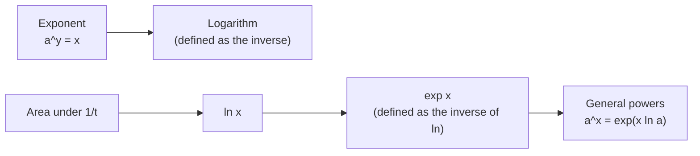

# The Inverted Canon

### An Intellectual History of the Logarithm from Celestial Kinematics to Analytic Rigor

*A Historical and Mathematical Exposition*

> [!abstract] Abstract
> Every student of elementary mathematics learns that a logarithm is fundamentally an exponent: $y = \log_a(x)$ is simply an alternative notation for $a^y = x$. Yet when students meet university-level calculus, this familiar definition is abruptly discarded. Instead, the natural logarithm is introduced as a definite integral:
> $$
> \ln(x) = \int_1^x \frac{1}{t}\,dt \quad (x > 0)
> $$
>
> from which the exponential function $e^x$ is recovered as a secondary construction, by functional inversion.
>
> This pedagogical reversal is often assumed to be a modern academic contrivance. In truth, the historical trajectory is the exact opposite of what high school algebra suggests. Logarithms were not derived from exponential functions; exponents as continuous operators did not yet exist when logarithms were created. Logarithms emerged from kinematic geometry, became the cornerstone of mechanical computation, solved the singular crisis of integral calculus, and were reconciled with exponentiation only by Leonhard Euler, more than a century later.
>
> This essay traces the chronicle of how a computational chore-saver became the bedrock of modern analysis.

## The Puzzle in One Picture

Two orders of logic compete for the same subject. The first is what high school teaches. The second is what a university analysis course does.

The top chain runs *exponent → logarithm*. The bottom chain runs *logarithm → exponent*. History, as we will see, ran along the bottom chain long before anyone could make it rigorous. The rest of this essay explains how that happened, and why mathematicians eventually chose to teach the bottom chain anyway.

---

## 1. The Computational Crisis of Renaissance Astronomy

At the close of the sixteenth century, European science stood at the threshold of a revolution. Tycho Brahe had compiled observational tables of planetary positions with unprecedented precision, and Johannes Kepler was laboring to decode the orbital mechanics of Mars.

Yet this empirical triumph precipitated an intellectual crisis: **astronomy was drowning in its own arithmetic.** Determining epicycles, eccentricities, and orbital planes required products, quotients, and square roots of seven- and eight-digit trigonometric quantities, such as:
$$
\sin(17^\circ 23' 14'') \times \cos(48^\circ 51' 02'')
$$
A single astronomical prediction demanded months of error-prone manual calculation, and a slip in the fourth decimal place could invalidate half a year's labor.

### The stopgap: prosthaphaeresis

Astronomers turned to a technique called **prosthaphaeresis** (from the Greek *prosthesis*, "addition", and *aphairesis*, "subtraction"), associated with Johannes Werner around 1510 and later used in Tycho's circle. It exploits a product-to-sum trigonometric identity:
$$
\cos\alpha\,\cos\beta = \tfrac{1}{2}\big[\cos(\alpha + \beta) + \cos(\alpha - \beta)\big]
$$
The recipe: scale the numbers so they lie in the range of cosines, look up their angles in a table, add and subtract the angles, look up the two resulting cosines, and average them. A multiplication has been traded for additions and table lookups.

> [!example]- Worked example: $0.4 \times 0.7$ by prosthaphaeresis
> 1. Look up angles: $\cos\alpha = 0.4 \Rightarrow \alpha \approx 66.42^\circ$, and $\cos\beta = 0.7 \Rightarrow \beta \approx 45.57^\circ$.
> 2. Add and subtract: $\alpha+\beta \approx 111.99^\circ$ and $\alpha-\beta \approx 20.85^\circ$.
> 3. Look up cosines: $\cos 111.99^\circ \approx -0.3744$ and $\cos 20.85^\circ \approx 0.9345$.
> 4. Average them: $\tfrac12(-0.3744 + 0.9345) \approx 0.2800$. ✓

The method was clumsy. It needed awkward scalings, worked only for quantities that could be recast as trigonometric ratios, and did nothing for division or square roots.

### The theoretical spark: Stifel's two rows

The key idea had already been documented in 1544 by the German monk and algebraist **Michael Stifel** in his *Arithmetica Integra*. Stifel placed an arithmetic progression directly above a geometric progression:

| **Arithmetic (additive)**      | −3  | −2  | −1  | 0   | 1   | 2   | 3   | 4   | 5   | 6   | 7   | 8   |
| ------------------------------ | --- | --- | --- | --- | --- | --- | --- | --- | --- | --- | --- | --- |
| **Geometric (multiplicative)** | 1/8 | 1/4 | 1/2 | 1   | 2   | 4   | 8   | 16  | 32  | 64  | 128 | 256 |

Stifel noticed the "marvelous rule": *adding* entries in the top row corresponds to *multiplying* entries in the bottom row.
$$
3 + 4 = 7 \iff 8 \times 16 = 128
$$
But the table was useless for practical calculation. Between 64 and 128 there is nothing, and real problems live in the gaps. To turn this algebraic curiosity into a universal computing engine, someone had to build a geometric progression whose ratio was so close to $1$ that no gaps remained.

> [!question]- Try it yourself
> Use Stifel's table to compute $32 \times \tfrac{1}{8}$ using only addition. (Find the exponents, add them, read the answer back off the bottom row.) Then find a product that *cannot* be done with this table, and notice why.

---

## 2. Napier's Kinematic Vision (1614)

That breakthrough came from **John Napier**, Eighth Laird of Merchiston in Scotland. Napier spent some two decades (roughly 1594 to 1614) working in near isolation. Modern algebraic notation did not exist: René Descartes would not popularize superscript exponents ($x^2, x^3$) until 1637. So Napier conceived the relation purely through **kinematics**, the geometry of motion.

In his 1614 masterpiece, *Mirifici Logarithmorum Canonis Descriptio* ("Description of the Wonderful Canon of Logarithms"), Napier coined the word *logarithm* from the Greek *logos* (proportion, ratio) and *arithmos* (number): literally, "the reckoning-number of a ratio."

### Two particles

Napier imagined two particles moving concurrently along two lines.

1. **Particle $L$ (the logarithmic particle)** moves along an infinite line at constant speed:
	$$
	\frac{dL}{dt} = c
	$$
	The distance it has traveled marks out an arithmetic progression ($0, 1, 2, 3, \dots$).
	
2. **Particle $G$ (the geometric particle)** starts at the beginning of a segment of length $R = 10^7$ and moves toward the far end, $0$. Its velocity at every instant is proportional to its *remaining* distance $x$:
	$$
	\frac{dx}{dt} = -k x
	$$
	As $x$ shrinks, $G$ decelerates continuously, sweeping through a geometric progression.

Napier set both initial speeds equal ($c = kR$). The distance traveled by $L$ was then *defined* as the **Napierian logarithm** of the distance $x$ remaining for $G$. In modern notation (which Napier anticipated, in spirit, by more than half a century):
$$
\frac{dL}{dx} = \frac{dL/dt}{dx/dt} = \frac{kR}{-kx} = -\frac{R}{x} \quad\Longrightarrow\quad L = R \ln\!\left(\frac{R}{x}\right)
$$
Because $L$ starts at $0$ when $G$ is at $R = 10^7$, we get $\operatorname{NapLog}(10^7) = 0$. As $x$ decreases toward $0$, its logarithm increases without bound.

> [!info] Napier's logarithm in modern terms
> $$
> \operatorname{NapLog}(x) = 10^7 \ln\frac{10^7}{x}
> $$
> This is a natural logarithm turned upside-down and scaled by $10^7$. Equivalently, it is a logarithm to base $1/e$. Napier never conceived of a "base" and never had the number $e$ in mind, but it is lurking in his definition. His **logarithms decrease** as numbers increase, and $\operatorname{NapLog}(1)$ is about $1.6 \times 10^8$.

### Filling Stifel's gaps

To bridge Stifel's gaps, Napier chose the scale radius $R = 10^7$ (so he could work with integers rather than decimals) and a common ratio infinitesimally less than unity:
$$
r = 1 - \frac{1}{10^7} = 0.9999999
$$
Over roughly twenty years of hand calculation, Napier built a set of interlocking auxiliary tables, and from them a main table of logarithms of *sines* at every minute of arc, comprising many thousands of entries. He controlled the error in each tiny interval using kinematic inequalities:
$$
R - x \;<\; \operatorname{NapLog}(x) \;<\; \frac{R(R - x)}{x}
$$
> [!note]- Why those bounds hold
> While $G$ travels from $R$ down to $x$, its speed lies between $kR$ (at the start, its maximum) and $kx$ (at the end, its minimum). Particle $L$ always moves at speed $kR$. Comparing the times taken:
> - if $G$ moved at its *maximum* speed the whole way, the trip would take at least $\frac{R-x}{kR}$, so $L$ covers at least $R - x$;
> - if $G$ moved at its *minimum* speed, the trip would take at most $\frac{R-x}{kx}$, so $L$ covers at most $\frac{R(R-x)}{x}$.
>
> It is a squeeze between two uniform motions, with no calculus required.

Because of the scale factor $R = 10^7$, Napier's logarithm does not satisfy our modern identity cleanly. It obeys instead:
$$
\operatorname{NapLog}\!\left(\frac{a \cdot b}{10^7}\right) = \operatorname{NapLog}(a) + \operatorname{NapLog}(b)
$$
> [!tip] Where is $e$ hiding?
> Multiply $1$ by the ratio $1 - 10^{-7}$ ten million times and you get roughly $1/e$. Napier's tables encode that fact without naming it. The first *printed* trace of the constant is a short table of natural logarithms in the appendix to Edward Wright's 1618 English translation of the *Descriptio*, probably written by William Oughtred. Napier's own account of *how* he built the tables, the *Constructio*, was published posthumously in 1619.

> [!info] A parallel invention
> Napier was not alone. The Swiss clockmaker **Jost Bürgi**, working at the imperial court in Prague, had independently built tables around 1600. He paired "red" numbers $0, 10, 20, \dots$ with "black" numbers $10^8(1.0001)^n$, and published them in 1620 without any explanation of the theory. Napier published first, and with a theory. History remembers the one with the theory.

---

## 3. Briggs and the Decimal Transformation (1615–1624)

When Napier's work reached London, **Henry Briggs**, professor of geometry at Gresham College, immediately recognized the magnitude of the discovery. He also spotted a practical flaw: having $\operatorname{NapLog}(10^7) = 0$ produced awkward scaling corrections in every multiplication and division.

Briggs traveled to Edinburgh in the summers of 1615 and 1616. According to a later account, the two men stood in silence for a quarter of an hour, each regarding the other with admiration, before either spoke. Together they agreed that the scale must be recalibrated so that:

1. $\log(1) = 0$
2. $\log(10) = 1$ (Briggs's printed tables used integers scaled by $10^{14}$ to avoid floating decimals).

Napier died in 1617, leaving Briggs to carry out the monumental task alone: constructing base-10 logarithms from scratch.

### Extracting roots, fifty-four times

Without calculus or power series, Briggs computed logarithms by **successive extraction of square roots**. Start from the known pair $\log_{10}1 = 0$ and $\log_{10}10 = 1$. Every square root *halves* the logarithm:

| $k$ | $10^{1/2^k}$ | $\log_{10}$ |
| --: | -----------: | ----------: |
|   0 |           10 |           1 |
|   1 |   3.16227766 |         0.5 |
|   2 |   1.77827941 |        0.25 |
|   3 |   1.33352143 |       0.125 |
|   4 |   1.15478198 |      0.0625 |
|   5 |   1.07460783 |     0.03125 |

Geometric means fill in the rest of the scale. For instance, $\sqrt{3.16227766 \times 10} \approx 5.62341325$ has logarithm $0.75$, and $\sqrt{1 \times 3.16227766} \approx 1.77827941$ has logarithm $0.25$.

Briggs carried out this square-root extraction **54 consecutive times**, working to roughly thirty decimal places, until the result was virtually indistinguishable from unity:
$$
10^{1/2^{54}} \approx 1 + 1.278 \times 10^{-16}
$$
> [!success] The shortcut that made it work
> Once you are that close to $1$, the logarithm becomes *proportional* to the excess. Here $\log_{10}$ of this number is exactly $2^{-54} \approx 5.55 \times 10^{-17}$, and
> $$
> \frac{5.55\times 10^{-17}}{1.278\times 10^{-16}} \approx 0.4343 = \log_{10} e
> $$
>
> That constant is the anchor. To find the logarithm of *any* number $a$, take 54 square roots of it, subtract 1, multiply by $0.4343$, and multiply back up by $2^{54}$:
> $$
> \log_{10} a \;\approx\; 2^{54}\cdot 0.4343\,\big(a^{1/2^{54}} - 1\big)
> $$
> 
> This is the limit $\ln a = \lim_{n\to\infty} n\,(a^{1/n}-1)$ evaluated at $n = 2^{54}$, three decades before anyone had the concept of a limit. Euler will reach the same formula in 1748.

From this anchor, Briggs used difference-based interpolation to populate his 1624 masterwork, ***Arithmetica Logarithmica***, which gave logarithms to **14 decimal places** for the integers $1$ to $20{,}000$ and $90{,}000$ to $100{,}000$. The gap was filled in 1628 by the Dutch publisher Adriaan Vlacq, whose edition covered every integer up to $100{,}000$.

### How a table is used

With Briggs's tables, modern logarithmic arithmetic was fully established:
$$
\log_{10}(ab) = \log_{10}a + \log_{10}b, \qquad \log_{10}\!\left(\frac{a}{b}\right) = \log_{10}a - \log_{10}b, \qquad \log_{10}(a^k) = k\log_{10}a
$$
Because $\log_{10}(10a) = 1 + \log_{10}a$, a table only needs the fractional part (the *mantissa*) for numbers between $1$ and $10$; the integer part (the *characteristic*) is read off from the position of the decimal point.

> [!example] Multiplying with a table: $3.7 \times 5.2$
> 1. Look up: $\log_{10}3.7 \approx 0.5682$ and $\log_{10}5.2 \approx 0.7160$.
> 2. Add: $0.5682 + 0.7160 = 1.2842$.
> 3. Reverse the lookup (the "antilog"): $10^{1.2842} \approx 19.24$.
>
> Check: $3.7 \times 5.2 = 19.24$ ✓. A multiplication became one addition and two lookups.

Kepler embraced logarithms enthusiastically (he even published his own logarithm tables in 1624) and leaned on them to complete his ***Rudolphine Tables*** (1627). His Third Law had been found without their help, in 1619, by pure labor. Later, the French mathematician Pierre-Simon Laplace is often quoted as saying that logarithms, by shortening the labors, *doubled the life of the astronomer*.

---

## 4. Logarithms as Physical Hardware: The Slide Rule

The commercial and scientific impact accelerated when logarithms moved from printed ink to physical hardware.

In 1620, the English astronomer **Edmund Gunter** (who also coined the terms *cosine* and *cotangent*) inscribed Briggs's logarithmic values directly onto a two-foot wooden rule, known as **Gunter's scale**. With a pair of compass dividers, an engineer could physically add the distance from $1$ to $a$ to the distance from $1$ to $b$, and then read the product $ab$ directly off the scale.

In the following years (Oughtred's earliest devices date from the 1620s; his book on the subject appeared in 1632), **William Oughtred**, better known today for introducing the $\times$ symbol, eliminated the dividers entirely. He placed two logarithmic rules face-to-face so that one could slide along the other. The **slide rule** was born.

> [!example] How a slide rule multiplies $2 \times 3$
> Each number is placed at a distance proportional to its logarithm from the left end. Slide the second rule so that its "1" sits under the "2" of the first. Now the "3" on the second rule sits at a distance $\log 2 + \log 3 = \log 6$ from the left end, so the first rule shows **6** directly above it. Addition of *lengths* has become multiplication of *numbers*.

For the next 340 years the slide rule was the universal analogue computer of the industrial and scientific world. It carried the calculations of Victorian steam engines and naval architecture, the Manhattan Project, and postwar aerospace. Apollo astronauts carried slide rules as backup for their onboard computer. Only in 1972, when the first pocket scientific calculator (the HP-35) arrived, did the ruler finally begin to slide out of use.

---

## 5. The Calculus Anomaly: The Singular Hyperbola (1647–1649)

While logarithms conquered applied calculation, early infinitesimal mathematics ran into a profound theoretical barrier. In the 1630s and 1640s, Bonaventura Cavalieri and Pierre de Fermat (and, a little later, John Wallis) derived the general rule for the *quadrature*, or area, under power curves. In modern notation:
$$
\int x^n \, dx = \frac{x^{n+1}}{n+1} + C
$$
This rule worked seamlessly for integers, negative powers, and rational fractions, with **one catastrophic exception**. At $n = -1$ the formula collapses into a division by zero:
$$
\int x^{-1} \, dx \;\overset{?}{=}\; \frac{x^0}{0} \quad\text{(undefined)}
$$
The rectangular hyperbola $y = \tfrac{1}{x}$ was an anomaly. Its area over any interval $[1, b]$ was clearly finite, smooth, and bounded, yet it could not be expressed by any known algebraic power. (Indeed, no combination of powers and roots has $1/x$ as its derivative.)

### Saint-Vincent's theorem (1647)

In 1647, the Belgian Jesuit **Grégoire de Saint-Vincent** published *Opus Geometricum*, a huge work whose headline claim, that it squared the circle, was wrong. Buried inside was something far more valuable: a proof, by pure geometry, that the areas under the hyperbola have a remarkable regularity.

> [!abstract] The Hyperbolic Quadrature Theorem (Saint-Vincent, 1647)
> If the coordinates along the horizontal axis increase in **geometric progression**,
> $$
> x_0 = 1,\quad x_1 = a,\quad x_2 = a^2,\quad x_3 = a^3,\quad \dots
> $$
>then the corresponding areas under $y = 1/t$ over the successive intervals $[x_k, x_{k+1}]$ are **exactly equal**:
> $$ 
> \text{Area}(1\to a) = \text{Area}(a \to a^2) = \text{Area}(a^2 \to a^3) = \cdots
> $$

A quick numerical picture, doubling at each step ($a = 2$):

| Interval | Area under $1/t$ |
|---|---|
| $[1, 2]$ | $0.6931\ldots$ |
| $[2, 4]$ | $0.6931\ldots$ |
| $[4, 8]$ | $0.6931\ldots$ |
| $[8, 16]$ | $0.6931\ldots$ |

Each doubling of $t$ adds the same slice of area. Equal *multiplicative* steps produce equal *additive* increments: the signature of a logarithm.

### Sarasa's insight (1649)

Two years later, Saint-Vincent's student and collaborator **Alphonse Antonio de Sarasa** drew the revolutionary corollary. In essence:

> [!quote] The corollary, paraphrased
> A function that turns geometric multiplication of its input into equal arithmetic additions of its output is, by definition, a logarithm.

Sarasa showed that the hyperbolic area function
$$
A(x) = \int_1^x \frac{1}{t}\,dt
$$
satisfies the core functional equation
$$
A(ab) = A(a) + A(b).
$$
For the first time, logarithms were divorced from astronomical tables and from arbitrary choices of base. Nature had embedded the logarithm directly in coordinate geometry as the area under the simplest singular curve in mathematics.

---

## 6. Mercator's Series and Bernoulli's Limit (1668–1683)

In 1668, the German mathematician **Nicolaus Mercator** (not to be confused with the mapmaker Gerardus Mercator) published ***Logarithmotechnia***. Instead of geometric exhaustion, Mercator tackled the hyperbola with algebraic series.

By applying long division to $\frac{1}{1+t}$, he obtained a geometric series:
$$
\frac{1}{1+t} = 1 - t + t^2 - t^3 + t^4 - \cdots
$$
Integrating term by term gave:
$$
\int_0^x \frac{1}{1+t}\,dt = x - \frac{x^2}{2} + \frac{x^3}{3} - \frac{x^4}{4} + \frac{x^5}{5} - \cdots
$$
Mercator called the result the **natural logarithm** (*logarithmus naturalis*). Unlike Briggs's base-10 system, which carries the arbitrary scaling factor $\log_{10}e \approx 0.43429$, Mercator's series contained no human-imposed constants. It emerged organically from the intrinsic geometry of polynomials.

> [!note] Practical footnotes on the series
> - The series converges only for $-1 < x \le 1$. At $x = 1$ it gives the alternating harmonic series $\ln 2 = 1 - \tfrac12 + \tfrac13 - \tfrac14 + \cdots$, which converges painfully slowly: thousands of terms for just a few digits.
> - The trick for computing serious tables was to use *small* $x$, or a companion series like $\ln\frac{1+x}{1-x} = 2\left(x + \frac{x^3}{3} + \frac{x^5}{5} + \cdots\right)$, which converges much faster.

A young **Isaac Newton** immediately adopted Mercator's technique. He wrote up his own treatment, *De Analysi per Aequationes Numero Terminorum Infinitas* (composed in 1669, circulated in manuscript, and not printed until 1711), and used the series to compute logarithms to more than fifty decimal places. He later admitted, with some embarrassment, how many digits he had pursued during the idle plague years.

### Bernoulli's limit (1683)

Fifteen years after Mercator, the Swiss mathematician **Jacob Bernoulli** met a seemingly unrelated problem in compound interest:

> [!question] Bernoulli's problem
> An account starts with one dollar and pays 100% annual interest. If the interest is compounded $n$ times per year, what is the balance after a year as compounding becomes instantaneous ($n \to \infty$)?

He studied the limit
$$
\lim_{n \to \infty} \left(1 + \frac{1}{n}\right)^n
$$
Using the binomial theorem, Bernoulli showed that the sequence does not diverge, but stays strictly between $2$ and $3$:
$$
\left(1 + \frac{1}{n}\right)^n = 1 + n\cdot\frac{1}{n} + \frac{n(n-1)}{2!}\cdot\frac{1}{n^2} + \cdots \;<\; 1 + 1 + \frac{1}{2!} + \frac{1}{3!} + \cdots \;<\; 3
$$

| Compounding frequency $n$ | $\left(1+\tfrac{1}{n}\right)^n$ |
| ------------------------: | ------------------------------: |
|                1 (yearly) |                         2.00000 |
|          2 (twice a year) |                         2.25000 |
|                        10 |                         2.59374 |
|                       100 |                         2.70481 |
|                     1,000 |                         2.71692 |
|                 1,000,000 |                         2.71828 |

Bernoulli established that the limit exists, but he did not recognize that this financial growth constant was precisely the base hiding inside Mercator's natural logarithm, and inside Napier's tables of 1614.

---

## 7. Euler's Grand Synthesis (1748)

By the early eighteenth century, mathematics possessed a disjointed collection of insights:

- Napier's and Briggs's tables of ratio-reckoning;
- Saint-Vincent's and Sarasa's area under the hyperbola $y = 1/x$;
- Mercator's alternating infinite power series;
- Bernoulli's compound-interest limit.

The genius who unified these threads was **Leonhard Euler**. In his 1748 treatise ***Introductio in analysin infinitorum***, Euler reorganized the conceptual hierarchy of mathematics.

### 7.1 The logarithm as functional inverse

Before Euler, the logarithm was a primary operational tool, while exponents were merely integer or fractional indices attached to a base. Euler inverted the relationship:

1. He defined the **exponential function** $y = a^x$ as the primary object.
2. He defined the **logarithm** strictly as its **inverse function**:
$$
y = a^x \iff x = \log_a y
$$
Euler denoted Bernoulli's constant by the letter **$e$** (the letter's origin is undocumented; "exponential" is the usual guess), computed it to at least 18 decimal places ($e \approx 2.718281828459045\ldots$), and demonstrated its equivalent representations:
$$
e = \lim_{n \to \infty} \left(1 + \frac{1}{n}\right)^n = \sum_{k=0}^\infty \frac{1}{k!} = 1 + 1 + \frac{1}{2} + \frac{1}{6} + \frac{1}{24} + \cdots
$$
> [!info] Euler's own route
> Euler worked with an *infinitely large* number $N$ (the language of the day). In that language:
> $$
> e^x = \left(1 + \frac{x}{N}\right)^N, \qquad \ln x = N\left(x^{1/N} - 1\right)
> $$
>
> The second formula is exactly Briggs's shortcut from Section 3, now promoted from a computational trick to a definition.

Euler showed that when $e$ is the base, the exponential function equals its own derivative:
$$
\frac{d}{dx} e^x = e^x
$$
By the inverse function theorem, the derivative of its inverse then follows automatically:
$$
\frac{d}{dx}\ln x = \frac{1}{x} \quad\Longrightarrow\quad \ln x = \int_1^x \frac{1}{t}\,dt \quad(\text{since } \ln 1 = 0)
$$
In a single stroke Euler united Saint-Vincent's hyperbolic area, Mercator's series, and Briggs's tables under one roof.

### 7.2 The negative-logarithm dispute and the complex plane

Euler's inverse perspective also resolved a fierce dispute between **Gottfried Wilhelm Leibniz** and **Johann Bernoulli** (Jacob's younger brother) over whether logarithms of negative numbers exist. As usually retold:

- **Bernoulli** argued that since $(-x)^2 = x^2$, taking logarithms gives $2\ln(-x) = 2\ln x$, hence $\ln(-x) = \ln x$. (His own argument rested on differentials: $d\ln(-x) = \frac{dx}{x} = d\ln x$.)
- **Leibniz** countered that if $\ln(-1) = 0$, then $-1 = e^0 = 1$, which is absurd. So $\ln(-x)$ must be an imaginary impossibility.

Euler settled the matter by working over the complex plane $\mathbb{C}$. (Roger Cotes had glimpsed the key relation in 1714, but Euler carried it through, and published the resolution of the controversy in 1749.) Expanding $e^{i\theta}$ into a power series yields **Euler's formula**:
$$
e^{i\theta} = \cos\theta + i\sin\theta
$$
From it, Euler showed that the complex logarithm is **infinitely multi-valued**:
$$
\ln z = \ln|z| + i\,(\operatorname{Arg} z + 2k\pi), \qquad k \in \mathbb{Z}
$$
Setting $z = -1$ (so $|z| = 1$ and $\operatorname{Arg} z = \pi$) gives
$$
\ln(-1) = i\pi(2k + 1).
$$
Both men were partly right and partly wrong. Leibniz was right that $\ln(-1) \neq 0$: none of its values is zero. Bernoulli's argument fails because *doubling* the equation destroys the information: $2\ln(-x)$ and $2\ln x$ differ by an odd multiple of $2\pi i$, and $2\pi i$ is exactly the ambiguity a complex logarithm carries.

Choosing the principal branch $k = 0$ gives $\ln(-1) = i\pi$, and thereby the celebrated identity that bears Euler's name (it follows at once from his formula, though it is rarely found in exactly this form in his writings):
$$
e^{i\pi} + 1 = 0
$$

---

## 8. Full Circle: Why Modern Analysis Inverts the Story

Having traced Euler's triumph, we return to the pedagogical question. Why do university calculus and analysis courses often abandon the "logarithm is an inverse exponent" definition of high school? Why do they revert to the integral of Saint-Vincent and Sarasa?

The answer lies in the **foundational rigor** movement of the nineteenth century, led by Augustin-Louis Cauchy, Karl Weierstrass, and Richard Dedekind: the effort to build calculus on the real numbers with no appeal to geometric intuition or infinitely large numbers.

### 8.1 The problem of irrational exponents

Consider the elementary definitions of exponentiation:

- For $n \in \mathbb{N}$: $a^n = \underbrace{a \times a \times \cdots \times a}_{n \text{ times}}$.
- For negative integers: $a^{-n} = \dfrac{1}{a^n}$.
- For rationals: $a^{p/q} = \sqrt[q]{a^p}$.

These definitions rely purely on elementary algebra. But what does $a^x$ mean when $x$ is irrational?
$$
2^{\sqrt{2}} \qquad\text{or}\qquad 10^{\pi}\ ?
$$
One cannot multiply a number by itself "$\sqrt{2}$ times", nor extract an irrational root.

To define $a^x$ for all real $x$ *without* calculus, one must:

1. choose rational numbers $r_n \to x$;
2. prove that the sequence $a^{r_n}$ converges;
3. prove the limit is independent of the chosen sequence;
4. verify that the resulting function is continuous, strictly monotonic, and differentiable.

Proving $\frac{d}{dx}(a^x) = a^x \ln a$ along this path is notoriously laborious. It also quietly requires the existence of the limit $\lim_{h\to 0}\frac{a^h - 1}{h}$, which is exactly $\ln a$ in disguise.

### 8.2 The analytic construction

Start instead with the definite integral, and the whole apparatus of continuous analysis is built in four short, self-contained steps.

**Step 1: define $\ln x$ by quadrature.**

Since $f(t) = 1/t$ is continuous on $(0,\infty)$, the Riemann integral exists on every interval $[1, x]$, and the Fundamental Theorem of Calculus gives its derivative:
$$
\ln x \;\equiv\; \int_1^x \frac{1}{t}\,dt \quad(x>0), \qquad \frac{d}{dx}\ln x = \frac{1}{x} > 0.
$$
Because its derivative is strictly positive, $\ln$ is smooth and strictly increasing on $(0,\infty)$.

**Step 2: prove the fundamental identity analytically.**

To prove $\ln(ab) = \ln a + \ln b$, split the integral at $a$:
$$
\ln(ab) = \int_1^{ab}\frac{dt}{t} = \int_1^{a}\frac{dt}{t} + \int_a^{ab}\frac{dt}{t} = \ln a + \int_a^{ab}\frac{dt}{t}
$$
Substitute $t = au$ (so $dt = a\,du$, with $u$ running from $1$ to $b$):
$$
\int_a^{ab}\frac{dt}{t} = \int_1^{b}\frac{a\,du}{au} = \int_1^{b}\frac{du}{u} = \ln b
$$
Hence
$$
\ln(ab) = \ln a + \ln b.
$$
The defining property of logarithms is proved in two lines of substitution, independent of any exponent rule. (This substitution *is* Saint-Vincent's theorem: the measure $dt/t$ is unchanged when $t$ is rescaled.)

**Step 3: invert to construct the exponential.**

The identity gives $\ln(2^n) = n\ln 2 \to \infty$ and $\ln(1/x) = -\ln x$, so $\ln$ is unbounded in both directions. Combined with continuity, its range is all of $(-\infty, \infty)$. Being strictly increasing, $\ln$ has a unique, strictly increasing, differentiable inverse:
$$
\exp : (-\infty, \infty) \to (0, \infty), \qquad \exp(x) = y \iff \ln y = x.
$$
Its derivative follows at once from the inverse function theorem:
$$
\frac{d}{dx}\exp(x) = \frac{1}{\ln'(\exp x)} = \frac{1}{1/\exp(x)} = \exp(x).
$$
**Step 4: define $e$ and general exponentiation.**

Euler's number is simply the unique real number whose logarithm is one:
$$
\ln e = 1 \iff e \equiv \exp(1).
$$
Finally, exponentiation for *any* real base $a>0$ and *any* real exponent $x$ is defined without limits of rational approximations:
$$
a^x \;\equiv\; \exp(x \ln a).
$$
The irrational power $2^{\sqrt{2}}$ is now unambiguous: it is $\exp(\sqrt{2}\,\ln 2)$, the value of a well-behaved continuous function.

> [!success] The payoff
> - **Consistency:** for integer $n$, the functional equation gives $\ln(a^n) = n\ln a$, so $\exp(n\ln a) = a^n$. The new definition agrees with the old one wherever the old one made sense. Also $\exp(x) = \exp(x\ln e) = e^x$.
> - **The derivative in one line**, by the chain rule:
> $$
> \frac{d}{dx}a^x = \frac{d}{dx}\exp(x\ln a) = \ln a\cdot\exp(x\ln a) = a^x\ln a
> $$
>
> The result that was laborious and near-circular in Section 8.1 falls out in a single line.

> [!note] Two rigorous roads
> The integral definition is not the only rigorous route. Some texts (Rudin, for one) define $\exp$ directly by its power series $\sum x^k/k!$ and obtain $\ln$ as the inverse. Others, such as Spivak and Apostol, follow the integral path described here. Both avoid the trap of irrational exponents; the integral route has the advantage of resting only on the Fundamental Theorem of Calculus.

---

## 9. Epilogue: The Arc of Mathematical Discovery

The story of the logarithm shows how mathematics evolves in practice. The path of human discovery rarely follows the neat deductive hierarchy presented in introductory classrooms.

| # | Chronological discovery | Conceptual epoch | Key figures |
|---:|---|---|---|
| 1 | Arithmetic interpolation | Kinematic progressions | Stifel (1544), Napier (1614) |
| 2 | Base-10 recalibration | Decimal roots | Briggs (1624) |
| 3 | Mechanical analogue | The slide rule | Gunter (1620), Oughtred (1630s) |
| 4 | Geometric quadrature | Area under the hyperbola | Saint-Vincent (1647), Sarasa (1649) |
| 5 | Power series | The natural logarithm | Mercator (1668), Newton |
| 6 | Compounding limit | The constant $e$ | Jacob Bernoulli (1683) |
| 7 | Functional inversion | Exponential as primary | Euler (1748) |
| 8 | Modern real analysis | The integral construction | Cauchy, Weierstrass, Dedekind (19th c.) |

Students first learn the *last-but-one* chapter of this story, Euler's intuitive functional inversion, because it is algebraically accessible. But when mathematics demands foundational rigor, it returns full circle to the geometric insight of 1649: the area under the rectangular hyperbola.

The logarithm was never just an algebraic trick for extracting exponents. It is a fundamental geometric invariant, the one function that turns *scaling* into *shifting*.

> [!tip] Key takeaways
> 1. **Logarithms came first; exponents came later.** Napier's logarithm (1614) predates any concept of a continuous exponential by well over a century.
> 2. **Computation drove the discovery.** Astronomy's arithmetic bottleneck created the demand, and Stifel's two rows supplied the idea.
> 3. **Geometry revealed the truth.** The area under $y = 1/x$ (1647–49) showed that the logarithm is intrinsic to coordinate geometry, independent of any base.
> 4. **Euler inverted the hierarchy** in 1748, making the exponential primary.
> 5. **Rigor re-inverted it.** Defining $\ln x = \int_1^x dt/t$ gives the cleanest, most self-contained foundation for exponentiation on the real numbers.

---

## Sources & Further Reading

- John Napier, *Mirifici Logarithmorum Canonis Descriptio* (1614) and *Mirifici Logarithmorum Canonis Constructio* (1619).
- Henry Briggs, *Arithmetica Logarithmica* (1624).
- Grégoire de Saint-Vincent, *Opus Geometricum* (1647); Alphonse Antonio de Sarasa's reply to Mersenne's problem (1649).
- Nicolaus Mercator, *Logarithmotechnia* (1668).
- Leonhard Euler, *Introductio in analysin infinitorum* (1748).
- Eli Maor, *e: The Story of a Number* (Princeton University Press, 1994): an accessible narrative of Napier through Euler.
- Victor J. Katz, *A History of Mathematics: An Introduction*.
- Florian Cajori, *History of the Logarithmic Slide Rule and Allied Instruments* (1909).
- Michael Spivak, *Calculus*, Chapter 18 ("The Logarithm and Exponential Functions"); Tom M. Apostol, *Calculus, Vol. 1*: textbook treatments that define $\ln$ via the integral.