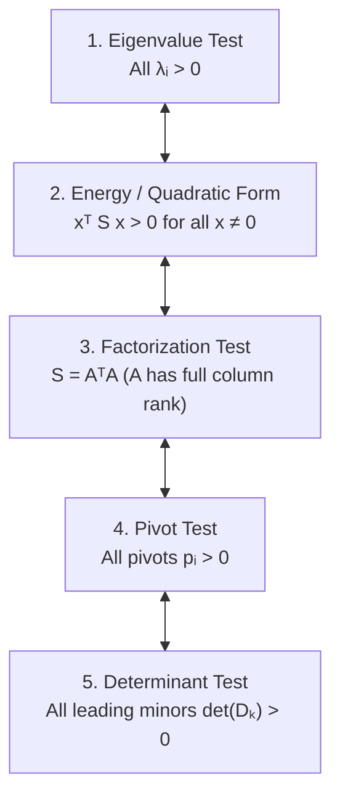

# Chapter 6: Eigenvalues and Eigenvectors

Linear algebra reaches its highest and most dynamic level in the study of **eigenvalues** ($\lambda$) and **eigenvectors** ($x$). While previous chapters focused on the static equilibrium problem $Ax = b$, eigenvalues and eigenvectors govern dynamic systems: matrix powers $A^k$ in discrete time (difference equations) and matrix exponentials $e^{At}$ in continuous time (differential equations). Eigenvectors reveal the natural coordinate axes along which a linear transformation acts merely by stretching or shrinking, decoupling complicated coupled systems into independent scalar equations.

---

# Appendix: Simplex Volume and Cavalieri's Principle (From Chapter 5)

> [!abstract] Problem Context: Corner Simplex vs. Schläfli Orthoscheme
> In the geometric study of determinants as volume forms in $\mathbb{R}^n$, an $n$-dimensional pyramid (simplex) can be formed in multiple ways within the unit hypercube $[0, 1]^n$:
> 1. **Standard Corner Simplex:** Formed by the origin $(0, 0, \dots, 0)$ and the $n$ standard basis vectors $e_1, e_2, \dots, e_n$.
> 2. **Schläfli Orthoscheme (Path Simplex):** Formed by following an orthogonal coordinate path along the edges of the unit cube from $(0, 0, \dots, 0)$ to $(1, 1, \dots, 1)$. The unit cube decomposes into exactly $n!$ such congruent orthoschemes, corresponding to the $n!$ orderings of coordinates $0 \le x_{\pi(1)} \le x_{\pi(2)} \le \dots \le x_{\pi(n)} \le 1$.

> [!figure] Figure Placeholder: Figure 6.0A - Standard Simplex vs. Schläfli Orthoscheme in the 3D Unit Cube
> *A 3D unit cube $[0, 1]^3$ illustrating two distinct polytopes:*
> *(Left) The standard corner simplex with vertices at $(0,0,0)$, $(1,0,0)$, $(0,1,0)$, and $(0,0,1)$, occupying a single corner of the cube.*
> *(Right) The Schläfli path orthoscheme along the main diagonal, connecting $(0,0,0) \to (1,0,0) \to (1,1,0) \to (1,1,1)$. Although stretched diagonally across the cube, its volume is identical to the corner simplex ($V = \frac{1}{6}$).*

## Volume Invariance via Cavalieri's Principle

Although the standard corner simplex and the Schläfli path orthoscheme have completely different exterior shapes, their volumes are strictly equal:
$$
\operatorname{Vol}(S_n) = \frac{1}{n!} \operatorname{Vol}(\text{Cube}) = \frac{1}{n!}
$$

### Geometric Proof via Base and Height
For $n = 3$:
- **Standard Corner Simplex:**
  - Base: Right triangle in the $xy$-plane with vertices $(0,0,0)$, $(1,0,0)$, and $(0,1,0)$.
    $$
    \text{Base Area} = \frac{1}{2}(1 \cdot 1) = \frac{1}{2}
    $$
  - Height: Measured along the $z$-axis from $z = 0$ to $(0,0,1)$, so $h = 1$.
  - Volume:
    $$
    V = \frac{1}{3} \times \text{Base Area} \times h = \frac{1}{3} \left(\frac{1}{2}\right)(1) = \frac{1}{6}
    $$

- **Schläfli Orthoscheme:**
  - Base: Right triangle formed by $(0,0,0)$, $(1,0,0)$, and $(1,1,0)$.
    $$
    \text{Base Area} = \frac{1}{2}(1 \cdot 1) = \frac{1}{2}
    $$
  - Height: The vertical displacement to $(1,1,1)$ is $h = 1$.
  - Volume:
    $$
    V = \frac{1}{3} \times \text{Base Area} \times h = \frac{1}{3} \left(\frac{1}{2}\right)(1) = \frac{1}{6}
    $$

> [!figure] Figure Placeholder: Figure 6.0B - Cavalieri's Principle for Triangles and Pyramids under Shear
> *Two parallel horizontal lines separated by vertical distance $h$. Multiple triangles share the exact same base $b$ along the bottom line, with their third vertex positioned at various points along the top parallel line. Every horizontal slice at height $z$ has identical width, proving that shear transformations preserve area.*

### Cavalieri's Principle
> [!theorem] Cavalieri's Principle
> If two solids in $n$-dimensional space have equal $(n-1)$-dimensional cross-sectional measures at every parallel slicing plane at height $z \in [0, h]$, then both solids have identical $n$-dimensional volume:
> $$
> \operatorname{Vol}(S) = \int_0^h A(z) \, dz
> $$

Moving the apex (the $4^{\text{th}}$ vertex) of a pyramid parallel to its base plane does not alter its height or its cross-sectional area slices $A(z)$. Consequently, shearing the pyramid preserves its determinant and volume.

---

# 6.1 Introduction to Eigenvalues and Eigenvectors

## Fundamental Definitions and Geometric Meaning

> [!abstract] Definition: Eigenvalues and Eigenvectors
> Let $A$ be an $n \times n$ square matrix. A non-zero vector $x \in \mathbb{C}^n$ (or $\mathbb{R}^n$) is called an **eigenvector** of $A$ if multiplying $x$ by $A$ produces a vector parallel to $x$:
> $$
> Ax = \lambda x \quad (x \ne 0)
> $$
> The scalar factor $\lambda$ is called the **eigenvalue** corresponding to the eigenvector $x$.

> [!figure] Figure Placeholder: Figure 6.1 - Geometric Action of Matrix Multiplication on Eigenvectors vs. Generic Vectors
> *In $\mathbb{R}^2$, a generic vector $v$ multiplied by $A$ rotates and changes length ($Av$ points in a different direction). In contrast, an eigenvector $x_1$ lies along a line invariant under $A$: $Ax_1 = \lambda_1 x_1$ scales along the line by factor $\lambda_1$. Similarly, $x_2$ scales by factor $\lambda_2$. The coordinate axes defined by the eigenvectors diagonalize the action of $A$.*

### Key Observations
1. **Direction Invariance:** Most vectors change direction when multiplied by $A$. An eigenvector $x$ maintains its direction (or reverses direction if $\lambda < 0$).
2. **Eigenvector Lines (Eigenspaces):** If $x$ is an eigenvector of $A$, then every non-zero scalar multiple $c x$ ($c \ne 0$) is also an eigenvector with the same eigenvalue $\lambda$:
   $$
   A(cx) = c(Ax) = c(\lambda x) = \lambda (cx)
   $$
   The set of all solutions to $(A - \lambda I)x = 0$ (including the zero vector) forms a subspace of $\mathbb{C}^n$ known as the **eigenspace** $E_\lambda = N(A - \lambda I)$.

## Five Core Properties of Eigenvalues and Eigenvectors

### Property 1: Powers of a Matrix ($A^k$)
If $x$ is an eigenvector of $A$ with eigenvalue $\lambda$, then $x$ is an eigenvector of every power $A^k$ ($k \in \mathbb{N}$) with eigenvalue $\lambda^k$:
$$
A^k x = \lambda^k x
$$

**Proof:**
We proceed by mathematical induction. For $k = 1$, $Ax = \lambda x$ holds by definition. Assuming $A^k x = \lambda^k x$, multiply on the left by $A$:
$$
A^{k+1} x = A(A^k x) = A(\lambda^k x) = \lambda^k (Ax) = \lambda^k (\lambda x) = \lambda^{k+1} x
$$
By induction, the property holds for all positive integers $k$.

> [!note] Extension to Inverses and Polynomials
> - If $A$ is invertible, $\lambda \ne 0$, and multiplying by $A^{-1}$ yields:
>   $$
>   A^{-1} x = \frac{1}{\lambda} x
>   $$
> - For any matrix polynomial $p(A) = c_m A^m + \dots + c_1 A + c_0 I$:
>   $$
>   p(A)x = p(\lambda)x
>   $$

### Property 2: The Characteristic Equation and Polynomial
To find the eigenvalues of an $n \times n$ matrix $A$, rewrite the fundamental equation:
$$
Ax = \lambda x \iff (A - \lambda I)x = 0
$$
For a non-zero solution $x \ne 0$ to exist, the nullspace $N(A - \lambda I)$ must contain non-trivial vectors. This requires the matrix $(A - \lambda I)$ to be singular:
$$
\det(A - \lambda I) = 0
$$

> [!abstract] Definition: Characteristic Polynomial
> The determinant $p(\lambda) = \det(A - \lambda I)$ is a polynomial in $\lambda$ of degree $n$, called the **characteristic polynomial** of $A$. The roots of the characteristic equation $p(\lambda) = 0$ are precisely the eigenvalues of $A$.

By the **Fundamental Theorem of Algebra**, an $n^{\text{th}}$-degree polynomial with complex coefficients has exactly $n$ roots in $\mathbb{C}$, counted with their algebraic multiplicities:
$$
\det(A - \lambda I) = (-1)^n (\lambda - \lambda_1)(\lambda - \lambda_2)\cdots(\lambda - \lambda_n) = 0
$$

### Property 3: Diagonal Shift ($A - kI$)
Subtracting a scalar multiple of the identity matrix shifts every eigenvalue by $k$ while leaving all eigenvectors completely unchanged.

> [!theorem] Diagonal Shift Theorem
> If $A$ has eigenvalue $\lambda$ with eigenvector $x$, then $(A - kI)$ has eigenvalue $(\lambda - k)$ with the exact same eigenvector $x$.

**Proof:**
Using the fact that every non-zero vector is an eigenvector of the identity matrix ($Ix = x$):
\begin{align}
(A - kI)x &= Ax - kIx \\
&= \lambda x - kx \\
&= (\lambda - k)x
\end{align}
Thus, $(A - kI)x = (\lambda - k)x$.

> [!tip] Invariance of Eigenvectors
> Shifting the diagonal elements of a matrix modifies its eigenvalues in a simple linear fashion ($\lambda \to \lambda - k$) but leaves the eigenspaces intact:
> $$
> N(A - \lambda I) = N\big((A - kI) - (\lambda - k)I\big)
> $$

### Property 4: Singular Matrices and Zero Eigenvalues
A matrix $A$ is singular if and only if $\lambda = 0$ is an eigenvalue of $A$.

**Proof:**
$A$ is singular $\iff \det(A) = 0$. From the characteristic equation evaluated at $\lambda = 0$:
$$
\det(A - 0 \cdot I) = \det(A) = 0
$$
Equivalently, singularity implies $N(A) \ne \{0\}$, so there exists $x \ne 0$ such that:
$$
Ax = 0 = 0 \cdot x
$$
Thus, every non-zero vector in the nullspace $N(A)$ is an eigenvector of $A$ corresponding to $\lambda = 0$.

> [!note] Eigenspace Dimension for $\lambda = 0$
> If $\operatorname{rank}(A) = r$, the Rank-Nullity Theorem establishes that:
> $$
> \dim N(A) = n - r
> $$
> Therefore, $A$ possesses exactly $n - r$ linearly independent eigenvectors corresponding to the eigenvalue $\lambda = 0$.

### Property 5: Finding Eigenvectors
Once an eigenvalue $\lambda_i$ is determined by solving $\det(A - \lambda I) = 0$, its corresponding eigenvector(s) are obtained by finding a basis for the nullspace of the shifted matrix:
$$
(A - \lambda_i I)x_i = 0
$$
This is solved by applying standard Gaussian elimination to $(A - \lambda_i I)$.

## Determinant and Trace in Terms of Eigenvalues

### Theorem: The Determinant is the Product of Eigenvalues
> [!theorem] Product of Eigenvalues Formula
> For any $n \times n$ matrix $A$ with eigenvalues $\lambda_1, \lambda_2, \dots, \lambda_n$:
> $$
> \det(A) = \prod_{i=1}^n \lambda_i = \lambda_1 \lambda_2 \cdots \lambda_n
> $$

**Proof (via the Factor Theorem):**
The characteristic polynomial $p(\lambda) = \det(A - \lambda I)$ has degree $n$ and leading term $(-1)^n \lambda^n$. Over the complex numbers, it factors completely into linear factors:
$$
\det(A - \lambda I) = (-1)^n (\lambda - \lambda_1)(\lambda - \lambda_2)\cdots(\lambda - \lambda_n)
$$
Evaluating this identity at $\lambda = 0$:
\begin{align}
\det(A - 0 \cdot I) &= (-1)^n (0 - \lambda_1)(0 - \lambda_2)\cdots(0 - \lambda_n) \\
\det(A) &= (-1)^n (-\lambda_1)(-\lambda_2)\cdots(-\lambda_n) \\
&= (-1)^n (-1)^n (\lambda_1 \lambda_2 \cdots \lambda_n) \\
&= (-1)^{2n} \prod_{i=1}^n \lambda_i
\end{align}
Since $(-1)^{2n} = ((-1)^2)^n = 1^n = 1$, we obtain:
$$
\det(A) = \prod_{i=1}^n \lambda_i
$$

### Theorem: The Trace is the Sum of Eigenvalues
> [!abstract] Definition: Trace of a Matrix
> The **trace** of an $n \times n$ matrix $A$, denoted $\operatorname{tr}(A)$, is the sum of the entries on its main diagonal:
> $$
> \operatorname{tr}(A) = \sum_{i=1}^n a_{ii} = a_{11} + a_{22} + \dots + a_{nn}
> $$

> [!theorem] Sum of Eigenvalues Formula
> For any $n \times n$ matrix $A$ with eigenvalues $\lambda_1, \lambda_2, \dots, \lambda_n$:
> $$
> \operatorname{tr}(A) = \sum_{i=1}^n \lambda_i = \lambda_1 + \lambda_2 + \dots + \lambda_n
> $$

**Proof:**
We equate the coefficients of $\lambda^{n-1}$ obtained from two different expansions of $\det(A - \lambda I)$:

1. **From the factored characteristic polynomial:**
   $$
   \det(A - \lambda I) = (-1)^n (\lambda - \lambda_1)(\lambda - \lambda_2)\cdots(\lambda - \lambda_n)
   $$
   Expanding the product, the coefficient of $\lambda^{n-1}$ is obtained by choosing $\lambda$ from $(n-1)$ factors and $(-\lambda_i)$ from the remaining factor:
   $$
   \prod_{i=1}^n (\lambda - \lambda_i) = \lambda^n - \left(\sum_{i=1}^n \lambda_i\right) \lambda^{n-1} + \dots + (-1)^n \prod_{i=1}^n \lambda_i
   $$
   Multiplying by $(-1)^n$:
   $$
   \text{Coefficient of } \lambda^{n-1} = (-1)^n \left( - \sum_{i=1}^n \lambda_i \right) = (-1)^{n+1} \sum_{i=1}^n \lambda_i = (-1)^{n-1} \sum_{i=1}^n \lambda_i
   $$

2. **From the Leibniz ("Big") Formula for the Determinant:**
   $$
   \det(A - \lambda I) = \begin{vmatrix}
   a_{11} - \lambda & a_{12} & \cdots & a_{1n} \\
   a_{21} & a_{22} - \lambda & \cdots & a_{2n} \\
   \vdots & \vdots & \ddots & \vdots \\
   a_{n1} & a_{n2} & \cdots & a_{nn} - \lambda
   \end{vmatrix}
   $$
   The determinant is a sum of $n!$ permutation products. The only permutation product containing more than $(n-2)$ diagonal entries is the main diagonal product:
   $$
   (a_{11} - \lambda)(a_{22} - \lambda)\cdots(a_{nn} - \lambda)
   $$
   Every other permutation involves at least two off-diagonal entries, contributing terms of degree at most $\lambda^{n-2}$. Expanding the diagonal product:
   \begin{align}
   \prod_{i=1}^n (a_{ii} - \lambda) &= (-\lambda)^n + (-\lambda)^{n-1} \sum_{i=1}^n a_{ii} + \mathcal{O}(\lambda^{n-2}) \\
   &= (-1)^n \lambda^n + (-1)^{n-1} \left(\sum_{i=1}^n a_{ii}\right) \lambda^{n-1} + \mathcal{O}(\lambda^{n-2})
   \end{align}
   Thus, the coefficient of $\lambda^{n-1}$ from the determinant expansion is:
   $$
   \text{Coefficient of } \lambda^{n-1} = (-1)^{n-1} \sum_{i=1}^n a_{ii}
   $$

Equating the two expressions for the coefficient of $\lambda^{n-1}$:
$$
(-1)^{n-1} \sum_{i=1}^n \lambda_i = (-1)^{n-1} \sum_{i=1}^n a_{ii} \implies \sum_{i=1}^n \lambda_i = \sum_{i=1}^n a_{ii} = \operatorname{tr}(A)
$$

> [!warning] Correction in Handwritten Notes
> On Page 3 (bottom right), the handwritten notes contain a slight transcription error:
> $$
> \text{coeff of } \lambda^{n-1} = (-1)^n (-(\lambda_1 + \dots + \lambda_n)\lambda)
> $$
> An extra factor of $\lambda$ was erroneously included inside the coefficient expression. On Page 4 (top left), this was properly rectified to:
> $$
> \text{coeff of } \lambda^{n-1} = (-1)^{n-1} \sum_{i=1}^n \lambda_i \quad (\text{since } (-1)^{n+1} = (-1)^{n-1})
> $$

## Commuting Matrices and Eigenvalues of $AB$ and $A + B$

### The Fallacy of Naive Addition and Multiplication
In general, if $\lambda$ is an eigenvalue of $A$ and $\beta$ is an eigenvalue of $B$:
- $\lambda + \beta$ is **not** necessarily an eigenvalue of $A + B$.
- $\lambda \beta$ is **not** necessarily an eigenvalue of $AB$.

**Why the naive argument fails:**
If $Ax = \lambda x$ and $Bx = \beta x$, then:
$$
(AB)x = A(Bx) = A(\beta x) = \beta (Ax) = \lambda \beta x
$$
This derivation is valid **only if** $x$ is a simultaneous eigenvector of both $A$ and $B$. In general, the eigenvectors of $A$ are completely different from the eigenvectors of $B$, so $Bx$ does not point along $x$, and $A(Bx)$ cannot be simplified to $\lambda(Bx)$.

### Theorem: Commuting Matrices Share Eigenvectors
> [!theorem] Commuting Matrices Theorem
> Two diagonalizable matrices $A$ and $B$ commute ($AB = BA$) if and only if they share a common set of $n$ linearly independent eigenvectors.

#### Proof: Part 1 (Shared Eigenvectors $\implies AB = BA$)
Assume $A$ and $B$ share a common basis of eigenvectors $\{x_1, x_2, \dots, x_n\}$ such that $Ax_i = \lambda_i x_i$ and $Bx_i = \beta_i x_i$ for each $i = 1, \dots, n$.

1. For each basis vector $x_i$:
   \begin{align}
   (AB)x_i &= A(Bx_i) = A(\beta_i x_i) = \beta_i (Ax_i) = \beta_i \lambda_i x_i = \lambda_i \beta_i x_i \\
   (BA)x_i &= B(Ax_i) = B(\lambda_i x_i) = \lambda_i (Bx_i) = \lambda_i \beta_i x_i
   \end{align}
   Hence, $(AB)x_i = (BA)x_i$, which implies $(AB - BA)x_i = 0$ for all $i = 1, \dots, n$.
2. Since $\{x_1, \dots, x_n\}$ spans $\mathbb{R}^n$, any arbitrary vector $y \in \mathbb{R}^n$ can be expressed as $y = \sum_{i=1}^n c_i x_i$. By linearity:
   $$
   (AB - BA)y = (AB - BA)\left(\sum_{i=1}^n c_i x_i\right) = \sum_{i=1}^n c_i (AB - BA)x_i = 0
   $$
3. Because $(AB - BA)y = 0$ for all $y \in \mathbb{R}^n$, the nullspace is the entire space:
   $$
   N(AB - BA) = \mathbb{R}^n \implies AB - BA = 0 \implies AB = BA
   $$

#### Proof: Part 2 ($AB = BA \implies$ Shared Eigenvectors)
Assume $AB = BA$. Let $v$ be an eigenvector of $A$ with eigenvalue $\lambda$, so $Av = \lambda v$.
Multiply by $B$ and commute:
$$
A(Bv) = (AB)v = (BA)v = B(Av) = B(\lambda v) = \lambda (Bv)
$$
This reveals that $Bv$ is also an eigenvector of $A$ with the same eigenvalue $\lambda$ (or $Bv = 0$).

- **Case 1: Distinct Eigenvalues (1-Dimensional Eigenspaces):**
  If $\lambda$ is a non-repeated eigenvalue of $A$, its eigenspace $E_\lambda = N(A - \lambda I)$ is a 1-dimensional line spanned by $v$. Since $Bv \in E_\lambda$, $Bv$ must be a scalar multiple of $v$:
  $$
  Bv = \beta v
  $$
  Thus, $v$ is an eigenvector of $B$ with eigenvalue $\beta$.
- **Case 2: Repeated Eigenvalues (Multi-Dimensional Eigenspaces):**
  If $\lambda$ has multiplicity $k > 1$, its eigenspace $E_\lambda$ has dimension $k$.
  - For every $v \in E_\lambda$, $Bv \in E_\lambda$. Therefore, $E_\lambda$ is an **invariant subspace** under $B$.
  - Since $B$ is diagonalizable, its restriction $B|_{E_\lambda}$ is diagonalizable within $E_\lambda$.
  - We can therefore select a basis for $E_\lambda$ consisting of vectors that are simultaneous eigenvectors of $B$. Repeating this for each eigenspace yields a complete basis of $n$ shared eigenvectors.

## Problem Set 6.1 Solutions

### Problem 3: Eigenvalues of the Inverse Matrix $A^{-1}$
**Statement:** Let $A$ be an invertible matrix ($Ax = \lambda x$ with $x \ne 0$). Determine the eigenvalues and eigenvectors of $A^{-1}$.

**Solution:**
Since $A$ is invertible, $\det(A) \ne 0$, which implies all eigenvalues are non-zero ($\lambda \ne 0$). Multiply $Ax = \lambda x$ on the left by $A^{-1}$:
$$
A^{-1}(Ax) = A^{-1}(\lambda x)
$$
Using associativity and linearity:
$$
Ix = \lambda (A^{-1} x) \implies x = \lambda (A^{-1} x)
$$
Dividing by the scalar $\lambda \ne 0$:
$$
A^{-1} x = \frac{1}{\lambda} x
$$

> [!summary] Conclusion
> $x$ is an eigenvector of $A^{-1}$ with corresponding eigenvalue $\frac{1}{\lambda}$. The eigenvectors of $A$ and $A^{-1}$ are identical.

### Problem 11: Columns of $(A - \lambda_1 I)$ for $2 \times 2$ Matrices
**Fact:** For a $2 \times 2$ matrix $A$ with distinct eigenvalues $\lambda_1 \ne \lambda_2$, explain why the columns of $(A - \lambda_1 I)$ are exact multiples of the eigenvector $x_2$.

#### Solution 1: Via the Column Space
Evaluate the matrix $(A - \lambda_1 I)$ acting on the second eigenvector $x_2$:
$$
(A - \lambda_1 I)x_2 = Ax_2 - \lambda_1 x_2 = \lambda_2 x_2 - \lambda_1 x_2 = (\lambda_2 - \lambda_1)x_2
$$
Because $\lambda_1 \ne \lambda_2$, the scalar factor $(\lambda_2 - \lambda_1) \ne 0$. Solving for $x_2$:
$$
x_2 = \frac{1}{\lambda_2 - \lambda_1} (A - \lambda_1 I)x_2
$$
This proves that $x_2$ lies in the column space $C(A - \lambda_1 I)$. Since $\det(A - \lambda_1 I) = 0$ and $A - \lambda_1 I \ne 0$, its column space is 1-dimensional. Therefore, every column of $(A - \lambda_1 I)$ must be a scalar multiple of $x_2$.

#### Solution 2: Via the Cayley-Hamilton Theorem
The characteristic polynomial of $A$ is $p(\lambda) = (\lambda - \lambda_1)(\lambda - \lambda_2)$. By the Cayley-Hamilton theorem:
$$
(A - \lambda_2 I)(A - \lambda_1 I) = 0
$$
For every column $c_j$ of $(A - \lambda_1 I)$:
$$
(A - \lambda_2 I) c_j = 0 \implies c_j \in N(A - \lambda_2 I)
$$
Because $\lambda_2$ has multiplicity 1, the nullspace $N(A - \lambda_2 I)$ is 1-dimensional and spanned by $x_2$. Hence, every column $c_j$ is a scalar multiple of $x_2$.

### Problem 19: Spectral Properties of a $3 \times 3$ Matrix with Eigenvalues $0, 1, 2$
Let $B$ be a $3 \times 3$ matrix with eigenvalues $\lambda = 0, 1, 2$.

1. **The rank of $B$:**
   Because all three eigenvalues are distinct, $B$ is diagonalizable. The number of non-zero eigenvalues equals the rank of the matrix:
   $$
   \operatorname{rank}(B) = 2
   $$
   The zero eigenvalue contributes a 1-dimensional nullspace ($n - r = 3 - 2 = 1$).

2. **The determinant of $B^T B$:**
   Using the multiplicative property of determinants:
   $$
   \det(B^T B) = \det(B^T) \det(B) = (\det B)^2
   $$
   Since $\det(B) = 0 \cdot 1 \cdot 2 = 0$:
   $$
   \det(B^T B) = 0^2 = 0
   $$

3. **The eigenvalues of $B^T B$:**
   **Cannot be determined from the eigenvalues of $B$ alone.**
   The eigenvalues of $B^T B$ are the squares of the singular values $\sigma_i^2$. Unless $B$ is symmetric or normal ($B B^T = B^T B$), the singular values depend on the specific entries and geometry of the column vectors of $B$, not just its eigenvalues.

4. **The eigenvalues of $(B^2 + I)^{-1}$:**
   By the spectral mapping property, if $\lambda$ is an eigenvalue of $B$, then $f(\lambda) = \frac{1}{\lambda^2 + 1}$ is an eigenvalue of $f(B) = (B^2 + I)^{-1}$:
   - For $\lambda_1 = 0 \implies \frac{1}{0^2 + 1} = 1$
   - For $\lambda_2 = 1 \implies \frac{1}{1^2 + 1} = \frac{1}{2}$
   - For $\lambda_3 = 2 \implies \frac{1}{2^2 + 1} = \frac{1}{5}$
   The eigenvalues are $1, \frac{1}{2}, \frac{1}{5}$.

### Problem 20: Equivalence of Eigenvalues of $A$ and $A^T$
**Statement:** Prove that $A$ and $A^T$ have the exact same eigenvalues.

**Proof:**
A scalar $\lambda$ is an eigenvalue of $A$ if and only if $\det(A - \lambda I) = 0$. Using the determinant identity $\det(M) = \det(M^T)$:
$$
\det(A^T - \lambda I) = \det\big((A - \lambda I)^T\big) = \det(A - \lambda I)
$$
Because $A$ and $A^T$ possess the exact same characteristic polynomial, their roots—the eigenvalues—are identical.

---

# 6.2 Diagonalizing a Matrix

## The Diagonalization Theorem: $AS = S\Lambda$

Suppose an $n \times n$ matrix $A$ has $n$ linearly independent eigenvectors $x_1, x_2, \dots, x_n$ with corresponding eigenvalues $\lambda_1, \lambda_2, \dots, \lambda_n$.

Form the **eigenvector matrix** $S$ by placing the eigenvectors into its columns:
$$
S = \begin{bmatrix}
| & | & & | \\
x_1 & x_2 & \cdots & x_n \\
| & | & & |
\end{bmatrix}
$$
Because the eigenvectors are linearly independent, the columns of $S$ form a basis for $\mathbb{C}^n$, and $S$ is invertible.

Multiplying $A$ by $S$ column-by-column:
\begin{align}
AS &= A \begin{bmatrix} x_1 & x_2 & \cdots & x_n \end{bmatrix} \\
&= \begin{bmatrix} Ax_1 & Ax_2 & \cdots & Ax_n \end{bmatrix} \\
&= \begin{bmatrix} \lambda_1 x_1 & \lambda_2 x_2 & \cdots & \lambda_n x_n \end{bmatrix}
\end{align}
This resulting matrix can be factored as the product of $S$ and a diagonal eigenvalue matrix $\Lambda$:
$$
\begin{bmatrix} \lambda_1 x_1 & \cdots & \lambda_n x_n \end{bmatrix} = \begin{bmatrix} x_1 & \cdots & x_n \end{bmatrix} \begin{bmatrix}
\lambda_1 & 0 & \cdots & 0 \\
0 & \lambda_2 & \cdots & 0 \\
\vdots & \vdots & \ddots & \vdots \\
0 & 0 & \cdots & \lambda_n
\end{bmatrix}
$$
This establishes the fundamental equation:
$$
AS = S\Lambda
$$

> [!figure] Figure Placeholder: Figure 6.2 - Diagonalization as a Change of Basis to the Eigenvector Coordinate System
> *Commutative diagram showing the diagonalization process:*
> *Top horizontal arrow: multiplication by $A$ in the standard basis ($u \to Au$).*
> *Left vertical arrow: change of basis $S^{-1}$ transforming coordinates from standard basis to eigenvector coordinates ($c = S^{-1}u$).*
> *Bottom horizontal arrow: multiplication by diagonal matrix $\Lambda$, which simply scales each coordinate independently ($c \to \Lambda c$).*
> *Right vertical arrow: change of basis $S$ returning coordinates to standard basis ($S(\Lambda c) = Au$).*

### Canonical Factorization Formulas
Multiplying $AS = S\Lambda$ on the left or right by $S^{-1}$:
1. **Factorization Form:**
   $$
   A = S \Lambda S^{-1}
   $$
2. **Diagonalized Form:**
   $$
   S^{-1} A S = \Lambda
   $$

### Computation of Matrix Powers ($A^k$)
The factorization $A = S \Lambda S^{-1}$ provides the fastest and most elegant method for computing matrix powers:
\begin{align}
A^k &= (S \Lambda S^{-1})(S \Lambda S^{-1})\cdots(S \Lambda S^{-1}) \\
&= S \Lambda (S^{-1} S) \Lambda (S^{-1} S) \cdots \Lambda S^{-1} \\
&= S \Lambda^k S^{-1}
\end{align}
Because $\Lambda$ is diagonal, raising it to power $k$ simply raises each diagonal entry:
$$
\Lambda^k = \begin{bmatrix}
\lambda_1^k & 0 & \cdots & 0 \\
0 & \lambda_2^k & \cdots & 0 \\
\vdots & \vdots & \ddots & \vdots \\
0 & 0 & \cdots & \lambda_n^k
\end{bmatrix}
$$

## Conditions for Diagonalizability

> [!theorem] Fundamental Diagonalizability Criterion
> An $n \times n$ matrix $A$ is diagonalizable **if and only if** it has $n$ linearly independent eigenvectors.

### Case 1: Distinct Eigenvalues
> [!theorem] Distinct Eigenvalues Guarantee Diagonalizability
> If the characteristic polynomial $\det(A - \lambda I) = 0$ has $n$ distinct roots $\lambda_1 \ne \lambda_2 \ne \dots \ne \lambda_n$, then the corresponding eigenvectors $x_1, x_2, \dots, x_n$ are automatically linearly independent, and $A$ is guaranteed to be diagonalizable.

**Proof of Linear Independence:**
Assume for contradiction that eigenvectors $x_1, \dots, x_n$ corresponding to distinct eigenvalues $\lambda_1, \dots, \lambda_n$ are linearly dependent. Consider a non-trivial linear combination:
$$
c_1 x_1 + c_2 x_2 + \dots + c_n x_n = 0 \quad \longrightarrow (1)
$$
Multiply equation (1) on the left by $A$:
$$
c_1 \lambda_1 x_1 + c_2 \lambda_2 x_2 + \dots + c_n \lambda_n x_n = 0 \quad \longrightarrow (2)
$$
Multiply equation (1) by the scalar $\lambda_n$:
$$
c_1 \lambda_n x_1 + c_2 \lambda_n x_2 + \dots + c_n \lambda_n x_n = 0 \quad \longrightarrow (3)
$$
Subtract equation (3) from equation (2) to eliminate $x_n$:
$$
c_1 (\lambda_1 - \lambda_n) x_1 + c_2 (\lambda_2 - \lambda_n) x_2 + \dots + c_{n-1}(\lambda_{n-1} - \lambda_n) x_{n-1} = 0 \quad \longrightarrow (4)
$$
Repeating this elimination process by multiplying equation (4) by $A$ and subtracting $\lambda_{n-1}$ times equation (4) eliminates $x_{n-1}$. Successive elimination of $x_{n-2}, \dots, x_2$ eventually yields:
$$
c_1 (\lambda_1 - \lambda_n)(\lambda_1 - \lambda_{n-1})\cdots(\lambda_1 - \lambda_2) x_1 = 0
$$
Because all eigenvalues are distinct, every difference factor $(\lambda_1 - \lambda_j) \ne 0$. Furthermore, eigenvectors are non-zero by definition ($x_1 \ne 0$). Therefore:
$$
c_1 = 0
$$
Back-substituting $c_1 = 0$ into earlier stages successively yields $c_2 = 0, \dots, c_n = 0$. Hence, the only solution to equation (1) is the trivial combination, proving $\{x_1, \dots, x_n\}$ are linearly independent.

### Case 2: Repeated Eigenvalues (AM vs. GM)
When eigenvalues are repeated, a matrix may or may not possess $n$ linearly independent eigenvectors:

> [!abstract] Definitions: Multiplicities
> 1. **Algebraic Multiplicity (AM):** The multiplicity of $\lambda$ as a root of the characteristic polynomial $\det(A - \lambda I) = 0$.
> 2. **Geometric Multiplicity (GM):** The dimension of the eigenspace $E_\lambda$, which is the number of linearly independent eigenvectors associated with $\lambda$:
>    $$
>    \operatorname{GM}(\lambda) = \dim N(A - \lambda I) = n - \operatorname{rank}(A - \lambda I)
>    $$

> [!theorem] Fundamental Multiplicity Inequality
> For every eigenvalue $\lambda$:
> $$
> 1 \le \operatorname{GM}(\lambda) \le \operatorname{AM}(\lambda)
> $$
> - A matrix is **diagonalizable** if and only if $\operatorname{GM}(\lambda) = \operatorname{AM}(\lambda)$ for every eigenvalue.
> - If $\operatorname{GM}(\lambda) < \operatorname{AM}(\lambda)$ for any eigenvalue, there is a shortage of eigenvectors, and $A$ is **non-diagonalizable (defective)**.

## Invertibility vs. Diagonalizability

> [!warning] Key Conceptual Distinction
> There is **no necessary connection** between the invertibility of a matrix and its diagonalizability:
> - **Invertibility** is determined by the **eigenvalues**: $A$ is invertible $\iff 0$ is not an eigenvalue ($\det A \ne 0$).
> - **Diagonalizability** is determined by the **eigenvectors**: $A$ is diagonalizable $\iff$ it has a full set of $n$ linearly independent eigenvectors.

| Matrix Status | Diagonalizable ($\operatorname{GM} = \operatorname{AM}$) | Non-Diagonalizable / Defective ($\operatorname{GM} < \operatorname{AM}$) |
| :--- | :--- | :--- |
| **Invertible** ($\lambda_i \ne 0$) | $\begin{bmatrix} 1 & 0 \\ 0 & 2 \end{bmatrix} \quad (\lambda = 1, 2)$ | $\begin{bmatrix} 1 & 1 \\ 0 & 1 \end{bmatrix} \quad (\lambda = 1, 1; \operatorname{GM}=1)$ |
| **Singular** (some $\lambda_i = 0$) | $\begin{bmatrix} 0 & 0 \\ 0 & 2 \end{bmatrix} \quad (\lambda = 0, 2)$ | $\begin{bmatrix} 0 & 1 \\ 0 & 0 \end{bmatrix} \quad (\lambda = 0, 0; \operatorname{GM}=1)$ |

## Similar Matrices: $B = M^{-1} A M$

### Families of Matrices with the Same Eigenvalues
Fixing a diagonal matrix $\Lambda$ and varying the invertible eigenvector matrix $S$, the family of matrices $A = S \Lambda S^{-1}$ all share the exact same eigenvalues $\Lambda$.
Multiplying by column $x_i$ of $S$:
$$
(S \Lambda S^{-1}) x_i = S \Lambda (S^{-1} x_i) = S \Lambda e_i = S (\lambda_i e_i) = \lambda_i (S e_i) = \lambda_i x_i
$$

### Definition of Similarity
> [!abstract] Definition: Similar Matrices
> Two $n \times n$ matrices $A$ and $B$ are **similar** if there exists an invertible matrix $M$ such that:
> $$
> B = M^{-1} A M \quad (\text{or equivalently } A = M B M^{-1})
> $$

> [!warning] Correction in Handwritten Notes
> On Page 9 (top right), the handwritten notes state:
> *"Defn: Similar matrices have the same eigenvalues i.e A & C are similar if they have the same set of eigenvalues."*
> **Correction:** Having identical eigenvalues is a *necessary* property of similar matrices, but **not** the definition!
> Two matrices can have identical eigenvalues and yet fail to be similar:
> $$
> A = \begin{bmatrix} 1 & 1 \\ 0 & 1 \end{bmatrix} \quad \text{and} \quad B = \begin{bmatrix} 1 & 0 \\ 0 & 1 \end{bmatrix}
> $$
> Both have eigenvalues $\{1, 1\}$, but $B = I$ is only similar to itself ($M^{-1} I M = I \ne A$).

### Invariance of Eigenvalues under Similarity
> [!theorem] Similarity Invariance Theorem
> Similar matrices share the exact same characteristic polynomial, the exact same eigenvalues, and the exact same algebraic and geometric multiplicities.

**Proof:**
Compute the characteristic polynomial of $B = M^{-1} A M$:
\begin{align}
\det(B - \lambda I) &= \det(M^{-1} A M - \lambda M^{-1} M) \\
&= \det\big(M^{-1}(A - \lambda I)M\big) \\
&= \det(M^{-1}) \det(A - \lambda I) \det(M) \\
&= \frac{1}{\det(M)} \det(A - \lambda I) \det(M) \\
&= \det(A - \lambda I)
\end{align}
Since their characteristic polynomials are identical, their eigenvalues are identical.

**Eigenvector Transformation:**
If $x$ is an eigenvector of $A$ ($Ax = \lambda x$):
$$
B(M^{-1} x) = (M^{-1} A M)(M^{-1} x) = M^{-1} A x = M^{-1}(\lambda x) = \lambda (M^{-1} x)
$$
Thus, $y = M^{-1} x$ is an eigenvector of $B$ corresponding to the same eigenvalue $\lambda$.

## Eigenvalues of $AB$ and $BA$ ("The Wow Result")

> [!theorem] Non-Zero Eigenvalues of $AB$ and $BA$
> Let $A$ be an $m \times n$ matrix and $B$ be an $n \times m$ matrix. Then $AB$ ($m \times m$) and $BA$ ($n \times n$) have the **exact same non-zero eigenvalues**, with identical algebraic multiplicities. The difference in matrix sizes is accounted for by exactly $|n - m|$ additional zero eigenvalues.

### Proof via Block Matrix Similarity
Consider the following $(m+n) \times (m+n)$ block matrices:
$$
D = \begin{bmatrix} I_m & A \\ 0 & I_n \end{bmatrix}, \quad D^{-1} = \begin{bmatrix} I_m & -A \\ 0 & I_n \end{bmatrix}
$$
Now define the block matrix:
$$
E = \begin{bmatrix} AB & 0 \\ B & 0 \end{bmatrix}
$$
Perform the similarity transformation $D^{-1} E D$:
1. First multiply $D^{-1} E$:
   $$
   D^{-1} E = \begin{bmatrix} I_m & -A \\ 0 & I_n \end{bmatrix} \begin{bmatrix} AB & 0 \\ B & 0 \end{bmatrix} = \begin{bmatrix} AB - AB & 0 \\ B & 0 \end{bmatrix} = \begin{bmatrix} 0 & 0 \\ B & 0 \end{bmatrix}
   $$
2. Now multiply on the right by $D$:
   $$
   D^{-1} E D = \begin{bmatrix} 0 & 0 \\ B & 0 \end{bmatrix} \begin{bmatrix} I_m & A \\ 0 & I_n \end{bmatrix} = \begin{bmatrix} 0 & 0 \\ B & BA \end{bmatrix} = F
   $$

Because $E$ and $F$ are similar matrices ($F = D^{-1} E D$), they have identical eigenvalues:
- From the block triangular structure of $E = \begin{bmatrix} AB & 0 \\ B & 0 \end{bmatrix}$, its eigenvalues are the eigenvalues of $AB$ together with $n$ zeros.
- From the block triangular structure of $F = \begin{bmatrix} 0 & 0 \\ B & BA \end{bmatrix}$, its eigenvalues are the eigenvalues of $BA$ together with $m$ zeros.

Therefore:
$$
\lambda^n \det(\lambda I_m - AB) = \lambda^m \det(\lambda I_n - BA)
$$
This proves that every non-zero eigenvalue of $AB$ is an eigenvalue of $BA$ with identical multiplicity.

## Difference Equations and Matrix Powers ($u_k = A^k u_0$)

First-order vector recurrence relations (difference equations) take the form:
$$
u_{k+1} = A u_k, \quad \text{with initial condition } u_0
$$
Unrolling the recursion gives:
$$
u_k = A^k u_0
$$

> [!warning] Correction in Handwritten Notes
> On Page 10 (right column), the notes write:
> $$
> u_{k+1} = A u_k = A^k u_0
> $$
> This is an off-by-one indexing error ($A^k u_0 = u_k$, whereas $u_{k+1} = A^{k+1} u_0$). Page 11 correctly restores $u_k = A^k u_0 = c_1 \lambda_1^k x_1 + \dots + c_n \lambda_n^k x_n$.

### Three-Step Solution Procedure
1. **Step 1: Expand $u_0$ in the eigenvector basis:**
   $$
   u_0 = S c = c_1 x_1 + c_2 x_2 + \dots + c_n x_n \implies c = S^{-1} u_0
   $$
2. **Step 2: Apply the decoupled powers to each component:**
   $$
   \Lambda^k c = \begin{bmatrix} c_1 \lambda_1^k \\ c_2 \lambda_2^k \\ \vdots \\ c_n \lambda_n^k \end{bmatrix}
   $$
3. **Step 3: Combine the components to obtain $u_k$:**
   $$
   u_k = S \Lambda^k c = c_1 \lambda_1^k x_1 + c_2 \lambda_2^k x_2 + \dots + c_n \lambda_n^k x_n
   $$

## Application: Fibonacci Numbers

The Fibonacci sequence is governed by the second-order scalar difference equation:
$$
F_{k+2} = F_{k+1} + F_k, \quad \text{with } F_0 = 0, F_1 = 1
$$

### Vector State Formulation
Define the state vector $u_k = \begin{bmatrix} F_{k+1} \\ F_k \end{bmatrix}$. The system becomes:
$$
u_{k+1} = \begin{bmatrix} F_{k+2} \\ F_{k+1} \end{bmatrix} = \begin{bmatrix} F_{k+1} + F_k \\ F_{k+1} \end{bmatrix} = \begin{bmatrix} 1 & 1 \\ 1 & 0 \end{bmatrix} \begin{bmatrix} F_{k+1} \\ F_k \end{bmatrix} = A u_k
$$
where:
$$
A = \begin{bmatrix} 1 & 1 \\ 1 & 0 \end{bmatrix}, \quad u_0 = \begin{bmatrix} F_1 \\ F_0 \end{bmatrix} = \begin{bmatrix} 1 \\ 0 \end{bmatrix}
$$

### Eigenvalues and Eigenvectors of the Fibonacci Matrix
1. **Characteristic Equation:**
   $$
   \det(A - \lambda I) = \begin{vmatrix} 1 - \lambda & 1 \\ 1 & -\lambda \end{vmatrix} = -\lambda(1 - \lambda) - 1 = \lambda^2 - \lambda - 1 = 0
   $$
   Applying the quadratic formula:
   $$
   \lambda_1 = \frac{1 + \sqrt{5}}{2} \approx 1.61803 \quad (\text{Golden Ratio } \phi), \qquad \lambda_2 = \frac{1 - \sqrt{5}}{2} \approx -0.61803
   $$

2. **Eigenvectors:**
   $$
   (A - \lambda I)x = \begin{bmatrix} 1 - \lambda & 1 \\ 1 & -\lambda \end{bmatrix} \begin{bmatrix} x_{\text{top}} \\ x_{\text{bot}} \end{bmatrix} = \begin{bmatrix} 0 \\ 0 \end{bmatrix} \implies x_{\text{top}} - \lambda x_{\text{bot}} = 0 \implies x = \begin{bmatrix} \lambda \\ 1 \end{bmatrix}
   $$
   Thus:
   $$
   x_1 = \begin{bmatrix} \lambda_1 \\ 1 \end{bmatrix}, \qquad x_2 = \begin{bmatrix} \lambda_2 \\ 1 \end{bmatrix}
   $$

3. **Eigenvector Expansion of $u_0$:**
   $$
   u_0 = \begin{bmatrix} 1 \\ 0 \end{bmatrix} = c_1 \begin{bmatrix} \lambda_1 \\ 1 \end{bmatrix} + c_2 \begin{bmatrix} \lambda_2 \\ 1 \end{bmatrix}
   $$
   From the bottom equation: $c_1 + c_2 = 0 \implies c_2 = -c_1$.
   From the top equation: $c_1 \lambda_1 + c_2 \lambda_2 = c_1(\lambda_1 - \lambda_2) = 1$.
   Since $\lambda_1 - \lambda_2 = \sqrt{5}$:
   $$
   c_1 = \frac{1}{\lambda_1 - \lambda_2} = \frac{1}{\sqrt{5}}, \qquad c_2 = -\frac{1}{\lambda_1 - \lambda_2} = -\frac{1}{\sqrt{5}}
   $$

### Closed-Form Expression (Binet's Formula)
Substituting into $u_k = c_1 \lambda_1^k x_1 + c_2 \lambda_2^k x_2$:
$$
u_k = \begin{bmatrix} F_{k+1} \\ F_k \end{bmatrix} = \frac{1}{\sqrt{5}} \left( \lambda_1^k \begin{bmatrix} \lambda_1 \\ 1 \end{bmatrix} - \lambda_2^k \begin{bmatrix} \lambda_2 \\ 1 \end{bmatrix} \right)
$$
Extracting the bottom component $F_k$:
$$
F_k = \frac{\lambda_1^k - \lambda_2^k}{\lambda_1 - \lambda_2} = \frac{1}{\sqrt{5}} \left[ \left(\frac{1 + \sqrt{5}}{2}\right)^k - \left(\frac{1 - \sqrt{5}}{2}\right)^k \right]
$$

### Asymptotic Growth and the Golden Ratio
Because $|\lambda_2| \approx 0.618 < 1$, as $k \to \infty$, $\lambda_2^k \to 0$ exponentially:
$$
F_k \approx \frac{1}{\sqrt{5}} \left(\frac{1 + \sqrt{5}}{2}\right)^k = \frac{\phi^k}{\sqrt{5}}
$$
Furthermore, the ratio of consecutive Fibonacci numbers converges directly to the dominant eigenvalue:
$$
\lim_{k \to \infty} \frac{F_{k+1}}{F_k} = \lambda_1 = \phi \approx 1.6180339887\dots
$$

## Problem Set 6.2 Solutions

### Problem 10: Every Third Fibonacci Number is Even
**Statement:** Prove that $F_{3k}$ is even for all integers $k \ge 1$.

#### Method 1: Modulo 2 Recurrence Pattern
Writing out the initial Fibonacci numbers with their parities ($E = \text{even}, O = \text{odd}$):
$$
\begin{array}{rccccccccc}
k: & 0 & 1 & 2 & 3 & 4 & 5 & 6 & 7 & 8 \\
F_k: & 0 & 1 & 1 & 2 & 3 & 5 & 8 & 13 & 21 \\
\text{Parity}: & E & O & O & E & O & O & E & O & O
\end{array}
$$
Because $O + O = E$, $O + E = O$, and $E + O = O$, the parity sequence repeats with period 3: $E, O, O, E, O, O, \dots$. Thus, $F_k$ is even if and only if $k$ is a multiple of 3.

#### Method 2: Algebraic Proof via Binet's Formula
From Binet's formula:
$$
F_{3k} = \frac{\lambda_1^{3k} - \lambda_2^{3k}}{\lambda_1 - \lambda_2} = \frac{(\lambda_1^3)^k - (\lambda_2^3)^k}{\sqrt{5}}
$$
Compute $\lambda_1^3$ and $\lambda_2^3$:
\begin{align}
\lambda_1^3 &= \left(\frac{1 + \sqrt{5}}{2}\right)^3 = \frac{1 + 3\sqrt{5} + 15 + 5\sqrt{5}}{8} = \frac{16 + 8\sqrt{5}}{8} = 2 + \sqrt{5} \\
\lambda_2^3 &= \left(\frac{1 - \sqrt{5}}{2}\right)^3 = \frac{16 - 8\sqrt{5}}{8} = 2 - \sqrt{5}
\end{align}
Substitute these into the expression:
$$
F_{3k} = \frac{(2 + \sqrt{5})^k - (2 - \sqrt{5})^k}{\sqrt{5}}
$$
Expand both terms using the Binomial Theorem:
$$
(2 + \sqrt{5})^k = \sum_{j=0}^k \binom{k}{j} 2^{k-j} (\sqrt{5})^j, \qquad (2 - \sqrt{5})^k = \sum_{j=0}^k \binom{k}{j} 2^{k-j} (-\sqrt{5})^j
$$
Subtracting cancels all even powers of $\sqrt{5}$, leaving double the sum over odd $j$:
$$
(2 + \sqrt{5})^k - (2 - \sqrt{5})^k = 2 \sum_{j \text{ odd}} \binom{k}{j} 2^{k-j} 5^{(j-1)/2} \sqrt{5}
$$
Dividing by $\sqrt{5}$:
$$
F_{3k} = 2 \sum_{j \text{ odd}} \binom{k}{j} 2^{k-j} 5^{(j-1)/2} = 2 \times (\text{Integer})
$$
Thus, $F_{3k}$ is strictly an even integer for all $k \ge 1$.

### Problem 20: Determinant Formula for Diagonalizable Matrices
For any diagonalizable matrix $A = S \Lambda S^{-1}$:
$$
\det(A) = \det(S \Lambda S^{-1}) = \det(S) \det(\Lambda) \det(S^{-1}) = \det(S) \det(\Lambda) \frac{1}{\det(S)} = \det(\Lambda) = \prod_{i=1}^n \lambda_i
$$

### Problem 21: The Trace Identity $\operatorname{tr}(AB) = \operatorname{tr}(BA)$
Let $A \in \mathbb{R}^{m \times n}$ and $B \in \mathbb{R}^{n \times m}$.
The $(i, i)$ entry of $AB$ is $(AB)_{ii} = \sum_{j=1}^n a_{ij} b_{ji}$. Summing over all $i$:
$$
\operatorname{tr}(AB) = \sum_{i=1}^m (AB)_{ii} = \sum_{i=1}^m \sum_{j=1}^n a_{ij} b_{ji}
$$
Similarly, for $BA$:
$$
\operatorname{tr}(BA) = \sum_{j=1}^n (BA)_{jj} = \sum_{j=1}^n \sum_{i=1}^m b_{ji} a_{ij}
$$
Because real scalar multiplication is commutative ($a_{ij} b_{ji} = b_{ji} a_{ij}$) and finite summations commute:
$$
\operatorname{tr}(AB) = \operatorname{tr}(BA)
$$

**Application to $A = S \Lambda S^{-1}$:**
Setting $M = S \Lambda$ and $N = S^{-1}$, we have $A = MN$:
$$
\operatorname{tr}(A) = \operatorname{tr}(MN) = \operatorname{tr}(NM) = \operatorname{tr}(S^{-1} S \Lambda) = \operatorname{tr}(\Lambda) = \sum_{i=1}^n \lambda_i
$$

> [!theorem] Impossibility of $AB - BA = I$ in Finite Dimensions
> There do not exist any finite-dimensional $n \times n$ matrices $A$ and $B$ satisfying:
> $$
> AB - BA = I
> $$
> **Proof:** Take the trace of both sides:
> $$
> \operatorname{tr}(AB - BA) = \operatorname{tr}(AB) - \operatorname{tr}(BA) = 0
> $$
> But the trace of the identity matrix is:
> $$
> \operatorname{tr}(I_n) = n
> $$
> Since $n \ne 0$ in any non-trivial dimension, $0 = n$ is a contradiction.

### Problem 22: Diagonalizing a Block Diagonal Matrix
Given $A = S \Lambda S^{-1}$, find the diagonalization of $B = \begin{bmatrix} A & 0 \\ 0 & 2A \end{bmatrix}$.

**Solution:**
Using block matrix multiplication:
$$
B = \begin{bmatrix} S & 0 \\ 0 & S \end{bmatrix} \begin{bmatrix} \Lambda & 0 \\ 0 & 2\Lambda \end{bmatrix} \begin{bmatrix} S^{-1} & 0 \\ 0 & S^{-1} \end{bmatrix}
$$
The eigenvector matrix is $\begin{bmatrix} S & 0 \\ 0 & S \end{bmatrix}$ and the eigenvalue matrix is $\begin{bmatrix} \Lambda & 0 \\ 0 & 2\Lambda \end{bmatrix}$.

### Problem 23: Subspace of Matrices Diagonalized by the Same Matrix $S$
Let $\mathcal{S}_S = \{ A \in \mathbb{R}^{n \times n} \mid A = S \Lambda S^{-1} \text{ for some diagonal matrix } \Lambda \}$.

1. **Closure under Scalar Multiplication:**
   $$
   c A = c(S \Lambda S^{-1}) = S(c \Lambda)S^{-1}
   $$
   Since $c\Lambda$ is diagonal, $c A \in \mathcal{S}_S$.
2. **Closure under Addition:**
   $$
   A_1 + A_2 = S \Lambda_1 S^{-1} + S \Lambda_2 S^{-1} = S(\Lambda_1 + \Lambda_2)S^{-1}
   $$
   Since the sum of two diagonal matrices is diagonal, $(A_1 + A_2) \in \mathcal{S}_S$.
3. **Dimension:**
   The map $\Lambda \mapsto S \Lambda S^{-1}$ is a linear isomorphism from the space of $n \times n$ diagonal matrices to $\mathcal{S}_S$. The diagonal matrices have $n$ free parameters, so:
   $$
   \dim(\mathcal{S}_S) = n
   $$
4. **Special Case $S = I$:**
   If $S = I$, $\mathcal{S}_I$ is the subspace of all $n \times n$ diagonal matrices.

### Problem 24: Diagonalizability of Projection Matrices ($A^2 = A$)
**Statement:** Prove that every projection matrix is diagonalizable.

**Proof:**
Let $Ax = \lambda x$ with $x \ne 0$. Multiplying by $A$:
$$
A^2 x = A(\lambda x) = \lambda (Ax) = \lambda^2 x
$$
Since $A^2 = A$:
$$
\lambda^2 x = \lambda x \implies (\lambda^2 - \lambda)x = 0 \implies \lambda(\lambda - 1) = 0
$$
The only possible eigenvalues are $\lambda = 1$ and $\lambda = 0$.
- For $\lambda = 1$: $Ax = x \implies x \in C(A)$. The eigenspace is $C(A)$, with dimension $r = \operatorname{rank}(A)$.
- For $\lambda = 0$: $Ax = 0 \implies x \in N(A)$. The eigenspace is $N(A)$, with dimension $n - r$.

The total number of linearly independent eigenvectors is:
$$
r + (n - r) = n
$$
Because $A$ possesses $n$ linearly independent eigenvectors, every projection matrix is diagonalizable.

### Problem 25: Why $\dim C(A) + \dim N(A) = n$ Does Not Imply Diagonalizability
If $\lambda \ne 0$, $Ax = \lambda x \implies x \in C(A)$. If $\lambda = 0$, $Ax = 0 \implies x \in N(A)$. Given that $\dim C(A) + \dim N(A) = r + (n - r) = n$, why isn't every matrix diagonalizable?

**Solution:**
Two fatal obstructions prevent adding these dimensions to obtain $n$ independent eigenvectors:
1. **Subspace Overlap:** $C(A)$ and $N(A)$ may share non-zero vectors ($C(A) \cap N(A) \ne \{0\}$). For example, for $A = \begin{bmatrix} 0 & 1 \\ 0 & 0 \end{bmatrix}$, $C(A) = N(A) = \operatorname{span}\left\{\begin{bmatrix} 1 \\ 0 \end{bmatrix}\right\}$. The union spans only 1 dimension, not 2.
2. **Shortage of Eigenvectors inside $C(A)$:** Even if $\dim C(A) = r$, $C(A)$ does not necessarily contain $r$ linearly independent eigenvectors. A non-zero eigenvalue may be defective.

### Problem 26: The Matrix Square Root
For a diagonalizable matrix $A = S \Lambda S^{-1}$ with non-negative eigenvalues:
$$
\sqrt{A} = S \sqrt{\Lambda} S^{-1}
$$
where $\sqrt{\Lambda} = \operatorname{diag}(\sqrt{\lambda_1}, \dots, \sqrt{\lambda_n})$.
If any eigenvalue $\lambda_i < 0$, $\sqrt{\lambda_i}$ is pure imaginary, and $\sqrt{A}$ is a complex matrix.

### Problem 27: Uniqueness of Matrices with Shared Eigensystems
If two diagonalizable matrices $A$ and $B$ share the exact same eigenvector matrix $S$ and eigenvalue matrix $\Lambda$:
$$
A = S \Lambda S^{-1} \quad \text{and} \quad B = S \Lambda S^{-1} \implies A = B
$$

### Problem 28: Commuting via Diagonalization
If $A$ and $B$ are diagonalized by the same matrix $S$:
$$
A = S \Lambda_1 S^{-1}, \quad B = S \Lambda_2 S^{-1}
$$
Then:
\begin{align}
AB &= (S \Lambda_1 S^{-1})(S \Lambda_2 S^{-1}) = S (\Lambda_1 \Lambda_2) S^{-1} \\
BA &= (S \Lambda_2 S^{-1})(S \Lambda_1 S^{-1}) = S (\Lambda_2 \Lambda_1) S^{-1}
\end{align}
Because diagonal matrices commute ($\Lambda_1 \Lambda_2 = \Lambda_2 \Lambda_1$):
$$
AB = BA
$$

### Problem 30: The Cayley-Hamilton Theorem
> [!theorem] Cayley-Hamilton Theorem
> Every square matrix $A$ satisfies its own characteristic equation:
> $$
> p(\lambda) = \det(\lambda I - A) = 0 \implies p(A) = 0
> $$

**Proof for Diagonalizable Matrices:**
Let $A = S \Lambda S^{-1}$. The characteristic polynomial is $p(\lambda) = \prod_{i=1}^n (\lambda - \lambda_i)$.
Evaluating at $A$:
$$
p(A) = (A - \lambda_1 I)(A - \lambda_2 I)\cdots(A - \lambda_n I)
$$
Substitute $A - \lambda_i I = S(\Lambda - \lambda_i I)S^{-1}$:
$$
p(A) = S \Big[ (\Lambda - \lambda_1 I)(\Lambda - \lambda_2 I)\cdots(\Lambda - \lambda_n I) \Big] S^{-1}
$$
In the $i^{\text{th}}$ diagonal factor $(\Lambda - \lambda_i I)$, the $i^{\text{th}}$ diagonal entry is $\lambda_i - \lambda_i = 0$. When all $n$ diagonal matrices are multiplied together, every diagonal entry contains at least one zero factor:
$$
\prod_{i=1}^n (\Lambda - \lambda_i I) = \begin{bmatrix} 0 & & 0 \\ & \ddots & \\ 0 & & 0 \end{bmatrix} = 0
$$
Consequently:
$$
p(A) = S \cdot 0 \cdot S^{-1} = 0
$$

> [!note] Generalization to Non-Diagonalizable Matrices
> Matrices with distinct eigenvalues are dense in $\mathbb{C}^{n \times n}$. Any non-diagonalizable matrix $A$ can be expressed as the limit of a sequence of diagonalizable matrices $A_k \to A$. Since $p_k(A_k) = 0$ for all $k$, by the continuity of polynomial functions, $p(A) = 0$ holds universally.

---

# 6.3 Systems of Differential Equations and the Matrix Exponential

## First-Order Linear Systems: $\frac{du}{dt} = Au$

Consider a coupled system of $n$ linear constant-coefficient ordinary differential equations:
$$
\frac{du}{dt} = A u(t), \quad \text{with initial condition } u(0) = u_0
$$
where $u(t) = \begin{bmatrix} u_1(t) \\ \vdots \\ u_n(t) \end{bmatrix}$ and $A$ is an $n \times n$ constant matrix.

### Decoupling the System via Eigenvectors
If $A$ is diagonalizable ($A = S \Lambda S^{-1}$), introduce the coordinate transformation:
$$
u(t) = S v(t) \iff v(t) = S^{-1} u(t)
$$
Substitute $u = Sv$ into the differential equation:
$$
S \frac{dv}{dt} = A S v(t)
$$
Multiply on the left by $S^{-1}$:
$$
\frac{dv}{dt} = S^{-1} A S v(t) = \Lambda v(t)
$$
The coupled system $\frac{du}{dt} = Au$ has been converted into $n$ completely independent scalar differential equations:
$$
\frac{dv_i}{dt} = \lambda_i v_i(t) \implies v_i(t) = c_i e^{\lambda_i t} \quad (i = 1, \dots, n)
$$

### General Solution Formula
Reconstructing $u(t) = S v(t)$:
$$
u(t) = \begin{bmatrix} | & & | \\ x_1 & \cdots & x_n \\ | & & | \end{bmatrix} \begin{bmatrix} c_1 e^{\lambda_1 t} \\ \vdots \\ c_n e^{\lambda_n t} \end{bmatrix}
$$
$$
u(t) = c_1 e^{\lambda_1 t} x_1 + c_2 e^{\lambda_2 t} x_2 + \dots + c_n e^{\lambda_n t} x_n
$$
Setting $t = 0$ determines the constants $c_i$:
$$
u(0) = c_1 x_1 + \dots + c_n x_n = S c \implies c = S^{-1} u_0
$$

## The Matrix Exponential ($e^{At}$)

By analogy with the scalar equation $\frac{du}{dt} = a u \implies u(t) = e^{at} u_0$, the solution to the matrix differential equation is given by the **matrix exponential**:
$$
u(t) = e^{At} u_0
$$

### Power Series Definition
> [!abstract] Definition: Matrix Exponential
> For any square matrix $A$, the matrix exponential $e^{At}$ is defined by the everywhere-convergent Taylor series:
> $$
> e^{At} = I + At + \frac{(At)^2}{2!} + \frac{(At)^3}{3!} + \dots = \sum_{k=0}^\infty \frac{A^k t^k}{k!}
> $$

Differentiating the series term-by-term verifies that it satisfies the differential equation:
$$
\frac{d}{dt}(e^{At}) = 0 + A + \frac{2 A^2 t}{2!} + \frac{3 A^3 t^2}{3!} + \dots = A\left(I + At + \frac{A^2 t^2}{2!} + \dots\right) = A e^{At}
$$

### Diagonalization of the Matrix Exponential
Substituting $A = S \Lambda S^{-1}$ into each power $A^k = S \Lambda^k S^{-1}$:
\begin{align}
e^{At} &= \sum_{k=0}^\infty \frac{(S \Lambda S^{-1})^k t^k}{k!} \\
&= S \left( \sum_{k=0}^\infty \frac{\Lambda^k t^k}{k!} \right) S^{-1} \\
&= S e^{\Lambda t} S^{-1}
\end{align}
Because $\Lambda$ is diagonal, $e^{\Lambda t}$ is simply the diagonal matrix of scalar exponentials:
$$
e^{\Lambda t} = \begin{bmatrix}
e^{\lambda_1 t} & 0 & \cdots & 0 \\
0 & e^{\lambda_2 t} & \cdots & 0 \\
\vdots & \vdots & \ddots & \vdots \\
0 & 0 & \cdots & e^{\lambda_n t}
\end{bmatrix}
$$

### Core Properties of $e^{At}$
1. $e^{A \cdot 0} = I$
2. $(e^{At})^{-1} = e^{-At}$
3. If $AB = BA$, then $e^{A+B} = e^A e^B = e^B e^A$.
4. If $x$ is an eigenvector of $A$ with eigenvalue $\lambda$, then $x$ is an eigenvector of $e^{At}$ with eigenvalue $e^{\lambda t}$:
   $$
   e^{At} x = e^{\lambda t} x
   $$

## Stability of Dynamic Systems

The long-term asymptotic behavior of $u(t) = e^{At} u_0$ as $t \to \infty$ is determined exclusively by the **real parts** of the eigenvalues $\lambda_i = \sigma_i + i \omega_i$:
$$
e^{\lambda_i t} = e^{(\sigma_i + i \omega_i)t} = e^{\sigma_i t} (\cos \omega_i t + i \sin \omega_i t)
$$
The modulus $|e^{\lambda_i t}| = e^{\sigma_i t} = e^{\operatorname{Re}(\lambda_i) t}$.

> [!theorem] Stability Criteria for Differential Equations
> - **Asymptotically Stable ($u(t) \to 0$ as $t \to \infty$):**
>   All eigenvalues have strictly negative real parts:
>   $$
>   \operatorname{Re}(\lambda_i) < 0 \quad \text{for all } i = 1, \dots, n
>   $$
> - **Neutrally Stable / Steady State ($u(t)$ remains bounded):**
>   $\operatorname{Re}(\lambda_i) \le 0$ for all $i$, and any eigenvalue with $\operatorname{Re}(\lambda) = 0$ has $\operatorname{GM} = \operatorname{AM}$ (no defect).
> - **Unstable ($u(t) \to \infty$ for generic initial conditions):**
>   At least one eigenvalue has $\operatorname{Re}(\lambda_i) > 0$.

> [!figure] Figure Placeholder: Figure 6.3 - Phase Plane Trajectories of $2 \times 2$ Systems $\frac{du}{dt} = Au$
> *Three distinct phase portraits in the $(u_1, u_2)$ plane:*
> *(Left) Stable Node / Sink ($\lambda_1 < \lambda_2 < 0$): trajectories flow into the origin tangent to the slower eigenvector.*
> *(Center) Saddle Point ($\lambda_1 < 0 < \lambda_2$): trajectories flow towards the origin along the stable eigenspace and escape along the unstable eigenspace.*
> *(Right) Center / Spiral ($\lambda = \pm i \omega$ or $\sigma \pm i \omega$): elliptical orbits or decaying spiral sinks.*

### Comparison: Difference vs. Differential Equations
| Feature | Difference Equations ($u_{k+1} = A u_k$) | Differential Equations ($\frac{du}{dt} = A u$) |
| :--- | :--- | :--- |
| **Solution Formula** | $u_k = A^k u_0 = S \Lambda^k S^{-1} u_0$ | $u(t) = e^{At} u_0 = S e^{\Lambda t} S^{-1} u_0$ |
| **Component Decay** | $\lambda_i^k \to 0$ | $e^{\lambda_i t} \to 0$ |
| **Stability Condition** | $|\lambda_i| < 1$ for all $i$ | $\operatorname{Re}(\lambda_i) < 0$ for all $i$ |
| **Neutral / Steady State** | $|\lambda_1| = 1$ and $|\lambda_i| < 1$ | $\lambda_1 = 0$ and $\operatorname{Re}(\lambda_i) < 0$ |

---

# 6.4 Symmetric Matrices and the Spectral Theorem

## Schur's Theorem (Unitary / Orthogonal Triangularization)

> [!abstract] Statement of Schur's Theorem
> If an $n \times n$ real matrix $A$ has all real eigenvalues, there exists an orthogonal matrix $Q$ ($Q^T Q = I$) and an upper triangular matrix $T$ such that:
> $$
> A = Q T Q^T \quad \iff \quad Q^T A Q = T
> $$
> (Over the complex field $\mathbb{C}$, every square matrix satisfies $A = U T U^H$ for some unitary matrix $U$).

> [!warning] Correction in Handwritten Notes
> On Page 16 (left column), the notes state:
> *"St: If $A$ is a square real matrix with real eigen vectors then we can always find orthogonal matrix $Q$ and upper triangular matrix $T$, such that $A = Q T Q^T$."*
> **Correction:** The required hypothesis is real **eigenvalues**, not real eigenvectors!

### Proof of Schur's Theorem by Induction on $n$
- **Base Case ($n = 1$):** A $1 \times 1$ matrix is trivially upper triangular with $Q = [1]$.
- **Induction Hypothesis:** Assume the theorem holds for all $(n-1) \times (n-1)$ real matrices having real eigenvalues.
- **Inductive Step (Dimension $n$):**
  1. Let $\lambda_1 \in \mathbb{R}$ be a real eigenvalue of $A$, and let $q_1$ be a corresponding normalized eigenvector ($\|q_1\| = 1$):
     $$
     A q_1 = \lambda_1 q_1
     $$
  2. Extend $\{q_1\}$ to an orthonormal basis $\{q_1, q_2, \dots, q_n\}$ for $\mathbb{R}^n$ via the Gram-Schmidt process. Assemble these vectors into an $n \times n$ orthogonal matrix:
     $$
     Q_1 = \begin{bmatrix} | & | & & | \\ q_1 & q_2 & \cdots & q_n \\ | & | & & | \end{bmatrix}
     $$
  3. Compute the product $Q_1^T A Q_1$:
     - The first column is:
       $$
       Q_1^T A q_1 = Q_1^T (\lambda_1 q_1) = \lambda_1 (Q_1^T q_1) = \lambda_1 \begin{bmatrix} 1 \\ 0 \\ \vdots \\ 0 \end{bmatrix} = \begin{bmatrix} \lambda_1 \\ 0 \\ \vdots \\ 0 \end{bmatrix}
       $$
     - Therefore:
       $$
       Q_1^T A Q_1 = \begin{bmatrix} \lambda_1 & * \\ 0 & A_2 \end{bmatrix}
       $$
       where $A_2$ is an $(n-1) \times (n-1)$ real submatrix.
  4. The characteristic polynomial factors as:
     $$
     \det(A - \lambda I) = \det(Q_1^T A Q_1 - \lambda I) = (\lambda_1 - \lambda) \det(A_2 - \lambda I)
     $$
     Hence, the eigenvalues of $A_2$ are $\lambda_2, \dots, \lambda_n$, all of which are real numbers.
  5. By the induction hypothesis, there exists an $(n-1) \times (n-1)$ orthogonal matrix $Q_2$ and an upper triangular matrix $T_2$ such that:
     $$
     Q_2^T A_2 Q_2 = T_2
     $$
  6. Define the full $n \times n$ orthogonal matrix:
     $$
     Q = Q_1 \begin{bmatrix} 1 & 0 \\ 0 & Q_2 \end{bmatrix}
     $$
     Then:
     \begin{align}
     Q^T A Q &= \begin{bmatrix} 1 & 0 \\ 0 & Q_2^T \end{bmatrix} (Q_1^T A Q_1) \begin{bmatrix} 1 & 0 \\ 0 & Q_2 \end{bmatrix} \\
     &= \begin{bmatrix} 1 & 0 \\ 0 & Q_2^T \end{bmatrix} \begin{bmatrix} \lambda_1 & * \\ 0 & A_2 \end{bmatrix} \begin{bmatrix} 1 & 0 \\ 0 & Q_2 \end{bmatrix} \\
     &= \begin{bmatrix} \lambda_1 & * Q_2 \\ 0 & Q_2^T A_2 Q_2 \end{bmatrix} \\
     &= \begin{bmatrix} \lambda_1 & * \\ 0 & T_2 \end{bmatrix} = T
     \end{align}
     Because $T_2$ is upper triangular, $T$ is upper triangular, completing the induction.

## Real Eigenvalues of Symmetric Matrices

> [!theorem] Reality of Eigenvalues
> Every eigenvalue of a real symmetric matrix $S = S^T \in \mathbb{R}^{n \times n}$ is a real number ($\lambda \in \mathbb{R}$).

**Proof:**
Let $S x = \lambda x$ with $x \ne 0$, where $\lambda \in \mathbb{C}$ and $x \in \mathbb{C}^n$.
Multiply on the left by the conjugate transpose $\bar{x}^T$:
$$
\bar{x}^T S x = \lambda \bar{x}^T x
$$
1. The denominator $\bar{x}^T x = \sum_{i=1}^n |x_i|^2$ is strictly positive and purely real.
2. Consider the scalar $z = \bar{x}^T S x$. Taking its complex conjugate:
   $$
   \bar{z} = \overline{\bar{x}^T S x} = x^T \bar{S} \bar{x} = x^T S \bar{x} \quad (\text{since } S \text{ is real, } \bar{S} = S)
   $$
3. Because $z$ is a $1 \times 1$ scalar, it equals its own transpose:
   $$
   \bar{z} = (\bar{z})^T = (x^T S \bar{x})^T = \bar{x}^T S^T x = \bar{x}^T S x = z \quad (\text{since } S = S^T)
   $$
4. Since $\bar{z} = z$, the scalar $z = \bar{x}^T S x$ is purely real.
5. Therefore:
   $$
   \lambda = \frac{\bar{x}^T S x}{\bar{x}^T x} = \frac{\text{pure real}}{\text{strictly positive real}} \in \mathbb{R}
   $$

## The Spectral Theorem: $S = Q \Lambda Q^T$

> [!theorem] The Spectral Theorem for Real Symmetric Matrices
> Every real symmetric matrix $S = S^T$ can be factored into:
> $$
> S = Q \Lambda Q^T
> $$
> where $Q$ is a real orthogonal matrix ($Q^T Q = Q Q^T = I$) whose columns are $n$ mutually orthonormal eigenvectors of $S$, and $\Lambda$ is a real diagonal matrix of eigenvalues.

**Proof (via Schur's Theorem):**
Because $S$ is real and all its eigenvalues are real, Schur's theorem guarantees the existence of an orthogonal matrix $Q$ such that:
$$
S = Q T Q^T
$$
where $T$ is upper triangular. Taking the transpose of both sides:
$$
S^T = (Q T Q^T)^T = (Q^T)^T T^T Q^T = Q T^T Q^T
$$
Because $S$ is symmetric ($S = S^T$):
$$
Q T Q^T = Q T^T Q^T
$$
Multiply on the left by $Q^T$ and on the right by $Q$:
$$
T = T^T
$$
An upper triangular matrix that equals its own transpose must have all off-diagonal entries equal to zero. Therefore, $T$ is a diagonal matrix:
$$
T = \Lambda \implies S = Q \Lambda Q^T
$$

### Spectral Decomposition (Projection Form)
Writing $Q = \begin{bmatrix} q_1 & q_2 & \cdots & q_n \end{bmatrix}$:
\begin{align}
S &= Q \Lambda Q^T = \begin{bmatrix} q_1 & \cdots & q_n \end{bmatrix} \begin{bmatrix} \lambda_1 & & 0 \\ & \ddots & \\ 0 & & \lambda_n \end{bmatrix} \begin{bmatrix} q_1^T \\ \vdots \\ q_n^T \end{bmatrix} \\
&= \lambda_1 q_1 q_1^T + \lambda_2 q_2 q_2^T + \dots + \lambda_n q_n q_n^T
\end{align}
$$
S = \sum_{i=1}^n \lambda_i P_i
$$
where each $P_i = q_i q_i^T$ is a rank-1 projection matrix onto the eigenvector line spanned by $q_i$. These projection matrices satisfy:
- $P_i^2 = P_i = P_i^T$ (orthogonal projections)
- $P_i P_j = 0$ for $i \ne j$ (mutually orthogonal)
- $\sum_{i=1}^n P_i = I$ (resolution of the identity)

## Orthogonality of Eigenvectors

> [!theorem] Orthogonality Theorem
> Eigenvectors of a real symmetric matrix corresponding to distinct eigenvalues are mutually orthogonal.

### Proof 1: Algebraic Symmetry
Let $S x_1 = \lambda_1 x_1$ and $S x_2 = \lambda_2 x_2$ with $\lambda_1 \ne \lambda_2$.
Compute the inner product:
$$
\lambda_1 (x_1^T x_2) = (\lambda_1 x_1)^T x_2 = (S x_1)^T x_2 = x_1^T S^T x_2 = x_1^T (S x_2) = x_1^T (\lambda_2 x_2) = \lambda_2 (x_1^T x_2)
$$
Rearranging:
$$
(\lambda_1 - \lambda_2)(x_1^T x_2) = 0
$$
Since $\lambda_1 - \lambda_2 \ne 0$, it follows that:
$$
x_1^T x_2 = 0 \iff x_1 \perp x_2
$$

### Proof 2: Via Fundamental Subspaces
Notice that $(S - \lambda_2 I)x_2 = 0$, so $x_2 \in N(S - \lambda_2 I)$.
Now evaluate $(S - \lambda_2 I)$ acting on $x_1$:
$$
(S - \lambda_2 I)x_1 = S x_1 - \lambda_2 x_1 = \lambda_1 x_1 - \lambda_2 x_1 = (\lambda_1 - \lambda_2)x_1
$$
Because $\lambda_1 - \lambda_2 \ne 0$:
$$
x_1 = \frac{1}{\lambda_1 - \lambda_2} (S - \lambda_2 I)x_1 \in C(S - \lambda_2 I)
$$
Because $S$ is symmetric, $(S - \lambda_2 I)$ is symmetric, which means its column space equals its row space:
$$
C(S - \lambda_2 I) = \operatorname{Row}(S - \lambda_2 I)
$$
By the Fundamental Theorem of Linear Algebra, the row space is orthogonal to the nullspace:
$$
\operatorname{Row}(S - \lambda_2 I) \perp N(S - \lambda_2 I) \implies x_1 \perp x_2 \implies x_1^T x_2 = 0
$$

> [!figure] Figure Placeholder: Figure 6.4 - Principal Axes of an Ellipse Defined by the Eigenvectors of a Symmetric Matrix
> *In $\mathbb{R}^2$, the level curve of the quadratic form $x^T S x = 1$ is an ellipse whose principal axes are aligned precisely with the orthogonal eigenvectors $q_1$ and $q_2$. The semi-axis lengths are $a = \frac{1}{\sqrt{\lambda_1}}$ and $b = \frac{1}{\sqrt{\lambda_2}}$, providing a complete geometric visualization of the Spectral Theorem.*

---

# 6.5 Positive Definite Matrices and Energy Tests

## Definition of Positive Definite Matrices

> [!abstract] Definition: Positive Definite Matrix ($S > 0$)
> A real symmetric matrix $S = S^T$ is **positive definite** (written $S > 0$) if its associated quadratic form ("energy") is strictly positive for all non-zero vectors:
> $$
> x^T S x > 0 \quad \text{for all } x \ne 0, x \in \mathbb{R}^n
> $$
> If $x^T S x \ge 0$ for all $x$, $S$ is **positive semi-definite** ($S \ge 0$).

## The Five Equivalent Tests for Positive Definiteness

> [!theorem] Master Theorem: 5 Equivalent Tests
> For any real symmetric matrix $S = S^T$, the following five conditions are completely equivalent. If any single test passes, all pass (and $S$ is positive definite); if any test fails, all fail:
> 1. **Eigenvalue Test:** All $n$ eigenvalues are strictly positive:
>    $$
>    \lambda_i > 0 \quad \text{for all } i = 1, \dots, n
>    $$
> 2. **Energy / Quadratic Form Test:** The energy is strictly positive for all non-zero vectors:
>    $$
>    x^T S x > 0 \quad \text{for all } x \ne 0
>    $$
> 3. **Factorization Test ($A^T A$):** $S$ can be factored as:
>    $$
>    S = A^T A
>    $$
>    where $A$ has **linearly independent columns** ($\operatorname{rank}(A) = n$).
> 4. **Leading Determinants Test (Sylvester's Criterion):** All $n$ leading principal minors are strictly positive:
>    $$
>    \det(D_k) > 0 \quad \text{for all } k = 1, 2, \dots, n
>    $$
> 5. **Pivot Test:** All $n$ pivots in Gaussian elimination (without row exchanges) are strictly positive:
>    $$
>    p_k > 0 \quad \text{for all } k = 1, 2, \dots, n
>    $$

## Mathematical Proofs of Equivalence

### Equivalence of Test 1 (Eigenvalues) and Test 2 (Energy)
By the Spectral Theorem, expand any vector $x \in \mathbb{R}^n$ in the orthonormal eigenvector basis $\{q_1, \dots, q_n\}$:
$$
x = c_1 q_1 + c_2 q_2 + \dots + c_n q_n = Q c
$$
Compute the quadratic form:
\begin{align}
x^T S x &= (Q c)^T (Q \Lambda Q^T) (Q c) \\
&= c^T Q^T Q \Lambda Q^T Q c \\
&= c^T \Lambda c \\
&= c_1^2 \lambda_1 + c_2^2 \lambda_2 + \dots + c_n^2 \lambda_n
\end{align}
- If all $\lambda_i > 0$, then for any $x \ne 0$ (meaning at least one $c_i \ne 0$), the sum $x^T S x = \sum c_i^2 \lambda_i > 0$.
- Conversely, testing with $x = q_i$ yields $q_i^T S q_i = \lambda_i \|q_i\|^2 = \lambda_i > 0$.

> [!tip] Sum of Positive Definite Matrices
> If $S_1 > 0$ and $S_2 > 0$, then their sum $S_1 + S_2 > 0$ is positive definite:
> $$
> x^T(S_1 + S_2)x = x^T S_1 x + x^T S_2 x > 0 \quad \text{for all } x \ne 0
> $$

### Equivalence of Test 2 (Energy) and Test 3 ($S = A^T A$)
Let $S = A^T A$. The quadratic form evaluates to the squared Euclidean norm of $Ax$:
$$
x^T S x = x^T (A^T A) x = (Ax)^T (Ax) = \|Ax\|^2
$$
- Because $\|Ax\|^2 \ge 0$ for all vectors, $S$ is always at least positive semi-definite.
- For $\|Ax\|^2 > 0$ to hold for all $x \ne 0$, we require:
  $$
  Ax \ne 0 \quad \forall x \ne 0 \iff N(A) = \{0\}
  $$
  This holds if and only if $A$ has linearly independent columns (full column rank $n$).

> [!note] Positive Semi-Definite Case
> If the columns of $A$ are linearly dependent, $N(A)$ contains non-zero vectors $v \ne 0$ such that $Av = 0$. For such vectors, $v^T S v = \|Av\|^2 = 0$. Hence, $S = A^T A$ is positive semi-definite ($S \ge 0$).

## Connection Between Pivots and Leading Determinants

Let Gaussian elimination factor the matrix into $S = L D_p U$, where $L$ is unit lower triangular and $U$ has pivots $p_k$ on its diagonal.
Partition $S, L, U$ into blocks corresponding to the upper-left $k \times k$ submatrix $D_k$:
$$
\begin{bmatrix} D_k & * \\ * & * \end{bmatrix} = \begin{bmatrix} L_k & 0 \\ * & * \end{bmatrix} \begin{bmatrix} U_k & * \\ 0 & * \end{bmatrix}
$$
Multiplying the upper-left block confirms:
$$
D_k = L_k U_k
$$
Taking determinants:
$$
\det(D_k) = \det(L_k) \det(U_k) = (1) \cdot (p_1 p_2 \cdots p_k) = p_1 p_2 \cdots p_k
$$
Thus, each leading determinant is the product of the first $k$ pivots:
$$
\det(D_k) = p_1 p_2 \cdots p_k
$$
Solving for individual pivots in terms of leading determinants:
$$
p_1 = \det(D_1), \quad p_2 = \frac{\det(D_2)}{\det(D_1)}, \quad \dots, \quad p_k = \frac{\det(D_k)}{\det(D_{k-1})} \quad (\text{with } \det(D_0) = 1)
$$
- If all pivots are positive ($p_k > 0$), every leading determinant $\det(D_k)$ is a product of positive numbers, hence positive.
- Conversely, if all leading determinants are positive ($\det(D_k) > 0$), every ratio $p_k = \frac{\det(D_k)}{\det(D_{k-1})} > 0$ is strictly positive.

> [!warning] Correction in Handwritten Notes: Signs of Determinants
> On Page 21 (left column), the notes write:
> *"If the pivots are positive, then so are the determinants, if pivots are '0', then so are the determinants & if pivots are negative then so are the determinants."*
> **Correction:** If pivots are negative, the determinants do **not** simply all become negative!
> Because $\det(D_k) = p_1 p_2 \cdots p_k$, a product of an even number of negative pivots is **positive**, while an odd number is **negative**.
> Thus, negative pivots produce **alternating signs** in the leading determinants:
> $$
> \det(D_1) < 0, \quad \det(D_2) > 0, \quad \det(D_3) < 0, \quad \dots
> $$
> This alternating pattern is the signature of a **negative definite** matrix ($-S > 0$).

## Cholesky Factorization: $S = L D L^T = R^T R$

For any real symmetric matrix, symmetric Gaussian elimination produces the factorization:
$$
S = L D L^T
$$
where $L$ is unit lower triangular and $D = \operatorname{diag}(p_1, p_2, \dots, p_n)$ contains the pivots on its diagonal.
If $S$ is positive definite, all pivots are positive ($p_k > 0$). We can define the square root matrix:
$$
\sqrt{D} = \operatorname{diag}(\sqrt{p_1}, \sqrt{p_2}, \dots, \sqrt{p_n})
$$
Factoring:
$$
S = L \sqrt{D} \sqrt{D} L^T = (L \sqrt{D})(L \sqrt{D})^T = R^T R
$$
where $R = \sqrt{D} L^T$ is an upper triangular matrix with positive diagonal entries $\sqrt{p_k}$. Setting $A = R = \sqrt{D} L^T$, we obtain $S = A^T A$.

### Two Canonical Ways to Factor $S = A^T A$
1. **Symmetric Square Root Factorization (via Spectral Theorem):**
   $$
   A = Q \sqrt{\Lambda} Q^T = S^{1/2}
   $$
   Here $A$ is symmetric ($A = A^T$) and positive definite, satisfying $A^2 = A^T A = S$.
2. **Triangular Factorization (Cholesky Factorization):**
   $$
   A = R = \sqrt{D} L^T
   $$
   Here $A$ is upper triangular with strictly positive diagonal entries, satisfying $A^T A = R^T R = S$.

## Geometry of Quadratic Forms and Energy Surfaces

The quadratic form $f(x) = x^T S x$ defines an energy surface in $\mathbb{R}^{n+1}$:
$$
z = x^T S x
$$
- If $S > 0$, the surface $z = x^T S x$ is a **strictly convex elliptic paraboloid (a bowl)** opening upwards, with a unique global minimum at $x = 0$.
- The level curves $x^T S x = 1$ form an **ellipsoid** in $\mathbb{R}^n$.
- If $S$ has both positive and negative eigenvalues, the surface is a **saddle point** (hyperbolic paraboloid), and the matrix is **indefinite**.

> [!figure] Figure Placeholder: Figure 6.5 - Energy Surface $z = x^T S x$ (Elliptic Paraboloid Bowl) and the Level Ellipse $x^T S x = 1$
> *(Left) 3D surface plot of $z = ax_1^2 + 2bx_1 x_2 + cx_2^2$ forming an upright bowl when $S$ is positive definite ($a > 0, ac - b^2 > 0$).*
> *(Right) Horizontal slice at $z = 1$ showing the level ellipse. The principal semi-axes align with eigenvectors $q_1, q_2$ with half-lengths $\frac{1}{\sqrt{\lambda_1}}$ and $\frac{1}{\sqrt{\lambda_2}}$.*

### The Rayleigh Quotient
> [!theorem] Rayleigh-Ritz Theorem
> For any real symmetric matrix $S$, the **Rayleigh quotient** $R(x)$ is bounded by the extreme eigenvalues:
> $$
> \lambda_{\min} \le \frac{x^T S x}{x^T x} \le \lambda_{\max}
> $$
> The minimum is attained when $x = q_{\min}$ and the maximum is attained when $x = q_{\max}$.

## Singular Value Decomposition (SVD) Preview

For any arbitrary $m \times n$ matrix $A$ (not necessarily square or symmetric):
1. The matrix $S = A^T A$ is an $n \times n$ symmetric positive semi-definite matrix:
   $$
   x^T (A^T A) x = \|Ax\|^2 \ge 0
   $$
2. All eigenvalues of $A^T A$ are real and non-negative: $\lambda_i(A^T A) \ge 0$.
3. The square roots of these eigenvalues are defined as the **singular values** $\sigma_i$ of $A$:
   $$
   \sigma_i = \sqrt{\lambda_i(A^T A)}
   $$
4. The orthonormal eigenvectors $v_i$ of $A^T A$ form the **right singular vectors** of $A$.
5. The orthonormal eigenvectors $u_i$ of $A A^T$ form the **left singular vectors** of $A$.

This foundational construction bridges Chapter 6 (Eigenvalues of Symmetric Matrices) to Chapter 7 (The Singular Value Decomposition $A = U \Sigma V^T$).

## Summary: The Five Equivalent Tests

> [!summary] The Unifying Principle
> Positive definiteness is the central organizing concept connecting matrix factorization ($A^T A$ and Cholesky $R^T R$), spectral theory (positive eigenvalues), numerical Gaussian elimination (positive pivots), and multivariable optimization (positive definite Hessians defining strict local minima). The **Energy Test ($x^T S x > 0$)** is the fundamental physical and geometric core of linear algebra that binds all five tests into one unified concept.
