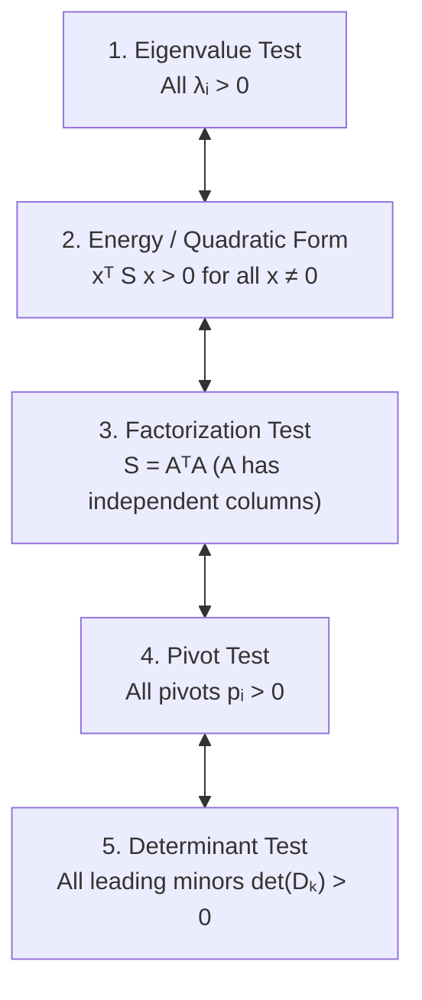

# 6. Eigenvalues and Eigenvectors

---

## Appendix / Previous Chapter Notes (From Page 1)

> [!NOTE] Tail of Chapter 5 Notes: Simplex Volume & Cavalieri's Principle
> - **Question Context:** The pyramids created by coordinate paths (Schläfli orthoschemes) are not quite the same as the standard simplex asked in the questions.
> 
> <!-- DIAGRAM PLACEHOLDER: Standard Simplex vs Schläfli Orthoscheme -->
> > [!NOTE] Diagram Placeholder: Standard Simplex vs. Schläfli Orthoscheme
> > **Handwritten Note Diagram (Page 1):**
> > - **Standard Simplex:** A 3D unit cube showing the standard corner simplex with vertices at $(0,0,0)$, $(1,0,0)$, $(0,1,0)$, and $(0,0,1)$.
> > - **Schläfli Orthoscheme (stretched out):** A 3D unit cube showing a path simplex along the main diagonal formed by connecting vertices along the coordinate axes paths.
> 
> - **Solution / Geometric Intuition:**
>   Although they are different polytopes, their volume is still the same using **Cavalieri's Principle**.
>   - $\text{Standard Simplex} \implies \text{has base area given by } \frac{1}{2}(1^2) \text{ and height is } 1$.
>   - $\text{Orthoscheme} \implies \text{has base area given by } \frac{1}{2}(1^2) \text{ and height is also } 1$.
>   - If two shapes have the same base area and height, then their volume is the same, even if one is a tilted or stretched version of the other.
> 
> <!-- DIAGRAM PLACEHOLDER: Cavalieri's Principle for Triangles -->
> > [!NOTE] Diagram Placeholder: Cavalieri's Principle (Sheared Triangles)
> > **Handwritten Note Diagram (Page 1):**
> > Two horizontal parallel dashed lines. Multiple triangles sharing the same horizontal base on the bottom line, with their third vertices located at different points along the top parallel line. All triangles share the same base length and vertical height $h$, illustrating equal area.
> 
> - In a similar way, we can move around the $4^{\text{th}}$ vertex of the pyramid: as long as the base is fixed and the perpendicular height is unchanged, the volume will not change.
>   *(Note: This is not a formal proof, just a geometric visualization).*

---

## 6.1 Introduction to Eigenvalues and Eigenvectors

### Definition
- **Eigenvectors** are vectors that do not change direction when multiplied by a matrix $A$. Here $A$ is an $n \times n$ square matrix.
- An eigenvector $x$ of matrix $A$ satisfies the fundamental equation:
  $$Ax = \lambda x \quad (x \ne 0)$$
- In the above equation, $\lambda$ is called the **eigenvalue** (i.e., the scaling factor).
- This means that even though $x$ does not change direction, its magnitude (and sign) might change.
- If $x$ is an eigenvector, then all non-zero scalar multiples of $x$ are also eigenvectors (i.e., all vectors along the line spanned by $x$ are eigenvectors too). This is evident from linearity:
  $$A(cx) = c(Ax) = c(\lambda x) = \lambda(cx)$$

---

## Basic Properties of Eigenvalues and Eigenvectors

### Property (i): Powers of a Matrix ($A^n$)
If $x$ is an eigenvector of $A$ with eigenvalue $\lambda$, then $x$ is also an eigenvector of every power $A^n$ with eigenvalue $\lambda^n$:
$$A^n x = \lambda^n x$$

---

### Property (ii): Characteristic Equation and Polynomial
If $A$ is an $n \times n$ matrix, it will have $n$ eigenvalues (counting algebraic multiplicities and complex roots). To find them, we rewrite the eigenvalue equation:
$$Ax = \lambda x \implies (A - \lambda I)x = 0$$

- Since eigenvectors must be non-zero ($x \ne 0$), $x$ lies in the nullspace $N(A - \lambda I)$.
- This requires the matrix $(A - \lambda I)$ to be singular (non-invertible), which means its determinant must vanish:
  $$\det(A - \lambda I) = 0$$

- Solving $\det(A - \lambda I) = 0$ yields the eigenvalues of $A$.
- $\det(A - \lambda I)$ is a polynomial of degree $n$ in $\lambda$, known as the **Characteristic Polynomial**.

---

### Property (iii): Diagonal Shift ($A - kI$)
If $\lambda$ is an eigenvalue of $A$ with eigenvector $x$, then the eigenvalue of $(A - kI)$ is $\lambda - k$ for the same eigenvector $x$.

- **Proof:**
  We use the fact that all non-zero vectors in $\mathbb{R}^n$ are eigenvectors of the identity matrix $I$ with eigenvalue $1$ ($Ix = x, \forall x \in \mathbb{R}^n$):
  $$(A - kI)x = Ax - kIx = \lambda x - kx = (\lambda - k)x$$
  $$\implies (A - kI)x = (\lambda - k)x$$

> [!NOTE] Invariance of Eigenvectors under Shift
> $A$ and $(A - kI)$ have the identical set of eigenvectors; only the eigenvalues shift by $-k$.

---

### Property (iv): Singular Matrices and $\lambda = 0$
If $A$ is singular, then $\lambda = 0$ is an eigenvalue of $A$.

- **Proof:**
  By definition of singularity, the nullspace $N(A)$ contains non-zero vectors ($Ax = 0$). Rewriting this:
  $$Ax = 0 = 0 \cdot x$$
  All non-zero vectors in $N(A)$ are eigenvectors corresponding to $\lambda = 0$.
- Hence, if $\text{rank}(A) = r$, then by the Rank-Nullity Theorem, there will be $(n - r)$ linearly independent basis vectors in $N(A)$. All of these, as well as their linear combinations, are eigenvectors corresponding to $\lambda = 0$.

---

> [!NOTE] Big Note: On the Number of Eigenvalues and Eigenvectors
> In point (ii), stating that an $n \times n$ matrix will always have $n$ eigenvalues and $n$ eigenvectors requires qualification:
> 1. $\det(A - \lambda I) = 0$ is an $n^{\text{th}}$-degree polynomial. By the Fundamental Theorem of Algebra, it always has exactly $n$ roots (eigenvalues) if we account for **repeated roots** (algebraic multiplicity) and **complex/imaginary roots**.
> 2. Regarding eigenvectors: while any scalar multiple of an eigenvector is an eigenvector (giving infinitely many eigenvectors along that 1D direction), an $n \times n$ matrix might not have $n$ *linearly independent* eigenvectors.
> 3. **Defective Matrix:** A matrix that fails to have $n$ linearly independent eigenvectors (i.e., when the total number of linearly independent eigenvectors is strictly less than $n$).

---

### Property (v): Finding Eigenvectors
To find the eigenvector(s) $x_i$ corresponding to a known eigenvalue $\lambda_i$, solve the homogeneous linear system:
$$(A - \lambda_i I)x_i = 0$$
That is, substitute $\lambda_i$ back into $(A - \lambda_i I)$ and find a basis for its nullspace $N(A - \lambda_i I)$.

---

## Determinant and Trace in Terms of Eigenvalues

### 1. Product of Eigenvalues Equals Determinant
The product of the $n$ eigenvalues equals the determinant of $A$:
$$\det(A) = \prod_{i=1}^n \lambda_i = \lambda_1 \lambda_2 \cdots \lambda_n$$

- **Proof (using Factor Theorem):**
  The characteristic polynomial $\det(A - \lambda I)$ of degree $n$ has leading coefficient $(-1)^n$ (from the product of the diagonal terms $(a_{ii} - \lambda)$). Factoring it over its roots $\lambda_1, \dots, \lambda_n$:
  $$\det(A - \lambda I) = (-1)^n (\lambda - \lambda_1)(\lambda - \lambda_2)\cdots(\lambda - \lambda_n)$$
  Setting $\lambda = 0$:
  $$\det(A - 0 \cdot I) = (-1)^n (-\lambda_1)(-\lambda_2)\cdots(-\lambda_n) = (-1)^n (-1)^n (\lambda_1 \lambda_2 \cdots \lambda_n)$$
  Since $(-1)^{2n} = 1$:
  $$\det(A) = \prod_{i=1}^n \lambda_i$$

---

### 2. Sum of Eigenvalues Equals Trace
The sum of the $n$ eigenvalues equals the trace of $A$ (the sum of elements along the main diagonal):
$$\text{Trace}(A) = \sum_{i=1}^n a_{ii} = \sum_{i=1}^n \lambda_i$$

- **Proof:**
  From the factored form of the characteristic polynomial:
  $$\det(A - \lambda I) = (-1)^n (\lambda - \lambda_1)(\lambda - \lambda_2)\cdots(\lambda - \lambda_n)$$
  The coefficient of $\lambda^{n-1}$ comes from choosing $\lambda$ from $(n-1)$ factors and $(-\lambda_i)$ from the remaining factor:
  $$\text{Coefficient of } \lambda^{n-1} = (-1)^n \left( - \sum_{i=1}^n \lambda_i \right) = (-1)^{n+1} \sum_{i=1}^n \lambda_i = (-1)^{n-1} \sum_{i=1}^n \lambda_i$$

  > [!WARNING] Mistake in Handwritten Notes
  > On Page 3 (bottom right), the handwritten notes write:
  > $$\text{coeff of } \lambda^{n-1} = (-1)^n (-(\lambda_1 + \dots + \lambda_n)\lambda)$$
  > Note that an extra factor of $\lambda$ was accidentally copied inside the expression for the coefficient. On Page 4 (top left), this is corrected to:
  > $$\text{coeff of } \lambda^{n-1} = (-1)^{n-1} \left(\sum \lambda_i\right) \quad (\because (-1)^n(-1) = (-1)^{n+1} = (-1)^{n-1})$$

  Now, looking at the expansion of the determinant formula directly:
  $$\det(A - \lambda I) = \begin{vmatrix} a_{11} - \lambda & a_{12} & \cdots & a_{1n} \\ a_{21} & a_{22} - \lambda & \cdots & a_{2n} \\ \vdots & \vdots & \ddots & \vdots \\ a_{n1} & a_{n2} & \cdots & a_{nn} - \lambda \end{vmatrix}$$
  In the Leibniz ("big formula") expansion of the determinant, the only permutation path that can produce powers of $\lambda^n$ and $\lambda^{n-1}$ is the main diagonal product:
  $$(a_{11} - \lambda)(a_{22} - \lambda)\cdots(a_{nn} - \lambda)$$
  Any other permutation involves at least two off-diagonal entries, contributing terms of degree at most $\lambda^{n-2}$.
  Expanding the diagonal product, the coefficient of $\lambda^{n-1}$ is:
  $$\text{Coefficient of } \lambda^{n-1} = (-1)^{n-1} (a_{11} + a_{22} + \cdots + a_{nn})$$
  Equating the two expressions for the coefficient of $\lambda^{n-1}$:
  $$(-1)^{n-1} \sum_{i=1}^n \lambda_i = (-1)^{n-1} \sum_{i=1}^n a_{ii} \implies \sum_{i=1}^n \lambda_i = \sum_{i=1}^n a_{ii} = \text{Trace}(A)$$

---

## Eigenvalues of $AB$ and $A + B$ & Commuting Matrices ($AB = BA$)

### Fallacy of Direct Product / Sum for General Matrices
- In general, if $\lambda$ is an eigenvalue of $A$ and $\beta$ is an eigenvalue of $B$, $\lambda \beta$ is **not** necessarily an eigenvalue of $AB$, nor is $\lambda + \beta$ an eigenvalue of $A + B$.
- Why the naive argument fails:
  $$(AB)x = A(Bx) = A(\beta x) = \beta (Ax) = \lambda \beta x$$
  This deduction is false in general because $x$ might be an eigenvector of $B$, but $x$ is generally **not** an eigenvector of $A$.
- However, if $x$ is simultaneously an eigenvector of both $A$ and $B$, then $\lambda \beta$ is indeed an eigenvalue of $AB$ with eigenvector $x$.

---

### Theorem: Commuting Matrices Share Eigenvectors
If two diagonalizable matrices $A$ and $B$ share the same complete set of $n$ linearly independent eigenvectors, then $AB = BA$ (they commute). Conversely, if $AB = BA$, then $A$ and $B$ share a common set of eigenvectors.

#### Proof: Part (i) Same Eigenvectors $\implies AB = BA$
Let $x_1, \dots, x_n$ be a common basis of eigenvectors for both $A$ and $B$, with $Ax_i = \lambda_i x_i$ and $Bx_i = \beta_i x_i$.
1. For any such eigenvector $x_i$:
   $$(AB)x_i = A(\beta_i x_i) = \beta_i A x_i = \lambda_i \beta_i x_i \quad \longrightarrow (1)$$
   $$(BA)x_i = B(\lambda_i x_i) = \lambda_i B x_i = \lambda_i \beta_i x_i \quad \longrightarrow (2)$$
2. Since the $n$ eigenvectors are linearly independent, they span $\mathbb{R}^n$. Any arbitrary vector $y \in \mathbb{R}^n$ can be expanded as:
   $$y = c_1 x_1 + c_2 x_2 + \cdots + c_n x_n$$
3. By linearity and equations (1) & (2):
   $$(AB)y = (BA)y \implies (AB - BA)y = 0 \implies y \in N(AB - BA)$$
4. Since this holds for every $y \in \mathbb{R}^n$, the nullspace is the entire space:
   $$N(AB - BA) = \mathbb{R}^n \implies C((AB - BA)^T) = \{0\} \implies AB - BA = 0 \implies AB = BA$$
   *(Alternative proof: Testing with the standard basis vectors $y = e_i$ shows that every column of $AB - BA$ is zero).*

#### Proof: Part (ii) $AB = BA \implies$ Shared Eigenvectors
Assume $AB = BA$. Let $v$ be an eigenvector of $A$ with eigenvalue $\lambda$ ($Av = \lambda v$).
$$A(Bv) = (AB)v = (BA)v = B(Av) = B(\lambda v) = \lambda (Bv)$$
$$\implies A(Bv) = \lambda (Bv)$$
This shows that $Bv$ is also an eigenvector of $A$ corresponding to the same eigenvalue $\lambda$ (or $Bv = 0$).

- **Case I: Distinct Eigenvalues (1D Eigenspaces):**
  If the eigenvalue $\lambda$ is non-repeated (multiplicity 1), its eigenspace is a 1-dimensional line. Since $Bv$ lies on that same line, $Bv$ must be a scalar multiple of $v$:
  $$Bv = \beta v$$
  Hence, $v$ is also an eigenvector of $B$.

- **Case II: Repeated Eigenvalues (Multi-dimensional Eigenspaces):**
  If $\lambda$ is repeated, the set of all eigenvectors with eigenvalue $\lambda$ forms a subspace $E_\lambda$ (the eigenspace).
  - For every $v \in E_\lambda$, $Bv \in E_\lambda$. Thus, $B$ maps the eigenspace $E_\lambda$ into itself ($E_\lambda$ is an **invariant subspace** under $B$).
  - If $B$ is diagonalizable, its restriction to the invariant subspace $E_\lambda$ is also diagonalizable. Therefore, we can choose a basis for $E_\lambda$ consisting of eigenvectors of $B$.
  - Doing this for each eigenspace yields a full set of $n$ independent eigenvectors shared by both $A$ and $B$.

---

## Problem Set 6.1 Solutions

### Problem 3: Eigenvalues of the Inverse Matrix $A^{-1}$
**Statement:** Let $A$ be invertible. Find the eigenvalues and eigenvectors of $A^{-1}$.
- For an eigenvector $x$ of $A$ with $Ax = \lambda x$ ($\lambda \ne 0$ since $A$ is invertible):
  $$(A^{-1} A)x = Ix = x$$
  $$(A^{-1} A)x = A^{-1}(Ax) = A^{-1}(\lambda x) = \lambda (A^{-1} x)$$
  $$\implies \lambda (A^{-1} x) = x \implies A^{-1} x = \frac{1}{\lambda} x$$
- **Conclusion:** $x$ is an eigenvector of $A^{-1}$ with eigenvalue $\frac{1}{\lambda}$.

---

### Problem 11: Columns of $(A - \lambda_1 I)$ for $2 \times 2$ Matrices
**Fact:** For a $2 \times 2$ matrix with distinct eigenvalues $\lambda_1 \ne \lambda_2$, the columns of $(A - \lambda_1 I)$ are multiples of the eigenvector $x_2$. Why?

- **Solution 1 (via Column Space):**
  $$(A - \lambda_1 I)x_2 = Ax_2 - \lambda_1 x_2 = \lambda_2 x_2 - \lambda_1 x_2 = (\lambda_2 - \lambda_1)x_2$$
  - Since $\lambda_1 \ne \lambda_2$, $(\lambda_2 - \lambda_1) \ne 0$. Thus, $x_2 = \frac{1}{\lambda_2 - \lambda_1}(A - \lambda_1 I)x_2$, which means $x_2$ lies in the column space $C(A - \lambda_1 I)$.
  - Since $A - \lambda_1 I$ is singular and non-zero, its column space is a 1-dimensional line.
  - Therefore, the columns of $(A - \lambda_1 I)$ must all be multiples of the eigenvector $x_2$.

- **Solution 2 (via Cayley-Hamilton Theorem):**
  The characteristic equation for the $2 \times 2$ matrix is $(\lambda - \lambda_1)(\lambda - \lambda_2) = 0$. By the Cayley-Hamilton theorem:
  $$(A - \lambda_2 I)(A - \lambda_1 I) = 0$$
  $$(A - \lambda_2 I) \Big( (A - \lambda_1 I)x \Big) = 0 \quad \forall x \in \mathbb{R}^n$$
  This means that every column of $(A - \lambda_1 I)$ lies in the nullspace of $(A - \lambda_2 I)$, which is precisely the 1D eigenspace spanned by $x_2$. (By symmetry, the columns of $A - \lambda_2 I$ are multiples of $x_1$).

---

### Problem 19: Properties of a $3 \times 3$ Matrix with Eigenvalues $0, 1, 2$
A $3 \times 3$ matrix $B$ has eigenvalues $\lambda = 0, 1, 2$.

- **(a) The rank of $B$:**
  $\text{rank}(B) = 2$.
  *(Since the eigenvalues are distinct, $B$ is diagonalizable. The number of non-zero eigenvalues equals the rank, so rank is 2; $\lambda = 0$ provides a 1-dimensional nullspace).*
- **(b) The determinant of $B^T B$:**
  $$\det(B^T B) = \det(B^T)\det(B) = (\det B)^2 = (0 \cdot 1 \cdot 2)^2 = 0$$
- **(c) The eigenvalues of $B^T B$:**
  **Not possible to determine.**
  *(The eigenvalues of $B^T B$ are the squares of the singular values $\sigma_i^2$, which depend on the specific entries/geometry of $B$, not solely on its eigenvalues, unless $B$ is symmetric or normal).*
- **(d) The eigenvalues of $(B^2 + I)^{-1}$:**
  If $\lambda$ is an eigenvalue of $B$, then the eigenvalue of $(B^2 + I)^{-1}$ is $\frac{1}{\lambda^2 + 1}$:
  - For $\lambda = 0 \implies \frac{1}{0^2 + 1} = 1$
  - For $\lambda = 1 \implies \frac{1}{1^2 + 1} = \frac{1}{2}$
  - For $\lambda = 2 \implies \frac{1}{2^2 + 1} = \frac{1}{5}$
  - **Eigenvalues:** $1, \frac{1}{2}, \frac{1}{5}$.

---

### Problem 20: Eigenvalues of $A$ and $A^T$
**Prove That:** The eigenvalues of $A$ and $A^T$ are the same.
- **Proof:**
  $\lambda$ is an eigenvalue of $A \iff \det(A - \lambda I) = 0$.
  Using the determinant property $\det(M) = \det(M^T)$:
  $$\det(A^T - \lambda I) = \det\left((A - \lambda I)^T\right) = \det(A - \lambda I) = 0$$
  Since $A$ and $A^T$ share the exact same characteristic polynomial, they have identical eigenvalues.

---

## 6.2 Diagonalizing a Matrix

### Derivation of $AX = X\Lambda$
Suppose an $n \times n$ matrix $A$ has $n$ linearly independent eigenvectors $x_1, x_2, \dots, x_n$. Put those eigenvectors into the columns of an **eigenvector matrix** $X$:
$$X = \begin{bmatrix} | & | & & | \\ x_1 & x_2 & \cdots & x_n \\ | & | & & | \end{bmatrix}$$
Since the columns are linearly independent, $X$ is invertible.

Multiplying $A$ by $X$ column by column:
$$AX = A \begin{bmatrix} x_1 & x_2 & \cdots & x_n \end{bmatrix} = \begin{bmatrix} Ax_1 & Ax_2 & \cdots & Ax_n \end{bmatrix} = \begin{bmatrix} \lambda_1 x_1 & \lambda_2 x_2 & \cdots & \lambda_n x_n \end{bmatrix}$$
Factoring into a matrix product:
$$AX = \begin{bmatrix} x_1 & x_2 & \cdots & x_n \end{bmatrix} \begin{bmatrix} \lambda_1 & 0 & \cdots & 0 \\ 0 & \lambda_2 & \cdots & 0 \\ \vdots & \vdots & \ddots & \vdots \\ 0 & 0 & \cdots & \lambda_n \end{bmatrix}$$
$$AX = X\Lambda$$

where $\Lambda$ (capital $\lambda$) is the diagonal **eigenvalue matrix** containing the eigenvalues on its main diagonal.

---

### Fundamental Diagonalization Formulas
From $AX = X\Lambda$, multiplying on the left by $X^{-1}$ or on the right by $X^{-1}$:

1. **Diagonalization Form:**
   $$X^{-1} A X = \Lambda$$
2. **Factorization Form:**
   $$A = X \Lambda X^{-1}$$

### Computing Matrix Powers ($A^k$)
The factorization $A = X \Lambda X^{-1}$ is powerful for computing powers of $A$:
$$A^k = (X\Lambda X^{-1})(X\Lambda X^{-1})\cdots(X\Lambda X^{-1}) = X \Lambda (X^{-1} X) \Lambda (X^{-1} X) \cdots \Lambda X^{-1}$$
$$A^k = X \Lambda^k X^{-1}$$
Since $\Lambda$ is diagonal, raising it to power $k$ simply raises each diagonal entry to power $k$:
$$\Lambda^k = \begin{bmatrix} \lambda_1^k & 0 & \cdots & 0 \\ 0 & \lambda_2^k & \cdots & 0 \\ \vdots & \vdots & \ddots & \vdots \\ 0 & 0 & \cdots & \lambda_n^k \end{bmatrix}$$

---

## Conditions for Diagonalizability

> [!IMPORTANT] Criterion for Diagonalizability
> A matrix $A$ is diagonalizable **if and only if** it has $n$ linearly independent eigenvectors.

### Case I: $n$ Distinct Eigenvalues
If an $n \times n$ matrix $A$ has $n$ distinct (different) eigenvalues, then its $n$ eigenvectors are automatically linearly independent, and $A$ is guaranteed to be diagonalizable.

- **Proof of Independence:**
  Let $x_1, \dots, x_n$ be eigenvectors corresponding to distinct eigenvalues $\lambda_1, \dots, \lambda_n$. Consider the linear combination:
  $$c_1 x_1 + c_2 x_2 + \cdots + c_n x_n = 0$$
  Multiply this equation by $A$:
  $$c_1 \lambda_1 x_1 + c_2 \lambda_2 x_2 + \cdots + c_n \lambda_n x_n = 0 \quad \longrightarrow (i)$$
  Multiply the original equation by $\lambda_n$:
  $$c_1 \lambda_n x_1 + c_2 \lambda_n x_2 + \cdots + c_n \lambda_n x_n = 0 \quad \longrightarrow (ii)$$
  Subtracting $(ii)$ from $(i)$ eliminates the $x_n$ term:
  $$c_1(\lambda_1 - \lambda_n)x_1 + c_2(\lambda_2 - \lambda_n)x_2 + \cdots + c_{n-1}(\lambda_{n-1} - \lambda_n)x_{n-1} = 0 \quad \longrightarrow (iii)$$
  Repeat the process: multiply $(iii)$ by $A$, multiply $(iii)$ by $\lambda_{n-1}$, and subtract to eliminate $x_{n-1}$:
  $$c_1(\lambda_1 - \lambda_n)(\lambda_1 - \lambda_{n-1})x_1 + \dots + c_{n-2}(\lambda_{n-2} - \lambda_n)(\lambda_{n-2} - \lambda_{n-1})x_{n-2} = 0 \quad \longrightarrow (iv)$$
  Continuing this elimination for all terms until only $x_1$ remains:
  $$c_1 (\lambda_1 - \lambda_n)(\lambda_1 - \lambda_{n-1})\cdots(\lambda_1 - \lambda_2)x_1 = 0$$
  Since all $\lambda_i$ are distinct, all difference factors $(\lambda_1 - \lambda_j) \ne 0$. Furthermore, $x_1 \ne 0$.
  Therefore, we must have:
  $$c_1 = 0$$
  Back-substituting successively yields $c_2 = 0, \dots, c_n = 0$. Hence, the eigenvectors $x_1, \dots, x_n$ are linearly independent.

### Case II: Repeated Eigenvalues
If eigenvalues are repeated, $A$ may or may not have $n$ independent eigenvectors:
- If it has $n$ independent eigenvectors, it is diagonalizable (e.g., the Identity matrix $I$).
- If it has fewer than $n$ independent eigenvectors, it is non-diagonalizable / defective (e.g., standard Jordan blocks $\begin{bmatrix} 0 & 1 \\ 0 & 0 \end{bmatrix}$).

> [!NOTE] Matching Order
> The order of eigenvalues along the diagonal of $\Lambda$ must strictly match the order of eigenvectors placed in the columns of $X$:
> $$AX = X\Lambda = \begin{bmatrix} x_1 & \cdots & x_n \end{bmatrix} \begin{bmatrix} \lambda_1 & & 0 \\ & \ddots & \\ 0 & & \lambda_n \end{bmatrix}$$

---

## Invertibility vs. Diagonalizability

> [!NOTE] Independence of Invertibility and Diagonalizability
> There is **no connection** between invertibility and diagonalizability:
> - **Invertibility** is about **eigenvalues**: $\lambda \ne 0$ ($\det A \ne 0$, zero is not an eigenvalue).
> - **Diagonalizability** is about **eigenvectors**: having a full set of $n$ linearly independent eigenvectors.
>
> | | Diagonalizable | Non-Diagonalizable (Defective) |
> |---|---|---|
> | **Invertible** ($\lambda_i \ne 0$) | $\begin{bmatrix} 1 & 0 \\ 0 & 2 \end{bmatrix}$ | $\begin{bmatrix} 1 & 1 \\ 0 & 1 \end{bmatrix}$ |
> | **Singular** (some $\lambda_i = 0$) | $\begin{bmatrix} 0 & 0 \\ 0 & 2 \end{bmatrix}$ | $\begin{bmatrix} 0 & 1 \\ 0 & 0 \end{bmatrix}$ |

---

## Similar Matrices: $B C B^{-1}$

### Families of Matrices with the Same Eigenvalues
If we fix the diagonal matrix $\Lambda$ and vary the invertible eigenvector matrix $X$, the product $A = X \Lambda X^{-1}$ produces an entire family of matrices that share the exact same eigenvalues $\Lambda$.

- Verifying that columns $x_i$ of $X$ are eigenvectors of $X\Lambda X^{-1}$:
  $$(X \Lambda X^{-1})x_i = X \Lambda (X^{-1} x_i) = X \Lambda e_i = X (\lambda_i e_i) = \lambda_i (X e_i) = \lambda_i x_i$$

---

### Definition and Properties of Similarity

> [!WARNING] Mistake in Handwritten Notes: Definition of Similar Matrices
> On Page 9 (top right), the handwritten notes state:
> *"Defn: Similar matrices have the same eigenvalues i.e A & C are similar if they have the same set of eigenvalues."*
> **Flag / Clarification:** Having the same eigenvalues is a *necessary* condition for similarity, not the definition!
> Two matrices are defined to be **similar** if there exists an invertible matrix $M$ such that $A = M C M^{-1}$.
> Sharing the same eigenvalues does not imply similarity: for example, $A = \begin{bmatrix} 1 & 1 \\ 0 & 1 \end{bmatrix}$ and $C = \begin{bmatrix} 1 & 0 \\ 0 & 1 \end{bmatrix}$ have the exact same eigenvalues $\{1, 1\}$, but they are not similar.

- **Theorem:** If $C$ is any matrix, then $B C B^{-1}$ (or $B^{-1} C B$) represents a similar matrix having the same eigenvalues as $C$.
- **Proof:**
  Let $\lambda$ be an eigenvalue of $C$ with eigenvector $v$ ($Cv = \lambda v$). Consider the vector $Bv$:
  $$(B C B^{-1})(Bv) = B C (B^{-1} B) v = B (Cv) = B (\lambda v) = \lambda (Bv)$$
  $$\implies (B C B^{-1})(Bv) = \lambda (Bv)$$
  Therefore, $\lambda$ is an eigenvalue of $B C B^{-1}$, and its corresponding eigenvector is $Bv$.
- *Note:* Writing $B^{-1} C B$ or $B C B^{-1}$ is equivalent since $(B^{-1})^{-1} = B$.

---

## Eigenvalues of $AB$ and $BA$ ("Wow Result")

### Theorem
If $A$ is an $m \times n$ matrix and $B$ is an $n \times m$ matrix, then $AB$ ($m \times m$) and $BA$ ($n \times n$) have the **same non-zero eigenvalues**. The difference in their dimensions is accounted for by $|n - m|$ additional zero eigenvalues.

### Proof via Block Matrix Similarity
Consider the following block matrices of size $(m+n) \times (m+n)$:
$$D = \begin{bmatrix} I_m & A \\ 0 & I_n \end{bmatrix}, \quad D^{-1} = \begin{bmatrix} I_m & -A \\ 0 & I_n \end{bmatrix}$$
Let:
$$E = \begin{bmatrix} AB & 0 \\ B & 0 \end{bmatrix}$$
Compute the similarity transformation $D^{-1} E D$:
$$D^{-1} E = \begin{bmatrix} I_m & -A \\ 0 & I_n \end{bmatrix} \begin{bmatrix} AB & 0 \\ B & 0 \end{bmatrix} = \begin{bmatrix} AB - AB & 0 \\ B & 0 \end{bmatrix} = \begin{bmatrix} 0 & 0 \\ B & 0 \end{bmatrix}$$
Now multiply by $D$:
$$D^{-1} E D = \begin{bmatrix} 0 & 0 \\ B & 0 \end{bmatrix} \begin{bmatrix} I_m & A \\ 0 & I_n \end{bmatrix} = \begin{bmatrix} 0 & 0 \\ B & BA \end{bmatrix} = F$$

- Since $E$ and $F = D^{-1} E D$ are similar matrices, they share the identical set of eigenvalues.
- Looking at the block triangular structure:
  - $E = \begin{bmatrix} AB & 0 \\ B & 0 \end{bmatrix}$ has eigenvalues of $AB$ together with $n$ zeros.
  - $F = \begin{bmatrix} 0 & 0 \\ B & BA \end{bmatrix}$ has eigenvalues of $BA$ together with $m$ zeros.
- Since $E$ and $F$ have the same eigenvalues, $AB$ and $BA$ must have the exact same non-zero eigenvalues, differing only by $|n - m|$ zero eigenvalues.

---

## Difference Equations and Matrix Powers ($u_k = A^k u_0$)

We can solve linear recurrence relations / vector difference equations $u_{k+1} = A u_k$ directly using diagonalization, avoiding the sequential computation of $u_1, u_2, \dots, u_k$:
$$u_k = A^k u_0$$

> [!WARNING] Mistake in Handwritten Notes: Indexing Typo
> On Page 10 (right column), the handwritten notes write:
> $$u_{k+1} = A u_k = A^k u_0$$
> and subsequently write $u_{k+1} = (X \Lambda^k X^{-1})u_0 = c_1 \lambda_1^k x_1 + \dots + c_n \lambda_n^k x_n$.
> This contains an off-by-one indexing error: $A^k u_0$ equals $u_k$, whereas $u_{k+1} = A^{k+1} u_0$. On Page 11, the notes correctly adopt $u_k = A^k u_0 = c_1 \lambda_1^k x_1 + \dots + c_n \lambda_n^k x_n$.

### Three-Step Solution Procedure:
1. **Step 1: Expand initial vector $u_0$ in the eigenvector basis:**
   $$u_0 = Xc = c_1 x_1 + c_2 x_2 + \cdots + c_n x_n \implies c = X^{-1} u_0$$
2. **Step 2: Apply the power of the diagonal eigenvalue matrix:**
   $$\Lambda^k c = \begin{bmatrix} \lambda_1^k c_1 \\ \lambda_2^k c_2 \\ \vdots \\ \lambda_n^k c_n \end{bmatrix}$$
3. **Step 3: Combine to find $u_k$:**
   $$u_k = X \Lambda^k X^{-1} u_0 = X (\Lambda^k c)$$
   $$u_k = c_1 \lambda_1^k x_1 + c_2 \lambda_2^k x_2 + \cdots + c_n \lambda_n^k x_n$$

---

## Application: Fibonacci Numbers

The Fibonacci sequence is defined by the second-order recurrence:
$$F_{k+2} = F_{k+1} + F_k, \quad \text{with } F_0 = 0, F_1 = 1$$

### Matrix Formulation
Define the state vector $u_k = \begin{bmatrix} F_{k+1} \\ F_k \end{bmatrix}$. Then:
$$u_{k+1} = \begin{bmatrix} F_{k+2} \\ F_{k+1} \end{bmatrix} = \begin{bmatrix} F_{k+1} + F_k \\ F_{k+1} \end{bmatrix} = \begin{bmatrix} 1 & 1 \\ 1 & 0 \end{bmatrix} \begin{bmatrix} F_{k+1} \\ F_k \end{bmatrix} = A u_k$$
where:
$$A = \begin{bmatrix} 1 & 1 \\ 1 & 0 \end{bmatrix}, \quad u_0 = \begin{bmatrix} F_1 \\ F_0 \end{bmatrix} = \begin{bmatrix} 1 \\ 0 \end{bmatrix}$$

- **Test Drive:**
  $$u_1 = A u_0 = \begin{bmatrix} 1 & 1 \\ 1 & 0 \end{bmatrix} \begin{bmatrix} 1 \\ 0 \end{bmatrix} = \begin{bmatrix} 1 \\ 1 \end{bmatrix} = \begin{bmatrix} F_2 \\ F_1 \end{bmatrix}$$
  $$u_2 = A u_1 = \begin{bmatrix} 1 & 1 \\ 1 & 0 \end{bmatrix} \begin{bmatrix} 1 \\ 1 \end{bmatrix} = \begin{bmatrix} 2 \\ 1 \end{bmatrix} = \begin{bmatrix} F_3 \\ F_2 \end{bmatrix}$$
  $$u_3 = A u_2 = \begin{bmatrix} 1 & 1 \\ 1 & 0 \end{bmatrix} \begin{bmatrix} 2 \\ 1 \end{bmatrix} = \begin{bmatrix} 3 \\ 2 \end{bmatrix} = \begin{bmatrix} F_4 \\ F_3 \end{bmatrix}$$

---

### Finding Eigenvalues and Eigenvectors of $A$
1. **Characteristic Equation:**
   $$\det(A - \lambda I) = \begin{vmatrix} 1 - \lambda & 1 \\ 1 & -\lambda \end{vmatrix} = -\lambda(1 - \lambda) - 1 = \lambda^2 - \lambda - 1 = 0$$
   $$\lambda_1 = \frac{1 + \sqrt{5}}{2} \approx 1.618 \quad (\text{Golden Ratio } \phi), \qquad \lambda_2 = \frac{1 - \sqrt{5}}{2} \approx -0.618$$

2. **Eigenvectors:**
   $$(A - \lambda I)x = \begin{bmatrix} 1 - \lambda & 1 \\ 1 & -\lambda \end{bmatrix} \begin{bmatrix} x_{\text{top}} \\ x_{\text{bot}} \end{bmatrix} = 0 \implies x_{\text{top}} - \lambda x_{\text{bot}} = 0 \implies x = \begin{bmatrix} \lambda \\ 1 \end{bmatrix}$$
   $$x_1 = \begin{bmatrix} \lambda_1 \\ 1 \end{bmatrix}, \qquad x_2 = \begin{bmatrix} \lambda_2 \\ 1 \end{bmatrix}$$

3. **Expressing $u_0$ in the Eigenvector Basis:**
   $$u_0 = \begin{bmatrix} 1 \\ 0 \end{bmatrix} = c_1 x_1 + c_2 x_2 = c_1 \begin{bmatrix} \lambda_1 \\ 1 \end{bmatrix} + c_2 \begin{bmatrix} \lambda_2 \\ 1 \end{bmatrix}$$
   From the second component: $c_1 + c_2 = 0 \implies c_2 = -c_1$.
   From the first component: $c_1 \lambda_1 + c_2 \lambda_2 = c_1(\lambda_1 - \lambda_2) = 1$:
   $$c_1 = \frac{1}{\lambda_1 - \lambda_2} = \frac{1}{\sqrt{5}}, \qquad c_2 = -\frac{1}{\lambda_1 - \lambda_2} = -\frac{1}{\sqrt{5}}$$
   $$u_0 = \frac{x_1 - x_2}{\lambda_1 - \lambda_2}$$

---

### Closed-Form Solution (Binet's Formula)
$$u_k = \begin{bmatrix} F_{k+1} \\ F_k \end{bmatrix} = \frac{\lambda_1^k x_1 - \lambda_2^k x_2}{\lambda_1 - \lambda_2} = \frac{1}{\lambda_1 - \lambda_2} \left( \lambda_1^k \begin{bmatrix} \lambda_1 \\ 1 \end{bmatrix} - \lambda_2^k \begin{bmatrix} \lambda_2 \\ 1 \end{bmatrix} \right)$$
Taking the bottom component for $F_k$:
$$F_k = \frac{\lambda_1^k - \lambda_2^k}{\lambda_1 - \lambda_2} = \frac{1}{\sqrt{5}} \left[ \left(\frac{1 + \sqrt{5}}{2}\right)^k - \left(\frac{1 - \sqrt{5}}{2}\right)^k \right]$$

### Growth Rate and Golden Ratio
- Since $|\lambda_2| \approx 0.618 < 1$, for large $k$, $\lambda_2^k \to 0$.
- Hence, $F_k$ is governed almost entirely by the dominant eigenvalue $\lambda_1$:
  $$F_k \approx \frac{1}{\sqrt{5}} \left(\frac{1 + \sqrt{5}}{2}\right)^k$$
- The ratio of consecutive Fibonacci numbers converges to the **Golden Ratio**:
  $$\lim_{k \to \infty} \frac{F_{k+1}}{F_k} = \lambda_1 = \frac{1 + \sqrt{5}}{2} \approx 1.618 : 1$$

---

## Non-Diagonalizable Matrices: AM vs. GM

There are two notions of multiplicity for an eigenvalue $\lambda$:

1. **Algebraic Multiplicity (AM):**
   The number of times $\lambda$ appears as a root of the characteristic polynomial $\det(A - \lambda I) = 0$.
2. **Geometric Multiplicity (GM):**
   The number of linearly independent eigenvectors associated with $\lambda$, which is the dimension of the nullspace of $(A - \lambda I)$:
   $$\text{GM} = \dim N(A - \lambda I) = n - \text{rank}(A - \lambda I)$$

> [!NOTE] Fundamental Multiplicity Theorem
> For every eigenvalue $\lambda$:
> $$\text{AM} \ge \text{GM} \ge 1$$
> - If $\text{GM} = \text{AM}$ for all eigenvalues, $A$ has a complete set of $n$ linearly independent eigenvectors and is **diagonalizable**.
> - If $\text{GM} < \text{AM}$ for any eigenvalue, there is a **shortage of eigenvectors**, and $A$ is **non-diagonalizable (defective)**.

---

## Problem Set 6.2 Solutions

### Problem 10: Every Third Fibonacci Number is Even
Prove that $F_{3k}$ is even for all integers $k \ge 1$.

- **Method 1 (Observation of Pattern):**
  Writing out the sequence with parity (Even/Odd):
  $$\begin{array}{ccccccccc}
  F_0 & F_1 & F_2 & F_3 & F_4 & F_5 & F_6 & F_7 & F_8 \\
  0 & 1 & 1 & 2 & 3 & 5 & 8 & 13 & 21 \\
  E & O & O & E & O & O & E & O & O
  \end{array}$$
  Since $O + O = E$, $O + E = O$, and $E + O = O$, the pattern $E, O, O$ repeats indefinitely every 3 steps.

- **Method 2 (Algebraic Proof via Binet's Formula):**
  $$F_{3k} = \frac{\lambda_1^{3k} - \lambda_2^{3k}}{\lambda_1 - \lambda_2} = \frac{(\lambda_1^3)^k - (\lambda_2^3)^k}{\lambda_1 - \lambda_2}$$
  Computing $\lambda_1^3$ and $\lambda_2^3$:
  $$\lambda_1^3 = \left(\frac{1 + \sqrt{5}}{2}\right)^3 = \frac{1 + 3\sqrt{5} + 15 + 5\sqrt{5}}{8} = \frac{16 + 8\sqrt{5}}{8} = 2 + \sqrt{5}$$
  $$\lambda_2^3 = \left(\frac{1 - \sqrt{5}}{2}\right)^3 = 2 - \sqrt{5}$$
  Substituting into the formula (with $\lambda_1 - \lambda_2 = \sqrt{5}$):
  $$F_{3k} = \frac{(2 + \sqrt{5})^k - (2 - \sqrt{5})^k}{\sqrt{5}}$$
  Expanding via the Binomial Theorem:
  $$(2 + \sqrt{5})^k = \sum_{j=0}^k \binom{k}{j} 2^{k-j} (\sqrt{5})^j, \qquad (2 - \sqrt{5})^k = \sum_{j=0}^k \binom{k}{j} 2^{k-j} (-\sqrt{5})^j$$
  Subtracting cancels all even powers of $\sqrt{5}$, leaving only odd powers doubled:
  $$(2 + \sqrt{5})^k - (2 - \sqrt{5})^k = 2 \left[ \binom{k}{1} 2^{k-1}(\sqrt{5})^1 + \binom{k}{3} 2^{k-3}(\sqrt{5})^3 + \binom{k}{5} 2^{k-5}(\sqrt{5})^5 + \cdots \right]$$
  Factoring out $\sqrt{5}$ and dividing by $\sqrt{5}$:
  $$F_{3k} = 2 \left[ \binom{k}{1} 2^{k-1} + \binom{k}{3} 2^{k-3}(5) + \binom{k}{5} 2^{k-5}(5^2) + \cdots \right] = 2 \times (\text{Integer})$$
  $$\implies F_{3k} \text{ is an even integer.}$$

---

### Problem 20: Determinant Formula via Diagonalization
For a diagonalizable matrix $A = X \Lambda X^{-1}$:
$$\det(A) = \det(X \Lambda X^{-1}) = \det(X) \det(\Lambda) \det(X^{-1}) = \det(X) \det(\Lambda) \frac{1}{\det(X)} = \det(\Lambda) = \lambda_1 \lambda_2 \cdots \lambda_n$$
*(Note: While this proof requires $A$ to be diagonalizable, the result $\det(A) = \prod \lambda_i$ holds generally for all square matrices via the characteristic polynomial).*

---

### Problem 21: Trace Identity $\text{Trace}(AB) = \text{Trace}(BA)$
- **Proof:**
  The $(i, i)$ entry of $AB$ is given by matrix multiplication:
  $$(AB)_{ii} = \sum_{j=1}^n a_{ij} b_{ji}$$
  Summing down the diagonal:
  $$\text{Trace}(AB) = \sum_{i=1}^n (AB)_{ii} = \sum_{i=1}^n \sum_{j=1}^n a_{ij} b_{ji}$$
  Similarly, for $BA$:
  $$(BA)_{jj} = \sum_{i=1}^n b_{ji} a_{ij} \implies \text{Trace}(BA) = \sum_{j=1}^n (BA)_{jj} = \sum_{j=1}^n \sum_{i=1}^n b_{ji} a_{ij}$$
  Since scalar multiplication commutes ($a_{ij} b_{ji} = b_{ji} a_{ij}$) and double sums can be interchanged:
  $$\text{Trace}(AB) = \text{Trace}(BA)$$

- **Application to $A = X \Lambda X^{-1}$:**
  Let $B = X\Lambda$ and $C = X^{-1}$. Then $A = BC$:
  $$\text{Trace}(A) = \text{Trace}(BC) = \text{Trace}(CB) = \text{Trace}(X^{-1} X \Lambda) = \text{Trace}(\Lambda) = \sum_{i=1}^n \lambda_i$$

---

### Note on $AB - BA = I$
> [!NOTE] Impossibility of $AB - BA = I$
> It is impossible for two $n \times n$ matrices to satisfy $AB - BA = I$.
> Taking the trace of both sides:
> $$\text{Trace}(AB - BA) = \text{Trace}(AB) - \text{Trace}(BA) = 0$$
> But the trace of the identity matrix is:
> $$\text{Trace}(I_n) = n \ne 0$$
> Since $0 \ne n$, no such matrices exist in finite dimensions.

---

### Problem 22: Diagonalizing a Block Diagonal Matrix
Given $A = X \Lambda X^{-1}$, diagonalize $B = \begin{bmatrix} A & 0 \\ 0 & 2A \end{bmatrix}$.

- **Solution:**
  Using block matrix multiplication:
  $$B = \begin{bmatrix} X & 0 \\ 0 & X \end{bmatrix} \begin{bmatrix} \Lambda & 0 \\ 0 & 2\Lambda \end{bmatrix} \begin{bmatrix} X^{-1} & 0 \\ 0 & X^{-1} \end{bmatrix}$$
  where the block eigenvalue matrix is $\begin{bmatrix} \Lambda & 0 \\ 0 & 2\Lambda \end{bmatrix}$ and the eigenvector matrix is $\begin{bmatrix} X & 0 \\ 0 & X \end{bmatrix}$.

---

### Problem 23: Subspace of Matrices Diagonalized by the Same $X$
Do all matrices that are diagonalized by the same eigenvector matrix $X$ form a subspace? What if $X = I$? What is the dimension?

- **Solution:**
  Let $\mathcal{S}_X = \{ A \mid A = X \Lambda X^{-1} \text{ for some diagonal matrix } \Lambda \}$.
  1. **Scalar Multiplication:** For any scalar $c$:
     $$cA = c(X \Lambda X^{-1}) = X (c\Lambda) X^{-1}$$
     Since $c\Lambda$ is diagonal, $cA \in \mathcal{S}_X$.
  2. **Addition:** For $A_1 = X \Lambda_1 X^{-1}$ and $A_2 = X \Lambda_2 X^{-1}$:
     $$A_1 + A_2 = X \Lambda_1 X^{-1} + X \Lambda_2 X^{-1} = X (\Lambda_1 + \Lambda_2) X^{-1}$$
     Since the sum of two diagonal matrices $(\Lambda_1 + \Lambda_2)$ is diagonal, $(A_1 + A_2) \in \mathcal{S}_X$.
  - Therefore, the set of matrices diagonalized by $X$ forms a **vector subspace**.
  - **Special Case $X = I$:**
    $$A = I \Lambda I^{-1} = \Lambda$$
    The matrices are simply all $n \times n$ diagonal matrices.
  - **Dimension:**
    A diagonal matrix in $\mathbb{R}^{n \times n}$ has $n$ free parameters along the diagonal. Thus, the dimension of the subspace is $n$ (for example, dimension $4$ in $\mathbb{R}^{4 \times 4}$).

---

### Problem 24: Projection Matrices ($A^2 = A$)
**Statement:** Show that every projection matrix ($A^2 = A$) is diagonalizable.
- If $Ax = \lambda x$, then $A^2 x = \lambda^2 x$. Since $A^2 = A$:
  $$\lambda^2 x = \lambda x \implies (\lambda^2 - \lambda)x = 0 \implies \lambda(\lambda - 1) = 0$$
  Hence, the only possible eigenvalues are $\lambda = 1$ and $\lambda = 0$.
- For $\lambda = 1$: $Ax = x \implies x \in C(A)$. There are $r = \text{rank}(A)$ linearly independent eigenvectors spanning the column space.
- For $\lambda = 0$: $Ax = 0 \implies x \in N(A)$. There are $n - r$ linearly independent eigenvectors spanning the nullspace.
- Total number of linearly independent eigenvectors:
  $$r + (n - r) = n$$
- Since $A$ has $n$ linearly independent eigenvectors, **every projection matrix is diagonalizable**.

---

### Problem 25: Column Space, Nullspace, and Diagonalizability
**Question:** If $\lambda \ne 0$, then $Ax = \lambda x \implies x \in C(A)$. If $\lambda = 0$, then $Ax = 0 \implies x \in N(A)$. Since $\dim C(A) + \dim N(A) = r + (n - r) = n$, why isn't every square matrix diagonalizable?

- **Solution:**
  Having dimensions add up to $n$ does not ensure $n$ independent eigenvectors because:
  - **Problem 1 (Subspace Overlap):** The column space $C(A)$ and the nullspace $N(A)$ might not be independent; they can overlap ($\dim(C(A) \cap N(A)) > 0$). In that case, $\dim(C(A) + N(A)) < n$.
    *(Example: For $A = \begin{bmatrix} 0 & 1 \\ 0 & 0 \end{bmatrix}$, $C(A) = \text{span}\left\{\begin{bmatrix} 1 \\ 0 \end{bmatrix}\right\}$ and $N(A) = \text{span}\left\{\begin{bmatrix} 1 \\ 0 \end{bmatrix}\right\}$, so they coincide).*
  - **Problem 2 (Shortage within $C(A)$):** While $N(A)$ always provides $n - r$ independent eigenvectors for $\lambda = 0$, $C(A)$ does not necessarily contain $r$ independent eigenvectors for non-zero eigenvalues.

---

### Problem 26: Square Root of a Matrix
From $A = X \Lambda X^{-1}$, the square root is defined as:
$$\sqrt{A} = X \sqrt{\Lambda} X^{-1}$$
where $\sqrt{\Lambda} = \text{diag}(\sqrt{\lambda_1}, \dots, \sqrt{\lambda_n})$.
If $A$ has any negative eigenvalue ($\lambda_i < 0$), then $\sqrt{\lambda_i}$ is imaginary, and $\sqrt{A}$ is a complex/imaginary matrix.

---

### Problem 27: Matrices with Identical Eigenvalues and Eigenvectors
If two diagonalizable matrices $A$ and $B$ share the exact same eigenvectors $X$ and the exact same eigenvalues $\Lambda$:
$$A = X \Lambda X^{-1}, \qquad B = X \Lambda X^{-1}$$
$$\implies X^{-1} A X = \Lambda = X^{-1} B X \implies A = B$$

---

### Problem 28: Commuting via Diagonalization
If $A$ and $B$ share the same eigenvector matrix $X$:
$$A = X \Lambda_1 X^{-1}, \qquad B = X \Lambda_2 X^{-1}$$
$$AB = (X \Lambda_1 X^{-1})(X \Lambda_2 X^{-1}) = X (\Lambda_1 \Lambda_2) X^{-1}$$
$$BA = (X \Lambda_2 X^{-1})(X \Lambda_1 X^{-1}) = X (\Lambda_2 \Lambda_1) X^{-1}$$
Since diagonal matrices commute ($\Lambda_1 \Lambda_2 = \Lambda_2 \Lambda_1$):
$$AB = BA$$

---

### Problem 30: Cayley-Hamilton Theorem
**Statement:** Every square matrix satisfies its own characteristic equation:
$$p(\lambda) = \det(\lambda I - A) = (\lambda - \lambda_1)(\lambda - \lambda_2)\cdots(\lambda - \lambda_n) = 0$$
$$\implies p(A) = (A - \lambda_1 I)(A - \lambda_2 I)\cdots(A - \lambda_n I) = 0 \quad (\text{the zero matrix})$$
This holds whether $A$ is diagonalizable or not.

- **Proof when $A$ is diagonalizable:**
  Substitute $A = X \Lambda X^{-1}$ into each factor $(A - \lambda_i I) = X (\Lambda - \lambda_i I) X^{-1}$:
  $$p(A) = X (\Lambda - \lambda_1 I)(\Lambda - \lambda_2 I)\cdots(\Lambda - \lambda_n I) X^{-1}$$
  The central product is a product of diagonal matrices:
  $$\Lambda - \lambda_i I = \begin{bmatrix} \lambda_1 - \lambda_i & & 0 \\ & \ddots & \\ 0 & & \lambda_n - \lambda_i \end{bmatrix}$$
  In the $i^{\text{th}}$ factor, the $i^{\text{th}}$ diagonal element is $\lambda_i - \lambda_i = 0$.
  When all $n$ diagonal matrices are multiplied together, every diagonal entry encounters at least one zero factor:
  $$\prod_{i=1}^n (\Lambda - \lambda_i I) = \begin{bmatrix} 0 & & 0 \\ & \ddots & \\ 0 & & 0 \end{bmatrix} = 0$$
  $$\implies p(A) = X \cdot 0 \cdot X^{-1} = 0$$

- **Generalization to Non-Diagonalizable Matrices:**
  Matrices with distinct eigenvalues are dense in the space of all matrices. Any non-diagonalizable matrix $A$ can be approached as the limit of a sequence of diagonalizable matrices $A_k \to A$. Since $p_k(A_k) = 0$ for all $k$, by continuity $p(A) = 0$.

---

## Schur's Theorem (Unitary/Orthogonal Triangularization)

### Statement

> [!WARNING] Mistake in Handwritten Notes: Statement of Schur's Theorem
> On Page 16 (left column), the notes write:
> *"St: If $A$ is a square real matrix with real eigen vectors then we can always find orthogonal matrix $Q$ and upper triangular matrix $T$, such that $A = Q T Q^T$."*
> **Flag / Correction:** The condition must be real **eigenvalues**, not real eigenvectors (if working over the real field $\mathbb{R}$). Over the complex field $\mathbb{C}$, Schur's theorem holds for *every* square matrix ($A = U T U^H$).

**Corrected Statement:** If $A$ is an $n \times n$ real matrix whose eigenvalues are all real, there exists an orthogonal matrix $Q$ ($Q^T Q = I$) and an upper triangular matrix $T$ such that:
$$A = Q T Q^T \quad \Longleftrightarrow \quad Q^T A Q = T$$

---

### Proof by Induction on Matrix Size $n$
- **Base Case ($n = 1$):** A $1 \times 1$ matrix is trivially upper triangular with $Q = [1]$.
- **Induction Hypothesis:** Assume the theorem holds for all $(n-1) \times (n-1)$ real matrices with real eigenvalues.
- **Induction Step (for size $n$):**
  1. Let $\lambda_1$ be a real eigenvalue of $A$, and let $q_1$ be a corresponding normalized eigenvector ($\|q_1\| = 1$):
     $$A q_1 = \lambda_1 q_1$$
  2. Complete $q_1$ to an orthonormal basis $\{q_1, q_2, \dots, q_n\}$ for $\mathbb{R}^n$ using Gram-Schmidt, and form the orthogonal matrix:
     $$Q_1 = \begin{bmatrix} | & | & & | \\ q_1 & q_2 & \cdots & q_n \\ | & | & & | \end{bmatrix}$$
  3. Compute $Q_1^T A Q_1$:
     - The first column is:
       $$Q_1^T A q_1 = Q_1^T (\lambda_1 q_1) = \lambda_1 (Q_1^T q_1) = \lambda_1 \begin{bmatrix} 1 \\ 0 \\ \vdots \\ 0 \end{bmatrix} = \begin{bmatrix} \lambda_1 \\ 0 \\ \vdots \\ 0 \end{bmatrix}$$
     - Therefore:
       $$Q_1^T A Q_1 = \begin{bmatrix} \lambda_1 & * \\ 0 & A_2 \end{bmatrix}$$
       where $A_2$ is an $(n-1) \times (n-1)$ submatrix.
  4. **Eigenvalues of $A_2$:**
     Using determinant properties:
     $$\det(A - \lambda I) = \det(Q_1^T(A - \lambda I)Q_1) = \det(Q_1^T A Q_1 - \lambda I)$$
     $$\det(Q_1^T A Q_1 - \lambda I) = \begin{vmatrix} \lambda_1 - \lambda & * \\ 0 & A_2 - \lambda I \end{vmatrix} = (\lambda_1 - \lambda) \det(A_2 - \lambda I)$$
     Hence, the remaining eigenvalues of $A$ ($\lambda_2, \dots, \lambda_n$) are precisely the eigenvalues of $A_2$. Since all eigenvalues of $A$ are real, all eigenvalues of $A_2$ are real.
  5. By the induction hypothesis, there exists an $(n-1) \times (n-1)$ orthogonal matrix $Q_2$ and an upper triangular matrix $T_2$ such that:
     $$A_2 = Q_2 T_2 Q_2^T$$
  6. Construct the full $n \times n$ orthogonal matrix $Q$:
     $$Q = Q_1 \begin{bmatrix} 1 & 0 \\ 0 & Q_2 \end{bmatrix}$$
     Then:
     $$Q^T A Q = \begin{bmatrix} 1 & 0 \\ 0 & Q_2^T \end{bmatrix} (Q_1^T A Q_1) \begin{bmatrix} 1 & 0 \\ 0 & Q_2 \end{bmatrix} = \begin{bmatrix} 1 & 0 \\ 0 & Q_2^T \end{bmatrix} \begin{bmatrix} \lambda_1 & * \\ 0 & A_2 \end{bmatrix} \begin{bmatrix} 1 & 0 \\ 0 & Q_2 \end{bmatrix}$$
     $$= \begin{bmatrix} \lambda_1 & * Q_2 \\ 0 & Q_2^T A_2 Q_2 \end{bmatrix} = \begin{bmatrix} \lambda_1 & * \\ 0 & T_2 \end{bmatrix} = T$$
     Since $T_2$ is upper triangular, $T$ is upper triangular.
     $$\implies A = Q T Q^T$$

---

## Symmetric Matrices and the Spectral Theorem

### Theorem 1: Real Eigenvalues
All eigenvalues of a real symmetric matrix $S$ ($S = S^T$) are real numbers.

- **Proof:**
  Let $Ax = \lambda x$ with $x \ne 0$ (where $x$ and $\lambda$ may initially be complex).
  Multiply on the left by the conjugate transpose $\bar{x}^T$:
  $$\bar{x}^T A x = \lambda \bar{x}^T x$$
  - The quantity $\bar{x}^T x = \sum |x_i|^2$ is strictly positive and real.
  - Now examine the scalar $z = \bar{x}^T A x$:
    $$\bar{z} = \overline{\bar{x}^T A x} = x^T \bar{A} \bar{x} = x^T A \bar{x} \quad (\because A \text{ is real, } \bar{A} = A)$$
    Since $\bar{z}$ is a $1 \times 1$ scalar, it equals its own transpose:
    $$\bar{z} = (\bar{z})^T = (x^T A \bar{x})^T = \bar{x}^T A^T x = \bar{x}^T A x = z \quad (\because A = A^T)$$
  - Since $\bar{z} = z$, the scalar $z$ has no imaginary part and is purely real.
  - Therefore:
    $$\lambda = \frac{\bar{x}^T A x}{\bar{x}^T x} = \frac{\text{real}}{\text{real}} \in \mathbb{R}$$
    All eigenvalues of a real symmetric matrix are real.

---

### Theorem 2: The Spectral Theorem ($S = Q \Lambda Q^T$)
Every real symmetric matrix can be diagonalized by an orthogonal matrix $Q$:
$$S = Q \Lambda Q^T$$
where the columns of $Q$ are $n$ mutually orthonormal eigenvectors of $S$.

- **Proof (from Schur's Theorem):**
  Since $S$ is real and all its eigenvalues are real, Schur's theorem guarantees:
  $$S = Q T Q^T$$
  for some orthogonal $Q$ and upper triangular $T$.
  Taking the transpose of both sides:
  $$S^T = (Q T Q^T)^T = (Q^T)^T T^T Q^T = Q T^T Q^T$$
  Since $S = S^T$:
  $$Q T Q^T = Q T^T Q^T \implies T = T^T$$
  An upper triangular matrix that equals its own transpose must be a **diagonal matrix**:
  $$T = \Lambda$$
  $$\implies S = Q \Lambda Q^T$$

---

### Orthogonality of Eigenvectors for Distinct Eigenvalues
If $\lambda_1 \ne \lambda_2$, their corresponding eigenvectors $x_1$ and $x_2$ are orthogonal ($x_1 \perp x_2$).

- **Proof (via Fundamental Subspaces):**
  $$(S - \lambda_1 I)x_1 = 0 \quad \text{and} \quad (S - \lambda_2 I)x_2 = 0$$
  - $x_2$ lies in the nullspace $N(S - \lambda_2 I)$.
  - Now consider $(S - \lambda_2 I)x_1$:
    $$(S - \lambda_2 I)x_1 = Sx_1 - \lambda_2 x_1 = \lambda_1 x_1 - \lambda_2 x_1 = (\lambda_1 - \lambda_2)x_1$$
    Since $\lambda_1 - \lambda_2 \ne 0$:
    $$x_1 = \frac{1}{\lambda_1 - \lambda_2}(S - \lambda_2 I)x_1 \in C(S - \lambda_2 I)$$
  - But $(S - \lambda_2 I)$ is symmetric, so its column space equals its row space:
    $$C(S - \lambda_2 I) = C((S - \lambda_2 I)^T) = \text{Row Space of } (S - \lambda_2 I)$$
  - From the Fundamental Theorem of Linear Algebra, the row space is orthogonal to the nullspace:
    $$\text{Row Space}(S - \lambda_2 I) \perp N(S - \lambda_2 I) \implies x_1 \perp x_2 \implies x_1^T x_2 = 0$$

---

## Positive Definite Matrices

A real symmetric matrix $S$ ($S = S^T$) is **positive definite** ($S > 0$) if it satisfies any of the following equivalent tests.

### Test 1: Eigenvalue Test
All eigenvalues of $S$ are strictly positive:
$$\lambda_i > 0 \quad \text{for all } i = 1, \dots, n$$
- Example: $S = \begin{bmatrix} 2 & 0 \\ 0 & 6 \end{bmatrix}$ has $\lambda_1 = 2 > 0$ and $\lambda_2 = 6 > 0$, so it is positive definite.
- Any orthogonally similar matrix $S' = Q S Q^T$ is also positive definite because it shares the same eigenvalues.

---

### Test 2: Energy-Based Definition (Quadratic Form)
The "energy" (quadratic form) is strictly positive for all non-zero vectors:
$$x^T S x > 0 \quad \text{for all } x \ne 0, x \in \mathbb{R}^n$$

- **Connection to Test 1:**
  1. If $x$ is an eigenvector with $Sx = \lambda x$:
     $$x^T S x = x^T (\lambda x) = \lambda x^T x = \lambda \|x\|^2 > 0 \quad (\because \lambda > 0, \|x\| > 0)$$
  2. For an arbitrary non-zero vector $x \in \mathbb{R}^n$, expand $x$ in the orthonormal eigenvector basis ($Q = [x_1 \ \cdots \ x_n]$):
     $$x = c_1 x_1 + c_2 x_2 + \cdots + c_n x_n$$
     $$x^T S x = (c_1 x_1^T + \cdots + c_n x_n^T)(c_1 \lambda_1 x_1 + \cdots + c_n \lambda_n x_n)$$
     Using orthonormality ($x_i^T x_j = 0$ for $i \ne j$, and $x_i^T x_i = 1$):
     $$x^T S x = c_1^2 \lambda_1 + c_2^2 \lambda_2 + \cdots + c_n^2 \lambda_n$$
     Since all $\lambda_i > 0$ and at least one $c_i \ne 0$, this sum is strictly positive:
     $$x^T S x > 0 \quad \forall x \ne 0$$

- **Property: Sum of Positive Definite Matrices:**
  If $S_1$ and $S_2$ are both positive definite, then $S_1 + S_2$ is also positive definite:
  $$x^T (S_1 + S_2) x = x^T S_1 x + x^T S_2 x > 0 \quad \forall x \ne 0$$

---

### Test 3: $S = A^T A$ Factorization
$S$ can be factored as $S = A^T A$ for some matrix $A$ having **linearly independent columns** (full column rank, $\text{rank}(A) = n$).

- **Proof via Test 2:**
  $$x^T S x = x^T (A^T A) x = (Ax)^T (Ax) = \|Ax\|^2$$
  Since the Euclidean norm squared $\|Ax\|^2 \ge 0$, the only condition needed for $\|Ax\|^2 > 0$ when $x \ne 0$ is:
  $$Ax \ne 0 \quad \forall x \ne 0 \iff N(A) = \{0\}$$
  This means $A$ must have linearly independent columns.

> [!NOTE] Positive Semi-Definite Matrices
> If the columns of $A$ are linearly dependent, then $S = A^T A$ is **positive semi-definite** ($S \ge 0$):
> $$x^T S x = \|Ax\|^2 \ge 0$$
> A semi-definite matrix allows the energy, eigenvalues, determinant, and pivots to be $\ge 0$ (some may be zero).
> Not all symmetric matrices can be factored as $A^T A$; if a matrix can be factored as $A^T A$, it is guaranteed to be at least positive semi-definite.

---

### Test 4: Leading Determinants Test (Sylvester's Criterion)
All $n$ **leading principal minors** (determinants of the upper-left $k \times k$ submatrices $D_k$) are strictly positive:
$$\det(D_k) > 0 \quad \text{for } k = 1, 2, \dots, n$$

---

### Test 5: Pivot Test
All $n$ pivots $p_1, p_2, \dots, p_n$ in Gaussian elimination (without row exchanges) are strictly positive:
$$p_k > 0 \quad \text{for all } k = 1, \dots, n$$

---

## Connection Between Pivots and Leading Determinants

Let $A = LU$ (where $L$ has $1$'s on the diagonal and $U$ has pivots $p_k$ on the diagonal).
Partition $A, L, U$ into blocks corresponding to the upper-left $k \times k$ submatrix:
$$\begin{bmatrix} D_k & * \\ * & * \end{bmatrix} = \begin{bmatrix} L_k & 0 \\ * & * \end{bmatrix} \begin{bmatrix} U_k & * \\ 0 & * \end{bmatrix}$$
Multiplying the upper-left blocks:
$$D_k = L_k U_k$$
Taking the determinant of both sides:
$$\det(D_k) = \det(L_k) \det(U_k) = (1) \cdot (p_1 p_2 \cdots p_k) = p_1 p_2 \cdots p_k$$
$$\det(D_k) = p_1 p_2 \cdots p_k$$

To express individual pivots in terms of determinants:
$$\det(D_{k-1}) = p_1 p_2 \cdots p_{k-1}$$
Dividing the two equations gives:
$$p_k = \frac{\det(D_k)}{\det(D_{k-1})} \quad (\text{with } \det(D_0) = 1)$$

- If all pivots are positive ($p_k > 0$), then all leading determinants are positive products of positive numbers.
- If all leading determinants are positive ($\det(D_k) > 0$), then each pivot $p_k = \frac{\det(D_k)}{\det(D_{k-1})} > 0$ is positive.

> [!WARNING] Mistake in Handwritten Notes: Signs of Determinants
> On Page 21 (left column), the notes write:
> *"If the pivots are positive, then so are the determinants, if pivots are '0', then so are the determinants & if pivots are negative then so are the determinants."*
> **Flag / Correction:** If pivots are negative, the determinants do **not** simply become negative. Since $\det(D_k) = p_1 p_2 \cdots p_k$, a product of an even number of negative pivots is **positive**, while an odd number is **negative**. Thus, alternating signs in leading determinants $\det(D_k)$ indicate negative definiteness, not all negative determinants.

---

## Equivalence of Pivots/Determinants to $A^T A$ (Cholesky Factorization)

For any symmetric matrix $S$, Gaussian elimination produces the symmetric factorization:
$$S = L D L^T$$
where $L$ is unit lower triangular and $D = \text{diag}(p_1, \dots, p_n)$ contains the pivots.

If all pivots are strictly positive ($p_k > 0$), we can take the square root matrix $\sqrt{D} = \text{diag}(\sqrt{p_1}, \dots, \sqrt{p_n})$:
$$S = L \sqrt{D} \sqrt{D} L^T = (L \sqrt{D})(L \sqrt{D})^T = A^T A$$
where $A = \sqrt{D} L^T$ is an upper triangular matrix with positive diagonal entries $\sqrt{p_k}$.

- Since all $\sqrt{p_k} > 0$, $A$ is invertible (full column rank).
- This proves that positive pivots $\implies S = A^T A \implies$ positive definite.

---

### Two Primary Ways to Factor $S = A^T A$
1. **Symmetric Factorization (via Spectral Theorem):**
   Using $S = Q \Lambda Q^T$, choose:
   $$A = Q \sqrt{\Lambda} Q^T$$
   Then $A^T = (Q \sqrt{\Lambda} Q^T)^T = Q \sqrt{\Lambda} Q^T = A$ is symmetric, and $A^T A = A^2 = S$.
2. **Triangular Factorization (Cholesky Factorization):**
   Using $S = L D L^T$, choose:
   $$A = \sqrt{D} L^T$$
   Then $A$ is upper triangular with positive diagonal elements, and $A^T A = (L\sqrt{D})(\sqrt{D}L^T) = S$.

---

## Summary: The 5 Tests for Positive Definiteness

For any real symmetric matrix $S = S^T$, the following five conditions are completely equivalent. If any one test passes, all pass (and $S$ is positive definite); if any test fails, all fail:

> [!TIP] The Unifying Concept
> Each test provides a decisive, self-contained answer (positive definite, semi-definite, or neither).
> The **Energy-based definition ($x^T S x > 0$)** is the fundamental conceptual core of linear algebra that connects them all.
